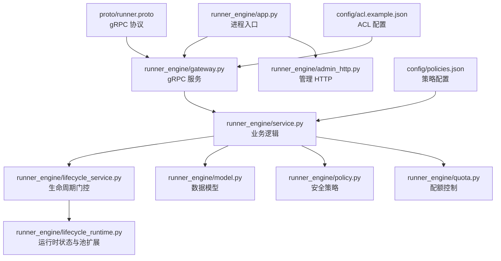
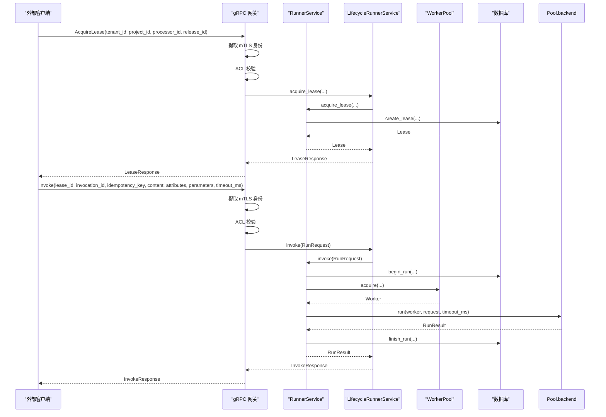
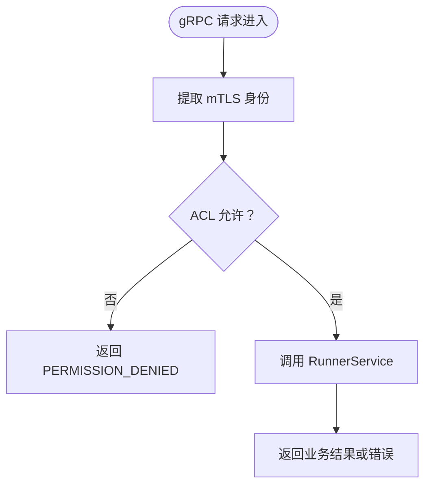
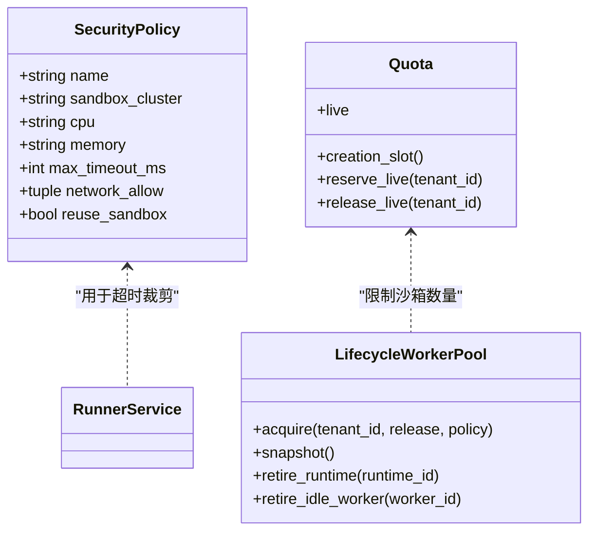
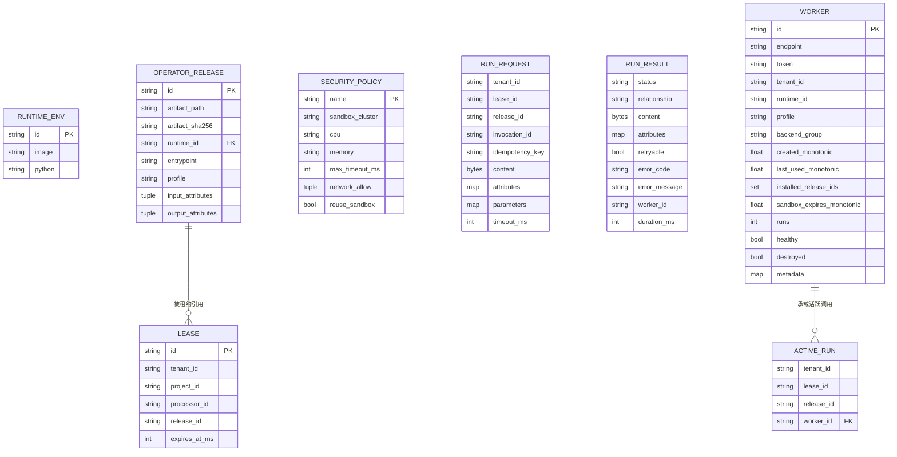

# API 参考文档

<cite>
**本文引用的文件**   
- [proto/runner.proto](file://proto/runner.proto)
- [runner_engine/app.py](file://runner_engine/app.py)
- [runner_engine/gateway.py](file://runner_engine/gateway.py)
- [runner_engine/service.py](file://runner_engine/service.py)
- [runner_engine/lifecycle_service.py](file://runner_engine/lifecycle_service.py)
- [runner_engine/admin_http.py](file://runner_engine/admin_http.py)
- [runner_engine/model.py](file://runner_engine/model.py)
- [runner_engine/errors.py](file://runner_engine/errors.py)
- [runner_engine/policy.py](file://runner_engine/policy.py)
- [runner_engine/quota.py](file://runner_engine/quota.py)
- [runner_engine/lifecycle_runtime.py](file://runner_engine/lifecycle_runtime.py)
- [config/acl.example.json](file://config/acl.example.json)
- [config/policies.json](file://config/policies.json)
- [scripts/generate_proto.py](file://scripts/generate_proto.py)
- [nifi/managed-python-processors/src/main/java/com/dsc/nifi/GrpcManagedPythonRuntimeService.java](file://nifi/managed-python-processors/src/main/java/com/dsc/nifi/GrpcManagedPythonRuntimeService.java)
</cite>

## 目录
1. [简介](#简介)
2. [项目结构](#项目结构)
3. [核心组件](#核心组件)
4. [架构总览](#架构总览)
5. [详细接口说明](#详细接口说明)
6. [依赖与配置分析](#依赖与配置分析)
7. [性能与容量规划](#性能与容量规划)
8. [故障排查指南](#故障排查指南)
9. [结论](#结论)
10. [附录：客户端实现与测试建议](#附录客户端实现与测试建议)

## 简介
本文件为 Runner Engine 的 API 参考文档，覆盖以下范围：
- gRPC API：服务定义、消息格式、认证与授权、错误码映射。
- RESTful 管理接口：健康检查、运行时观测、镜像退役流程、空闲沙箱回收。
- 数据模型、枚举与常量：租户、项目、租约、调用、策略、配额等。
- 安全机制：mTLS 双向认证、ACL 访问控制、管理员令牌。
- 版本与兼容性：gRPC 包名与版本号、向后兼容注意事项。
- 速率限制与容量：配额、并发、消息大小限制。
- 常见用例、调试工具与集成示例：NiFi Java 客户端、运维脚本思路。

Runner Engine 提供受管 Python 算子的执行能力，通过 gRPC 对外暴露生命周期与调用接口，并通过本地 HTTP 暴露运维管理能力。生产部署强制使用 mTLS，禁止明文传输。

## 项目结构
Runner Engine 的核心入口位于 `runner_engine/app.py`，负责解析参数、加载策略与 ACL、初始化数据库、工作池、服务层，并启动 gRPC 与管理 HTTP 服务。gRPC 协议定义在 `proto/runner.proto`，由 `scripts/generate_proto.py` 生成 Python stub。

**图表来源**
- [runner_engine/app.py:26-227](file://runner_engine/app.py#L26-L227)
- [runner_engine/gateway.py:44-194](file://runner_engine/gateway.py#L44-L194)
- [runner_engine/admin_http.py:14-190](file://runner_engine/admin_http.py#L14-L190)
- [runner_engine/service.py:80-456](file://runner_engine/service.py#L80-L456)
- [runner_engine/lifecycle_service.py:7-71](file://runner_engine/lifecycle_service.py#L7-L71)
- [runner_engine/lifecycle_runtime.py:14-397](file://runner_engine/lifecycle_runtime.py#L14-L397)
- [proto/runner.proto:1-76](file://proto/runner.proto#L1-L76)
- [config/acl.example.json:1-9](file://config/acl.example.json#L1-L9)
- [config/policies.json:1-19](file://config/policies.json#L1-L19)

**章节来源**
- [runner_engine/app.py:26-227](file://runner_engine/app.py#L26-L227)
- [scripts/generate_proto.py:1-21](file://scripts/generate_proto.py#L1-L21)

## 核心组件
- gRPC 服务网关：负责 mTLS 认证、身份提取、ACL 校验、RunnerError 到 gRPC 状态码映射。
- 业务服务：租约管理、幂等执行、属性过滤与校验、超时裁剪、结果持久化、后台清理。
- 生命周期服务：在租约获取、续租、调用前检查运行时是否处于 RETIRING/RETIRED。
- 管理 HTTP：健康检查、运行时快照、镜像退役流程、空闲沙箱回收。
- 数据模型：运行时环境、算子发布、安全策略、租约、请求与结果、工作节点、活跃调用。
- 策略与配额：按 profile 限制最大超时、网络白名单、沙箱复用；全局与租户级配额。
- 错误体系：统一 RunnerError 及其子类，携带错误码与可重试标记。

**章节来源**
- [runner_engine/gateway.py:12-194](file://runner_engine/gateway.py#L12-L194)
- [runner_engine/service.py:15-456](file://runner_engine/service.py#L15-L456)
- [runner_engine/lifecycle_service.py:7-71](file://runner_engine/lifecycle_service.py#L7-L71)
- [runner_engine/admin_http.py:14-190](file://runner_engine/admin_http.py#L14-L190)
- [runner_engine/model.py:7-98](file://runner_engine/model.py#L7-L98)
- [runner_engine/policy.py:9-25](file://runner_engine/policy.py#L9-L25)
- [runner_engine/quota.py:9-61](file://runner_engine/quota.py#L9-L61)
- [runner_engine/errors.py:1-22](file://runner_engine/errors.py#L1-L22)

## 架构总览
Runner Engine 采用“gRPC 业务接口 + 本地管理 HTTP”的双通道设计：
- 外部系统（如 NiFi）通过 gRPC 调用 ManagedPythonRunner 服务，完成租约申请、调用执行、取消与释放。
- 运维人员或编排系统通过本地管理 HTTP 进行运行时观测、镜像退役与沙箱回收。
- 所有 gRPC 通信强制 mTLS，服务端从 TLS 上下文提取客户端证书主题信息作为 identity，再依据 ACL 判断是否允许访问指定 tenant/project。
- 业务逻辑在服务层集中处理，结合策略与配额对资源进行约束，并通过数据库持久化租约、幂等键与运行记录。

**图表来源**
- [runner_engine/gateway.py:98-177](file://runner_engine/gateway.py#L98-L177)
- [runner_engine/lifecycle_service.py:34-70](file://runner_engine/lifecycle_service.py#L34-L70)
- [runner_engine/service.py:146-405](file://runner_engine/service.py#L146-L405)

## 详细接口说明

### gRPC API：ManagedPythonRunner
- 包名：dsc.runner.v33
- 服务：ManagedPythonRunner
- 传输：gRPC over TLS（mTLS），禁止明文
- 版本：HealthResponse.version 返回 “3.3.0”，proto 包名为 v33

#### 通用认证与授权
- 认证：mTLS 双向认证，服务端从 gRPC context 读取 x509_subject_alternative_name 或 x509_common_name 作为 identity。
- 授权：AccessControl 将 identity 映射到允许的 tenant/project 列表，支持通配符项目。
- 错误映射：
  - UNAUTHENTICATED → UNAUTHENTICATED
  - FORBIDDEN/CANCEL_FORBIDDEN → PERMISSION_DENIED
  - RELEASE_NOT_FOUND/LEASE_UNKNOWN → NOT_FOUND
  - retryable=True → UNAVAILABLE
  - 其他 → FAILED_PRECONDITION

#### 方法清单
- Health
  - 用途：健康检查
  - 请求：HealthRequest（空）
  - 响应：HealthResponse.ok、version
  - 认证：需要 mTLS 身份
- AcquireLease
  - 用途：申请执行租约
  - 请求：AcquireLeaseRequest.tenant_id、project_id、processor_id、release_id
  - 响应：LeaseResponse.lease_id、expires_at_epoch_ms
  - 授权：identity 必须被允许访问 tenant_id 与 project_id
- RenewLease
  - 用途：续租
  - 请求：RenewLeaseRequest.tenant_id、lease_id
  - 响应：LeaseResponse.lease_id、expires_at_epoch_ms
  - 授权：identity 必须被允许访问 lease 对应的项目
- Invoke
  - 用途：执行算子
  - 请求：InvokeRequest.tenant_id、lease_id、release_id、invocation_id、idempotency_key、content、attributes、parameters、timeout_ms
  - 响应：InvokeResponse.status、relationship、content、attributes、retryable、error_code、error_message、worker_id、duration_ms
  - 授权：identity 必须被允许访问 lease 对应的项目
  - 限制：
    - 内联内容上限：8 MiB
    - 属性数量上限：128
    - 属性字节总量上限：64 KiB
    - 超时会被裁剪到策略 max_timeout_ms
- Cancel
  - 用途：取消正在执行的调用
  - 请求：CancelRequest.tenant_id、lease_id、invocation_id
  - 响应：CancelResponse.cancelled
  - 授权：identity 必须被允许访问 lease 对应的项目
- ReleaseLease
  - 用途：释放租约
  - 请求：ReleaseLeaseRequest.tenant_id、lease_id
  - 响应：ReleaseLeaseResponse.released
  - 授权：identity 必须被允许访问 lease 对应的项目

#### 消息与字段说明
- HealthRequest：无字段
- HealthResponse：ok、version
- AcquireLeaseRequest：tenant_id、project_id、processor_id、release_id
- RenewLeaseRequest：tenant_id、lease_id
- LeaseResponse：lease_id、expires_at_epoch_ms
- InvokeRequest：tenant_id、lease_id、release_id、invocation_id、idempotency_key、content、attributes、parameters、timeout_ms
- InvokeResponse：status、relationship、content、attributes、retryable、error_code、error_message、worker_id、duration_ms
- CancelRequest：tenant_id、lease_id、invocation_id
- CancelResponse：cancelled
- ReleaseLeaseRequest：tenant_id、lease_id
- ReleaseLeaseResponse：released

**章节来源**
- [proto/runner.proto:1-76](file://proto/runner.proto#L1-L76)
- [runner_engine/gateway.py:33-194](file://runner_engine/gateway.py#L33-L194)

### RESTful 管理接口
管理接口仅在启用 RUNNER_ADMIN_TOKEN 时启动，默认监听 127.0.0.1:9444。所有接口均要求 Authorization: Bearer <token>。

- GET /health
  - 用途：管理接口健康检查
  - 成功：200，{"ok": true, "service": "runner-admin"}
  - 未认证：401
- GET /v1/observe/runtime
  - 用途：运行时快照
  - 成功：200，包含活跃调用、空闲工作节点、按运行时分组的 acquiring 计数、生命周期历史
  - 未认证：401
- GET /v1/admin/runtime-images/status?imageRef=...
  - 用途：查询镜像生命周期状态、引用发布、租约与沙箱情况
  - 成功：200，包含 runtimeId、lifecycleState、releases、activeInvocationCount、idleWorkers、managedSandboxes、safeForArtifactDeletion 等
  - 未认证：401
- POST /v1/admin/runtime-images/retire
  - 用途：开始镜像退役
  - 请求体：imageRef、reason（至少 5 字符）
  - 成功：200，返回镜像状态与已退役空闲 workerId 列表
  - 未认证：401
- POST /v1/admin/runtime-images/cancel-retirement
  - 用途：取消镜像退役
  - 请求体：imageRef
  - 成功：200，返回 cancelled、imageRef、lifecycleState
  - 未认证：401
- POST /v1/admin/runtime-images/finalize-retirement
  - 用途：完成镜像退役（需满足 safeForArtifactDeletion）
  - 请求体：imageRef
  - 成功：200，返回最终 lifecycleState 与 safeForArtifactDeletion=false
  - 未认证：401
- POST /v1/admin/sandboxes/retire-idle
  - 用途：回收指定空闲 worker
  - 请求体：workerId
  - 成功：200，返回 retired=true、workerId
  - 未认证：401

注意：
- 请求体大小限制：256 KiB
- 参数缺失或非法会返回 400
- 业务冲突返回 409
- 内部异常返回 500

**章节来源**
- [runner_engine/admin_http.py:14-190](file://runner_engine/admin_http.py#L14-L190)
- [runner_engine/lifecycle_runtime.py:187-397](file://runner_engine/lifecycle_runtime.py#L187-L397)

## 依赖与配置分析

### 安全与访问控制
- mTLS：服务端使用 grpc.ssl_server_credentials，require_client_auth=true，并从 context 提取 x509_subject_alternative_name 或 x509_common_name。
- ACL：AccessControl.from_json 加载 acl.json，将 identity 映射到 tenant→projects 列表，支持 "*" 表示允许该租户下所有项目。
- 管理员令牌：RUNNER_ADMIN_TOKEN 非空时启用管理 HTTP，Authorization 头必须为 Bearer token。

**图表来源**
- [runner_engine/gateway.py:33-96](file://runner_engine/gateway.py#L33-L96)
- [runner_engine/gateway.py:179-194](file://runner_engine/gateway.py#L179-L194)

**章节来源**
- [runner_engine/gateway.py:12-96](file://runner_engine/gateway.py#L12-L96)
- [config/acl.example.json:1-9](file://config/acl.example.json#L1-L9)
- [runner_engine/admin_http.py:35-40](file://runner_engine/admin_http.py#L35-L40)

### 策略与配额
- 策略：policies.json 定义 profile 名称、sandbox_cluster、cpu、memory、max_timeout_ms、network_allow、reuse_sandbox。
- 配额：Quota 维护全局与租户级 live sandbox 上限，以及创建并发上限。
- 运行时生命周期：LifecycleWorkerPool 在 acquire 前检查运行时是否处于 retiring，阻止新沙箱分配。

**图表来源**
- [runner_engine/model.py:27-35](file://runner_engine/model.py#L27-L35)
- [runner_engine/quota.py:9-61](file://runner_engine/quota.py#L9-L61)
- [runner_engine/lifecycle_runtime.py:14-121](file://runner_engine/lifecycle_runtime.py#L14-L121)

**章节来源**
- [runner_engine/policy.py:9-25](file://runner_engine/policy.py#L9-L25)
- [runner_engine/quota.py:9-61](file://runner_engine/quota.py#L9-L61)
- [runner_engine/lifecycle_runtime.py:14-121](file://runner_engine/lifecycle_runtime.py#L14-L121)
- [config/policies.json:1-19](file://config/policies.json#L1-L19)

### 数据模型
- RuntimeEnv：运行时标识、镜像、Python 版本
- OperatorRelease：发布标识、制品路径与摘要、运行时、入口点、profile、输入输出属性白名单
- SecurityPolicy：安全策略
- Lease：租约标识、租户、项目、处理器、发布、过期时间
- RunRequest：调用请求
- RunResult：调用结果
- Worker：工作节点元数据与状态
- ActiveRun：当前活跃调用与工作节点绑定

**图表来源**
- [runner_engine/model.py:7-98](file://runner_engine/model.py#L7-L98)

**章节来源**
- [runner_engine/model.py:7-98](file://runner_engine/model.py#L7-L98)

## 性能与容量规划

### 关键限制
- gRPC 消息大小：接收与发送上限均为 10 MiB
- 内联内容上限：8 MiB
- 属性数量上限：128
- 属性字节总量上限：64 KiB
- 管理接口请求体上限：256 KiB
- 工作线程数：gRPC server 默认 32 个 worker

### 容量参数
- 创建并发：RUNNER_MAX_CREATING（默认 8）
- 在线沙箱总数：RUNNER_MAX_LIVE（默认 64）
- 单租户在线沙箱上限：RUNNER_MAX_LIVE_PER_TENANT（默认 16）
- 每沙箱安装发布上限：RUNNER_MAX_RELEASES_PER_SANDBOX（默认 256）
- 租约 TTL：RUNNER_LEASE_TTL_MS（默认 15 分钟）
- 幂等保留期：RUNNER_IDEMPOTENCY_RETENTION_MS（默认 7 天）
- 运行记录保留期：RUNNER_RUN_RETENTION_MS（默认 90 天）
- 后台清理间隔：RUNNER_REAPER_INTERVAL_SECONDS（默认 30 秒）

### 优化建议
- 合理设置策略中的 max_timeout_ms，避免长耗时任务阻塞工作节点。
- 使用幂等键避免重复提交导致的多份执行。
- 控制 attributes 与 parameters 的大小，避免触发属性限制。
- 根据租户负载调整 quota 参数，防止单租户独占资源。
- 利用生命周期管理，逐步退役旧镜像，减少不活跃沙箱占用。

**章节来源**
- [runner_engine/gateway.py:184-194](file://runner_engine/gateway.py#L184-L194)
- [runner_engine/service.py:15-21](file://runner_engine/service.py#L15-L21)
- [runner_engine/service.py:188-235](file://runner_engine/service.py#L188-L235)
- [runner_engine/admin_http.py:11](file://runner_engine/admin_http.py#L11)
- [runner_engine/app.py:97-153](file://runner_engine/app.py#L97-L153)

## 故障排查指南

### 常见错误与处理
- UNAUTHENTICATED：mTLS 身份缺失或证书不受信任。检查客户端证书与 CA。
- PERMISSION_DENIED：ACL 不允许该 identity 访问目标 tenant/project。检查 acl.json。
- NOT_FOUND：租约或发布不存在。检查 lease_id 与 release_id。
- UNAVAILABLE：业务标记为可重试的错误，例如运行时正在退役。稍后重试。
- FAILED_PRECONDITION：前置条件不满足，例如未知策略、属性超限、内容过大。
- CANCEL_FAILED：取消失败，可能由于底层传输异常。可重试。
- RUNTIME_RETIRING/RUNTIME_RETIRED：运行时不可接受新执行。等待退役完成或切换镜像。

### 诊断步骤
- 使用管理接口 /health 确认管理面可用。
- 使用 /v1/observe/runtime 查看活跃调用与空闲工作节点。
- 使用 /v1/admin/runtime-images/status 检查镜像生命周期与关联发布、租约、沙箱。
- 若出现 QUOTA 相关错误，检查全局与租户级配额是否耗尽。
- 若出现策略相关错误，检查 policies.json 中 profile 是否存在且匹配发布。

**章节来源**
- [runner_engine/gateway.py:67-96](file://runner_engine/gateway.py#L67-L96)
- [runner_engine/service.py:188-405](file://runner_engine/service.py#L188-L405)
- [runner_engine/lifecycle_service.py:19-32](file://runner_engine/lifecycle_service.py#L19-L32)
- [runner_engine/admin_http.py:73-169](file://runner_engine/admin_http.py#L73-L169)

## 结论
Runner Engine 通过严格的 mTLS 与 ACL 机制保障安全，以 gRPC 暴露稳定的生命周期与调用接口，并通过管理 HTTP 提供运维能力。服务层集中处理幂等、属性校验、策略裁剪与配额限制，确保执行过程可控、可观测、可恢复。建议在部署时明确策略与配额，配合生命周期管理逐步演进镜像版本，并结合管理接口进行日常监控与排障。

## 附录：客户端实现与测试建议

### gRPC 客户端要点
- 使用 mTLS：配置 CA、客户端证书与私钥。
- 设置消息大小：与服务端一致，建议不超过 10 MiB。
- 身份选择：确保客户端证书主题能匹配 ACL 中的 identity。
- 重试策略：对 UNAVAILABLE 与部分业务错误进行指数退避重试。
- 幂等性：始终提供唯一的 invocation_id 与 idempotency_key。

### NiFi Java 客户端示例
仓库中包含一个 NiFi ControllerService 示例，展示了如何构建 mTLS channel、创建 stub，并调用 acquireLease、invoke、cancel、releaseLease。可作为 Java 客户端实现的参考。

**章节来源**
- [nifi/managed-python-processors/src/main/java/com/dsc/nifi/GrpcManagedPythonRuntimeService.java:32-231](file://nifi/managed-python-processors/src/main/java/com/dsc/nifi/GrpcManagedPythonRuntimeService.java#L32-L231)

### 协议生成
- 使用 scripts/generate_proto.py 生成 runner_pb2 与 runner_pb2_grpc。
- 生成的 Python 模块位于 runner_engine/generated。

**章节来源**
- [scripts/generate_proto.py:1-21](file://scripts/generate_proto.py#L1-L21)