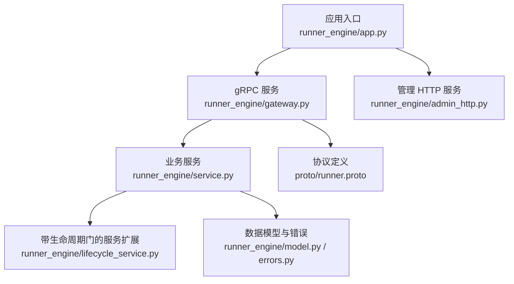
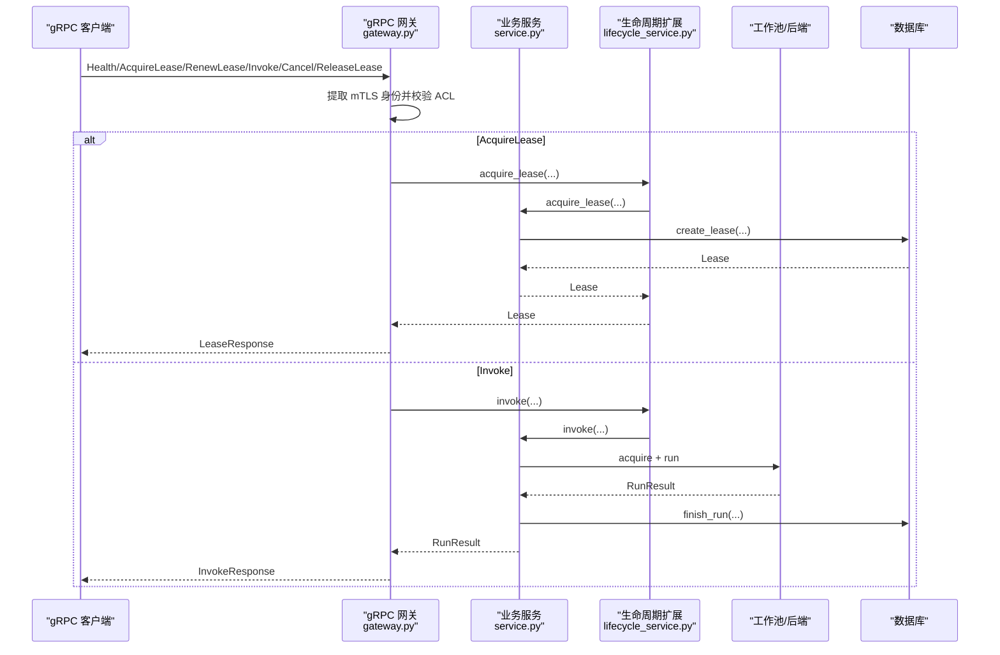
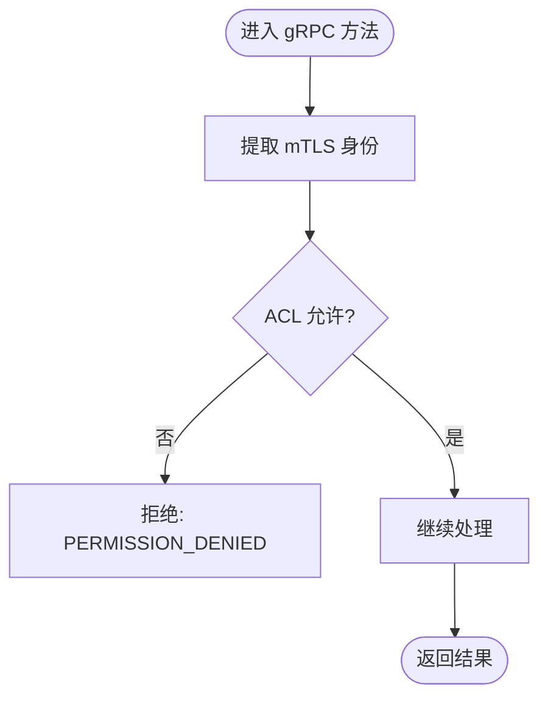
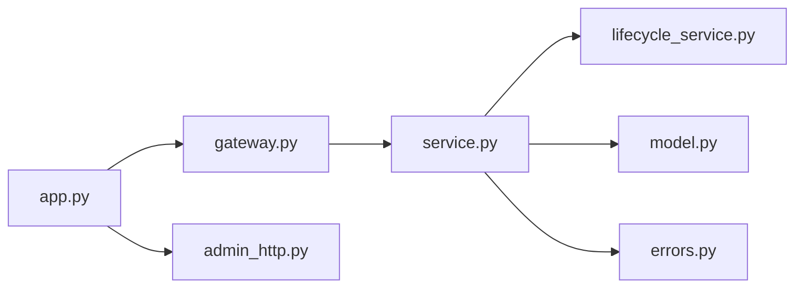

# RESTful API 文档

<cite>
**本文引用的文件**   
- [runner.proto](file://proto/runner.proto)
- [gateway.py](file://runner_engine/gateway.py)
- [service.py](file://runner_engine/service.py)
- [lifecycle_service.py](file://runner_engine/lifecycle_service.py)
- [model.py](file://runner_engine/model.py)
- [errors.py](file://runner_engine/errors.py)
- [app.py](file://runner_engine/app.py)
- [admin_http.py](file://runner_engine/admin_http.py)
</cite>

## 目录
1. [简介](#简介)
2. [项目结构](#项目结构)
3. [核心组件](#核心组件)
4. [架构总览](#架构总览)
5. [详细接口说明](#详细接口说明)
6. [依赖关系分析](#依赖关系分析)
7. [性能与限制](#性能与限制)
8. [故障排查指南](#故障排查指南)
9. [结论](#结论)
10. [附录：客户端示例与测试建议](#附录客户端示例与测试建议)

## 简介
本文件为 Runner Engine 的对外接口文档。Runner Engine 提供两类接口：
- gRPC 接口：面向生产环境的受控调用通道，使用双向 TLS（mTLS）认证与基于身份到租户/项目的访问控制。
- HTTP 管理接口：用于运维观察与生命周期管理的内部接口，采用 Bearer Token 鉴权。

注意：当前仓库未实现传统 RESTful JSON API；所有业务调用通过 gRPC 完成，HTTP 仅暴露管理与观测能力。

## 项目结构
Runner Engine 的核心入口、gRPC 服务、服务逻辑与管理 HTTP 如下组织：
- 协议定义：proto/runner.proto
- gRPC 服务实现与鉴权：runner_engine/gateway.py
- 业务服务与执行流程：runner_engine/service.py、runner_engine/lifecycle_service.py
- 数据模型与错误类型：runner_engine/model.py、runner_engine/errors.py
- 进程启动与参数：runner_engine/app.py
- 管理 HTTP 服务：runner_engine/admin_http.py

**图示来源**
- [app.py:26-226](file://runner_engine/app.py#L26-L226)
- [gateway.py:44-194](file://runner_engine/gateway.py#L44-L194)
- [service.py:80-456](file://runner_engine/service.py#L80-L456)
- [lifecycle_service.py:7-71](file://runner_engine/lifecycle_service.py#L7-L71)
- [model.py:7-98](file://runner_engine/model.py#L7-L98)
- [errors.py:1-22](file://runner_engine/errors.py#L1-L22)
- [runner.proto:8-76](file://proto/runner.proto#L8-L76)

**章节来源**
- [app.py:26-226](file://runner_engine/app.py#L26-L226)
- [gateway.py:44-194](file://runner_engine/gateway.py#L44-L194)
- [admin_http.py:14-190](file://runner_engine/admin_http.py#L14-L190)

## 核心组件
- gRPC 服务网关：负责 mTLS 认证、身份提取、ACL 授权、错误码映射与服务方法转发。
- 业务服务：租约管理、幂等执行、工作池调度、策略校验、结果持久化与清理。
- 生命周期服务：在租约获取、续租与调用前检查运行镜像状态，阻止已退役或正在退役的运行实例接受新请求。
- 管理 HTTP：提供健康检查、运行时快照、镜像退役管理等运维端点。
- 数据模型：租约、运行请求、运行结果、安全策略、工作节点等。
- 错误体系：统一错误类与可重试标记，便于上层转换为 gRPC 状态码。

**章节来源**
- [gateway.py:12-194](file://runner_engine/gateway.py#L12-L194)
- [service.py:80-456](file://runner_engine/service.py#L80-L456)
- [lifecycle_service.py:7-71](file://runner_engine/lifecycle_service.py#L7-L71)
- [admin_http.py:14-190](file://runner_engine/admin_http.py#L14-L190)
- [model.py:7-98](file://runner_engine/model.py#L7-L98)
- [errors.py:1-22](file://runner_engine/errors.py#L1-L22)

## 架构总览
Runner Engine 以 gRPC 为主通道，管理 HTTP 为辅通道。

**图示来源**
- [gateway.py:98-177](file://runner_engine/gateway.py#L98-L177)
- [service.py:146-456](file://runner_engine/service.py#L146-L456)
- [lifecycle_service.py:34-71](file://runner_engine/lifecycle_service.py#L34-L71)

## 详细接口说明

### gRPC 接口总览
- 协议版本：v33（包名 dsc.runner.v33）
- 服务名称：ManagedPythonRunner
- 传输与安全：双向 TLS（mTLS），服务端强制要求客户端证书认证
- 鉴权机制：从 mTLS 上下文提取 x509_subject_alternative_name 或 x509_common_name 作为身份标识，再依据 ACL 配置判断是否允许访问指定 tenant_id/project_id
- 错误映射：业务 RunnerError.code 映射为 gRPC StatusCode（UNAUTHENTICATED、PERMISSION_DENIED、NOT_FOUND、UNAVAILABLE、FAILED_PRECONDITION）

| RPC 名称 | 输入消息 | 输出消息 | 用途 |
|---|---|---|---|
| Health | HealthRequest | HealthResponse | 健康检查，返回 ok 与版本 |
| AcquireLease | AcquireLeaseRequest | LeaseResponse | 申请执行租约 |
| RenewLease | RenewLeaseRequest | LeaseResponse | 续租 |
| Invoke | InvokeRequest | InvokeResponse | 执行业务算子 |
| Cancel | CancelRequest | CancelResponse | 取消正在执行的调用 |
| ReleaseLease | ReleaseLeaseRequest | ReleaseLeaseResponse | 释放租约 |

**章节来源**
- [runner.proto:8-76](file://proto/runner.proto#L8-L76)
- [gateway.py:44-194](file://runner_engine/gateway.py#L44-L194)

#### Health
- 方法：Health(HealthRequest) -> HealthResponse
- 行为：验证 mTLS 身份后返回健康状态与版本号
- 响应字段：ok(bool)、version(string)

**章节来源**
- [runner.proto:17-21](file://proto/runner.proto#L17-L21)
- [gateway.py:98-100](file://runner_engine/gateway.py#L98-L100)

#### AcquireLease
- 方法：AcquireLease(AcquireLeaseRequest) -> LeaseResponse
- 输入字段：tenant_id、project_id、processor_id、release_id
- 行为：校验身份与 ACL，创建租约并返回过期时间
- 响应字段：lease_id、expires_at_epoch_ms

**章节来源**
- [runner.proto:23-38](file://proto/runner.proto#L23-L38)
- [gateway.py:102-116](file://runner_engine/gateway.py#L102-L116)
- [service.py:146-167](file://runner_engine/service.py#L146-L167)

#### RenewLease
- 方法：RenewLease(RenewLeaseRequest) -> LeaseResponse
- 输入字段：tenant_id、lease_id
- 行为：校验身份与 ACL，续租并返回新的过期时间

**章节来源**
- [runner.proto:30-38](file://proto/runner.proto#L30-L38)
- [gateway.py:118-127](file://runner_engine/gateway.py#L118-L127)
- [service.py:175-180](file://runner_engine/service.py#L175-L180)

#### Invoke
- 方法：Invoke(InvokeRequest) -> InvokeResponse
- 输入字段：tenant_id、lease_id、release_id、invocation_id、idempotency_key、content(bytes)、attributes(map<string,string>)、parameters(map<string,string>)、timeout_ms(int32)
- 行为：校验内容大小、幂等键、租约有效性、安全策略、属性白名单与大小限制；在工作池中执行并持久化结果
- 响应字段：status、relationship、content(bytes)、attributes(map<string,string>)、retryable(bool)、error_code、error_message、worker_id、duration_ms

**章节来源**
- [runner.proto:40-62](file://proto/runner.proto#L40-L62)
- [gateway.py:129-157](file://runner_engine/gateway.py#L129-L157)
- [service.py:188-405](file://runner_engine/service.py#L188-L405)

#### Cancel
- 方法：Cancel(CancelRequest) -> CancelResponse
- 输入字段：tenant_id、lease_id、invocation_id
- 行为：校验身份与 ACL，尝试取消活跃调用

**章节来源**
- [runner.proto:64-69](file://proto/runner.proto#L64-L69)
- [gateway.py:159-169](file://runner_engine/gateway.py#L159-L169)
- [service.py:411-456](file://runner_engine/service.py#L411-L456)

#### ReleaseLease
- 方法：ReleaseLease(ReleaseLeaseRequest) -> ReleaseLeaseResponse
- 输入字段：tenant_id、lease_id
- 行为：校验身份与 ACL，删除租约

**章节来源**
- [runner.proto:71-76](file://proto/runner.proto#L71-L76)
- [gateway.py:171-177](file://runner_engine/gateway.py#L171-L177)
- [service.py:182-186](file://runner_engine/service.py#L182-L186)

### 身份验证与授权
- mTLS 身份提取：优先使用 x509_subject_alternative_name，其次 x509_common_name
- ACL 授权：AccessControl.from_json 加载 identities 映射，将身份到 tenant_id 允许的 project_id 列表进行匹配；支持通配符 "*"
- 租约级授权：对需要 lease_id 的方法，先读取租约记录，再校验身份是否允许该租约所属的 project_id

**图示来源**
- [gateway.py:33-41](file://runner_engine/gateway.py#L33-L41)
- [gateway.py:81-96](file://runner_engine/gateway.py#L81-L96)

**章节来源**
- [gateway.py:12-31](file://runner_engine/gateway.py#L12-L31)
- [gateway.py:33-41](file://runner_engine/gateway.py#L33-L41)
- [gateway.py:81-96](file://runner_engine/gateway.py#L81-L96)

### 管理 HTTP 接口
管理 HTTP 服务默认监听内网地址（可通过环境变量配置），需设置 RUNNER_ADMIN_TOKEN 启用。

- 鉴权方式：Authorization: Bearer <token>
- 最大请求体：256 KiB
- 通用响应头：Content-Type: application/json; charset=utf-8, Cache-Control: no-store

| 方法 | URL | 鉴权 | 查询参数/请求体 | 成功响应 | 失败响应 |
|---|---|---|---|---|---|
| GET | /health | 必需 | 无 | {"ok": true, "service": "runner-admin"} | 401 unauthorized |
| GET | /v1/observe/runtime | 必需 | 无 | 运行时快照对象 | 401 unauthorized |
| GET | /v1/admin/runtime-images/status | 必需 | imageRef(string) | 镜像状态对象 | 400 缺少 imageRef |
| POST | /v1/admin/runtime-images/retire | 必需 | {imageRef, reason} | 退役开始结果 | 400 参数无效 |
| POST | /v1/admin/runtime-images/cancel-retirement | 必需 | {imageRef} | 取消退役结果 | 400 缺少 imageRef |
| POST | /v1/admin/runtime-images/finalize-retirement | 必需 | {imageRef} | 最终化退役结果 | 400 缺少 imageRef |
| POST | /v1/admin/sandboxes/retire-idle | 必需 | {workerId} | 闲置工作节点退役结果 | 400 缺少 workerId |

错误响应格式：
- 401: {"detail": "unauthorized"}
- 400: {"detail": "<具体错误信息>"}
- 404: {"detail": "not found"}
- 500: {"detail": "<异常类型>: <异常信息>"}

**章节来源**
- [admin_http.py:14-190](file://runner_engine/admin_http.py#L14-L190)
- [app.py:174-210](file://runner_engine/app.py#L174-L210)

### 数据模型与约束
- 运行环境 RuntimeEnv：id、image、python
- 算子发布 OperatorRelease：id、artifact_path、artifact_sha256、runtime、entrypoint、profile、input_attributes、output_attributes
- 安全策略 SecurityPolicy：name、sandbox_cluster、cpu、memory、max_timeout_ms、network_allow、reuse_sandbox
- 租约 Lease：id、tenant_id、project_id、processor_id、release_id、expires_at_ms
- 运行请求 RunRequest：tenant_id、lease_id、release_id、invocation_id、idempotency_key、content(bytes)、attributes(dict[str,str])、parameters(dict[str,str])、timeout_ms
- 运行结果 RunResult：status、relationship、content(bytes)、attributes(dict[str,str])、retryable、error_code、error_message、worker_id、duration_ms
- 工作节点 Worker：id、endpoint、token、tenant_id、runtime_id、profile、backend_group、created_monotonic、last_used_monotonic、installed_release_ids(set)、sandbox_expires_monotonic、runs、healthy、destroyed、metadata
- 活跃运行 ActiveRun：tenant_id、lease_id、release_id、worker

关键约束：
- 单次 Invoke 的 content 上限：8 MiB
- attributes 数量上限：128
- attributes 总字节数上限：64 KiB
- parameters 同样受 attributes 校验规则约束
- timeout_ms 会被限制在策略 max_timeout_ms 范围内

**章节来源**
- [model.py:7-98](file://runner_engine/model.py#L7-L98)
- [service.py:15-18](file://runner_engine/service.py#L15-L18)
- [service.py:39-60](file://runner_engine/service.py#L39-L60)
- [service.py:188-235](file://runner_engine/service.py#L188-L235)

### 错误码与状态码
- gRPC 状态码映射：
  - UNAUTHENTICATED：当 RunnerError.code 为 UNAUTHENTICATED
  - PERMISSION_DENIED：当 RunnerError.code 以 FORBIDDEN 结尾或为 CANCEL_FORBIDDEN
  - NOT_FOUND：当 RunnerError.code 为 RELEASE_NOT_FOUND 或 LEASE_UNKNOWN
  - UNAVAILABLE：当 RunnerError.retryable 为真
  - FAILED_PRECONDITION：其他情况
- 常见业务错误码（部分）：
  - UNKNOWN_SECURITY_POLICY
  - INLINE_CONTENT_TOO_LARGE
  - IDEMPOTENCY_REQUIRED
  - INVOCATION_ID_IN_USE
  - OUTPUT_TOO_LARGE
  - RUNNER_INFRASTRUCTURE_ERROR
  - RUNTIME_RETIRED / RUNTIME_RETIRING
  - CANCEL_FORBIDDEN / CANCEL_FAILED

**章节来源**
- [gateway.py:67-79](file://runner_engine/gateway.py#L67-L79)
- [service.py:154-167](file://runner_engine/service.py#L154-L167)
- [service.py:188-405](file://runner_engine/service.py#L188-L405)
- [lifecycle_service.py:19-32](file://runner_engine/lifecycle_service.py#L19-L32)
- [errors.py:1-22](file://runner_engine/errors.py#L1-L22)

### 速率限制、分页与版本控制
- 速率限制：代码中未发现显式的全局速率限制器；可通过外部网关或负载均衡层实施
- 分页机制：未发现分页相关逻辑
- 版本控制：
  - gRPC 包版本：dsc.runner.v33
  - 健康检查返回 version 字段（例如 "3.3.0"）

**章节来源**
- [runner.proto:1-5](file://proto/runner.proto#L1-L5)
- [gateway.py:98-100](file://runner_engine/gateway.py#L98-L100)

## 依赖关系分析
- app.py 负责解析命令行与环境变量，初始化生命周期存储、后端、配额与工作池，并启动服务与管理 HTTP
- gateway.py 注册 gRPC 服务，注入 AccessControl 与 RunnerService
- service.py 实现核心业务逻辑，包括租约、执行、清理与后台维护
- lifecycle_service.py 在 service.py 之上增加运行镜像状态门控
- model.py 与 errors.py 提供数据结构与错误类型

**图示来源**
- [app.py:26-226](file://runner_engine/app.py#L26-L226)
- [gateway.py:44-194](file://runner_engine/gateway.py#L44-L194)
- [service.py:80-456](file://runner_engine/service.py#L80-L456)
- [lifecycle_service.py:7-71](file://runner_engine/lifecycle_service.py#L7-L71)
- [model.py:7-98](file://runner_engine/model.py#L7-L98)
- [errors.py:1-22](file://runner_engine/errors.py#L1-L22)

**章节来源**
- [app.py:26-226](file://runner_engine/app.py#L26-L226)
- [gateway.py:44-194](file://runner_engine/gateway.py#L44-L194)
- [service.py:80-456](file://runner_engine/service.py#L80-L456)

## 性能与限制
- 消息大小限制：gRPC 接收/发送消息上限各为 10 MiB
- 并发线程池：gRPC server 默认线程池大小为 32（可通过 serve 参数调整）
- 运行内容大小：Invoke 的 content 与输出均限制为 8 MiB
- 属性限制：attributes 最多 128 项，总字节数不超过 64 KiB
- 超时限制：timeout_ms 被限制在策略 max_timeout_ms 以内
- 后台清理：定期回收空闲工作节点、清理过期租约与幂等缓存、清理旧运行记录

**章节来源**
- [gateway.py:184-193](file://runner_engine/gateway.py#L184-L193)
- [service.py:15-18](file://runner_engine/service.py#L15-L18)
- [service.py:188-235](file://runner_engine/service.py#L188-L235)
- [service.py:117-138](file://runner_engine/service.py#L117-L138)

## 故障排查指南
- 无法连接或认证失败：
  - 确认已正确配置 mTLS 证书与 CA，且客户端身份在 ACL 中允许访问目标租户/项目
- 权限不足：
  - 检查 ACL 配置中 identity 到 tenant_id/project_id 的映射是否正确
- 租约相关错误：
  - 确认 lease_id 有效且属于当前 tenant_id；必要时重新 AcquireLease
- 运行被拒绝：
  - 若运行镜像处于 RETIRING/RETIRED，将被拒绝；等待退役完成或更换 release_id
- 内容过大或属性超限：
  - 减小 content 或 attributes/parameters 的大小与数量
- 后台任务异常：
  - 查看日志中的“background Runner maintenance failed”提示，定位数据库或工作池问题

**章节来源**
- [gateway.py:67-79](file://runner_engine/gateway.py#L67-L79)
- [gateway.py:81-96](file://runner_engine/gateway.py#L81-L96)
- [lifecycle_service.py:19-32](file://runner_engine/lifecycle_service.py#L19-L32)
- [service.py:188-405](file://runner_engine/service.py#L188-L405)

## 结论
Runner Engine 以 gRPC 为主要接口，强调安全与可控性：mTLS 认证、ACL 授权、严格的输入校验与策略限制，以及完善的错误映射。管理 HTTP 提供必要的运维能力。对于需要 RESTful 的场景，可在上游网关或代理层进行适配与封装。

## 附录：客户端示例与测试建议
- gRPC 客户端（Python/JavaScript）：
  - 使用 grpcio 生成 stubs（参考 scripts/generate_proto.py）
  - 配置双向 TLS：服务端证书、客户端证书与 CA
  - 按 runner.proto 构造请求消息并调用 ManagedPythonRunner 服务
- 管理 HTTP 客户端（curl）：
  - 健康检查：curl -H "Authorization: Bearer <TOKEN>" https://<host>:<port>/health
  - 运行时快照：curl -H "Authorization: Bearer <TOKEN>" https://<host>:<port>/v1/observe/runtime
  - 镜像状态：curl -H "Authorization: Bearer <TOKEN>" "https://<host>:<port>/v1/admin/runtime-images/status?imageRef=<ref>"
  - 退役镜像：curl -X POST -H "Authorization: Bearer <TOKEN>" -H "Content-Type: application/json" -d '{"imageRef":"<ref>","reason":"..."}' https://<host>:<port>/v1/admin/runtime-images/retire
  - 取消退役：curl -X POST -H "Authorization: Bearer <TOKEN>" -H "Content-Type: application/json" -d '{"imageRef":"<ref>"}' https://<host>:<port>/v1/admin/runtime-images/cancel-retirement
  - 最终化退役：curl -X POST -H "Authorization: Bearer <TOKEN>" -H "Content-Type: application/json" -d '{"imageRef":"<ref>"}' https://<host>:<port>/v1/admin/runtime-images/finalize-retirement
  - 闲置工作节点退役：curl -X POST -H "Authorization: Bearer <TOKEN>" -H "Content-Type: application/json" -d '{"workerId":"<wid>"}' https://<host>:<port>/v1/admin/sandboxes/retire-idle

[本节为概念性指导，不直接分析具体源码文件]