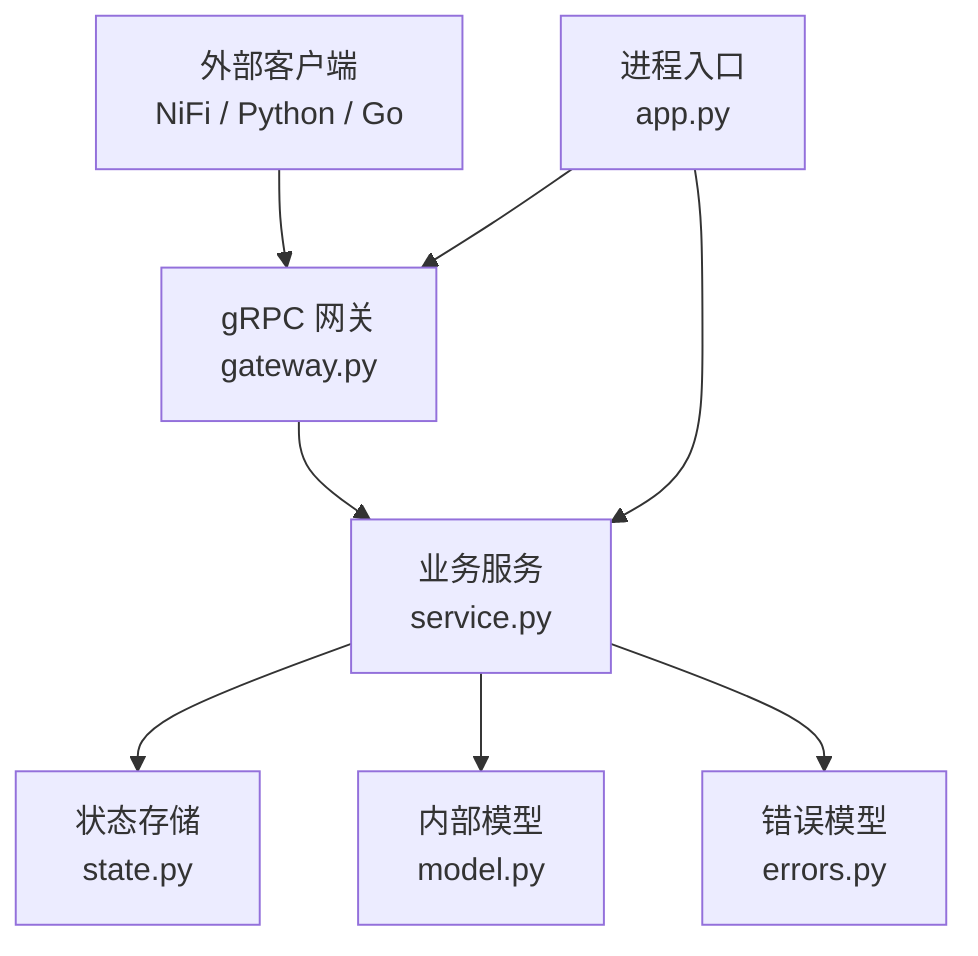
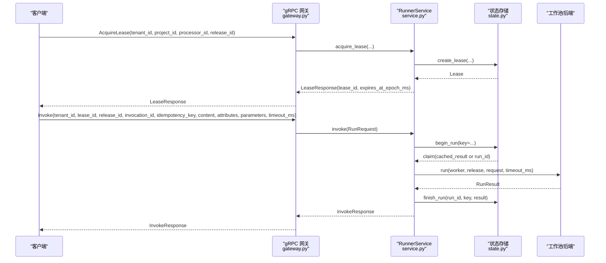
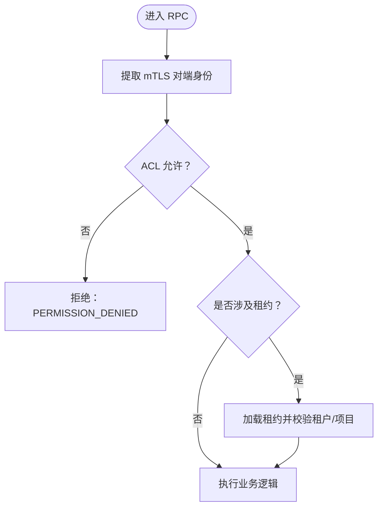
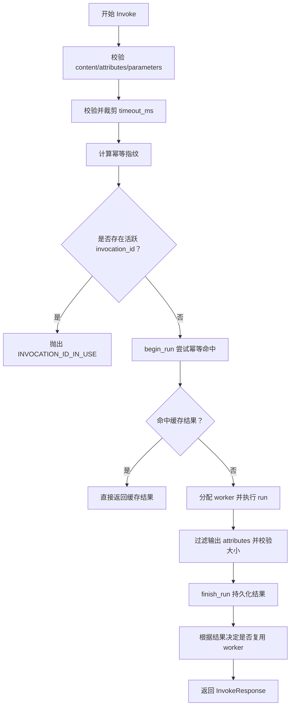
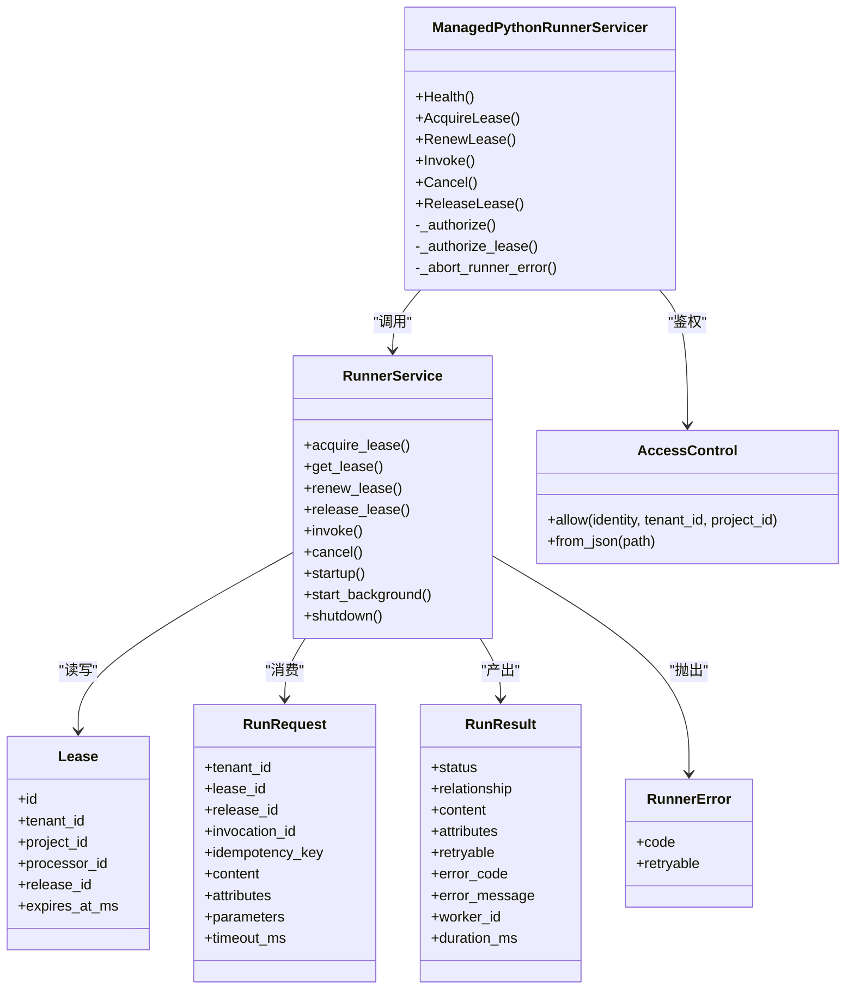

# gRPC API 文档

<cite>
**本文引用的文件**   
- [runner.proto](file://proto/runner.proto)
- [gateway.py](file://runner_engine/gateway.py)
- [service.py](file://runner_engine/service.py)
- [model.py](file://runner_engine/model.py)
- [errors.py](file://runner_engine/errors.py)
- [app.py](file://runner_engine/app.py)
- [state.py](file://runner_engine/state.py)
- [GrpcManagedPythonRuntimeService.java](file://nifi/managed-python-processors/src/main/java/com/dsc/nifi/GrpcManagedPythonRuntimeService.java)
</cite>

## 目录
1. [简介](#简介)
2. [项目结构](#项目结构)
3. [核心组件](#核心组件)
4. [架构总览](#架构总览)
5. [接口规范](#接口规范)
6. [详细组件分析](#详细组件分析)
7. [依赖关系分析](#依赖关系分析)
8. [性能与可靠性](#性能与可靠性)
9. [调试与故障排查](#调试与故障排查)
10. [结论](#结论)

## 简介
本文件为 Runner Engine 的 ManagedPythonRunner gRPC 服务提供完整接口文档。内容覆盖：
- 所有 RPC 方法（Health、AcquireLease、RenewLease、Invoke、Cancel、ReleaseLease）的请求/响应结构、参数含义、错误码与重试语义
- 会话与租约机制、执行生命周期
- gRPC 客户端连接、调用与错误处理示例说明
- 性能优化建议、超时配置与重试策略
- 调试工具与常见问题排查

## 项目结构
Runner Engine 以 gRPC 作为对外暴露面，核心由以下部分组成：
- proto 定义：统一描述服务契约与消息结构
- gateway：gRPC 服务端实现、mTLS 认证、访问控制、错误映射
- service：业务编排（租约、幂等、执行调度、结果持久化）
- model：内部数据模型（租约、请求、结果、安全策略等）
- errors：统一错误类型与可重试标记
- app：进程入口、配置加载、后台清理任务、gRPC 服务启动
- state：数据库层（租约、幂等缓存、运行记录）
- NiFi Java 客户端：展示 mTLS gRPC 客户端使用方式

图示来源
- [gateway.py:44-194](file://runner_engine/gateway.py#L44-L194)
- [service.py:80-456](file://runner_engine/service.py#L80-L456)
- [app.py:26-232](file://runner_engine/app.py#L26-L232)

章节来源
- [runner.proto:1-76](file://proto/runner.proto#L1-L76)
- [gateway.py:44-194](file://runner_engine/gateway.py#L44-L194)
- [service.py:80-456](file://runner_engine/service.py#L80-L456)
- [app.py:26-232](file://runner_engine/app.py#L26-L232)

## 核心组件
- ManagedPythonRunnerServicer：在 gateway.py 中实现，负责鉴权、参数校验、调用 service 并返回标准响应。
- RunnerService：封装租约管理、幂等执行、工作池调度、结果持久化与清理。
- AccessControl：基于 mTLS 对端身份进行租户/项目级访问控制。
- RunnerError：统一错误类型，包含 code、message 与 retryable 标志。
- Lease/RunRequest/RunResult：核心领域对象，贯穿 gRPC 到执行链路。

章节来源
- [gateway.py:67-177](file://runner_engine/gateway.py#L67-L177)
- [service.py:80-456](file://runner_engine/service.py#L80-L456)
- [errors.py:1-22](file://runner_engine/errors.py#L1-L22)
- [model.py:37-98](file://runner_engine/model.py#L37-L98)

## 架构总览
ManagedPythonRunner 采用“网关 + 服务 + 存储”的分层架构：
- 网关层：mTLS 认证、ACL 鉴权、gRPC 错误映射、消息长度限制
- 服务层：租约生命周期、幂等键去重、执行调度、输出过滤与大小限制
- 存储层：租约表、幂等缓存、运行记录、过期清理

图示来源
- [gateway.py:102-157](file://runner_engine/gateway.py#L102-L157)
- [service.py:188-410](file://runner_engine/service.py#L188-L410)
- [state.py:283-386](file://runner_engine/state.py#L283-L386)

## 接口规范

### 通用约定
- 传输协议：gRPC over TLS（mTLS），必须携带客户端证书并通过 ACL 校验
- 消息大小：服务端最大接收/发送消息长度为 10 MiB
- 默认超时：Invoke 若未显式设置 timeout_ms，则默认为 30000 ms
- 幂等性：Invoke 必须提供 idempotency_key；相同 key 的已完成结果会被缓存并按租户/发布版本命中
- 属性限制：attributes 数量上限 128，键值 UTF-8 字节总数上限 64 KiB
- 内容大小：content 输入/输出均不得超过 8 MiB

章节来源
- [gateway.py:184-190](file://runner_engine/gateway.py#L184-L190)
- [service.py:15-21](file://runner_engine/service.py#L15-L21)
- [gateway.py:129-157](file://runner_engine/gateway.py#L129-L157)

### Health
- 用途：健康检查与服务版本探测
- 鉴权：需要有效的 mTLS 对端身份
- 请求：HealthRequest（空）
- 响应：HealthResponse
  - ok: bool，表示服务可用
  - version: string，当前服务版本
- 错误：鉴权失败时返回 UNAUTHENTICATED

章节来源
- [runner.proto:8-21](file://proto/runner.proto#L8-L21)
- [gateway.py:98-100](file://runner_engine/gateway.py#L98-L100)

### AcquireLease
- 用途：为指定租户/项目/处理器/发布版本创建租约
- 鉴权：需允许 tenant_id/project_id
- 请求：AcquireLeaseRequest
  - tenant_id: string
  - project_id: string
  - processor_id: string
  - release_id: string
- 响应：LeaseResponse
  - lease_id: string
  - expires_at_epoch_ms: int64（毫秒时间戳）
- 错误：
  - UNKNOWN_SECURITY_POLICY：release 使用的 profile 不在策略中
  - RELEASE_NOT_FOUND：发布不存在
  - LEASE_UNKNOWN：底层租约创建失败（可能重试）

章节来源
- [runner.proto:23-38](file://proto/runner.proto#L23-L38)
- [service.py:146-167](file://runner_engine/service.py#L146-L167)
- [gateway.py:102-116](file://runner_engine/gateway.py#L102-L116)

### RenewLease
- 用途：续期已有租约
- 鉴权：需允许该租约所属的项目
- 请求：RenewLeaseRequest
  - tenant_id: string
  - lease_id: string
- 响应：LeaseResponse（lease_id 不变，expires_at_epoch_ms 更新）
- 错误：
  - LEASE_FORBIDDEN：租约不属于该租户
  - LEASE_EXPIRED：租约已过期
  - LEASE_UNKNOWN：租约不存在

章节来源
- [runner.proto:30-38](file://proto/runner.proto#L30-L38)
- [service.py:175-180](file://runner_engine/service.py#L175-L180)
- [state.py:348-369](file://runner_engine/state.py#L348-L369)
- [gateway.py:118-127](file://runner_engine/gateway.py#L118-L127)

### Invoke
- 用途：在租约上下文中执行一次算子调用
- 鉴权：需允许该租约所属的项目
- 请求：InvokeRequest
  - tenant_id: string
  - lease_id: string
  - release_id: string
  - invocation_id: string（唯一标识本次调用）
  - idempotency_key: string（幂等键，必填）
  - content: bytes（二进制负载）
  - attributes: map<string,string>（受发布定义的 input_attributes 白名单过滤）
  - parameters: map<string,string>（参数，独立于 attributes）
  - timeout_ms: int32（单位毫秒，最小 1，最大受安全策略 max_timeout_ms 限制）
- 响应：InvokeResponse
  - status: string（如 SUCCEEDED 或错误状态）
  - relationship: string（下游路由关系，默认 success）
  - content: bytes（二进制负载，输出也受 8 MiB 限制）
  - attributes: map<string,string>（受发布定义的 output_attributes 白名单过滤）
  - retryable: bool（是否可重试）
  - error_code: string（错误码）
  - error_message: string（人类可读错误信息）
  - worker_id: string（执行工作节点 ID）
  - duration_ms: int32（执行耗时）
- 错误：
  - IDEMPOTENCY_REQUIRED：缺少幂等键
  - INVOCATION_ID_IN_USE：并发重复的 invocation_id
  - RUN_STATE_INVALID：执行状态异常（可重试）
  - OUTPUT_TOO_LARGE：输出超过 8 MiB
  - 其他业务错误（TIMEOUT、CANCELLED、CPU_LIMIT、USER_EXCEPTION 等）

章节来源
- [runner.proto:40-62](file://proto/runner.proto#L40-L62)
- [service.py:188-410](file://runner_engine/service.py#L188-L410)
- [gateway.py:129-157](file://runner_engine/gateway.py#L129-L157)

### Cancel
- 用途：取消正在执行的 invocation
- 鉴权：需允许该租约所属的项目
- 请求：CancelRequest
  - tenant_id: string
  - lease_id: string
  - invocation_id: string
- 响应：CancelResponse
  - cancelled: bool（是否成功取消）
- 错误：
  - CANCEL_FORBIDDEN：invocation 不属于该租户/租约
  - CANCEL_FAILED：取消通道异常（可重试）

章节来源
- [runner.proto:64-69](file://proto/runner.proto#L64-L69)
- [service.py:411-455](file://runner_engine/service.py#L411-L455)
- [gateway.py:159-169](file://runner_engine/gateway.py#L159-L169)

### ReleaseLease
- 用途：释放租约
- 鉴权：需允许该租约所属的项目
- 请求：ReleaseLeaseRequest
  - tenant_id: string
  - lease_id: string
- 响应：ReleaseLeaseResponse
  - released: bool（总是返回 true，除非发生错误）
- 错误：
  - LEASE_FORBIDDEN：租约不属于该租户
  - LEASE_UNKNOWN：租约不存在

章节来源
- [runner.proto:71-76](file://proto/runner.proto#L71-L76)
- [service.py:182-186](file://runner_engine/service.py#L182-L186)
- [state.py:371-381](file://runner_engine/state.py#L371-L381)
- [gateway.py:171-177](file://runner_engine/gateway.py#L171-L177)

## 详细组件分析

### 鉴权与访问控制
- mTLS 对端身份提取：优先使用 SAN，其次 CN
- ACL 规则：按 identity -> tenant_id -> project_id 列表匹配，支持通配符
- 租约级鉴权：对涉及租约的方法先查询租约，再校验 identity 是否允许该租约对应的项目

图示来源
- [gateway.py:33-41](file://runner_engine/gateway.py#L33-L41)
- [gateway.py:81-96](file://runner_engine/gateway.py#L81-L96)

章节来源
- [gateway.py:12-31](file://runner_engine/gateway.py#L12-L31)
- [gateway.py:33-41](file://runner_engine/gateway.py#L33-L41)
- [gateway.py:81-96](file://runner_engine/gateway.py#L81-L96)

### 租约与幂等执行流程
- 租约：创建、续期、删除、过期清理
- 幂等：基于 idempotency_key 的哈希指纹，结合租户/发布版本进行命中
- 执行：从 WorkerPool 获取 worker，调用后端 run，过滤输出 attributes，持久化结果
- 清理：根据结果状态决定复用或失效 worker，后台线程定期清理过期租约与旧运行记录

图示来源
- [service.py:188-410](file://runner_engine/service.py#L188-L410)

章节来源
- [service.py:188-410](file://runner_engine/service.py#L188-L410)
- [state.py:283-386](file://runner_engine/state.py#L283-L386)

### 错误映射与重试语义
- RunnerError.code 决定 gRPC StatusCode：
  - UNAUTHENTICATED -> UNAUTHENTICATED
  - FORBIDDEN/CANCEL_FORBIDDEN -> PERMISSION_DENIED
  - RELEASE_NOT_FOUND/LEASE_UNKNOWN -> NOT_FOUND
  - retryable=True -> UNAVAILABLE
  - 其他 -> FAILED_PRECONDITION
- 客户端应依据 retryable 与 StatusCode 实施指数退避重试

章节来源
- [errors.py:1-22](file://runner_engine/errors.py#L1-L22)
- [gateway.py:68-79](file://runner_engine/gateway.py#L68-L79)

## 依赖关系分析

图示来源
- [gateway.py:67-177](file://runner_engine/gateway.py#L67-L177)
- [service.py:80-456](file://runner_engine/service.py#L80-L456)
- [model.py:37-98](file://runner_engine/model.py#L37-L98)
- [errors.py:1-22](file://runner_engine/errors.py#L1-L22)

章节来源
- [gateway.py:67-177](file://runner_engine/gateway.py#L67-L177)
- [service.py:80-456](file://runner_engine/service.py#L80-L456)
- [model.py:37-98](file://runner_engine/model.py#L37-L98)
- [errors.py:1-22](file://runner_engine/errors.py#L1-L22)

## 性能与可靠性

### 性能特性
- 并发：gRPC 服务器使用线程池，默认 max_workers=32
- 消息大小：最大 10 MiB（接收/发送）
- 执行超时：Invoke 默认 30000 ms，受安全策略 max_timeout_ms 限制
- 资源回收：后台清理线程定期回收僵尸 worker、过期租约、旧运行记录

章节来源
- [gateway.py:184-190](file://runner_engine/gateway.py#L184-L190)
- [gateway.py:129-157](file://runner_engine/gateway.py#L129-L157)
- [service.py:117-138](file://runner_engine/service.py#L117-L138)

### 超时配置
- 客户端侧：
  - 连接超时：建议 5-10 秒
  - 调用超时：建议略大于服务端 timeout_ms，避免提前中断
- 服务端侧：
  - RUNNER_LEASE_TTL_MS：租约 TTL（默认 15 分钟）
  - RUNNER_REAPER_INTERVAL_SECONDS：后台清理间隔（默认 30 秒）
  - policy.max_timeout_ms：单条执行最大超时

章节来源
- [app.py:136-153](file://runner_engine/app.py#L136-L153)
- [service.py:231-235](file://runner_engine/service.py#L231-L235)

### 重试策略
- 触发条件：
  - gRPC StatusCode 为 UNAVAILABLE
  - RunnerError.retryable=True
- 推荐策略：
  - 指数退避 + 抖动，初始 1s，最大 30s，最多 5 次
  - 仅对幂等读与可重试写重试（Invoke 仅在 retryable=True 时重试）
  - 对 LEASE_EXPIRED/LEASE_UNKNOWN 应先续期或重新获取租约

章节来源
- [gateway.py:68-79](file://runner_engine/gateway.py#L68-L79)
- [service.py:334-359](file://runner_engine/service.py#L334-L359)

## 调试与故障排查

### 常见错误与定位
- UNAUTHENTICATED：mTLS 对端身份缺失或证书链不完整
- PERMISSION_DENIED：ACL 不允许该 identity 访问目标租户/项目
- NOT_FOUND：RELEASE_NOT_FOUND 或 LEASE_UNKNOWN
- FAILED_PRECONDITION：业务前置条件不满足（如属性超限、内容过大）
- UNAVAILABLE：临时不可用（网络抖动、后端繁忙），可重试

章节来源
- [gateway.py:68-79](file://runner_engine/gateway.py#L68-L79)
- [service.py:188-410](file://runner_engine/service.py#L188-L410)

### 诊断要点
- 确认 mTLS 证书与 CA 配置正确
- 检查 ACL 配置是否允许 identity 访问目标租户/项目
- 核对 release_id 对应的 profile 是否在 policies.json 中
- 监控后台清理日志，关注 abandoned 与 expired 条目
- 观察 Invoke 的 duration_ms、status、error_code、error_message

章节来源
- [app.py:170-227](file://runner_engine/app.py#L170-L227)
- [service.py:105-144](file://runner_engine/service.py#L105-L144)

### gRPC 客户端实现示例（说明）
- 连接：
  - 使用 mTLS，配置 server CA、客户端证书与私钥
  - 目标地址为 runner 服务监听地址（例如 runner.internal:9443）
- 调用顺序：
  - 调用 AcquireLease 获取 lease_id 与 expires_at_epoch_ms
  - 定时 RenewLease 续期，避免过期
  - 调用 Invoke 提交执行，传入 invocation_id 与 idempotency_key
  - 必要时调用 Cancel 取消执行
  - 完成后调用 ReleaseLease 释放租约
- 错误处理：
  - 捕获 UNAUTHENTICATED/PERMISSION_DENIED/NOT_FOUND/FAILED_PRECONDITION/UNAVAILABLE
  - 对 UNAVAILABLE 且 retryable=True 的情况实施指数退避重试
- 参考实现：
  - NiFi Java 客户端展示了 mTLS gRPC 客户端的典型用法（证书、stub 构造、调用 cancel/releaseLease）

章节来源
- [GrpcManagedPythonRuntimeService.java:206-231](file://nifi/managed-python-processors/src/main/java/com/dsc/nifi/GrpcManagedPythonRuntimeService.java#L206-L231)
- [gateway.py:179-194](file://runner_engine/gateway.py#L179-L194)

## 结论
ManagedPythonRunner gRPC API 通过严格的 mTLS 与 ACL 鉴权、完善的租约与幂等机制、以及清晰的错误与重试语义，提供了稳定可靠的远程执行能力。客户端应遵循“先租后调、按时续期、幂等重试、及时释放”的最佳实践，并结合服务端策略与配置进行超时与容量规划，以获得最佳性能与稳定性。