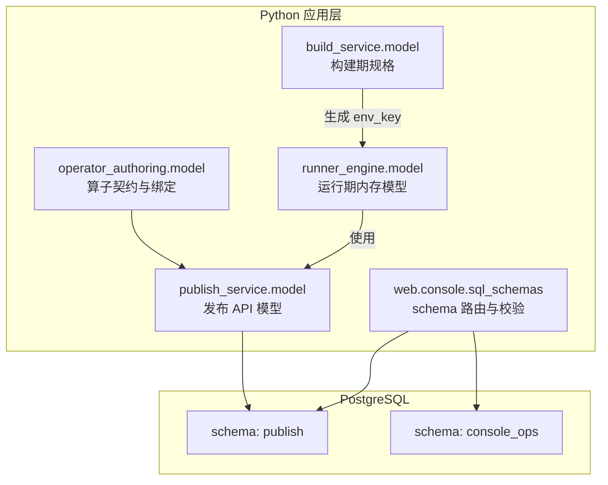
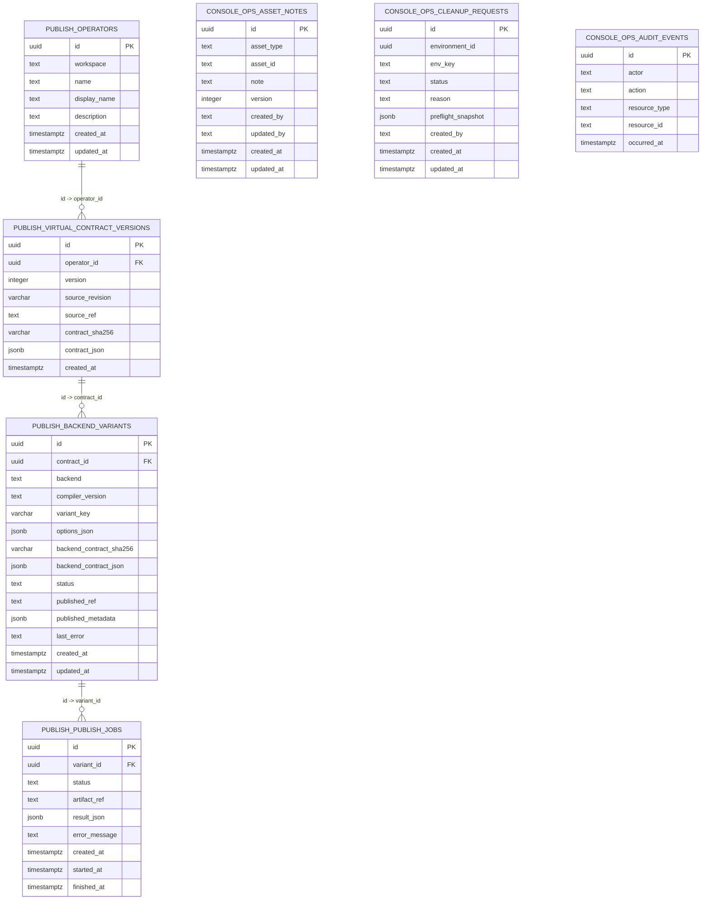
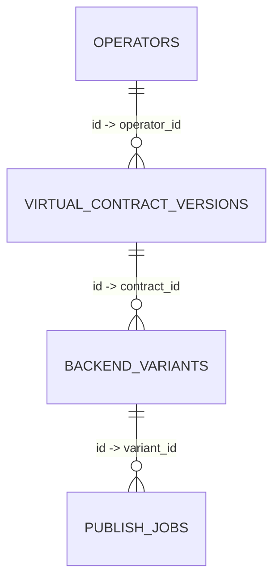

# 数据模型参考

<cite>
**本文引用的文件**   
- [sql/publish_schema.sql](file://sql/publish_schema.sql)
- [web/admin/sql/001_admin_schema.sql](file://web/admin/sql/001_admin_schema.sql)
- [runner_engine/model.py](file://runner_engine/model.py)
- [build_service/model.py](file://build_service/model.py)
- [publish_service/model.py](file://publish_service/model.py)
- [operator_authoring/model.py](file://operator_authoring/model.py)
- [web/console/sql_schemas.py](file://web/console/sql_schemas.py)
</cite>

## 目录
1. [引言](#引言)
2. [项目结构与数据边界](#项目结构与数据边界)
3. [核心实体与数据结构](#核心实体与数据结构)
4. [数据库架构总览](#数据库架构总览)
5. [详细数据模型说明](#详细数据模型说明)
6. [枚举、常量与业务规则](#枚举常量与业务规则)
7. [依赖关系与完整性约束](#依赖关系与完整性约束)
8. [数据访问模式与索引策略](#数据访问模式与索引策略)
9. [迁移脚本与版本管理](#迁移脚本与版本管理)
10. [性能优化建议](#性能优化建议)
11. [故障排查指南](#故障排查指南)
12. [结论](#结论)

## 引言
本参考文档聚焦 Runner Engine 的数据模型，覆盖以下范围：
- 所有核心实体类、数据结构定义
- PostgreSQL 数据库表结构、字段类型、约束条件、索引设计
- 关系映射、枚举类型、常量定义与业务规则
- 数据验证规则和数据完整性约束
- 数据库迁移脚本与版本管理策略
- 数据访问模式、缓存策略和性能优化建议
- 数据样本与查询示例（以结构化描述为主）

该仓库采用多服务、多 schema 的 PostgreSQL 数据组织方式。其中 publish 服务负责算子契约与发布产物；console_ops schema 由控制台运维侧维护；运行时、构建期等内存或进程内对象通过 Python dataclass 表达。

## 项目结构与数据边界
- 持久化层集中在 SQL 脚本中：
  - `sql/publish_schema.sql`：publish 服务的核心表结构
  - `web/admin/sql/001_admin_schema.sql`：控制台运维辅助表结构
- 应用层数据模型集中在各模块 model 文件中：
  - `runner_engine/model.py`：运行期内存模型
  - `build_service/model.py`：构建期规格与校验逻辑
  - `publish_service/model.py`：发布 API 请求模型
  - `operator_authoring/model.py`：算子契约、绑定、编解码等通用模型
- 控制台对三个服务数据库进行 schema 路由与标识符校验：
  - `web/console/sql_schemas.py`：默认 schema 映射与校验

**图表来源**
- [sql/publish_schema.sql:1-68](file://sql/publish_schema.sql#L1-L68)
- [web/admin/sql/001_admin_schema.sql:1-52](file://web/admin/sql/001_admin_schema.sql#L1-L52)
- [runner_engine/model.py:1-98](file://runner_engine/model.py#L1-L98)
- [build_service/model.py:1-71](file://build_service/model.py#L1-L71)
- [publish_service/model.py:1-92](file://publish_service/model.py#L1-L92)
- [operator_authoring/model.py:1-212](file://operator_authoring/model.py#L1-L212)
- [web/console/sql_schemas.py:1-28](file://web/console/sql_schemas.py#L1-L28)

**章节来源**
- [sql/publish_schema.sql:1-68](file://sql/publish_schema.sql#L1-L68)
- [web/admin/sql/001_admin_schema.sql:1-52](file://web/admin/sql/001_admin_schema.sql#L1-L52)
- [web/console/sql_schemas.py:1-28](file://web/console/sql_schemas.py#L1-L28)

## 核心实体与数据结构
本节梳理关键 Python 数据类及其职责，便于理解数据在内存中的形态与流转。

- 运行期内存模型（runner_engine.model）
  - RuntimeEnv：运行时环境标识、镜像、Python 版本
  - OperatorRelease：算子发布信息，含工件路径、摘要、运行时、入口点、profile、输入输出属性
  - SecurityPolicy：安全策略，含沙箱集群、CPU/内存限制、超时、网络白名单、复用策略
  - Lease：租约，包含租户、项目、处理器、发布版本、过期时间
  - RunRequest：运行请求，包含租户、租约、发布版本、幂等键、内容、属性、参数、超时
  - RunResult：运行结果，包含状态、关系、内容、属性、是否可重试、错误码/信息、worker、耗时
  - Worker：工作节点元信息与统计
  - ActiveRun：当前活跃运行上下文

- 构建期模型（build_service.model）
  - RuntimeBuildSpec：构建规格，含基础镜像、Python 版本、平台、requirements.lock、构建策略版本；提供 lock_sha256、packages、env_key 计算

- 发布 API 模型（publish_service.model）
  - ApiModel：统一驼峰别名配置基类
  - AnalyzeRequest：分析请求
  - BindingSelection：入参绑定选择，含来源、编码、metadata_key、parameter_key、显示名、描述、必填、默认值、参数类型、常量值
  - OutputValueSelection：输出值选择，含来源、path、编码、常量值
  - OutputSelection：输出选择，含 payload、metadata、none_policy
  - OperatorSelection：算子选择
  - CreateVirtualContractRequest：创建虚拟契约请求
  - BackendRequest：后端请求
  - MinioFolderDownloadRequest：MinIO 文件夹下载请求

- 算子契约与通用模型（operator_authoring.model）
  - CallableKind、BindingSource、Codec、NonePolicy、OutputValueSource：枚举
  - CatalogWarning、ParameterInfo、CallableInfo、ClassInfo、ProjectCatalog：算子扫描与目录
  - OperatorParameterSpec、ArgumentBinding、TargetRef、OperatorMetadata、OutputValueSpec、OutputSpec、SourceSpec、VirtualOperatorContract：算子契约相关

**章节来源**
- [runner_engine/model.py:1-98](file://runner_engine/model.py#L1-L98)
- [build_service/model.py:1-71](file://build_service/model.py#L1-L71)
- [publish_service/model.py:1-92](file://publish_service/model.py#L1-L92)
- [operator_authoring/model.py:1-212](file://operator_authoring/model.py#L1-L212)

## 数据库架构总览
系统使用 PostgreSQL，按服务划分 schema：
- publish：算子、虚拟契约版本、后端变体、发布任务
- console_ops：控制台运维资产备注、清理请求、审计事件

**图表来源**
- [sql/publish_schema.sql:1-68](file://sql/publish_schema.sql#L1-L68)
- [web/admin/sql/001_admin_schema.sql:1-52](file://web/admin/sql/001_admin_schema.sql#L1-L52)

**章节来源**
- [sql/publish_schema.sql:1-68](file://sql/publish_schema.sql#L1-L68)
- [web/admin/sql/001_admin_schema.sql:1-52](file://web/admin/sql/001_admin_schema.sql#L1-L52)

## 详细数据模型说明

### publish.operators
- 用途：记录算子基本信息
- 主键：id（UUID）
- 唯一约束：(workspace, name)
- 关键字段：
  - workspace：工作区标识
  - name：算子名称
  - display_name：显示名称
  - description：描述
  - created_at / updated_at：时间戳

**章节来源**
- [sql/publish_schema.sql:3-12](file://sql/publish_schema.sql#L3-L12)

### publish.virtual_contract_versions
- 用途：存储算子的虚拟契约版本快照
- 主键：id（UUID）
- 外键：operator_id → publish.operators.id
- 唯一约束：
  - (operator_id, version)
  - (operator_id, contract_sha256)
- 检查约束：
  - version > 0
  - contract_json 为 JSONB 且类型为 object
- 索引：
  - ix_publish_contract_operator_created：(operator_id, version DESC)
  - ix_publish_contract_source_revision：source_revision

**章节来源**
- [sql/publish_schema.sql:14-31](file://sql/publish_schema.sql#L14-L31)

### publish.backend_variants
- 用途：记录某一契约的后端编译变体及状态
- 主键：id（UUID）
- 外键：contract_id → publish.virtual_contract_versions.id
- 唯一约束：(contract_id, backend, variant_key)
- 检查约束：
  - options_json 为 JSONB 且类型为 object
  - backend_contract_json 为 JSONB 且类型为 object
  - status ∈ {'COMPILED', 'PUBLISHED', 'FAILED'}
- 索引：
  - ix_publish_variant_contract_backend：(contract_id, backend, created_at DESC)

**章节来源**
- [sql/publish_schema.sql:33-52](file://sql/publish_schema.sql#L33-L52)

### publish.publish_jobs
- 用途：发布任务执行记录
- 主键：id（UUID）
- 外键：variant_id → publish.backend_variants.id
- 检查约束：status ∈ {'PENDING', 'RUNNING', 'READY', 'FAILED'}
- 索引：
  - ix_publish_jobs_variant_created：(variant_id, created_at DESC)

**章节来源**
- [sql/publish_schema.sql:54-67](file://sql/publish_schema.sql#L54-L67)

### console_ops.asset_notes
- 用途：控制台运维资产备注
- 主键：id（UUID）
- 唯一约束：(asset_type, asset_id)
- 检查约束：
  - asset_type ∈ {'build_environment','runner_lease','runner_run','publish_variant'}
  - asset_id 长度 1..160
  - note 长度 1..1000
  - version > 0

**章节来源**
- [web/admin/sql/001_admin_schema.sql:5-18](file://web/admin/sql/001_admin_schema.sql#L5-L18)

### console_ops.cleanup_requests
- 用途：清理请求记录
- 主键：id（UUID）
- 检查约束：
  - status ∈ {'DRAFT','CANCELLED'}
  - reason 长度 10..1000
  - preflight_snapshot 为 JSONB 且类型为 object
- 索引：
  - ix_console_ops_cleanup_env：(environment_id, created_at DESC)

**章节来源**
- [web/admin/sql/001_admin_schema.sql:20-32](file://web/admin/sql/001_admin_schema.sql#L20-L32)

### console_ops.audit_events
- 用途：审计事件日志
- 主键：id（UUID）
- 索引：
  - ix_console_ops_audit_latest：occurred_at DESC

**章节来源**
- [web/admin/sql/001_admin_schema.sql:34-43](file://web/admin/sql/001_admin_schema.sql#L34-L43)

## 枚举、常量与业务规则

### 枚举与常量
- BindingSource：input.payload、input.metadata、operator.parameter、constant
- Codec：bytes、text、json、binary_stream
- NonePolicy：keep-original、empty
- OutputValueSource：return、return.path、constant
- CallableKind：function、instance-method、static-method、class-method

这些枚举用于算子契约、参数绑定、输出处理等场景。

**章节来源**
- [operator_authoring/model.py:9-38](file://operator_authoring/model.py#L9-L38)

### 业务规则与验证
- 算子名称校验：仅允许字母、数字、`.`、`_`、`-`，且不能为空
- python_path 校验：相对 POSIX 路径，不允许绝对路径、反斜杠、`..` 越界
- ArgumentBinding 校验：
  - source=input.metadata 时要求 metadata_key
  - source=operator.parameter 时要求 parameter
- BindingSelection 校验：
  - source=input.metadata 时要求 metadataKey
  - source=operator.parameter 时要求 parameterKey
- OutputValueSpec 校验：
  - source=return.path 时 path 非空
- RuntimeBuildSpec.env_key：
  - base_image 必须为 repo@sha256:<digest> 形式
  - env_key 由 schema、base_image、python_version、platform、requirements_lock_sha256、build_policy_version 规范化后哈希得到

**章节来源**
- [operator_authoring/model.py:150-200](file://operator_authoring/model.py#L150-L200)
- [operator_authoring/model.py:129-143](file://operator_authoring/model.py#L129-L143)
- [publish_service/model.py:24-50](file://publish_service/model.py#L24-L50)
- [operator_authoring/model.py:167-177](file://operator_authoring/model.py#L167-L177)
- [build_service/model.py:40-71](file://build_service/model.py#L40-L71)

## 依赖关系与完整性约束

### 表间关系
- operators → virtual_contract_versions：一对多
- virtual_contract_versions → backend_variants：一对多
- backend_variants → publish_jobs：一对多

**图表来源**
- [sql/publish_schema.sql:3-67](file://sql/publish_schema.sql#L3-L67)

### 约束与一致性
- 唯一性：
  - operators(workspace, name)
  - virtual_contract_versions(operator_id, version)、(operator_id, contract_sha256)
  - backend_variants(contract_id, backend, variant_key)
- 检查约束：
  - virtual_contract_versions.version > 0
  - virtual_contract_versions.contract_json 为 object
  - backend_variants.options_json、backend_contract_json 为 object
  - backend_variants.status ∈ {'COMPILED', 'PUBLISHED', 'FAILED'}
  - publish_jobs.status ∈ {'PENDING', 'RUNNING', 'READY', 'FAILED'}
  - console_ops.asset_notes.asset_type ∈ {...}
  - console_ops.asset_notes.asset_id 长度 1..160
  - console_ops.asset_notes.note 长度 1..1000
  - console_ops.asset_notes.version > 0
  - console_ops.cleanup_requests.status ∈ {'DRAFT','CANCELLED'}
  - console_ops.cleanup_requests.reason 长度 10..1000
  - console_ops.cleanup_requests.preflight_snapshot 为 object

**章节来源**
- [sql/publish_schema.sql:3-67](file://sql/publish_schema.sql#L3-L67)
- [web/admin/sql/001_admin_schema.sql:5-43](file://web/admin/sql/001_admin_schema.sql#L5-L43)

## 数据访问模式与索引策略

### 索引设计
- publish.virtual_contract_versions：
  - ix_publish_contract_operator_created：(operator_id, version DESC)
  - ix_publish_contract_source_revision：source_revision
- publish.backend_variants：
  - ix_publish_variant_contract_backend：(contract_id, backend, created_at DESC)
- publish.publish_jobs：
  - ix_publish_jobs_variant_created：(variant_id, created_at DESC)
- console_ops.cleanup_requests：
  - ix_console_ops_cleanup_env：(environment_id, created_at DESC)
- console_ops.audit_events：
  - ix_console_ops_audit_latest：occurred_at DESC

这些索引支持按算子/契约/变体的最新查询、按来源修订号检索、按变体最近任务查询以及运维清理与审计的最新排序。

**章节来源**
- [sql/publish_schema.sql:27-67](file://sql/publish_schema.sql#L27-L67)
- [web/admin/sql/001_admin_schema.sql:31-43](file://web/admin/sql/001_admin_schema.sql#L31-L43)

### Schema 路由与标识符校验
- 默认 schema 映射：publish、build、runner
- 仅允许简单 SQL 标识符作为 schema 名
- 支持通过配置覆盖默认 schema，但需通过校验

**章节来源**
- [web/console/sql_schemas.py:10-28](file://web/console/sql_schemas.py#L10-L28)

## 迁移脚本与版本管理

### 迁移脚本
- publish 服务 DDL：`sql/publish_schema.sql`
- 控制台运维 DDL：`web/admin/sql/001_admin_schema.sql`

### 版本管理策略
- 控制台运维 schema 命名体现版本号：`001_admin_schema.sql`
- 其他服务 DDL 以独立脚本存在，部署时应由 DBA 或迁移工具执行
- 建议在变更时：
  - 新增脚本并递增编号
  - 保持向后兼容，避免破坏现有索引与约束
  - 在测试库先行验证，再在生产执行

**章节来源**
- [web/admin/sql/001_admin_schema.sql:1-3](file://web/admin/sql/001_admin_schema.sql#L1-L3)
- [sql/publish_schema.sql:1-2](file://sql/publish_schema.sql#L1-L2)

## 性能优化建议
- 利用复合索引加速常见查询：
  - 按 operator_id + version 降序获取最新版本
  - 按 contract_id + backend + created_at 获取某变体近期任务
  - 按 variant_id + created_at 获取发布任务序列
- 使用 JSONB 字段时确保类型检查约束生效，避免无效数据影响查询
- 对高频写入表（如 audit_events）定期归档或分区，避免单表膨胀
- 控制 JSONB 字段大小，必要时拆分热点字段到独立列
- 合理设置连接池与事务隔离级别，避免长事务阻塞

[本节为通用指导，不直接分析具体文件]

## 故障排查指南
- 唯一约束冲突：
  - operators(workspace, name)
  - virtual_contract_versions(operator_id, version)、(operator_id, contract_sha256)
  - backend_variants(contract_id, backend, variant_key)
  - console_ops.asset_notes(asset_type, asset_id)
- 检查约束失败：
  - status 不在允许集合
  - JSONB 字段类型不为 object
  - 字符串长度超出范围
  - version ≤ 0
- 运行时校验失败：
  - BindingSelection 缺少 metadataKey 或 parameterKey
  - ArgumentBinding 缺少 metadata_key 或 parameter
  - OutputValueSpec 的 return.path 未提供 path
  - RuntimeBuildSpec.base_image 未固定 sha256

建议优先检查上述约束与校验规则对应的数据输入与业务逻辑。

**章节来源**
- [sql/publish_schema.sql:14-67](file://sql/publish_schema.sql#L14-L67)
- [web/admin/sql/001_admin_schema.sql:5-43](file://web/admin/sql/001_admin_schema.sql#L5-L43)
- [publish_service/model.py:24-50](file://publish_service/model.py#L24-L50)
- [operator_authoring/model.py:129-177](file://operator_authoring/model.py#L129-L177)
- [build_service/model.py:56-71](file://build_service/model.py#L56-L71)

## 结论
Runner Engine 的数据模型以 publish 服务为核心，围绕算子、契约版本、后端变体与发布任务形成清晰的层级关系；控制台运维通过 console_ops schema 提供资产备注、清理请求与审计能力。Python 层通过 dataclass 与 Pydantic 模型表达运行时、构建期与发布期的数据结构，并在多处实现严格的业务校验。配合合理的索引设计与约束，系统在可扩展性与数据一致性之间取得平衡。后续演进应关注：
- 持续完善迁移脚本与版本管理流程
- 针对高写负载表的归档与分区策略
- 对 JSONB 字段的使用规范与监控
- 对关键查询路径的索引优化与执行计划分析