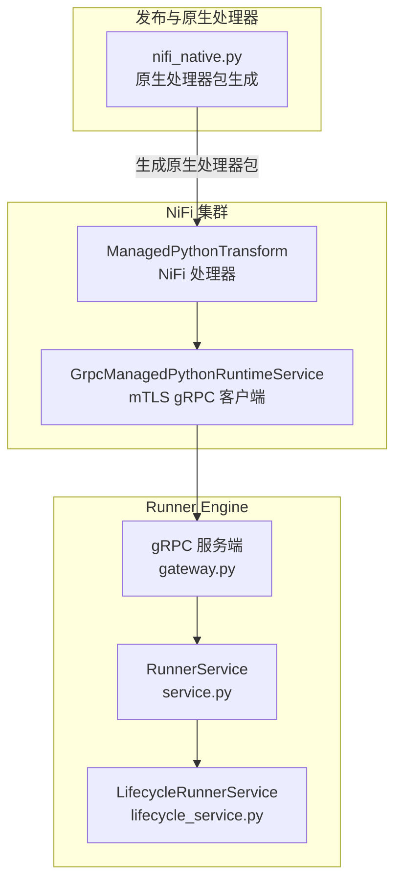
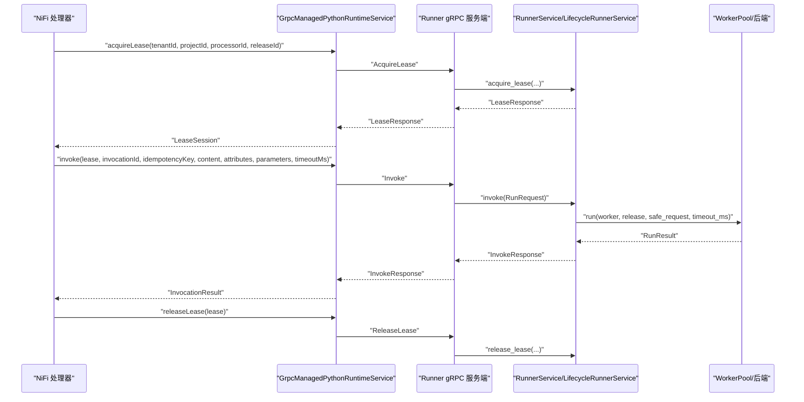
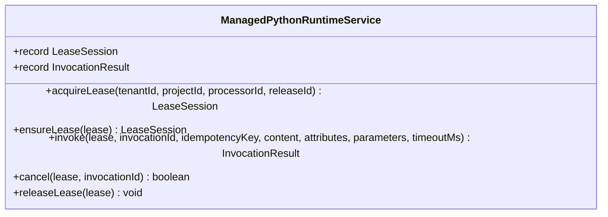
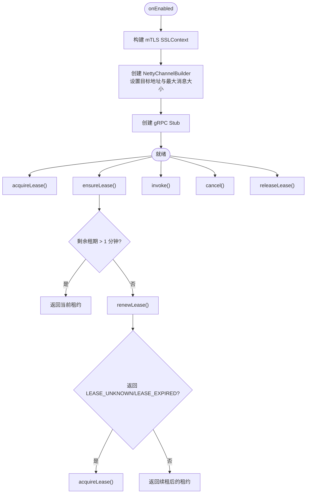
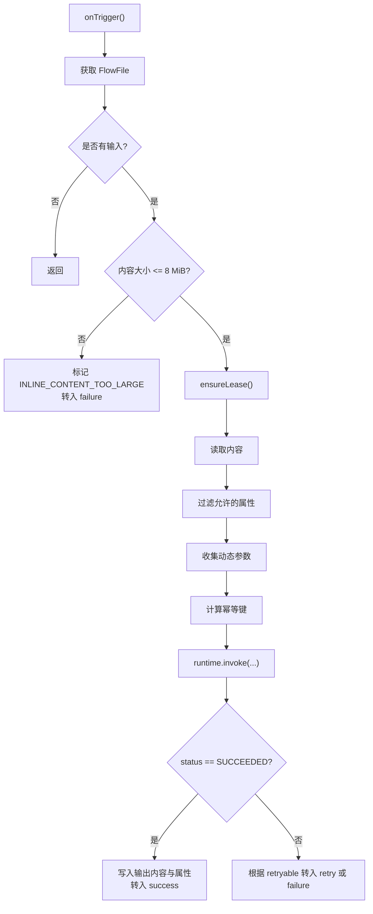
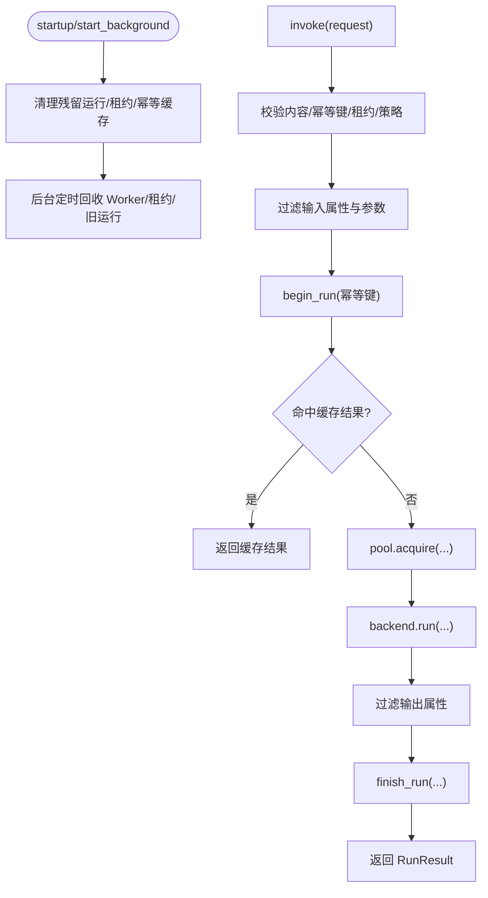
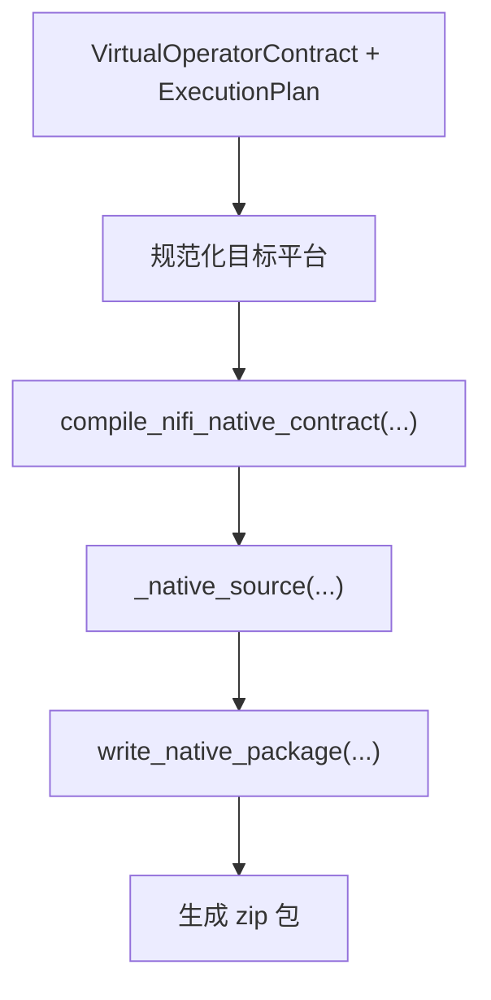
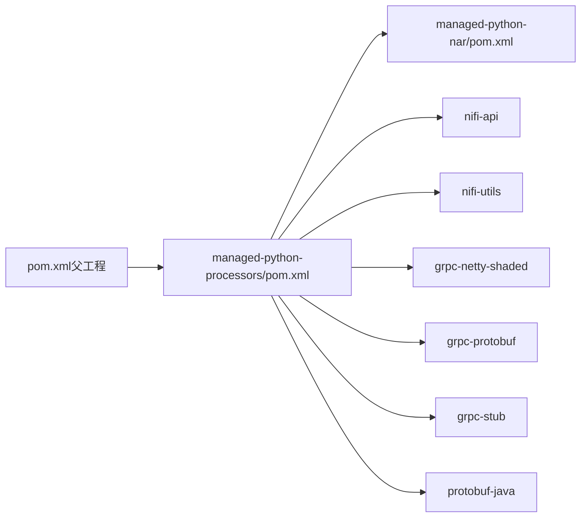

# NiFi 集成

<cite>
**本文引用的文件**   
- [nifi/README.md](file://nifi/README.md)
- [ManagedPythonRuntimeService.java](file://nifi/managed-python-processors/src/main/java/com/dsc/nifi/ManagedPythonRuntimeService.java)
- [GrpcManagedPythonRuntimeService.java](file://nifi/managed-python-processors/src/main/java/com/dsc/nifi/GrpcManagedPythonRuntimeService.java)
- [ManagedPythonTransform.java](file://nifi/managed-python-processors/src/main/java/com/dsc/nifi/ManagedPythonTransform.java)
- [runner.proto](file://proto/runner.proto)
- [gateway.py](file://runner_engine/gateway.py)
- [service.py](file://runner_engine/service.py)
- [lifecycle_service.py](file://runner_engine/lifecycle_service.py)
- [pom.xml（NiFi 父工程）](file://nifi/pom.xml)
- [pom.xml（处理器模块）](file://nifi/managed-python-processors/pom.xml)
- [pom.xml（NAR 打包模块）](file://nifi/managed-python-nar/pom.xml)
- [generate_proto.py](file://scripts/generate_proto.py)
- [nifi_native.py](file://publish_service/backends/nifi_native.py)
</cite>

## 目录
1. [引言](#引言)
2. [项目结构](#项目结构)
3. [核心组件](#核心组件)
4. [架构总览](#架构总览)
5. [详细组件分析](#详细组件分析)
6. [依赖关系分析](#依赖关系分析)
7. [性能与资源管理](#性能与资源管理)
8. [错误处理、日志与监控](#错误处理日志与监控)
9. [部署与配置指南](#部署与配置指南)
10. [故障排查](#故障排查)
11. [结论](#结论)

## 引言
本文件面向 NiFi 管理员与开发者，系统性说明 Runner Engine 与 Apache NiFi 的集成方案。重点包括：
- NiFi 处理器开发架构与实现原理
- ManagedPythonRuntimeService 与 GrpcManagedPythonRuntimeService 的职责
- ManagedPythonTransform 处理器在数据流中的行为
- gRPC 通信协议与安全模型
- 原生处理器集成的构建与发布流程
- 性能调优、资源管理与可观测性建议
- 错误处理、日志记录与运维排障要点

## 项目结构
该仓库中与 NiFi 集成相关的关键位置如下：
- `nifi/`：NiFi 侧 Java 适配器，包含处理器与控制器服务
- `proto/runner.proto`：定义 Runner Engine 与 NiFi 之间的 gRPC 接口
- `runner_engine/`：Runner Engine 后端，提供租约、执行、取消等能力
- `publish_service/backends/nifi_native.py`：原生处理器包生成与发布逻辑
- `scripts/generate_proto.py`：生成 Python gRPC 存根



**图表来源**
- [ManagedPythonTransform.java:32-35](file://nifi/managed-python-processors/src/main/java/com/dsc/nifi/ManagedPythonTransform.java#L32-L35)
- [GrpcManagedPythonRuntimeService.java:32-35](file://nifi/managed-python-processors/src/main/java/com/dsc/nifi/GrpcManagedPythonRuntimeService.java#L32-L35)
- [gateway.py:44-59](file://runner_engine/gateway.py#L44-L59)
- [service.py:80-104](file://runner_engine/service.py#L80-L104)
- [lifecycle_service.py:7-17](file://runner_engine/lifecycle_service.py#L7-L17)
- [nifi_native.py:103-168](file://publish_service/backends/nifi_native.py#L103-L168)

**章节来源**
- [nifi/README.md:1-14](file://nifi/README.md#L1-L14)
- [pom.xml（NiFi 父工程）:12-23](file://nifi/pom.xml#L12-L23)

## 核心组件
- ManagedPythonRuntimeService：NiFi 侧抽象运行时接口，封装租约生命周期与算子调用结果。
- GrpcManagedPythonRuntimeService：基于 mTLS gRPC 的控制器服务实现，负责与 Runner Engine 建立安全连接、续租、调用、取消与释放租约。
- ManagedPythonTransform：NiFi 处理器，负责读取 FlowFile、构造幂等键、调用运行时、根据返回状态路由到 success/failure/retry。
- RunnerEngine gRPC 服务端：暴露 Health/AcquireLease/RenewLease/Invoke/Cancel/ReleaseLease 等 RPC。
- LifecycleRunnerService：在 RunnerService 之上增加运行时生命周期门控，阻止 RETIRING/RETIRED 的新请求。
- nifi_native.py：将 Python 算子编译为可在 NiFi 原生环境中运行的处理器包。

**章节来源**
- [ManagedPythonRuntimeService.java:7-48](file://nifi/managed-python-processors/src/main/java/com/dsc/nifi/ManagedPythonRuntimeService.java#L7-L48)
- [GrpcManagedPythonRuntimeService.java:32-94](file://nifi/managed-python-processors/src/main/java/com/dsc/nifi/GrpcManagedPythonRuntimeService.java#L32-L94)
- [ManagedPythonTransform.java:32-116](file://nifi/managed-python-processors/src/main/java/com/dsc/nifi/ManagedPythonTransform.java#L32-L116)
- [runner.proto:8-15](file://proto/runner.proto#L8-L15)
- [gateway.py:67-194](file://runner_engine/gateway.py#L67-L194)
- [service.py:80-115](file://runner_engine/service.py#L80-L115)
- [lifecycle_service.py:7-32](file://runner_engine/lifecycle_service.py#L7-L32)
- [nifi_native.py:103-168](file://publish_service/backends/nifi_native.py#L103-L168)

## 架构总览
NiFi 通过 ManagedPythonTransform 处理器触发算子执行；处理器持有由 GrpcManagedPythonRuntimeService 管理的租约，并通过 mTLS gRPC 与 Runner Engine 通信。Runner Engine 在服务层进行策略校验、属性过滤、幂等缓存、工作池调度与结果持久化；LifecycleRunnerService 在生命周期维度阻止已退役运行时的新请求。



**图表来源**
- [ManagedPythonTransform.java:134-158](file://nifi/managed-python-processors/src/main/java/com/dsc/nifi/ManagedPythonTransform.java#L134-L158)
- [ManagedPythonTransform.java:160-220](file://nifi/managed-python-processors/src/main/java/com/dsc/nifi/ManagedPythonTransform.java#L160-L220)
- [GrpcManagedPythonRuntimeService.java:114-222](file://nifi/managed-python-processors/src/main/java/com/dsc/nifi/GrpcManagedPythonRuntimeService.java#L114-L222)
- [runner.proto:8-75](file://proto/runner.proto#L8-L75)
- [gateway.py:67-194](file://runner_engine/gateway.py#L67-L194)
- [service.py:188-362](file://runner_engine/service.py#L188-L362)

## 详细组件分析

### ManagedPythonRuntimeService 接口
该接口定义了 NiFi 侧与 Runner Engine 交互的统一契约：
- LeaseSession：租户、项目、处理器、发布版本、租约 ID 与过期时间
- InvocationResult：状态、关系、内容、属性、是否可重试、错误码与消息
- acquireLease/ensureLease/invoke/cancel/releaseLease：完整的租约与调用生命周期



**图表来源**
- [ManagedPythonRuntimeService.java:7-48](file://nifi/managed-python-processors/src/main/java/com/dsc/nifi/ManagedPythonRuntimeService.java#L7-L48)

**章节来源**
- [ManagedPythonRuntimeService.java:7-48](file://nifi/managed-python-processors/src/main/java/com/dsc/nifi/ManagedPythonRuntimeService.java#L7-L48)

### GrpcManagedPythonRuntimeService 实现
职责与特性：
- 作为 NiFi ControllerService，维护一个共享的 mTLS gRPC 通道
- 配置 runner-target、CA 证书、客户端证书与私钥
- 在启用时创建 SSLContext 与 NettyChannelBuilder，并设置最大入站消息大小
- 实现 acquireLease、ensureLease、invoke、cancel、releaseLease
- ensureLease 在剩余租期不足一分钟时续租；遇到 LEASE_UNKNOWN/LEASE_EXPIRED 时重新获取租约



**图表来源**
- [GrpcManagedPythonRuntimeService.java:78-94](file://nifi/managed-python-processors/src/main/java/com/dsc/nifi/GrpcManagedPythonRuntimeService.java#L78-L94)
- [GrpcManagedPythonRuntimeService.java:114-171](file://nifi/managed-python-processors/src/main/java/com/dsc/nifi/GrpcManagedPythonRuntimeService.java#L114-L171)

**章节来源**
- [GrpcManagedPythonRuntimeService.java:32-112](file://nifi/managed-python-processors/src/main/java/com/dsc/nifi/GrpcManagedPythonRuntimeService.java#L32-L112)
- [GrpcManagedPythonRuntimeService.java:114-231](file://nifi/managed-python-processors/src/main/java/com/dsc/nifi/GrpcManagedPythonRuntimeService.java#L114-L231)

### ManagedPythonTransform 处理器
职责与行为：
- 在 onScheduled 中获取租约，在 onStopped 中释放租约
- 每次 onTrigger 先检查 FlowFile 大小，超过限制直接失败
- 计算幂等键：处理器标识 + 发布版本 + FlowFile UUID 的 SHA-256
- 调用 runtime.invoke，并根据返回值决定 success/failure/retry
- 支持动态 Parameter.* 属性映射为算子参数
- 支持 Input Attribute Allow-list 控制哪些 FlowFile 属性可以离开 NiFi JVM



**图表来源**
- [ManagedPythonTransform.java:134-158](file://nifi/managed-python-processors/src/main/java/com/dsc/nifi/ManagedPythonTransform.java#L134-L158)
- [ManagedPythonTransform.java:160-220](file://nifi/managed-python-processors/src/main/java/com/dsc/nifi/ManagedPythonTransform.java#L160-L220)
- [ManagedPythonTransform.java:222-299](file://nifi/managed-python-processors/src/main/java/com/dsc/nifi/ManagedPythonTransform.java#L222-L299)

**章节来源**
- [ManagedPythonTransform.java:32-116](file://nifi/managed-python-processors/src/main/java/com/dsc/nifi/ManagedPythonTransform.java#L32-L116)
- [ManagedPythonTransform.java:134-220](file://nifi/managed-python-processors/src/main/java/com/dsc/nifi/ManagedPythonTransform.java#L134-L220)
- [ManagedPythonTransform.java:222-299](file://nifi/managed-python-processors/src/main/java/com/dsc/nifi/ManagedPythonTransform.java#L222-L299)

### gRPC 协议与服务端实现
协议定义位于 runner.proto，包含健康检查、租约管理、算子调用、取消与释放租约。Runner Engine 的 gateway.py 实现 gRPC 服务端，使用 mTLS，并将 RunnerError 映射为合适的 gRPC 状态码。

```mermaid
erDiagram
HEALTH_REQUEST {}
HEALTH_RESPONSE {
bool ok
string version
}
ACQUIRE_LEASE_REQUEST {
string tenant_id
string project_id
string processor_id
string release_id
}
RENEW_LEASE_REQUEST {
string tenant_id
string lease_id
}
LEASE_RESPONSE {
string lease_id
int64 expires_at_epoch_ms
}
INVOKE_REQUEST {
string tenant_id
string lease_id
string release_id
string invocation_id
string idempotency_key
bytes content
map<string,string> attributes
map<string,string> parameters
int32 timeout_ms
}
INVOKE_RESPONSE {
string status
string relationship
bytes content
map<string,string> attributes
bool retryable
string error_code
string error_message
string worker_id
int32 duration_ms
}
CANCEL_REQUEST {
string tenant_id
string lease_id
string invocation_id
}
CANCEL_RESPONSE {
bool cancelled
}
RELEASE_LEASE_REQUEST {
string tenant_id
string lease_id
}
RELEASE_LEASE_RESPONSE {
bool released
}
```

**图表来源**
- [runner.proto:17-76](file://proto/runner.proto#L17-L76)

**章节来源**
- [runner.proto:1-76](file://proto/runner.proto#L1-L76)
- [gateway.py:44-59](file://runner_engine/gateway.py#L44-L59)
- [gateway.py:67-194](file://runner_engine/gateway.py#L67-L194)

### RunnerEngine 服务层
RunnerService 负责：
- 启动清理、后台回收、关闭
- 租约的获取、续租、释放
- 调用入口：校验内容大小、幂等键、租约有效性、安全策略、属性过滤、超时上限
- 工作池调度、结果持久化、错误分类与重试语义
- 取消操作：验证租约归属并尝试取消活跃调用

LifecycleRunnerService 在此基础上增加运行时生命周期门控，阻止 RETIRING/RETIRED 的新请求。



**图表来源**
- [service.py:105-144](file://runner_engine/service.py#L105-L144)
- [service.py:188-362](file://runner_engine/service.py#L188-L362)
- [lifecycle_service.py:19-70](file://runner_engine/lifecycle_service.py#L19-L70)

**章节来源**
- [service.py:15-22](file://runner_engine/service.py#L15-L22)
- [service.py:80-115](file://runner_engine/service.py#L80-L115)
- [service.py:188-362](file://runner_engine/service.py#L188-L362)
- [service.py:411-455](file://runner_engine/service.py#L411-L455)
- [lifecycle_service.py:7-70](file://runner_engine/lifecycle_service.py#L7-L70)

### 原生处理器集成
publish_service/backends/nifi_native.py 负责：
- 解析目标平台与 Python 版本
- 生成原生处理器类模板，绑定输入/输出与参数
- 打包 requirements.txt、运行时代码与 edge-target.json
- 生成 zip 包供边缘环境部署



**图表来源**
- [nifi_native.py:47-100](file://publish_service/backends/nifi_native.py#L47-L100)
- [nifi_native.py:103-168](file://publish_service/backends/nifi_native.py#L103-L168)
- [nifi_native.py:171-501](file://publish_service/backends/nifi_native.py#L171-L501)
- [nifi_native.py:533-581](file://publish_service/backends/nifi_native.py#L533-L581)

**章节来源**
- [nifi_native.py:103-168](file://publish_service/backends/nifi_native.py#L103-L168)
- [nifi_native.py:171-501](file://publish_service/backends/nifi_native.py#L171-L501)
- [nifi_native.py:533-581](file://publish_service/backends/nifi_native.py#L533-L581)

## 依赖关系分析
NiFi 侧 Maven 工程依赖：
- nifi-api、nifi-utils（provided）
- grpc-netty-shaded、grpc-protobuf、grpc-stub
- protobuf-java
- 通过 protobuf-maven-plugin 从 proto/runner.proto 生成 Java gRPC 存根



**图表来源**
- [pom.xml（NiFi 父工程）:12-23](file://nifi/pom.xml#L12-L23)
- [pom.xml（处理器模块）:16-55](file://nifi/managed-python-processors/pom.xml#L16-L55)
- [pom.xml（NAR 打包模块）:16-33](file://nifi/managed-python-nar/pom.xml#L16-L33)

**章节来源**
- [pom.xml（NiFi 父工程）:12-23](file://nifi/pom.xml#L12-L23)
- [pom.xml（处理器模块）:16-90](file://nifi/managed-python-processors/pom.xml#L16-L90)
- [pom.xml（NAR 打包模块）:16-33](file://nifi/managed-python-nar/pom.xml#L16-L33)

## 性能与资源管理
- 内容大小限制：NiFi 处理器与 Runner Engine 均对内联内容限制为 8 MiB，避免内存膨胀
- 属性限制：Runner Engine 限制属性数量与字节数，并对输入/输出属性按发布版本白名单过滤
- 超时上限：Runner Engine 将调用超时限制在策略 max_timeout_ms 范围内
- 工作池复用：Runner Engine 根据错误类型决定是否复用 Worker，减少冷启动开销
- 后台回收：Runner Engine 定期回收 Worker、过期租约与旧运行记录
- gRPC 消息大小：服务端与客户端均设置 10 MiB 最大消息长度

优化建议：
- 合理设置 NiFi 处理器 timeout-ms，避免长时间阻塞线程
- 控制 FlowFile 属性数量与大小，避免触发 TOO_MANY_ATTRIBUTES/ATTRIBUTES_TOO_LARGE
- 使用幂等键确保 NiFi 重试场景下的安全性
- 调整 Runner Engine 后台回收间隔与工作池大小，匹配吞吐需求

**章节来源**
- [ManagedPythonTransform.java:37-37](file://nifi/managed-python-processors/src/main/java/com/dsc/nifi/ManagedPythonTransform.java#L37-L37)
- [service.py:15-20](file://runner_engine/service.py#L15-L20)
- [service.py:39-60](file://runner_engine/service.py#L39-L60)
- [service.py:231-235](file://runner_engine/service.py#L231-L235)
- [service.py:117-138](file://runner_engine/service.py#L117-L138)
- [gateway.py:184-190](file://runner_engine/gateway.py#L184-L190)

## 错误处理、日志与监控
- NiFi 处理器：
  - 非成功状态会写入 managed.python.error.code 与 managed.python.error.message
  - 根据 retryable 路由到 RETRY 或 FAILURE
  - gRPC 异常抛出 ProcessException，便于 NiFi 重试机制识别
- Runner Engine：
  - RunnerError 统一错误码与可重试语义
  - 后台任务捕获异常并记录日志
  - 工作池清理失败仍保留最终结果权威
- gRPC 服务端：
  - 将 RunnerError 映射为 UNAUTHENTICATED、PERMISSION_DENIED、NOT_FOUND、UNAVAILABLE、FAILED_PRECONDITION
  - 健康检查返回 ok 与版本信息

监控建议：
- 采集 NiFi 处理器 success/failure/retry 比例
- 采集 Runner Engine 后台回收统计与错误日志
- 采集 gRPC 服务端状态码分布与延迟指标

**章节来源**
- [ManagedPythonTransform.java:207-220](file://nifi/managed-python-processors/src/main/java/com/dsc/nifi/ManagedPythonTransform.java#L207-L220)
- [service.py:117-138](file://runner_engine/service.py#L117-L138)
- [service.py:334-362](file://runner_engine/service.py#L334-L362)
- [gateway.py:67-79](file://runner_engine/gateway.py#L67-L79)
- [runner.proto:17-21](file://proto/runner.proto#L17-L21)

## 部署与配置指南

### NiFi 处理器构建与安装
- 父工程 pom.xml 指定 Java 21、NiFi 版本、gRPC 与 Protobuf 版本
- 处理器模块依赖 nifi-api、nifi-utils、gRPC 与 Protobuf，并通过 protobuf-maven-plugin 生成 Java 存根
- NAR 模块将处理器打包为 NiFi NAR 插件

构建步骤：
1. 进入 nifi 目录
2. 执行 mvn clean package
3. 将生成的 NAR 部署到 NiFi 扩展目录

注意事项：
- 若 NiFi 发行版与参考基线不一致，需对齐 nifi.version 与 Java 版本
- 该模块不构建 NiFi 模块本身，因为交付环境无 Maven 网络访问

**章节来源**
- [pom.xml（NiFi 父工程）:12-18](file://nifi/pom.xml#L12-L18)
- [pom.xml（处理器模块）:16-90](file://nifi/managed-python-processors/pom.xml#L16-L90)
- [pom.xml（NAR 打包模块）:16-33](file://nifi/managed-python-nar/pom.xml#L16-L33)
- [nifi/README.md:36-49](file://nifi/README.md#L36-L49)

### Runner Engine gRPC 服务端部署
- 使用 gateway.serve 启动 mTLS gRPC 服务端
- 需要证书、私钥与客户端 CA 文件
- 首次运行前需生成 Python gRPC 存根

生成存根步骤：
1. 执行 scripts/generate_proto.py
2. 生成 runner_engine/generated/*_pb2.py

服务端配置要点：
- 设置最大接收/发送消息长度为 10 MiB
- 使用线程池执行器承载并发请求
- 强制客户端认证

**章节来源**
- [gateway.py:44-59](file://runner_engine/gateway.py#L44-L59)
- [gateway.py:179-194](file://runner_engine/gateway.py#L179-L194)
- [generate_proto.py:1-21](file://scripts/generate_proto.py#L1-L21)

### NiFi 控制器服务配置
- 配置 runner-target：Runner 网关地址
- 配置 runner-ca-cert：Runner CA PEM
- 配置 runner-client-cert：NiFi 集群客户端证书 PEM
- 配置 runner-client-key：NiFi 集群客户端私钥 PEM（敏感字段）

**章节来源**
- [GrpcManagedPythonRuntimeService.java:37-75](file://nifi/managed-python-processors/src/main/java/com/dsc/nifi/GrpcManagedPythonRuntimeService.java#L37-L75)

### NiFi 处理器配置
- runtime-service：选择 GrpcManagedPythonRuntimeService
- tenant-id/project-id/release-id：标识租户、项目与算子发布版本
- input-attributes：逗号分隔的允许离开 NiFi JVM 的属性白名单
- timeout-ms：调用超时毫秒数
- Parameter.*：动态参数，用于传递算子参数

**章节来源**
- [ManagedPythonTransform.java:39-82](file://nifi/managed-python-processors/src/main/java/com/dsc/nifi/ManagedPythonTransform.java#L39-L82)
- [ManagedPythonTransform.java:118-132](file://nifi/managed-python-processors/src/main/java/com/dsc/nifi/ManagedPythonTransform.java#L118-L132)

### 原生处理器集成步骤
- 在 publish_service 中使用 nifi_native backend 编译算子
- 指定 targetPlatform（os/arch/pythonVersion/uvPythonPlatform）
- 生成原生处理器类与描述符
- 打包 requirements.txt、运行时代码与 edge-target.json
- 将 zip 包部署到边缘环境

**章节来源**
- [nifi_native.py:47-100](file://publish_service/backends/nifi_native.py#L47-L100)
- [nifi_native.py:103-168](file://publish_service/backends/nifi_native.py#L103-L168)
- [nifi_native.py:533-581](file://publish_service/backends/nifi_native.py#L533-L581)

## 故障排查
常见问题与建议：
- Runner 服务未启用：GrpcManagedPythonRuntimeService 在 stub 为空时抛出 IllegalStateException
- 租约未知或过期：ensureLease 检测到 LEASE_UNKNOWN/LEASE_EXPIRED 后自动重新获取租约
- 内容过大：NiFi 处理器与 Runner Engine 均拒绝超过 8 MiB 的内联内容
- 属性超限：Runner Engine 校验属性数量与字节数，超出则抛出 INVALID_ATTRIBUTES/ATTRIBUTES_TOO_LARGE
- 幂等键缺失：Runner Engine 要求 idempotency_key
- 运行时退役：LifecycleRunnerService 阻止 RETIRING/RETIRED 的新请求
- gRPC 异常：NiFi 处理器抛出 ProcessException，Runner Engine 映射为相应 gRPC 状态码

排查步骤：
- 检查 NiFi 控制器服务证书与密钥是否正确
- 确认 Runner Engine 已生成 gRPC 存根并正常启动
- 查看 NiFi 处理器日志中的 managed.python.error.code/message
- 查看 Runner Engine 后台回收与错误日志
- 核对发布版本的 input/output 属性白名单与策略配置

**章节来源**
- [GrpcManagedPythonRuntimeService.java:224-230](file://nifi/managed-python-processors/src/main/java/com/dsc/nifi/GrpcManagedPythonRuntimeService.java#L224-L230)
- [GrpcManagedPythonRuntimeService.java:158-170](file://nifi/managed-python-processors/src/main/java/com/dsc/nifi/GrpcManagedPythonRuntimeService.java#L158-L170)
- [ManagedPythonTransform.java:169-173](file://nifi/managed-python-processors/src/main/java/com/dsc/nifi/ManagedPythonTransform.java#L169-L173)
- [service.py:39-60](file://runner_engine/service.py#L39-L60)
- [service.py:188-198](file://runner_engine/service.py#L188-L198)
- [lifecycle_service.py:19-32](file://runner_engine/lifecycle_service.py#L19-L32)
- [gateway.py:67-79](file://runner_engine/gateway.py#L67-L79)

## 结论
本集成方案通过 NiFi 处理器与 Runner Engine 的 mTLS gRPC 通信，实现了安全、幂等、可重试的 Python 算子执行。ManagedPythonRuntimeService 与 GrpcManagedPythonRuntimeService 提供了统一的运行时抽象与安全的网络连接；ManagedPythonTransform 在 NiFi 数据流中完成输入过滤、幂等键生成与结果路由；Runner Engine 在服务层完成策略校验、属性过滤、工作池调度与结果持久化；LifecycleRunnerService 提供运行时生命周期门控；原生处理器后端支持将 Python 算子编译为可部署的边缘包。通过合理的配置与监控，可以在生产环境中稳定运行大规模数据处理流水线。