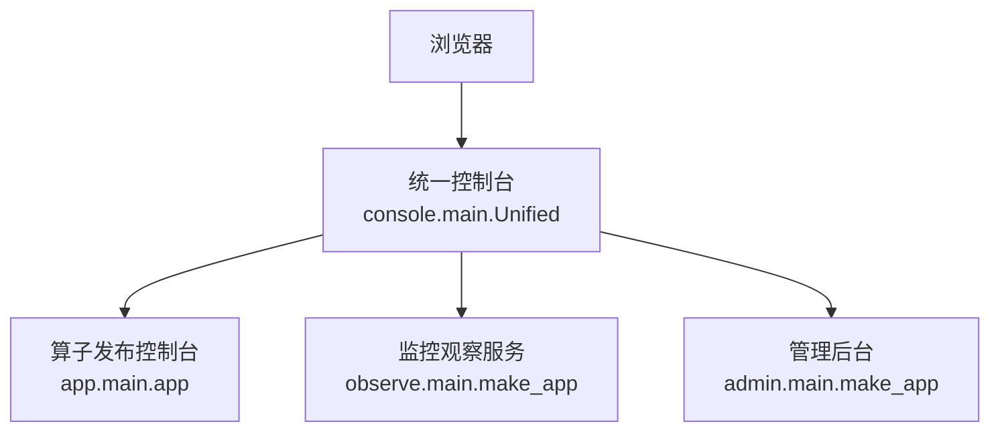
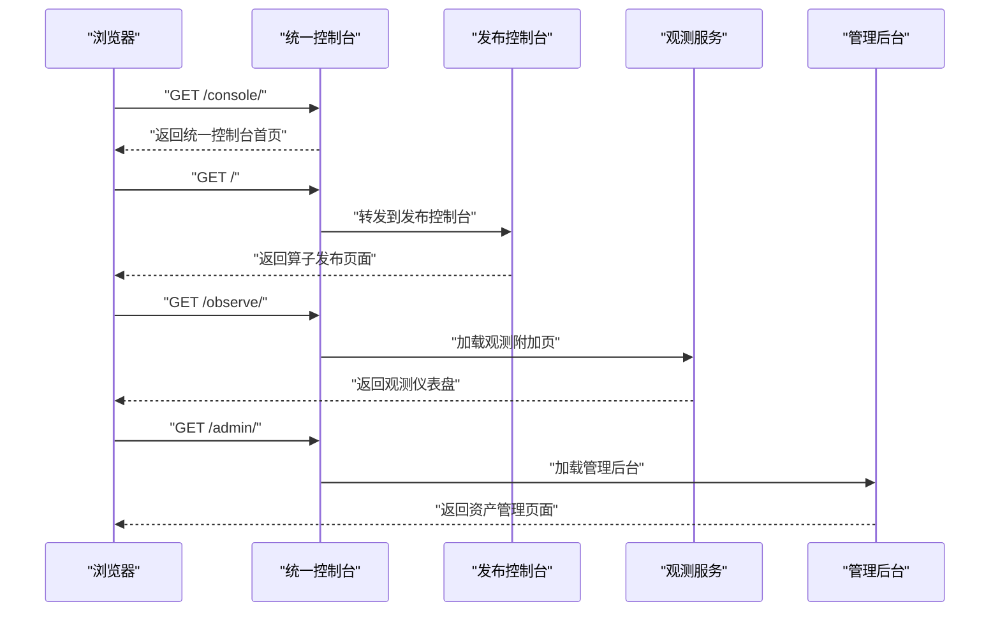
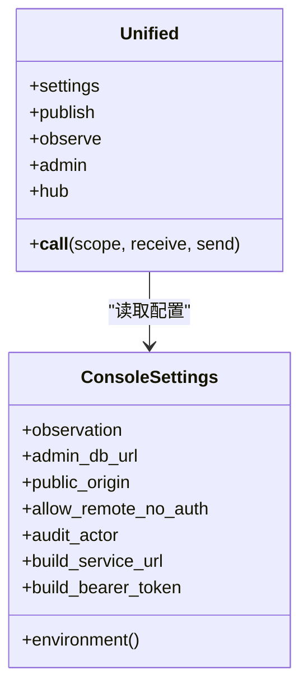
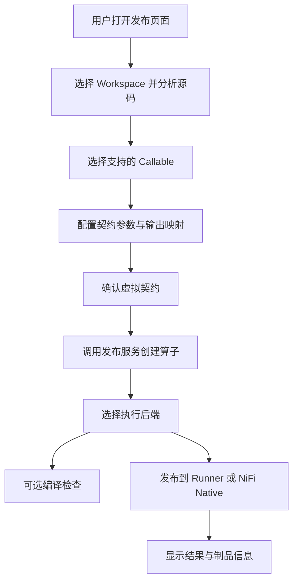
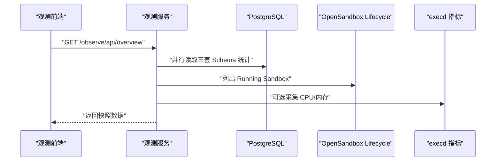
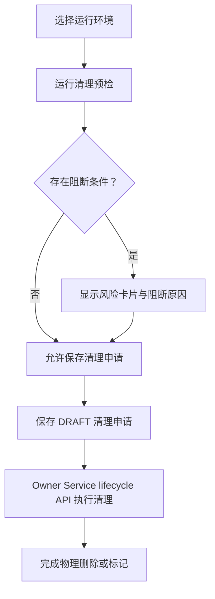
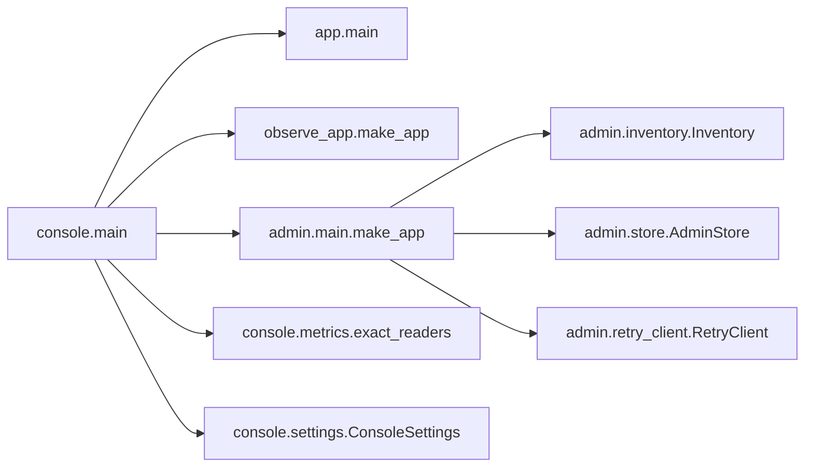

# Web 控制台

<cite>
**本文引用的文件**   
- [web/README.md](file://web/README.md)
- [web/UNIFIED_CONSOLE_README.md](file://web/UNIFIED_CONSOLE_README.md)
- [web/OBSERVABILITY_README.md](file://web/OBSERVABILITY_README.md)
- [web/RUNTIME_DIAGNOSIS.md](file://web/RUNTIME_DIAGNOSIS.md)
- [web/app/main.py](file://web/app/main.py)
- [web/console/main.py](file://web/console/main.py)
- [web/console/settings.py](file://web/console/settings.py)
- [web/console/static/index.html](file://web/console/static/index.html)
- [web/admin/main.py](file://web/admin/main.py)
- [web/admin/static/index.html](file://web/admin/static/index.html)
- [web/observe/main.py](file://web/observe/main.py)
- [web/observe/static/index.html](file://web/observe/static/index.html)
- [web/app/static/index.html](file://web/app/static/index.html)
- [web/console/static/observe.html](file://web/console/static/observe.html)
</cite>

## 目录
1. [简介](#简介)
2. [项目结构](#项目结构)
3. [核心组件](#核心组件)
4. [架构总览](#架构总览)
5. [详细组件分析](#详细组件分析)
6. [依赖关系分析](#依赖关系分析)
7. [性能与可伸缩性](#性能与可伸缩性)
8. [故障排查指南](#故障排查指南)
9. [结论](#结论)
10. [附录：前端交互、属性与配置参考](#附录前端交互属性与配置参考)

## 简介
本仓库的 Web 控制台由四个相互协作但职责清晰的界面组成：
- 统一控制台入口 `/console`：聚合发布、观测与管理三个模块。
- 算子发布控制台 `/`：基于 FastAPI BFF 的五步向导，对接 Publish Service。
- 监控观察界面 `/observe`：只读指标面板，读取三套 PostgreSQL Schema 和 OpenSandbox。
- 管理后台 `/admin`：运行资产管理、清理预检、审计记录与构建重试协调。

统一控制台采用“一个 ASGI 进程 + 多应用挂载”的方式，保留原发布页面路由不变，同时提供免登录的统一导航。所有页面默认不实现浏览器登录；生产部署应通过反向代理、防火墙或网关进行访问控制。

**章节来源**
- [web/UNIFIED_CONSOLE_README.md:65-111](file://web/UNIFIED_CONSOLE_README.md#L65-L111)
- [web/README.md:66-87](file://web/README.md#L66-L87)

## 项目结构
Web 层按功能划分为以下主要目录：
- `app/`：原版算子发布控制台与 BFF 路由。
- `console/`：统一控制台入口、设置、观测附加页与静态资源。
- `admin/`：管理后台后端路由、资产清单、清理流程与审计存储。
- `observe/`：独立观测服务，包含数据库指标、OpenSandbox 生命周期与 execd 资源采样。
- `static/`：各模块的前端 HTML/CSS/JS 资源。

**图表来源**
- [web/console/main.py:34-115](file://web/console/main.py#L34-L115)
- [web/app/main.py:17-23](file://web/app/main.py#L17-L23)
- [web/observe/main.py:57-82](file://web/observe/main.py#L57-L82)
- [web/admin/main.py:47-69](file://web/admin/main.py#L47-L69)

**章节来源**
- [web/console/main.py:1-10](file://web/console/main.py#L1-L10)
- [web/UNIFIED_CONSOLE_README.md:65-78](file://web/UNIFIED_CONSOLE_README.md#L65-L78)

## 核心组件
- 统一控制台入口：负责路径分发、静态资源挂载、统一导航页 `/console` 以及 `/observe`、`/admin` 的轻量跳转。
- 算子发布控制台：FastAPI 应用，将 `/api/*` 请求转发到 Publish Service，并提供五步向导页面。
- 监控观察服务：独立的 FastAPI 应用，提供健康检查、数据库指标、Sandbox 列表与运行时摘要。
- 管理后台：面向运维的管理视图，提供环境预览、清理申请、备注与审计记录，并通过 Build/Publish/Runner 所有者接口协调实际变更。

**章节来源**
- [web/console/main.py:34-115](file://web/console/main.py#L34-L115)
- [web/app/main.py:17-23](file://web/app/main.py#L17-L23)
- [web/observe/main.py:57-168](file://web/observe/main.py#L57-L168)
- [web/admin/main.py:47-118](file://web/admin/main.py#L47-L118)

## 架构总览
统一控制台是请求入口，但不替代业务服务的认证与授权。它根据路径决定由哪个子应用处理请求：
- `/`、`/api/*`、`/static/*`：原发布控制台。
- `/observe/`：观测附加页或独立观测服务。
- `/admin/`：管理后台。
- `/console/`：统一控制台首页与导航。

**图表来源**
- [web/console/main.py:64-112](file://web/console/main.py#L64-L112)
- [web/app/main.py:188-203](file://web/app/main.py#L188-L203)
- [web/observe/main.py:155-167](file://web/observe/main.py#L155-L167)
- [web/admin/main.py:116-118](file://web/admin/main.py#L116-L118)

**章节来源**
- [web/console/main.py:91-112](file://web/console/main.py#L91-L112)
- [web/UNIFIED_CONSOLE_README.md:65-83](file://web/UNIFIED_CONSOLE_README.md#L65-L83)

## 详细组件分析

### 统一控制台
统一控制台使用 `Unified` 类组合三个子应用：
- 保留原发布应用 `publish_app`。
- 构造观测应用并注入数据库读者。
- 构造管理应用并注入资产清单、审计存储与重试客户端。
- 定义 `/console`、`/observe`、`/admin` 的跳转与静态资源挂载。
- 在 `__call__` 中按路径分发请求。

**图表来源**
- [web/console/main.py:34-89](file://web/console/main.py#L34-L89)
- [web/console/settings.py:23-84](file://web/console/settings.py#L23-L84)

关键行为：
- `/console` 重定向到 `/console/`，返回统一控制台首页。
- `/observe` 重定向到 `/observe/`，返回观测附加页。
- `/admin` 重定向到 `/admin/`，进入管理后台。
- 非匹配路径回退到原发布控制台。

安全边界：
- 统一控制台本身不提供登录。
- 非回环地址启动时要求显式允许远程无认证访问，并要求设置同源 Origin。
- 管理写操作需要同源 JSON 请求与特定请求头校验。

**章节来源**
- [web/console/main.py:34-147](file://web/console/main.py#L34-L147)
- [web/console/settings.py:33-84](file://web/console/settings.py#L33-L84)
- [web/UNIFIED_CONSOLE_README.md:74-111](file://web/UNIFIED_CONSOLE_README.md#L74-L111)

### 算子发布控制台
算子发布控制台是一个 FastAPI 应用，提供：
- 健康检查与 OpenAPI 元数据转发。
- Edge 平台、部署、Bundle 与 Operation 查询。
- 作者工作区分析、算子创建、编译与发布。
- 主页面与 Edge 管理/运维页面。

**图表来源**
- [web/app/main.py:125-175](file://web/app/main.py#L125-L175)
- [web/README.md:188-347](file://web/README.md#L188-L347)

BFF 路由表：
| Web BFF | Publish Service |
|---|---|
| `GET /api/health` | `GET /health` |
| `GET /api/openapi` | `GET /openapi.json` |
| `POST /api/authoring/analyze` | `POST /v1/authoring/analyze` |
| `POST /api/operators` | `POST /v1/operators` |
| `GET /api/operators/{operator_id}` | `GET /v1/operators/{operator_id}` |
| `POST /api/operators/{operator_id}/backends/{backend}/compile` | 同路径 Publish Service |
| `POST /api/operators/{operator_id}/backends/{backend}/publish` | 同路径 Publish Service |

错误处理：
- 上游超时返回 504。
- 上游不可达返回 502。
- 未知 URL 不会变成通用代理，仅注册明确路由。

**章节来源**
- [web/app/main.py:43-81](file://web/app/main.py#L43-L81)
- [web/app/main.py:84-175](file://web/app/main.py#L84-L175)
- [web/README.md:349-363](file://web/README.md#L349-L363)

### 监控观察界面
监控观察界面提供只读指标，数据来源包括：
- 三套 PostgreSQL Schema：Publish、Build、Runner。
- OpenSandbox Lifecycle API。
- 可选 execd 资源指标。

**图表来源**
- [web/observe/main.py:116-153](file://web/observe/main.py#L116-L153)
- [web/OBSERVABILITY_README.md:86-144](file://web/OBSERVABILITY_README.md#L86-L144)
- [web/OBSERVABILITY_README.md:146-230](file://web/OBSERVABILITY_README.md#L146-L230)

关键特性：
- 未连接或未识别表时显示“—”，不伪造零值。
- 最近 24 小时统计仅在时间字段可用时展示。
- Sandbox 列表分页读取，超过上限时提示截断。
- execd 资源采样受并发、样本数与超时限制。

**章节来源**
- [web/observe/main.py:57-168](file://web/observe/main.py#L57-L168)
- [web/OBSERVABILITY_README.md:55-144](file://web/OBSERVABILITY_README.md#L55-L144)
- [web/OBSERVABILITY_README.md:146-230](file://web/OBSERVABILITY_README.md#L146-L230)

### 管理后台
管理后台提供：
- 资产总览、运行环境、Runner 执行、发布记录、清理申请、备注与审计。
- 清理预检：检查别名、活动构建任务、已发布作业引用与 Runner 租约。
- 构建重试：通过 Build Service API 重试失败环境，而非直接修改业务表。
- 审计记录：写入独立管理数据库 Schema。

**图表来源**
- [web/admin/main.py:164-233](file://web/admin/main.py#L164-L233)
- [web/admin/main.py:288-322](file://web/admin/main.py#L288-L322)
- [web/UNIFIED_CONSOLE_README.md:151-190](file://web/UNIFIED_CONSOLE_README.md#L151-L190)

安全与权限：
- 管理写操作要求同源 JSON 请求与 `X-Admin-Request` 头。
- 不直接 UPDATE/DELETE 三个业务 Schema。
- 物理镜像删除需 Owner Service lifecycle API 支持。
- 审计 actor 固定为 `console-operator`，不是个人身份审计。

**章节来源**
- [web/admin/main.py:72-104](file://web/admin/main.py#L72-L104)
- [web/admin/main.py:120-162](file://web/admin/main.py#L120-L162)
- [web/admin/main.py:178-233](file://web/admin/main.py#L178-L233)
- [web/admin/main.py:288-322](file://web/admin/main.py#L288-L322)
- [web/UNIFIED_CONSOLE_README.md:151-190](file://web/UNIFIED_CONSOLE_README.md#L151-L190)

## 依赖关系分析
- 统一控制台依赖：
  - 原发布控制台 `app.main.app`。
  - 观测应用工厂 `observe_app.make_app`。
  - 管理应用工厂 `admin.main.make_app`。
  - 资产清单 `admin.inventory.Inventory`。
  - 管理存储 `admin.store.AdminStore`。
  - 重试客户端 `admin.retry_client.RetryClient`。
  - 精确数据库读者 `console.metrics.exact_readers`。
  - 统一设置 `console.settings.ConsoleSettings`。

**图表来源**
- [web/console/main.py:21-29](file://web/console/main.py#L21-L29)
- [web/console/main.py:34-58](file://web/console/main.py#L34-L58)
- [web/admin/main.py:16-21](file://web/admin/main.py#L16-L21)

**章节来源**
- [web/console/main.py:21-58](file://web/console/main.py#L21-L58)
- [web/admin/main.py:16-21](file://web/admin/main.py#L16-L21)

## 性能与可伸缩性
- 观测服务对三套数据库统计使用并行采集，避免串行阻塞。
- execd 资源采样限制并发数与样本数量，防止短时间密集监测造成后端压力。
- 发布控制台对长耗时操作启用长超时分支，避免普通 HTTP 超时误判。
- 管理后台将库存报告与管理元数据读取并行执行，提升总览响应速度。
- 统一控制台保持静态资源与服务端渲染简单，不引入前端构建链。

建议：
- 在高负载环境中调整观测刷新频率与采样上限。
- 将统一控制台置于反向代理后，启用连接池与限流。
- 对 Publish Service 与 Build Service 设置合理超时与重试策略。

[本节为通用指导，不直接分析具体代码文件]

## 故障排查指南
常见现象与定位方式：
- 发布控制台无法连接 Publish Service：检查 BFF 超时与不可达错误码。
- 观测页面显示“—”：可能是数据库未连接、Schema 未识别或权限不足。
- Sandbox 资源指标为空：可能未开启 execd 采集或目标 origin 不在允许列表。
- 管理后台写操作被拒绝：检查同源 Origin、Content-Type 与 `X-Admin-Request`。
- Runner 输出编码异常：核对 Virtual Contract 输出 codec 与实际返回值类型。

**章节来源**
- [web/app/main.py:43-81](file://web/app/main.py#L43-L81)
- [web/OBSERVABILITY_README.md:86-144](file://web/OBSERVABILITY_README.md#L86-L144)
- [web/OBSERVABILITY_README.md:177-230](file://web/OBSERVABILITY_README.md#L177-L230)
- [web/admin/main.py:72-104](file://web/admin/main.py#L72-L104)
- [web/RUNTIME_DIAGNOSIS.md:1-97](file://web/RUNTIME_DIAGNOSIS.md#L1-L97)

## 结论
Web 控制台以统一入口整合发布、观测与管理三大界面，既保留原有发布工作流，又提供只读观测与可审计的运行资产管理。其设计强调：
- 职责分离：发布、观测、管理各自独立，统一控制台只做路由与导航。
- 安全优先：默认免登录，生产必须配合网络访问控制与同源校验。
- 数据真实：观测指标不伪造，缺失数据明确显示未知状态。
- 可维护性：最小化前端构建依赖，清晰的后端路由与配置边界。

[本节为总结，不直接分析具体代码文件]

## 附录：前端交互、属性与配置参考

### 统一控制台首页
- 入口：`/console/`。
- 功能：跳转到算子发布、指标观测、运行资产管理。
- 视觉：顶部品牌标识、产品名与版本；三个模块卡片分别对应不同用途。
- 交互：点击卡片进入对应模块；底部说明统一入口与独立模块关系。

**章节来源**
- [web/console/static/index.html:1-28](file://web/console/static/index.html#L1-L28)

### 算子发布控制台
- 入口：`/`。
- 步骤：工作区分析、Callable 选择、契约配置、确认创建、编译发布。
- 视觉：顶部进度条、上下文条、分步页面、右侧契约摘要。
- 交互：搜索与过滤 Callable；参数来源切换；固定值类型切换；发布前确认对话框。
- 事件：分析成功、创建成功、编译成功、发布成功、SOURCE_CHANGED 重新分析。
- 插槽与扩展：高级信息查看原始 JSON；自定义请求编辑用于排障。
- 响应式：适配小屏手机；键盘焦点与加载反馈。

**章节来源**
- [web/app/static/index.html:14-365](file://web/app/static/index.html#L14-L365)
- [web/README.md:8-60](file://web/README.md#L8-L60)
- [web/README.md:188-347](file://web/README.md#L188-L347)

### 监控观察界面
- 入口：`/observe/`。
- 功能：数据库指标、OpenSandbox 实例、execd 资源采样。
- 视觉：只读标签、连接状态胶囊、侧边导航、KPI 卡片、表格与脚注。
- 交互：自动刷新频率选择、立即刷新、搜索与排序。
- 事件：数据加载、采样失败、连接状态变化。
- 可访问性：ARIA 标签、语义化标题、状态区域 `aria-live`。
- 响应式：移动端侧边栏与表格滚动。

**章节来源**
- [web/observe/static/index.html:1-168](file://web/observe/static/index.html#L1-L168)
- [web/OBSERVABILITY_README.md:86-144](file://web/OBSERVABILITY_README.md#L86-L144)
- [web/OBSERVABILITY_README.md:146-230](file://web/OBSERVABILITY_README.md#L146-L230)

### 管理后台
- 入口：`/admin/`。
- 功能：总览、运行环境、Runner 执行、发布记录、清理申请、备注、审计。
- 视觉：顶部导航、侧边功能菜单、面板与表格、确认对话框。
- 交互：环境搜索、清理预检、保存清理申请、备注增删改、审计查看。
- 事件：预检成功、申请保存、重试接受、审计记录写入。
- 安全：同源 JSON 校验、CSP、X-Frame-Options、Referrer-Policy。
- 可访问性：导航标签、按钮 aria-label、状态区域。

**章节来源**
- [web/admin/static/index.html:1-139](file://web/admin/static/index.html#L1-L139)
- [web/admin/main.py:72-104](file://web/admin/main.py#L72-L104)
- [web/admin/main.py:116-338](file://web/admin/main.py#L116-L338)

### 跨浏览器兼容性与性能优化
- 兼容性：
  - 使用标准 HTML/CSS/JavaScript，无需 Node 构建。
  - 避免外部字体与图标 CDN，降低第三方依赖风险。
  - 使用语义化标签与 ARIA 提升辅助技术支持。
- 性能：
  - 观测服务并行读取数据库与 Sandbox 数据。
  - execd 采样限制并发与样本数。
  - 发布控制台对长耗时操作使用长超时。
  - 静态资源通过 FastAPI StaticFiles 提供。

**章节来源**
- [web/README.md:131-134](file://web/README.md#L131-L134)
- [web/observe/main.py:116-153](file://web/observe/main.py#L116-L153)
- [web/OBSERVABILITY_README.md:219-224](file://web/OBSERVABILITY_README.md#L219-L224)
- [web/app/main.py:43-81](file://web/app/main.py#L43-L81)

### 组件组合模式与集成方式
- 统一控制台组合发布、观测、管理三个子应用。
- 管理后台组合资产清单、审计存储与重试客户端。
- 观测服务组合数据库读者、Sandbox 阅读器与运行时阅读器。
- 前端通过静态资源与服务端路由集成，不耦合后端实现细节。

**章节来源**
- [web/console/main.py:34-89](file://web/console/main.py#L34-L89)
- [web/admin/main.py:47-69](file://web/admin/main.py#L47-L69)
- [web/observe/main.py:57-82](file://web/observe/main.py#L57-L82)