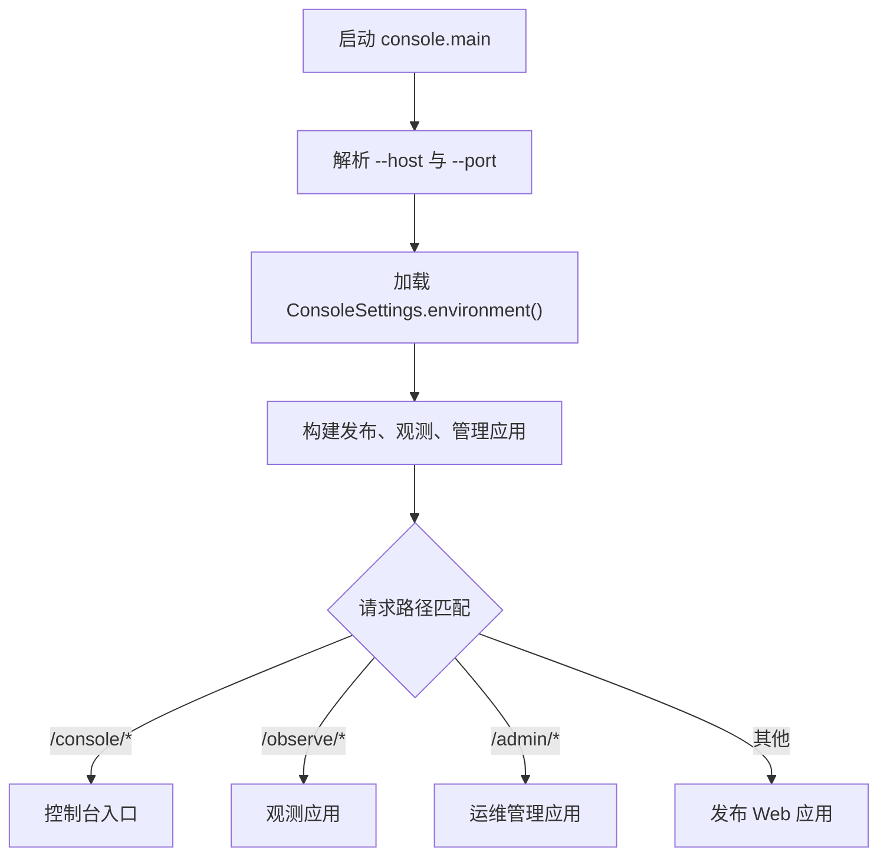
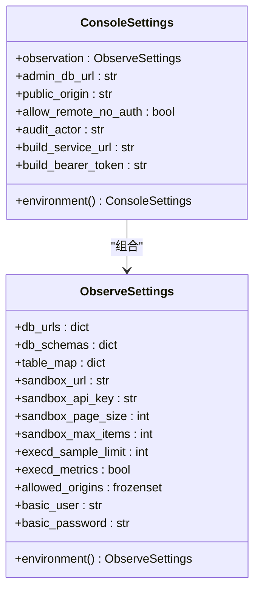
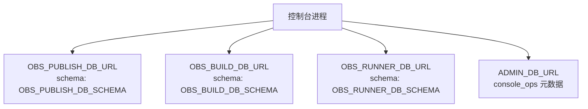
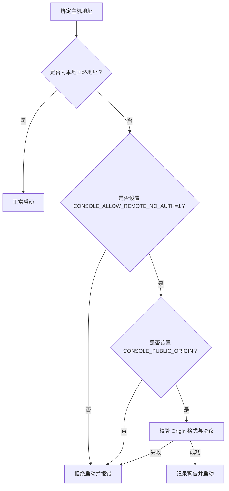
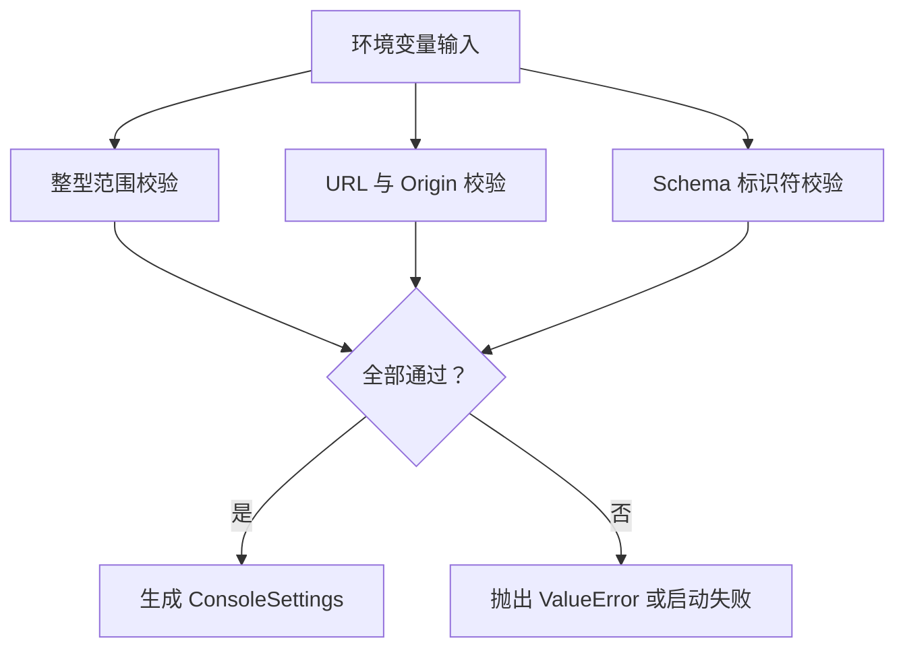
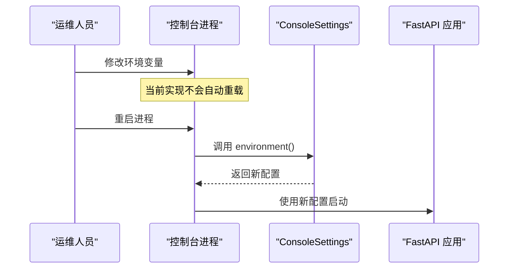
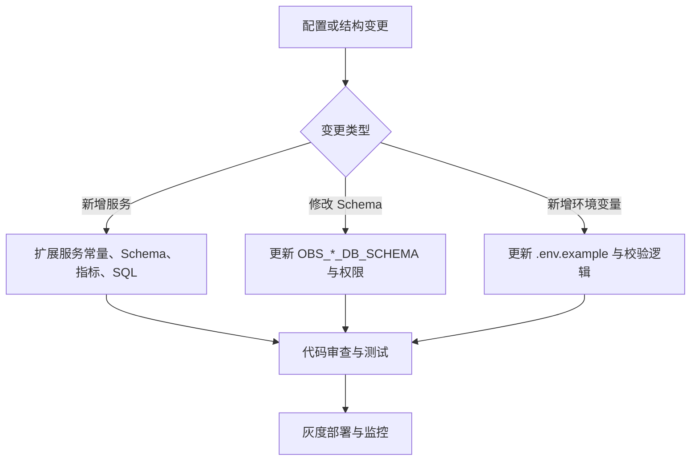

# 控制台配置

<cite>
**本文引用的文件**   
- [web/console/settings.py](file://web/console/settings.py)
- [web/console/main.py](file://web/console/main.py)
- [web/observe/settings.py](file://web/observe/settings.py)
- [web/console/sql_schemas.py](file://web/console/sql_schemas.py)
- [web/console/metrics.py](file://web/console/metrics.py)
- [web/console/.env.example](file://web/console/.env.example)
- [web/console/sql/readonly_grants.example.sql](file://web/console/sql/readonly_grants.example.sql)
- [web/admin/store.py](file://web/admin/store.py)
- [web/UNIFIED_CONSOLE_README.md](file://web/UNIFIED_CONSOLE_README.md)
</cite>

## 目录
1. [简介](#简介)
2. [项目结构与入口](#项目结构与入口)
3. [核心配置模型](#核心配置模型)
4. [数据库连接配置](#数据库连接配置)
5. [安全与网络配置](#安全与网络配置)
6. [环境变量总览](#环境变量总览)
7. [配置验证机制与默认值](#配置验证机制与默认值)
8. [部署环境示例与最佳实践](#部署环境示例与最佳实践)
9. [热重载与动态配置更新](#热重载与动态配置更新)
10. [敏感信息与配置安全](#敏感信息与配置安全)
11. [配置文件版本管理与迁移策略](#配置文件版本管理与迁移策略)
12. [故障排查指南](#故障排查指南)
13. [结论](#结论)

## 简介
本文件面向“统一控制台”的运行时配置，重点说明以下方面：
- 控制台如何从环境变量加载配置。
- 观测数据源、管理元数据、沙箱服务、构建服务、网络监听与安全策略的配置方式。
- 配置校验规则、默认值来源和错误处理。
- 不同部署环境的推荐配置模式。
- 当前代码是否支持运行期热重载或动态配置更新。
- 敏感信息保护、权限最小化以及数据库只读访问建议。
- 配置项的版本演进、迁移注意事项和向后兼容边界。

该控制台采用“一个进程承载多个子应用”的方式，包括发布 Web、观测页面、运维管理和新的控制台入口。它不启用浏览器登录，因此安全边界主要依赖网络访问控制、同源校验、数据库权限和审计 actor。

**章节来源**
- [web/console/main.py:1-10](file://web/console/main.py#L1-L10)
- [web/UNIFIED_CONSOLE_README.md:79-114](file://web/UNIFIED_CONSOLE_README.md#L79-L114)

## 项目结构与入口
控制台主入口位于 `web/console/main.py`，启动时会：
- 解析命令行参数，例如 `--host` 和 `--port`。
- 加载 `ConsoleSettings.environment()` 生成不可变配置对象。
- 根据路径将请求路由到发布应用、观测应用、管理应用或控制台静态页面。
- 在非本地地址绑定且未显式允许远程无认证访问时拒绝启动。

**图表来源**
- [web/console/main.py:34-115](file://web/console/main.py#L34-L115)

**章节来源**
- [web/console/main.py:11-31](file://web/console/main.py#L11-L31)
- [web/console/main.py:91-147](file://web/console/main.py#L91-L147)

## 核心配置模型
控制台的核心配置由 `ConsoleSettings` 表示，它是一个冻结的数据类，包含：
- 观测配置：复用 `ObserveSettings`，负责三个服务的数据库连接、沙箱 URL、分页限制、指标开关和允许的 Origin。
- 管理数据库连接：`admin_db_url`，用于控制台运维元数据。
- 公网 Origin：`public_origin`，用于管理写请求的同源校验。
- 远程无认证访问开关：`allow_remote_no_auth`。
- 审计操作者：`audit_actor`，固定为 `console-operator`。
- 构建服务调用地址与令牌：`build_service_url` 与 `build_bearer_token`。

**图表来源**
- [web/console/settings.py:23-84](file://web/console/settings.py#L23-L84)
- [web/observe/settings.py:79-127](file://web/observe/settings.py#L79-L127)

**章节来源**
- [web/console/settings.py:23-84](file://web/console/settings.py#L23-L84)

## 数据库连接配置
控制台涉及两类数据库：

### 观测数据库
观测数据来自三个服务：publish、build、runner。每个服务都有独立的 DSN 和 schema：
- `OBS_PUBLISH_DB_URL` / `OBS_BUILD_DB_URL` / `OBS_RUNNER_DB_URL`
- `OBS_PUBLISH_DB_SCHEMA` / `OBS_BUILD_DB_SCHEMA` / `OBS_RUNNER_DB_SCHEMA`

这些值在 `ObserveSettings.environment()` 中读取，并在 `ConsoleSettings.environment()` 中被覆盖为受控 schema 映射。控制台强制使用固定 SQL 表结构，不允许通过 `OBS_TABLE_MAP_FILE` 动态映射表。

### 管理数据库
`ADMIN_DB_URL` 用于控制台运维元数据，例如资产备注、清理请求等。如果未配置，管理模块会返回“未配置”状态，而不是直接崩溃。

**图表来源**
- [web/console/settings.py:35-45](file://web/console/settings.py#L35-L45)
- [web/console/settings.py:78-83](file://web/console/settings.py#L78-L83)
- [web/observe/settings.py:105-114](file://web/observe/settings.py#L105-L114)
- [web/admin/store.py:121-155](file://web/admin/store.py#L121-L155)

**章节来源**
- [web/console/settings.py:35-45](file://web/console/settings.py#L35-L45)
- [web/console/settings.py:78-83](file://web/console/settings.py#L78-L83)
- [web/observe/settings.py:105-114](file://web/observe/settings.py#L105-L114)
- [web/admin/store.py:121-155](file://web/admin/store.py#L121-L155)

## 安全与网络配置
控制台默认不启用浏览器登录，因此安全模型强调：
- 默认绑定 `127.0.0.1`。
- 非本地地址必须显式设置 `CONSOLE_ALLOW_REMOTE_NO_AUTH=1`。
- 非本地地址还必须设置 `CONSOLE_PUBLIC_ORIGIN`，作为浏览器同源校验依据。
- HTTP 远程 Origin 需要显式允许远程无认证访问。
- 管理写请求仍会检查 JSON Content-Type、Origin 和内部请求头，但这些不是完整认证机制。

**图表来源**
- [web/console/main.py:118-142](file://web/console/main.py#L118-L142)
- [web/console/settings.py:61-75](file://web/console/settings.py#L61-L75)

**章节来源**
- [web/console/main.py:118-142](file://web/console/main.py#L118-L142)
- [web/console/settings.py:61-75](file://web/console/settings.py#L61-L75)
- [web/UNIFIED_CONSOLE_README.md:84-114](file://web/UNIFIED_CONSOLE_README.md#L84-L114)

## 环境变量总览
下表汇总控制台相关的环境变量。未列出的变量属于其他子系统，不在本控制台配置范围内。

| 分类 | 环境变量 | 类型 | 默认值 | 说明 |
|---|---|---|---|---|
| 观测数据库 | `OBS_PUBLISH_DB_URL` | 字符串 | 空 | publish 服务 PostgreSQL 连接串 |
| 观测数据库 | `OBS_BUILD_DB_URL` | 字符串 | 空 | build 服务 PostgreSQL 连接串 |
| 观测数据库 | `OBS_RUNNER_DB_URL` | 字符串 | 空 | runner 服务 PostgreSQL 连接串 |
| 观测 Schema | `OBS_PUBLISH_DB_SCHEMA` | 字符串 | `publish` | publish 服务 SQL schema |
| 观测 Schema | `OBS_BUILD_DB_SCHEMA` | 字符串 | `build` | build 服务 SQL schema |
| 观测 Schema | `OBS_RUNNER_DB_SCHEMA` | 字符串 | `runner` | runner 服务 SQL schema |
| 沙箱服务 | `OBS_SANDBOX_URL` | 字符串 | 空 | 生命周期沙箱 API 根地址，自动补全 `/v1` |
| 沙箱密钥 | `OBS_SANDBOX_API_KEY` | 字符串 | 空 | 沙箱 API 密钥 |
| 沙箱分页 | `OBS_SANDBOX_PAGE_SIZE` | 整数 | `50` | 沙箱查询页大小，范围 1..100 |
| 沙箱上限 | `OBS_SANDBOX_MAX_ITEMS` | 整数 | `200` | 沙箱最大条目数，范围 1..500 |
| 执行器采样 | `OBS_EXECD_SAMPLE_LIMIT` | 整数 | `30` | 执行器采样限制，范围 1..200 |
| 执行器指标 | `OBS_EXECD_METRICS` | 字符串 | `"0"` | 开启执行器指标采集 |
| 执行器来源 | `OBS_EXECD_ALLOWED_ORIGINS` | 逗号分隔 Origin | 空 | 允许的精确 http(s) Origin |
| 管理数据库 | `ADMIN_DB_URL` | 字符串 | 空 | 控制台运维元数据连接串 |
| 构建服务 | `ADMIN_BUILD_SERVICE_URL` | 字符串 | 空 | 构建服务重试地址 |
| 构建令牌 | `ADMIN_BUILD_BEARER_TOKEN` | 字符串 | 空 | 构建服务 Bearer 令牌 |
| 远程访问 | `CONSOLE_ALLOW_REMOTE_NO_AUTH` | 字符串 | `"0"` | 允许远程无认证访问 |
| 公网 Origin | `CONSOLE_PUBLIC_ORIGIN` | 字符串 | 空 | 浏览器实际访问 Origin |

注意：
- 控制台明确忽略 `OBS_TABLE_MAP_FILE`，所有表名来自固定 DDL。
- 控制台不会启用 UI 登录；即使存在旧版 `OBS_BASIC_*` 或 `ADMIN_*` 凭据也不会生效。

**章节来源**
- [web/console/.env.example:1-37](file://web/console/.env.example#L1-L37)
- [web/console/settings.py:35-83](file://web/console/settings.py#L35-L83)
- [web/observe/settings.py:94-127](file://web/observe/settings.py#L94-L127)

## 配置验证机制与默认值
控制台对关键配置进行严格校验：

### 数值范围校验
- `OBS_SANDBOX_PAGE_SIZE`：必须在 1 到 100 之间。
- `OBS_SANDBOX_MAX_ITEMS`：必须在 1 到 500 之间。
- `OBS_EXECD_SAMPLE_LIMIT`：必须在 1 到 200 之间。
- 控制台还封装了 `bounded_int`，用于重复校验相同类型的整型环境变量。

### URL 与 Origin 校验
- `OBS_SANDBOX_URL` 必须是 http 或 https，必须包含 hostname，不能包含用户名、密码、查询参数或片段，路径只能是根或 `/v1`。
- `OBS_EXECD_ALLOWED_ORIGINS` 每项必须是精确 Origin，不能带路径、查询或片段。
- `CONSOLE_PUBLIC_ORIGIN` 必须是 exact http(s) origin；外部 HTTP 必须配合 `CONSOLE_ALLOW_REMOTE_NO_AUTH=1`。

### Schema 标识符校验
- 所有 PostgreSQL schema 必须匹配简单 SQL 标识符正则。
- 控制台只允许已知服务名 `publish`、`build`、`runner`，未知服务会被拒绝。

**图表来源**
- [web/console/settings.py:16-20](file://web/console/settings.py#L16-L20)
- [web/console/settings.py:61-75](file://web/console/settings.py#L61-L75)
- [web/observe/settings.py:15-49](file://web/observe/settings.py#L15-L49)
- [web/observe/settings.py:94-104](file://web/observe/settings.py#L94-L104)
- [web/console/sql_schemas.py:15-28](file://web/console/sql_schemas.py#L15-L28)

**章节来源**
- [web/console/settings.py:16-20](file://web/console/settings.py#L16-L20)
- [web/console/settings.py:61-75](file://web/console/settings.py#L61-L75)
- [web/observe/settings.py:15-49](file://web/observe/settings.py#L15-L49)
- [web/observe/settings.py:94-104](file://web/observe/settings.py#L94-L104)
- [web/console/sql_schemas.py:15-28](file://web/console/sql_schemas.py#L15-L28)

## 部署环境示例与最佳实践

### 本地开发
- 绑定本地地址，无需远程访问开关。
- 可配置三个观测数据库连接。
- 可选配置管理数据库。

推荐要点：
- 使用 `--host 127.0.0.1`。
- 仅配置必要的 `OBS_*_DB_URL`。
- 暂不暴露端口到公网。

### 内网测试
- 可通过防火墙或 VPN 暴露端口。
- 必须设置 `CONSOLE_ALLOW_REMOTE_NO_AUTH=1`。
- 必须设置 `CONSOLE_PUBLIC_ORIGIN`，且与浏览器访问地址一致。
- 可使用 HTTP，但仅限受控私网。

### 生产环境
- 强烈建议使用 HTTPS 反向代理。
- `CONSOLE_PUBLIC_ORIGIN` 应为 HTTPS 域名。
- 数据库账号只授予 SELECT 权限。
- 管理端点不应直接暴露公网。
- 使用最小权限角色，避免业务表被修改。

**章节来源**
- [web/console/.env.example:31-37](file://web/console/.env.example#L31-L37)
- [web/UNIFIED_CONSOLE_README.md:84-114](file://web/UNIFIED_CONSOLE_README.md#L84-L114)

## 热重载与动态配置更新
当前控制台实现没有运行期热重载机制：
- `ConsoleSettings.environment()` 在进程启动时读取环境变量。
- `Unified` 构造时创建观测和管理子应用。
- 没有检测到任何配置中心、文件监听、信号处理或重新加载逻辑。

因此，修改环境变量后需要重启控制台进程才能生效。

**图表来源**
- [web/console/settings.py:33-84](file://web/console/settings.py#L33-L84)
- [web/console/main.py:34-58](file://web/console/main.py#L34-L58)

**章节来源**
- [web/console/settings.py:33-84](file://web/console/settings.py#L33-L84)
- [web/console/main.py:34-58](file://web/console/main.py#L34-L58)

## 敏感信息与配置安全
### 敏感信息位置
- 数据库连接串可能包含用户名和密码。
- `OBS_SANDBOX_API_KEY` 是沙箱访问密钥。
- `ADMIN_BUILD_BEARER_TOKEN` 是构建服务令牌。
- `ADMIN_DB_URL` 可能包含管理数据库凭据。

### 安全建议
- 不要将 `.env.example` 中的占位密码提交到生产环境。
- 通过容器编排平台注入敏感环境变量。
- 数据库账号遵循最小权限原则。
- 观测账号只能 SELECT，不能 UPDATE 或 DELETE。
- 管理端点仅通过防火墙、VPN 或受控反向代理访问。
- 不要把 `CONSOLE_PUBLIC_ORIGIN` 当作认证机制。

### 只读数据库权限示例
仓库提供了只读权限示例脚本，说明应在每个 PostgreSQL 数据库中分别授权 observer 角色。

**章节来源**
- [web/console/.env.example:5-29](file://web/console/.env.example#L5-L29)
- [web/console/sql/readonly_grants.example.sql:1-23](file://web/console/sql/readonly_grants.example.sql#L1-L23)
- [web/UNIFIED_CONSOLE_README.md:99-114](file://web/UNIFIED_CONSOLE_README.md#L99-L114)

## 配置文件版本管理与迁移策略

### 环境变量命名约定
- 观测数据库使用 `OBS_{SERVICE}_DB_URL` 和 `OBS_{SERVICE}_DB_SCHEMA`。
- 沙箱相关配置以 `OBS_SANDBOX_*` 开头。
- 控制台远程访问以 `CONSOLE_*` 开头。
- 管理元数据和构建服务以 `ADMIN_*` 开头。

### 向后兼容与破坏性变更
- 控制台明确忽略 `OBS_TABLE_MAP_FILE`，这是有意为之的安全设计。
- 控制台不启用 UI 登录，即使存在旧版基础认证变量也不会生效。
- schema 覆盖只允许已知服务名，新增服务需要同时扩展常量、DDL 和指标定义。

### 迁移建议
- 新增服务时同步更新：
  - 服务名常量。
  - 默认 schema。
  - 指标 Spec。
  - 已知列集合。
  - 检查条件。
  - 文档和环境变量示例。
- 修改 schema 名称时，确保所有 `OBS_*_DB_SCHEMA` 与实际 PostgreSQL schema 一致。
- 迁移数据库权限时，先评估只读权限是否足够，再逐步收紧。

**图表来源**
- [web/console/sql_schemas.py:10-28](file://web/console/sql_schemas.py#L10-L28)
- [web/console/metrics.py:29-55](file://web/console/metrics.py#L29-L55)
- [web/console/metrics.py:57-101](file://web/console/metrics.py#L57-L101)
- [web/console/metrics.py:105-146](file://web/console/metrics.py#L105-L146)

**章节来源**
- [web/console/sql_schemas.py:10-28](file://web/console/sql_schemas.py#L10-L28)
- [web/console/metrics.py:29-55](file://web/console/metrics.py#L29-L55)
- [web/console/metrics.py:57-101](file://web/console/metrics.py#L57-L101)
- [web/console/metrics.py:105-146](file://web/console/metrics.py#L105-L146)

## 故障排查指南

### 无法远程访问
现象：
- 启动时报错提示需要 `CONSOLE_ALLOW_REMOTE_NO_AUTH=1`。
- 或未设置 `CONSOLE_PUBLIC_ORIGIN`。

排查步骤：
1. 确认是否绑定非本地地址。
2. 确认是否设置了 `CONSOLE_ALLOW_REMOTE_NO_AUTH=1`。
3. 确认是否设置了 `CONSOLE_PUBLIC_ORIGIN`。
4. 确认 Origin 不包含路径、查询参数或尾斜杠。
5. 如果是 HTTP 远程访问，确认已显式允许远程无认证。

**章节来源**
- [web/console/main.py:125-140](file://web/console/main.py#L125-L140)
- [web/console/settings.py:61-75](file://web/console/settings.py#L61-L75)

### 观测指标不可用
现象：
- 指标状态显示未配置或错误。
- 消息提示缺少 `OBS_*_DB_URL`。
- 消息提示 schema 或权限不正确。

排查步骤：
1. 检查对应服务的 `OBS_*_DB_URL` 是否配置。
2. 检查 `OBS_*_DB_SCHEMA` 是否与数据库 schema 一致。
3. 检查数据库账号是否有 SELECT 权限。
4. 检查 PostgreSQL 连接是否可达。
5. 查看日志中关于指标查询失败的警告。

**章节来源**
- [web/console/metrics.py:213-257](file://web/console/metrics.py#L213-L257)
- [web/console/sql/readonly_grants.example.sql:1-23](file://web/console/sql/readonly_grants.example.sql#L1-L23)

### 管理元数据未配置
现象：
- 管理接口返回“未配置”状态。
- 提示需要配置 `ADMIN_DB_URL`。

排查步骤：
1. 确认是否配置 `ADMIN_DB_URL`。
2. 确认数据库中存在 `console_ops` 相关表。
3. 确认连接账号有对应 schema 的读写权限。

**章节来源**
- [web/admin/store.py:121-155](file://web/admin/store.py#L121-L155)

### 沙箱 URL 配置错误
现象：
- 启动或初始化时报错，提示沙箱 URL 格式无效。

排查步骤：
1. 确认 `OBS_SANDBOX_URL` 是 http 或 https。
2. 确认包含 hostname。
3. 确认不包含用户名、密码、查询参数或片段。
4. 确认路径是根或 `/v1`。

**章节来源**
- [web/observe/settings.py:21-32](file://web/observe/settings.py#L21-L32)

## 结论
控制台配置以环境变量为中心，强调安全、可验证性和最小权限。它不依赖浏览器登录，也不支持运行期热重载。生产部署应结合反向代理、防火墙、VPN、HTTPS、只读数据库权限和最小化敏感信息注入来保障安全。配置变更应遵循已知服务名、固定 SQL 表和严格校验的设计约束，并通过版本化管理和迁移流程降低风险。