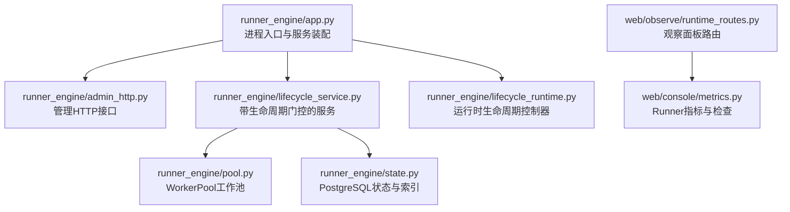
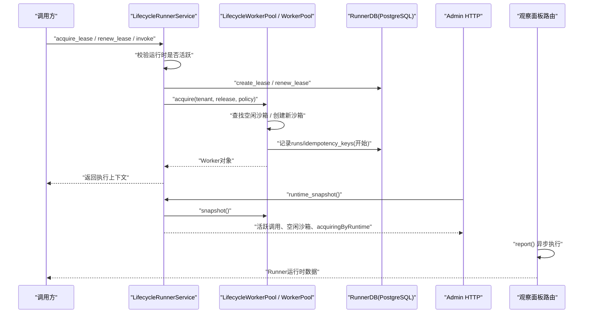
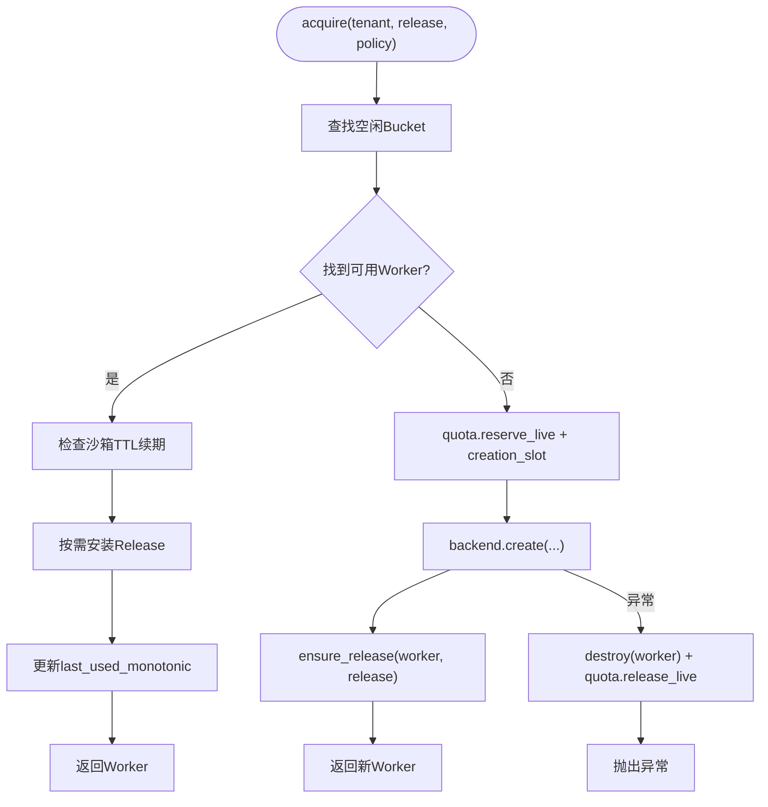
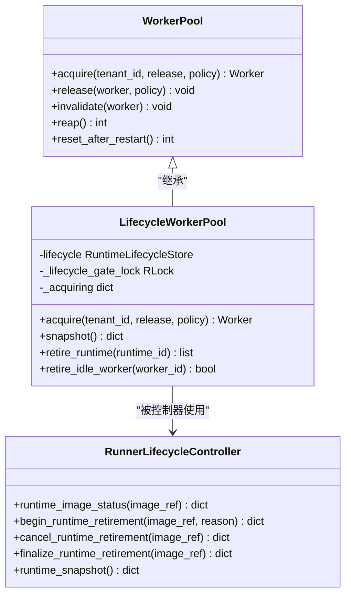
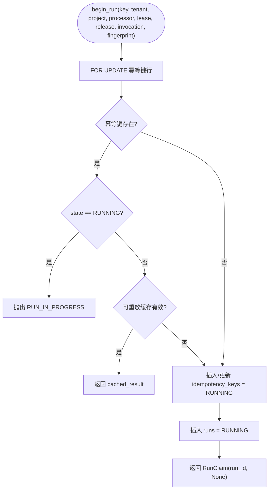
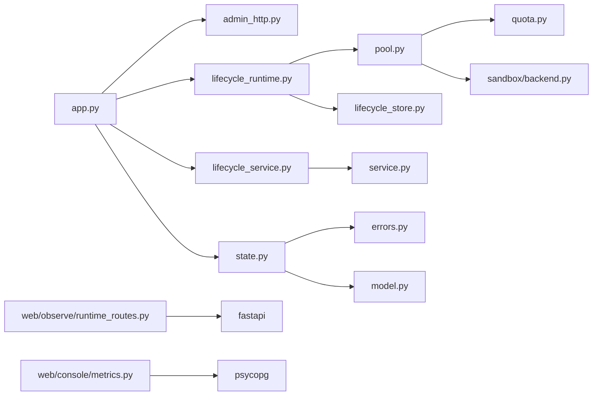

# Runner运行时监控

<cite>
**本文引用的文件**   
- [runner_engine/app.py](file://runner_engine/app.py)
- [runner_engine/admin_http.py](file://runner_engine/admin_http.py)
- [runner_engine/pool.py](file://runner_engine/pool.py)
- [runner_engine/lifecycle_runtime.py](file://runner_engine/lifecycle_runtime.py)
- [runner_engine/lifecycle_service.py](file://runner_engine/lifecycle_service.py)
- [runner_engine/state.py](file://runner_engine/state.py)
- [web/observe/runtime_routes.py](file://web/observe/runtime_routes.py)
- [web/console/metrics.py](file://web/console/metrics.py)
</cite>

## 目录
1. [引言](#引言)
2. [项目结构](#项目结构)
3. [核心组件](#核心组件)
4. [架构总览](#架构总览)
5. [详细组件分析](#详细组件分析)
6. [依赖关系分析](#依赖关系分析)
7. [性能与容量规划](#性能与容量规划)
8. [故障排查指南](#故障排查指南)
9. [结论](#结论)
10. [附录：监控指标与接口清单](#附录监控指标与接口清单)

## 引言
本文面向Runner运行时的可观测性、健康检查、错误追踪与性能调优，围绕以下目标展开：
- 进程状态监控：Runner主进程、gRPC服务、管理HTTP服务的启动、监听与健康检查。
- 任务执行队列与并发模型：基于租约（Lease）+幂等键的异步执行流程，以及WorkerPool的工作线程池语义。
- 内存与资源使用：沙箱生命周期、空闲回收、孤儿清理、租户配额限制。
- 健康检查与错误追踪：健康端点、运行时快照、失败分类、重试与放弃策略。
- 负载均衡与扩展性：按租户+运行时+安全配置分桶的沙箱复用、多集群后端沙箱列表能力。
- 实时采集与异步处理：Admin HTTP与观察面板的异步读取、后台清理任务。
- 调优与排障：参数调优建议、常见问题定位路径。

## 项目结构
Runner运行时由多个模块组成，关键职责如下：
- runner_engine/app.py：进程入口，解析参数、初始化数据库连接、工作池、服务、gRPC与管理HTTP。
- runner_engine/admin_http.py：本地管理HTTP服务，提供健康检查、运行时快照、沙箱与运行时图像退役控制。
- runner_engine/pool.py：WorkerPool实现，负责沙箱缓存、空闲回收、创建与销毁、配额协调。
- runner_engine/lifecycle_runtime.py：在WorkerPool之上增加运行时生命周期门控、运行时图像状态查询、批量退役逻辑。
- runner_engine/lifecycle_service.py：在RunnerService之上增加运行时活跃性校验，阻止对已退役或退役中镜像的新建租约与调用。
- runner_engine/state.py：持久化状态层，封装PostgreSQL连接池、租约表、执行历史表与幂等键表，并提供清理与迁移逻辑。
- web/observe/runtime_routes.py：观察面板路由，暴露Runner运行时数据读取接口。
- web/console/metrics.py：基于PostgreSQL DDL的精确指标与告警规则定义，用于控制台展示Runner相关指标。

图表来源
- [runner_engine/app.py:26-226](file://runner_engine/app.py#L26-L226)
- [runner_engine/admin_http.py:14-190](file://runner_engine/admin_http.py#L14-L190)
- [runner_engine/lifecycle_service.py:7-71](file://runner_engine/lifecycle_service.py#L7-L71)
- [runner_engine/pool.py:11-188](file://runner_engine/pool.py#L11-L188)
- [runner_engine/state.py:131-685](file://runner_engine/state.py#L131-L685)
- [runner_engine/lifecycle_runtime.py:14-397](file://runner_engine/lifecycle_runtime.py#L14-L397)
- [web/observe/runtime_routes.py:10-20](file://web/observe/runtime_routes.py#L10-L20)
- [web/console/metrics.py:29-146](file://web/console/metrics.py#L29-L146)

章节来源
- [runner_engine/app.py:26-226](file://runner_engine/app.py#L26-L226)
- [runner_engine/admin_http.py:14-190](file://runner_engine/admin_http.py#L14-L190)
- [runner_engine/lifecycle_runtime.py:14-397](file://runner_engine/lifecycle_runtime.py#L14-L397)
- [runner_engine/lifecycle_service.py:7-71](file://runner_engine/lifecycle_service.py#L7-L71)
- [runner_engine/pool.py:11-188](file://runner_engine/pool.py#L11-L188)
- [runner_engine/state.py:131-685](file://runner_engine/state.py#L131-L685)
- [web/observe/runtime_routes.py:10-20](file://web/observe/runtime_routes.py#L10-L20)
- [web/console/metrics.py:29-146](file://web/console/metrics.py#L29-L146)

## 核心组件
- 进程入口与服务装配：负责解析命令行与环境变量，初始化数据库连接池、工作池、服务、gRPC与管理HTTP，并启动后台清理任务。
- WorkerPool：以租户+运行时+安全配置为键维护空闲沙箱，支持空闲回收、TTL续期、安装Release、创建与销毁沙箱，并与Quota协作限制并发与存活数。
- LifecycleRunnerService：在服务层拦截新建租约、续租与调用，若运行时处于RETIRED或RETIRING则拒绝新执行；同时保留底层WorkerPool作为最终沙箱获取门控。
- RunnerDB：封装PostgreSQL连接池与schema初始化，提供租约CRUD、执行开始/完成/放弃、幂等键缓存、过期清理与旧版本迁移。
- Admin HTTP：提供健康检查、运行时快照、运行时图像状态、退役流程与空闲沙箱退役操作。
- 观察面板路由：通过FastAPI暴露Runner运行时数据读取接口，异步执行读取逻辑。
- Console Metrics：基于固定DDL常量生成Runner指标与检查项，包括租约、执行、幂等键数量与风险告警。

章节来源
- [runner_engine/app.py:26-226](file://runner_engine/app.py#L26-L226)
- [runner_engine/pool.py:11-188](file://runner_engine/pool.py#L11-L188)
- [runner_engine/lifecycle_service.py:7-71](file://runner_engine/lifecycle_service.py#L7-L71)
- [runner_engine/state.py:131-685](file://runner_engine/state.py#L131-L685)
- [runner_engine/admin_http.py:14-190](file://runner_engine/admin_http.py#L14-L190)
- [web/observe/runtime_routes.py:10-20](file://web/observe/runtime_routes.py#L10-L20)
- [web/console/metrics.py:29-146](file://web/console/metrics.py#L29-L146)

## 架构总览
Runner运行时采用“服务层 + 工作池 + 持久化状态”的分层架构：
- 服务层：LifecycleRunnerService在Catalog与Quota基础上增加运行时生命周期门控，确保退役中的镜像不再接受新请求。
- 工作池层：LifecycleWorkerPool继承WorkerPool，增加运行时级acquiring计数与退役时清空空闲沙箱的能力；底层WorkerPool负责沙箱复用、TTL续期、空闲回收与配额协调。
- 持久化层：RunnerDB通过PostgreSQL维护租约、执行历史与幂等键，提供强一致的状态转换与清理能力。
- 可观测性：Admin HTTP暴露运行时快照与运维操作；观察面板通过路由异步读取运行时数据；Console Metrics从PostgreSQL拉取Runner指标与检查项。

图表来源
- [runner_engine/lifecycle_service.py:19-71](file://runner_engine/lifecycle_service.py#L19-L71)
- [runner_engine/pool.py:73-188](file://runner_engine/pool.py#L73-L188)
- [runner_engine/state.py:283-685](file://runner_engine/state.py#L283-L685)
- [runner_engine/admin_http.py:73-105](file://runner_engine/admin_http.py#L73-L105)
- [web/observe/runtime_routes.py:10-20](file://web/observe/runtime_routes.py#L10-L20)

## 详细组件分析

### WorkerPool与工作线程池监控
WorkerPool是Runner运行时沙箱复用的核心：
- 空闲池：按(tenant_id, runtime.id, profile)分桶维护空闲Worker，避免跨租户与不同安全配置的沙箱混用。
- 空闲回收：根据last_used_monotonic与idle_seconds判断是否过期，触发销毁并释放配额。
- TTL续期：根据policy.max_timeout_ms与renew_before_seconds计算阈值，必要时调用backend.renew延长沙箱寿命。
- Release安装：按需安装release到Worker，受max_installed_releases限制，避免单沙箱装载过多Release导致内存膨胀。
- 创建与销毁：通过Quota.reserve_live与creation_slot限制并发创建，异常时回滚配额并销毁沙箱。
- 回收与重启恢复：reap定期清理空闲；reset_after_restart销毁遗留并调用backend.cleanup_managed。

图表来源
- [runner_engine/pool.py:73-130](file://runner_engine/pool.py#L73-L130)
- [runner_engine/pool.py:132-188](file://runner_engine/pool.py#L132-L188)

章节来源
- [runner_engine/pool.py:11-188](file://runner_engine/pool.py#L11-L188)

### 运行时生命周期与负载均衡
LifecycleWorkerPool在WorkerPool基础上增加运行时维度的门控与统计：
- 运行时退役门控：acquire前检查lifecycle.is_blocked_runtime，若处于RETIRING/RETIRED则拒绝新沙箱获取。
- acquiring计数：按runtime_id统计正在acquiring的数量，便于观察面板与运维操作。
- 批量退役：retire_runtime清空对应runtime的空闲Worker并销毁。
- 单个空闲Worker退役：retire_idle_worker按worker_id移除并销毁。
- 运行时图像状态：结合catalog、leases、active invocations、pool snapshot与后端managed沙箱列表，给出safeForArtifactDeletion判断。

图表来源
- [runner_engine/pool.py:11-188](file://runner_engine/pool.py#L11-L188)
- [runner_engine/lifecycle_runtime.py:14-121](file://runner_engine/lifecycle_runtime.py#L14-L121)
- [runner_engine/lifecycle_runtime.py:187-397](file://runner_engine/lifecycle_runtime.py#L187-L397)

章节来源
- [runner_engine/lifecycle_runtime.py:14-121](file://runner_engine/lifecycle_runtime.py#L14-L121)
- [runner_engine/lifecycle_runtime.py:187-397](file://runner_engine/lifecycle_runtime.py#L187-L397)

### 任务执行队列与幂等性
Runner的任务执行并非传统意义上的队列，而是基于“租约 + 幂等键 + 执行历史”的分布式调度模型：
- 租约（Lease）：由RunnerDB.create_lease/renew_lease/delete_lease管理，带有expires_at时间戳，支持purge_expired_leases清理。
- 幂等键（Idempotency Keys）：runner.idempotency_keys表维护tenant_id/release_id/idempotency_key的唯一性与状态，支持RUNNING/DONE状态与replayable标志。
- 执行历史（Runs）：runner.runs记录每次执行的run_id、state、outcome_class、status、relationship、retryable、error_code、error_message、worker_id、duration_ms等。
- 开始执行：begin_run先锁幂等键行，若存在且RUNNING则抛RUN_IN_PROGRESS；若命中可重放缓存则直接返回cached_result；否则插入runs与idempotency_keys。
- 完成执行：finish_run将runs标记DONE，写入outcome_class/status/relationship/retryable/error信息，并更新idempotency_keys为DONE并可重放。
- 放弃执行：abandon_run将runs标记ABANDONED并清理对应idempotency_keys。
- 清理：purge_expired_idempotency与purge_old_runs分别清理过期幂等键与已完成的历史记录。

图表来源
- [runner_engine/state.py:411-521](file://runner_engine/state.py#L411-L521)

章节来源
- [runner_engine/state.py:16-82](file://runner_engine/state.py#L16-L82)
- [runner_engine/state.py:283-409](file://runner_engine/state.py#L283-L409)
- [runner_engine/state.py:411-685](file://runner_engine/state.py#L411-L685)

### 健康检查与错误追踪
- 健康检查：
  - Admin HTTP提供/health端点，返回ok与service标识。
  - gRPC服务通过app.py启动后等待终止，配合外部探针进行存活检测。
- 错误追踪：
  - state.py中定义LeaseError与RunnerError，包含错误码与retryable标志，便于上层区分可重试与用户错误。
  - finish_run与abandon_run将error_code与error_message持久化到runs表，便于后续分析与告警。
  - lifecycle_service.py在运行时退役场景抛出RUNTIME_RETIRED/RUNTIME_RETIRING，并标注retryable。
- 运行时快照：
  - admin_http.py暴露/v1/observe/runtime，返回activeInvocations、idleWorkers、acquiringByRuntime与runtimeLifecycle。
  - lifecycle_runtime.py的runtime_snapshot聚合服务层_active与pool.snapshot，并附加近期运行时生命周期事件。

章节来源
- [runner_engine/admin_http.py:73-105](file://runner_engine/admin_http.py#L73-L105)
- [runner_engine/state.py:12-14](file://runner_engine/state.py#L12-L14)
- [runner_engine/state.py:523-648](file://runner_engine/state.py#L523-L648)
- [runner_engine/lifecycle_service.py:19-32](file://runner_engine/lifecycle_service.py#L19-L32)
- [runner_engine/lifecycle_runtime.py:373-397](file://runner_engine/lifecycle_runtime.py#L373-L397)

### 运行时数据的实时采集与异步处理
- Admin HTTP：
  - 使用ThreadingHTTPServer与BaseHTTPRequestHandler，独立线程运行，避免阻塞gRPC服务。
  - /v1/observe/runtime调用service.runtime_snapshot()同步返回快照。
- 观察面板：
  - FastAPI路由install_runner_runtime_routes注册/observe/api/runner-runtime，使用asyncio.to_thread异步执行RunnerRuntimeReader.report，避免阻塞异步事件循环。
- Console Metrics：
  - ExactPGReader通过psycopg连接PostgreSQL，设置只读会话与语句超时，拉取runner.leases、runner.runs、runner.idempotency_keys的指标与检查项。

章节来源
- [runner_engine/admin_http.py:14-190](file://runner_engine/admin_http.py#L14-L190)
- [web/observe/runtime_routes.py:10-20](file://web/observe/runtime_routes.py#L10-L20)
- [web/console/metrics.py:149-281](file://web/console/metrics.py#L149-L281)

## 依赖关系分析
- app.py依赖admin_http、catalog、gateway、lifecycle_runtime、lifecycle_service、lifecycle_store、policy、quota、state。
- lifecycle_runtime依赖errors、lifecycle_store、pool、sandbox.opensandbox。
- lifecycle_service依赖errors、service。
- pool依赖model、quota、sandbox.backend。
- state依赖errors、model、psycopg与psycopg_pool。
- admin_http依赖http.server与json/hmac/threading。
- observe/runtime_routes依赖fastapi与runner_runtime。
- console/metrics依赖sql_schemas与psycopg。

图表来源
- [runner_engine/app.py:9-21](file://runner_engine/app.py#L9-L21)
- [runner_engine/lifecycle_runtime.py:8-11](file://runner_engine/lifecycle_runtime.py#L8-L11)
- [runner_engine/lifecycle_service.py:3-4](file://runner_engine/lifecycle_service.py#L3-L4)
- [runner_engine/pool.py:6-8](file://runner_engine/pool.py#L6-L8)
- [runner_engine/state.py:8-13](file://runner_engine/state.py#L8-L13)
- [web/observe/runtime_routes.py:3-7](file://web/observe/runtime_routes.py#L3-L7)
- [web/console/metrics.py:6-12](file://web/console/metrics.py#L6-L12)

章节来源
- [runner_engine/app.py:9-21](file://runner_engine/app.py#L9-L21)
- [runner_engine/lifecycle_runtime.py:8-11](file://runner_engine/lifecycle_runtime.py#L8-L11)
- [runner_engine/lifecycle_service.py:3-4](file://runner_engine/lifecycle_service.py#L3-L4)
- [runner_engine/pool.py:6-8](file://runner_engine/pool.py#L6-L8)
- [runner_engine/state.py:8-13](file://runner_engine/state.py#L8-L13)
- [web/observe/runtime_routes.py:3-7](file://web/observe/runtime_routes.py#L3-L7)
- [web/console/metrics.py:6-12](file://web/console/metrics.py#L6-L12)

## 性能与容量规划
- 工作池容量：
  - idle_seconds：空闲沙箱保留时长，过短会导致频繁重建，过长会占用资源。
  - orphan_ttl_seconds：孤儿沙箱TTL，需大于idle_seconds以避免误删。
  - renew_before_seconds：续期阈值，应小于orphan_ttl_seconds并结合policy.max_timeout_ms。
  - max_installed_releases：单沙箱最大Release数，影响内存占用与冷启动时间。
- 并发与配额：
  - Quota.max_creating与max_live限制全局创建与存活沙箱数。
  - Quota.max_live_per_tenant限制租户级别并发，防止热点租户独占资源。
- 数据库连接池：
  - RunnerDB.min_pool_size与max_pool_size影响并发读写与延迟。
  - 索引优化：runner.runs与runner.idempotency_keys的关键索引已内置，关注started_at/completed_at/error_code等列的查询性能。
- 清理与回收：
  - reaper_interval_seconds控制后台清理频率，需平衡CPU开销与资源释放及时性。
  - idempotency_retention_ms与run_retention_ms决定历史与幂等键保留时长，过大将增长存储。

章节来源
- [runner_engine/app.py:97-154](file://runner_engine/app.py#L97-L154)
- [runner_engine/pool.py:19-43](file://runner_engine/pool.py#L19-L43)
- [runner_engine/pool.py:56-71](file://runner_engine/pool.py#L56-L71)
- [runner_engine/state.py:138-177](file://runner_engine/state.py#L138-L177)
- [runner_engine/state.py:650-685](file://runner_engine/state.py#L650-L685)

## 故障排查指南
- 运行时退役问题：
  - 现象：acquire_lease/renew_lease/invoke抛出RUNTIME_RETIRED或RUNTIME_RETIRING。
  - 排查：查看lifecycle.get_by_runtime_id状态，确认是否进入RETIRED/RETIRING；检查admin_http的runtime_image_status与safeForArtifactDeletion。
  - 解决：等待activeInvocationCount与idleWorkerCount归零，再finalize_runtime_retirement。
- 沙箱无法创建或频繁销毁：
  - 现象：WorkerPool.acquire抛出异常或频繁调用backend.destroy。
  - 排查：检查Quota限制、orphan_ttl_seconds与idle_seconds配置；查看pool.snapshot中acquiringByRuntime与idleWorkers。
  - 解决：调整配额与TTL参数，或手动retire_idle_worker清理卡住沙箱。
- 执行长时间挂起：
  - 现象：runner.runs中存在RUNNING超过阈值的记录。
  - 排查：使用console metrics的runs_stale检查；查看error_code与error_message；确认policy.max_timeout_ms是否合理。
  - 解决：abandon_run或重启Runner后由reset_running转为ABANDONED。
- 幂等键冲突或重复执行：
  - 现象：begin_run抛出IDEMPOTENCY_CONFLICT或RUN_IN_PROGRESS。
  - 排查：检查idempotency_key与request_fingerprint一致性；查看idempotency_keys.state与replay_count。
  - 解决：修正上游幂等键生成逻辑；必要时清理过期幂等键。
- 数据库不可用或权限不足：
  - 现象：ExactPGReader报告PostgreSQL unavailable或metric error。
  - 排查：检查DSN、网络、SELECT权限与schema是否正确；确认statement_timeout与read-only选项。
  - 解决：修复连接与权限，或调整console metrics配置。

章节来源
- [runner_engine/lifecycle_service.py:19-32](file://runner_engine/lifecycle_service.py#L19-L32)
- [runner_engine/lifecycle_runtime.py:239-359](file://runner_engine/lifecycle_runtime.py#L239-L359)
- [runner_engine/pool.py:110-130](file://runner_engine/pool.py#L110-L130)
- [runner_engine/state.py:436-448](file://runner_engine/state.py#L436-L448)
- [web/console/metrics.py:130-146](file://web/console/metrics.py#L130-L146)
- [web/console/metrics.py:251-257](file://web/console/metrics.py#L251-L257)

## 结论
Runner运行时的监控体系围绕“服务层门控 + 工作池复用 + 持久化状态”构建，提供了完整的健康检查、运行时快照、错误追踪与指标采集能力。通过合理的WorkerPool参数与Quota配置，可实现高效的沙箱复用与负载均衡；借助Admin HTTP与观察面板，运维人员可实时监控活跃调用、空闲沙箱与acquiring计数，并进行退役与清理操作。Console Metrics基于固定DDL提供稳定的指标与检查项，帮助快速定位性能瓶颈与运行风险。

## 附录：监控指标与接口清单
- 健康检查接口：
  - GET /health（Admin HTTP）
- 运行时监控接口：
  - GET /v1/observe/runtime（Admin HTTP）
  - GET /observe/api/runner-runtime（观察面板）
- 运行时图像管理接口：
  - GET /v1/admin/runtime-images/status?imageRef=...
  - POST /v1/admin/runtime-images/retire
  - POST /v1/admin/runtime-images/cancel-retirement
  - POST /v1/admin/runtime-images/finalize-retirement
  - POST /v1/admin/sandboxes/retire-idle
- Runner指标与检查项（Console Metrics）：
  - leases、runs、idempotency_keys、releases（引用release ID去重计数）
  - active_leases、expired_leases、runs_stale、abandoned_runs、expired_idempotency、replayed_keys

章节来源
- [runner_engine/admin_http.py:73-169](file://runner_engine/admin_http.py#L73-L169)
- [web/observe/runtime_routes.py:10-20](file://web/observe/runtime_routes.py#L10-L20)
- [web/console/metrics.py:29-146](file://web/console/metrics.py#L29-L146)