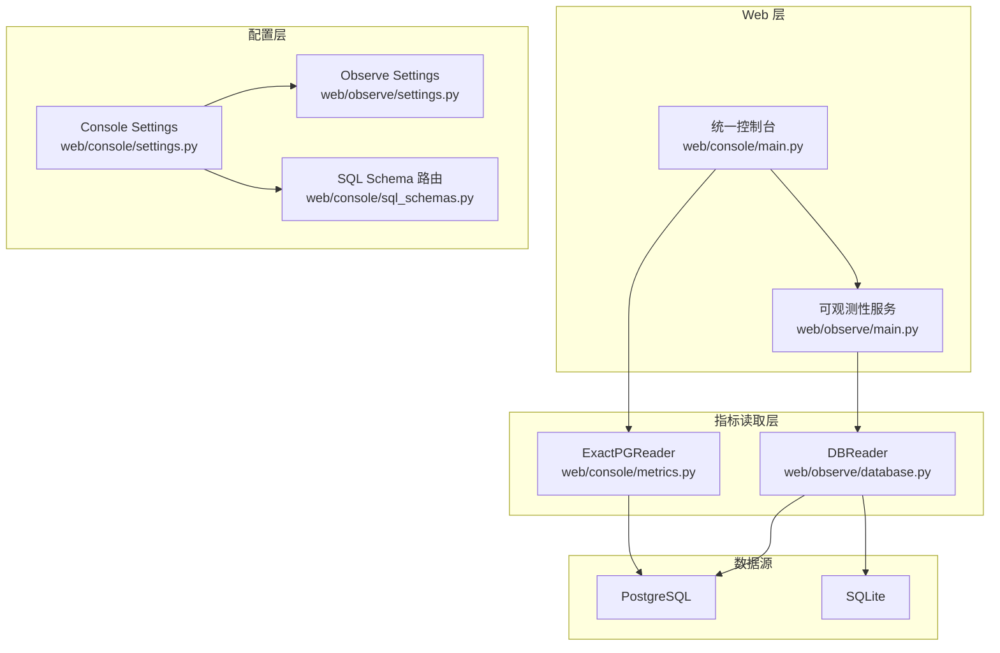
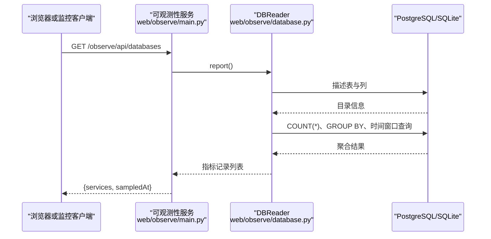
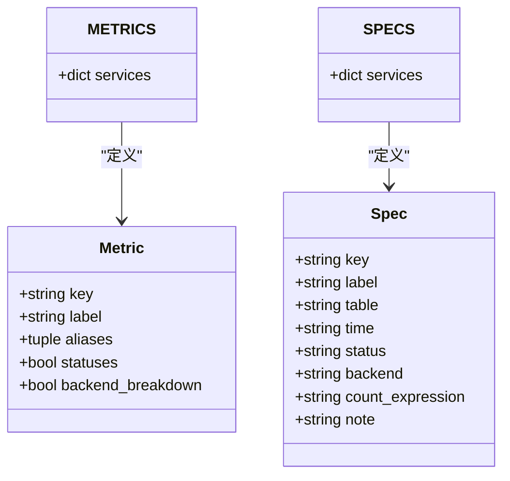
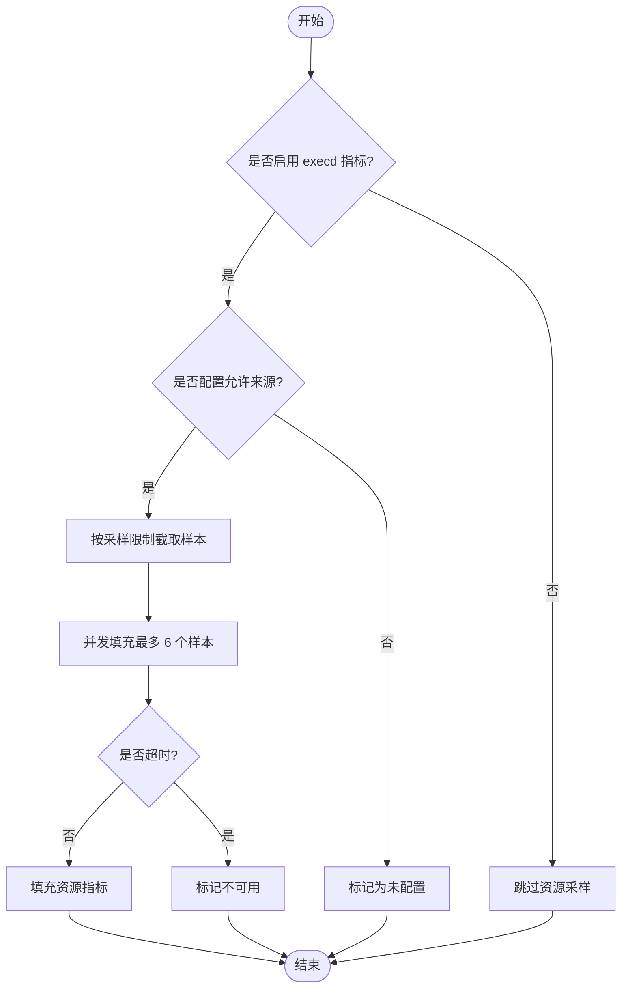
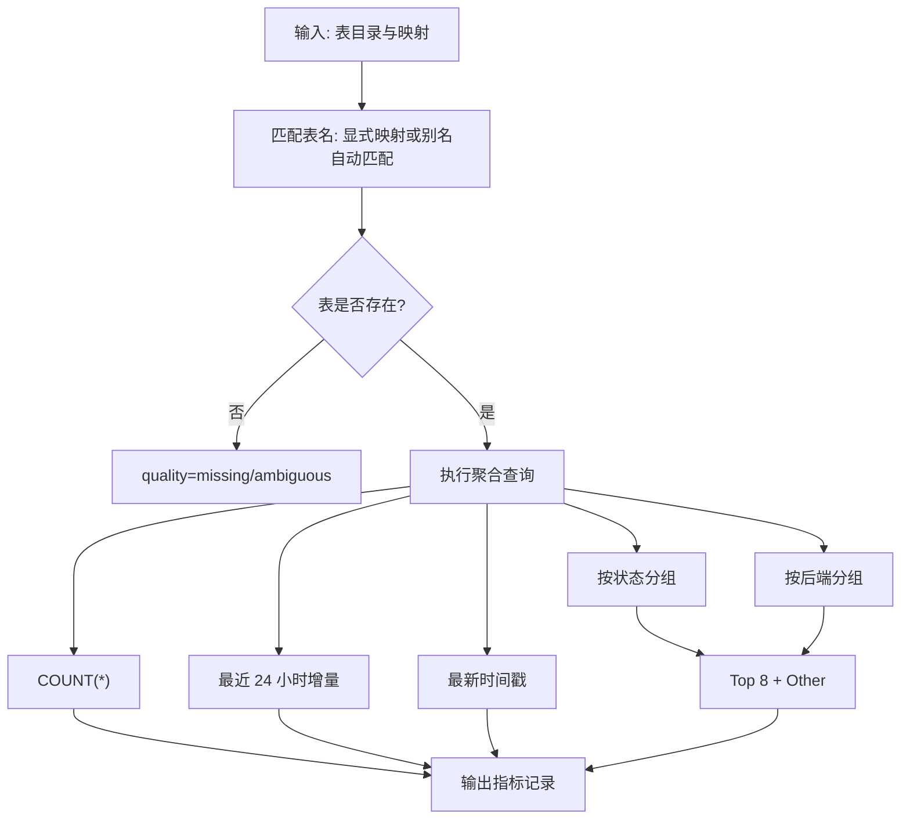
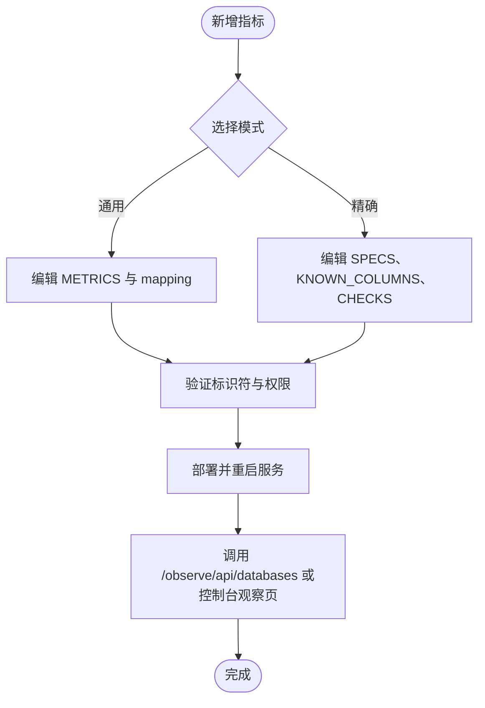
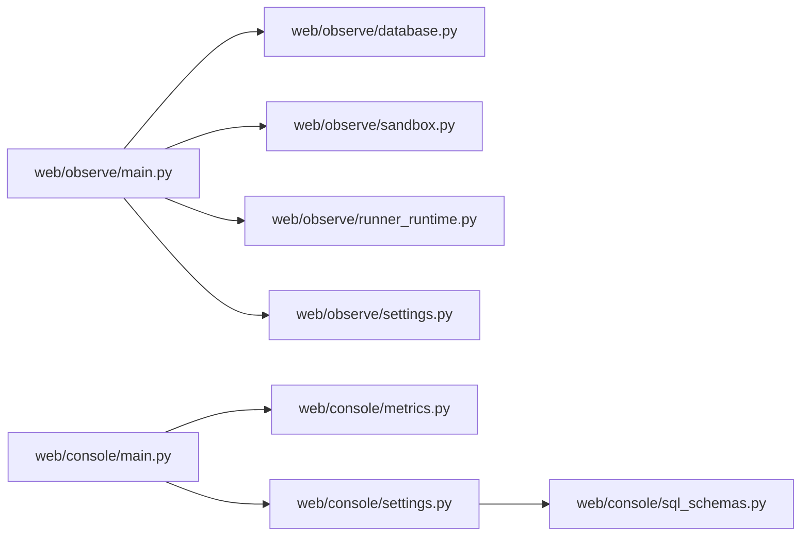

# 指标收集系统

<cite>
**本文引用的文件**   
- [web/observe/main.py](file://web/observe/main.py)
- [web/observe/database.py](file://web/observe/database.py)
- [web/observe/settings.py](file://web/observe/settings.py)
- [web/console/main.py](file://web/console/main.py)
- [web/console/metrics.py](file://web/console/metrics.py)
- [web/console/settings.py](file://web/console/settings.py)
- [web/console/sql_schemas.py](file://web/console/sql_schemas.py)
</cite>

## 目录
1. [简介](#简介)
2. [项目结构](#项目结构)
3. [核心组件](#核心组件)
4. [架构总览](#架构总览)
5. [详细组件分析](#详细组件分析)
6. [依赖关系分析](#依赖关系分析)
7. [性能与高可用](#性能与高可用)
8. [故障排查指南](#故障排查指南)
9. [结论](#结论)

## 简介
本仓库包含两套观测能力：
- 独立的可观测性服务，用于从业务数据库读取聚合指标、沙箱运行状态和运行时信息。
- 统一控制台入口，将发布应用、可观测性页面和管理后台整合到同一进程，并通过“精确 DDL”模式直接查询三个服务的固定表结构。

该文档聚焦于指标采集架构、数据流转、指标类型定义、采样策略、存储格式、聚合逻辑、时间序列处理、缓存优化、扩展方法以及压缩归档清理策略和高可用部署建议。

## 项目结构
与指标收集相关的主要代码位于 web 目录下：
- web/observe：独立的 FastAPI 可观测性服务，提供数据库指标、沙箱信息和运行时信息的只读 API。
- web/console：统一控制台，复用 observe 的指标能力，但使用“精确 DDL”模式，不依赖动态表发现。

**图表来源**
- [web/console/main.py:34-58](file://web/console/main.py#L34-L58)
- [web/observe/main.py:57-82](file://web/observe/main.py#L57-L82)
- [web/observe/database.py:98-155](file://web/observe/database.py#L98-L155)
- [web/console/metrics.py:149-169](file://web/console/metrics.py#L149-L169)
- [web/observe/settings.py:79-127](file://web/observe/settings.py#L79-L127)
- [web/console/settings.py:23-58](file://web/console/settings.py#L23-L58)
- [web/console/sql_schemas.py:10-39](file://web/console/sql_schemas.py#L10-L39)

**章节来源**
- [web/console/main.py:1-147](file://web/console/main.py#L1-L147)
- [web/observe/main.py:1-198](file://web/observe/main.py#L1-L198)

## 核心组件
- 可观测性服务入口：创建 FastAPI 应用、安全头、认证中间件、健康检查、数据库指标、沙箱、运行时等接口。
- 数据库指标读取器：支持 SQLite 与 PostgreSQL，自动或显式映射表名，计算总量、最近 24 小时增量、最新时间戳、按状态和后端分组统计。
- 精确 DDL 读取器：仅基于三个服务的固定 DDL 表名与列名生成聚合 SQL，适合强约束环境。
- 配置中心：环境变量驱动数据库连接、Schema、表映射、沙箱参数、采样限制、跨域白名单和基本认证。

**章节来源**
- [web/observe/main.py:57-153](file://web/observe/main.py#L57-L153)
- [web/observe/database.py:98-390](file://web/observe/database.py#L98-L390)
- [web/console/metrics.py:17-55](file://web/console/metrics.py#L17-L55)
- [web/console/metrics.py:149-280](file://web/console/metrics.py#L149-L280)
- [web/observe/settings.py:79-127](file://web/observe/settings.py#L79-L127)
- [web/console/settings.py:23-84](file://web/console/settings.py#L23-L84)

## 架构总览
指标采集采用“只读聚合 + 多数据源适配 + 统一 API 暴露”的模式：
- 请求进入 observe 或 console 后，由 FastAPI 路由分发到对应处理器。
- 数据库指标通过 DBReader 或 ExactPGReader 执行只读聚合查询。
- 结果以统一的 JSON 结构返回给前端展示。
- 沙箱与运行时信息作为补充维度，与数据库指标一起组成整体观测视图。

**图表来源**
- [web/observe/main.py:116-129](file://web/observe/main.py#L116-L129)
- [web/observe/database.py:336-367](file://web/observe/database.py#L336-L367)

**章节来源**
- [web/observe/main.py:108-153](file://web/observe/main.py#L108-L153)
- [web/observe/database.py:156-195](file://web/observe/database.py#L156-L195)
- [web/observe/database.py:336-367](file://web/observe/database.py#L336-L367)

## 详细组件分析

### 指标类型定义
系统为三类服务定义指标：publish、build、runner。

- 可观测性服务（通用）：
  - publish：operators、contracts、variants、jobs
  - build：environments、jobs
  - runner：releases、executions、jobs
- 控制台（精确 DDL）：
  - publish：operators、contracts、variants、jobs
  - build：environments、aliases、jobs
  - runner：leases、runs、idempotency_keys、releases

两类定义的差异在于：
- 通用模式允许别名匹配与列自动推断，适合不同命名习惯的库。
- 精确模式强制使用固定表名与列名，避免动态 SQL 风险。

**图表来源**
- [web/observe/database.py:22-66](file://web/observe/database.py#L22-L66)
- [web/console/metrics.py:17-55](file://web/console/metrics.py#L17-L55)

**章节来源**
- [web/observe/database.py:22-66](file://web/observe/database.py#L22-L66)
- [web/console/metrics.py:17-55](file://web/console/metrics.py#L17-L55)

### 采样策略
- 数据库指标：每次请求触发一次聚合查询；无服务端定时采样。
- 沙箱资源指标：当启用 execd_metrics 且配置了 allowed_origins 时，对沙箱记录进行限流采样，并发上限为 6，超时预算为 18 秒。
- 控制台未启用 execd 指标采样，主要依赖数据库聚合。

**图表来源**
- [web/observe/sandbox.py:234-286](file://web/observe/sandbox.py#L234-L286)

**章节来源**
- [web/observe/settings.py:88-104](file://web/observe/settings.py#L88-L104)
- [web/observe/sandbox.py:234-286](file://web/observe/sandbox.py#L234-L286)

### 存储格式
指标聚合结果统一为 JSON 对象，字段包括：
- key：指标键
- label：显示标签
- quality：质量状态（auto/explicit/ambiguous/missing/error/unconfigured/exact）
- table：物理表名
- count：总量
- recent24h：最近 24 小时新增量
- latestAt：最新时间戳
- byStatus：按状态分组统计
- byBackend：按后端分组统计
- note：说明或错误提示

控制台精确模式还额外输出 checks 与 tables 元信息，便于审计与排障。

**章节来源**
- [web/observe/database.py:226-302](file://web/observe/database.py#L226-L302)
- [web/observe/database.py:336-367](file://web/observe/database.py#L336-L367)
- [web/console/metrics.py:175-211](file://web/console/metrics.py#L175-L211)
- [web/console/metrics.py:213-257](file://web/console/metrics.py#L213-L257)

### 聚合与时间序列数据处理
- 总量：SELECT COUNT(*)。
- 最近 24 小时增量：根据时间列过滤 >= now() - interval '24 hours' 或 ISO-8601 UTC 字符串比较。
- 最新时间戳：SELECT MAX(timeColumn)。
- 分组统计：按状态列或后端列 GROUP BY，取 Top 8，其余归入 Other。
- 时间列识别：默认候选名为 created_at/createdAt/created_on/createdOn，可通过 mapping 指定。
- 状态列识别：默认候选名为 status/state/phase，可通过 mapping 指定。
- 后端列识别：默认候选名为 backend/backend_type/backendType，可通过 mapping 指定。

**图表来源**
- [web/observe/database.py:211-334](file://web/observe/database.py#L211-L334)

**章节来源**
- [web/observe/database.py:211-334](file://web/observe/database.py#L211-L334)

### 缓存优化
当前实现没有内置指标缓存层。聚合查询在每次请求时执行，因此：
- 建议在反向代理或网关层对只读指标接口做短期缓存（例如 5-15 秒）。
- 对于大表，可在数据库侧建立合适的索引（如时间列、状态列、后端列），减少 GROUP BY 与时间窗口扫描成本。
- 若需要更高吞吐，可在外部引入 Redis 或内存缓存，按 service+metric+schema 作为键，设置过期时间。

[本节为通用指导，不涉及具体文件]

### 自定义指标的注册与扩展
- 通用模式扩展：
  - 在 METRICS 中添加新的 Metric 条目，定义 key、label、aliases、statuses、backend_breakdown。
  - 通过 OBS_TABLE_MAP_FILE 配置表映射，将 metric key 映射到实际表名或包含 table/statusColumn/groupColumn/timeColumn 的映射对象。
- 精确模式扩展：
  - 在 SPECS 中添加新的 Spec 条目，定义 key、label、table、time、status、backend、count_expression、note。
  - 在 KNOWN_COLUMNS 中维护列名清单，便于 UI 展示。
  - 如需校验规则，可在 CHECKS 中添加条件表达式。

**图表来源**
- [web/observe/database.py:31-66](file://web/observe/database.py#L31-L66)
- [web/observe/settings.py:52-76](file://web/observe/settings.py#L52-L76)
- [web/console/metrics.py:17-55](file://web/console/metrics.py#L17-L55)
- [web/console/metrics.py:57-101](file://web/console/metrics.py#L57-L101)
- [web/console/metrics.py:103-146](file://web/console/metrics.py#L103-L146)

**章节来源**
- [web/observe/database.py:31-66](file://web/observe/database.py#L31-L66)
- [web/observe/settings.py:52-76](file://web/observe/settings.py#L52-L76)
- [web/console/metrics.py:17-55](file://web/console/metrics.py#L17-L55)
- [web/console/metrics.py:57-146](file://web/console/metrics.py#L57-L146)

### 压缩、归档与清理策略
当前代码未实现指标数据的压缩、归档与清理。建议：
- 在数据库侧实施分区表与生命周期策略，按时间列进行分区与保留策略。
- 对历史数据定期导出并归档至对象存储，同时删除旧分区。
- 在聚合层增加“归档开关”，当开启时仅返回近期数据，避免长尾查询影响性能。

[本节为通用指导，不涉及具体文件]

## 依赖关系分析
- 可观测性服务依赖 DBReader 与 SandboxReader、RunnerRuntimeReader。
- 控制台依赖 ExactPGReader 与 SQL Schema 路由。
- 两者均通过 Settings 加载环境变量，确保只读访问与安全头。

**图表来源**
- [web/observe/main.py:20-23](file://web/observe/main.py#L20-L23)
- [web/observe/main.py:57-82](file://web/observe/main.py#L57-L82)
- [web/console/main.py:28-45](file://web/console/main.py#L28-L45)
- [web/console/settings.py:8-13](file://web/console/settings.py#L8-L13)

**章节来源**
- [web/observe/main.py:20-82](file://web/observe/main.py#L20-L82)
- [web/console/main.py:28-58](file://web/console/main.py#L28-L58)
- [web/console/settings.py:8-13](file://web/console/settings.py#L8-L13)

## 性能与高可用
- 只读访问：
  - PostgreSQL 会话级别设置为只读事务，语句超时限制为 3-5 秒。
  - SQLite 打开为只读 URI，启用 query_only PRAGMA。
- 并发与限流：
  - 沙箱资源采样并发上限为 6，超时预算为 18 秒。
  - 数据库指标聚合在异步任务中并行执行多个服务。
- 高可用建议：
  - 将 observe 服务部署为多副本，配合负载均衡与健康检查。
  - 数据库侧使用主从或集群，确保只读副本承载观测查询。
  - 在反向代理层启用缓存与熔断，保护后端数据库。
  - 基本认证与 CSP、X-Frame-Options、Referrer-Policy 等安全头增强安全性。

**章节来源**
- [web/observe/database.py:118-155](file://web/observe/database.py#L118-L155)
- [web/observe/main.py:84-106](file://web/observe/main.py#L84-L106)
- [web/observe/sandbox.py:251-286](file://web/observe/sandbox.py#L251-L286)
- [web/observe/main.py:116-153](file://web/observe/main.py#L116-L153)

## 故障排查指南
常见问题与定位方法：
- 数据库不可达或未授权：
  - 检查 DSN、用户名密码、网络连通性与 SELECT 权限。
  - 查看日志中的连接失败与 normalize_error 消息。
- 表未找到或歧义：
  - 确认 OBS_TABLE_MAP_FILE 是否正确配置。
  - 检查表名是否在 catalog 中，别名是否唯一。
- 时间列非 ISO-8601：
  - SQLite 模式下若时间列不是 ISO-8601 文本，recent24h 将被省略。
- 查询失败：
  - 单个指标失败不会阻塞其他指标，注意 quality=error 与 note 字段。
- 沙箱资源采样超时：
  - 调整 execd_sample_limit 与 allowed_origins，检查 execd 服务可用性。

**章节来源**
- [web/observe/database.py:78-83](file://web/observe/database.py#L78-L83)
- [web/observe/database.py:211-224](file://web/observe/database.py#L211-L224)
- [web/observe/database.py:263-276](file://web/observe/database.py#L263-L276)
- [web/observe/database.py:293-302](file://web/observe/database.py#L293-L302)
- [web/observe/sandbox.py:271-286](file://web/observe/sandbox.py#L271-L286)

## 结论
该指标收集系统以只读聚合为核心，兼顾灵活性与安全性：
- 通用模式通过别名与映射适配多种数据库命名风格。
- 精确模式通过固定 DDL 与列清单保障强约束环境下的稳定性。
- 配置驱动的环境变量与映射文件简化部署与扩展。
- 沙箱与运行时信息作为补充维度，形成完整的观测视图。
- 在生产环境中建议结合反向代理缓存、数据库索引与分区策略，提升性能与可维护性。