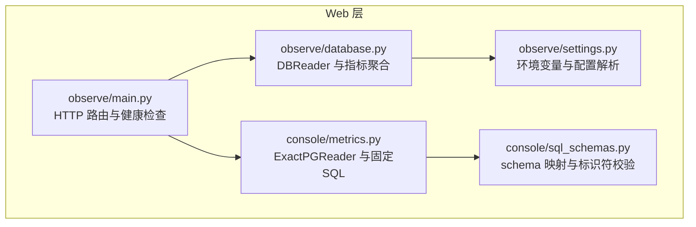
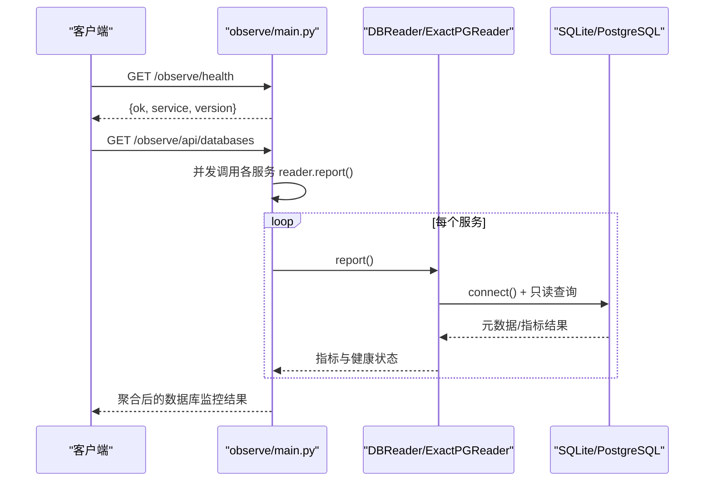
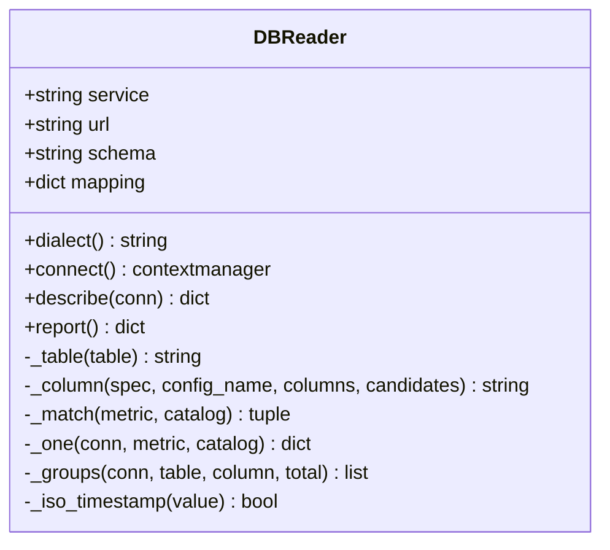
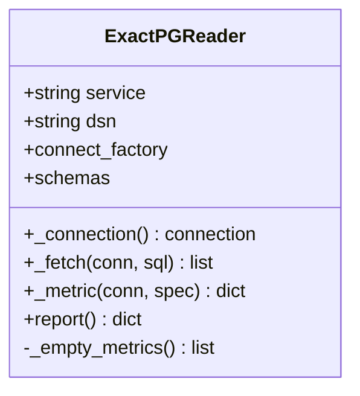
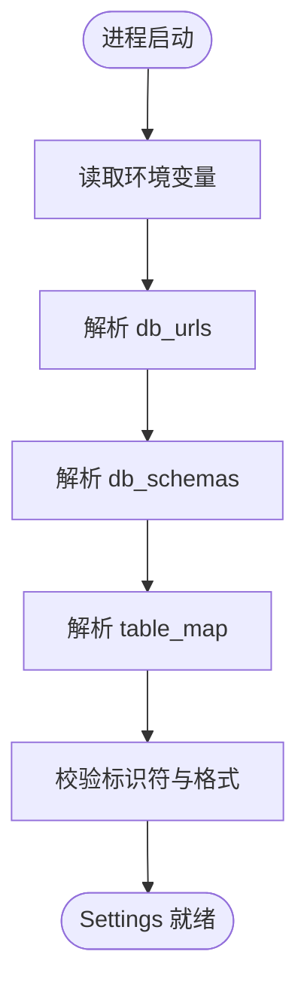
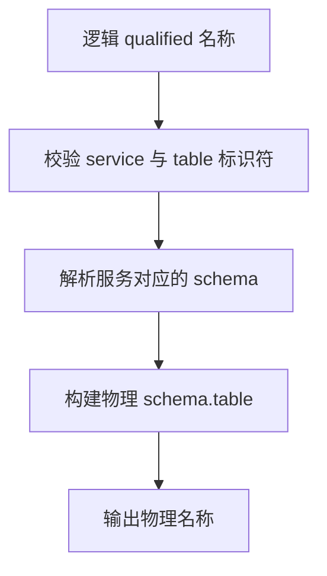
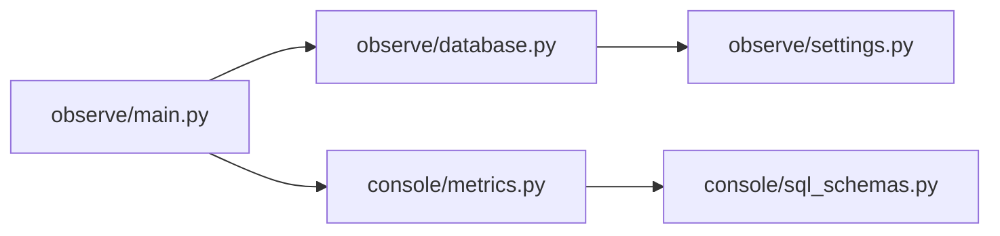

# 数据库监控

<cite>
**本文引用的文件**   
- [web/observe/database.py](file://web/observe/database.py)
- [web/observe/settings.py](file://web/observe/settings.py)
- [web/observe/main.py](file://web/observe/main.py)
- [web/console/metrics.py](file://web/console/metrics.py)
- [web/console/sql_schemas.py](file://web/console/sql_schemas.py)
</cite>

## 目录
1. [简介](#简介)
2. [项目结构](#项目结构)
3. [核心组件](#核心组件)
4. [架构总览](#架构总览)
5. [详细组件分析](#详细组件分析)
6. [依赖关系分析](#依赖关系分析)
7. [性能与优化](#性能与优化)
8. [故障排查指南](#故障排查指南)
9. [结论](#结论)

## 简介
本文件面向“数据库监控”能力，聚焦以下目标：
- 数据库连接管理与只读安全策略
- 查询优化机制、超时控制与错误隔离
- 指标采集范围、聚合维度与存储策略
- 连接池配置现状与建议
- 健康检查接口与状态监控方法
- 多数据库实例的监控聚合与数据汇总逻辑
- 性能分析与慢查询诊断方法

该功能主要实现于两个子系统：
- 可观测性观察端（observe）：支持 SQLite 与 PostgreSQL，通过系统目录自动发现表结构，按服务维度聚合指标。
- 控制台精确读取端（console）：基于固定 DDL 和 schema 映射，直接对 PostgreSQL 执行精确 SQL，提供强约束的指标与健康检查。

## 项目结构
与数据库监控相关的代码集中在 web 子模块中：
- observe：通用、可适配多种后端（SQLite/PostgreSQL）的只读聚合器，负责表结构发现、指标计算、错误隔离与对外报告。
- console：面向 PostgreSQL 的精确模式读取器，使用固定 SQL 与 schema 映射，提供严格的安全边界与运行态检查项。

**图表来源**
- [web/observe/main.py:108-125](file://web/observe/main.py#L108-L125)
- [web/observe/database.py:98-154](file://web/observe/database.py#L98-L154)
- [web/observe/settings.py:79-127](file://web/observe/settings.py#L79-L127)
- [web/console/metrics.py:149-169](file://web/console/metrics.py#L149-L169)
- [web/console/sql_schemas.py:21-39](file://web/console/sql_schemas.py#L21-L39)

**章节来源**
- [web/observe/main.py:108-125](file://web/observe/main.py#L108-L125)
- [web/observe/database.py:1-10](file://web/observe/database.py#L1-L10)
- [web/console/metrics.py:1-5](file://web/console/metrics.py#L1-L5)

## 核心组件
- DBReader（observe）：面向多后端的只读聚合器，支持 SQLite 与 PostgreSQL；自动发现表结构，按服务维度生成指标报告。
- ExactPGReader（console）：面向 PostgreSQL 的精确读取器，使用固定 SQL 与 schema 映射，提供强约束的指标与健康检查。
- Settings（observe）：从环境变量加载数据库 URL、schema、表映射等配置。
- sql_schemas（console）：对 PostgreSQL schema 进行校验与物理名称转换，保证 SQL 安全。

关键职责划分：
- 连接管理：DBReader.connect 与 ExactPGReader._connection 分别封装连接创建、超时与只读设置。
- 指标采集：DBReader.report 与 ExactPGReader.report 分别聚合 count、recent24h、latestAt、byStatus/byBackend 等维度。
- 健康检查：observe HTTP 暴露 /observe/health 与 /observe/api/databases，返回服务级状态与指标摘要。

**章节来源**
- [web/observe/database.py:98-154](file://web/observe/database.py#L98-L154)
- [web/console/metrics.py:149-169](file://web/console/metrics.py#L149-L169)
- [web/observe/settings.py:79-127](file://web/observe/settings.py#L79-L127)
- [web/console/sql_schemas.py:21-39](file://web/console/sql_schemas.py#L21-L39)

## 架构总览
数据库监控的整体流程如下：
- 外部请求进入 observe/main.py 的路由，触发数据库健康检查与指标聚合。
- 对于每个服务（publish/build/runner），并发调用对应 reader 的 report 方法。
- DBReader 根据 dialect 选择 SQLite 或 PostgreSQL 的连接方式，并执行受限的只读查询。
- ExactPGReader 使用固定 SQL 与 schema 映射，确保查询安全与结果稳定。
- 最终将各服务的指标与健康检查结果汇总返回给前端或监控系统。

**图表来源**
- [web/observe/main.py:108-125](file://web/observe/main.py#L108-L125)
- [web/observe/database.py:336-367](file://web/observe/database.py#L336-L367)
- [web/console/metrics.py:213-257](file://web/console/metrics.py#L213-L257)

## 详细组件分析

### DBReader（observe）
DBReader 是通用的只读聚合器，支持 SQLite 与 PostgreSQL，具备以下特性：
- 连接管理：SQLite 使用只读 URI 与 PRAGMA 限制；PostgreSQL 使用 psycopg 连接，设置会话级只读与语句超时。
- 表结构发现：SQLite 通过 sqlite_master 与 PRAGMA table_info；PostgreSQL 通过 information_schema.tables/columns。
- 指标聚合：统计总量、最近 24 小时数量、最新时间戳，并按状态与后端类型分组。
- 错误隔离：单个指标失败不影响其他指标；整体异常时返回 error 状态与规范化错误信息。

**图表来源**
- [web/observe/database.py:98-154](file://web/observe/database.py#L98-L154)
- [web/observe/database.py:156-210](file://web/observe/database.py#L156-L210)
- [web/observe/database.py:211-334](file://web/observe/database.py#L211-L334)
- [web/observe/database.py:336-377](file://web/observe/database.py#L336-L377)

连接与只读策略要点：
- SQLite：
  - 使用 file:...?mode=ro 打开只读文件。
  - 启用 query_only、busy_timeout、trusted_schema=OFF 以增强安全性与稳定性。
- PostgreSQL：
  - 使用 psycopg.connect，设置 connect_timeout、autocommit=True。
  - 通过 options 参数设置 default_transaction_read_only=on 与 statement_timeout。
  - 显式 SET SESSION CHARACTERISTICS AS TRANSACTION READ ONLY。

指标聚合流程：
- 匹配表名：优先用户映射，其次自动别名匹配，否则标记 missing/ambiguous。
- 统计总量：SELECT COUNT(*)。
- 分组统计：按 statusColumn/groupColumn 分组，限制 Top 8 并补充 Other。
- 时间维度：若存在 timeColumn，则计算 recent24h 与 latestAt。
- 错误处理：捕获各类异常，记录警告日志，并将 quality 标记为 error。

**章节来源**
- [web/observe/database.py:118-154](file://web/observe/database.py#L118-L154)
- [web/observe/database.py:156-210](file://web/observe/database.py#L156-L210)
- [web/observe/database.py:211-334](file://web/observe/database.py#L211-L334)
- [web/observe/database.py:336-377](file://web/observe/database.py#L336-L377)

### ExactPGReader（console）
ExactPGReader 是面向 PostgreSQL 的精确读取器，特点：
- 固定 SQL 与 schema 映射：所有表名与列名均为代码常量，避免动态 SQL 注入风险。
- 连接管理：psycopg.connect，设置 connect_timeout、autocommit=True，并通过 options 设置只读与语句超时。
- 指标与健康检查：
  - 指标：count、recent24h、latestAt、byStatus/byBackend。
  - 检查项：定义多个业务风险检查（如失败任务、过期租约、长时间运行等）。
- 错误处理：单个指标或检查失败不影响其他结果；连接失败时返回 error 状态。

**图表来源**
- [web/console/metrics.py:149-169](file://web/console/metrics.py#L149-L169)
- [web/console/metrics.py:175-211](file://web/console/metrics.py#L175-L211)
- [web/console/metrics.py:213-257](file://web/console/metrics.py#L213-L257)

**章节来源**
- [web/console/metrics.py:149-169](file://web/console/metrics.py#L149-L169)
- [web/console/metrics.py:175-211](file://web/console/metrics.py#L175-L211)
- [web/console/metrics.py:213-257](file://web/console/metrics.py#L213-L257)

### Settings 与配置加载（observe）
Settings 负责从环境变量加载数据库相关配置：
- db_urls：OBS_{SERVICE}_DB_URL，例如 OBS_PUBLISH_DB_URL。
- db_schemas：OBS_{SERVICE}_DB_SCHEMA，默认 public。
- table_map：OBS_TABLE_MAP_FILE，JSON 文件，用于指定表映射与列名。
- 其他：sandbox_url、basic_user/password 等。

**图表来源**
- [web/observe/settings.py:79-127](file://web/observe/settings.py#L79-L127)

**章节来源**
- [web/observe/settings.py:79-127](file://web/observe/settings.py#L79-L127)

### SQL Schema 映射（console）
sql_schemas 提供 PostgreSQL schema 的校验与物理名称转换：
- DEFAULT_SCHEMAS：默认服务到 schema 的映射。
- configured_schemas：允许覆盖默认 schema，但必须通过标识符校验。
- physical_table：将逻辑 qualified 名称转换为物理 schema.table。
- render_sql：在受信任 SQL 中替换逻辑 schema 前缀。

**图表来源**
- [web/console/sql_schemas.py:21-39](file://web/console/sql_schemas.py#L21-L39)

**章节来源**
- [web/console/sql_schemas.py:21-39](file://web/console/sql_schemas.py#L21-L39)

## 依赖关系分析
- observe/main.py 依赖 observe/database.py 与 console/metrics.py，用于并发获取各服务的数据库指标与健康状态。
- observe/database.py 依赖 observe/settings.py，用于加载数据库 URL、schema 与表映射。
- console/metrics.py 依赖 console/sql_schemas.py，用于 schema 校验与物理名称转换。

**图表来源**
- [web/observe/main.py:108-125](file://web/observe/main.py#L108-L125)
- [web/observe/database.py:380-389](file://web/observe/database.py#L380-L389)
- [web/console/metrics.py:270-280](file://web/console/metrics.py#L270-L280)

**章节来源**
- [web/observe/main.py:108-125](file://web/observe/main.py#L108-L125)
- [web/observe/database.py:380-389](file://web/observe/database.py#L380-L389)
- [web/console/metrics.py:270-280](file://web/console/metrics.py#L270-L280)

## 性能与优化

### 连接管理与超时
- SQLite：
  - 使用只读 URI 与 PRAGMA busy_timeout，避免写锁阻塞导致的长时间等待。
  - query_only 与 trusted_schema=OFF 提升安全性。
- PostgreSQL：
  - connect_timeout 限制连接建立时间。
  - statement_timeout 限制单条语句执行时间，防止慢查询拖垮监控接口。
  - 会话级只读事务，配合角色 SELECT-only 权限，双重保障。

建议：
- 在高并发场景下，考虑引入连接池（如 SQLAlchemy Pooling 或自定义连接复用），以减少连接开销。
- 针对大表统计，建议在数据库侧建立合适的索引（如 created_at、status、backend 字段），以提升 GROUP BY 与过滤效率。

**章节来源**
- [web/observe/database.py:118-154](file://web/observe/database.py#L118-L154)
- [web/console/metrics.py:158-169](file://web/console/metrics.py#L158-L169)

### 查询优化机制
- 表结构发现限制：limit 150 表，避免全库扫描。
- 分组统计限制：GROUP BY 结果限制 Top 8，并补充 Other，减少响应体积。
- 时间维度优化：仅当存在 timeColumn 且格式符合 ISO-8601 时才计算 recent24h 与 latestAt。
- 错误隔离：单个指标失败不影响其他指标，保证整体可用性。

**章节来源**
- [web/observe/database.py:156-195](file://web/observe/database.py#L156-L195)
- [web/observe/database.py:318-334](file://web/observe/database.py#L318-L334)
- [web/observe/database.py:263-292](file://web/observe/database.py#L263-L292)

### 连接池配置
当前实现未内置连接池：
- DBReader.connect 每次创建新连接。
- ExactPGReader._connection 每次创建新连接。

建议方案：
- 使用连接池管理器（如 SQLAlchemy create_engine + pool）包装 psycopg 连接。
- 为每个服务维护独立连接池，避免跨服务资源竞争。
- 配置最大连接数、空闲超时、重试次数等参数，以适应不同负载场景。

**章节来源**
- [web/observe/database.py:118-154](file://web/observe/database.py#L118-L154)
- [web/console/metrics.py:158-169](file://web/console/metrics.py#L158-L169)

### 查询超时处理
- PostgreSQL：通过 options="-c statement_timeout=..." 设置语句级超时。
- SQLite：通过 PRAGMA busy_timeout 设置忙等待超时。

建议：
- 根据业务 SLA 调整超时阈值，避免监控接口被慢查询拖垮。
- 对复杂查询增加数据库侧超时与资源限制（如 max_execution_time）。

**章节来源**
- [web/observe/database.py:124-128](file://web/observe/database.py#L124-L128)
- [web/observe/database.py:142-147](file://web/observe/database.py#L142-L147)
- [web/console/metrics.py:166-169](file://web/console/metrics.py#L166-L169)

### 错误重试机制
当前实现未内置自动重试：
- 连接失败或查询异常时，直接返回 error 状态与规范化错误信息。
- 日志记录警告，便于运维排查。

建议方案：
- 对瞬时网络错误（如连接超时、临时不可用）实施指数退避重试。
- 区分可重试与不可重试错误，避免无限重试导致雪崩。
- 重试上限与冷却时间可配置，适应不同环境。

**章节来源**
- [web/observe/database.py:359-367](file://web/observe/database.py#L359-L367)
- [web/console/metrics.py:251-257](file://web/console/metrics.py#L251-L257)

## 故障排查指南

### 健康检查接口
- /observe/health：返回 observability 服务自身健康状态。
- /observe/api/databases：返回各服务数据库的健康状态与指标摘要。

常见问题：
- 未配置数据库 URL：返回 unconfigured 状态，提示设置 OBS_{SERVICE}_DB_URL。
- 连接失败：返回 error 状态，提示检查 DSN、凭据、网络与 SELECT 权限。
- 指标查询失败：quality 标记为 error，note 提示验证映射表/列与数据类型。

**章节来源**
- [web/observe/main.py:108-125](file://web/observe/main.py#L108-L125)
- [web/observe/database.py:336-367](file://web/observe/database.py#L336-L367)
- [web/console/metrics.py:213-257](file://web/console/metrics.py#L213-L257)

### 慢查询诊断
- 检查数据库侧是否建立合适索引（created_at、status、backend）。
- 查看 statement_timeout 与 busy_timeout 是否合理。
- 分析 GROUP BY 与过滤条件是否高效。
- 使用数据库 EXPLAIN 分析执行计划。

**章节来源**
- [web/observe/database.py:246-292](file://web/observe/database.py#L246-L292)
- [web/console/metrics.py:183-204](file://web/console/metrics.py#L183-L204)

### 多数据库实例监控聚合
- observe/main.py 并发调用各服务 reader.report()，汇总结果。
- 每个服务独立配置数据库 URL 与 schema，支持多实例监控。
- 前端或监控系统可聚合多个 observe 实例的结果，形成全局视图。

**章节来源**
- [web/observe/main.py:116-125](file://web/observe/main.py#L116-L125)
- [web/observe/database.py:380-389](file://web/observe/database.py#L380-L389)

## 结论
数据库监控功能通过 observe 与 console 两个子系统，提供了灵活且安全的只读指标采集能力：
- observe 支持 SQLite 与 PostgreSQL，具备表结构自动发现与指标聚合能力。
- console 基于固定 SQL 与 schema 映射，提供强约束的指标与健康检查。
- 连接管理、超时控制与错误隔离已实现，但未内置连接池与自动重试。
- 健康检查接口清晰，便于外部系统集成。
- 建议在生产环境中引入连接池、重试机制与数据库侧索引优化，以提升性能与稳定性。