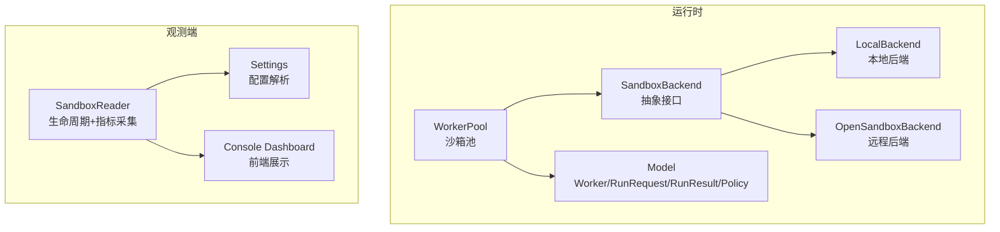
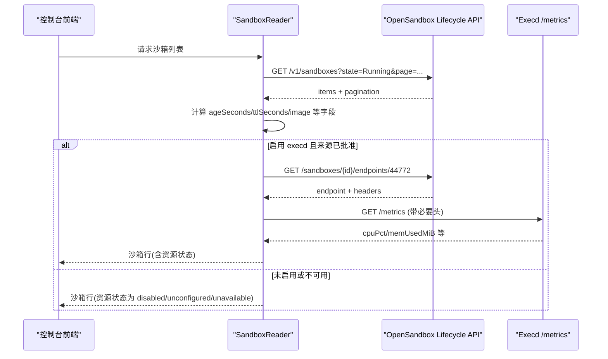
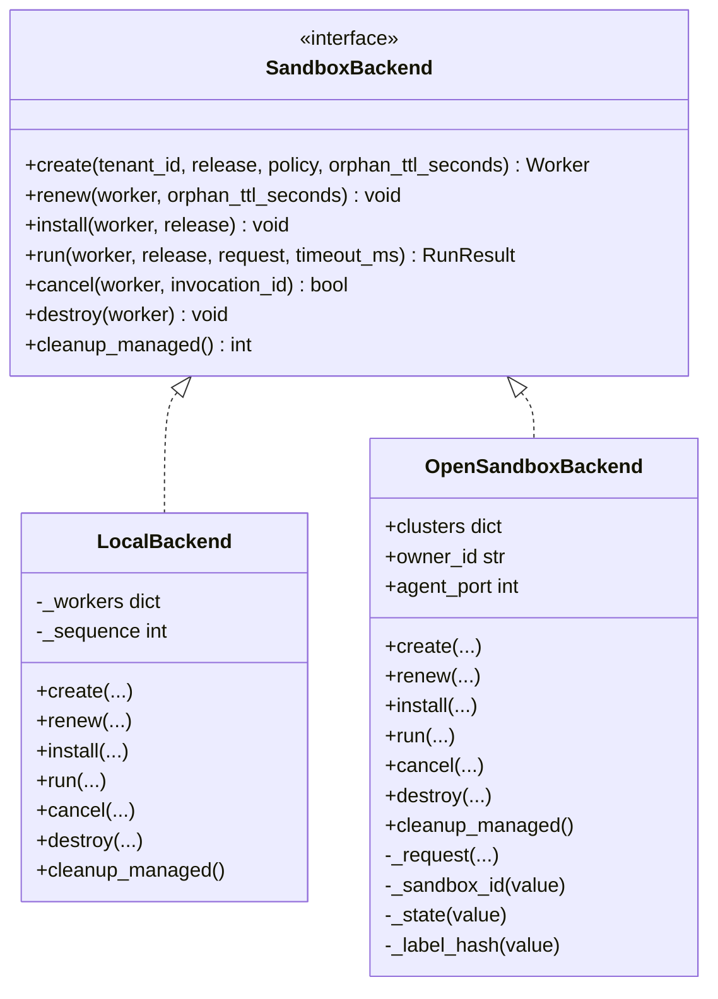
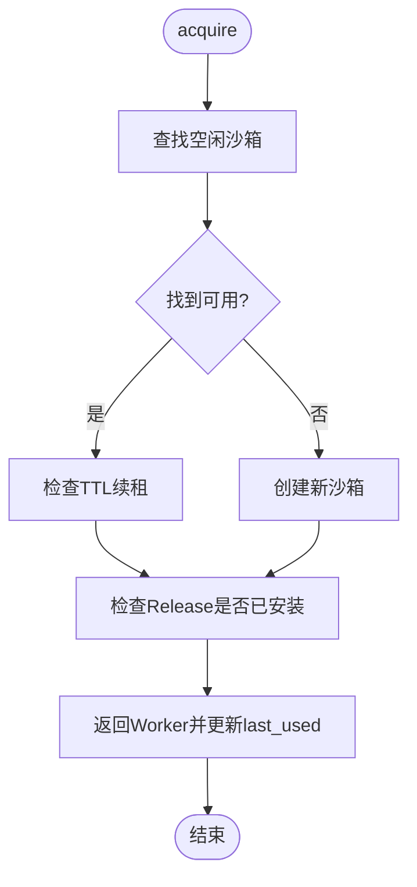
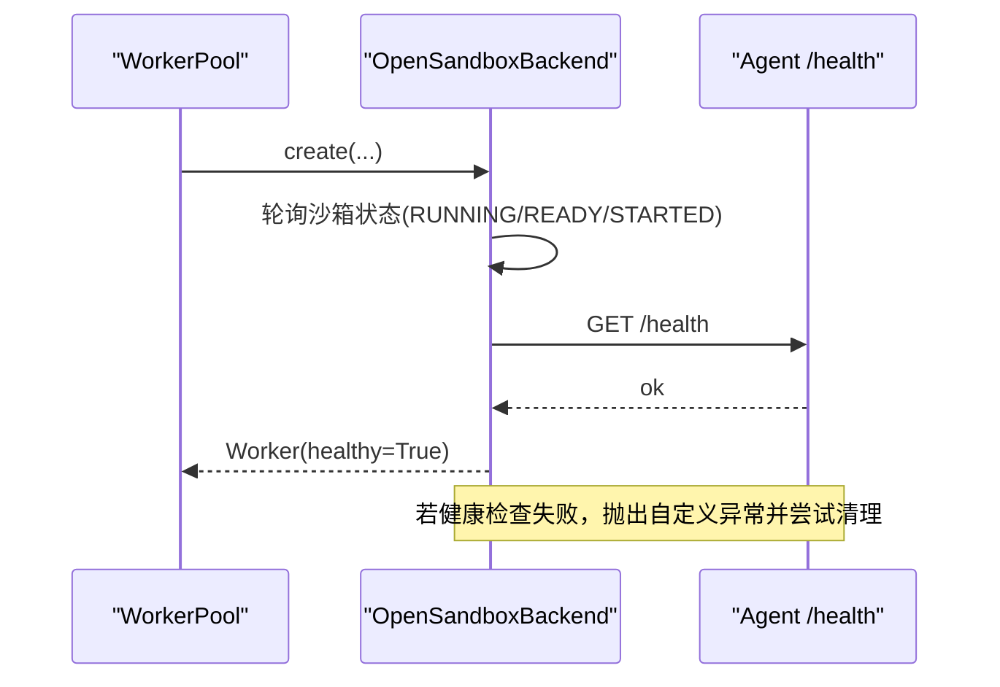
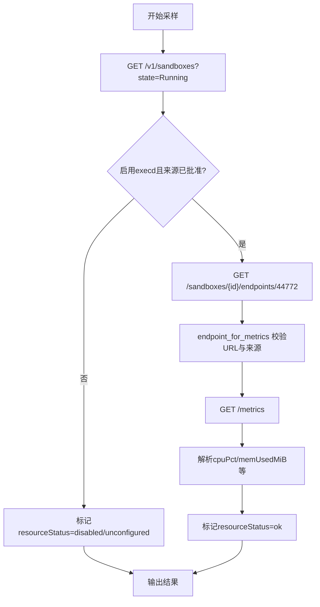
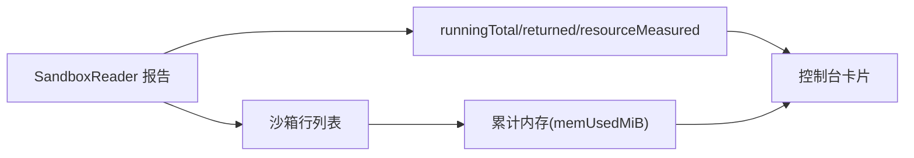
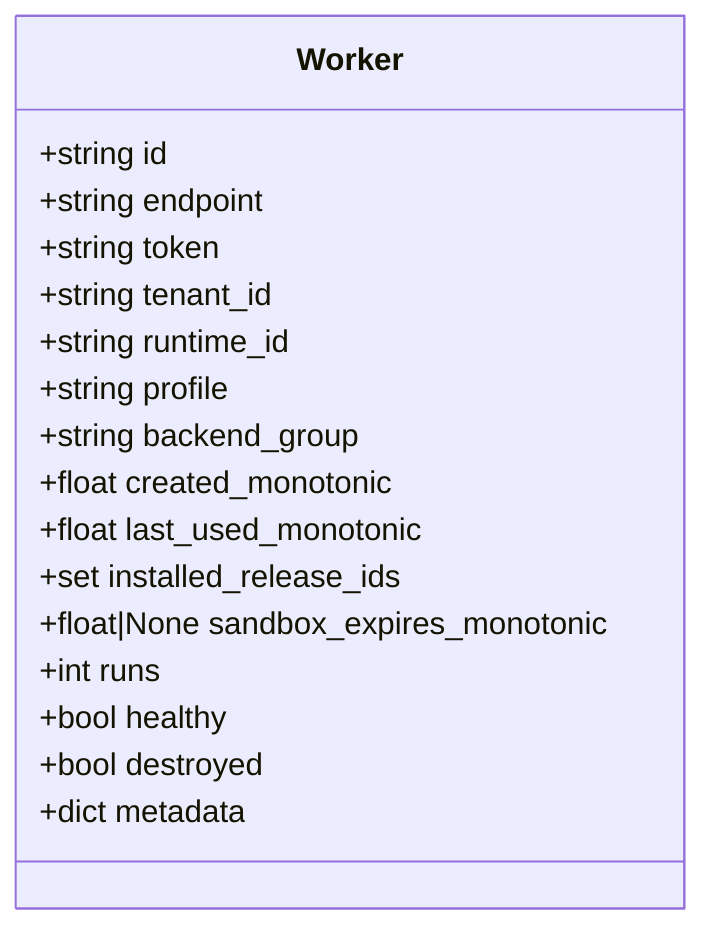
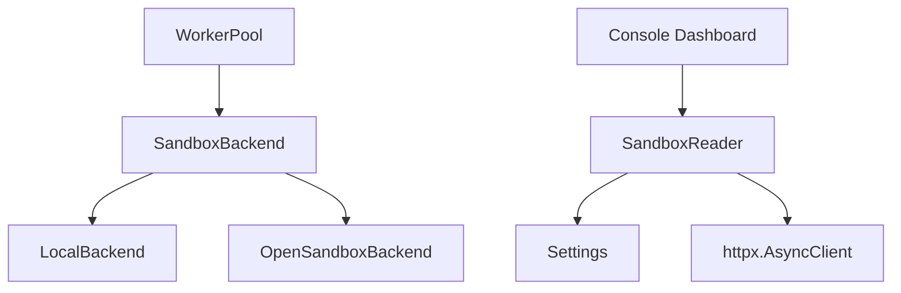

# 沙箱监控

<cite>
**本文引用的文件**   
- [runner_engine/sandbox/backend.py](file://runner_engine/sandbox/backend.py)
- [runner_engine/sandbox/local.py](file://runner_engine/sandbox/local.py)
- [runner_engine/sandbox/opensandbox.py](file://runner_engine/sandbox/opensandbox.py)
- [runner_engine/model.py](file://runner_engine/model.py)
- [runner_engine/pool.py](file://runner_engine/pool.py)
- [web/observe/sandbox.py](file://web/observe/sandbox.py)
- [web/observe/settings.py](file://web/observe/settings.py)
- [web/console/static/observe-dashboard.js](file://web/console/static/observe-dashboard.js)
- [web/OBSERVABILITY_README.md](file://web/OBSERVABILITY_README.md)
</cite>

## 目录
1. [引言](#引言)
2. [项目结构](#项目结构)
3. [核心组件](#核心组件)
4. [架构总览](#架构总览)
5. [详细组件分析](#详细组件分析)
6. [依赖关系分析](#依赖关系分析)
7. [性能与容量规划](#性能与容量规划)
8. [故障排查指南](#故障排查指南)
9. [结论](#结论)

## 引言
本文件面向“沙箱监控”能力，围绕沙箱实例的生命周期、健康检查、资源采集（CPU 与内存）、多沙箱聚合展示、趋势分析与容量规划进行系统化说明。系统由两部分组成：
- 运行时侧：负责创建、运行、续租和销毁沙箱，维护 Worker 对象及其状态。
- 观测侧：只读查询 OpenSandbox 生命周期 API，并在允许时通过 execd /metrics 获取 CPU 与内存指标，最终在控制台页面中聚合展示。

## 项目结构
与沙箱监控直接相关的代码主要分布在以下模块：
- runner_engine/sandbox：后端抽象与具体实现（本地与 OpenSandbox）。
- runner_engine/model：Worker、RunRequest、RunResult、SecurityPolicy 等核心数据模型。
- runner_engine/pool：按租户、运行时、安全策略维度的沙箱池管理，包含 TTL 续租与健康淘汰。
- web/observe：观测服务的数据采集器与配置解析。
- web/console/static：前端仪表盘渲染逻辑。
- web/OBSERVABILITY_README.md：OpenSandbox 生命周期与 execd 指标的官方接口说明。

图表来源
- [runner_engine/pool.py:11-44](file://runner_engine/pool.py#L11-L44)
- [runner_engine/sandbox/backend.py:14-49](file://runner_engine/sandbox/backend.py#L14-L49)
- [runner_engine/sandbox/local.py:14-62](file://runner_engine/sandbox/local.py#L14-L62)
- [runner_engine/sandbox/opensandbox.py:31-50](file://runner_engine/sandbox/opensandbox.py#L31-L50)
- [runner_engine/model.py:74-90](file://runner_engine/model.py#L74-L90)
- [web/observe/settings.py:79-127](file://web/observe/settings.py#L79-L127)
- [web/observe/sandbox.py:87-109](file://web/observe/sandbox.py#L87-L109)
- [web/console/static/observe-dashboard.js:268-298](file://web/console/static/observe-dashboard.js#L268-L298)

章节来源
- [runner_engine/sandbox/backend.py:14-49](file://runner_engine/sandbox/backend.py#L14-L49)
- [runner_engine/sandbox/local.py:14-132](file://runner_engine/sandbox/local.py#L14-L132)
- [runner_engine/sandbox/opensandbox.py:31-440](file://runner_engine/sandbox/opensandbox.py#L31-L440)
- [runner_engine/model.py:74-90](file://runner_engine/model.py#L74-L90)
- [runner_engine/pool.py:11-188](file://runner_engine/pool.py#L11-L188)
- [web/observe/sandbox.py:87-325](file://web/observe/sandbox.py#L87-L325)
- [web/observe/settings.py:79-127](file://web/observe/settings.py#L79-L127)
- [web/console/static/observe-dashboard.js:268-317](file://web/console/static/observe-dashboard.js#L268-L317)
- [web/OBSERVABILITY_README.md:146-200](file://web/OBSERVABILITY_README.md#L146-L200)

## 核心组件
- SandboxBackend 抽象接口：定义 create/renew/install/run/cancel/destroy/cleanup_managed 统一行为。
- LocalBackend：开发测试用本地后端，不具隔离性，用于快速验证。
- OpenSandboxBackend：生产用远程后端，封装与 OpenSandbox Lifecycle API 的交互、健康检查、端点发现与错误处理。
- WorkerPool：按租户+运行时+策略维度复用沙箱，负责 TTL 续租、空闲回收、失败失效与配额保护。
- Worker：沙箱实例在进程内的状态载体，包含 endpoint、token、健康标记、过期时间、运行计数等。
- SandboxReader：观测服务读取 Running 沙箱列表，可选采集 execd /metrics 的 CPU 与内存指标。
- Settings：观测服务配置，包括 OpenSandbox URL、API Key、分页上限、execd 开关与白名单域名。

章节来源
- [runner_engine/sandbox/backend.py:14-49](file://runner_engine/sandbox/backend.py#L14-L49)
- [runner_engine/sandbox/local.py:14-132](file://runner_engine/sandbox/local.py#L14-L132)
- [runner_engine/sandbox/opensandbox.py:31-440](file://runner_engine/sandbox/opensandbox.py#L31-L440)
- [runner_engine/pool.py:11-188](file://runner_engine/pool.py#L11-L188)
- [runner_engine/model.py:74-90](file://runner_engine/model.py#L74-L90)
- [web/observe/sandbox.py:87-325](file://web/observe/sandbox.py#L87-L325)
- [web/observe/settings.py:79-127](file://web/observe/settings.py#L79-L127)

## 架构总览
下图展示了从观测端到 OpenSandbox 的只读数据流，以及运行时侧的沙箱生命周期关键路径。

图表来源
- [web/observe/sandbox.py:198-307](file://web/observe/sandbox.py#L198-L307)
- [web/observe/sandbox.py:137-196](file://web/observe/sandbox.py#L137-L196)
- [web/OBSERVABILITY_README.md:146-200](file://web/OBSERVABILITY_README.md#L146-L200)

## 详细组件分析

### 沙箱后端抽象与实现
- 抽象接口 SandboxBackend 定义了统一的沙箱操作契约，便于替换不同后端。
- LocalBackend 提供轻量本地实现，适合开发与测试；不保证隔离与安全。
- OpenSandboxBackend 封装了集群选择、HTTP 请求、状态解析、端点发现、健康检查与清理逻辑。

图表来源
- [runner_engine/sandbox/backend.py:14-49](file://runner_engine/sandbox/backend.py#L14-L49)
- [runner_engine/sandbox/local.py:14-132](file://runner_engine/sandbox/local.py#L14-L132)
- [runner_engine/sandbox/opensandbox.py:31-440](file://runner_engine/sandbox/opensandbox.py#L31-L440)

章节来源
- [runner_engine/sandbox/backend.py:14-49](file://runner_engine/sandbox/backend.py#L14-L49)
- [runner_engine/sandbox/local.py:14-132](file://runner_engine/sandbox/local.py#L14-L132)
- [runner_engine/sandbox/opensandbox.py:31-440](file://runner_engine/sandbox/opensandbox.py#L31-L440)

### 沙箱池与生命周期管理
WorkerPool 负责：
- 按 tenant_id + runtime.id + profile 维度复用沙箱。
- 空闲超时回收与 TTL 续租（renew_before_seconds 阈值触发）。
- 安装 Release 到沙箱并限制最大安装数量。
- 失败失效与释放配额，重启后清理托管残留。

图表来源
- [runner_engine/pool.py:73-130](file://runner_engine/pool.py#L73-L130)
- [runner_engine/pool.py:51-71](file://runner_engine/pool.py#L51-L71)

章节来源
- [runner_engine/pool.py:11-188](file://runner_engine/pool.py#L11-L188)

### 沙箱健康检查与故障检测
- OpenSandboxBackend.create 在创建后轮询沙箱状态，直到 RUNNING/READY/STARTED 或进入失败态。
- 随后调用 worker 的 /health 接口，等待 agent 就绪；超时则抛出可重试错误。
- WorkerPool 对 unhealthy 的 Worker 标记并销毁，避免继续复用。

图表来源
- [runner_engine/sandbox/opensandbox.py:192-290](file://runner_engine/sandbox/opensandbox.py#L192-L290)
- [runner_engine/pool.py:144-147](file://runner_engine/pool.py#L144-L147)

章节来源
- [runner_engine/sandbox/opensandbox.py:192-290](file://runner_engine/sandbox/opensandbox.py#L192-L290)
- [runner_engine/pool.py:144-147](file://runner_engine/pool.py#L144-L147)

### 资源使用采集机制（CPU 与内存）
观测服务通过以下步骤采集资源指标：
- 仅执行 GET 请求，读取 Running 沙箱列表。
- 当开启 execd 且 allowed_origins 配置合法时，对每个沙箱调用 endpoints/44772 获取访问地址与头信息。
- 校验并构造 /metrics 请求，采集 cpuPct、memUsedMiB、memTotalMiB、timestamp 等字段。
- 对不可用或未配置的情况给出明确状态与提示。

图表来源
- [web/observe/sandbox.py:198-307](file://web/observe/sandbox.py#L198-L307)
- [web/observe/sandbox.py:137-196](file://web/observe/sandbox.py#L137-L196)
- [web/observe/settings.py:35-49](file://web/observe/settings.py#L35-L49)

章节来源
- [web/observe/sandbox.py:198-307](file://web/observe/sandbox.py#L198-L307)
- [web/observe/sandbox.py:137-196](file://web/observe/sandbox.py#L137-L196)
- [web/observe/settings.py:35-49](file://web/observe/settings.py#L35-L49)

### 多沙箱环境监控数据聚合与对比
- 前端汇总 runningTotal、returned、resourceMeasured 等统计值。
- 对已采样的 memUsedMiB 求和，展示总内存占用。
- 显示覆盖率（已读取 vs 已采样），并对截断、未采样、不可用等情况给出提示。

图表来源
- [web/console/static/observe-dashboard.js:268-317](file://web/console/static/observe-dashboard.js#L268-L317)
- [web/observe/sandbox.py:289-307](file://web/observe/sandbox.py#L289-L307)

章节来源
- [web/console/static/observe-dashboard.js:268-317](file://web/console/static/observe-dashboard.js#L268-L317)
- [web/observe/sandbox.py:289-307](file://web/observe/sandbox.py#L289-L307)

### 沙箱状态跟踪与数据结构
Worker 对象承载沙箱实例的关键状态，包括 endpoint、token、租户、运行时、策略、创建与最后使用时间、过期时间、运行次数、健康与销毁标记、元数据等。这些字段支撑池化复用、TTL 续租与健康淘汰。

图表来源
- [runner_engine/model.py:74-90](file://runner_engine/model.py#L74-L90)

章节来源
- [runner_engine/model.py:74-90](file://runner_engine/model.py#L74-L90)

## 依赖关系分析
- WorkerPool 依赖 SandboxBackend 抽象，从而解耦本地与远程实现。
- OpenSandboxBackend 依赖 HTTP 客户端与 Worker HTTP API 工具函数。
- SandboxReader 依赖 Settings 配置与 httpx 异步客户端，仅对 OpenSandbox Lifecycle 与 execd 发起 GET 请求。
- 前端依赖 SandboxReader 的输出结构进行渲染与统计。

图表来源
- [runner_engine/pool.py:11-44](file://runner_engine/pool.py#L11-L44)
- [runner_engine/sandbox/backend.py:14-49](file://runner_engine/sandbox/backend.py#L14-L49)
- [web/observe/sandbox.py:87-109](file://web/observe/sandbox.py#L87-L109)
- [web/observe/settings.py:79-127](file://web/observe/settings.py#L79-L127)

章节来源
- [runner_engine/pool.py:11-44](file://runner_engine/pool.py#L11-L44)
- [runner_engine/sandbox/backend.py:14-49](file://runner_engine/sandbox/backend.py#L14-L49)
- [web/observe/sandbox.py:87-109](file://web/observe/sandbox.py#L87-L109)
- [web/observe/settings.py:79-127](file://web/observe/settings.py#L79-L127)

## 性能与容量规划
- 分页与上限控制
  - sandbox_page_size 与 sandbox_max_items 控制每次拉取与最多返回的沙箱数，避免单次响应过大。
  - 当 totalItems > returned 时，前端会明确提示“列表被截断”，应提高 OBS_SANDBOX_MAX_ITEMS。
- 并发采样预算
  - execd_sample_limit 控制每轮最多并行采样多少个沙箱的 execd /metrics，默认 30，可调至 1~200。
  - 采样整体有 18 秒超时预算，超过将标记为 unavailable。
- 资源限额
  - SecurityPolicy.cpu 与 SecurityPolicy.memory 决定沙箱的资源上限，影响单实例 CPU/内存峰值。
- 池化与复用
  - idle_seconds 控制空闲回收，orphan_ttl_seconds 控制远端沙箱 TTL，renew_before_seconds 控制续租提前量。
  - max_installed_releases 限制单个沙箱内安装的 Release 数量，防止缓存膨胀。
- 容量规划建议
  - 根据业务峰值并发估算需要多少 Running 沙箱，结合 SecurityPolicy 的 CPU/内存上限评估节点资源。
  - 合理设置 sandbox_max_items 与 execd_sample_limit，确保观测覆盖度与延迟平衡。
  - 对高负载场景，适当增大 renew_before_seconds，避免临近到期导致频繁续租与抖动。

章节来源
- [web/observe/settings.py:94-127](file://web/observe/settings.py#L94-L127)
- [web/observe/sandbox.py:211-275](file://web/observe/sandbox.py#L211-L275)
- [runner_engine/model.py:26-35](file://runner_engine/model.py#L26-L35)
- [runner_engine/pool.py:19-43](file://runner_engine/pool.py#L19-L43)
- [web/OBSERVABILITY_README.md:146-200](file://web/OBSERVABILITY_README.md#L146-L200)

## 故障排查指南
- OpenSandbox 不可达或鉴权失败
  - 现象：观测服务返回 status=error，message 提示检查 URL、API Key 与网络。
  - 排查：确认 OBS_SANDBOX_URL 与 OBS_SANDBOX_API_KEY 正确，网络可达。
- execd 指标不可用
  - 现象：resourceStatus=unavailable 或 unconfigured。
  - 排查：确认已开启 execd 指标（OBS_EXECD_METRICS=1），并配置允许的 origin（OBS_EXECD_ALLOWED_ORIGINS）。
  - 注意：endpoint_for_metrics 会严格校验 scheme、host、用户名密码与 fragment，不允许不安全来源。
- 沙箱启动失败或健康检查超时
  - 现象：OpenSandboxBackend 抛出 SANDBOX_START_FAILED/SANDBOX_START_TIMEOUT/AGENT_START_TIMEOUT。
  - 排查：检查沙箱镜像、环境变量、端口暴露与 agent /health 是否正常。
- 沙箱未被回收或泄漏
  - 现象：长时间存在 Running 沙箱。
  - 排查：检查 idle_seconds、orphan_ttl_seconds、renew_before_seconds 配置；必要时调用 reset_after_restart 清理托管残留。

章节来源
- [web/observe/sandbox.py:308-324](file://web/observe/sandbox.py#L308-L324)
- [web/observe/sandbox.py:55-84](file://web/observe/sandbox.py#L55-L84)
- [runner_engine/sandbox/opensandbox.py:192-290](file://runner_engine/sandbox/opensandbox.py#L192-L290)
- [runner_engine/pool.py:161-188](file://runner_engine/pool.py#L161-L188)

## 结论
本方案通过后端抽象与具体实现分离，实现了沙箱的统一生命周期管理与健康检查；观测侧以只读方式采集沙箱状态与资源指标，并通过前端仪表盘进行聚合展示。借助合理的分页、采样上限与资源限额配置，可在多沙箱环境下获得稳定、可观测、可扩展的运行视图。对于容量规划与调优，应结合业务并发、SecurityPolicy 资源上限与观测覆盖度进行综合权衡。