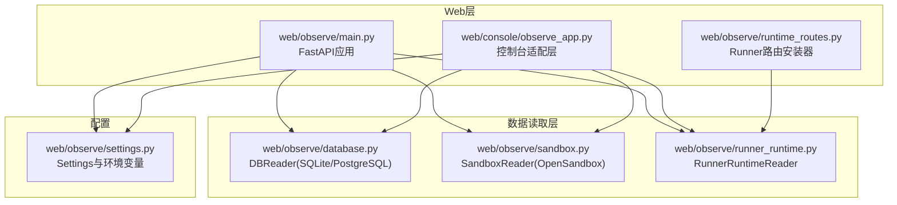
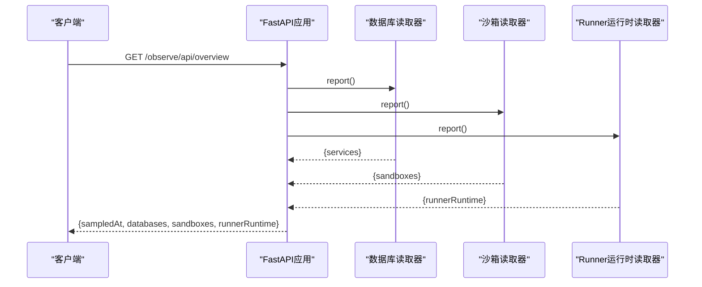
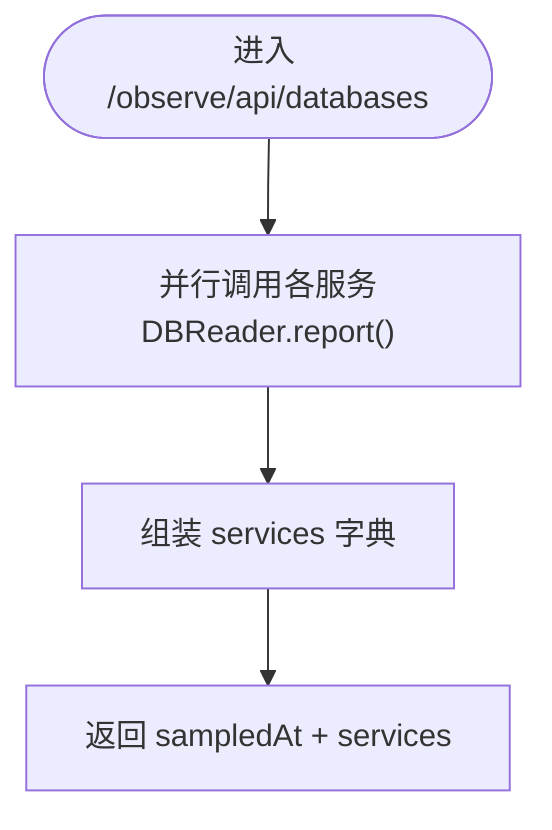
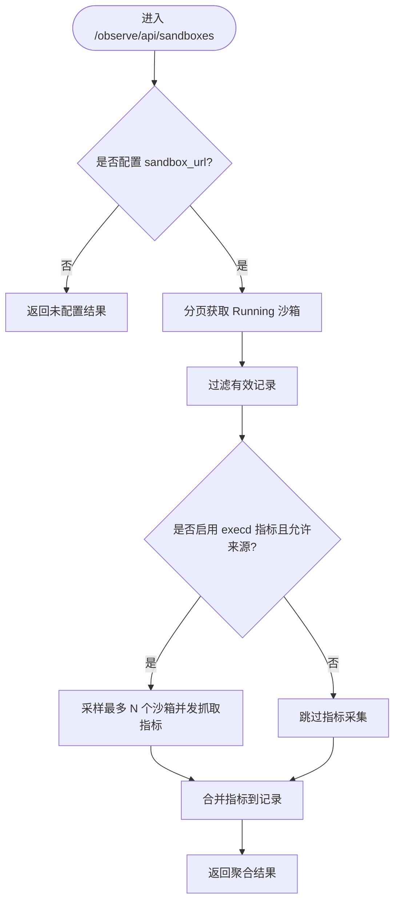
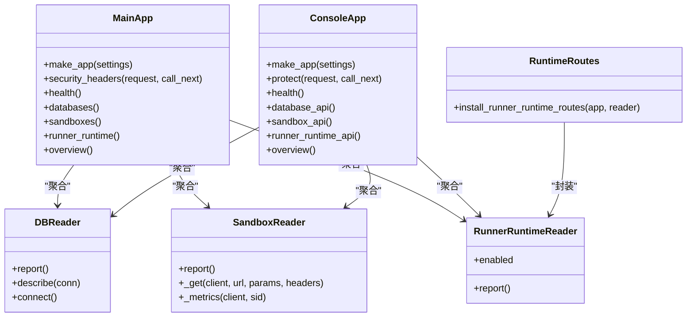

# 监控API接口

<cite>
**本文引用的文件**   
- [web/observe/main.py](file://web/observe/main.py)
- [web/console/observe_app.py](file://web/console/observe_app.py)
- [web/observe/runtime_routes.py](file://web/observe/runtime_routes.py)
- [web/observe/settings.py](file://web/observe/settings.py)
- [web/observe/database.py](file://web/observe/database.py)
- [web/observe/sandbox.py](file://web/observe/sandbox.py)
- [web/observe/runner_runtime.py](file://web/observe/runner_runtime.py)
</cite>

## 目录
1. [简介](#简介)
2. [项目结构](#项目结构)
3. [核心组件](#核心组件)
4. [架构总览](#架构总览)
5. [详细组件分析](#详细组件分析)
6. [依赖关系分析](#依赖关系分析)
7. [性能与限流](#性能与限流)
8. [安全与访问控制](#安全与访问控制)
9. [错误码与排错指南](#错误码与排错指南)
10. [结论](#结论)
11. [附录：API参考](#附录api参考)

## 简介
本文件为“监控API接口”的权威文档，覆盖以下能力：
- RESTful API端点：健康检查、数据库状态查询、沙箱运行状态、Runner运行时状态、统一概览。
- 认证机制：基础认证（Basic）与安全响应头；可选外部鉴权（OpenSandbox API Key、Runner Admin Token）。
- 版本管理：服务级版本号与路径前缀约定。
- 错误处理：通用HTTP状态码与业务字段语义。
- 限流策略：基于并发与分页的内置保护。
- 调用示例、客户端集成、调试方法。
- 安全配置、访问控制与审计日志建议。
- 性能监控与故障诊断技巧。

该监控服务提供只读观测能力，不执行任何写操作，适合通过反向代理暴露到生产环境。

## 项目结构
监控API由两个FastAPI应用组成：
- 独立可观测性应用：web/observe/main.py，提供完整API集合。
- 控制台集成应用：web/console/observe_app.py，复用observe模块能力，面向统一控制台。

图表来源
- [web/observe/main.py:57-168](file://web/observe/main.py#L57-L168)
- [web/console/observe_app.py:25-109](file://web/console/observe_app.py#L25-L109)
- [web/observe/runtime_routes.py:10-19](file://web/observe/runtime_routes.py#L10-L19)
- [web/observe/database.py:98-390](file://web/observe/database.py#L98-L390)
- [web/observe/sandbox.py:87-325](file://web/observe/sandbox.py#L87-L325)
- [web/observe/runner_runtime.py:9-63](file://web/observe/runner_runtime.py#L9-L63)
- [web/observe/settings.py:79-128](file://web/observe/settings.py#L79-L128)

章节来源
- [web/observe/main.py:1-198](file://web/observe/main.py#L1-L198)
- [web/console/observe_app.py:1-110](file://web/console/observe_app.py#L1-L110)

## 核心组件
- FastAPI应用装配：定义中间件、路由、静态资源挂载。
- 数据库聚合读取器：对publish/build/runner三个服务的表进行只读聚合统计。
- OpenSandbox沙箱读取器：分页获取沙箱列表，并可选采集execd指标。
- Runner运行时读取器：调用Runner Admin的只读观察接口。
- Settings配置中心：从环境变量加载配置并进行严格校验。

章节来源
- [web/observe/main.py:57-168](file://web/observe/main.py#L57-L168)
- [web/observe/database.py:98-390](file://web/observe/database.py#L98-L390)
- [web/observe/sandbox.py:87-325](file://web/observe/sandbox.py#L87-L325)
- [web/observe/runner_runtime.py:9-63](file://web/observe/runner_runtime.py#L9-L63)
- [web/observe/settings.py:79-128](file://web/observe/settings.py#L79-L128)

## 架构总览
监控API采用分层架构：
- Web层：FastAPI路由与中间件，负责认证、安全头、请求分发。
- 读取层：分别对接数据库、OpenSandbox生命周期服务、Runner Admin API。
- 配置层：集中管理连接串、映射、开关与限制参数。

图表来源
- [web/observe/main.py:141-153](file://web/observe/main.py#L141-L153)
- [web/observe/database.py:336-367](file://web/observe/database.py#L336-L367)
- [web/observe/sandbox.py:198-307](file://web/observe/sandbox.py#L198-L307)
- [web/observe/runner_runtime.py:26-62](file://web/observe/runner_runtime.py#L26-L62)

## 详细组件分析

### 健康检查接口
- 路径：GET /observe/health
- 功能：返回服务是否存活、服务名与版本信息。
- 认证：受中间件Basic认证保护（若启用）。
- 响应体关键字段：ok、service、version。

章节来源
- [web/observe/main.py:108-114](file://web/observe/main.py#L108-L114)
- [web/console/observe_app.py:61-66](file://web/console/observe_app.py#L61-L66)

### 数据库状态查询接口
- 路径：GET /observe/api/databases
- 功能：并行聚合publish/build/runner三个服务的数据库指标，包括总量、近24小时增量、按状态/后端分组的Top分布等。
- 认证：受中间件Basic认证保护（若启用）。
- 响应体关键字段：sampledAt、services（每个服务包含status、message、metrics、tables、dialect）。

图表来源
- [web/observe/main.py:116-129](file://web/observe/main.py#L116-L129)
- [web/observe/database.py:336-367](file://web/observe/database.py#L336-L367)

章节来源
- [web/observe/main.py:116-129](file://web/observe/main.py#L116-L129)
- [web/observe/database.py:98-390](file://web/observe/database.py#L98-L390)

### 沙箱运行状态接口
- 路径：GET /observe/api/sandboxes
- 功能：分页拉取OpenSandbox中Running状态的沙箱，支持可选采集execd资源指标（CPU/内存）。
- 认证：受中间件Basic认证保护（若启用）。
- 关键配置：OBS_SANDBOX_URL、OBS_SANDBOX_API_KEY、OBS_EXECD_METRICS、OBS_EXECD_ALLOWED_ORIGINS、OBS_SANDBOX_PAGE_SIZE、OBS_SANDBOX_MAX_ITEMS、OBS_EXECD_SAMPLE_LIMIT。
- 响应体关键字段：status、message、sampledAt、runningTotal、returned、truncated、pagesFetched、metricsEnabled、resourceMeasured、resourceRequested、samplingLimit、sandboxes[]。

图表来源
- [web/observe/sandbox.py:198-307](file://web/observe/sandbox.py#L198-L307)
- [web/observe/settings.py:94-128](file://web/observe/settings.py#L94-L128)

章节来源
- [web/observe/main.py:131-133](file://web/observe/main.py#L131-L133)
- [web/observe/sandbox.py:87-325](file://web/observe/sandbox.py#L87-L325)
- [web/observe/settings.py:94-128](file://web/observe/settings.py#L94-L128)

### Runner运行时状态接口
- 路径：GET /observe/api/runner-runtime
- 功能：调用Runner Admin的只读观察接口，返回运行时状态。
- 认证：受中间件Basic认证保护（若启用）；对外部Runner Admin使用Bearer Token。
- 关键配置：OBS_RUNNER_ADMIN_URL、OBS_RUNNER_ADMIN_TOKEN。
- 响应体关键字段：status、message，以及下游返回的运行态字段。

章节来源
- [web/observe/main.py:135-139](file://web/observe/main.py#L135-L139)
- [web/observe/runner_runtime.py:9-63](file://web/observe/runner_runtime.py#L9-L63)

### 统一概览接口
- 路径：GET /observe/api/overview
- 功能：聚合数据库、沙箱、Runner运行时三类数据，一次性返回。
- 认证：受中间件Basic认证保护（若启用）。
- 响应体关键字段：sampledAt、databases、sandboxes、runnerRuntime。

章节来源
- [web/observe/main.py:141-153](file://web/observe/main.py#L141-L153)

### 静态资源与根路径
- 路径：GET /observe/ 与 GET /
- 功能：返回前端页面或重定向到/observe/。
- 静态资源：/observe/static/*。

章节来源
- [web/observe/main.py:155-167](file://web/observe/main.py#L155-L167)

## 依赖关系分析
- web/observe/main.py依赖database.py、sandbox.py、runner_runtime.py与settings.py。
- web/console/observe_app.py复用observe模块，注入exact readers与静态资源。
- runtime_routes.py提供将Runner运行时路由安装到任意FastAPI实例的能力。

图表来源
- [web/observe/main.py:57-168](file://web/observe/main.py#L57-L168)
- [web/console/observe_app.py:25-109](file://web/console/observe_app.py#L25-L109)
- [web/observe/runtime_routes.py:10-19](file://web/observe/runtime_routes.py#L10-L19)
- [web/observe/database.py:98-390](file://web/observe/database.py#L98-L390)
- [web/observe/sandbox.py:87-325](file://web/observe/sandbox.py#L87-L325)
- [web/observe/runner_runtime.py:9-63](file://web/observe/runner_runtime.py#L9-L63)

章节来源
- [web/observe/main.py:57-168](file://web/observe/main.py#L57-L168)
- [web/console/observe_app.py:25-109](file://web/console/observe_app.py#L25-L109)
- [web/observe/runtime_routes.py:10-19](file://web/observe/runtime_routes.py#L10-L19)

## 性能与限流
- 并发聚合：概览接口并行调用数据库、沙箱、Runner运行时读取器，降低端到端延迟。
- 沙箱分页与上限：
  - OBS_SANDBOX_PAGE_SIZE：每页数量，默认50，范围1..100。
  - OBS_SANDBOX_MAX_ITEMS：最大返回条目数，默认200，范围1..500。
  - pagesFetched用于诊断分页深度。
- 指标采样限制：
  - OBS_EXECD_METRICS：开启后才会尝试采集execd指标。
  - OBS_EXECD_SAMPLE_LIMIT：并发采样上限，默认30，范围1..200。
  - 并发度：内部使用信号量限制并发抓取，避免压垮下游。
- 超时与连接限制：
  - OpenSandbox HTTP客户端设置连接与整体超时。
  - Runner运行时读取器设置短超时，避免阻塞。
- 数据库只读与超时：
  - SQLite以只读模式打开，设置busy_timeout。
  - PostgreSQL会话强制READ ONLY，并设置statement_timeout。

章节来源
- [web/observe/main.py:116-153](file://web/observe/main.py#L116-L153)
- [web/observe/sandbox.py:203-276](file://web/observe/sandbox.py#L203-L276)
- [web/observe/runner_runtime.py:35-47](file://web/observe/runner_runtime.py#L35-L47)
- [web/observe/database.py:118-154](file://web/observe/database.py#L118-L154)
- [web/observe/settings.py:94-128](file://web/observe/settings.py#L94-L128)

## 安全与访问控制
- Basic认证：
  - 通过Authorization: Basic Base64(username:password)实现。
  - 用户名/密码来自OBS_BASIC_USER/OBS_BASIC_PASSWORD。
  - 非回环地址绑定必须启用Basic认证。
- 安全响应头：
  - X-Content-Type-Options: nosniff
  - X-Frame-Options: DENY
  - Referrer-Policy: no-referrer
  - Content-Security-Policy: 仅允许同源资源
  - Cache-Control: no-store
- 外部系统鉴权：
  - OpenSandbox：通过OPEN-SANDBOX-API-KEY头部访问生命周期服务；execd指标需经白名单origin校验。
  - Runner Admin：通过Authorization: Bearer token访问只读观察接口。
- 输入校验与防护：
  - SQL标识符校验、禁止用户自定义SQL。
  - OpenSandbox endpoint URL与Header严格校验，禁止危险Header转发。
  - 敏感信息不在日志或响应中泄露。

章节来源
- [web/observe/main.py:28-54](file://web/observe/main.py#L28-L54)
- [web/observe/main.py:84-106](file://web/observe/main.py#L84-L106)
- [web/observe/main.py:174-193](file://web/observe/main.py#L174-L193)
- [web/observe/sandbox.py:21-28](file://web/observe/sandbox.py#L21-L28)
- [web/observe/sandbox.py:55-84](file://web/observe/sandbox.py#L55-L84)
- [web/observe/sandbox.py:151-174](file://web/observe/sandbox.py#L151-L174)
- [web/observe/runner_runtime.py:35-40](file://web/observe/runner_runtime.py#L35-L40)
- [web/observe/database.py:72-75](file://web/observe/database.py#L72-L75)

## 错误码与排错指南
- HTTP状态码：
  - 401：未通过Basic认证。
  - 其他HTTP错误：由下游服务返回（如OpenSandbox、Runner Admin）。
- 业务状态字段：
  - status：ok/unconfigured/error（不同读取器可能略有差异）。
  - message：人类可读的错误描述。
  - note：针对具体指标的补充说明（例如时间列格式不符、缺少映射等）。
- 常见问题定位：
  - 数据库不可用：检查OBS_*_DB_URL、schema权限、只读配置。
  - 沙箱列表失败：检查OBS_SANDBOX_URL、API Key、网络连通性。
  - execd指标不可用：检查OBS_EXECD_METRICS、OBS_EXECD_ALLOWED_ORIGINS、endpoint与headers。
  - Runner运行时不可用：检查OBS_RUNNER_ADMIN_URL、OBS_RUNNER_ADMIN_TOKEN与下游可达性。

章节来源
- [web/observe/main.py:84-106](file://web/observe/main.py#L84-L106)
- [web/observe/database.py:78-83](file://web/observe/database.py#L78-L83)
- [web/observe/database.py:293-302](file://web/observe/database.py#L293-L302)
- [web/observe/database.py:359-367](file://web/observe/database.py#L359-L367)
- [web/observe/sandbox.py:308-313](file://web/observe/sandbox.py#L308-L313)
- [web/observe/runner_runtime.py:53-62](file://web/observe/runner_runtime.py#L53-L62)

## 结论
监控API提供稳定、安全的只读观测能力，通过分层读取器对接数据库、OpenSandbox与Runner Admin，结合严格的配置校验与安全头，满足生产环境的可观测需求。建议在反向代理后暴露，并配合日志与指标系统进行统一治理。

## 附录：API参考

### 端点清单
- GET /observe/health
- GET /observe/api/databases
- GET /observe/api/sandboxes
- GET /observe/api/runner-runtime
- GET /observe/api/overview
- GET /observe/ 与 GET /（重定向）
- GET /observe/static/*（静态资源）

### 认证方式
- Basic认证：Authorization: Basic Base64(username:password)
- OpenSandbox：OPEN-SANDBOX-API-KEY（由读取器自动添加）
- Runner Admin：Authorization: Bearer <token>（由读取器自动添加）

### 请求与响应示例（概念性）
- 健康检查
  - 请求：GET /observe/health
  - 响应：{ ok: true, service: "observability", version: "0.1.0" }
- 数据库状态
  - 请求：GET /observe/api/databases
  - 响应：{ sampledAt, services: { publish, build, runner } }
- 沙箱状态
  - 请求：GET /observe/api/sandboxes
  - 响应：{ status, message, sampledAt, runningTotal, returned, truncated, pagesFetched, metricsEnabled, resourceMeasured, resourceRequested, samplingLimit, sandboxes[] }
- Runner运行时
  - 请求：GET /observe/api/runner-runtime
  - 响应：{ status, message, ...下游字段 }
- 统一概览
  - 请求：GET /observe/api/overview
  - 响应：{ sampledAt, databases, sandboxes, runnerRuntime }

### 客户端集成要点
- 所有API均位于/observe前缀下，便于在网关层做统一鉴权与限流。
- 客户端应缓存静态资源，但避免缓存JSON响应（服务端已设置no-store）。
- 对于沙箱指标，确保OBS_EXECD_ALLOWED_ORIGINS包含目标origin，否则指标将被禁用。

### 调试方法
- 使用curl或浏览器开发者工具查看响应头中的安全头与WWW-Authenticate。
- 关注响应中的sampledAt字段判断数据新鲜度。
- 通过pagesFetched、truncated、resourceMeasured等字段评估分页与采样情况。
- 检查日志中关于数据库、OpenSandbox、Runner Admin的错误提示。