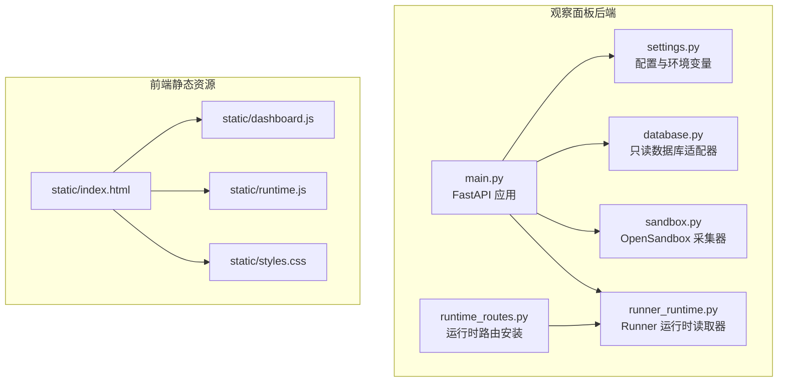
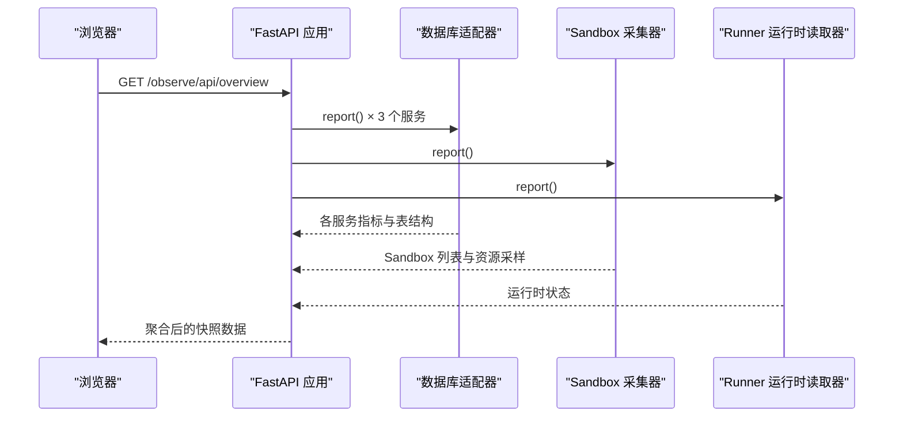
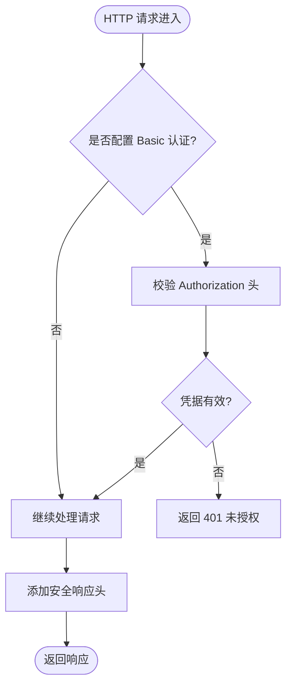
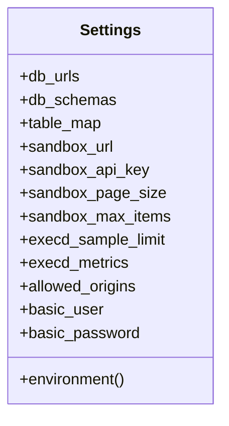
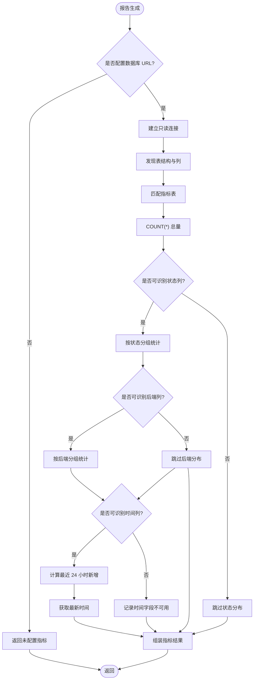
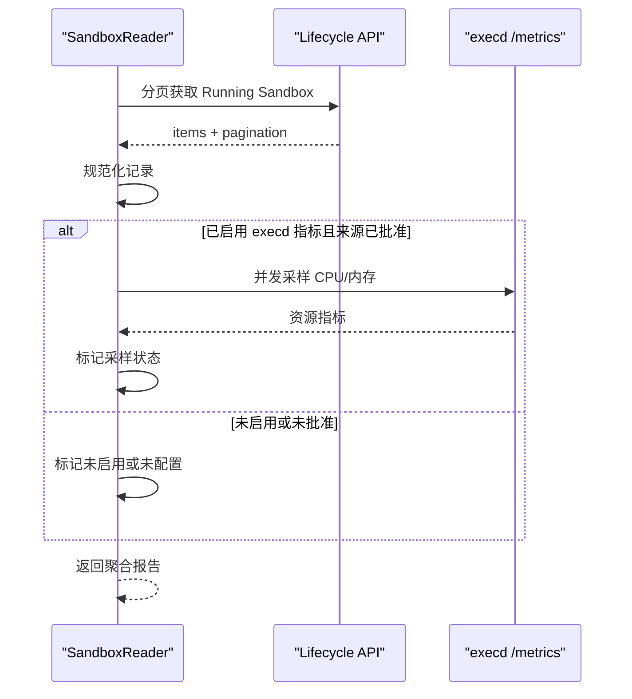
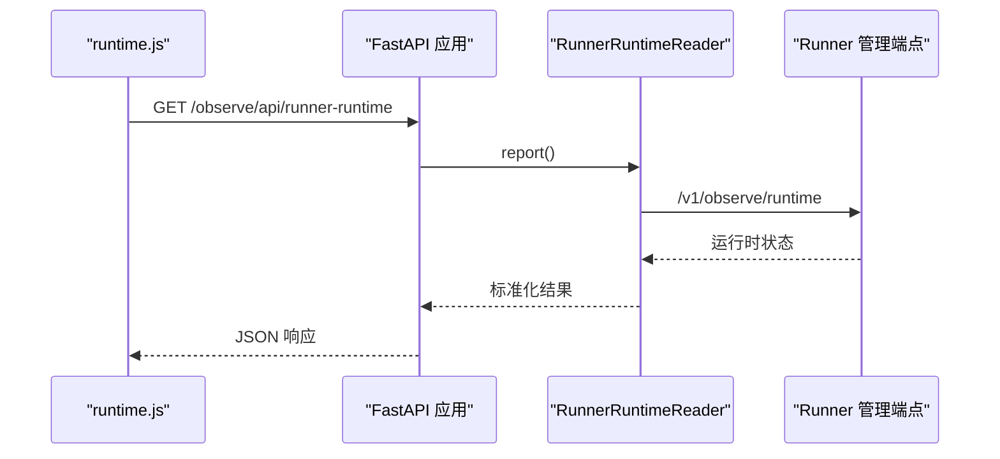
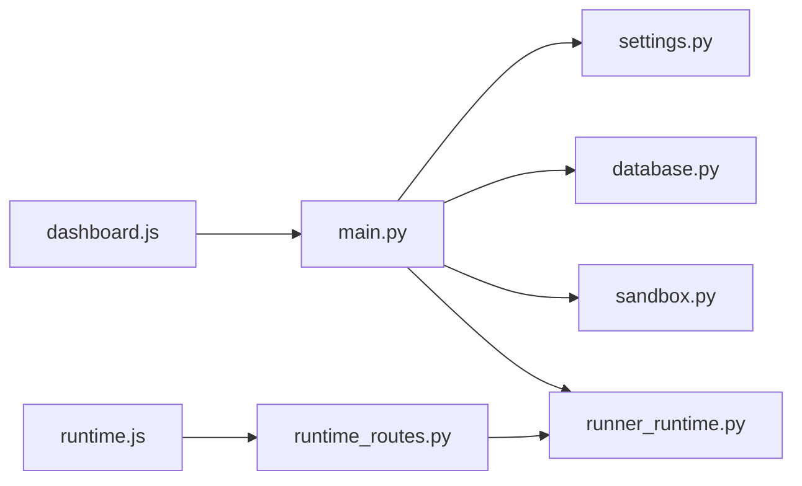
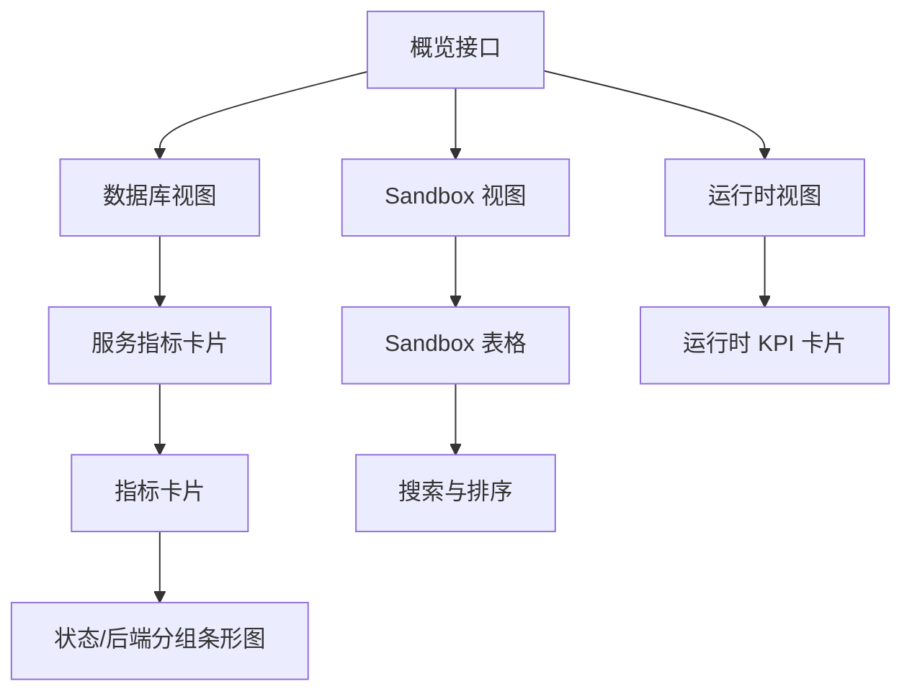
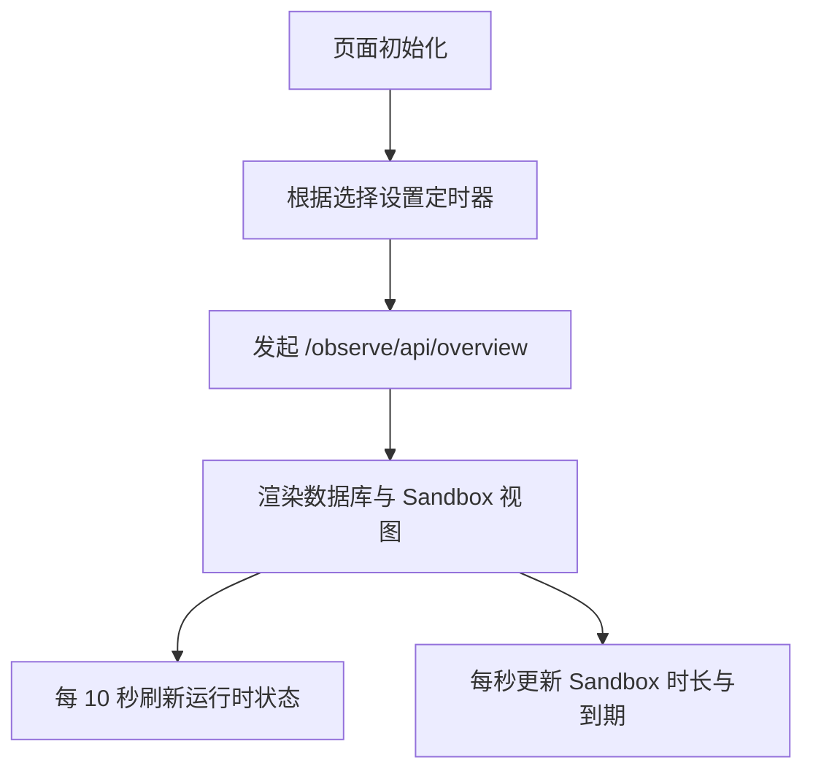

# 监控观察面板

<cite>
**本文引用的文件**   
- [web/observe/main.py](file://web/observe/main.py)
- [web/observe/settings.py](file://web/observe/settings.py)
- [web/observe/database.py](file://web/observe/database.py)
- [web/observe/runtime_routes.py](file://web/observe/runtime_routes.py)
- [web/observe/runner_runtime.py](file://web/observe/runner_runtime.py)
- [web/observe/sandbox.py](file://web/observe/sandbox.py)
- [web/observe/static/index.html](file://web/observe/static/index.html)
- [web/observe/static/dashboard.js](file://web/observe/static/dashboard.js)
- [web/observe/static/runtime.js](file://web/observe/static/runtime.js)
- [web/observe/static/styles.css](file://web/observe/static/styles.css)
</cite>

## 目录
1. [简介](#简介)
2. [项目结构](#项目结构)
3. [核心组件](#核心组件)
4. [架构总览](#架构总览)
5. [详细组件分析](#详细组件分析)
6. [依赖关系分析](#依赖关系分析)
7. [性能与大数据优化](#性能与大数据优化)
8. [指标展示与可视化](#指标展示与可视化)
9. [自定义配置与告警建议](#自定义配置与告警建议)
10. [实时数据更新机制](#实时数据更新机制)
11. [故障诊断指南](#故障诊断指南)
12. [结论](#结论)

## 简介
本监控观察面板是一个独立的只读观测服务，用于汇总和可视化三类运行时数据：
- 数据库指标：面向 Publish、Build、Runner 三个服务的持久化状态统计。
- OpenSandbox 运行实例：生命周期 API 返回的运行中 Sandbox 列表及可选资源采样。
- Runner 运行时状态：通过 Runner 管理端点获取的当前执行面状态。

该面板不写入业务数据，所有数据库访问均为只读；前端仅做展示与交互，后端负责聚合多源数据并统一暴露给浏览器。

## 项目结构
观察面板位于 `web/observe`，包含 ASGI 应用、设置解析、数据库适配器、Sandbox 采集器、Runner 运行时读取器以及前端静态资源。

**图表来源**
- [web/observe/main.py:57-168](file://web/observe/main.py#L57-L168)
- [web/observe/settings.py:79-127](file://web/observe/settings.py#L79-L127)
- [web/observe/database.py:98-390](file://web/observe/database.py#L98-L390)
- [web/observe/sandbox.py:87-325](file://web/observe/sandbox.py#L87-L325)
- [web/observe/runner_runtime.py:9-63](file://web/observe/runner_runtime.py#L9-L63)
- [web/observe/runtime_routes.py:10-19](file://web/observe/runtime_routes.py#L10-L19)
- [web/observe/static/index.html:1-168](file://web/observe/static/index.html#L1-L168)

**章节来源**
- [web/observe/main.py:1-198](file://web/observe/main.py#L1-L198)
- [web/observe/settings.py:1-128](file://web/observe/settings.py#L1-L128)
- [web/observe/static/index.html:1-168](file://web/observe/static/index.html#L1-L168)

## 核心组件
- FastAPI 应用与安全中间件：提供健康检查、数据库聚合、Sandbox 列表、Runner 运行时等接口，并强制 Basic 认证与安全响应头。
- 配置系统：从环境变量加载数据库连接、Schema、表映射、Sandbox URL、采样限制、允许来源等。
- 数据库适配器：自动发现表结构，按别名匹配指标表，支持 SQLite 与 PostgreSQL，严格只读。
- Sandbox 采集器：分页拉取 Running Sandbox，可选并发采集 execd 资源指标。
- Runner 运行时读取器：调用 Runner 管理端点获取当前执行面状态。
- 前端仪表盘：KPI 卡片、服务指标卡片、Sandbox 表格、搜索排序、自动刷新。

**章节来源**
- [web/observe/main.py:28-168](file://web/observe/main.py#L28-L168)
- [web/observe/settings.py:15-127](file://web/observe/settings.py#L15-L127)
- [web/observe/database.py:22-390](file://web/observe/database.py#L22-L390)
- [web/observe/sandbox.py:87-325](file://web/observe/sandbox.py#L87-L325)
- [web/observe/runner_runtime.py:9-63](file://web/observe/runner_runtime.py#L9-L63)
- [web/observe/static/dashboard.js:1-396](file://web/observe/static/dashboard.js#L1-L396)

## 架构总览
观察面板采用“后端聚合 + 前端渲染”的轻量架构。浏览器请求 `/observe/api/overview`，后端并行收集数据库指标、Sandbox 列表与 Runner 运行时状态，再统一返回给前端。

**图表来源**
- [web/observe/main.py:116-153](file://web/observe/main.py#L116-L153)
- [web/observe/database.py:336-367](file://web/observe/database.py#L336-L367)
- [web/observe/sandbox.py:198-313](file://web/observe/sandbox.py#L198-L313)
- [web/observe/runner_runtime.py:26-62](file://web/observe/runner_runtime.py#L26-L62)

## 详细组件分析

### 安全与入口
- Basic 认证：当配置了用户名和密码时，所有请求必须携带 Basic 认证头，否则返回 401。
- 安全响应头：禁止嗅探、禁止嵌入框架、限制引用策略、内容安全策略、禁用缓存。
- 启动参数：支持绑定主机与端口；非回环地址绑定时必须启用 Basic 认证。

**图表来源**
- [web/observe/main.py:28-54](file://web/observe/main.py#L28-L54)
- [web/observe/main.py:84-106](file://web/observe/main.py#L84-L106)
- [web/observe/main.py:174-193](file://web/observe/main.py#L174-L193)

**章节来源**
- [web/observe/main.py:28-106](file://web/observe/main.py#L28-L106)
- [web/observe/main.py:174-193](file://web/observe/main.py#L174-L193)

### 配置系统
配置项包括：
- 数据库连接与 Schema：每个服务独立 URL 与 Schema。
- 表映射文件：将逻辑指标键映射到具体表名或字段规范。
- Sandbox 生命周期 URL、API Key、分页上限、采样限制。
- execd 指标开关与允许来源白名单。
- Basic 认证用户名密码。

**图表来源**
- [web/observe/settings.py:79-127](file://web/observe/settings.py#L79-L127)

**章节来源**
- [web/observe/settings.py:15-127](file://web/observe/settings.py#L15-L127)

### 数据库连接管理与查询优化
- 只读约束：SQLite 使用只读 URI 与 PRAGMA；PostgreSQL 使用只读事务与语句超时。
- 表结构发现：自动枚举表与列，过滤非法标识符。
- 指标匹配：优先用户映射，其次别名自动匹配，失败时给出明确提示。
- 分组统计：按状态或后端维度分组，限制 Top N 并补充 Other。
- 时间窗口：识别 ISO-8601 时间列后计算最近 24 小时新增量与最新时间。
- 错误隔离：单个指标失败不影响其他指标与服务。

**图表来源**
- [web/observe/database.py:118-154](file://web/observe/database.py#L118-L154)
- [web/observe/database.py:156-195](file://web/observe/database.py#L156-L195)
- [web/observe/database.py:211-302](file://web/observe/database.py#L211-L302)
- [web/observe/database.py:318-334](file://web/observe/database.py#L318-L334)
- [web/observe/database.py:336-367](file://web/observe/database.py#L336-L367)

**章节来源**
- [web/observe/database.py:72-116](file://web/observe/database.py#L72-L116)
- [web/observe/database.py:118-195](file://web/observe/database.py#L118-L195)
- [web/observe/database.py:211-334](file://web/observe/database.py#L211-L334)
- [web/observe/database.py:336-390](file://web/observe/database.py#L336-L390)

### OpenSandbox 数据采集与资源采样
- 分页拉取：按 Running 状态分页，限制最大页数与总条目数。
- 记录规范化：提取 ID、状态、创建时间、过期时间、镜像、快照 ID。
- 资源采样：可选开启 execd 指标采集，受采样上限与并发限制保护。
- 安全校验：对端点 URL、来源白名单、请求头进行严格校验，防止敏感信息泄露。

**图表来源**
- [web/observe/sandbox.py:198-313](file://web/observe/sandbox.py#L198-L313)
- [web/observe/sandbox.py:137-196](file://web/observe/sandbox.py#L137-L196)

**章节来源**
- [web/observe/sandbox.py:55-84](file://web/observe/sandbox.py#L55-L84)
- [web/observe/sandbox.py:87-135](file://web/observe/sandbox.py#L87-L135)
- [web/observe/sandbox.py:137-196](file://web/observe/sandbox.py#L137-L196)
- [web/observe/sandbox.py:198-325](file://web/observe/sandbox.py#L198-L325)

### Runner 运行时状态
- 读取器通过 HTTP 调用 Runner 管理端点，要求基础 URL 与 Bearer Token。
- 返回状态为 ok/error/unconfigured，前端展示活跃调用、空闲 Worker、Retiring/Retired 数量。

**图表来源**
- [web/observe/runtime_routes.py:10-19](file://web/observe/runtime_routes.py#L10-L19)
- [web/observe/runner_runtime.py:9-63](file://web/observe/runner_runtime.py#L9-L63)
- [web/observe/static/runtime.js:46-76](file://web/observe/static/runtime.js#L46-L76)

**章节来源**
- [web/observe/runtime_routes.py:1-20](file://web/observe/runtime_routes.py#L1-L20)
- [web/observe/runner_runtime.py:9-63](file://web/observe/runner_runtime.py#L9-L63)
- [web/observe/static/runtime.js:1-78](file://web/observe/static/runtime.js#L1-L78)

## 依赖关系分析
- main.py 依赖 settings、database、sandbox、runner_runtime。
- database.py 依赖 settings 中的服务常量与标识符校验。
- sandbox.py 依赖 settings 中的 Sandbox URL、API Key、采样限制与允许来源。
- runner_runtime.py 依赖环境变量配置 Runner 管理端点。
- 前端 dashboard.js 与 runtime.js 分别消费 overview 与 runner-runtime 接口。

**图表来源**
- [web/observe/main.py:20-23](file://web/observe/main.py#L20-L23)
- [web/observe/database.py:17-17](file://web/observe/database.py#L17-L17)
- [web/observe/sandbox.py:18-18](file://web/observe/sandbox.py#L18-L18)
- [web/observe/runtime_routes.py:7-7](file://web/observe/runtime_routes.py#L7-L7)
- [web/observe/static/dashboard.js:334-345](file://web/observe/static/dashboard.js#L334-L345)
- [web/observe/static/runtime.js:46-76](file://web/observe/static/runtime.js#L46-L76)

**章节来源**
- [web/observe/main.py:20-23](file://web/observe/main.py#L20-L23)
- [web/observe/database.py:17-17](file://web/observe/database.py#L17-L17)
- [web/observe/sandbox.py:18-18](file://web/observe/sandbox.py#L18-L18)
- [web/observe/runtime_routes.py:7-7](file://web/observe/runtime_routes.py#L7-L7)
- [web/observe/static/dashboard.js:334-345](file://web/observe/static/dashboard.js#L334-L345)
- [web/observe/static/runtime.js:46-76](file://web/observe/static/runtime.js#L46-L76)

## 性能与大数据优化
- 数据库层：
  - 只读连接与短超时，避免阻塞。
  - 分组统计限制 Top N，减少前端渲染压力。
  - 时间列格式校验，避免无效计算。
- Sandbox 层：
  - 分页拉取，限制最大页数与总条目。
  - 并发采样使用信号量控制，避免雪崩。
  - 采样超时保护，失败记录降级显示。
- 前端层：
  - 自动刷新间隔可配置，页面隐藏时暂停刷新。
  - 本地排序与搜索，减少后端负担。
  - 内存条进度条与数值格式化，提升可读性。

[本节为通用性能指导，不直接分析具体代码行]

## 指标展示与可视化
- KPI 卡片：连接数据库数量、Publish Jobs、Build Environments、Runner Releases、Running Sandbox、Listed Sandbox、Resource Samples、Memory Sampled。
- 服务指标卡片：每个服务一个卡片，展示指标质量标签、总量、最近 24 小时新增、状态分布、后端分布、表结构清单。
- Sandbox 表格：ID、状态、运行时长、到期时间、CPU、内存、资源状态；支持搜索与排序。
- 运行时状态卡片：Active Invocations、Idle Warm Workers、Retiring Runtimes、Retired Runtimes。

**图表来源**
- [web/observe/static/index.html:85-162](file://web/observe/static/index.html#L85-L162)
- [web/observe/static/dashboard.js:84-152](file://web/observe/static/dashboard.js#L84-L152)
- [web/observe/static/dashboard.js:173-309](file://web/observe/static/dashboard.js#L173-L309)
- [web/observe/static/runtime.js:7-76](file://web/observe/static/runtime.js#L7-L76)

**章节来源**
- [web/observe/static/index.html:85-162](file://web/observe/static/index.html#L85-L162)
- [web/observe/static/dashboard.js:84-309](file://web/observe/static/dashboard.js#L84-L309)
- [web/observe/static/runtime.js:7-76](file://web/observe/static/runtime.js#L7-L76)

## 自定义配置与告警建议
- 自定义指标映射：通过表映射文件将逻辑指标键映射到实际表名或字段规范，解决别名冲突或缺失问题。
- 数据库 Schema：为不同服务指定独立 Schema，便于多租户或多环境隔离。
- Sandbox 资源采样：启用 execd 指标并配置允许来源白名单，确保仅访问可信端点。
- 告警建议（概念性）：
  - 数据库连接异常或服务未配置。
  - 指标表缺失或字段不匹配导致查询失败。
  - Sandbox 资源采样失败或超过采样上限。
  - Runner 运行时状态不可用。
  - 最近 24 小时新增量异常波动。
  - Sandbox 即将到期或已过期。

**章节来源**
- [web/observe/settings.py:52-76](file://web/observe/settings.py#L52-L76)
- [web/observe/settings.py:94-127](file://web/observe/settings.py#L94-L127)
- [web/observe/database.py:211-224](file://web/observe/database.py#L211-L224)
- [web/observe/sandbox.py:55-84](file://web/observe/sandbox.py#L55-L84)

## 实时数据更新机制
- 自动刷新：前端支持关闭、20 秒、60 秒三种刷新频率；页面隐藏时暂停刷新。
- 手动刷新：点击立即刷新按钮触发一次请求。
- 运行时数据：Runner 运行时卡片每 10 秒刷新一次。
- 沙箱时长与到期：每秒更新运行时长与剩余 TTL 文本。

**图表来源**
- [web/observe/static/dashboard.js:364-395](file://web/observe/static/dashboard.js#L364-L395)
- [web/observe/static/runtime.js:75-76](file://web/observe/static/runtime.js#L75-L76)

**章节来源**
- [web/observe/static/dashboard.js:364-395](file://web/observe/static/dashboard.js#L364-L395)
- [web/observe/static/runtime.js:75-76](file://web/observe/static/runtime.js#L75-L76)

## 故障诊断指南
- 数据库连接失败：
  - 检查 OBS_*_DB_URL 与 OBS_*_DB_SCHEMA 是否正确。
  - 确认 SQLite 路径绝对且只读；PostgreSQL 角色具备 SELECT 权限。
  - 查看指标 quality 是否为 error，note 是否提示字段或类型不匹配。
- 指标表未识别：
  - 检查 OBS_TABLE_MAP_FILE 是否配置正确。
  - 确认表名与别名一致，或显式映射 table/statusColumn/groupColumn/timeColumn。
- Sandbox 列表失败：
  - 检查 OBS_SANDBOX_URL 与 OBS_SANDBOX_API_KEY。
  - 确认网络可达且 API 返回结构符合预期。
- 资源采样失败：
  - 检查 OBS_EXECD_METRICS 与 OBS_EXECD_ALLOWED_ORIGINS。
  - 确认 execd /metrics 端点可访问且返回必要字段。
- Runner 运行时不可用：
  - 检查 OBS_RUNNER_ADMIN_URL 与 OBS_RUNNER_ADMIN_TOKEN。
  - 确认 Runner 管理端点返回对象结构。

**章节来源**
- [web/observe/database.py:78-84](file://web/observe/database.py#L78-L84)
- [web/observe/database.py:293-302](file://web/observe/database.py#L293-L302)
- [web/observe/sandbox.py:308-313](file://web/observe/sandbox.py#L308-L313)
- [web/observe/runner_runtime.py:53-62](file://web/observe/runner_runtime.py#L53-L62)

## 结论
监控观察面板以只读、安全、可扩展的方式聚合三大运行时数据源，提供直观的仪表盘与实时刷新能力。通过配置驱动与严格校验，系统在复杂环境中仍能保持稳定与可观测性。对于大规模数据与高并发场景，建议结合后端索引优化、分页限制、采样上限与前端本地交互，以获得更优的性能与用户体验。