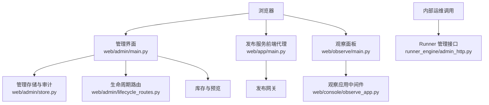
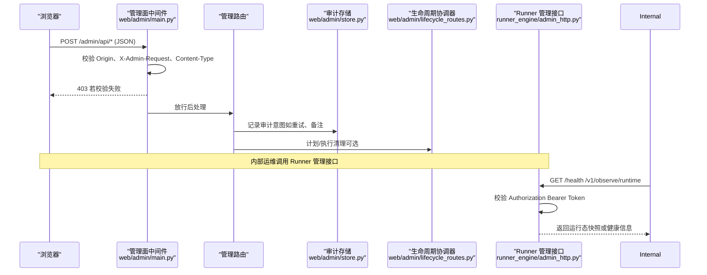
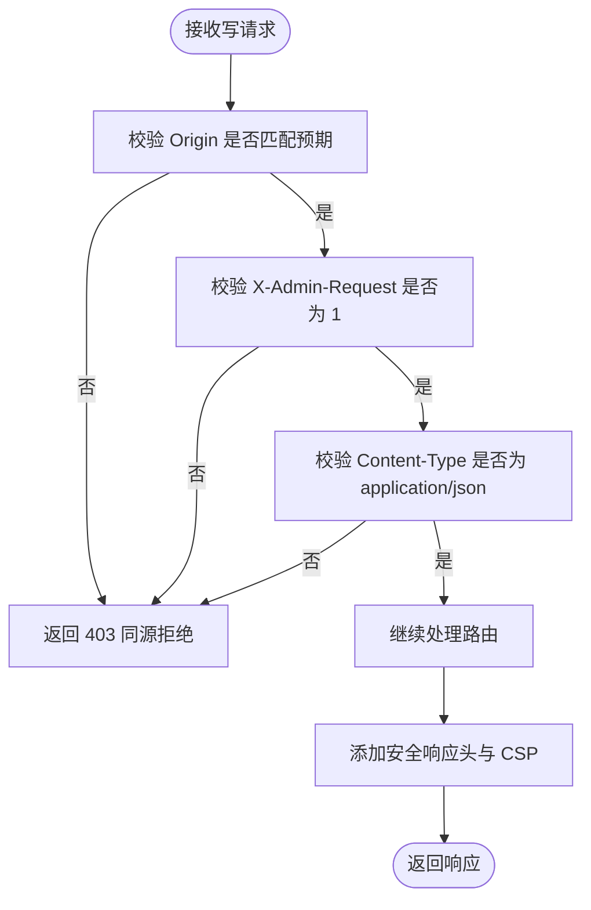
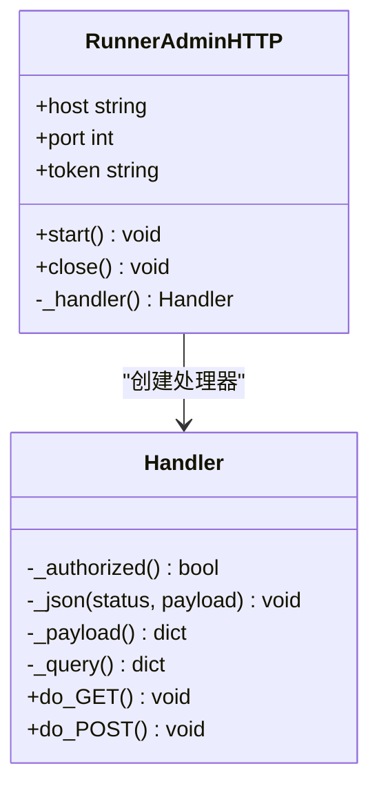
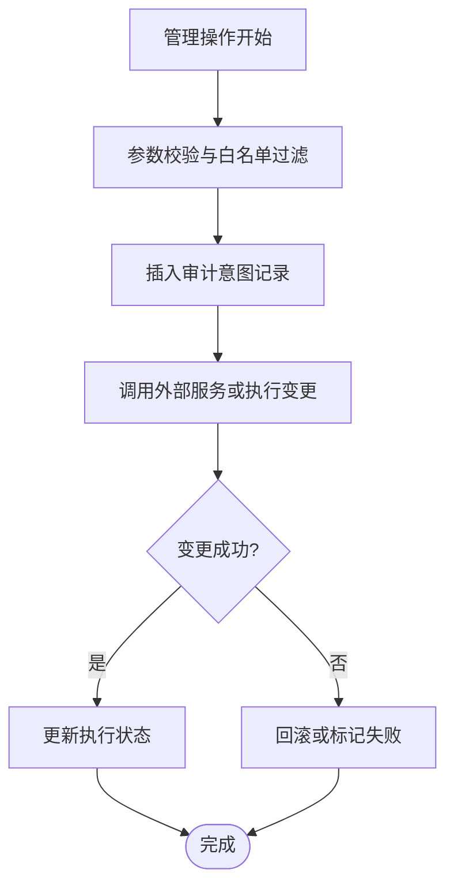
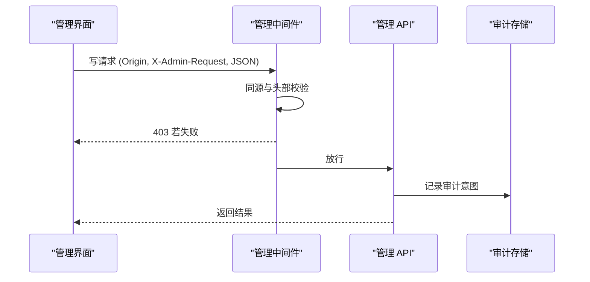
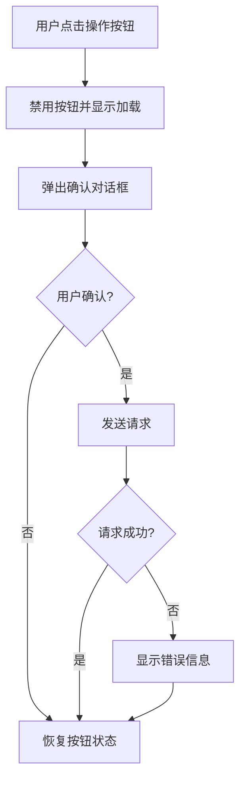
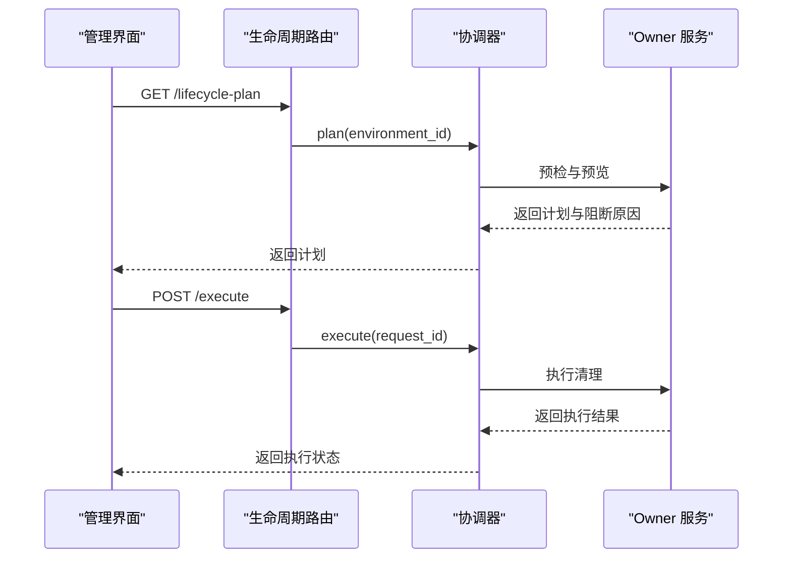
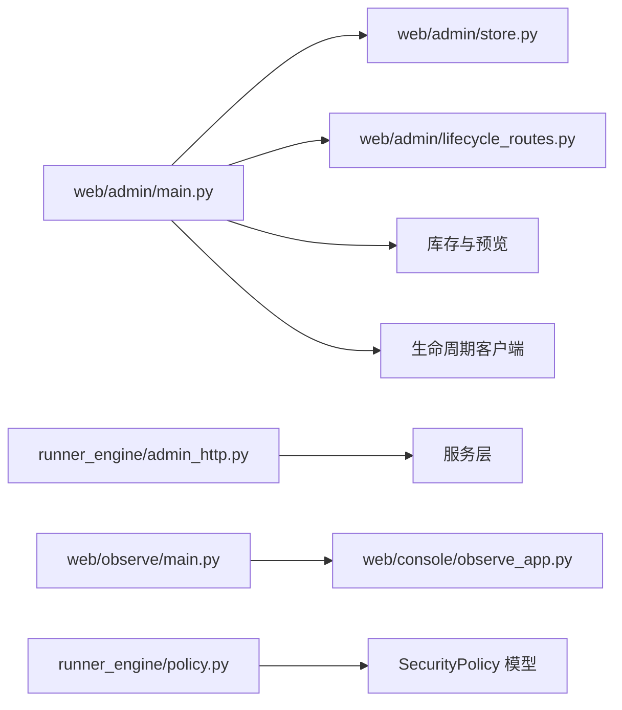

# 安全与审计

<cite>
**本文引用的文件**   
- [web/admin/main.py](file://web/admin/main.py)
- [web/admin/store.py](file://web/admin/store.py)
- [web/admin/lifecycle_routes.py](file://web/admin/lifecycle_routes.py)
- [runner_engine/admin_http.py](file://runner_engine/admin_http.py)
- [web/app/main.py](file://web/app/main.py)
- [config/acl.json](file://config/acl.json)
- [runner_engine/policy.py](file://runner_engine/policy.py)
- [web/observe/tests/test_sandbox.py](file://web/observe/tests/test_sandbox.py)
- [web/console/observe_app.py](file://web/console/observe_app.py)
- [web/observe/main.py](file://web/observe/main.py)
</cite>

## 目录
1. [引言](#引言)
2. [项目结构与安全边界](#项目结构与安全边界)
3. [核心安全组件](#核心安全组件)
4. [架构总览](#架构总览)
5. [详细组件分析](#详细组件分析)
6. [依赖关系分析](#依赖关系分析)
7. [性能与可用性考量](#性能与可用性考量)
8. [故障排查指南](#故障排查指南)
9. [安全配置与合规检查清单](#安全配置与合规检查清单)
10. [结论](#结论)

## 引言
本文件面向安全工程师、运维人员与平台开发者，系统性说明 Runner Engine 相关服务的安全防护机制、管理员认证授权流程、审计日志记录方式、敏感操作确认与防重复提交机制，并给出可执行的安全配置与合规性检查建议。文档重点覆盖：
- HTTP 中间件的同源策略、内容安全策略与 XSS 防护
- 管理员请求的认证与授权
- 审计日志的记录机制与操作追踪
- 敏感操作的确认流程与防重复提交
- 安全最佳实践与漏洞防护措施
- 安全配置与合规性检查指南

## 项目结构与安全边界
本项目包含多个 Web 应用与管理面：
- 统一控制台与观察面板：提供页面与 API 代理能力，并在部分路径设置基础安全响应头。
- 管理面：负责资产备注、清理申请、构建重试、生命周期计划与执行等管理功能，具备严格的中继同源校验与强 CSP。
- Runner 管理接口：面向内部服务的轻量 HTTP 接口，使用 Bearer Token 鉴权。
- 发布服务前端代理：将浏览器请求转发到后端发布服务，不直接执行业务逻辑。
- 策略与访问控制：加载运行时隔离策略；ACL 示例定义身份与租户资源映射。

**图示来源**
- [web/admin/main.py:72-104](file://web/admin/main.py#L72-L104)
- [web/app/main.py:43-81](file://web/app/main.py#L43-L81)
- [web/observe/main.py:97-100](file://web/observe/main.py#L97-L100)
- [web/console/observe_app.py:51-54](file://web/console/observe_app.py#L51-L54)
- [runner_engine/admin_http.py:14-40](file://runner_engine/admin_http.py#L14-L40)
- [web/admin/store.py:108-126](file://web/admin/store.py#L108-L126)
- [web/admin/lifecycle_routes.py:17-32](file://web/admin/lifecycle_routes.py#L17-L32)

**章节来源**
- [web/admin/main.py:1-70](file://web/admin/main.py#L1-L70)
- [web/app/main.py:1-25](file://web/app/main.py#L1-L25)
- [runner_engine/admin_http.py:1-25](file://runner_engine/admin_http.py#L1-L25)

## 核心安全组件
- 管理面 HTTP 中间件：强制同源 JSON 写入请求，设置缓存禁用、类型嗅探禁止、点击劫持保护、引用策略与严格内容安全策略。
- Runner 管理接口：基于固定 Bearer Token 的内部服务鉴权，限制请求体大小，返回结构化错误。
- 审计存储：对备注、清理申请、取消清理、构建重试等动作进行追加式审计记录，字段白名单化，避免持久化敏感数据。
- 生命周期协调器：在计划与执行前做能力检查与预检，失败时返回明确状态码与消息。
- 观察面板与统一控制台：设置基础安全响应头，测试用例验证 Basic Auth 与同源指标端点保护。
- 策略加载：从配置文件加载运行时隔离策略，包括 CPU、内存、超时、网络允许列表与沙箱复用开关。
- ACL 示例：定义身份、租户与资源映射，作为访问控制参考。

**章节来源**
- [web/admin/main.py:72-104](file://web/admin/main.py#L72-L104)
- [runner_engine/admin_http.py:35-66](file://runner_engine/admin_http.py#L35-L66)
- [web/admin/store.py:108-126](file://web/admin/store.py#L108-L126)
- [web/admin/lifecycle_routes.py:34-78](file://web/admin/lifecycle_routes.py#L34-L78)
- [web/observe/main.py:97-100](file://web/observe/main.py#L97-L100)
- [web/console/observe_app.py:51-54](file://web/console/observe_app.py#L51-L54)
- [runner_engine/policy.py:9-24](file://runner_engine/policy.py#L9-L24)
- [config/acl.json:1-9](file://config/acl.json#L1-L9)

## 架构总览
下图展示关键安全流程：浏览器发起管理请求时，先经过 FastAPI 中间件同源校验与 CSP 注入；随后进入具体路由，必要时调用审计存储或生命周期协调器；内部运维通过 Runner 管理接口以 Bearer Token 鉴权访问运行态信息。

**图示来源**
- [web/admin/main.py:72-104](file://web/admin/main.py#L72-L104)
- [web/admin/store.py:108-126](file://web/admin/store.py#L108-L126)
- [web/admin/lifecycle_routes.py:34-78](file://web/admin/lifecycle_routes.py#L34-L78)
- [runner_engine/admin_http.py:35-86](file://runner_engine/admin_http.py#L35-L86)

## 详细组件分析

### 管理面 HTTP 中间件：同源策略、CSP 与 XSS 防护
- 同源策略：对写操作（POST/PATCH/PUT/DELETE）强制要求请求头 `Origin` 等于预期来源，且必须携带自定义头 `x-admin-request=1`，同时 Content-Type 必须为 `application/json`。否则返回 403。
- 安全响应头：所有响应均设置 `Cache-Control=no-store`、`X-Content-Type-Options=nosniff`、`X-Frame-Options=DENY`、`Referrer-Policy=no-referrer`。
- 内容安全策略：默认仅允许同源脚本、样式、连接与图片，禁止 base-uri、object-src 与 frame-ancestors，有效降低 XSS 与点击劫持风险。
- 前端交互：管理界面在危险操作前弹出确认对话框，用户确认后才会触发后续请求，减少误操作。

**图示来源**
- [web/admin/main.py:72-104](file://web/admin/main.py#L72-L104)

**章节来源**
- [web/admin/main.py:72-104](file://web/admin/main.py#L72-L104)
- [web/admin/static/admin.js:224-236](file://web/admin/static/admin.js#L224-L236)

### Runner 管理接口：内部服务鉴权与输入限制
- 鉴权方式：要求 `Authorization: Bearer <token>`，使用恒定时间比较防止时序攻击。
- 输入限制：请求体最大 256KB，必须为 JSON 对象；查询参数解析后取最后一个值。
- 错误处理：未授权返回 401；参数缺失或非法返回 400；业务冲突返回 409；其他异常返回 500。
- 健康与运行态：提供 `/health` 与 `/v1/observe/runtime` 等只读接口，便于内部监控。

**图示来源**
- [runner_engine/admin_http.py:14-40](file://runner_engine/admin_http.py#L14-L40)
- [runner_engine/admin_http.py:58-105](file://runner_engine/admin_http.py#L58-L105)
- [runner_engine/admin_http.py:107-169](file://runner_engine/admin_http.py#L107-L169)

**章节来源**
- [runner_engine/admin_http.py:14-40](file://runner_engine/admin_http.py#L14-L40)
- [runner_engine/admin_http.py:58-105](file://runner_engine/admin_http.py#L58-L105)
- [runner_engine/admin_http.py:107-169](file://runner_engine/admin_http.py#L107-L169)

### 审计日志记录机制与操作追踪
- 审计表：`console_ops.audit_events` 记录 actor、action、resource_type、resource_id 与发生时间。
- 写入时机：在外部变更之前先记录“审计意图”，确保即使下游失败也可追溯。
- 字段白名单：清理申请仅保存已知安全字段，避免持久化 SQL、原始错误、凭据或 token。
- 版本控制：备注更新与删除采用乐观锁（version），并发修改会返回冲突。
- 概览接口：返回最近备注、清理申请与审计事件，供管理界面展示。

**图示来源**
- [web/admin/store.py:108-126](file://web/admin/store.py#L108-L126)
- [web/admin/store.py:298-358](file://web/admin/store.py#L298-L358)
- [web/admin/store.py:255-296](file://web/admin/store.py#L255-L296)

**章节来源**
- [web/admin/store.py:108-126](file://web/admin/store.py#L108-L126)
- [web/admin/store.py:298-358](file://web/admin/store.py#L298-L358)
- [web/admin/store.py:255-296](file://web/admin/store.py#L255-L296)

### 管理员请求认证与授权流程
- 管理面：通过同源策略与自定义请求头限制写操作来源，结合页面级确认弹窗实现二次确认。
- Runner 管理接口：通过 Bearer Token 鉴权，适合内部服务间调用。
- 观察面板：支持 Basic Auth，测试覆盖所有路径的认证拦截。
- ACL 示例：定义身份与租户资源映射，可作为访问控制的参考模型。

**图示来源**
- [web/admin/main.py:72-104](file://web/admin/main.py#L72-L104)
- [web/admin/store.py:108-126](file://web/admin/store.py#L108-L126)

**章节来源**
- [web/admin/main.py:72-104](file://web/admin/main.py#L72-L104)
- [web/observe/tests/test_app.py:68-93](file://web/observe/tests/test_app.py#L68-L93)
- [config/acl.json:1-9](file://config/acl.json#L1-L9)

### 敏感操作确认与防重复提交
- 确认流程：管理界面在危险操作前弹出确认对话框，用户显式确认后才会触发后续请求。
- 防重复提交：前端按钮在执行期间禁用并显示加载状态，全局进度条提示当前活动数量，避免重复提交。
- 后端幂等性：备注更新与删除使用乐观锁（version），并发修改返回冲突；清理申请状态机限制仅 DRAFT 可取消。

**图示来源**
- [web/admin/static/admin.js:224-236](file://web/admin/static/admin.js#L224-L236)
- [web/app/static/ui.js:90-107](file://web/app/static/ui.js#L90-L107)
- [web/admin/store.py:255-296](file://web/admin/store.py#L255-L296)

**章节来源**
- [web/admin/static/admin.js:224-236](file://web/admin/static/admin.js#L224-L236)
- [web/app/static/ui.js:90-107](file://web/app/static/ui.js#L90-L107)
- [web/admin/store.py:255-296](file://web/admin/store.py#L255-L296)

### 生命周期计划与执行的安全控制
- 能力检查：仅在 Build/Publish/Runner 生命周期端点可用时暴露计划与执行接口。
- 预检与预览：在执行前获取环境快照与阻断原因，确保管理员了解影响范围。
- 执行协调：协调器负责计划生成与执行，失败时返回明确的不可用或拒绝状态。

**图示来源**
- [web/admin/lifecycle_routes.py:34-78](file://web/admin/lifecycle_routes.py#L34-L78)

**章节来源**
- [web/admin/lifecycle_routes.py:34-78](file://web/admin/lifecycle_routes.py#L34-L78)

### 观察面板与统一控制台的安全头
- 观察面板中间件设置 `X-Content-Type-Options=nosniff`、`X-Frame-Options=DENY` 与 CSP，增强页面安全性。
- 测试用例验证 Basic Auth 对所有路径生效，包括静态资源。
- 指标端点同源保护：测试覆盖不允许非白名单来源访问指标端点，并校验 URL scheme、host 与凭据。

**章节来源**
- [web/observe/main.py:97-100](file://web/observe/main.py#L97-L100)
- [web/console/observe_app.py:51-54](file://web/console/observe_app.py#L51-L54)
- [web/observe/tests/test_app.py:68-93](file://web/observe/tests/test_app.py#L68-L93)
- [web/observe/tests/test_sandbox.py:112-151](file://web/observe/tests/test_sandbox.py#L112-L151)

### 运行时隔离策略与访问控制
- 策略加载：从配置文件读取运行时隔离策略，包括 CPU、内存、最大超时、网络允许列表与沙箱复用开关。
- ACL 示例：定义身份与租户资源映射，作为访问控制参考。

**章节来源**
- [runner_engine/policy.py:9-24](file://runner_engine/policy.py#L9-L24)
- [config/acl.json:1-9](file://config/acl.json#L1-L9)

## 依赖关系分析
- 管理面依赖库存与生命周期客户端，用于预览与执行清理；依赖审计存储记录操作意图。
- Runner 管理接口依赖服务层提供运行态快照与镜像退役流程。
- 观察面板与统一控制台依赖各自的应用中间件设置安全头。
- 策略模块依赖模型定义，将 JSON 配置转换为策略对象。

**图示来源**
- [web/admin/main.py:16-21](file://web/admin/main.py#L16-L21)
- [web/admin/lifecycle_routes.py:7-14](file://web/admin/lifecycle_routes.py#L7-L14)
- [runner_engine/admin_http.py:14-24](file://runner_engine/admin_http.py#L14-L24)
- [web/observe/main.py:97-100](file://web/observe/main.py#L97-L100)
- [web/console/observe_app.py:51-54](file://web/console/observe_app.py#L51-L54)
- [runner_engine/policy.py:9-24](file://runner_engine/policy.py#L9-L24)

**章节来源**
- [web/admin/main.py:16-21](file://web/admin/main.py#L16-L21)
- [web/admin/lifecycle_routes.py:7-14](file://web/admin/lifecycle_routes.py#L7-L14)
- [runner_engine/admin_http.py:14-24](file://runner_engine/admin_http.py#L14-L24)
- [web/observe/main.py:97-100](file://web/observe/main.py#L97-L100)
- [web/console/observe_app.py:51-54](file://web/console/observe_app.py#L51-L54)
- [runner_engine/policy.py:9-24](file://runner_engine/policy.py#L9-L24)

## 性能与可用性考量
- Runner 管理接口：线程化 HTTP 服务器，限制请求体大小，避免大负载阻塞；健康检查快速返回。
- 管理面：异步调用库存与存储，避免阻塞事件循环；数据库连接短超时，快速失败。
- 审计存储：事务内写入审计意图，失败时回滚，保证一致性；概览接口限制返回行数，避免大数据量拖慢页面。
- 生命周期协调器：失败时返回明确状态码，便于前端降级与重试。

[本节为通用指导，无需特定文件引用]

## 故障排查指南
- 403 同源拒绝：检查请求头 `Origin`、`X-Admin-Request` 与 `Content-Type` 是否符合管理中间件要求。
- 401 未授权：Runner 管理接口需携带正确的 `Authorization: Bearer <token>`。
- 409 冲突：备注更新或删除时 version 不匹配；清理申请不在 DRAFT 状态。
- 503 服务不可用：生命周期端点未配置或数据库连接失败；检查 ADMIN_DB_URL 与 console_ops 权限。
- 审计记录缺失：确认是否在外部变更前调用审计写入；检查数据库连接与 schema 初始化。

**章节来源**
- [web/admin/main.py:72-104](file://web/admin/main.py#L72-L104)
- [runner_engine/admin_http.py:35-86](file://runner_engine/admin_http.py#L35-L86)
- [web/admin/store.py:108-126](file://web/admin/store.py#L108-L126)
- [web/admin/lifecycle_routes.py:34-78](file://web/admin/lifecycle_routes.py#L34-L78)

## 安全配置与合规检查清单
- 同源策略
  - 管理面写请求必须携带 `Origin`、`X-Admin-Request=1` 与 `Content-Type: application/json`。
  - 观察面板指标端点仅允许白名单来源。
- 内容安全策略
  - 管理面与观察面板设置 CSP，限制脚本、样式、连接与图片来源，禁止 base-uri、object-src 与 frame-ancestors。
- 点击劫持防护
  - 设置 `X-Frame-Options=DENY`。
- 类型嗅探防护
  - 设置 `X-Content-Type-Options=nosniff`。
- 引用策略
  - 设置 `Referrer-Policy=no-referrer`。
- 缓存控制
  - 管理面响应设置 `Cache-Control=no-store`。
- 内部服务鉴权
  - Runner 管理接口启用 Bearer Token，使用恒定时间比较。
- 审计与合规
  - 所有敏感操作记录审计意图；清理申请仅保存白名单字段；备注更新与删除使用乐观锁。
- 策略与访问控制
  - 加载运行时隔离策略；ACL 示例作为访问控制参考。

**章节来源**
- [web/admin/main.py:72-104](file://web/admin/main.py#L72-L104)
- [web/observe/main.py:97-100](file://web/observe/main.py#L97-L100)
- [web/console/observe_app.py:51-54](file://web/console/observe_app.py#L51-L54)
- [runner_engine/admin_http.py:35-40](file://runner_engine/admin_http.py#L35-L40)
- [web/admin/store.py:108-126](file://web/admin/store.py#L108-L126)
- [runner_engine/policy.py:9-24](file://runner_engine/policy.py#L9-L24)
- [config/acl.json:1-9](file://config/acl.json#L1-L9)

## 结论
该代码库在管理面与观察面板层面实现了严格的同源策略、内容安全策略与 XSS 防护；Runner 管理接口通过 Bearer Token 提供安全的内部服务访问；审计存储确保敏感操作的意图可追溯，并通过字段白名单与乐观锁提升一致性与安全性。配合生命周期协调器的能力检查与预检机制，系统在易用性与安全性之间取得平衡。建议在生产环境中严格配置同源白名单、CSP、Basic Auth 与审计数据库权限，并定期审查 ACL 与策略配置，以确保符合安全与合规要求。