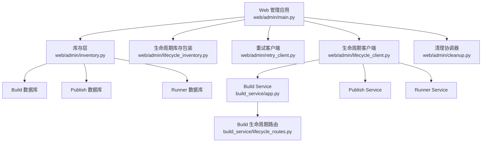
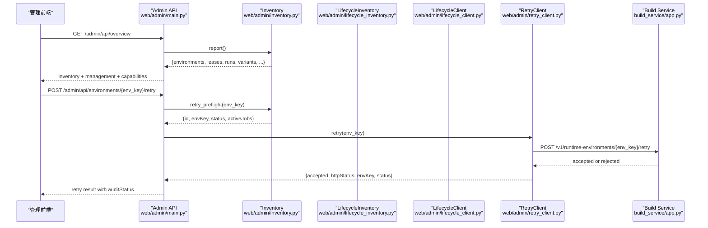
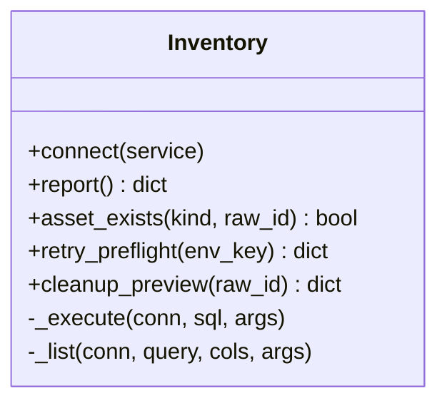
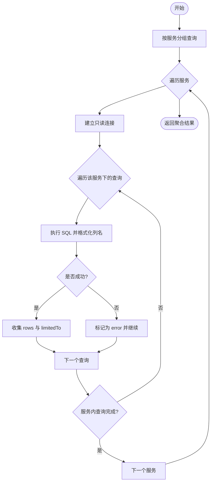
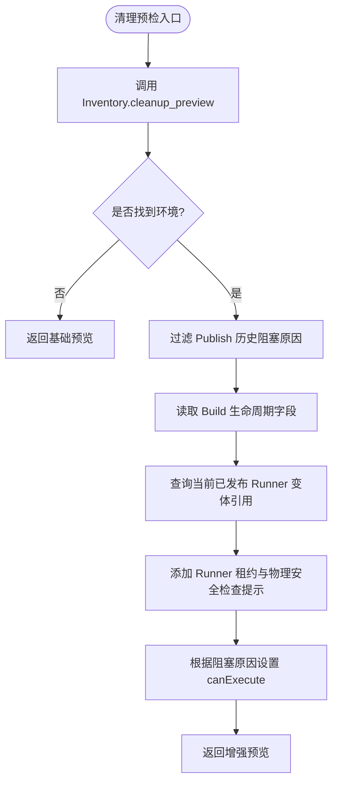
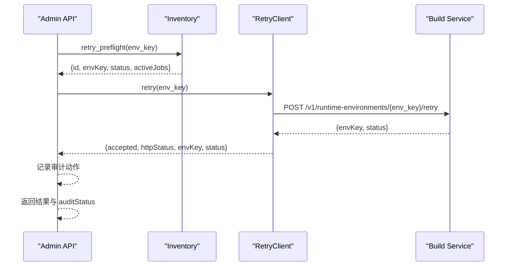
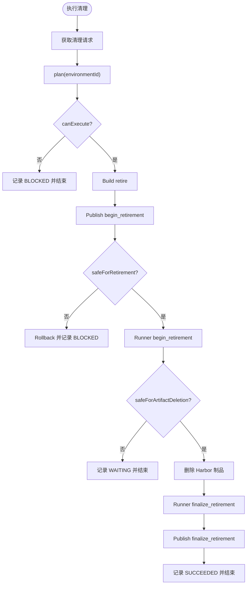
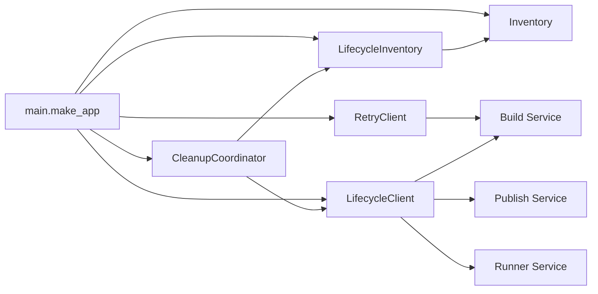
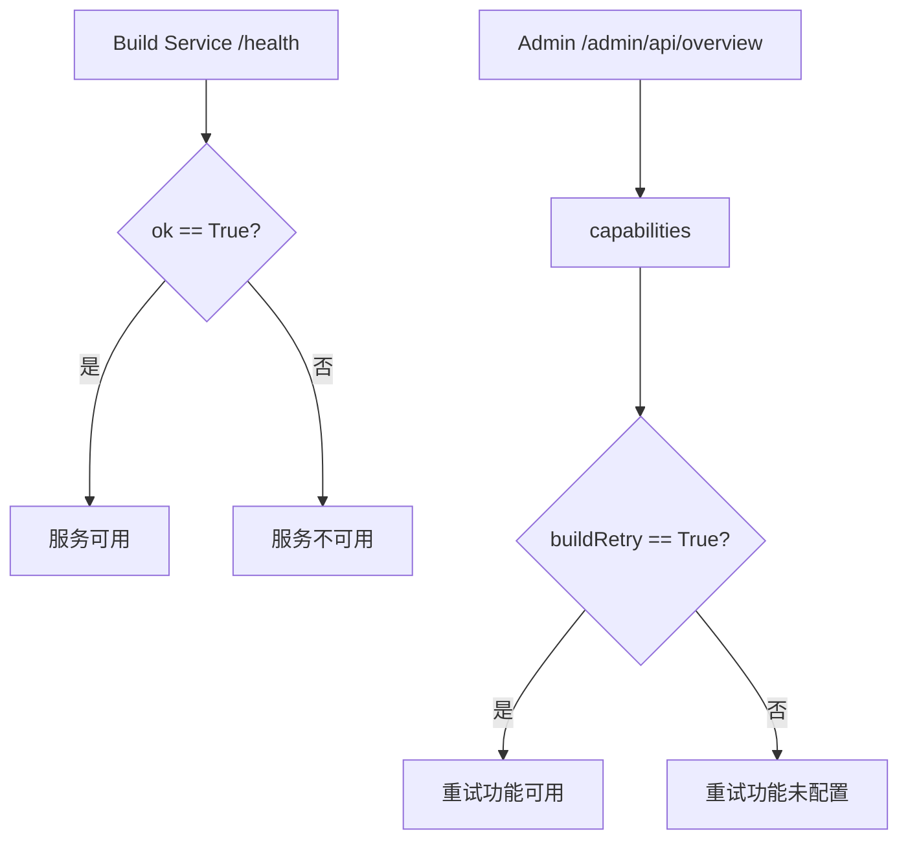

# 库存管理

<cite>
**本文引用的文件**   
- [inventory.py](file://web/admin/inventory.py)
- [lifecycle_inventory.py](file://web/admin/lifecycle_inventory.py)
- [main.py](file://web/admin/main.py)
- [retry_client.py](file://web/admin/retry_client.py)
- [lifecycle_client.py](file://web/admin/lifecycle_client.py)
- [cleanup.py](file://web/admin/cleanup.py)
- [app.py](file://build_service/app.py)
- [lifecycle_routes.py](file://build_service/lifecycle_routes.py)
</cite>

## 目录
1. [简介](#简介)
2. [项目结构](#项目结构)
3. [核心组件](#核心组件)
4. [架构总览](#架构总览)
5. [详细组件分析](#详细组件分析)
6. [依赖关系分析](#依赖关系分析)
7. [性能与可扩展性](#性能与可扩展性)
8. [健康检查与监控指标](#健康检查与监控指标)
9. [故障排查指南](#故障排查指南)
10. [结论](#结论)
11. [附录：扩展与自定义适配器指南](#附录扩展与自定义适配器指南)

## 简介
本仓库中的“库存管理”模块位于 Web 管理端，提供跨 Build、Publish、Runner 三个服务的只读库存视图、清理预检、构建重试前置校验以及生命周期协调入口。其核心是 Inventory 类，负责资产发现、状态查询和依赖关系分析；并配合 LifecycleInventory、LifecycleClient、RetryClient 等组件完成与构建服务及生命周期系统的集成。

该模块不直接写入业务数据库，而是通过只读连接读取各服务表，并通过受控的 HTTP 接口调用拥有方服务（Build/Publish/Runner）的生命周期 API，确保资源变更具备一致性与可审计性。

## 项目结构
库存相关代码主要分布在 web/admin 目录下，并与 build_service 的生命周期路由形成协作关系：

**图表来源**
- [main.py:47-70](file://web/admin/main.py#L47-L70)
- [inventory.py:26-53](file://web/admin/inventory.py#L26-L53)
- [lifecycle_inventory.py:8-14](file://web/admin/lifecycle_inventory.py#L8-L14)
- [retry_client.py:23-37](file://web/admin/retry_client.py#L23-L37)
- [lifecycle_client.py:32-65](file://web/admin/lifecycle_client.py#L32-L65)
- [cleanup.py:13-18](file://web/admin/cleanup.py#L13-L18)
- [app.py:120-181](file://build_service/app.py#L120-L181)
- [lifecycle_routes.py:34-46](file://build_service/lifecycle_routes.py#L34-L46)

**章节来源**
- [main.py:1-70](file://web/admin/main.py#L1-L70)
- [inventory.py:1-53](file://web/admin/inventory.py#L1-L53)

## 核心组件
- Inventory：跨服务只读库存聚合、资产存在性校验、清理预检、构建重试前置校验。
- LifecycleInventory：在 Inventory 基础上增强生命周期感知，过滤阻塞原因并补充当前发布引用信息。
- RetryClient：可选地调用 Build Service 的 /v1/runtime-environments/{env_key}/retry 接口。
- LifecycleClient：封装对 Build/Publish/Runner 生命周期接口的统一访问。
- CleanupCoordinator：编排清理计划与执行，协调多服务生命周期门控。
- main.make_app：暴露管理端 API，组合上述组件并提供能力探测。

**章节来源**
- [inventory.py:26-336](file://web/admin/inventory.py#L26-L336)
- [lifecycle_inventory.py:8-147](file://web/admin/lifecycle_inventory.py#L8-L147)
- [retry_client.py:23-71](file://web/admin/retry_client.py#L23-L71)
- [lifecycle_client.py:32-215](file://web/admin/lifecycle_client.py#L32-L215)
- [cleanup.py:13-334](file://web/admin/cleanup.py#L13-L334)
- [main.py:47-337](file://web/admin/main.py#L47-L337)

## 架构总览
库存管理采用“只读数据聚合 + 受控生命周期编排”的双层设计：

- 只读层：Inventory 通过 psycopg 或测试注入的连接对象，按服务维度分组执行 SQL，返回结构化行数据。
- 编排层：LifecycleInventory 与 LifecycleClient/CleanupCoordinator 共同完成清理计划、门控检查、回滚与最终化。
- 外部集成：RetryClient 仅作为可选通道调用 Build Service 的权威重试接口；LifecycleClient 统一访问 Build/Publish/Runner 生命周期 API。

**图表来源**
- [main.py:120-162](file://web/admin/main.py#L120-L162)
- [main.py:178-233](file://web/admin/main.py#L178-L233)
- [inventory.py:55-147](file://web/admin/inventory.py#L55-L147)
- [inventory.py:175-204](file://web/admin/inventory.py#L175-L204)
- [retry_client.py:39-71](file://web/admin/retry_client.py#L39-L71)
- [app.py:161-179](file://build_service/app.py#L161-L179)

## 详细组件分析

### Inventory：资产发现、状态查询与依赖分析
Inventory 是库存管理的核心。它提供以下关键能力：

- 连接管理：支持通过 DSN 直连或使用测试注入的连接工厂；强制只读事务与语句超时。
- 报告生成：按服务维度聚合 environments、buildJobs、leases、runs、idempotency、variants、publishJobs 等视图。
- 资产存在性校验：校验 UUID 并在对应服务表中确认记录存在。
- 构建重试预检：校验 env_key 合法性、环境状态为 FAILED 且无活跃构建任务。
- 清理预检：扫描 Build/Publish/Runner 三库，汇总别名、活跃构建、发布引用、租约引用、阻塞原因与警告。

**图表来源**
- [inventory.py:26-53](file://web/admin/inventory.py#L26-L53)
- [inventory.py:55-147](file://web/admin/inventory.py#L55-L147)
- [inventory.py:149-173](file://web/admin/inventory.py#L149-L173)
- [inventory.py:175-204](file://web/admin/inventory.py#L175-L204)
- [inventory.py:206-336](file://web/admin/inventory.py#L206-L336)

#### 报告生成逻辑与数据聚合机制
- 将查询映射按服务分组，逐服务建立连接并批量执行。
- 每个子项返回 status、rows、limitedTo；单条查询失败不影响同服务其他查询。
- 若服务不可用，则将该服务下所有子项标记为 unconfigured 或 error。

**图表来源**
- [inventory.py:55-147](file://web/admin/inventory.py#L55-L147)

**章节来源**
- [inventory.py:26-147](file://web/admin/inventory.py#L26-L147)

### LifecycleInventory：生命周期感知的清理预检
LifecycleInventory 包装 Inventory.cleanup_preview，做如下增强：

- 过滤掉与 Publish 相关的历史阻塞原因，聚焦当前已发布的 Runner 变体引用。
- 从 Build 表读取 lifecycle_state、cleanup_error、retired_at 字段，补充环境生命周期上下文。
- 查询 publish.backend_variants 与 virtual_contract_versions，定位当前已发布且引用该运行时的变体。
- 根据是否存在阻塞原因设置 canExecute，并将 action 设置为 owner_lifecycle。

**图表来源**
- [lifecycle_inventory.py:12-147](file://web/admin/lifecycle_inventory.py#L12-L147)

**章节来源**
- [lifecycle_inventory.py:8-147](file://web/admin/lifecycle_inventory.py#L8-L147)

### 重试预检与构建服务集成
重试流程由 Admin API 驱动，先进行本地预检，再调用 Build Service 的权威重试接口：

- Admin API 检查 RetryClient.enabled。
- 调用 Inventory.retry_preflight 校验 env_key 与环境状态。
- 记录审计动作后，通过 RetryClient 调用 Build Service 的 /v1/runtime-environments/{env_key}/retry。
- Build Service 返回接受或拒绝结果，Admin API 将结果与审计状态一并返回。

**图表来源**
- [main.py:178-233](file://web/admin/main.py#L178-L233)
- [inventory.py:175-204](file://web/admin/inventory.py#L175-L204)
- [retry_client.py:39-71](file://web/admin/retry_client.py#L39-L71)
- [app.py:161-179](file://build_service/app.py#L161-L179)

**章节来源**
- [main.py:178-233](file://web/admin/main.py#L178-L233)
- [inventory.py:175-204](file://web/admin/inventory.py#L175-L204)
- [retry_client.py:23-71](file://web/admin/retry_client.py#L23-L71)
- [app.py:161-179](file://build_service/app.py#L161-L179)

### 清理计划与执行协调
CleanupCoordinator 基于 LifecycleInventory 与 LifecycleClient 编排清理流程：

- plan：合并 Inventory 预览与 Build/Publish/Runner 生命周期状态，计算 canExecute 与 blockingReasons。
- execute：依次调用 Build retire、Publish retire、Runner retire，并根据门控结果决定 WAITING、BLOCKED 或 SUCCEEDED。
- 回滚：在失败时尝试取消各服务的退订操作，记录回滚结果。

**图表来源**
- [cleanup.py:20-50](file://web/admin/cleanup.py#L20-L50)
- [cleanup.py:52-298](file://web/admin/cleanup.py#L52-L298)
- [cleanup.py:300-333](file://web/admin/cleanup.py#L300-L333)

**章节来源**
- [cleanup.py:13-334](file://web/admin/cleanup.py#L13-L334)

## 依赖关系分析
Inventory 与上层组件的关系如下：

- main.make_app 装配 Inventory、LifecycleInventory、RetryClient、LifecycleClient、CleanupCoordinator。
- Inventory 依赖 console.sql_schemas 提供的 schema 渲染与配置。
- LifecycleInventory 依赖 Inventory 的基础预检能力。
- LifecycleClient 依赖环境变量配置的 Build/Publish/Runner 生命周期端点。
- RetryClient 依赖 ADMIN_BUILD_SERVICE_URL 与可选 token。

**图表来源**
- [main.py:47-70](file://web/admin/main.py#L47-L70)
- [lifecycle_inventory.py:8-14](file://web/admin/lifecycle_inventory.py#L8-L14)
- [cleanup.py:13-18](file://web/admin/cleanup.py#L13-L18)
- [lifecycle_client.py:32-65](file://web/admin/lifecycle_client.py#L32-L65)
- [retry_client.py:23-37](file://web/admin/retry_client.py#L23-L37)

**章节来源**
- [main.py:47-70](file://web/admin/main.py#L47-L70)
- [lifecycle_inventory.py:8-14](file://web/admin/lifecycle_inventory.py#L8-L14)
- [cleanup.py:13-18](file://web/admin/cleanup.py#L13-L18)
- [lifecycle_client.py:32-65](file://web/admin/lifecycle_client.py#L32-L65)
- [retry_client.py:23-37](file://web/admin/retry_client.py#L23-L37)

## 性能与可扩展性
- 连接与超时：Inventory.connect 使用 autocommit=True、connect_timeout=3、statement_timeout=5000，避免长事务与慢查询影响管理端响应。
- 查询限制：environments 限制 100 行，其余列表限制 70 行，降低前端渲染压力。
- 并发：overview 接口并行拉取 inventory 与 metadata，提升页面加载效率。
- 可扩展点：
  - 新增库存视图：在 Inventory.report 的 query_map 中增加条目，定义 service、SQL 与列映射。
  - 新增资产类型：在 asset_exists 的定义字典中添加新的 kind 与服务表映射。
  - 自定义连接：通过 connections 参数注入连接工厂，便于测试或代理连接。

[本节为通用指导，不直接分析具体文件]

## 健康检查与监控指标
- Build Service 健康检查：/health 返回 ok、version、runtimeLifecycle、adminLifecycleConfigured、harborLifecycleConfigured。
- 管理端能力探测：/admin/api/overview 返回 capabilities，包含 coreDatabaseWrites、physicalImageDeletion、annotationsCrud、cleanupExecute、buildRetry。
- 生命周期能力探测：/admin/api/lifecycle-capabilities 返回 enabled 与各子服务 enabled 状态。

**图表来源**
- [app.py:128-138](file://build_service/app.py#L128-L138)
- [main.py:120-162](file://web/admin/main.py#L120-L162)
- [lifecycle_routes.py:34-42](file://web/admin/lifecycle_routes.py#L34-L42)

**章节来源**
- [app.py:128-138](file://build_service/app.py#L128-L138)
- [main.py:120-162](file://web/admin/main.py#L120-L162)
- [lifecycle_routes.py:34-42](file://web/admin/lifecycle_routes.py#L34-L42)

## 故障排查指南
- 库存查询失败：
  - 现象：某子项 status 为 error，message 提示检查 schema 与 SELECT 授权。
  - 处理：确认 console.sql_schemas 配置正确，目标服务数据库可读。
- 服务不可用：
  - 现象：某服务下所有子项 status 为 unconfigured 或 error，message 提示数据库未配置或不可用。
  - 处理：检查 Inventory.urls 或 connections 配置，确认 DSN 可达。
- 资产不存在：
  - 现象：asset_exists 抛出 ValueError 或返回 False。
  - 处理：确认资产 ID 为有效 UUID，且属于对应服务表。
- 重试被拒绝：
  - 现象：RetryRejected 携带非 2xx 状态码。
  - 处理：查看 Build Service 日志，确认 env_key 合法且环境处于可重试状态。
- 清理被阻塞：
  - 现象：plan.canExecute 为 False，blockingReasons 包含活跃构建、发布引用或租约引用。
  - 处理：等待活跃工作结束，或通过生命周期 API 取消退订并重新执行。

**章节来源**
- [inventory.py:121-147](file://web/admin/inventory.py#L121-L147)
- [inventory.py:149-173](file://web/admin/inventory.py#L149-L173)
- [retry_client.py:57-71](file://web/admin/retry_client.py#L57-L71)
- [cleanup.py:20-50](file://web/admin/cleanup.py#L20-L50)

## 结论
库存管理模块以 Inventory 为核心，提供跨服务的只读库存视图与清理预检，并通过 LifecycleInventory、LifecycleClient、RetryClient 与 CleanupCoordinator 实现安全的生命周期编排。该设计强调只读数据聚合与受控变更，确保资源清理与重试操作具备一致性、可审计性与可回滚性。

[本节为总结性内容，不直接分析具体文件]

## 附录：扩展与自定义适配器指南

### 新增库存视图
- 在 Inventory.report 的 query_map 中新增条目，指定 service、SQL 与列映射。
- 注意 LIMIT 与列顺序，确保 _list 能正确映射为字典。

**章节来源**
- [inventory.py:55-117](file://web/admin/inventory.py#L55-L117)

### 新增资产类型
- 在 asset_exists 的定义字典中添加新的 kind 与服务表映射。
- 保持 UUID 校验逻辑不变。

**章节来源**
- [inventory.py:149-173](file://web/admin/inventory.py#L149-L173)

### 自定义连接适配器
- 通过 connections 参数传入服务名到连接工厂的映射，用于测试或代理连接。
- 连接工厂需支持上下文管理器协议，并返回具有 execute 方法的连接对象。

**章节来源**
- [inventory.py:27-46](file://web/admin/inventory.py#L27-L46)

### 扩展生命周期能力
- 在 LifecycleClient 中新增 OwnerEndpoint 与方法，封装新的生命周期 API。
- 在 CleanupCoordinator 中扩展 plan/execute 逻辑，适配新门控。

**章节来源**
- [lifecycle_client.py:32-215](file://web/admin/lifecycle_client.py#L32-L215)
- [cleanup.py:20-50](file://web/admin/cleanup.py#L20-L50)