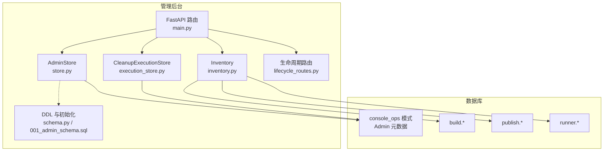
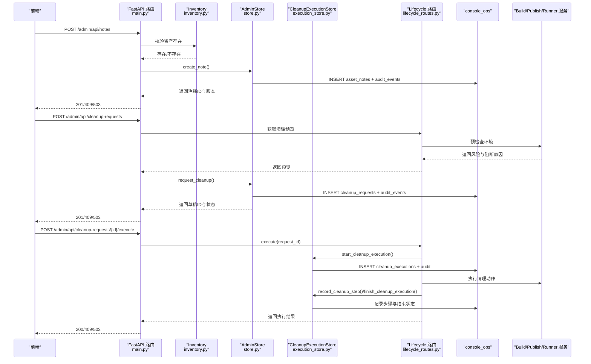
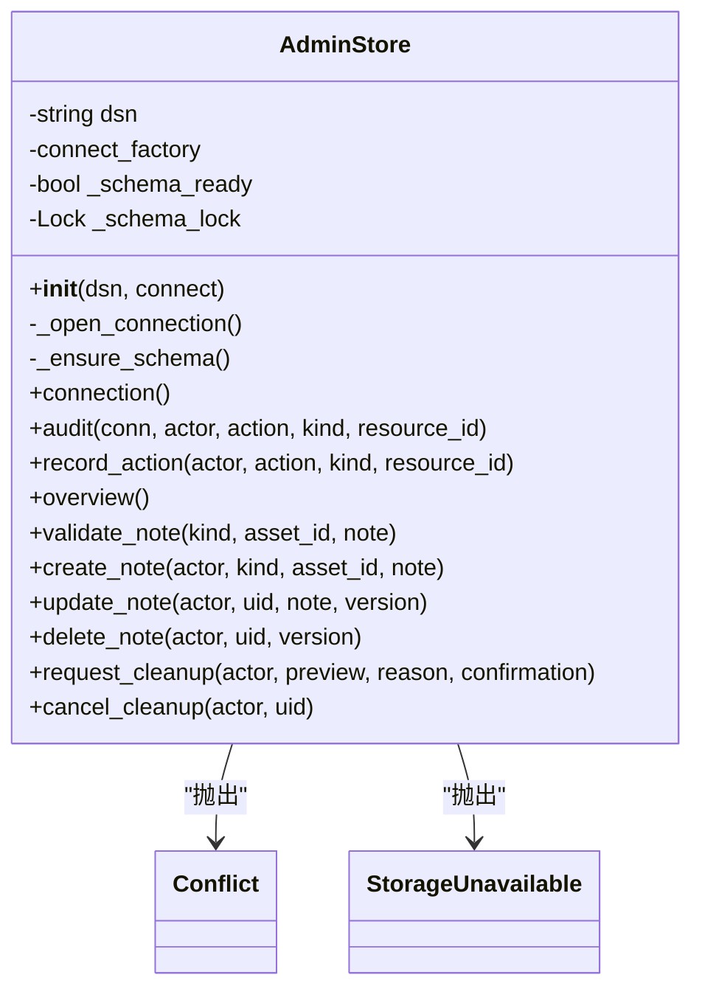
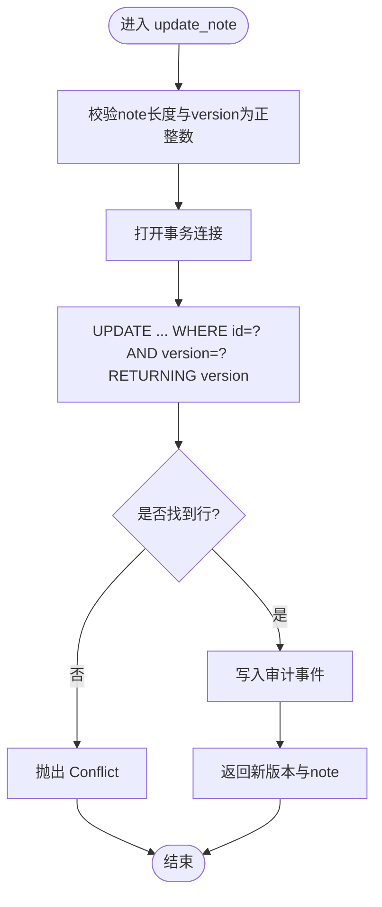
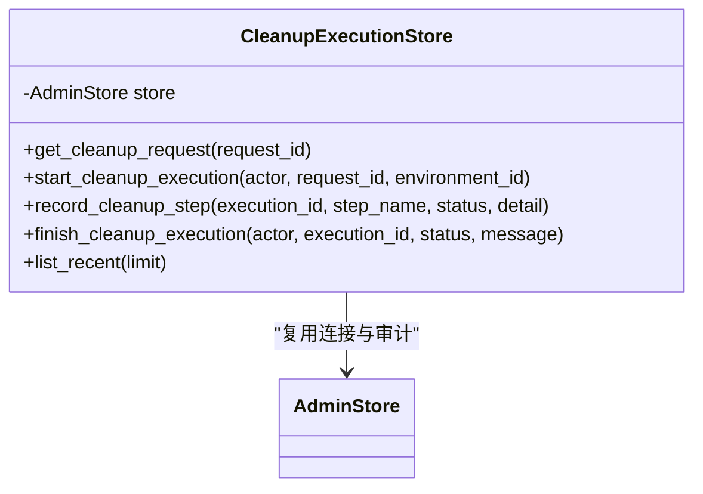
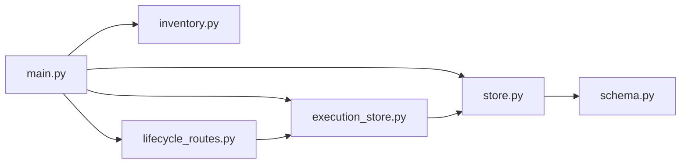
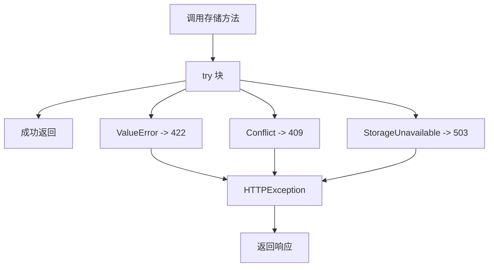

# 数据存储层

<cite>
**本文引用的文件**   
- [store.py](file://web/admin/store.py)
- [schema.py](file://web/admin/schema.py)
- [001_admin_schema.sql](file://web/admin/sql/001_admin_schema.sql)
- [execution_store.py](file://web/admin/execution_store.py)
- [inventory.py](file://web/admin/inventory.py)
- [main.py](file://web/admin/main.py)
- [lifecycle_routes.py](file://web/admin/lifecycle_routes.py)
</cite>

## 目录
1. [简介](#简介)
2. [项目结构](#项目结构)
3. [核心组件](#核心组件)
4. [架构总览](#架构总览)
5. [详细组件分析](#详细组件分析)
6. [依赖关系分析](#依赖关系分析)
7. [性能与连接配置](#性能与连接配置)
8. [异常处理策略](#异常处理策略)
9. [数据备份与恢复最佳实践](#数据备份与恢复最佳实践)
10. [故障排查指南](#故障排查指南)
11. [结论](#结论)

## 简介
本文件面向管理后台的数据存储层，重点说明 AdminStore 类的实现、数据库连接管理、事务处理、错误处理机制，以及资产注释的增删改查接口。同时记录清理请求与执行记录的存储模型、冲突检测与版本控制机制，并给出数据库连接配置建议、性能优化和备份恢复实践。

该存储层仅对 console_ops 模式下的元数据进行读写，不直接修改 build、publish、runner 等服务的业务表；跨服务操作通过生命周期客户端协调完成。

## 项目结构
管理后台相关代码位于 web/admin 目录，其中：
- store.py：AdminStore 类，负责 console_ops 元数据的 CRUD、审计事件写入、连接与事务管理。
- schema.py：console_ops 模式的 DDL 语句集合及 ensure_admin_schema 初始化函数。
- sql/001_admin_schema.sql：独立迁移脚本，用于在数据库中创建 console_ops 模式与表。
- execution_store.py：CleanupExecutionStore，负责清理请求的执行记录与步骤日志。
- inventory.py：Inventory，提供只读库存查询与清理预检查（preflight）。
- main.py：FastAPI 应用入口，装配路由、安全中间件，并将领域异常映射为 HTTP 状态码。
- lifecycle_routes.py：安装生命周期相关路由，编排清理计划与执行流程。

**图表来源**
- [main.py:47-338](file://web/admin/main.py#L47-L338)
- [store.py:42-382](file://web/admin/store.py#L42-L382)
- [execution_store.py:9-153](file://web/admin/execution_store.py#L9-L153)
- [inventory.py:26-337](file://web/admin/inventory.py#L26-L337)
- [schema.py:5-122](file://web/admin/schema.py#L5-L122)
- [001_admin_schema.sql:1-52](file://web/admin/sql/001_admin_schema.sql#L1-L52)

**章节来源**
- [main.py:1-338](file://web/admin/main.py#L1-L338)
- [store.py:1-382](file://web/admin/store.py#L1-L382)
- [execution_store.py:1-153](file://web/admin/execution_store.py#L1-L153)
- [inventory.py:1-337](file://web/admin/inventory.py#L1-L337)
- [schema.py:1-122](file://web/admin/schema.py#L1-L122)
- [001_admin_schema.sql:1-52](file://web/admin/sql/001_admin_schema.sql#L1-L52)

## 核心组件
- AdminStore：封装 console_ops 数据库连接、事务、审计事件、资产注释 CRUD、清理草稿与取消。
- CleanupExecutionStore：封装清理执行的开始、步骤记录、结束与最近执行列表。
- Inventory：跨 build/publish/runner 的只读库存查询与清理预检查。
- Lifecycle 路由：暴露生命周期能力、清理计划与执行接口，协调外部服务。

关键职责边界：
- AdminStore 仅写 console_ops，不写业务库。
- Inventory 仅读业务库，不写业务库。
- 生命周期路由通过 LifecycleClient 调用外部服务，完成真正的资源清理。

**章节来源**
- [store.py:42-382](file://web/admin/store.py#L42-L382)
- [execution_store.py:9-153](file://web/admin/execution_store.py#L9-L153)
- [inventory.py:26-337](file://web/admin/inventory.py#L26-L337)
- [lifecycle_routes.py:17-94](file://web/admin/lifecycle_routes.py#L17-L94)

## 架构总览
管理后台的数据流分为三条主线：
1. 资产管理：前端通过 REST 接口创建、更新、删除资产注释，后端校验资产存在性后落盘到 console_ops.asset_notes，并写入审计事件。
2. 清理草稿：前端提交清理原因与确认信息，后端进行预检查，保存清理请求快照到 console_ops.cleanup_requests。
3. 清理执行：通过生命周期路由触发清理计划与执行，执行过程记录到 console_ops.cleanup_executions 与 cleanup_execution_steps。

**图表来源**
- [main.py:235-330](file://web/admin/main.py#L235-L330)
- [store.py:230-382](file://web/admin/store.py#L230-L382)
- [execution_store.py:42-153](file://web/admin/execution_store.py#L42-L153)
- [lifecycle_routes.py:61-94](file://web/admin/lifecycle_routes.py#L61-L94)

## 详细组件分析

### AdminStore：连接、事务与资产注释CRUD
AdminStore 是管理后台的核心存储抽象，负责：
- 数据库连接管理：支持传入 connect_factory 或基于 ADMIN_DB_URL 自动连接。
- 模式初始化：启动时确保 console_ops 模式与表存在。
- 事务管理：使用 psycopg 上下文管理器保证失败回滚。
- 审计事件：所有变更均追加审计记录。
- 资产注释CRUD：create_note、update_note、delete_note，带版本控制与冲突检测。
- 清理草稿：request_cleanup、cancel_cleanup。

**图表来源**
- [store.py:23-382](file://web/admin/store.py#L23-L382)

#### 数据库连接与事务
- 连接工厂优先：若注入 connect_factory，则使用该工厂创建连接。
- 自动连接：未注入工厂且配置了 dsn，则使用 psycopg.connect 建立连接，超时时间较短。
- 模式初始化：首次使用时确保 console_ops 已创建，避免半工作态。
- 事务语义：connection() 返回的连接上下文会在异常时自动回滚，保证一致性。

**章节来源**
- [store.py:42-107](file://web/admin/store.py#L42-L107)

#### 资产注释CRUD与版本控制
- create_note：插入 asset_notes，使用 ON CONFLICT DO NOTHING 防止重复键冲突；若冲突则抛出 Conflict。
- update_note：按 id 与 version 乐观锁更新，version+1；无匹配行则抛出 Conflict。
- delete_note：按 id 与 version 乐观锁删除；无匹配行则抛出 Conflict。
- 审计：每次成功变更都追加审计事件。

**图表来源**
- [store.py:255-276](file://web/admin/store.py#L255-L276)

**章节来源**
- [store.py:220-296](file://web/admin/store.py#L220-L296)

#### 清理草稿与取消
- request_cleanup：校验环境与原因，裁剪安全字段后持久化 preflight_snapshot，状态为 DRAFT。
- cancel_cleanup：仅允许从 DRAFT 转为 CANCELLED，否则抛出 Conflict。

**章节来源**
- [store.py:298-382](file://web/admin/store.py#L298-L382)

### CleanupExecutionStore：清理执行记录
CleanupExecutionStore 围绕 console_ops.cleanup_executions 与 cleanup_execution_steps 表，提供：
- 查询清理请求详情。
- 开始执行：生成 execution_id，记录 RUNNING 状态。
- 记录步骤：step_name 截断，detail_json 规范化为 JSONB。
- 结束执行：根据终态设置 finished_at，并追加审计。
- 最近执行列表：限制上限，按 started_at 倒序。

**图表来源**
- [execution_store.py:9-153](file://web/admin/execution_store.py#L9-L153)

**章节来源**
- [execution_store.py:9-153](file://web/admin/execution_store.py#L9-L153)

### Inventory：只读库存与清理预检查
Inventory 负责：
- 连接多服务数据库（build、runner、publish），默认只读与超时保护。
- report：汇总各服务的关键表数据，便于控制台展示。
- asset_exists：校验资产在所属服务中真实存在。
- retry_preflight：构建重试前置条件检查。
- cleanup_preview：聚合环境、发布引用、运行期租约等信息，输出风险提示与阻断原因。

注意：Inventory 不写业务库，仅读取以评估风险。

**章节来源**
- [inventory.py:26-337](file://web/admin/inventory.py#L26-L337)

### 生命周期路由：计划与执行
lifecycle_routes.py 安装以下接口：
- /admin/api/lifecycle-capabilities：暴露生命周期能力开关。
- /admin/api/environments/{environment_id}/lifecycle-plan：生成清理计划。
- /admin/api/cleanup-requests/{request_id}/execute：执行清理，协调外部服务。
- /admin/api/cleanup-executions：列出最近执行记录。

这些路由将领域异常映射为 HTTP 状态码，并通过 CleanupExecutionStore 持久化执行轨迹。

**章节来源**
- [lifecycle_routes.py:17-94](file://web/admin/lifecycle_routes.py#L17-L94)

## 依赖关系分析
- AdminStore 依赖 schema.ensure_admin_schema 进行模式初始化。
- AdminStore 与 CleanupExecutionStore 共享同一数据库连接与审计逻辑。
- main.py 将 Inventory、AdminStore、LifecycleClient 组合为 FastAPI 应用。
- lifecycle_routes.py 依赖 CleanupCoordinator（由 cleanup.py 提供）与 LifecycleClient。

**图表来源**
- [main.py:47-338](file://web/admin/main.py#L47-L338)
- [store.py:15-382](file://web/admin/store.py#L15-L382)
- [execution_store.py:1-153](file://web/admin/execution_store.py#L1-L153)
- [lifecycle_routes.py:1-94](file://web/admin/lifecycle_routes.py#L1-L94)

**章节来源**
- [main.py:47-338](file://web/admin/main.py#L47-L338)
- [store.py:15-382](file://web/admin/store.py#L15-L382)
- [execution_store.py:1-153](file://web/admin/execution_store.py#L1-L153)
- [lifecycle_routes.py:1-94](file://web/admin/lifecycle_routes.py#L1-L94)

## 性能与连接配置

### 数据库连接配置
- 环境变量：ADMIN_DB_URL 指向 console_ops 所在数据库。
- 连接工厂：生产环境可注入 connect_factory，以便使用连接池或自定义连接策略。
- 连接超时：psycopg.connect 使用短超时，避免启动阻塞。
- 权限要求：console_ops 模式需具备 CREATE/USAGE 权限；业务库仅需 SELECT 权限。

建议：
- 使用连接池（如 psycopg 连接池或异步连接池）提升并发性能。
- 为高频查询添加索引（schema.py 已包含部分索引）。
- 合理设置 statement_timeout 与 connect_timeout，避免长事务与慢查询拖垮服务。

**章节来源**
- [store.py:42-75](file://web/admin/store.py#L42-L75)
- [schema.py:5-122](file://web/admin/schema.py#L5-L122)
- [001_admin_schema.sql:1-52](file://web/admin/sql/001_admin_schema.sql#L1-L52)

### 性能优化建议
- 批量审计：在高吞吐场景下，可将审计事件合并写入，减少事务次数。
- 分页与限制：overview 与 list_recent 已有限制，建议前端按需分页。
- 只读查询优化：Inventory 使用 autocommit 与只读选项，避免意外写操作。
- 缓存热点数据：对于频繁读取的概览数据，可在应用层加短期缓存。

[本节为通用指导，不涉及具体文件分析]

## 异常处理策略
- Conflict：表示乐观锁冲突或唯一约束冲突，HTTP 映射为 409。
- StorageUnavailable：表示数据库不可用或权限不足，HTTP 映射为 503。
- ValueError：参数校验失败，HTTP 映射为 422。
- Inventory 与生命周期客户端异常：分别映射为 404、503、409 等。

main.py 中的 safe_store 统一捕获并转换异常，确保 API 层行为一致。

**图表来源**
- [main.py:106-114](file://web/admin/main.py#L106-L114)

**章节来源**
- [main.py:106-114](file://web/admin/main.py#L106-L114)
- [store.py:23-28](file://web/admin/store.py#L23-L28)

## 数据备份与恢复最佳实践

### 备份范围
- console_ops 模式：asset_notes、cleanup_requests、audit_events、cleanup_executions、cleanup_execution_steps。
- 可选：保留历史快照（preflight_snapshot）与审计事件，便于审计与回溯。

### 备份策略
- 全量备份：定期导出 console_ops 模式结构与数据。
- 增量备份：结合数据库 WAL 或逻辑复制，降低备份窗口。
- 离线归档：将备份文件加密并异地存储。

### 恢复策略
- 先恢复 schema，再恢复数据，确保外键与约束有效。
- 恢复后验证索引与权限，确保 console_admin 角色具备必要权限。
- 恢复后重启管理后台，确保 schema 初始化与连接正常。

### 注意事项
- 不要直接修改业务库（build/publish/runner）数据，应通过对应服务 API。
- 清理执行记录应保留一定周期，便于问题定位与合规审计。
- 敏感字段（如 preflight_snapshot 中的 imageRef）应在归档时脱敏或加密。

[本节为通用指导，不涉及具体文件分析]

## 故障排查指南
- 无法连接数据库：检查 ADMIN_DB_URL 与权限，确认 console_ops 模式存在。
- 模式初始化失败：查看日志中 console_ops initialization failed，检查 CREATE/USAGE 权限。
- 资产注释冲突：检查 asset_type 与 asset_id 是否已存在，或并发更新导致版本不一致。
- 清理草稿无效：确认环境存在且状态符合预期，reason 长度与 confirmation 匹配。
- 清理执行失败：查看 cleanup_executions 与 cleanup_execution_steps 的步骤状态与消息。

**章节来源**
- [store.py:55-94](file://web/admin/store.py#L55-L94)
- [store.py:230-382](file://web/admin/store.py#L230-L382)
- [execution_store.py:42-153](file://web/admin/execution_store.py#L42-L153)

## 结论
AdminStore 与管理后台存储层提供了安全的 console_ops 元数据管理能力，通过乐观锁与审计事件保障数据一致性与可追溯性。Inventory 与生命周期路由将管理操作与业务服务解耦，确保破坏性操作经过严格预检查与协调。建议在部署时启用连接池、合理配置超时与权限，并结合备份与恢复策略保障数据安全与可用性。