# 生命周期管理

<cite>
**本文引用的文件**   
- [web/admin/lifecycle_inventory.py](file://web/admin/lifecycle_inventory.py)
- [web/admin/lifecycle_client.py](file://web/admin/lifecycle_client.py)
- [web/admin/lifecycle_routes.py](file://web/admin/lifecycle_routes.py)
- [web/admin/cleanup.py](file://web/admin/cleanup.py)
- [web/admin/execution_store.py](file://web/admin/execution_store.py)
- [build_service/lifecycle.py](file://build_service/lifecycle.py)
- [build_service/lifecycle_routes.py](file://build_service/lifecycle_routes.py)
- [build_service/lifecycle_service.py](file://build_service/lifecycle_service.py)
- [publish_service/lifecycle_routes.py](file://publish_service/lifecycle_routes.py)
- [publish_service/lifecycle_service.py](file://publish_service/lifecycle_service.py)
- [runner_engine/lifecycle_runtime.py](file://runner_engine/lifecycle_runtime.py)
- [runner_engine/lifecycle_service.py](file://runner_engine/lifecycle_service.py)
- [runner_engine/lifecycle_store.py](file://runner_engine/lifecycle_store.py)
</cite>

## 目录
1. [简介](#简介)
2. [项目结构](#项目结构)
3. [核心组件](#核心组件)
4. [架构总览](#架构总览)
5. [详细组件分析](#详细组件分析)
6. [依赖关系分析](#依赖关系分析)
7. [性能与可观测性](#性能与可观测性)
8. [故障排查指南](#故障排查指南)
9. [结论](#结论)

## 简介
本文件为生命周期管理模块的权威技术文档，聚焦以下目标：
- 说明生命周期路由的实现逻辑与环境清理请求处理流程。
- 记录 LifecycleInventory 的环境预览与清理检查能力。
- 解释 LifecycleClient 与 Build/Publish/Runner 服务端生命周期 API 的交互机制。
- 梳理清理请求的状态管理与审批执行流程。
- 覆盖生命周期操作的审计追踪与安全校验。
- 提供故障排查与性能监控建议。

该模块通过控制台（Admin）暴露统一的生命周期编排入口，协调构建服务、发布服务与运行器引擎三个子系统，完成环境退役、镜像资源清理与运行时安全门控的全链路闭环。

## 项目结构
生命周期相关代码分布在控制台 Admin 层与三个后端服务中：
- 控制台 Admin 层：负责用户操作入口、清理计划编排、执行状态持久化与审计。
- 构建服务 Build Service：维护构建侧环境生命周期状态、镜像制品删除。
- 发布服务 Publish Service：维护 Runner 变体发布态的生命周期门控。
- 运行器引擎 Runner Engine：维护运行时镜像生命周期门控、沙箱池隔离与执行拒绝。

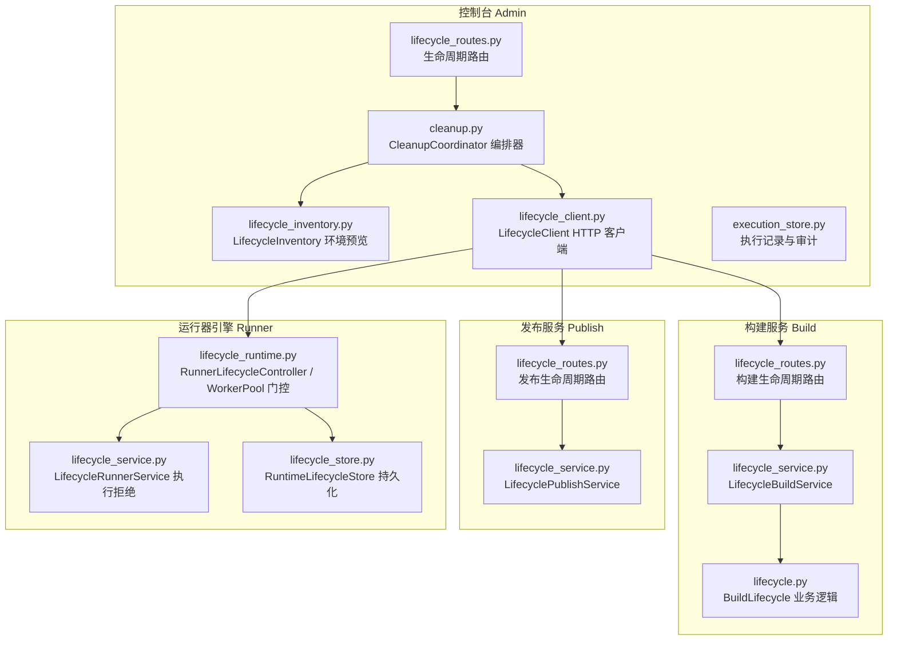

**图表来源** 
- [web/admin/lifecycle_routes.py:17-94](file://web/admin/lifecycle_routes.py#L17-L94)
- [web/admin/cleanup.py:14-334](file://web/admin/cleanup.py#L14-L334)
- [web/admin/lifecycle_inventory.py:8-147](file://web/admin/lifecycle_inventory.py#L8-L147)
- [web/admin/lifecycle_client.py:32-214](file://web/admin/lifecycle_client.py#L32-L214)
- [web/admin/execution_store.py:9-153](file://web/admin/execution_store.py#L9-L153)
- [build_service/lifecycle_routes.py:18-108](file://build_service/lifecycle_routes.py#L18-L108)
- [build_service/lifecycle_service.py:293-323](file://build_service/lifecycle_service.py#L293-L323)
- [build_service/lifecycle.py:45-133](file://build_service/lifecycle.py#L45-L133)
- [publish_service/lifecycle_routes.py:20-86](file://publish_service/lifecycle_routes.py#L20-L86)
- [publish_service/lifecycle_service.py:16-50](file://publish_service/lifecycle_service.py#L16-L50)
- [runner_engine/lifecycle_runtime.py:187-397](file://runner_engine/lifecycle_runtime.py#L187-L397)
- [runner_engine/lifecycle_service.py:7-71](file://runner_engine/lifecycle_service.py#L7-L71)
- [runner_engine/lifecycle_store.py:35-151](file://runner_engine/lifecycle_store.py#L35-L151)

**章节来源**
- [web/admin/lifecycle_routes.py:17-94](file://web/admin/lifecycle_routes.py#L17-L94)
- [web/admin/cleanup.py:14-334](file://web/admin/cleanup.py#L14-L334)
- [web/admin/lifecycle_inventory.py:8-147](file://web/admin/lifecycle_inventory.py#L8-L147)
- [web/admin/lifecycle_client.py:32-214](file://web/admin/lifecycle_client.py#L32-L214)
- [web/admin/execution_store.py:9-153](file://web/admin/execution_store.py#L9-L153)
- [build_service/lifecycle_routes.py:18-108](file://build_service/lifecycle_routes.py#L18-L108)
- [build_service/lifecycle_service.py:293-323](file://build_service/lifecycle_service.py#L293-L323)
- [build_service/lifecycle.py:45-133](file://build_service/lifecycle.py#L45-L133)
- [publish_service/lifecycle_routes.py:20-86](file://publish_service/lifecycle_routes.py#L20-L86)
- [publish_service/lifecycle_service.py:16-50](file://publish_service/lifecycle_service.py#L16-L50)
- [runner_engine/lifecycle_runtime.py:187-397](file://runner_engine/lifecycle_runtime.py#L187-L397)
- [runner_engine/lifecycle_service.py:7-71](file://runner_engine/lifecycle_service.py#L7-L71)
- [runner_engine/lifecycle_store.py:35-151](file://runner_engine/lifecycle_store.py#L35-L151)

## 核心组件
- LifecycleInventory：封装环境预览与清理前置检查，聚合构建库、发布库引用信息与警告项，输出 canExecute 与 blockingReasons。
- LifecycleClient：面向 Build/Publish/Runner 三个 Owner Service 的统一 HTTP 客户端，封装鉴权、超时、错误映射与重试语义。
- CleanupCoordinator：清理编排器，串联 Inventory 预览、Build/Publish/Runner 三阶段门控、失败回滚与执行步骤审计。
- ExecutionStore：清理请求与执行记录的持久化、审计事件写入与最近执行查询。
- BuildLifecycle/LifecycleBuildService：构建侧环境生命周期状态机（ACTIVE/RETIRING/RETIRED）、制品删除与错误记录。
- Publish Runtime Lifecycle：发布侧 Runner 变体生命周期门控，保护发布事务中的活跃期一致性。
- Runner Lifecycle Controller/Service/Store：运行器侧镜像生命周期门控，拦截新租约、续租与调用；沙箱池退役空闲工作进程；持久化 RETIRING/RETIRED 状态。

**章节来源**
- [web/admin/lifecycle_inventory.py:8-147](file://web/admin/lifecycle_inventory.py#L8-L147)
- [web/admin/lifecycle_client.py:32-214](file://web/admin/lifecycle_client.py#L32-L214)
- [web/admin/cleanup.py:14-334](file://web/admin/cleanup.py#L14-L334)
- [web/admin/execution_store.py:9-153](file://web/admin/execution_store.py#L9-L153)
- [build_service/lifecycle.py:45-133](file://build_service/lifecycle.py#L45-L133)
- [build_service/lifecycle_service.py:293-323](file://build_service/lifecycle_service.py#L293-L323)
- [publish_service/lifecycle_service.py:16-50](file://publish_service/lifecycle_service.py#L16-L50)
- [runner_engine/lifecycle_runtime.py:187-397](file://runner_engine/lifecycle_runtime.py#L187-L397)
- [runner_engine/lifecycle_service.py:7-71](file://runner_engine/lifecycle_service.py#L7-L71)
- [runner_engine/lifecycle_store.py:35-151](file://runner_engine/lifecycle_store.py#L35-L151)

## 架构总览
生命周期管理以控制台 Admin 为统一入口，通过 LifecycleClient 调用各服务端的生命周期接口，并由 CleanupCoordinator 编排多阶段清理流程。每个服务均具备独立的生命周期状态与门控逻辑，确保数据一致性与安全性。

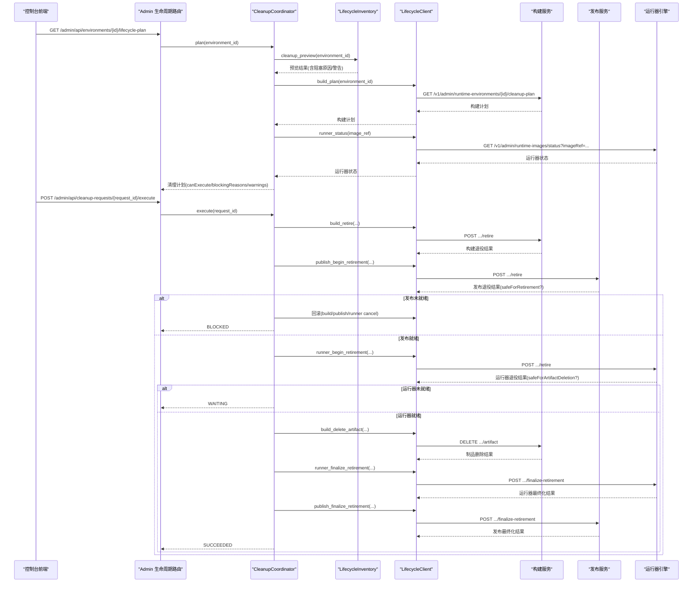

**图表来源** 
- [web/admin/lifecycle_routes.py:44-78](file://web/admin/lifecycle_routes.py#L44-L78)
- [web/admin/cleanup.py:20-298](file://web/admin/cleanup.py#L20-L298)
- [web/admin/lifecycle_inventory.py:12-147](file://web/admin/lifecycle_inventory.py#L12-L147)
- [web/admin/lifecycle_client.py:114-214](file://web/admin/lifecycle_client.py#L114-L214)
- [build_service/lifecycle_routes.py:34-108](file://build_service/lifecycle_routes.py#L34-L108)
- [publish_service/lifecycle_routes.py:36-86](file://publish_service/lifecycle_routes.py#L36-L86)
- [runner_engine/lifecycle_runtime.py:302-359](file://runner_engine/lifecycle_runtime.py#L302-L359)

## 详细组件分析

### 生命周期路由与控制台入口
- 能力探测：/admin/api/lifecycle-capabilities 返回是否启用及 Build/Publish/Runner 子端点可用性。
- 清理计划：/admin/api/environments/{environment_id}/lifecycle-plan 调用 CleanupCoordinator.plan，聚合 Inventory 预览、Build 计划与 Runner 状态，返回 canExecute、blockingReasons 与 warnings。
- 清理执行：/admin/api/cleanup-requests/{request_id}/execute 调用 CleanupCoordinator.execute，按阶段推进并记录步骤与审计。
- 执行历史：/admin/api/cleanup-executions 列出最近清理执行记录。

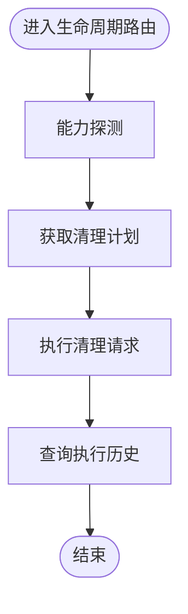

**图表来源** 
- [web/admin/lifecycle_routes.py:34-94](file://web/admin/lifecycle_routes.py#L34-L94)

**章节来源**
- [web/admin/lifecycle_routes.py:17-94](file://web/admin/lifecycle_routes.py#L17-L94)

### LifecycleInventory：环境预览与清理检查
- 基础预览：调用底层 inventory.cleanup_preview(environment_id)，若未找到直接返回。
- 阻塞原因过滤：忽略与 Publish 相关的部分原因以及特定 Active Runner leases 引用已发布发行版的提示。
- 构建侧增强：连接构建数据库读取 lifecycle_state、cleanup_error、retired_at，补充到预览中；若列不可用则添加升级提示。
- 发布侧引用检查：查询当前发布的 Runner 变体是否仍引用该 runtimeEnvKey/envKey/imageRef，限制最多 100 条，超出时给出限制警告。
- 警告与可执行性：存在 activeLeaseReferences 或引用过多时添加警告；canExecute 由 blockingReasons 是否为空决定。

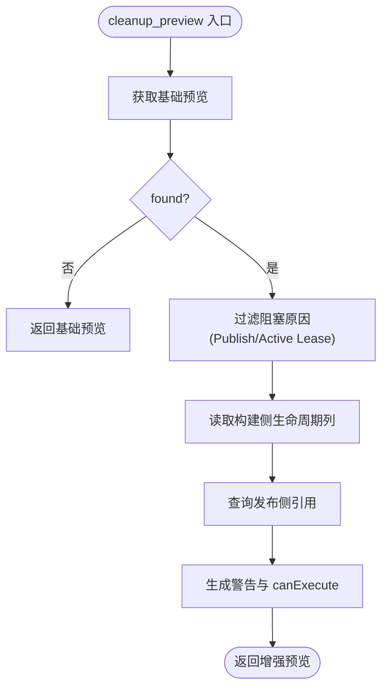

**图表来源** 
- [web/admin/lifecycle_inventory.py:12-147](file://web/admin/lifecycle_inventory.py#L12-L147)

**章节来源**
- [web/admin/lifecycle_inventory.py:8-147](file://web/admin/lifecycle_inventory.py#L8-L147)

### LifecycleClient：与服务端生命周期 API 的交互
- 端点配置：从环境变量注入 Build/Publish/Runner 的 base_url 与 token，支持 enabled 检测。
- 请求封装：统一设置 Authorization Bearer、Content-Type、JSON 响应解析与超时控制。
- 错误映射：HTTPError 转为 LifecycleRejected（携带 status），网络/超时异常转为 LifecycleUnavailable。
- 构建侧方法：build_plan/build_retire/build_cancel_retirement/build_delete_artifact。
- 发布侧方法：publish_begin_retirement/publish_cancel_retirement/publish_finalize_retirement。
- 运行器侧方法：runner_status/runner_begin_retirement/runner_cancel_retirement/runner_finalize_retirement。

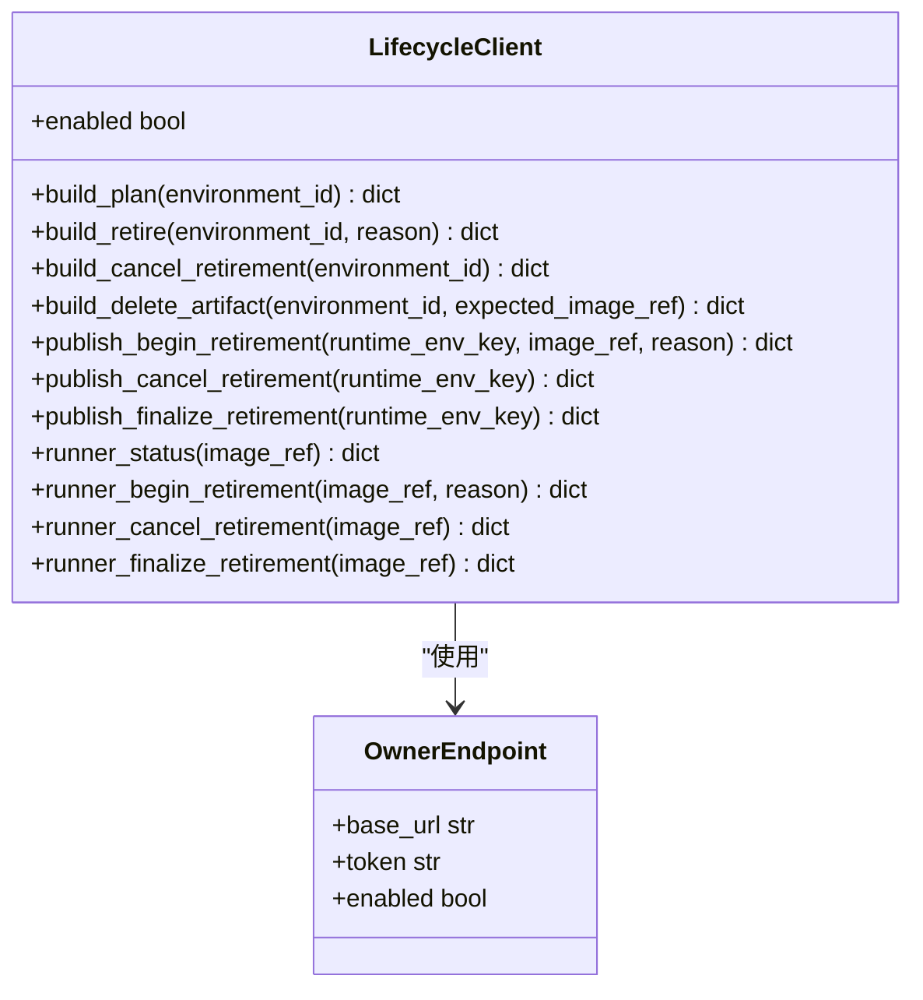

**图表来源** 
- [web/admin/lifecycle_client.py:22-214](file://web/admin/lifecycle_client.py#L22-L214)

**章节来源**
- [web/admin/lifecycle_client.py:32-214](file://web/admin/lifecycle_client.py#L32-L214)

### CleanupCoordinator：清理编排与回滚
- 计划阶段：聚合 Inventory 预览、Build 计划与 Runner 状态，计算 canExecute 与 blockingReasons。
- 执行阶段：
  - 启动执行记录并审计。
  - 预检失败则标记 BLOCKED。
  - 依次调用 Build.retire → Publish.begin_retirement → Runner.begin_retirement。
  - 若 Publish.safeForRetirement 为假，触发回滚并标记 BLOCKED。
  - 若 Runner.safeForArtifactDeletion 为假，标记 WAITING 等待资源排空。
  - 否则删除 Harbor 制品，再 Runner.finalize → Publish.finalize，标记 SUCCEEDED。
- 错误处理：记录失败步骤，必要时执行回滚；若制品已删除但后续失败，标记 PARTIAL。
- 回滚顺序：按已启动的门控反向取消（runner → publish → build）。

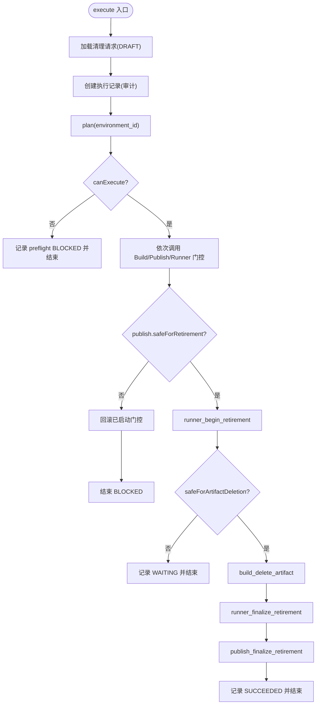

**图表来源** 
- [web/admin/cleanup.py:52-298](file://web/admin/cleanup.py#L52-L298)

**章节来源**
- [web/admin/cleanup.py:14-334](file://web/admin/cleanup.py#L14-L334)

### ExecutionStore：执行状态与审计
- 清理请求读取：从 console_ops.cleanup_requests 读取环境信息、快照与创建者。
- 执行开始：插入 console_ops.cleanup_executions，状态 RUNNING，并审计 cleanup.execute.start。
- 步骤记录：插入 console_ops.cleanup_execution_steps，记录 step_name、status、detail_json。
- 执行结束：更新状态（BLOCKED/WAITING/SUCCEEDED/FAILED/PARTIAL），审计 cleanup.execute.{status.lower()}。
- 最近执行：按 started_at 倒序返回最近 N 条。

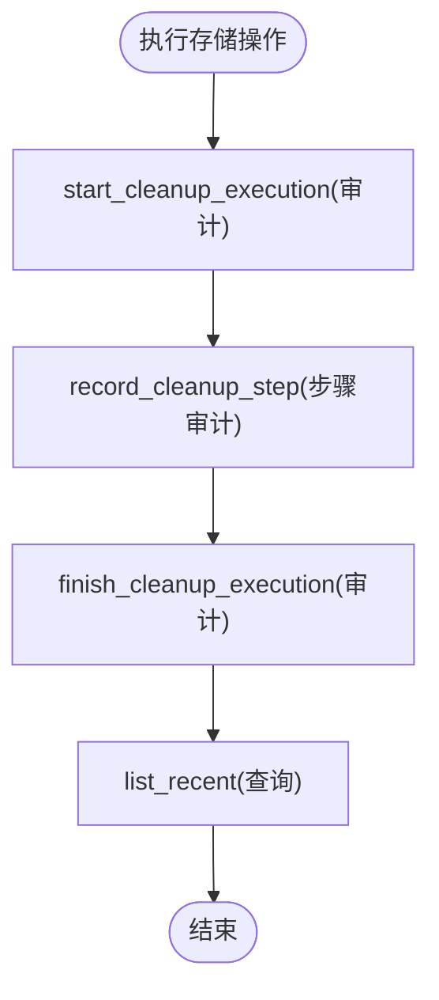

**图表来源** 
- [web/admin/execution_store.py:42-153](file://web/admin/execution_store.py#L42-L153)

**章节来源**
- [web/admin/execution_store.py:9-153](file://web/admin/execution_store.py#L9-L153)

### 构建服务生命周期：BuildLifecycle 与路由
- 状态机：ACTIVE/RETIRING/RETIRED。
- 计划：返回 environmentId、envKey、buildStatus、lifecycleState、imageRef、aliasCount、activeBuildJobs、locallyBlocked。
- 退役：仅在无活跃构建任务且非 RETIRING/RETIRED 时允许进入 RETIRING。
- 取消退役：仅 RETIRING 可回到 ACTIVE。
- 删除制品：要求 RETIRING、无活跃构建、image_ref 未变更；若未配置 Harbor 则报错；删除后 finalize_retirement。
- 路由鉴权：Bearer Token 校验，缺失或非法返回 401/503。

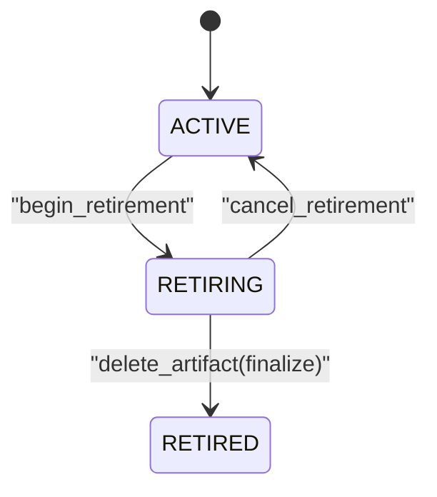

**图表来源** 
- [build_service/lifecycle.py:9-133](file://build_service/lifecycle.py#L9-L133)
- [build_service/lifecycle_routes.py:18-108](file://build_service/lifecycle_routes.py#L18-L108)

**章节来源**
- [build_service/lifecycle.py:45-133](file://build_service/lifecycle.py#L45-L133)
- [build_service/lifecycle_routes.py:18-108](file://build_service/lifecycle_routes.py#L18-L108)
- [build_service/lifecycle_service.py:293-323](file://build_service/lifecycle_service.py#L293-L323)

### 发布服务生命周期：Publish Runtime Lifecycle
- 路由：/v1/admin/runner-runtimes/retire/cancel-retirement/finalize-retirement，Bearer Token 鉴权。
- 服务层：LifecyclePublishService 委托 PublishRuntimeLifecycle 管理 Runner 变体的生命周期门控。
- 发布事务保护：在发布 Runner 变体时，guard 与 assert_active 确保不会在 RETIRING 期间发布。

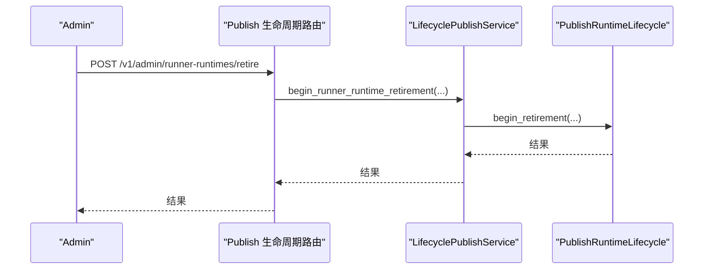

**图表来源** 
- [publish_service/lifecycle_routes.py:36-86](file://publish_service/lifecycle_routes.py#L36-L86)
- [publish_service/lifecycle_service.py:16-50](file://publish_service/lifecycle_service.py#L16-L50)

**章节来源**
- [publish_service/lifecycle_routes.py:20-86](file://publish_service/lifecycle_routes.py#L20-L86)
- [publish_service/lifecycle_service.py:16-50](file://publish_service/lifecycle_service.py#L16-L50)

### 运行器引擎生命周期：Runner Lifecycle Controller/Service/Store
- 状态持久化：RuntimeLifecycleStore 维护 runner.runtime_image_lifecycle 表，包含 runtime_id、image_ref、state(RETIRING/RETIRED)、reason、cleanup_error、时间戳。
- 执行拒绝：LifecycleRunnerService 在 acquire_lease/renew_lease/invoke 前检查生命周期状态，拒绝 RETIRING/RETIRED 的运行镜像。
- 沙箱池门控：LifecycleWorkerPool.acquire 在获取沙箱前检查 is_blocked_runtime，并在 finally 中释放 acquiring 计数；retire_runtime 销毁空闲 worker。
- 控制器：RunnerLifecycleController 提供 runtime_image_status、begin/cancel/finalize_retirement、retire_idle_worker、runtime_snapshot。
- 安全判定：safeForArtifactDeletion 基于无活动调用、无空闲 worker、无 acquiring、无 managed sandbox。

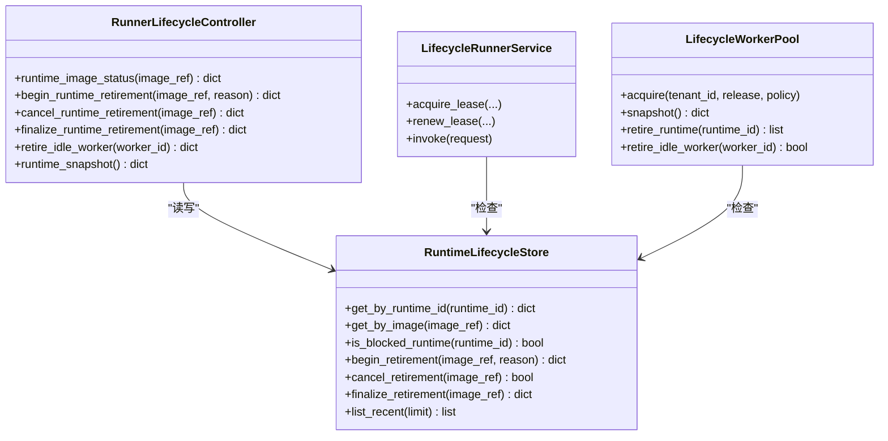

**图表来源** 
- [runner_engine/lifecycle_store.py:35-151](file://runner_engine/lifecycle_store.py#L35-L151)
- [runner_engine/lifecycle_runtime.py:14-121](file://runner_engine/lifecycle_runtime.py#L14-L121)
- [runner_engine/lifecycle_runtime.py:187-397](file://runner_engine/lifecycle_runtime.py#L187-L397)
- [runner_engine/lifecycle_service.py:7-71](file://runner_engine/lifecycle_service.py#L7-L71)

**章节来源**
- [runner_engine/lifecycle_store.py:35-151](file://runner_engine/lifecycle_store.py#L35-L151)
- [runner_engine/lifecycle_runtime.py:14-121](file://runner_engine/lifecycle_runtime.py#L14-L121)
- [runner_engine/lifecycle_runtime.py:187-397](file://runner_engine/lifecycle_runtime.py#L187-L397)
- [runner_engine/lifecycle_service.py:7-71](file://runner_engine/lifecycle_service.py#L7-L71)

## 依赖关系分析
- 控制台 Admin 依赖 LifecycleClient 访问 Build/Publish/Runner 的 REST API。
- CleanupCoordinator 依赖 LifecycleInventory 进行环境预览，依赖 ExecutionStore 进行执行审计。
- BuildLifecycle 依赖 BuildStore/HarborClient 进行状态与制品操作。
- PublishRuntimeLifecycle 依赖发布服务 store 与 publisher 进行发布事务保护。
- RunnerLifecycleController/Service 依赖 RuntimeLifecycleStore 与 WorkerPool 进行门控与沙箱管理。

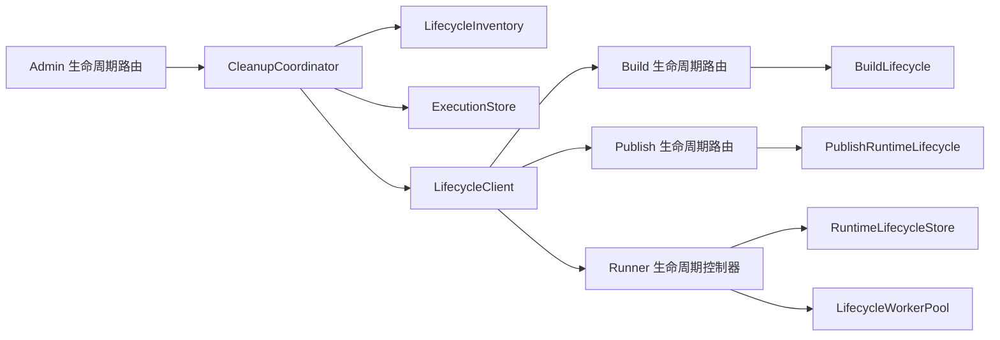

**图表来源** 
- [web/admin/lifecycle_routes.py:17-94](file://web/admin/lifecycle_routes.py#L17-L94)
- [web/admin/cleanup.py:14-334](file://web/admin/cleanup.py#L14-L334)
- [web/admin/lifecycle_inventory.py:8-147](file://web/admin/lifecycle_inventory.py#L8-L147)
- [web/admin/lifecycle_client.py:32-214](file://web/admin/lifecycle_client.py#L32-L214)
- [build_service/lifecycle.py:45-133](file://build_service/lifecycle.py#L45-L133)
- [publish_service/lifecycle_service.py:16-50](file://publish_service/lifecycle_service.py#L16-L50)
- [runner_engine/lifecycle_runtime.py:187-397](file://runner_engine/lifecycle_runtime.py#L187-L397)
- [runner_engine/lifecycle_store.py:35-151](file://runner_engine/lifecycle_store.py#L35-L151)

**章节来源**
- [web/admin/lifecycle_routes.py:17-94](file://web/admin/lifecycle_routes.py#L17-L94)
- [web/admin/cleanup.py:14-334](file://web/admin/cleanup.py#L14-L334)
- [web/admin/lifecycle_inventory.py:8-147](file://web/admin/lifecycle_inventory.py#L8-L147)
- [web/admin/lifecycle_client.py:32-214](file://web/admin/lifecycle_client.py#L32-L214)
- [build_service/lifecycle.py:45-133](file://build_service/lifecycle.py#L45-L133)
- [publish_service/lifecycle_service.py:16-50](file://publish_service/lifecycle_service.py#L16-L50)
- [runner_engine/lifecycle_runtime.py:187-397](file://runner_engine/lifecycle_runtime.py#L187-L397)
- [runner_engine/lifecycle_store.py:35-151](file://runner_engine/lifecycle_store.py#L35-L151)

## 性能与可观测性
- 异步执行：控制台路由将耗时操作放入线程池执行，避免阻塞 HTTP 线程。
- 分页与限制：发布引用查询限制 100 条，执行历史查询限制 300 条，防止大结果集拖慢系统。
- 索引优化：构建侧与运行器侧生命周期表均有索引，提升查询与状态切换性能。
- 可观测性：
  - 控制台：cleanup-executions 接口返回最近执行记录，便于运维查看。
  - 运行器：runtime_snapshot 与 runtime_image_status 暴露活跃调用、空闲 worker、managed sandbox 等指标。
  - 审计：所有关键动作（开始执行、步骤记录、结束执行）均写入审计日志。

[本节为通用指导，不直接分析具体文件]

## 故障排查指南
- 清理计划被阻塞：
  - 检查 blockingReasons 与 warnings，确认是否存在活跃构建任务、无 image_ref、发布引用仍存在或引用数量超限。
  - 参考路径：[web/admin/cleanup.py:20-50](file://web/admin/cleanup.py#L20-L50)、[web/admin/lifecycle_inventory.py:12-147](file://web/admin/lifecycle_inventory.py#L12-L147)。
- 清理执行处于 WAITING：
  - 表示 Runner 尚未 safeForArtifactDeletion，需等待活动调用与沙箱排空。
  - 参考路径：[web/admin/cleanup.py:177-198](file://web/admin/cleanup.py#L177-L198)、[runner_engine/lifecycle_runtime.py:239-300](file://runner_engine/lifecycle_runtime.py#L239-L300)。
- 清理执行 BLOCKED（发布未就绪）：
  - 检查发布侧 safeForRetirement，必要时回滚已启动门控。
  - 参考路径：[web/admin/cleanup.py:140-163](file://web/admin/cleanup.py#L140-L163)、[web/admin/cleanup.py:300-333](file://web/admin/cleanup.py#L300-L333)。
- 清理执行 FAILED/PARTIAL：
  - 查看失败步骤 detail 与 artifactDeleted 标志；若制品已删除但后续失败，需人工介入恢复门控。
  - 参考路径：[web/admin/cleanup.py:252-298](file://web/admin/cleanup.py#L252-L298)。
- 鉴权失败：
  - 构建/发布/运行器路由均要求 Bearer Token，缺失或非法会返回 401/503。
  - 参考路径：[build_service/lifecycle_routes.py:18-32](file://build_service/lifecycle_routes.py#L18-L32)、[publish_service/lifecycle_routes.py:20-33](file://publish_service/lifecycle_routes.py#L20-L33)。
- 运行器拒绝新执行：
  - 生命周期状态为 RETIRING/RETIRED 时，acquire_lease/renew_lease/invoke 会被拒绝。
  - 参考路径：[runner_engine/lifecycle_service.py:19-32](file://runner_engine/lifecycle_service.py#L19-L32)。

**章节来源**
- [web/admin/cleanup.py:20-50](file://web/admin/cleanup.py#L20-L50)
- [web/admin/cleanup.py:140-198](file://web/admin/cleanup.py#L140-L198)
- [web/admin/cleanup.py:252-298](file://web/admin/cleanup.py#L252-L298)
- [web/admin/cleanup.py:300-333](file://web/admin/cleanup.py#L300-L333)
- [web/admin/lifecycle_inventory.py:12-147](file://web/admin/lifecycle_inventory.py#L12-L147)
- [build_service/lifecycle_routes.py:18-32](file://build_service/lifecycle_routes.py#L18-L32)
- [publish_service/lifecycle_routes.py:20-33](file://publish_service/lifecycle_routes.py#L20-L33)
- [runner_engine/lifecycle_service.py:19-32](file://runner_engine/lifecycle_service.py#L19-L32)
- [runner_engine/lifecycle_runtime.py:239-300](file://runner_engine/lifecycle_runtime.py#L239-L300)

## 结论
生命周期管理通过控制台统一入口协调构建、发布与运行器三大子系统，形成严谨的多阶段清理流程与强一致的门控策略。LifecycleInventory 提供全面的环境预览与安全检查，LifecycleClient 抽象跨服务调用，CleanupCoordinator 保证编排的可观测性与回滚能力，ExecutionStore 提供完整的审计轨迹。配合构建侧状态机、发布侧发布事务保护与运行器侧执行拒绝与沙箱退役，系统在保障数据安全的同时实现了高效的资源回收与治理。

[本节为总结性内容，不直接分析具体文件]