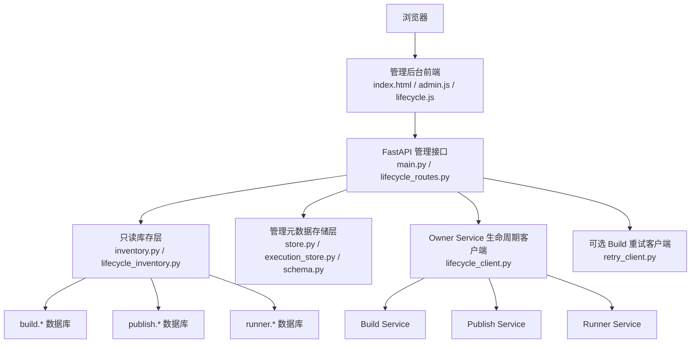
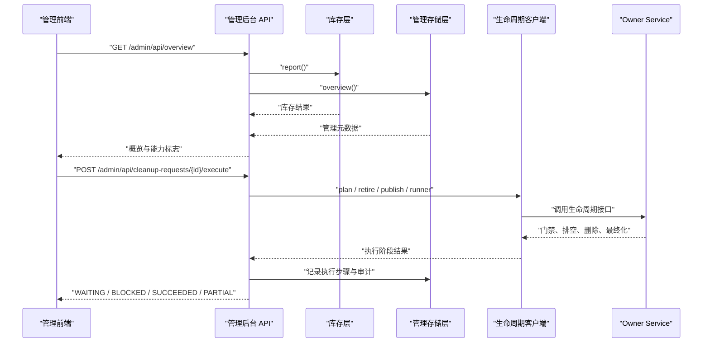
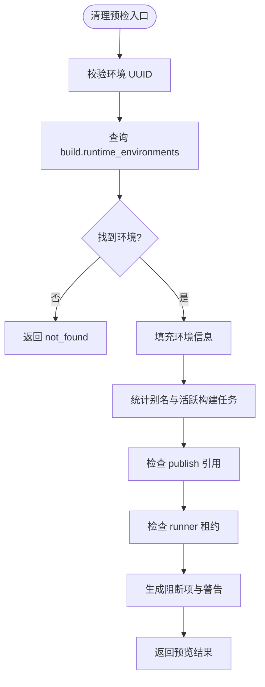
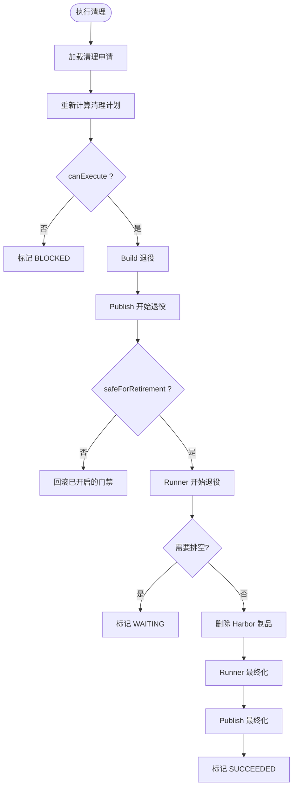
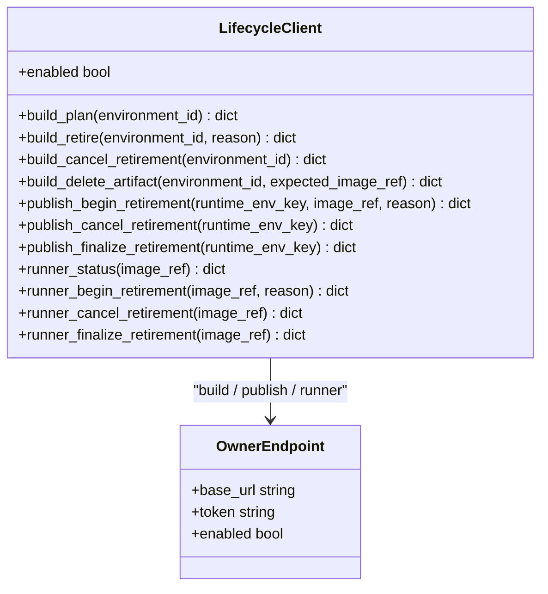
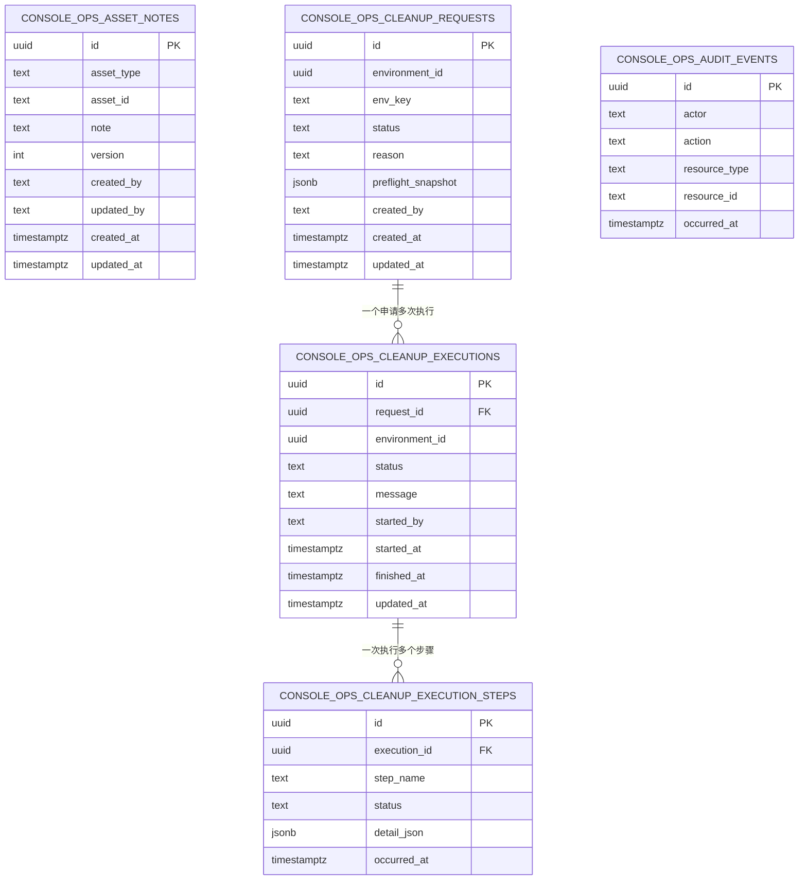
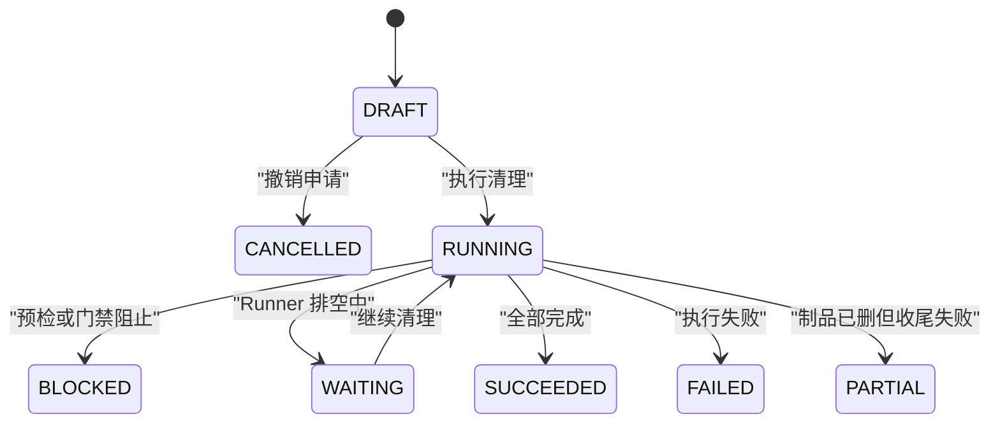
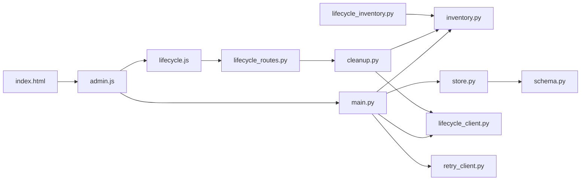
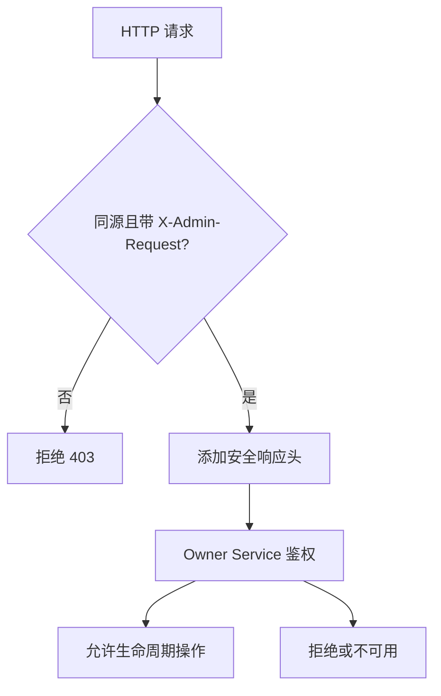
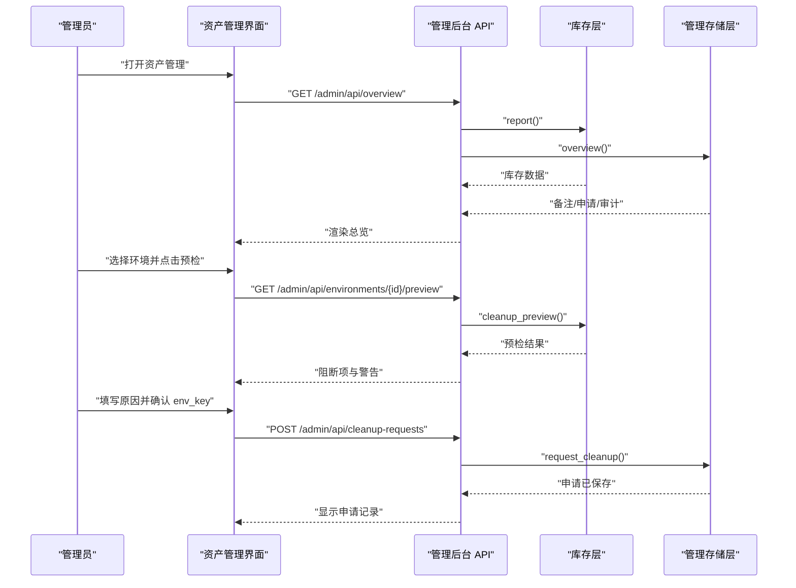

# 管理后台

<cite>
**本文引用的文件**   
- [web/admin/main.py](file://web/admin/main.py)
- [web/admin/lifecycle_routes.py](file://web/admin/lifecycle_routes.py)
- [web/admin/store.py](file://web/admin/store.py)
- [web/admin/inventory.py](file://web/admin/inventory.py)
- [web/admin/execution_store.py](file://web/admin/execution_store.py)
- [web/admin/schema.py](file://web/admin/schema.py)
- [web/admin/sql/001_admin_schema.sql](file://web/admin/sql/001_admin_schema.sql)
- [web/admin/cleanup.py](file://web/admin/cleanup.py)
- [web/admin/lifecycle_client.py](file://web/admin/lifecycle_client.py)
- [web/admin/lifecycle_inventory.py](file://web/admin/lifecycle_inventory.py)
- [web/admin/retry_client.py](file://web/admin/retry_client.py)
- [web/admin/static/index.html](file://web/admin/static/index.html)
- [web/admin/static/admin.js](file://web/admin/static/admin.js)
- [web/admin/static/lifecycle.js](file://web/admin/static/lifecycle.js)
- [config/acl.json](file://config/acl.json)
- [config/policies.json](file://config/policies.json)
</cite>

## 目录
1. [简介](#简介)
2. [项目结构](#项目结构)
3. [核心功能模块](#核心功能模块)
4. [架构总览](#架构总览)
5. [详细组件分析](#详细组件分析)
6. [依赖关系分析](#依赖关系分析)
7. [性能与容量特性](#性能与容量特性)
8. [权限控制与安全策略](#权限控制与安全策略)
9. [数据安全与审计追踪](#数据安全与审计追踪)
10. [运维界面与操作流程](#运维界面与操作流程)
11. [管理员使用示例与最佳实践](#管理员使用示例与最佳实践)
12. [故障排查指南](#故障排查指南)
13. [结论](#结论)

## 简介
本管理后台为“运行资产管理”控制台，提供库存概览、生命周期清理申请与执行、资产备注和审计日志等能力。它不直接写入构建、发布或 Runner 业务数据库，而是通过只读查询与 Owner Service 的受控生命周期接口完成跨服务协调；所有破坏性操作均经过预检、门禁、排空与可回滚流程，并记录完整审计轨迹。

## 项目结构
管理后台位于 `web/admin`，采用 FastAPI 应用 + 静态前端 + 多数据源访问的设计：
- Web 入口与路由：`main.py`、`lifecycle_routes.py`
- 业务库存读取：`inventory.py`、`lifecycle_inventory.py`
- 管理元数据存储：`store.py`、`execution_store.py`、`schema.py`、`sql/001_admin_schema.sql`
- 生命周期协调：`cleanup.py`、`lifecycle_client.py`
- 可选重试能力：`retry_client.py`
- 前端页面与交互：`static/index.html`、`static/admin.js`、`static/lifecycle.js`

**图示来源**
- [web/admin/main.py:47-104](file://web/admin/main.py#L47-L104)
- [web/admin/lifecycle_routes.py:17-94](file://web/admin/lifecycle_routes.py#L17-L94)
- [web/admin/inventory.py:26-49](file://web/admin/inventory.py#L26-L49)
- [web/admin/store.py:42-106](file://web/admin/store.py#L42-L106)
- [web/admin/lifecycle_client.py:32-65](file://web/admin/lifecycle_client.py#L32-L65)
- [web/admin/retry_client.py:23-37](file://web/admin/retry_client.py#L23-L37)

**章节来源**
- [web/admin/main.py:1-104](file://web/admin/main.py#L1-L104)
- [web/admin/lifecycle_routes.py:1-94](file://web/admin/lifecycle_routes.py#L1-L94)

## 核心功能模块
- 库存管理
  - 聚合 build、publish、runner 三套数据库的最新记录，用于环境、租约、执行、幂等键、变体和发布任务概览。
  - 提供资产存在性校验、失败构建重试预检、清理预检等只读能力。
- 生命周期管理
  - 清理申请：保存原因与预检快照，要求确认 env_key。
  - 清理计划：结合库存与 Owner Service 返回的计划，判断是否可执行。
  - 清理执行：按 Build → Publish → Runner 顺序安装门禁、等待排空、删除制品、最终化，支持部分成功与回滚。
- 审计日志
  - 对备注增删改、清理申请与执行步骤进行追加式审计记录。
- 运维界面
  - 总览、运行环境、Runner 执行、发布记录、清理申请、资产备注、操作审计等视图。

**章节来源**
- [web/admin/inventory.py:55-147](file://web/admin/inventory.py#L55-L147)
- [web/admin/store.py:117-126](file://web/admin/store.py#L117-L126)
- [web/admin/cleanup.py:20-50](file://web/admin/cleanup.py#L20-L50)
- [web/admin/static/index.html:21-30](file://web/admin/static/index.html#L21-L30)

## 架构总览
管理后台作为统一控制台的一个子模块，承担 console_ops 元数据管理与跨服务协调职责。其关键设计原则包括：
- 读写分离：Inventory 仅读业务库；Store 仅写 console_ops。
- 所有权边界：破坏性操作委托给 Owner Service，避免绕过业务状态机。
- 安全前置：中间件限制同源 JSON 请求；CSP、X-Frame-Options 等响应头加固。
- 可观测性：审计事件、清理执行步骤、最近执行列表。

**图示来源**
- [web/admin/main.py:120-162](file://web/admin/main.py#L120-L162)
- [web/admin/lifecycle_routes.py:61-94](file://web/admin/lifecycle_routes.py#L61-L94)
- [web/admin/cleanup.py:52-298](file://web/admin/cleanup.py#L52-L298)
- [web/admin/lifecycle_client.py:114-214](file://web/admin/lifecycle_client.py#L114-L214)

## 详细组件分析

### 库存层 Inventory
Inventory 负责连接 build、publish、runner 数据库，以只读方式拉取最新记录，并提供资产存在性检查、失败构建重试预检、清理预检等能力。

- 连接与查询
  - 通过 DSN 或注入连接工厂建立连接。
  - 设置只读事务与语句超时，降低误写风险。
- 主要方法
  - report：聚合各服务表最新记录。
  - asset_exists：校验 UUID 并在所属服务表中查找真实记录。
  - retry_preflight：检查环境状态、是否存在活跃构建任务。
  - cleanup_preview：汇总别名、构建任务、发布引用、Runner 租约等信息，输出阻断项与警告。

**图示来源**
- [web/admin/inventory.py:206-336](file://web/admin/inventory.py#L206-L336)

**章节来源**
- [web/admin/inventory.py:26-49](file://web/admin/inventory.py#L26-L49)
- [web/admin/inventory.py:149-204](file://web/admin/inventory.py#L149-L204)
- [web/admin/inventory.py:206-336](file://web/admin/inventory.py#L206-L336)

### 生命周期协调 CleanupCoordinator
CleanupCoordinator 将库存预检与 Owner Service 生命周期接口组合成可执行的清理流程。

- 计划阶段
  - 调用 inventory.cleanup_preview 获取基础阻断项。
  - 调用 build_plan 与 runner_status 补充生命周期状态。
  - 综合得出 canExecute 与 blockingReasons。
- 执行阶段
  - 创建执行记录，逐步调用 build_retire、publish_begin_retirement、runner_begin_retirement。
  - 若 Runner 尚未就绪则进入 WAITING，等待活动工作排空。
  - 在合适时机删除 Harbor artifact，并最终化 Runner 与 Publish 退役。
  - 异常时记录错误步骤，必要时执行回滚。

**图示来源**
- [web/admin/cleanup.py:20-50](file://web/admin/cleanup.py#L20-L50)
- [web/admin/cleanup.py:52-298](file://web/admin/cleanup.py#L52-L298)

**章节来源**
- [web/admin/cleanup.py:13-50](file://web/admin/cleanup.py#L13-L50)
- [web/admin/cleanup.py:52-334](file://web/admin/cleanup.py#L52-L334)

### 生命周期客户端 LifecycleClient
LifecycleClient 封装对 Build、Publish、Runner Owner Service 的生命周期 HTTP 接口调用，包含鉴权、超时、错误分类与能力检测。

- 配置来源
  - ADMIN_BUILD_SERVICE_URL、ADMIN_PUBLISH_SERVICE_URL、ADMIN_RUNNER_ADMIN_URL 及对应 Token。
- 能力检测
  - enabled 表示三个 Owner Endpoint 均已配置。
- 主要接口
  - build_plan、build_retire、build_cancel_retirement、build_delete_artifact
  - publish_begin_retirement、publish_cancel_retirement、publish_finalize_retirement
  - runner_status、runner_begin_retirement、runner_cancel_retirement、runner_finalize_retirement

**图示来源**
- [web/admin/lifecycle_client.py:22-65](file://web/admin/lifecycle_client.py#L22-L65)
- [web/admin/lifecycle_client.py:114-214](file://web/admin/lifecycle_client.py#L114-L214)

**章节来源**
- [web/admin/lifecycle_client.py:12-65](file://web/admin/lifecycle_client.py#L12-L65)
- [web/admin/lifecycle_client.py:67-214](file://web/admin/lifecycle_client.py#L67-L214)

### 管理存储层 AdminStore 与执行存储 ExecutionStore
AdminStore 负责 console_ops 元数据的 CRUD 与审计；ExecutionStore 负责清理执行过程的状态与步骤记录。

- AdminStore
  - 自动初始化 console_ops schema（幂等）。
  - 提供 overview、create_note、update_note、delete_note、request_cleanup、cancel_cleanup。
  - 所有写操作均伴随 audit_events 追加记录。
- ExecutionStore
  - 查询清理申请、启动执行、记录步骤、结束执行、列出最近执行。
  - 步骤状态包括 RUNNING、SUCCEEDED、BLOCKED、WAITING、FAILED。
  - 执行状态包括 RUNNING、BLOCKED、WAITING、SUCCEEDED、FAILED、PARTIAL。

**图示来源**
- [web/admin/schema.py:5-115](file://web/admin/schema.py#L5-L115)
- [web/admin/sql/001_admin_schema.sql:3-51](file://web/admin/sql/001_admin_schema.sql#L3-L51)

**章节来源**
- [web/admin/store.py:42-126](file://web/admin/store.py#L42-L126)
- [web/admin/store.py:128-218](file://web/admin/store.py#L128-L218)
- [web/admin/store.py:230-382](file://web/admin/store.py#L230-L382)
- [web/admin/execution_store.py:9-153](file://web/admin/execution_store.py#L9-L153)
- [web/admin/schema.py:119-122](file://web/admin/schema.py#L119-L122)

### 生命周期路由与状态管理
生命周期路由暴露以下接口：
- GET /admin/api/lifecycle-capabilities：返回生命周期能力开关。
- GET /admin/api/environments/{environment_id}/lifecycle-plan：返回清理计划。
- POST /admin/api/cleanup-requests/{request_id}/execute：执行清理。
- GET /admin/api/cleanup-executions：列出最近清理执行。

状态管理要点：
- 清理申请状态：DRAFT、CANCELLED。
- 清理执行状态：RUNNING、BLOCKED、WAITING、SUCCEEDED、FAILED、PARTIAL。
- 清理步骤状态：RUNNING、SUCCEEDED、BLOCKED、WAITING、FAILED。

**图示来源**
- [web/admin/lifecycle_routes.py:34-94](file://web/admin/lifecycle_routes.py#L34-L94)
- [web/admin/schema.py:29-115](file://web/admin/schema.py#L29-L115)
- [web/admin/execution_store.py:67-124](file://web/admin/execution_store.py#L67-L124)

**章节来源**
- [web/admin/lifecycle_routes.py:17-94](file://web/admin/lifecycle_routes.py#L17-L94)
- [web/admin/execution_store.py:9-153](file://web/admin/execution_store.py#L9-L153)

### 可选重试客户端 RetryClient
RetryClient 通过 Build Service 的现有重试接口恢复失败的构建任务。它不会直接修改业务数据库，而是走 Owner Service 的权威路径。

- 启用条件：配置 ADMIN_BUILD_SERVICE_URL。
- 行为：先做库存预检，再调用 Build Service 重试接口，最后记录审计。

**章节来源**
- [web/admin/retry_client.py:1-71](file://web/admin/retry_client.py#L1-L71)
- [web/admin/main.py:178-233](file://web/admin/main.py#L178-L233)

## 依赖关系分析
- 前端依赖后端 API，不直接访问数据库。
- main.py 装配 Inventory、AdminStore、LifecycleClient、RetryClient。
- lifecycle_routes.py 装配 CleanupCoordinator 与 CleanupExecutionStore。
- cleanup.py 依赖 lifecycle_client.py 与 inventory.py。
- store.py 依赖 schema.py 提供的 console_ops 表结构。
- lifecycle_inventory.py 增强 inventory.py 的清理预检，加入当前发布引用与生命周期列。

**图示来源**
- [web/admin/static/index.html:1-10](file://web/admin/static/index.html#L1-L10)
- [web/admin/static/admin.js:1-14](file://web/admin/static/admin.js#L1-L14)
- [web/admin/static/lifecycle.js:1-8](file://web/admin/static/lifecycle.js#L1-L8)
- [web/admin/main.py:16-21](file://web/admin/main.py#L16-L21)
- [web/admin/lifecycle_routes.py:7-14](file://web/admin/lifecycle_routes.py#L7-L14)
- [web/admin/cleanup.py:6-10](file://web/admin/cleanup.py#L6-L10)
- [web/admin/store.py:15-15](file://web/admin/store.py#L15-L15)
- [web/admin/lifecycle_inventory.py:8-10](file://web/admin/lifecycle_inventory.py#L8-L10)

**章节来源**
- [web/admin/main.py:47-104](file://web/admin/main.py#L47-L104)
- [web/admin/lifecycle_routes.py:17-32](file://web/admin/lifecycle_routes.py#L17-L32)
- [web/admin/cleanup.py:13-18](file://web/admin/cleanup.py#L13-L18)

## 性能与容量特性
- 库存查询限制
  - 环境最多返回 100 条，其他表最多返回 70 条，避免一次性拉取过多数据。
- 只读连接保护
  - 使用只读事务与语句超时，降低慢查询与误写影响。
- 异步处理
  - 概览、预检、重试等操作使用线程池或异步客户端，减少阻塞。
- 审计与执行记录分页
  - overview 中审计最多返回 80 条；cleanup-executions 默认 100，上限 300。

[本节为通用性能说明，不直接分析具体代码文件]

## 权限控制与安全策略
- 请求来源限制
  - 写操作必须同源且携带 X-Admin-Request=1 与 application/json。
- 响应安全头
  - Cache-Control=no-store、X-Content-Type-Options=nosniff、X-Frame-Options=DENY、Referrer-Policy=no-referrer、严格 CSP。
- Owner Service 鉴权
  - LifecycleClient 通过 Bearer Token 访问 Build/Publish/Runner 生命周期接口。
- ACL 与策略
  - acl.json 定义身份与租户项目映射；policies.json 定义沙箱策略。
  - 这些配置由上层服务消费，管理后台本身不直接执行 ACL 决策，但可通过能力标志与错误提示反映可用范围。

**图示来源**
- [web/admin/main.py:72-104](file://web/admin/main.py#L72-L104)
- [web/admin/lifecycle_client.py:67-112](file://web/admin/lifecycle_client.py#L67-L112)
- [config/acl.json:1-9](file://config/acl.json#L1-L9)
- [config/policies.json:1-19](file://config/policies.json#L1-L19)

**章节来源**
- [web/admin/main.py:72-104](file://web/admin/main.py#L72-L104)
- [web/admin/lifecycle_client.py:67-112](file://web/admin/lifecycle_client.py#L67-L112)
- [config/acl.json:1-9](file://config/acl.json#L1-L9)
- [config/policies.json:1-19](file://config/policies.json#L1-L19)

## 数据安全与审计追踪
- 最小权限原则
  - AdminStore 仅能访问 console_ops；不直接写入 build.*、publish.*、runner.*。
- 输入校验
  - UUID、长度、枚举值、JSONB 类型等均严格校验。
- 审计追加
  - 备注创建/更新/删除、清理申请/撤销、清理执行开始/步骤/结束均写入 audit_events。
- 快照脱敏
  - 清理申请仅保存已知安全字段，不持久化任意 SQL、原始错误或敏感令牌。

**章节来源**
- [web/admin/store.py:1-5](file://web/admin/store.py#L1-L5)
- [web/admin/store.py:108-126](file://web/admin/store.py#L108-L126)
- [web/admin/store.py:230-382](file://web/admin/store.py#L230-L382)
- [web/admin/execution_store.py:67-124](file://web/admin/execution_store.py#L67-L124)

## 运维界面与操作流程
- 总览
  - 显示运行环境数量、有效租约、失败构建数、待处理清理申请数，以及风险卡片。
- 运行环境
  - 展示 build.runtime_environments 与 build.build_jobs，支持搜索与清理预检入口。
- Runner 执行
  - 展示租约、执行记录、幂等键样本，帮助判断 Release 引用与并发情况。
- 发布记录
  - 展示 backend_variants 与 publish_jobs。
- 清理申请
  - 选择环境后运行预检，填写原因并输入 env_key 确认，保存申请。
  - 当 Owner Service 生命周期接口可用时，DRAFT 申请会出现“执行清理”或“继续清理”。
- 资产备注
  - 为四类资产创建、编辑、删除备注，每次变更都会审计。
- 操作审计
  - 查看最近的备注与清理相关审计事件。

**图示来源**
- [web/admin/static/index.html:91-131](file://web/admin/static/index.html#L91-L131)
- [web/admin/static/admin.js:319-424](file://web/admin/static/admin.js#L319-L424)
- [web/admin/main.py:164-312](file://web/admin/main.py#L164-L312)
- [web/admin/inventory.py:206-336](file://web/admin/inventory.py#L206-L336)
- [web/admin/store.py:298-382](file://web/admin/store.py#L298-L382)

**章节来源**
- [web/admin/static/index.html:21-131](file://web/admin/static/index.html#L21-L131)
- [web/admin/static/admin.js:59-75](file://web/admin/static/admin.js#L59-L75)
- [web/admin/static/admin.js:319-424](file://web/admin/static/admin.js#L319-L424)
- [web/admin/static/lifecycle.js:51-132](file://web/admin/static/lifecycle.js#L51-L132)

## 管理员使用示例与最佳实践
- 查看库存与风险
  - 刷新总览，关注 READY 缺少镜像、过期租约、未完成构建等风险卡片。
- 为资产添加备注
  - 选择资产类型与准确 ID，填写简要说明，便于后续协作与审计。
- 发起清理申请
  - 先在运行环境中选择目标环境，运行预检，理解阻断项与警告。
  - 填写清晰的原因，并完整输入 env_key 确认。
- 执行清理
  - 当 Owner Service 生命周期接口可用时，点击“执行清理”。
  - 若返回 WAITING，等待活动 invocation/sandbox 排空后再点击“继续清理”。
- 重试失败构建
  - 仅在环境状态为 FAILED 且无活跃构建任务时重试。
- 最佳实践
  - 始终先预检，再申请，最后执行。
  - 保留清晰的清理原因与备注。
  - 关注审计记录，确保变更可追溯。
  - 物理镜像空间需等待 Harbor GC 后才真正释放。

[本节为使用指导，不直接分析具体代码文件]

## 故障排查指南
- 管理元数据库不可用
  - 现象：概览中 management.status 非 ok，备注与清理申请不可写。
  - 排查：检查 ADMIN_DB_URL、console_ops 权限、psycopg 连接。
- Owner Service 生命周期接口未配置
  - 现象：lifecycle-capabilities.enabled 为 false，无法执行清理。
  - 排查：检查 ADMIN_BUILD_SERVICE_URL、ADMIN_PUBLISH_SERVICE_URL、ADMIN_RUNNER_ADMIN_URL 及对应 Token。
- 清理被阻断
  - 现象：计划返回 blockingReasons，执行返回 BLOCKED。
  - 排查：检查活跃构建任务、当前发布引用、Runner 租约、镜像引用是否为空。
- 清理处于 WAITING
  - 现象：Runner 退役门限生效，等待活动工作排空。
  - 排查：稍后重试“继续清理”，观察执行步骤与消息。
- 部分成功 PARTIAL
  - 现象：制品已删除但收尾失败。
  - 排查：检查 Runner 与 Publish 最终化接口，必要时人工介入。
- 重试失败构建失败
  - 现象：RetryRejected 或 RetryUnavailable。
  - 排查：检查 Build Service 地址、Token、环境状态与活跃任务。

**章节来源**
- [web/admin/main.py:120-162](file://web/admin/main.py#L120-L162)
- [web/admin/lifecycle_routes.py:34-94](file://web/admin/lifecycle_routes.py#L34-L94)
- [web/admin/cleanup.py:52-298](file://web/admin/cleanup.py#L52-L298)
- [web/admin/retry_client.py:39-71](file://web/admin/retry_client.py#L39-L71)

## 结论
管理后台以“只读库存 + 管理元数据 + Owner Service 生命周期协调”为核心架构，在保证业务数据所有权与状态机一致性的前提下，提供安全的清理流程、完整的审计追踪与直观的运维界面。建议在生产环境中：
- 正确配置 Owner Service 生命周期接口与管理元数据库。
- 严格遵循预检、申请、执行三步流程。
- 持续监控清理执行与审计记录，及时处理 BLOCKED 与 WAITING 状态。
- 结合 ACL 与策略配置，确保租户隔离与资源安全。

[本节为总结，不直接分析具体代码文件]