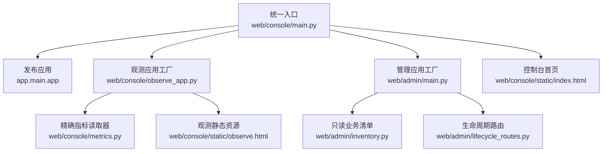
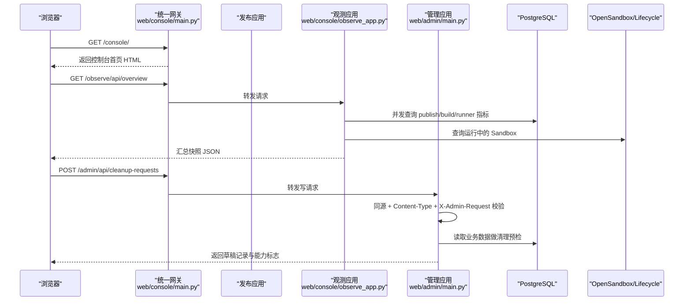
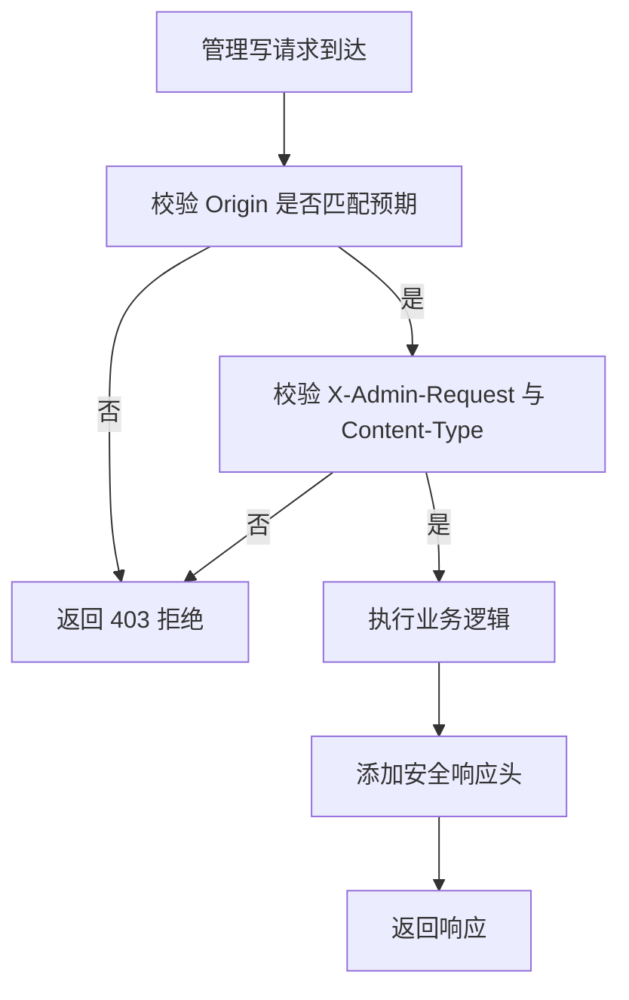
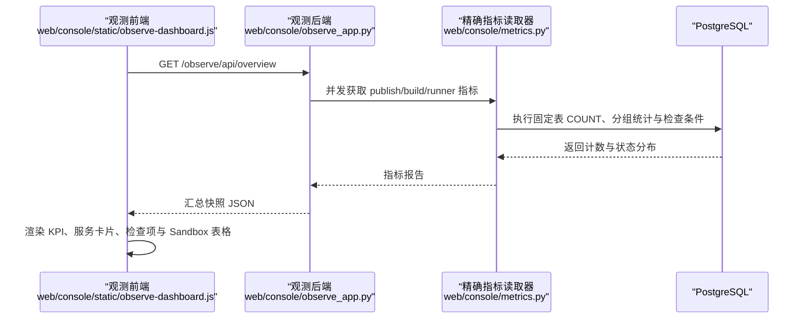
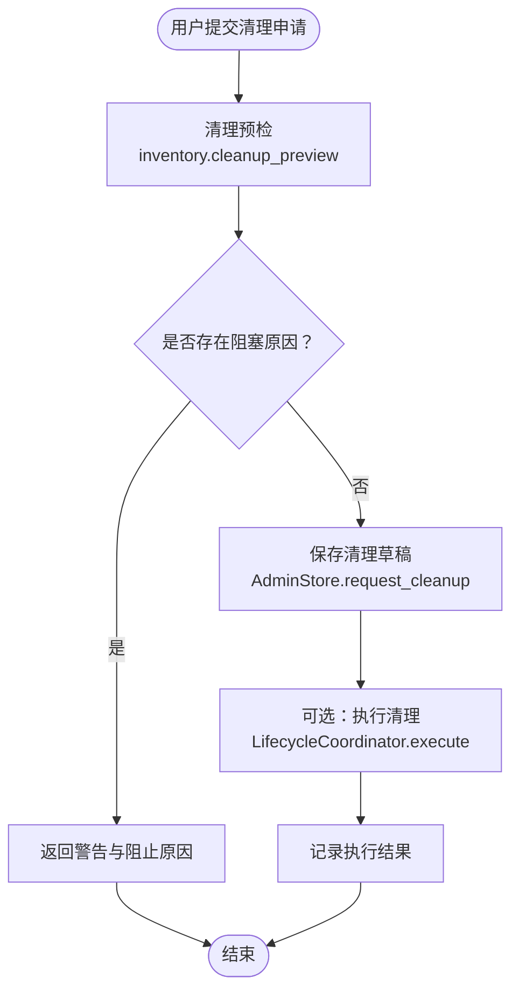
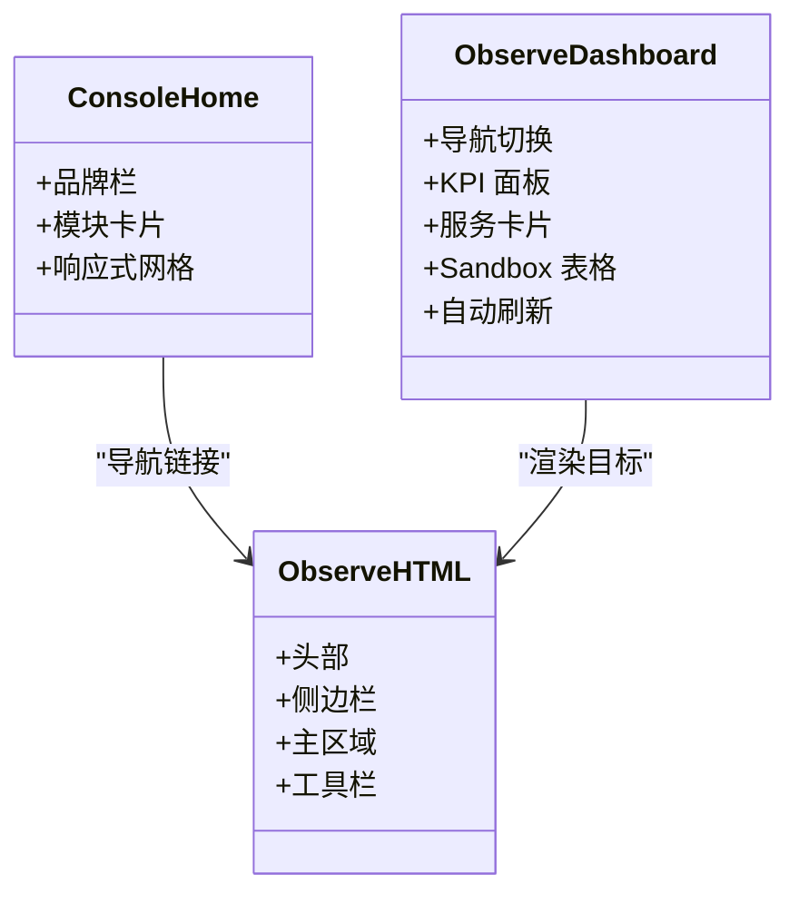
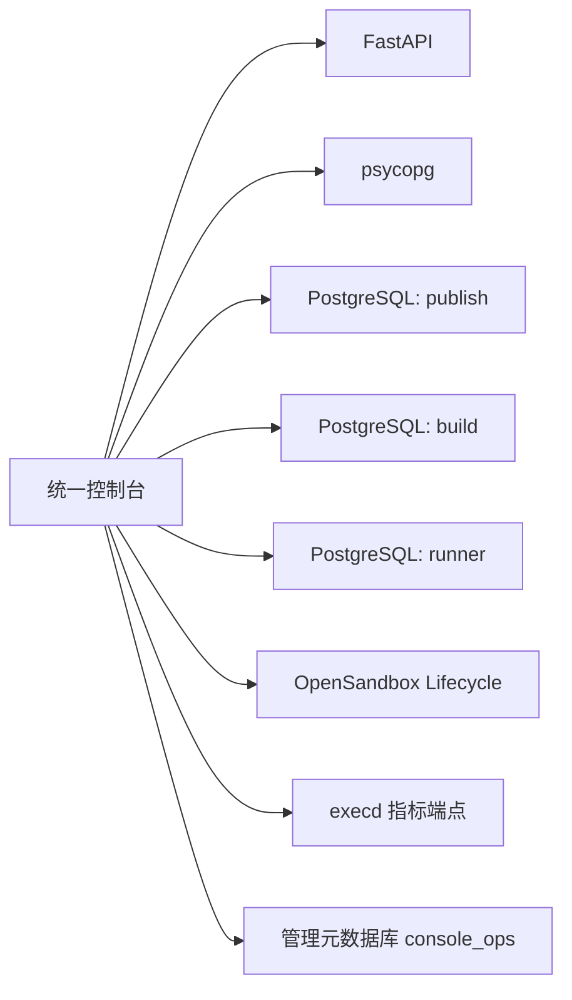

# 统一控制台

<cite>
**本文引用的文件**   
- [web/UNIFIED_CONSOLE_README.md](file://web/UNIFIED_CONSOLE_README.md)
- [web/console/main.py](file://web/console/main.py)
- [web/console/settings.py](file://web/console/settings.py)
- [web/console/observe_app.py](file://web/console/observe_app.py)
- [web/console/metrics.py](file://web/console/metrics.py)
- [web/console/sql_schemas.py](file://web/console/sql_schemas.py)
- [web/console/static/index.html](file://web/console/static/index.html)
- [web/console/static/home.css](file://web/console/static/home.css)
- [web/console/static/observe.html](file://web/console/static/observe.html)
- [web/console/static/observe-dashboard.js](file://web/console/static/observe-dashboard.js)
- [web/admin/main.py](file://web/admin/main.py)
- [web/admin/lifecycle_routes.py](file://web/admin/lifecycle_routes.py)
- [web/admin/inventory.py](file://web/admin/inventory.py)
</cite>

## 目录
1. [简介](#简介)
2. [项目结构](#项目结构)
3. [核心组件](#核心组件)
4. [架构总览](#架构总览)
5. [详细组件分析](#详细组件分析)
6. [依赖关系分析](#依赖关系分析)
7. [性能与可伸缩性](#性能与可伸缩性)
8. [故障排查指南](#故障排查指南)
9. [结论](#结论)
10. [附录：使用示例与最佳实践](#附录使用示例与最佳实践)

## 简介
统一控制台将“发布应用”“观测应用”和“管理应用”整合进一个 ASGI 进程，提供四个入口：
- `/`：原版算子发布页面及原有 API、静态资源保持不变。
- `/observe/`：基于固定 PostgreSQL Schema 的只读观测界面。
- `/admin/`：构建环境、Runner 资产、发布记录、清理预检与管理审计。
- `/console/`：三模块的统一导航入口。

该版本明确移除 Web 登录弹窗；所有页面免登录访问，因此必须通过防火墙、受控反向代理或内网限制网络访问。管理写请求通过同源校验、Content-Type 与自定义头进行防护，但不替代身份认证。

**章节来源**
- [web/UNIFIED_CONSOLE_README.md:1-83](file://web/UNIFIED_CONSOLE_README.md#L1-L83)

## 项目结构
统一控制台的核心位于 `web/console`，它复用原 `app`（发布）、挂载 `admin`（管理）和 `observe`（观测），并通过路由分发控制请求流向。



**图示来源**
- [web/console/main.py:34-115](file://web/console/main.py#L34-L115)
- [web/console/observe_app.py:25-109](file://web/console/observe_app.py#L25-L109)
- [web/admin/main.py:47-118](file://web/admin/main.py#L47-L118)
- [web/console/metrics.py:149-280](file://web/console/metrics.py#L149-L280)
- [web/admin/inventory.py:26-147](file://web/admin/inventory.py#L26-L147)
- [web/admin/lifecycle_routes.py:17-94](file://web/admin/lifecycle_routes.py#L17-L94)
- [web/console/static/index.html:1-28](file://web/console/static/index.html#L1-L28)

**章节来源**
- [web/console/main.py:1-115](file://web/console/main.py#L1-L115)
- [web/console/static/index.html:1-28](file://web/console/static/index.html#L1-L28)

## 核心组件
- 统一网关：`Unified` 类负责路径分发，保留原发布路径根 `/`，并将 `/observe/*`、`/admin/*`、`/console/*` 分别交给对应子应用。
- 配置层：`ConsoleSettings` 从环境变量加载数据库连接、Schema、OpenSandbox、execd 指标开关、管理元数据库 URL 等。
- 观测应用：`make_observe_app` 创建 FastAPI 应用，注入精确 PostgreSQL 读取器、Sandbox 读取器和 Runner 运行时读取器，并设置安全响应头。
- 管理应用：`make_admin_app` 提供资产备注、清理申请、重试 Build、生命周期计划与执行等接口，同时保护写操作。
- 指标读取器：`ExactPGReader` 仅依据固定 DDL 表名与列名生成 SQL，强制只读会话与语句超时。
- SQL Schema 路由：`sql_schemas` 允许覆盖服务对应的 PostgreSQL Schema，但严格校验标识符，不接收浏览器输入作为表名。

**章节来源**
- [web/console/main.py:34-115](file://web/console/main.py#L34-L115)
- [web/console/settings.py:23-84](file://web/console/settings.py#L23-L84)
- [web/console/observe_app.py:25-109](file://web/console/observe_app.py#L25-L109)
- [web/admin/main.py:47-118](file://web/admin/main.py#L47-L118)
- [web/console/metrics.py:149-280](file://web/console/metrics.py#L149-L280)
- [web/console/sql_schemas.py:10-49](file://web/console/sql_schemas.py#L10-L49)

## 架构总览
统一控制台采用“单进程多应用”架构：一个 FastAPI 网关聚合三个独立子应用，每个子应用专注一个职责域。



**图示来源**
- [web/console/main.py:91-112](file://web/console/main.py#L91-L112)
- [web/console/observe_app.py:61-102](file://web/console/observe_app.py#L61-L102)
- [web/admin/main.py:72-104](file://web/admin/main.py#L72-L104)
- [web/admin/main.py:288-312](file://web/admin/main.py#L288-L312)

## 详细组件分析

### 路由配置与请求分发
统一网关根据路径决定处理者：
- `/`、`/api/*`、`/static/*`：交给原发布应用。
- `/observe`、`/observe/`：重定向到 `/observe/`，并返回观测页。
- `/observe/...`：由观测应用处理 API 与静态资源。
- `/admin`：重定向到 `/admin/`。
- `/admin/edge`：兼容原发布边缘页面。
- `/admin/...`：由管理应用处理。
- `/console/...`：由控制台入口处理。

```mermaid
flowchart TD
Start(["进入统一网关"]) --> CheckPath["检查请求路径"]
CheckPath --> |"/observe" 或 "/observe/"| RedirectObserve["重定向到 /observe/"]
CheckPath --> |"/observe/*"| DispatchObserve["交给观测应用"]
CheckPath --> |"/admin"| RedirectAdmin["重定向到 /admin/"]
CheckPath --> |"/admin/edge"| DispatchPublish["交给发布应用"]
CheckPath --> |"/admin/*"| DispatchAdmin["交给管理应用"]
CheckPath --> |"/console" 或 "/console/*"| DispatchConsole["交给控制台入口"]
CheckPath --> |其他| DispatchPublish
RedirectObserve --> End(["结束"])
RedirectAdmin --> End
DispatchObserve --> End
DispatchAdmin --> End
DispatchConsole --> End
DispatchPublish --> End
```

**图示来源**
- [web/console/main.py:91-112](file://web/console/main.py#L91-L112)

**章节来源**
- [web/console/main.py:34-115](file://web/console/main.py#L34-L115)

### 认证授权与安全策略
- Web 登录已移除：统一入口忽略旧 Basic 和管理员变量，不再弹出登录框。
- 远程无认证访问需要显式开启：非本地绑定时必须设置 `CONSOLE_ALLOW_REMOTE_NO_AUTH=1` 与 `CONSOLE_PUBLIC_ORIGIN`。
- 管理写请求防护：
  - 要求 Origin 与预期同源一致。
  - 要求 `X-Admin-Request: 1`。
  - 要求 `Content-Type` 为 `application/json`。
  - 失败时返回 403。
- 响应安全头：禁用缓存、禁止嗅探、禁止嵌套框架、限制 Referrer 与内容安全策略。
- 数据库权限：使用只读角色，仅授予 SELECT 与 USAGE；连接启用只读事务与语句超时。



**图示来源**
- [web/admin/main.py:72-104](file://web/admin/main.py#L72-L104)
- [web/console/observe_app.py:47-59](file://web/console/observe_app.py#L47-L59)
- [web/console/settings.py:59-84](file://web/console/settings.py#L59-L84)

**章节来源**
- [web/UNIFIED_CONSOLE_README.md:65-111](file://web/UNIFIED_CONSOLE_README.md#L65-L111)
- [web/admin/main.py:72-104](file://web/admin/main.py#L72-L104)
- [web/console/observe_app.py:47-59](file://web/console/observe_app.py#L47-L59)
- [web/console/settings.py:59-84](file://web/console/settings.py#L59-L84)

### 观测模块：数据流与可视化
观测模块提供数据库指标与 OpenSandbox 状态视图：
- 后端 API：
  - `/observe/api/databases`：并发查询三个服务的指标报告。
  - `/observe/api/sandboxes`：查询 Sandbox 列表与资源采样。
  - `/observe/api/runner-runtime`：查询 Runner 运行时信息。
  - `/observe/api/overview`：汇总上述数据。
- 前端交互：
  - 支持手动刷新与自动刷新。
  - 展示 KPI、服务卡片、指标分布、检查项、表结构与字段清单。
  - Sandbox 视图支持搜索、排序、内存条与到期时间提示。



**图示来源**
- [web/console/observe_app.py:61-102](file://web/console/observe_app.py#L61-L102)
- [web/console/metrics.py:175-257](file://web/console/metrics.py#L175-L257)
- [web/console/static/observe-dashboard.js:340-377](file://web/console/static/observe-dashboard.js#L340-L377)

**章节来源**
- [web/console/observe_app.py:25-109](file://web/console/observe_app.py#L25-L109)
- [web/console/metrics.py:149-280](file://web/console/metrics.py#L149-L280)
- [web/console/static/observe.html:1-169](file://web/console/static/observe.html#L1-L169)
- [web/console/static/observe-dashboard.js:1-410](file://web/console/static/observe-dashboard.js#L1-L410)

### 管理模块：资产、清理与审计
管理模块不直接修改业务 Schema，而是：
- 读取业务数据做清理预检。
- 在独立管理数据库中保存备注、清理申请与审计事件。
- 通过 Build/Publish/Runner 的生命周期 API 协调真实清理动作。

关键流程：
- 预览清理影响：检查别名、活动构建任务、发布引用、Runner 租约。
- 提交清理申请：写入 DRAFT 记录，返回 `executed: false`。
- 执行清理：调用生命周期协调器，记录执行结果。
- Build 重试：仅在 FAILED 且无活动构建任务时可用，先审计后调用 Build Service。



**图示来源**
- [web/admin/inventory.py:206-336](file://web/admin/inventory.py#L206-L336)
- [web/admin/main.py:288-312](file://web/admin/main.py#L288-L312)
- [web/admin/lifecycle_routes.py:61-78](file://web/admin/lifecycle_routes.py#L61-L78)

**章节来源**
- [web/admin/main.py:47-338](file://web/admin/main.py#L47-L338)
- [web/admin/inventory.py:26-337](file://web/admin/inventory.py#L26-L337)
- [web/admin/lifecycle_routes.py:17-94](file://web/admin/lifecycle_routes.py#L17-L94)

### 前端组件：视觉外观、行为与交互
- 控制台首页：
  - 顶部品牌栏、产品名与版本号。
  - 三个模块卡片：算子发布、指标观测、运行资产管理。
  - 响应式网格布局，移动端单列显示。
- 观测页面：
  - 左侧导航切换“数据库指标”和“OpenSandbox”。
  - 全局健康状态指示器、刷新频率选择、立即刷新按钮。
  - 数据库指标卡片包含质量标签、总数、最近 24 小时变化、状态分布、后端分布与检查项。
  - Sandbox 表格支持搜索、排序、内存条、到期时间与资源状态提示。
- 样式与可访问性：
  - 使用系统字体栈与中性色板。
  - 大量 `aria-*` 属性与语义化标题。
  - 避免自动聚焦滚动，键盘友好。



**图示来源**
- [web/console/static/index.html:1-28](file://web/console/static/index.html#L1-L28)
- [web/console/static/home.css:1-26](file://web/console/static/home.css#L1-L26)
- [web/console/static/observe.html:1-169](file://web/console/static/observe.html#L1-L169)
- [web/console/static/observe-dashboard.js:1-410](file://web/console/static/observe-dashboard.js#L1-L410)

**章节来源**
- [web/console/static/index.html:1-28](file://web/console/static/index.html#L1-L28)
- [web/console/static/home.css:1-26](file://web/console/static/home.css#L1-L26)
- [web/console/static/observe.html:1-169](file://web/console/static/observe.html#L1-L169)
- [web/console/static/observe-dashboard.js:1-410](file://web/console/static/observe-dashboard.js#L1-L410)

## 依赖关系分析
统一控制台的关键依赖包括：
- FastAPI：网关与子应用框架。
- psycopg：PostgreSQL 只读连接。
- 业务数据库：publish、build、runner 三套 Schema。
- OpenSandbox Lifecycle API：Sandbox 实例状态。
- execd 指标端点：CPU/内存采样。
- 管理元数据库：可选，用于备注、清理申请与审计。



**图示来源**
- [web/console/main.py:34-58](file://web/console/main.py#L34-L58)
- [web/console/metrics.py:158-169](file://web/console/metrics.py#L158-L169)
- [web/console/observe_app.py:38-45](file://web/console/observe_app.py#L38-L45)
- [web/admin/main.py:47-63](file://web/admin/main.py#L47-L63)

**章节来源**
- [web/console/settings.py:33-84](file://web/console/settings.py#L33-L84)
- [web/console/metrics.py:149-280](file://web/console/metrics.py#L149-L280)
- [web/console/observe_app.py:25-109](file://web/console/observe_app.py#L25-L109)
- [web/admin/main.py:47-118](file://web/admin/main.py#L47-L118)

## 性能与可伸缩性
- 并发采集：观测 API 使用并发调用聚合数据库、Sandbox 与 Runner 运行时数据，减少整体延迟。
- 只读连接与超时：PostgreSQL 连接启用只读事务与语句超时，防止慢查询拖垮服务。
- 分页与上限：Sandbox 列表支持最大条目数与采样上限，避免一次性拉取过多实例。
- 前端节流：自动刷新间隔可配置，隐藏页面时暂停刷新，减少无效请求。
- 静态资源缓存：观测页面禁用缓存，避免陈旧快照误导运维判断。

优化建议：
- 合理设置 `OBS_SANDBOX_MAX_ITEMS` 与 `OBS_EXECD_SAMPLE_LIMIT`，平衡实时性与负载。
- 对高频查询的 PostgreSQL 索引应覆盖常用过滤列，例如状态、时间戳与过期时间。
- 在反向代理层启用连接池与超时，避免上游服务雪崩。
- 监控观测 API 的 P95 延迟与错误率，区分数据库不可用、权限不足与业务异常。

[本节为通用指导，不直接分析具体文件]

## 故障排查指南
常见问题与定位方法：
- 数据库未配置或不可达：
  - 检查 `OBS_PUBLISH_DB_URL`、`OBS_BUILD_DB_URL`、`OBS_RUNNER_DB_URL`。
  - 确认 PostgreSQL 角色具备 SELECT 与 USAGE 权限。
  - 查看指标报告中 `unconfigured` 或 `error` 状态与消息。
- Schema 名称不一致：
  - 使用 `OBS_*_DB_SCHEMA` 指定服务对应的 Schema。
  - 注意 Schema 标识符只能包含字母、数字和下划线，不能以数字开头。
- 权限不足导致查询失败：
  - 指标质量标记为 `error` 时会提示检查表、列与 SELECT 权限。
- OpenSandbox 未配置或资源指标未启用：
  - 检查 `OBS_SANDBOX_URL`、`OBS_SANDBOX_API_KEY`。
  - 如需 CPU/内存，启用 `OBS_EXECD_METRICS` 并配置允许的 execd Origin。
- 管理写请求被拒绝：
  - 确认 Origin、`X-Admin-Request` 与 `Content-Type` 正确。
  - 若远程访问，确保已设置 `CONSOLE_ALLOW_REMOTE_NO_AUTH=1` 与 `CONSOLE_PUBLIC_ORIGIN`。

**章节来源**
- [web/console/metrics.py:213-257](file://web/console/metrics.py#L213-L257)
- [web/console/sql_schemas.py:15-39](file://web/console/sql_schemas.py#L15-L39)
- [web/admin/main.py:72-104](file://web/admin/main.py#L72-L104)
- [web/console/settings.py:59-84](file://web/console/settings.py#L59-L84)

## 结论
统一控制台以最小侵入方式整合发布、观测与管理功能，保持原发布代码不变，同时提供清晰的三模块入口。其安全模型强调网络隔离与同源校验，而非 Web 登录；数据访问严格限定于固定 DDL 与只读权限。观测模块提供精确、可解释的指标口径，管理模块通过预检与生命周期 API 协调清理，避免误删风险。部署时应优先保障网络访问控制与数据库最小权限，再考虑扩展功能与性能参数。

[本节为总结性内容，不直接分析具体文件]

## 附录：使用示例与最佳实践

### 启动与基础配置
- 安装依赖并设置环境变量：
  - 发布服务地址：`MPR_PUBLISH_SERVICE_URL`
  - 三个数据库 URL：`OBS_PUBLISH_DB_URL`、`OBS_BUILD_DB_URL`、`OBS_RUNNER_DB_URL`
  - 三个 Schema：`OBS_PUBLISH_DB_SCHEMA`、`OBS_BUILD_DB_SCHEMA`、`OBS_RUNNER_DB_SCHEMA`
  - OpenSandbox：`OBS_SANDBOX_URL`、`OBS_SANDBOX_API_KEY`
  - execd 指标：`OBS_EXECD_METRICS`、`OBS_EXECD_ALLOWED_ORIGINS`、`OBS_EXECD_SAMPLE_LIMIT`
  - 管理元数据库：`ADMIN_DB_URL`
  - Build 重试：`ADMIN_BUILD_SERVICE_URL`、`ADMIN_BUILD_BEARER_TOKEN`
- 启动命令：
  - `python -m console.main --host 127.0.0.1 --port 9095`
  - 远程访问需额外设置 `CONSOLE_ALLOW_REMOTE_NO_AUTH=1` 与 `CONSOLE_PUBLIC_ORIGIN`

**章节来源**
- [web/UNIFIED_CONSOLE_README.md:8-63](file://web/UNIFIED_CONSOLE_README.md#L8-L63)
- [web/console/settings.py:33-84](file://web/console/settings.py#L33-L84)

### 路由与入口对照
- `/`：发布工作台与原有 API。
- `/observe/`：观测仪表盘。
- `/admin/`：运行资产管理。
- `/console/`：统一导航入口。

**章节来源**
- [web/UNIFIED_CONSOLE_README.md:65-72](file://web/UNIFIED_CONSOLE_README.md#L65-L72)
- [web/console/main.py:64-89](file://web/console/main.py#L64-L89)

### 安全部署要点
- 不要将免登录管理端口暴露公网。
- 使用防火墙、VPN 或受控反向代理限制访问。
- 为 PostgreSQL 创建只读角色，仅授予所需数据库与 Schema 的 USAGE/SELECT。
- 管理写请求必须来自可信同源，并携带必要请求头。

**章节来源**
- [web/UNIFIED_CONSOLE_README.md:74-111](file://web/UNIFIED_CONSOLE_README.md#L74-L111)
- [web/admin/main.py:72-104](file://web/admin/main.py#L72-L104)