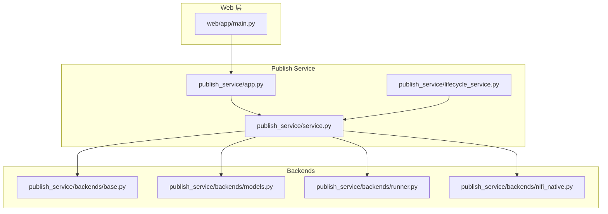
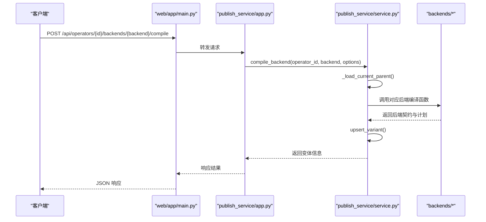
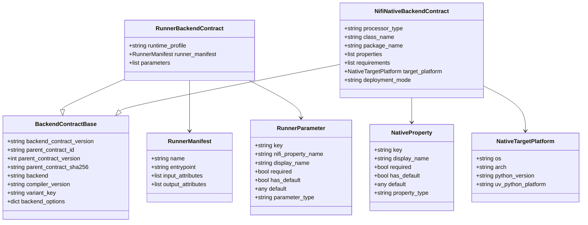
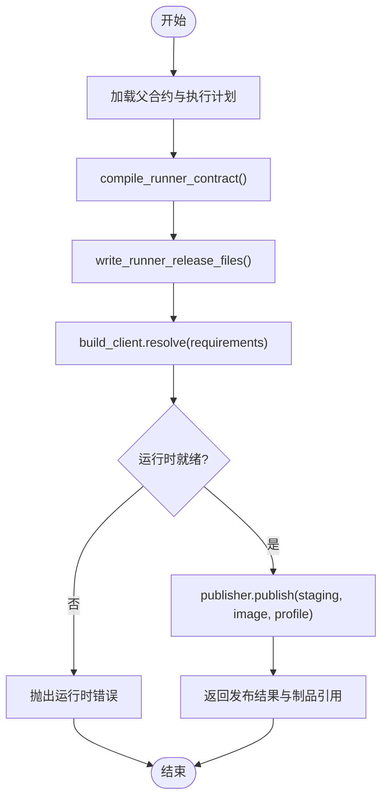
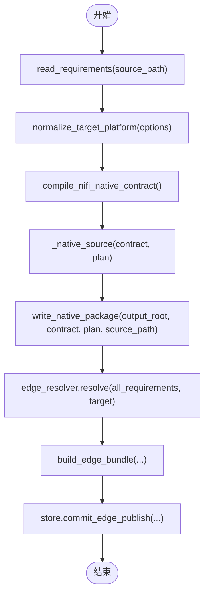
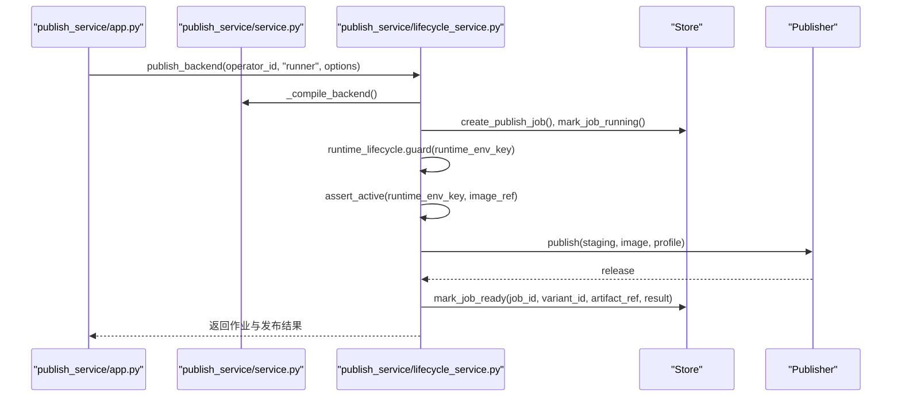
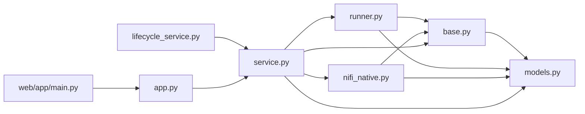

# 后端插件开发

<cite>
**本文引用的文件**   
- [publish_service/backends/base.py](file://publish_service/backends/base.py)
- [publish_service/backends/models.py](file://publish_service/backends/models.py)
- [publish_service/backends/runner.py](file://publish_service/backends/runner.py)
- [publish_service/backends/nifi_native.py](file://publish_service/backends/nifi_native.py)
- [publish_service/service.py](file://publish_service/service.py)
- [publish_service/lifecycle_service.py](file://publish_service/lifecycle_service.py)
- [publish_service/app.py](file://publish_service/app.py)
- [web/app/main.py](file://web/app/main.py)
</cite>

## 目录
1. [引言](#引言)
2. [项目结构](#项目结构)
3. [核心组件](#核心组件)
4. [架构总览](#架构总览)
5. [详细组件分析](#详细组件分析)
6. [依赖关系分析](#依赖关系分析)
7. [性能与优化](#性能与优化)
8. [错误处理与排错](#错误处理与排错)
9. [测试与调试](#测试与调试)
10. [结论](#结论)

## 引言
本指南面向 Runner Engine 的后端插件开发者，目标是帮助你理解并扩展“后端插件”体系。当前仓库中并未定义名为 BaseBackend 的抽象基类；后端插件以“函数式后端 + 模型契约 + 服务编排”的方式组织：
- 每个后端是一个模块，提供编译、产物生成等函数。
- 所有后端共享统一的契约模型和变体键计算工具。
- PublishService 负责调度后端、持久化变体、触发发布流程。
- LifecyclePublishService 在 Runner 后端上叠加运行时生命周期管理。

如果你希望新增一个自定义执行后端，应遵循现有模式：实现编译函数、产物写入函数，并在服务层注册路由与分发逻辑。

## 项目结构
与后端插件直接相关的代码集中在 publish_service 下：
- backends：后端实现与契约模型
- service：后端编译与发布的统一编排
- lifecycle_service：Runner 后端的运行时生命周期增强
- app：HTTP 路由入口
- web/app/main.py：前端代理到后端 API

**图表来源**
- [web/app/main.py:152-162](file://web/app/main.py#L152-L162)
- [publish_service/app.py:233-254](file://publish_service/app.py#L233-L254)
- [publish_service/service.py:569-622](file://publish_service/service.py#L569-L622)
- [publish_service/backends/base.py:10-27](file://publish_service/backends/base.py#L10-L27)
- [publish_service/backends/models.py:10-72](file://publish_service/backends/models.py#L10-L72)
- [publish_service/backends/runner.py:23-67](file://publish_service/backends/runner.py#L23-L67)
- [publish_service/backends/nifi_native.py:103-168](file://publish_service/backends/nifi_native.py#L103-L168)

**章节来源**
- [publish_service/backends/base.py:10-27](file://publish_service/backends/base.py#L10-L27)
- [publish_service/backends/models.py:10-72](file://publish_service/backends/models.py#L10-L72)
- [publish_service/backends/runner.py:23-67](file://publish_service/backends/runner.py#L23-L67)
- [publish_service/backends/nifi_native.py:103-168](file://publish_service/backends/nifi_native.py#L103-L168)
- [publish_service/service.py:569-622](file://publish_service/service.py#L569-L622)
- [publish_service/lifecycle_service.py:52-90](file://publish_service/lifecycle_service.py#L52-L90)
- [publish_service/app.py:233-254](file://publish_service/app.py#L233-L254)
- [web/app/main.py:152-162](file://web/app/main.py#L152-L162)

## 核心组件
- 后端契约基础模型：BackendContractBase 为所有后端契约提供公共字段，包括父合约标识、编译器版本、变体键、后端选项等。
- Runner 后端契约：RunnerBackendContract 描述 Runner 运行所需的清单、参数映射、运行时配置。
- NiFi Native 后端契约：NifiNativeBackendContract 描述原生处理器类名、包名、属性、目标平台、依赖等。
- 变体键与合约摘要：backend_variant_key 用于根据合约摘要、后端类型、编译器版本与选项生成稳定变体键；backend_contract_sha256 用于对后端契约进行摘要校验。

这些组件共同构成后端插件的“契约层”，确保不同后端产物可被统一识别、比较与存储。

**章节来源**
- [publish_service/backends/models.py:10-72](file://publish_service/backends/models.py#L10-L72)
- [publish_service/backends/base.py:10-27](file://publish_service/backends/base.py#L10-L27)

## 架构总览
后端插件的调用链从 Web 层进入，经 HTTP 路由转发至 PublishService，再由服务层选择具体后端函数完成编译与发布。

**图表来源**
- [web/app/main.py:152-162](file://web/app/main.py#L152-L162)
- [publish_service/app.py:233-254](file://publish_service/app.py#L233-L254)
- [publish_service/service.py:569-622](file://publish_service/service.py#L569-L622)

## 详细组件分析

### 后端契约与模型
- BackendContractBase：继承自 VirtualOperatorContract，增加后端相关元数据（父合约、编译器版本、变体键、后端选项）。
- RunnerBackendContract：声明 runner 后端特有字段，如 runtime_profile、runner_manifest、parameters。
- NifiNativeBackendContract：声明 nifi_native 后端特有字段，如 class_name、package_name、properties、target_platform、deployment_mode。
- RunnerManifest 与 RunnerParameter：描述 Runner 运行时的入口、输入输出属性与参数映射。
- NativeProperty 与 NativeTargetPlatform：描述 NiFi Native 的属性与目标平台。

**图表来源**
- [publish_service/backends/models.py:10-72](file://publish_service/backends/models.py#L10-L72)

**章节来源**
- [publish_service/backends/models.py:10-72](file://publish_service/backends/models.py#L10-L72)

### Runner 后端
Runner 后端的核心职责：
- 将虚拟算子契约编译为 Runner 后端契约。
- 生成 Runner 发行文件：operator-contract.yaml、__dsc_entry__.py、operator.yaml、publish-info.json。
- 通过 build_client 解析运行时环境，并通过 publisher 发布产物。

关键流程：
- compile_runner_contract：基于 ExecutionPlan 生成 RunnerBackendContract，包含 profile、variant_key、manifest、parameters。
- write_runner_release_files：将契约与适配器脚本写入临时目录，供后续发布。
- PublishService._publish_runner：协调构建服务、发布器，最终返回 releaseId、runtimeImage、processorDefinition 等信息。

**图表来源**
- [publish_service/backends/runner.py:23-67](file://publish_service/backends/runner.py#L23-L67)
- [publish_service/backends/runner.py:70-114](file://publish_service/backends/runner.py#L70-L114)
- [publish_service/service.py:711-774](file://publish_service/service.py#L711-L774)

**章节来源**
- [publish_service/backends/runner.py:23-114](file://publish_service/backends/runner.py#L23-L114)
- [publish_service/service.py:711-774](file://publish_service/service.py#L711-L774)

### NiFi Native 后端
NiFi Native 后端的核心职责：
- 将虚拟算子契约编译为 NifiNativeBackendContract，包含类名、包名、属性、目标平台、requirements。
- 生成 Python 源模板，封装 FlowFileTransform 处理器，绑定输入、元数据、参数与返回值。
- 打包为 zip 包，并与边缘依赖解析、Bundle 构建集成。

关键流程：
- compile_nifi_native_contract：读取 requirements，规范化目标平台，生成契约。
- _native_source：渲染 Python 模板，注入 plan 与 properties。
- write_native_package：创建临时目录，复制 runtime 与 requirements，生成 edge-target.json，压缩为 zip。
- PublishService._publish_native：与 EdgeDependencyResolver 协作，构建 edge bundle，提交数据库记录。

**图表来源**
- [publish_service/backends/nifi_native.py:103-168](file://publish_service/backends/nifi_native.py#L103-L168)
- [publish_service/backends/nifi_native.py:504-581](file://publish_service/backends/nifi_native.py#L504-L581)
- [publish_service/service.py:823-976](file://publish_service/service.py#L823-L976)

**章节来源**
- [publish_service/backends/nifi_native.py:103-168](file://publish_service/backends/nifi_native.py#L103-L168)
- [publish_service/backends/nifi_native.py:504-581](file://publish_service/backends/nifi_native.py#L504-L581)
- [publish_service/service.py:823-976](file://publish_service/service.py#L823-L976)

### 服务编排与生命周期
- PublishService：统一编排后端编译与发布，维护变体、作业状态、边缘部署与 Bundle。
- LifecyclePublishService：针对 Runner 后端，增加运行时退役保护，确保发布期间运行时不被回收。

**图表来源**
- [publish_service/lifecycle_service.py:52-90](file://publish_service/lifecycle_service.py#L52-L90)
- [publish_service/lifecycle_service.py:92-168](file://publish_service/lifecycle_service.py#L92-L168)
- [publish_service/service.py:644-709](file://publish_service/service.py#L644-L709)

**章节来源**
- [publish_service/service.py:644-709](file://publish_service/service.py#L644-L709)
- [publish_service/lifecycle_service.py:52-168](file://publish_service/lifecycle_service.py#L52-L168)

## 依赖关系分析
- 后端模块依赖：
  - base：提供变体键与合约摘要工具。
  - models：定义后端契约数据结构。
  - runner：Runner 后端编译与产物生成。
  - nifi_native：NiFi Native 后端编译、模板渲染与打包。
- 服务层依赖：
  - service：组合上述后端模块，协调构建服务、发布器、边缘依赖解析器与存储。
  - lifecycle_service：在 Runner 后端上叠加运行时生命周期保护。
- Web 层依赖：
  - web/app/main.py：将前端请求转发到 publish_service/app.py。
  - publish_service/app.py：暴露 /v1/operators/{operator_id}/backends/{backend}/compile 与 publish 接口。

**图表来源**
- [publish_service/backends/base.py:10-27](file://publish_service/backends/base.py#L10-L27)
- [publish_service/backends/models.py:10-72](file://publish_service/backends/models.py#L10-L72)
- [publish_service/backends/runner.py:23-114](file://publish_service/backends/runner.py#L23-L114)
- [publish_service/backends/nifi_native.py:103-581](file://publish_service/backends/nifi_native.py#L103-L581)
- [publish_service/service.py:569-976](file://publish_service/service.py#L569-L976)
- [publish_service/lifecycle_service.py:52-168](file://publish_service/lifecycle_service.py#L52-L168)
- [publish_service/app.py:233-254](file://publish_service/app.py#L233-L254)
- [web/app/main.py:152-162](file://web/app/main.py#L152-L162)

**章节来源**
- [publish_service/backends/base.py:10-27](file://publish_service/backends/base.py#L10-L27)
- [publish_service/backends/models.py:10-72](file://publish_service/backends/models.py#L10-L72)
- [publish_service/backends/runner.py:23-114](file://publish_service/backends/runner.py#L23-L114)
- [publish_service/backends/nifi_native.py:103-581](file://publish_service/backends/nifi_native.py#L103-L581)
- [publish_service/service.py:569-976](file://publish_service/service.py#L569-L976)
- [publish_service/lifecycle_service.py:52-168](file://publish_service/lifecycle_service.py#L52-L168)
- [publish_service/app.py:233-254](file://publish_service/app.py#L233-L254)
- [web/app/main.py:152-162](file://web/app/main.py#L152-L162)

## 性能与优化
- 变体键稳定性：使用 backend_variant_key 将合约摘要、后端类型、编译器版本与选项归一化为稳定键，避免重复编译与冗余产物。
- 运行时复用：Runner 后端通过 build_client.resolve 复用已构建的运行环境，减少重复构建开销。
- 边缘依赖合并：NiFi Native 后端聚合同一用户与目标平台的多个算子依赖，通过 EdgeDependencyResolver 一次性解析，降低冲突概率与构建次数。
- 临时目录隔离：发布过程使用临时目录，避免污染工作区，提升并发安全性。
- 锁与事务：边缘发布使用 edge_publish_lock 保证同一目标平台下的原子性更新，避免竞态条件。

[本节为通用指导，不直接分析具体文件]

## 错误处理与排错
- 运行时不可用：当 build_client.resolve 未返回有效运行时或状态非 READY，会抛出 PublishError，提示 RUNTIME_NOT_READY 或 RUNTIME_BUILD_FAILED。
- 依赖冲突：NiFi Native 后端在依赖解析失败时抛出 EdgeDependencyConflictError，附带冲突详情、候选算子与环境成员列表，便于定位问题。
- 运行时退役保护：LifecyclePublishService 在 Runner 发布前检查运行时是否处于退役阶段，若处于退役则拒绝发布，防止不一致状态。
- 路径安全：workspace 与 edge bundle 路径均进行相对路径校验，防止逃逸配置的根目录。

建议排查步骤：
- 检查 workspace 是否存在且包含 Python 源码。
- 确认 build_service 返回的运行时状态为 READY。
- 查看 EdgeDependencyConflictError 的 detail，核对 requirements 与目标平台。
- 对于 Runner 后端，确认运行时未被标记为退役。

**章节来源**
- [publish_service/service.py:711-774](file://publish_service/service.py#L711-L774)
- [publish_service/service.py:786-821](file://publish_service/service.py#L786-L821)
- [publish_service/lifecycle_service.py:124-128](file://publish_service/lifecycle_service.py#L124-L128)
- [publish_service/service.py:247-262](file://publish_service/service.py#L247-L262)

## 测试与调试
- 单元测试：参考 tests 目录中的测试文件，例如 test_opensandbox_backend.py、test_pool_destroy_id_parametric.py、test_publisher.py 等，学习如何构造 Mock 对象与服务上下文。
- 集成测试：integration/apply_lifecycle_integration.py 展示了如何通过编辑应用装配生命周期路由与服务，可用于端到端验证。
- 调试技巧：
  - 在 PublishService._compile_backend 与 _publish_runner/_publish_native 中添加日志，观察变体键、契约摘要与产物路径。
  - 使用临时目录打印 staging 内容，确认 operator-contract.yaml、__dsc_entry__.py、operator.yaml 是否正确生成。
  - 对 NiFi Native 后端，检查生成的 zip 包结构与 edge-target.json，确认类名、包名与属性映射正确。

[本节为通用指导，不直接分析具体文件]

## 结论
Runner Engine 的后端插件体系以“函数式后端 + 契约模型 + 服务编排”为核心。虽然不存在名为 BaseBackend 的抽象基类，但通过统一的契约模型与变体键机制，Runner 与 NiFi Native 后端实现了高度一致的编译与发布流程。新增自定义执行后端时，应遵循以下原则：
- 定义后端契约模型，继承 BackendContractBase。
- 实现编译函数与产物写入函数。
- 在服务层添加后端分支，注册编译与发布逻辑。
- 如需运行时保护，可在 LifecyclePublishService 中覆盖发布流程。
- 使用变体键与合约摘要确保产物可比较、可缓存、可追溯。

通过以上方法，你可以安全地扩展 Runner Engine 的执行后端，同时保持系统的一致性与可维护性。