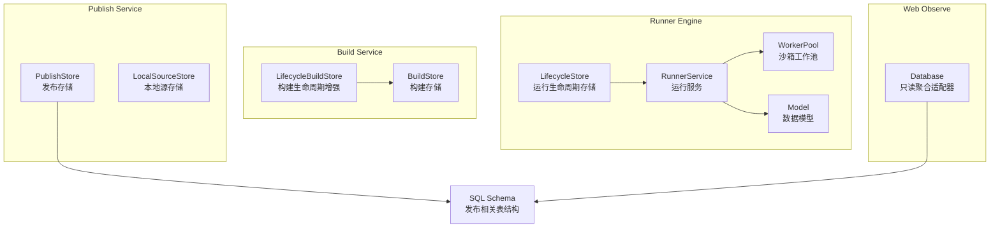
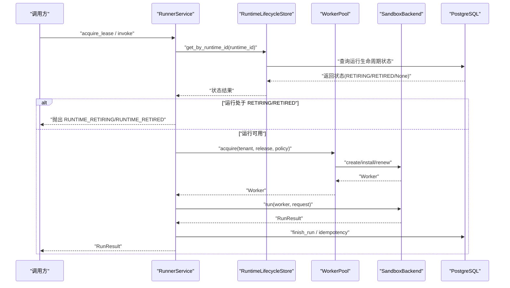
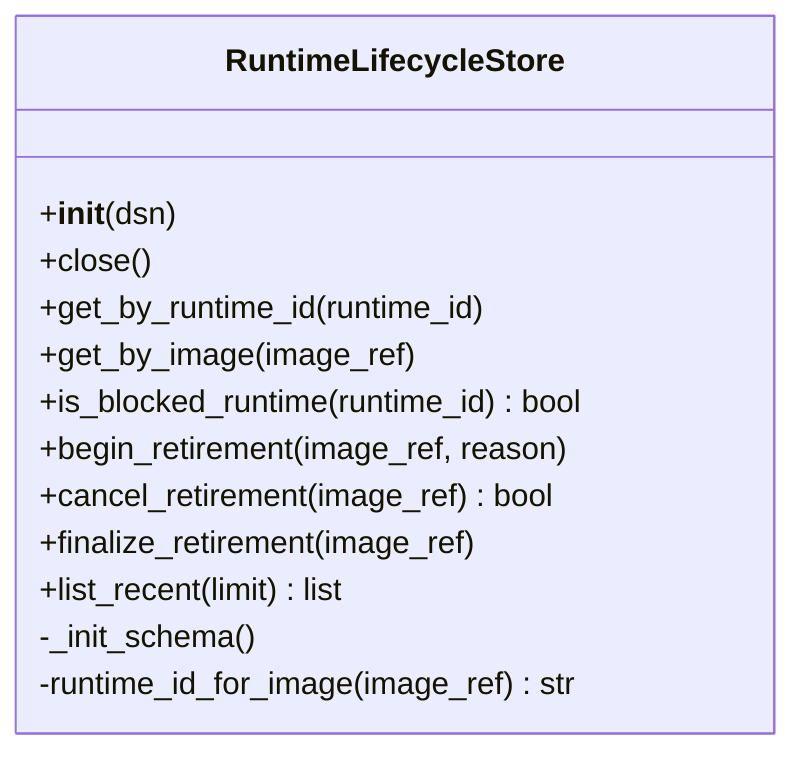
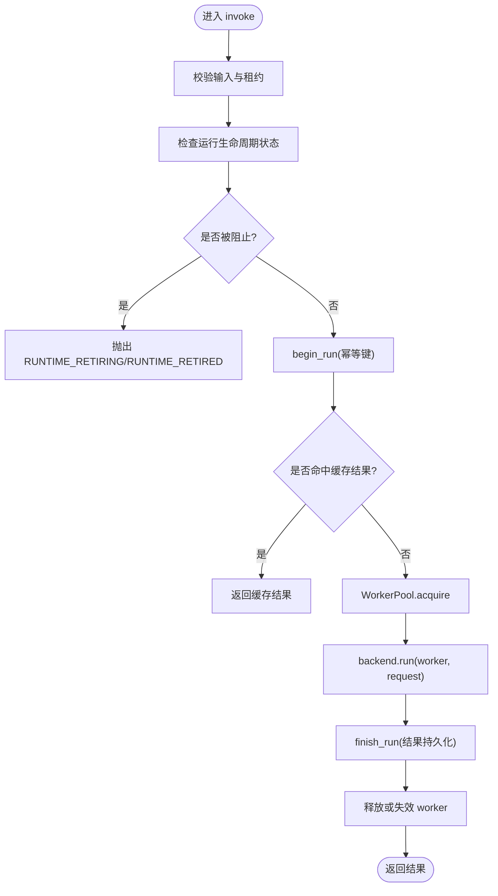
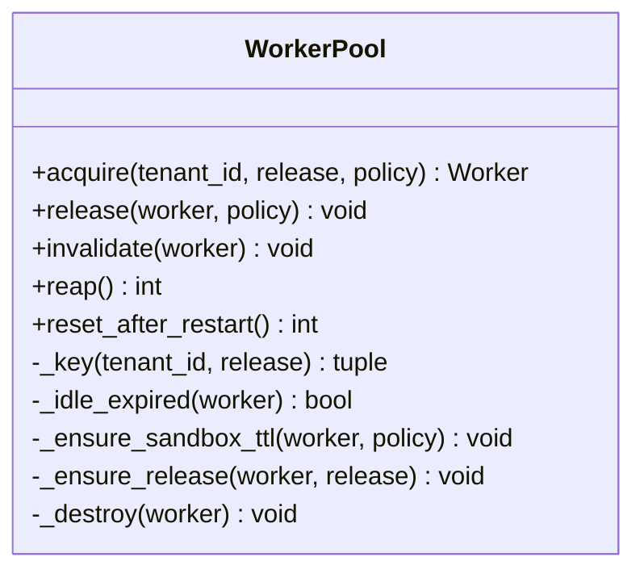
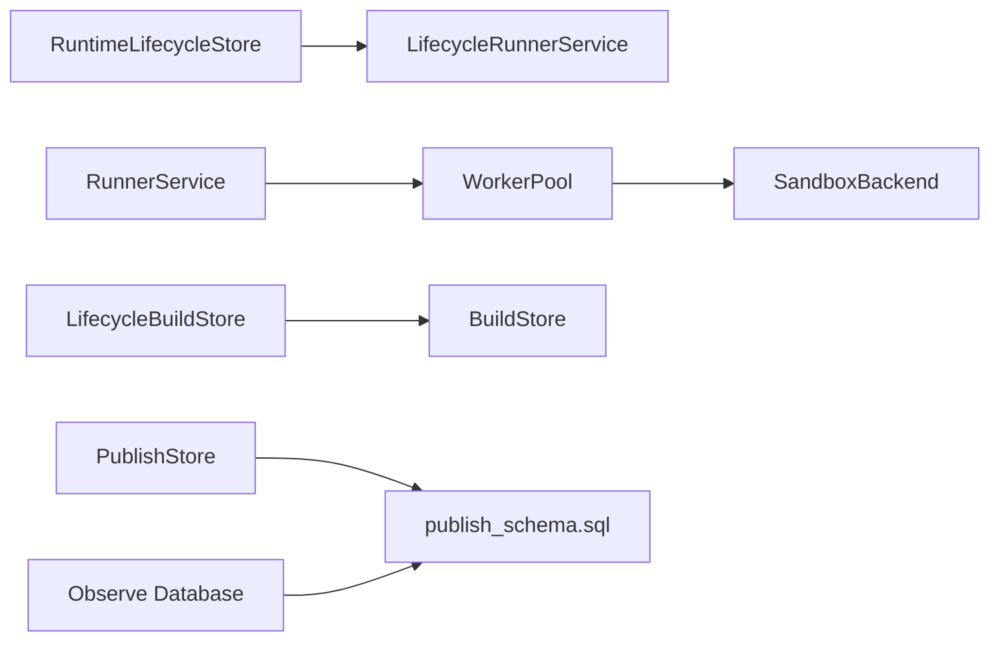

# 存储插件开发

<cite>
**本文引用的文件**   
- [lifecycle_store.py](file://runner_engine/lifecycle_store.py)
- [lifecycle_service.py](file://runner_engine/lifecycle_service.py)
- [service.py](file://runner_engine/service.py)
- [pool.py](file://runner_engine/pool.py)
- [model.py](file://runner_engine/model.py)
- [store.py](file://build_service/store.py)
- [lifecycle_service.py](file://build_service/lifecycle_service.py)
- [source_store.py](file://publish_service/source_store.py)
- [store.py](file://publish_service/store.py)
- [database.py](file://web/observe/database.py)
- [publish_schema.sql](file://sql/publish_schema.sql)
</cite>

## 目录
1. [引言](#引言)
2. [项目结构](#项目结构)
3. [核心组件](#核心组件)
4. [架构总览](#架构总览)
5. [详细组件分析](#详细组件分析)
6. [依赖关系分析](#依赖关系分析)
7. [性能与连接池管理](#性能与连接池管理)
8. [数据迁移与版本兼容](#数据迁移与版本兼容)
9. [监控指标与可观测性](#监控指标与可观测性)
10. [故障排查指南](#故障排查指南)
11. [结论](#结论)
12. [附录：自定义存储后端实现清单](#附录自定义存储后端实现清单)

## 引言
本指南面向 Runner Engine 的“存储层”扩展，目标是帮助开发者理解并实现自定义存储插件，以支持不同的数据存储方案。当前仓库中已存在一个基于 PostgreSQL 的运行生命周期存储实现，以及多个服务中的数据库访问模式。我们将以此为基础，抽象出统一的存储接口规范，并提供数据库、文件和对象存储的实现思路与示例路径，同时覆盖事务管理、并发控制、配置与连接池、数据迁移、性能调优和监控指标收集等关键主题。

## 项目结构
Runner Engine 的存储相关代码主要分布在以下位置：
- runner_engine：运行时引擎核心，包含生命周期状态持久化、服务编排、工作池与模型定义
- build_service：构建服务的存储与生命周期增强
- publish_service：发布服务的源存储与发布存储
- web/observe：只读聚合数据库适配器（用于监控）
- sql：发布相关的数据库 Schema 脚本

**图表来源**
- [lifecycle_store.py:35-151](file://runner_engine/lifecycle_store.py#L35-L151)
- [service.py:80-456](file://runner_engine/service.py#L80-L456)
- [pool.py:11-188](file://runner_engine/pool.py#L11-L188)
- [model.py:7-98](file://runner_engine/model.py#L7-L98)
- [store.py:65-120](file://build_service/store.py#L65-L120)
- [lifecycle_service.py:11-46](file://build_service/lifecycle_service.py#L11-L46)
- [store.py:17-257](file://publish_service/store.py#L17-L257)
- [source_store.py:12-40](file://publish_service/source_store.py#L12-L40)
- [database.py:1-44](file://web/observe/database.py#L1-L44)
- [publish_schema.sql:30-52](file://sql/publish_schema.sql#L30-L52)

**章节来源**
- [lifecycle_store.py:35-151](file://runner_engine/lifecycle_store.py#L35-L151)
- [service.py:80-456](file://runner_engine/service.py#L80-L456)
- [pool.py:11-188](file://runner_engine/pool.py#L11-L188)
- [model.py:7-98](file://runner_engine/model.py#L7-L98)
- [store.py:65-120](file://build_service/store.py#L65-L120)
- [lifecycle_service.py:11-46](file://build_service/lifecycle_service.py#L11-L46)
- [store.py:17-257](file://publish_service/store.py#L17-L257)
- [source_store.py:12-40](file://publish_service/source_store.py#L12-L40)
- [database.py:1-44](file://web/observe/database.py#L1-L44)
- [publish_schema.sql:30-52](file://sql/publish_schema.sql#L30-L52)

## 核心组件
- 运行生命周期存储 RuntimeLifecycleStore：负责镜像运行生命周期的持久化，包括开始退役、取消退役、完成退役、查询最近记录等。
- 运行服务 RunnerService：编排租约、执行请求、幂等性与结果持久化，并与 WorkerPool 协作。
- 工作池 WorkerPool：按租户+运行时+安全策略维度缓存沙箱，负责创建、续期、销毁与回收。
- 模型 Model：定义运行时环境、操作者发布、安全策略、租约、运行请求与结果等数据结构。
- 构建存储 BuildStore 与 LifecycleBuildStore：在构建服务中扩展运行时环境的生命周期字段与索引。
- 发布存储 PublishStore：管理虚拟合约、后端变体等发布相关数据。
- 本地源存储 LocalSourceStore：作为发布服务的本地源存储实现示例。
- 只读聚合数据库 Database：面向 Web 观察界面的只读聚合适配器，支持 SQLite 与可选 PostgreSQL。

**章节来源**
- [lifecycle_store.py:35-151](file://runner_engine/lifecycle_store.py#L35-L151)
- [service.py:80-456](file://runner_engine/service.py#L80-L456)
- [pool.py:11-188](file://runner_engine/pool.py#L11-L188)
- [model.py:7-98](file://runner_engine/model.py#L7-L98)
- [store.py:65-120](file://build_service/store.py#L65-L120)
- [lifecycle_service.py:11-46](file://build_service/lifecycle_service.py#L11-L46)
- [store.py:17-257](file://publish_service/store.py#L17-L257)
- [source_store.py:12-40](file://publish_service/source_store.py#L12-L40)
- [database.py:1-44](file://web/observe/database.py#L1-L44)

## 架构总览
Runner Engine 的存储层围绕“运行生命周期”这一关键业务域展开，通过数据库存储保障状态一致性；同时，其他服务（构建、发布）各自维护其领域存储。整体流程如下：

**图表来源**
- [lifecycle_service.py:19-32](file://runner_engine/lifecycle_service.py#L19-L32)
- [service.py:146-456](file://runner_engine/service.py#L146-L456)
- [pool.py:73-131](file://runner_engine/pool.py#L73-L131)
- [lifecycle_store.py:57-80](file://runner_engine/lifecycle_store.py#L57-L80)

## 详细组件分析

### 运行生命周期存储 RuntimeLifecycleStore
- 职责：提供运行镜像的生命周期状态持久化能力，包括开始退役、取消退役、完成退役、按 runtime_id 或 image_ref 查询、列出最近记录。
- 关键设计点：
  - 使用 psycopg_pool.ConnectionPool 管理连接池，最小连接数与最大连接数可配置。
  - 启动时初始化 schema，确保 runner.runtime_image_lifecycle 表与索引存在。
  - 使用 ON CONFLICT 与 CASE 表达式保证并发写入时的幂等与状态机正确性。
  - 提供 is_blocked_runtime 快速判断是否阻止新执行。
- 复杂度与性能：
  - 查询为单行主键或唯一索引查找，时间复杂度 O(log N)。
  - list_recent 使用 ORDER BY updated_at DESC LIMIT，适合分页与监控展示。
- 错误处理：
  - 构造时若未提供 DSN 将抛出异常，避免隐式失败。
  - 所有数据库操作均通过连接上下文执行，异常向上抛出由上层统一处理。

**图表来源**
- [lifecycle_store.py:35-151](file://runner_engine/lifecycle_store.py#L35-L151)

**章节来源**
- [lifecycle_store.py:35-151](file://runner_engine/lifecycle_store.py#L35-L151)

### 运行服务 RunnerService 与生命周期门控
- 职责：编排租约、执行请求、幂等性、结果持久化，并通过 LifecycleRunnerService 对运行生命周期进行门控。
- 生命周期门控逻辑：
  - 在 acquire_lease、renew_lease、invoke 前检查运行生命周期状态。
  - 若状态为 RETIRING 或 RETIRED，则抛出相应错误，阻止新执行。
- 并发控制：
  - 使用线程锁保护内存中的活跃调用映射，防止重复 invocation_id。
  - 数据库层通过 begin_run/finish_run 保证幂等与结果一致性。
- 错误处理：
  - 对超时、取消、用户异常等错误进行分类，决定是否重用 worker。
  - 基础设施异常标记为重试型错误，便于客户端重试。

**图表来源**
- [service.py:188-406](file://runner_engine/service.py#L188-L406)
- [lifecycle_service.py:19-32](file://runner_engine/lifecycle_service.py#L19-L32)

**章节来源**
- [service.py:80-456](file://runner_engine/service.py#L80-L456)
- [lifecycle_service.py:1-71](file://runner_engine/lifecycle_service.py#L1-L71)

### 工作池 WorkerPool
- 职责：按租户+运行时+安全策略维度缓存沙箱，负责创建、安装发布、续期、销毁与回收。
- 关键设计点：
  - idle_seconds 控制空闲回收，orphan_ttl_seconds 控制孤儿清理阈值。
  - renew_before_seconds 控制续期提前量，结合策略 max_timeout_ms 计算安全余量。
  - max_installed_releases 限制每个沙箱安装的发布数量，避免资源膨胀。
- 并发控制：
  - 使用 RLock 保护内部空闲列表与销毁逻辑，确保 exactly-once 销毁。
- 性能特性：
  - 优先复用空闲 worker，减少创建开销。
  - 批量清理 stale workers，降低内存占用。

**图表来源**
- [pool.py:11-188](file://runner_engine/pool.py#L11-L188)

**章节来源**
- [pool.py:11-188](file://runner_engine/pool.py#L11-L188)

### 构建服务存储 BuildStore 与生命周期增强
- BuildStore：构建服务的基础存储抽象，负责构建相关数据的持久化。
- LifecycleBuildStore：在 BuildStore 基础上扩展运行时环境的生命周期字段与索引，使构建产物具备退役管理能力。
- 关键设计点：
  - 通过 ALTER TABLE 添加 lifecycle_state、last_used_at、retired_at、artifact_deleted_at、cleanup_error 等字段。
  - 建立复合索引优化生命周期查询与清理任务。

**章节来源**
- [store.py:65-120](file://build_service/store.py#L65-L120)
- [lifecycle_service.py:11-46](file://build_service/lifecycle_service.py#L11-L46)

### 发布服务存储 PublishStore 与本地源存储 LocalSourceStore
- PublishStore：管理虚拟合约、后端变体等发布相关数据，提供 upsert_variant、list_variants 等方法。
- LocalSourceStore：作为发布服务的本地源存储实现示例，演示如何封装底层文件系统或对象存储。
- 关键设计点：
  - 使用 JSONB 存储 options_json 与 backend_contract_json，保持灵活性与可扩展性。
  - 通过 UNIQUE 约束与索引优化查询性能。

**章节来源**
- [store.py:17-257](file://publish_service/store.py#L17-L257)
- [source_store.py:12-40](file://publish_service/source_store.py#L12-L40)

### 只读聚合数据库 Database
- 职责：为 Web 观察界面提供只读聚合数据，支持 SQLite 与可选 PostgreSQL。
- 关键设计点：
  - 通过系统目录发现表名，不直接暴露业务记录。
  - 定义 Metric 元数据，支持多别名与后端细分统计。

**章节来源**
- [database.py:1-44](file://web/observe/database.py#L1-L44)

## 依赖关系分析
- RunnerEngine 内部依赖：
  - LifecycleRunnerService 依赖 RuntimeLifecycleStore 进行生命周期门控。
  - RunnerService 依赖 WorkerPool 与 RunnerDB（由 service.py 中的 state 模块提供）。
  - WorkerPool 依赖 SandboxBackend（具体实现位于 sandbox/backend.py）。
- 跨服务依赖：
  - BuildService 的 LifecycleBuildStore 依赖基础 BuildStore。
  - PublishService 的 PublishStore 依赖数据库 Schema（publish_schema.sql）。
  - Web Observe 的 Database 依赖系统目录与可选 PostgreSQL。

**图表来源**
- [lifecycle_service.py:1-71](file://runner_engine/lifecycle_service.py#L1-L71)
- [service.py:80-456](file://runner_engine/service.py#L80-L456)
- [pool.py:11-188](file://runner_engine/pool.py#L11-L188)
- [lifecycle_service.py:11-46](file://build_service/lifecycle_service.py#L11-L46)
- [store.py:17-257](file://publish_service/store.py#L17-L257)
- [publish_schema.sql:30-52](file://sql/publish_schema.sql#L30-L52)
- [database.py:1-44](file://web/observe/database.py#L1-L44)

**章节来源**
- [lifecycle_service.py:1-71](file://runner_engine/lifecycle_service.py#L1-L71)
- [service.py:80-456](file://runner_engine/service.py#L80-L456)
- [pool.py:11-188](file://runner_engine/pool.py#L11-L188)
- [lifecycle_service.py:11-46](file://build_service/lifecycle_service.py#L11-L46)
- [store.py:17-257](file://publish_service/store.py#L17-L257)
- [publish_schema.sql:30-52](file://sql/publish_schema.sql#L30-L52)
- [database.py:1-44](file://web/observe/database.py#L1-L44)

## 性能与连接池管理
- 连接池配置：
  - RuntimeLifecycleStore 使用 psycopg_pool.ConnectionPool，默认 min_size=1、max_size=4，可根据负载调整。
  - 建议在高并发场景下增大 max_size，并结合数据库服务器连接上限进行容量规划。
- 查询优化：
  - 使用索引优化常见查询路径，如 runner.runtime_image_lifecycle(state, updated_at DESC)。
  - 对于 list_recent，限制 limit 范围（1-500），避免大结果集拖慢响应。
- 工作池优化：
  - 合理设置 idle_seconds、orphan_ttl_seconds、renew_before_seconds，平衡资源利用率与延迟。
  - 根据发布规模调整 max_installed_releases，避免单个沙箱过度膨胀。
- 幂等与缓存：
  - RunnerService 通过 begin_run/finish_run 与 idempotency_key 实现请求级幂等，减少重复执行。
  - 缓存命中可直接返回结果，提升吞吐。

**章节来源**
- [lifecycle_store.py:40-47](file://runner_engine/lifecycle_store.py#L40-L47)
- [lifecycle_store.py:138-150](file://runner_engine/lifecycle_store.py#L138-L150)
- [pool.py:19-43](file://runner_engine/pool.py#L19-L43)
- [service.py:245-331](file://runner_engine/service.py#L245-L331)

## 数据迁移与版本兼容
- 运行时生命周期存储：
  - 启动时自动执行 SCHEMA 语句，确保表与索引存在，具备幂等性。
  - 新增字段或索引应遵循 IF NOT EXISTS 与 ADD COLUMN IF NOT EXISTS 模式，避免破坏现有部署。
- 构建服务生命周期增强：
  - 通过 ALTER TABLE 添加生命周期相关字段与索引，确保向后兼容。
- 发布服务 Schema：
  - 使用 publish_schema.sql 管理发布相关表结构，变更需通过迁移脚本逐步推进。
- 最佳实践：
  - 所有迁移脚本应具备幂等性，支持多次执行。
  - 对关键字段添加 CHECK 约束与默认值，保证数据完整性。
  - 在升级前评估影响面，必要时提供回滚脚本。

**章节来源**
- [lifecycle_store.py:10-28](file://runner_engine/lifecycle_store.py#L10-L28)
- [lifecycle_service.py:14-46](file://build_service/lifecycle_service.py#L14-L46)
- [publish_schema.sql:30-52](file://sql/publish_schema.sql#L30-L52)

## 监控指标与可观测性
- 只读聚合数据库：
  - 定义 Metric 元数据，支持 operators、contracts、variants、jobs 等指标的别名与后端细分。
  - 通过系统目录发现表名，避免硬编码业务表结构。
- 建议指标：
  - 运行生命周期状态分布（RETIRING/RETIRED 计数）。
  - 工作池大小、空闲率、创建/销毁速率。
  - 数据库连接池使用率、慢查询次数。
  - 发布变体编译成功率与失败原因分布。
- 采集方式：
  - 定期轮询数据库视图或聚合表，导出到监控系统（如 Prometheus）。
  - 在关键路径埋点日志，结合结构化日志进行分析。

**章节来源**
- [database.py:22-44](file://web/observe/database.py#L22-L44)

## 故障排查指南
- 运行时生命周期阻塞：
  - 检查 RuntimeLifecycleStore 的状态查询结果，确认是否处于 RETIRING/RETIRED。
  - 查看 begin_retirement/finalize_retirement 的执行日志，确认状态转换是否成功。
- 工作池问题：
  - 检查 WorkerPool 的 idle 列表与销毁逻辑，确认是否存在孤儿 worker。
  - 调整 idle_seconds 与 orphan_ttl_seconds，观察回收行为变化。
- 数据库连接问题：
  - 检查 ConnectionPool 的配置与连接数上限，确认是否达到数据库限制。
  - 查看慢查询日志，优化高频查询路径。
- 发布服务错误：
  - 检查 PublishStore 的 upsert_variant 与 list_variants 执行情况。
  - 验证 JSONB 字段的数据格式是否符合预期。

**章节来源**
- [lifecycle_service.py:19-32](file://runner_engine/lifecycle_service.py#L19-L32)
- [lifecycle_store.py:82-136](file://runner_engine/lifecycle_store.py#L82-L136)
- [pool.py:148-188](file://runner_engine/pool.py#L148-L188)
- [store.py:246-257](file://publish_service/store.py#L246-L257)

## 结论
Runner Engine 的存储层以运行生命周期为核心，通过数据库持久化保障状态一致性，并结合工作池与服务编排实现高吞吐与低延迟。在此基础上，开发者可参考现有实现，抽象出统一的存储接口，扩展支持文件存储与对象存储等多种后端。通过合理的连接池配置、索引优化、幂等设计与监控埋点，可进一步提升系统的稳定性与可观测性。

## 附录：自定义存储后端实现清单
为实现自定义存储后端，建议遵循以下步骤：
1. 定义存储接口：
   - 抽象方法：get_by_id、get_by_key、upsert、delete、list_recent、begin_transaction、commit、rollback。
   - 事务语义：支持 ACID 或最终一致性，明确边界与隔离级别。
2. 实现数据库后端：
   - 参考 RuntimeLifecycleStore，使用连接池管理数据库连接。
   - 提供 schema 初始化与迁移逻辑，确保幂等性。
3. 实现文件存储后端：
   - 封装文件系统操作，提供原子写入与版本控制。
   - 支持分片与压缩，优化大文件读写性能。
4. 实现对象存储后端：
   - 集成 S3/OSS 等对象存储服务，提供上传、下载、删除与列表操作。
   - 处理网络重试与限流，确保可靠性。
5. 配置与连接池管理：
   - 提供配置文件项，支持动态调整连接池大小与超时参数。
   - 实现健康检查与优雅关闭。
6. 数据迁移与版本兼容：
   - 编写迁移脚本，支持向前与向后兼容。
   - 提供回滚机制，降低升级风险。
7. 性能调优与监控：
   - 监控关键指标（QPS、延迟、错误率、连接池使用率）。
   - 优化查询路径与索引，减少热点冲突。

[本节为概念性指导，不直接分析具体文件]