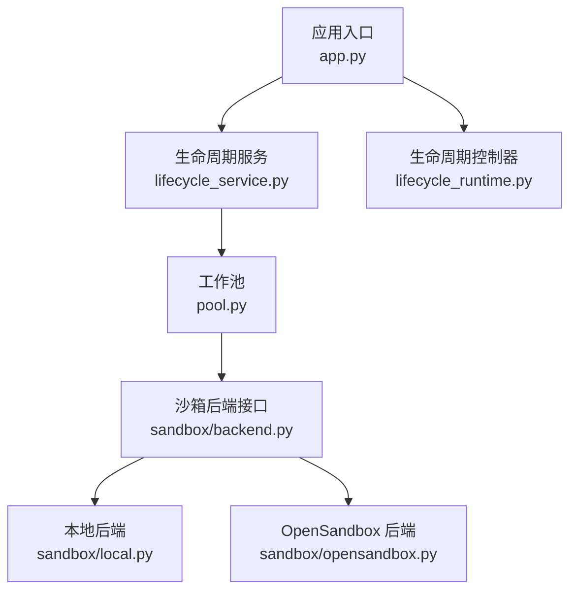
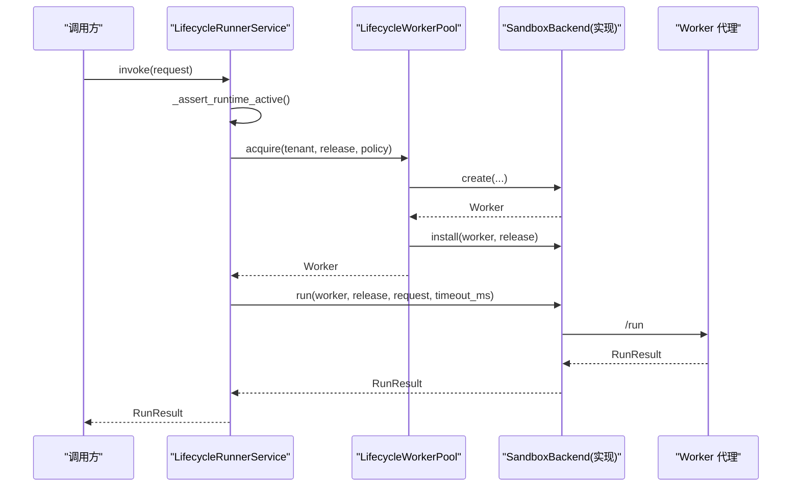
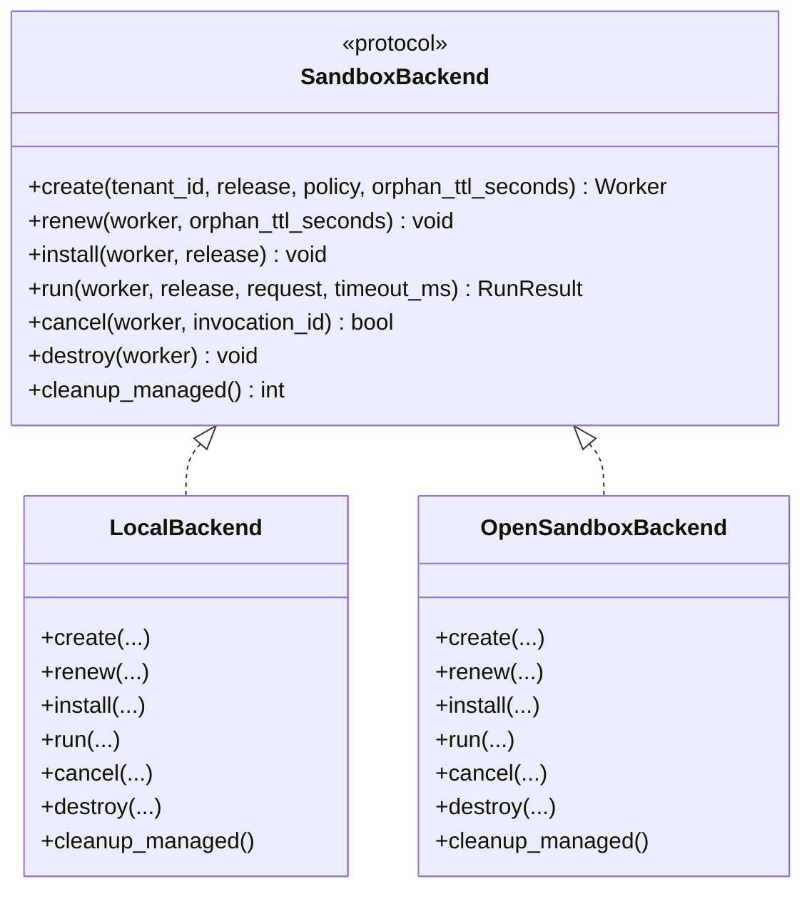
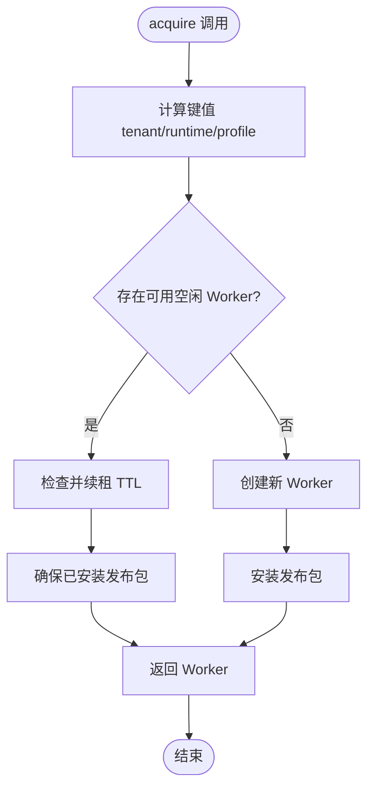
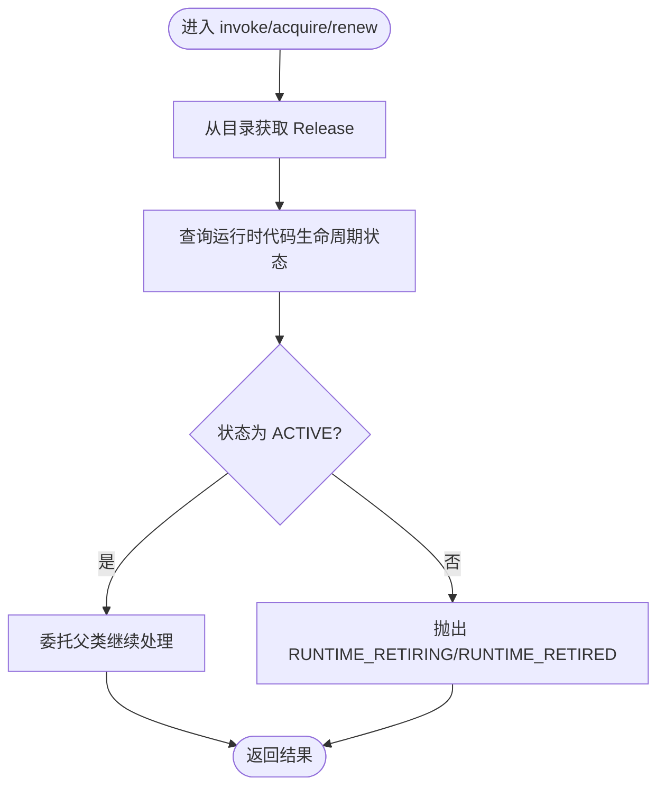
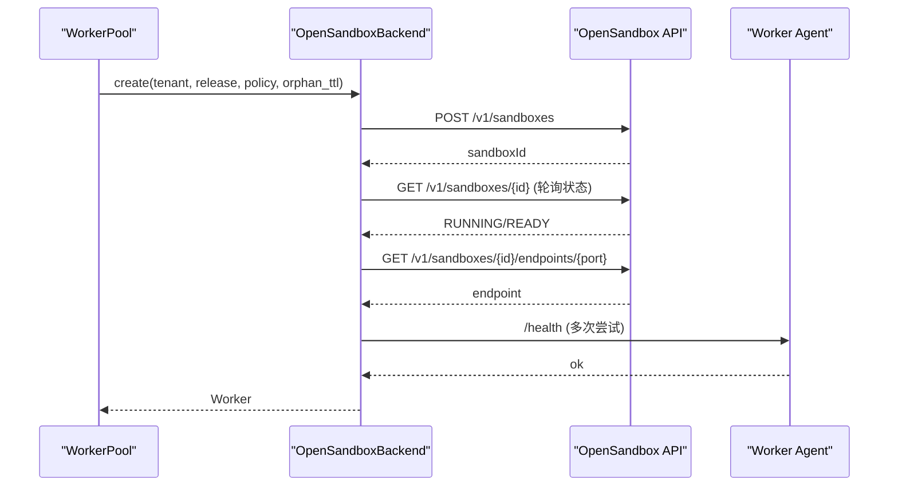
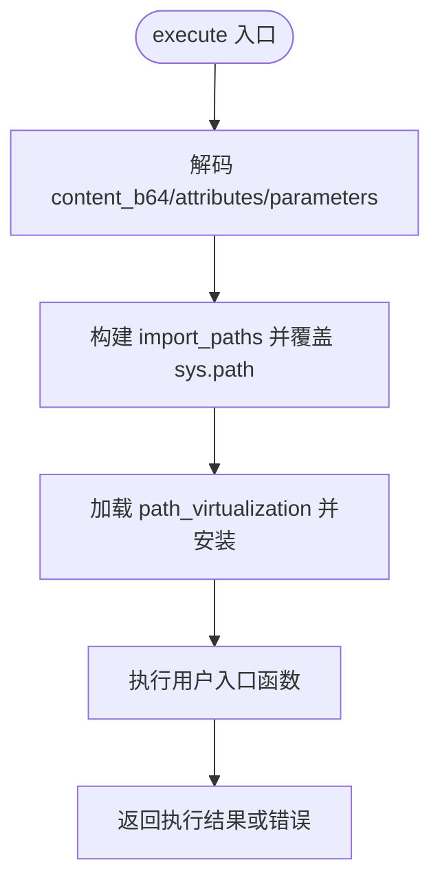
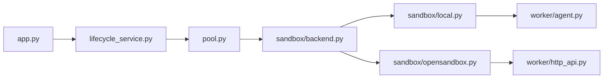

# 扩展开发

<cite>
**本文引用的文件**   
- [runner_engine/__init__.py](file://runner_engine/__init__.py)
- [runner_engine/app.py](file://runner_engine/app.py)
- [runner_engine/sandbox/backend.py](file://runner_engine/sandbox/backend.py)
- [runner_engine/sandbox/local.py](file://runner_engine/sandbox/local.py)
- [runner_engine/sandbox/opensandbox.py](file://runner_engine/sandbox/opensandbox.py)
- [runner_engine/pool.py](file://runner_engine/pool.py)
- [runner_engine/lifecycle_runtime.py](file://runner_engine/lifecycle_runtime.py)
- [runner_engine/lifecycle_service.py](file://runner_engine/lifecycle_service.py)
- [runner_engine/worker/child.py](file://runner_engine/worker/child.py)
</cite>

## 目录
1. [引言](#引言)
2. [项目结构](#项目结构)
3. [核心组件](#核心组件)
4. [架构总览](#架构总览)
5. [详细组件分析](#详细组件分析)
6. [依赖关系分析](#依赖关系分析)
7. [性能与容量规划](#性能与容量规划)
8. [调试与诊断指南](#调试与诊断指南)
9. [版本兼容性与热插拔](#版本兼容性与热插拔)
10. [打包、分发与安装](#打包分发与安装)
11. [结论](#结论)

## 引言
本指南面向 Runner Engine 的扩展开发者，聚焦于“后端插件”“存储插件”和“沙箱插件”三类扩展点。Runner Engine 通过协议式抽象（Protocol）定义沙箱后端接口，结合 WorkerPool 池化、生命周期控制器与服务层拦截，形成可扩展的执行运行时。本文将说明：
- 如何继承或实现抽象基类与接口
- 如何接入后端插件、存储插件与沙箱插件
- 扩展的生命周期管理与依赖注入机制
- 版本兼容性与热插拔支持策略
- 扩展的打包、分发与安装方法
- 调试工具与性能分析方法

## 项目结构
Runner Engine 的核心扩展点集中在 sandbox 子模块与生命周期相关模块中：
- sandbox.backend 定义沙箱后端的 Protocol 接口
- sandbox.local 提供本地开发测试后端
- sandbox.opensandbox 提供 OpenSandbox 远程沙箱后端
- lifecycle_runtime 提供池化、生命周期控制与后端扩展点
- lifecycle_service 在服务层增加运行时代码退役门控
- app 负责启动装配、参数解析与依赖注入

**图表来源**
- [runner_engine/app.py:26-226](file://runner_engine/app.py#L26-L226)
- [runner_engine/lifecycle_service.py:7-71](file://runner_engine/lifecycle_service.py#L7-L71)
- [runner_engine/pool.py:11-188](file://runner_engine/pool.py#L11-L188)
- [runner_engine/sandbox/backend.py:14-49](file://runner_engine/sandbox/backend.py#L14-L49)
- [runner_engine/sandbox/local.py:14-132](file://runner_engine/sandbox/local.py#L14-L132)
- [runner_engine/sandbox/opensandbox.py:31-440](file://runner_engine/sandbox/opensandbox.py#L31-L440)
- [runner_engine/lifecycle_runtime.py:14-184](file://runner_engine/lifecycle_runtime.py#L14-L184)

**章节来源**
- [runner_engine/app.py:26-226](file://runner_engine/app.py#L26-L226)

## 核心组件
本节概述扩展相关的核心组件及其职责：
- SandboxBackend（Protocol）：定义创建、续租、安装、执行、取消、销毁、清理托管资源等统一接口
- WorkerPool：按租户、运行时镜像与安全策略维度复用沙箱，管理 TTL、安装发布包、配额与回收
- LifecycleWorkerPool：在 WorkerPool 之上增加运行时代码退役门控与快照能力
- LifecycleRunnerService：在服务层阻断已退役运行时的新租约、续租与调用
- OpenSandboxBackend：对接远端 OpenSandbox API，封装健康检查、端点发现与错误处理
- LocalBackend：用于开发与测试的本地后端，非安全沙箱

**章节来源**
- [runner_engine/sandbox/backend.py:14-49](file://runner_engine/sandbox/backend.py#L14-L49)
- [runner_engine/pool.py:11-188](file://runner_engine/pool.py#L11-L188)
- [runner_engine/lifecycle_runtime.py:14-184](file://runner_engine/lifecycle_runtime.py#L14-L184)
- [runner_engine/lifecycle_service.py:7-71](file://runner_engine/lifecycle_service.py#L7-L71)
- [runner_engine/sandbox/opensandbox.py:31-440](file://runner_engine/sandbox/opensandbox.py#L31-L440)
- [runner_engine/sandbox/local.py:14-132](file://runner_engine/sandbox/local.py#L14-L132)

## 架构总览
Runner Engine 的扩展架构围绕“协议式后端 + 池化 + 生命周期门控”展开：
- 扩展点一：沙箱后端（SandboxBackend）。可替换为本地、OpenSandbox 或自定义后端
- 扩展点二：生命周期控制器（LifecycleWorkerPool / RunnerLifecycleController）。可增强池行为与运维能力
- 扩展点三：服务层拦截（LifecycleRunnerService）。可在请求进入时进行运行时代码状态校验
- 扩展点四：工作进程（worker.child）。在受控环境中加载并执行 Operator 发布包

**图表来源**
- [runner_engine/lifecycle_service.py:63-71](file://runner_engine/lifecycle_service.py#L63-L71)
- [runner_engine/pool.py:73-130](file://runner_engine/pool.py#L73-L130)
- [runner_engine/sandbox/backend.py:14-49](file://runner_engine/sandbox/backend.py#L14-L49)
- [runner_engine/sandbox/opensandbox.py:339-376](file://runner_engine/sandbox/opensandbox.py#L339-L376)

## 详细组件分析

### 沙箱后端扩展（SandboxBackend）
SandboxBackend 以 Protocol 形式定义后端契约，所有后端必须实现以下方法：
- create：根据租户、发布包、安全策略与孤儿超时创建 Worker
- renew：续租 Worker 的沙箱生存时间
- install：向 Worker 安装指定发布包
- run：在 Worker 上执行一次调用，返回 RunResult
- cancel：取消某次调用
- destroy：销毁 Worker
- cleanup_managed：清理由 Runner 管理的遗留资源

**图表来源**
- [runner_engine/sandbox/backend.py:14-49](file://runner_engine/sandbox/backend.py#L14-L49)
- [runner_engine/sandbox/local.py:14-132](file://runner_engine/sandbox/local.py#L14-L132)
- [runner_engine/sandbox/opensandbox.py:31-440](file://runner_engine/sandbox/opensandbox.py#L31-L440)

#### 开发步骤与最佳实践
- 继承 Protocol 语义：确保实现全部方法，保持签名一致
- 错误处理：对外抛出明确的异常类型，区分可重试与不可重试错误
- 资源清理：在 destroy 与 cleanup_managed 中保证幂等与最终一致性
- 可观测性：记录关键事件（创建、安装、执行、销毁），便于排障
- 并发安全：避免共享可变状态未加锁导致的竞态

**章节来源**
- [runner_engine/sandbox/backend.py:14-49](file://runner_engine/sandbox/backend.py#L14-L49)
- [runner_engine/sandbox/local.py:14-132](file://runner_engine/sandbox/local.py#L14-L132)
- [runner_engine/sandbox/opensandbox.py:31-440](file://runner_engine/sandbox/opensandbox.py#L31-L440)

### 工作池与生命周期（WorkerPool 与 LifecycleWorkerPool）
WorkerPool 负责：
- 按 (tenant_id, runtime.id, profile) 维度复用沙箱
- 管理空闲超时、孤儿 TTL、续租阈值
- 按需安装发布包，限制每个沙箱最大安装数
- 配额控制与销毁回收

LifecycleWorkerPool 在此基础上：
- 阻止正在退役的运行时获取新沙箱
- 提供快照与退役操作（retire_runtime、retire_idle_worker）

**图表来源**
- [runner_engine/pool.py:73-130](file://runner_engine/pool.py#L73-L130)
- [runner_engine/lifecycle_runtime.py:14-47](file://runner_engine/lifecycle_runtime.py#L14-L47)

**章节来源**
- [runner_engine/pool.py:11-188](file://runner_engine/pool.py#L11-L188)
- [runner_engine/lifecycle_runtime.py:14-121](file://runner_engine/lifecycle_runtime.py#L14-L121)

### 服务层拦截（LifecycleRunnerService）
LifecycleRunnerService 在服务层对运行时代码进行退役门控：
- 在 acquire_lease、renew_lease、invoke 前检查运行时代码是否处于 RETIRING/RETIRED
- 若处于退役状态，抛出明确错误，指示客户端重试或迁移

**图表来源**
- [runner_engine/lifecycle_service.py:19-71](file://runner_engine/lifecycle_service.py#L19-L71)

**章节来源**
- [runner_engine/lifecycle_service.py:7-71](file://runner_engine/lifecycle_service.py#L7-L71)

### OpenSandbox 后端适配
OpenSandboxBackend 封装了与远端 OpenSandbox 的 HTTP 交互：
- 集群配置与 API Key 头
- 创建沙箱、轮询就绪、获取端点、健康检查
- 安装发布包、执行调用、取消调用、销毁沙箱
- 清理 Runner 管理的遗留沙箱

**图表来源**
- [runner_engine/sandbox/opensandbox.py:141-290](file://runner_engine/sandbox/opensandbox.py#L141-L290)

**章节来源**
- [runner_engine/sandbox/opensandbox.py:31-440](file://runner_engine/sandbox/opensandbox.py#L31-L440)

### 本地后端（LocalBackend）
LocalBackend 用于开发与测试：
- 使用临时目录作为 releases/invocations 根路径
- 直接调用内部 AgentState 模拟执行
- 不具安全隔离能力，仅适合本地验证

**章节来源**
- [runner_engine/sandbox/local.py:14-132](file://runner_engine/sandbox/local.py#L14-L132)

### 工作进程与路径虚拟化（worker.child）
worker.child 在执行侧负责：
- 动态加载 path_virtualization 模块
- 设置 sys.path，优先导入发布包与依赖根
- 解码输入内容、属性与参数，执行用户代码

**图表来源**
- [runner_engine/worker/child.py:258-294](file://runner_engine/worker/child.py#L258-L294)

**章节来源**
- [runner_engine/worker/child.py:258-294](file://runner_engine/worker/child.py#L258-L294)

## 依赖关系分析
Runner Engine 的扩展依赖关系如下：
- app.py 装配 LifecycleRunnerService、LifecycleWorkerPool、OpenSandboxBackend、Quota、Catalog、RunnerDB 等
- LifecycleRunnerService 依赖 Catalog、RunnerDB、Pool 与 LifecycleStore
- LifecycleWorkerPool 依赖 SandboxBackend 与 Quota
- OpenSandboxBackend 依赖 worker.http_api 与模型对象
- LocalBackend 依赖 worker.agent.AgentState

**图表来源**
- [runner_engine/app.py:9-22](file://runner_engine/app.py#L9-L22)
- [runner_engine/lifecycle_service.py:1-71](file://runner_engine/lifecycle_service.py#L1-L71)
- [runner_engine/pool.py:1-188](file://runner_engine/pool.py#L1-L188)
- [runner_engine/sandbox/backend.py:1-49](file://runner_engine/sandbox/backend.py#L1-L49)
- [runner_engine/sandbox/local.py:1-132](file://runner_engine/sandbox/local.py#L1-L132)
- [runner_engine/sandbox/opensandbox.py:1-440](file://runner_engine/sandbox/opensandbox.py#L1-L440)

**章节来源**
- [runner_engine/app.py:9-22](file://runner_engine/app.py#L9-L22)
- [runner_engine/lifecycle_service.py:1-71](file://runner_engine/lifecycle_service.py#L1-L71)
- [runner_engine/pool.py:1-188](file://runner_engine/pool.py#L1-L188)
- [runner_engine/sandbox/backend.py:1-49](file://runner_engine/sandbox/backend.py#L1-L49)
- [runner_engine/sandbox/local.py:1-132](file://runner_engine/sandbox/local.py#L1-L132)
- [runner_engine/sandbox/opensandbox.py:1-440](file://runner_engine/sandbox/opensandbox.py#L1-L440)

## 性能与容量规划
- 池化与复用：WorkerPool 按租户/运行时/策略维度复用沙箱，减少创建开销
- TTL 与续租：基于 idle_seconds、orphan_ttl_seconds、renew_before_seconds 控制生命周期
- 发布包安装上限：max_installed_releases 防止单个沙箱缓存过多发布包
- 配额控制：Quota 限制同时创建与存活数量，避免资源耗尽
- 远程后端延迟：OpenSandboxBackend 的健康检查与端点发现需考虑网络延迟与重试

建议：
- 合理设置 RUNNER_MAX_CREATING、RUNNER_MAX_LIVE、RUNNER_MAX_LIVE_PER_TENANT
- 调整 RUNNER_WORKER_IDLE_SECONDS、RUNNER_SANDBOX_ORPHAN_TTL_SECONDS、RUNNER_SANDBOX_RENEW_BEFORE_SECONDS
- 监控 OpenSandbox API 响应时间与错误率，必要时增大超时与重试间隔

[本节为通用指导，无需列出具体文件来源]

## 调试与诊断指南
- 启用 Admin HTTP：设置 RUNNER_ADMIN_TOKEN 以暴露生命周期管理接口
- 查看运行时代码状态：通过 RunnerLifecycleController 提供的状态查询接口
- 观察池快照：LifecycleWorkerPool.snapshot 返回空闲 Worker、获取中计数等信息
- 清理托管沙箱：OpenSandboxBackend.cleanup_managed 可按 managed-by 与 runner-owner 标签清理
- 工作进程日志：worker.child 的错误路径会返回结构化错误信息，便于定位

**章节来源**
- [runner_engine/app.py:174-210](file://runner_engine/app.py#L174-L210)
- [runner_engine/lifecycle_runtime.py:187-397](file://runner_engine/lifecycle_runtime.py#L187-L397)
- [runner_engine/sandbox/opensandbox.py:401-440](file://runner_engine/sandbox/opensandbox.py#L401-L440)
- [runner_engine/worker/child.py:258-294](file://runner_engine/worker/child.py#L258-L294)

## 版本兼容性与热插拔
- 版本标识：runner_engine.__init__ 声明版本号，便于扩展与运行时对齐
- 运行时代码退役：LifecycleRunnerService 与 LifecycleWorkerPool 共同确保退役期间不再接受新执行
- 后端扩展点：SandboxBackend 为 Protocol，新增后端不影响现有实现
- 生命周期控制器：LifecycleWorkerPool 与 RunnerLifecycleController 提供退役流程与快照能力
- 热插拔建议：
  - 后端实现应支持优雅销毁与清理
  - 发布包安装应具备幂等与回滚能力
  - 远程后端应正确处理 404 与网络异常，避免级联失败

**章节来源**
- [runner_engine/__init__.py:1-14](file://runner_engine/__init__.py#L1-L14)
- [runner_engine/lifecycle_service.py:19-71](file://runner_engine/lifecycle_service.py#L19-L71)
- [runner_engine/lifecycle_runtime.py:14-121](file://runner_engine/lifecycle_runtime.py#L14-L121)
- [runner_engine/sandbox/backend.py:14-49](file://runner_engine/sandbox/backend.py#L14-L49)

## 打包、分发与安装
- 发布服务：publish_service 提供编译与发布后端的能力，支持多种后端变体
- 源码存储：LocalSourceStore 将工作区快照到本地目录，按 revision 命名
- 数据库持久化：PublishStore 维护虚拟合约、变体与后端合约摘要
- 前端集成：web/app/main.py 转发编译与发布请求至后端

建议流程：
- 编写 Operator 并发布为发布包
- 使用 publish_service 编译与发布后端变体
- 将发布包部署到 Runner 的 catalog 目录
- 通过生命周期控制器触发运行时代码退役与替换

**章节来源**
- [publish_service/source_store.py:16-30](file://publish_service/source_store.py#L16-L30)
- [publish_service/store.py:17-35](file://publish_service/store.py#L17-L35)
- [web/app/main.py:152-175](file://web/app/main.py#L152-L175)

## 结论
Runner Engine 通过 Protocol 抽象、池化与生命周期门控，提供了稳定且可扩展的执行运行时。扩展开发者可以：
- 实现 SandboxBackend 以接入新的沙箱环境
- 扩展 LifecycleWorkerPool 与 RunnerLifecycleController 以增强运维能力
- 在服务层加入业务规则与安全检查
- 借助 publish_service 完成 Operator 的编译、发布与安装
- 利用 Admin HTTP 与快照接口进行调试与诊断

遵循本文的最佳实践与容量规划建议，可以在保证稳定性的前提下，灵活扩展 Runner Engine 的执行能力。