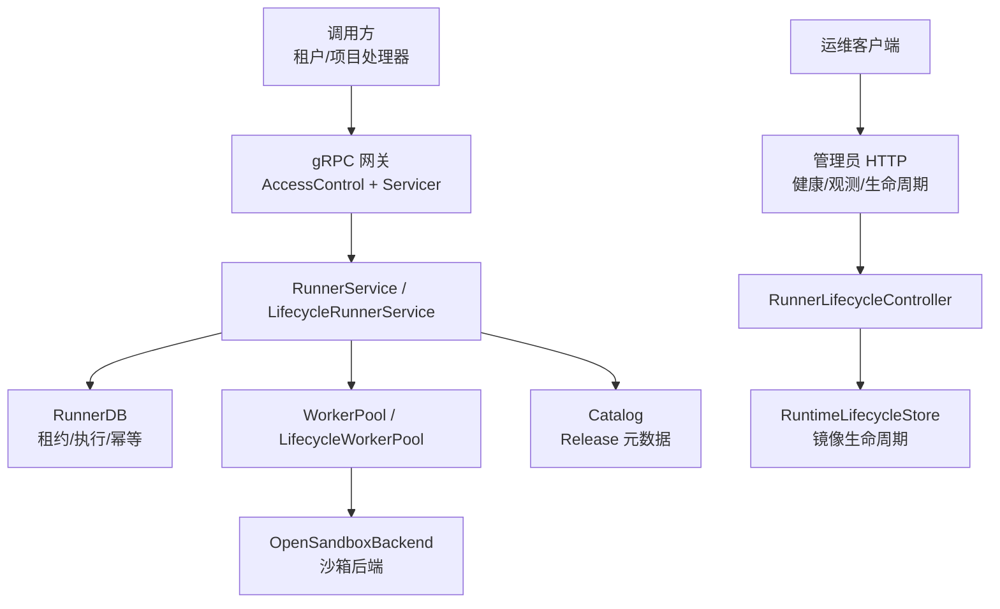
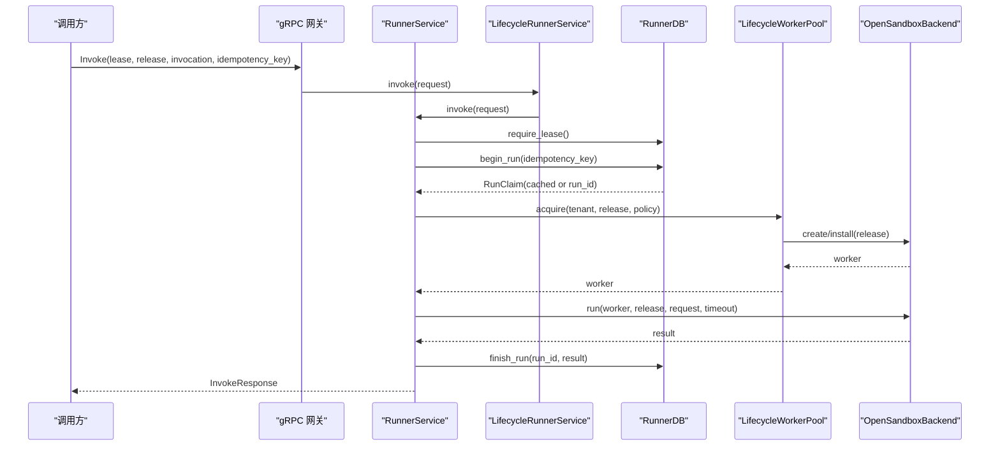
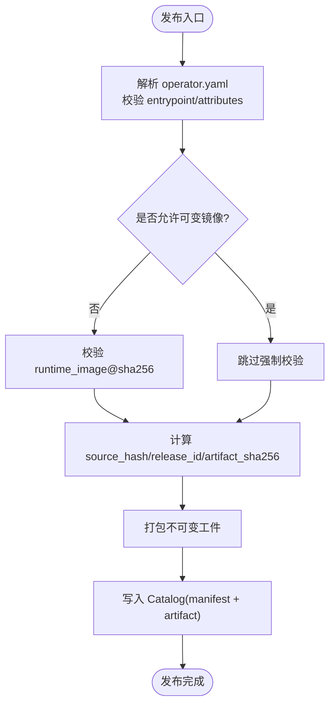
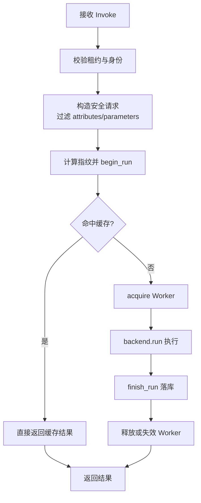
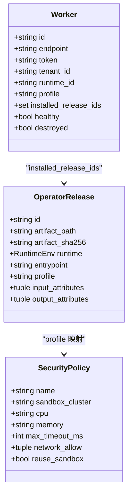
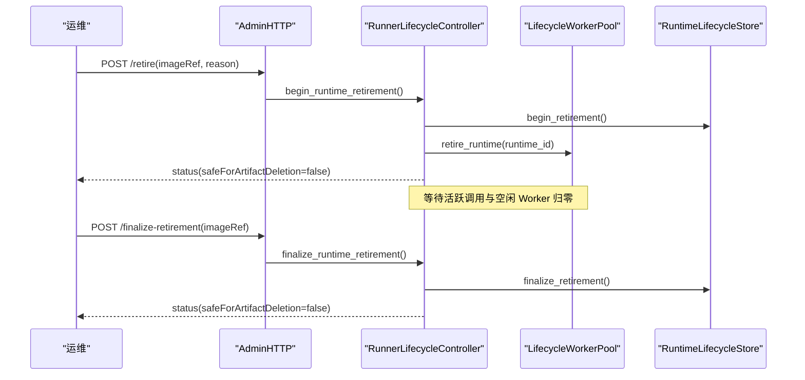
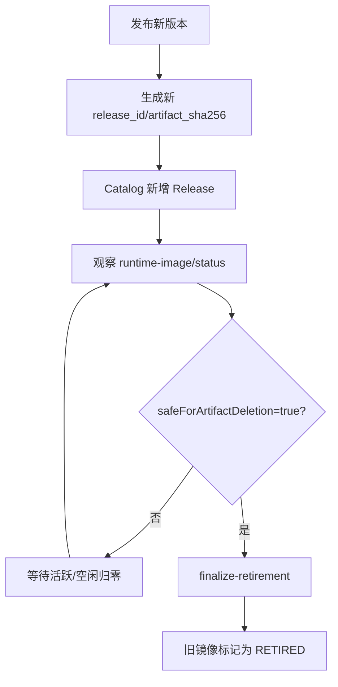
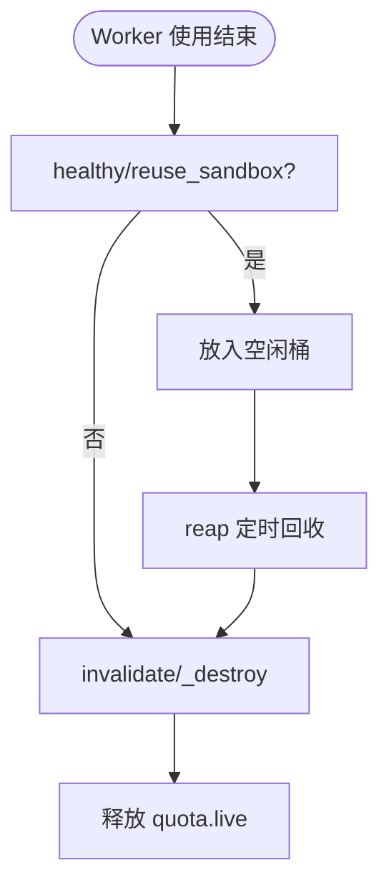
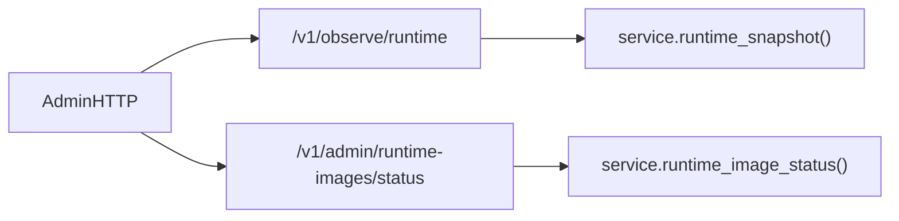
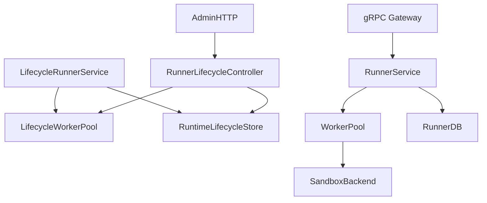

# 插件生命周期管理

<cite>
**本文引用的文件**   
- [app.py](file://runner_engine/app.py)
- [service.py](file://runner_engine/service.py)
- [lifecycle_service.py](file://runner_engine/lifecycle_service.py)
- [lifecycle_runtime.py](file://runner_engine/lifecycle_runtime.py)
- [lifecycle_store.py](file://runner_engine/lifecycle_store.py)
- [pool.py](file://runner_engine/pool.py)
- [state.py](file://runner_engine/state.py)
- [model.py](file://runner_engine/model.py)
- [gateway.py](file://runner_engine/gateway.py)
- [admin_http.py](file://runner_engine/admin_http.py)
- [publisher.py](file://runner_engine/publisher.py)
</cite>

## 目录
1. [引言](#引言)
2. [项目结构](#项目结构)
3. [核心组件](#核心组件)
4. [架构总览](#架构总览)
5. [详细组件分析](#详细组件分析)
6. [依赖关系分析](#依赖关系分析)
7. [性能与容量特性](#性能与容量特性)
8. [故障排查与调试指南](#故障排查与调试指南)
9. [结论](#结论)

## 引言
本指南围绕 Runner Engine 的“插件”（即 Operator Release）生命周期展开，覆盖加载、初始化、运行、卸载、热插拔与动态更新、版本兼容与升级策略、插件间通信与事件通知、资源管理与内存泄漏防护、监控指标与性能分析、以及调试与排障方法。文档以代码仓库中的 runner_engine 模块为核心依据，结合 gRPC 网关、管理员 HTTP 接口、沙箱池、持久化状态和运行时生命周期存储进行系统性说明。

## 项目结构
Runner Engine 的核心由以下层次组成：
- 入口与装配：应用启动、参数解析、服务与控制器组装。
- 外部接口层：gRPC 网关暴露 AcquireLease/RenewLease/Invoke/Cancel/ReleaseLease；管理员 HTTP 暴露运行时观测与生命周期控制。
- 业务服务层：RunnerService 负责租约、幂等执行、结果持久化；LifecycleRunnerService 在 RUNTIME_RETIRING/RETIRED 时阻断新请求。
- 运行时与池化：WorkerPool/LifecycleWorkerPool 管理沙箱 Worker 的生命周期、安装 Release、TTL 续期与回收。
- 持久化与状态：RunnerDB 维护租约、执行历史与幂等缓存；RuntimeLifecycleStore 维护镜像级生命周期状态。
- 模型与错误：统一的 Release、Worker、RunRequest、RunResult 等数据模型与错误体系。

**图表来源**
- [app.py:92-154](file://runner_engine/app.py#L92-L154)
- [gateway.py:44-194](file://runner_engine/gateway.py#L44-L194)
- [admin_http.py:14-190](file://runner_engine/admin_http.py#L14-L190)
- [service.py:80-115](file://runner_engine/service.py#L80-L115)
- [lifecycle_runtime.py:187-397](file://runner_engine/lifecycle_runtime.py#L187-L397)
- [lifecycle_store.py:35-151](file://runner_engine/lifecycle_store.py#L35-L151)

**章节来源**
- [app.py:26-232](file://runner_engine/app.py#L26-L232)

## 核心组件
- RunnerService：统一处理租约、幂等执行、结果落库、后台清理、取消执行。
- LifecycleRunnerService：在 RUNTIME_RETIRING/RETIRED 状态下拒绝新的 acquire/renew/invoke。
- WorkerPool/LifecycleWorkerPool：按 tenant/runtime/profile 维度复用沙箱，支持 TTL 续期、安装 Release、空闲回收、销毁隔离。
- RunnerDB：PostgreSQL-backed 租约表、runs 审计表、idempotency_keys 幂等缓存表，提供创建/续期/删除租约、begin_run/finish_run/abandon_run、过期清理与旧记录清理。
- RuntimeLifecycleStore：镜像级生命周期状态机（无记录=ACTIVE，RETIRING，RETIRED），提供 begin/cancel/finalize 退休流程。
- RunnerLifecycleController：编排镜像退休、取消退休、最终化退休，聚合活跃调用、空闲 Worker、acquiring 计数与受管沙箱信息。
- AccessControl + gRPC gateway：mTLS 身份校验、租户/项目授权、将 RunnerError 映射为 gRPC 状态码。
- AdminHTTP：本地鉴权的管理员 HTTP，暴露健康检查、运行时快照、镜像状态、退休控制、空闲 Worker 退役。
- Publisher：构建不可变 Operator Release 工件，生成 release_id、artifact_sha256、runtime_id 并写入 Catalog。

**章节来源**
- [service.py:80-456](file://runner_engine/service.py#L80-L456)
- [lifecycle_service.py:7-71](file://runner_engine/lifecycle_service.py#L7-L71)
- [pool.py:11-188](file://runner_engine/pool.py#L11-L188)
- [state.py:131-685](file://runner_engine/state.py#L131-L685)
- [lifecycle_store.py:35-151](file://runner_engine/lifecycle_store.py#L35-L151)
- [lifecycle_runtime.py:14-397](file://runner_engine/lifecycle_runtime.py#L14-L397)
- [gateway.py:12-194](file://runner_engine/gateway.py#L12-L194)
- [admin_http.py:14-190](file://runner_engine/admin_http.py#L14-L190)
- [publisher.py:82-160](file://runner_engine/publisher.py#L82-L160)

## 架构总览
Runner Engine 采用“服务+池化+持久化+生命周期存储”的分层架构：
- 外部通过 mTLS gRPC 接入，内部通过 RunnerService 协调 Catalog、DB、Pool。
- 生命周期控制通过 RunnerLifecycleController 与 RuntimeLifecycleStore 实现镜像级退休流程，避免在 RETIRING/RETIRED 下继续分配新沙箱或接受新调用。
- 沙箱池基于 OpenSandboxBackend 抽象，支持多集群、标签过滤、托管沙箱发现与列表。

**图表来源**
- [gateway.py:129-157](file://runner_engine/gateway.py#L129-L157)
- [lifecycle_service.py:63-70](file://runner_engine/lifecycle_service.py#L63-L70)
- [service.py:188-362](file://runner_engine/service.py#L188-L362)
- [state.py:411-521](file://runner_engine/state.py#L411-L521)
- [pool.py:73-130](file://runner_engine/pool.py#L73-L130)

## 详细组件分析

### 插件加载与初始化
- 发布阶段：Publisher 读取 operator.yaml，校验 entrypoint、attributes、runtime_image（默认要求 OCI digest），计算 source_hash、release_id、artifact_sha256，打包不可变工件并保存到 Catalog。
- 运行阶段：Catalog 提供 get(release_id)，Service 根据 release.profile 选择 SecurityPolicy，WorkerPool 根据 tenant/runtime/profile 键查找或创建 Worker，并在 Worker 中按需 install(release)。

**图表来源**
- [publisher.py:82-160](file://runner_engine/publisher.py#L82-L160)

**章节来源**
- [publisher.py:82-160](file://runner_engine/publisher.py#L82-L160)
- [service.py:146-167](file://runner_engine/service.py#L146-L167)
- [pool.py:67-72](file://runner_engine/pool.py#L67-L72)

### 插件运行与执行流
- 调用路径：gRPC -> AccessControl 校验身份与租户/项目权限 -> RunnerService.invoke -> RunnerDB.begin_run（幂等）-> WorkerPool.acquire -> Backend.run -> RunnerDB.finish_run。
- 幂等性：基于 idempotency_key + request_fingerprint，RUNNING 状态重复提交会返回重试错误；DONE 且可重放的结果会被缓存并重放。
- 超时与取消：invoke 使用安全后的 timeout_ms；cancel 通过 backend.cancel 尝试中断执行。

**图表来源**
- [service.py:188-362](file://runner_engine/service.py#L188-L362)
- [state.py:411-607](file://runner_engine/state.py#L411-L607)

**章节来源**
- [gateway.py:129-157](file://runner_engine/gateway.py#L129-L157)
- [service.py:188-405](file://runner_engine/service.py#L188-L405)
- [state.py:411-607](file://runner_engine/state.py#L411-L607)

### 插件状态管理与依赖解析
- 插件状态：
  - Catalog 中的 OperatorRelease 包含 id、artifact_path、artifact_sha256、runtime、entrypoint、profile、input/output_attributes。
  - Worker 持有 installed_release_ids，用于在同一沙箱内复用已安装的 Release。
- 依赖解析：
  - 当前实现未引入显式依赖图；依赖锁定通过不可变 runtime_image 与不可变 artifact 保证环境一致性。
  - 若未来需要扩展，可在 OperatorRelease 中增加依赖声明，并在 WorkerPool._ensure_release 前进行拓扑排序与冲突检测。

**图表来源**
- [model.py:7-98](file://runner_engine/model.py#L7-L98)
- [pool.py:67-72](file://runner_engine/pool.py#L67-L72)

**章节来源**
- [model.py:7-98](file://runner_engine/model.py#L7-L98)
- [pool.py:67-72](file://runner_engine/pool.py#L67-L72)

### 插件的热插拔与动态更新
- 热插拔机制：
  - WorkerPool 支持在 Worker 上按需 install(release)，同一沙箱可承载多个 Release（受 max_installed_releases 限制）。
  - 新 Release 可通过 Catalog 新增后，被后续 acquire 自动安装到空闲 Worker。
- 动态更新策略：
  - 推荐通过镜像级退休流程逐步淘汰旧镜像，确保新镜像在空闲 Worker 中预热后再切换流量。
  - 对特定租户/项目的灰度可通过 Policy 与 Catalog 组合实现（例如不同 profile 对应不同集群/配额）。

**图表来源**
- [admin_http.py:116-149](file://runner_engine/admin_http.py#L116-L149)
- [lifecycle_runtime.py:302-359](file://runner_engine/lifecycle_runtime.py#L302-L359)
- [lifecycle_store.py:82-136](file://runner_engine/lifecycle_store.py#L82-L136)

**章节来源**
- [pool.py:67-72](file://runner_engine/pool.py#L67-L72)
- [lifecycle_runtime.py:302-359](file://runner_engine/lifecycle_runtime.py#L302-L359)

### 插件的版本兼容性与升级策略
- 版本标识：
  - runtime_id 由 runtime_image 的 sha256 决定；release_id 由 ABI、runtime_id、entrypoint、profile、attributes、source_hash 共同决定。
  - artifact_sha256 保证工件不可变。
- 兼容性约束：
  - 默认禁止可变镜像（必须使用 @sha256 固定），避免环境漂移。
  - 升级建议：先发布新版本镜像与 Release，通过退休流程逐步下线旧镜像，确保无活跃调用与空闲 Worker 后再 finalization。

**图表来源**
- [publisher.py:115-160](file://runner_engine/publisher.py#L115-L160)
- [lifecycle_runtime.py:239-300](file://runner_engine/lifecycle_runtime.py#L239-L300)

**章节来源**
- [publisher.py:115-160](file://runner_engine/publisher.py#L115-L160)
- [lifecycle_runtime.py:239-300](file://runner_engine/lifecycle_runtime.py#L239-L300)

### 插件间通信与事件通知
- 插件间通信：
  - 当前 Runner Engine 不直接提供插件间通信通道；插件通过 gRPC 网关与上游系统交互，或通过外部消息总线/对象存储协作。
- 事件通知：
  - 执行结果通过 RunResult 返回给调用方；幂等缓存与 runs 审计表可用于下游消费。
  - 如需事件驱动，可在上层编排系统中订阅 RunnerDB 变更或使用外部日志/指标管道。

[本节为概念性说明，不直接分析具体文件]

### 资源管理与内存泄漏防护
- 沙箱生命周期：
  - WorkerPool 对空闲 Worker 进行 idle_seconds 回收，orphan_ttl_seconds 防止孤儿沙箱。
  - renew_before_seconds 与 policy.max_timeout_ms 共同决定 TTL 续期阈值，避免执行中途过期。
- 资源释放：
  - _destroy 保证每个 Worker 仅销毁一次，并释放 quota.live 计数。
  - reset_after_restart 清理进程重启后残留的内存池，并调用 backend.cleanup_managed。
- 内存与输出限制：
  - MAX_INLINE_BYTES 限制输入/输出大小；attributes 数量与字节上限校验。

**图表来源**
- [pool.py:132-188](file://runner_engine/pool.py#L132-L188)

**章节来源**
- [pool.py:51-72](file://runner_engine/pool.py#L51-L72)
- [pool.py:132-188](file://runner_engine/pool.py#L132-L188)
- [service.py:15-20](file://runner_engine/service.py#L15-L20)

### 监控指标与性能分析工具
- 运行时快照：
  - /v1/observe/runtime 返回 activeInvocations、idleWorkers、acquiringByRuntime、runtimeLifecycle。
- 镜像状态：
  - /v1/admin/runtime-images/status 返回 lifecycleState、releaseCount、unexpiredLeaseCount、activeInvocationCount、idleWorkerCount、managedSandboxCount、safeForArtifactDeletion。
- 后台清理：
  - 定期清理过期租约、幂等缓存、旧 runs 记录，降低数据库膨胀。

**图表来源**
- [admin_http.py:73-105](file://runner_engine/admin_http.py#L73-L105)
- [lifecycle_runtime.py:373-397](file://runner_engine/lifecycle_runtime.py#L373-L397)
- [lifecycle_runtime.py:239-300](file://runner_engine/lifecycle_runtime.py#L239-L300)

**章节来源**
- [admin_http.py:73-105](file://runner_engine/admin_http.py#L73-L105)
- [lifecycle_runtime.py:239-300](file://runner_engine/lifecycle_runtime.py#L239-L300)
- [service.py:117-138](file://runner_engine/service.py#L117-L138)

## 依赖关系分析
- 组件耦合：
  - LifecycleRunnerService 依赖 LifecycleWorkerPool 与 RuntimeLifecycleStore，在 acquire/renew/invoke 前做状态门控。
  - RunnerLifecycleController 依赖 service.pool 与 lifecycle store，编排退休流程。
  - WorkerPool 依赖 SandboxBackend 抽象，屏蔽底层沙箱差异。
- 外部依赖：
  - PostgreSQL（psycopg_pool）用于租约、执行历史与幂等缓存。
  - gRPC 与 mTLS 用于安全接入。
  - OpenSandboxBackend 用于跨集群沙箱管理。

**图表来源**
- [lifecycle_service.py:7-71](file://runner_engine/lifecycle_service.py#L7-L71)
- [lifecycle_runtime.py:14-397](file://runner_engine/lifecycle_runtime.py#L14-L397)
- [pool.py:11-188](file://runner_engine/pool.py#L11-L188)
- [service.py:80-115](file://runner_engine/service.py#L80-L115)
- [gateway.py:44-194](file://runner_engine/gateway.py#L44-L194)
- [admin_http.py:14-190](file://runner_engine/admin_http.py#L14-L190)

**章节来源**
- [lifecycle_service.py:7-71](file://runner_engine/lifecycle_service.py#L7-L71)
- [lifecycle_runtime.py:14-397](file://runner_engine/lifecycle_runtime.py#L14-L397)
- [pool.py:11-188](file://runner_engine/pool.py#L11-L188)
- [service.py:80-115](file://runner_engine/service.py#L80-L115)
- [gateway.py:44-194](file://runner_engine/gateway.py#L44-L194)
- [admin_http.py:14-190](file://runner_engine/admin_http.py#L14-L190)

## 性能与容量特性
- 并发与线程：
  - gRPC server 使用 ThreadPoolExecutor(max_workers=32)。
  - 后台清理线程周期性执行 pool.reap、DB 清理与 runs 清理。
- 容量限制：
  - 输入/输出最大 8 MiB；attributes 数量与字节上限；artifact 最大 10 MiB。
  - WorkerPool 支持 max_installed_releases 限制单沙箱安装数量。
  - Quota 控制 max_creating、max_live、max_live_per_tenant。
- 索引与查询：
  - leases、runs、idempotency_keys 均建立必要索引，优化过期清理与查询。

[本节为通用性能讨论，不直接分析具体文件]

## 故障排查与调试指南

### 常见问题定位
- 无法获取沙箱：
  - 检查镜像是否处于 RETIRING/RETIRED；查看 /v1/admin/runtime-images/status 的 lifecycleState 与 safeForArtifactDeletion。
  - 检查 acquire 失败是否因 RUNTIME_RETIRING 或 RUNTIME_RETIRED。
- 调用幂等冲突：
  - 若出现 RUN_IN_PROGRESS 或 IDEMPOTENCY_CONFLICT，检查 idempotency_key 与 request_fingerprint 是否一致。
- 租约问题：
  - LEASE_UNKNOWN/LEASE_EXPIRED/LEASE_FORBIDDEN 表明租约不存在、过期或不属于当前租户。
- 执行异常：
  - USER_FAILURE/RETRYABLE_FAILURE/SUCCESS 由 RunResult.outcome_class 推导；关注 error_code 与 error_message。

**章节来源**
- [lifecycle_service.py:19-32](file://runner_engine/lifecycle_service.py#L19-L32)
- [state.py:313-386](file://runner_engine/state.py#L313-L386)
- [state.py:411-521](file://runner_engine/state.py#L411-L521)
- [service.py:334-362](file://runner_engine/service.py#L334-L362)

### 调试步骤
- 启用管理员 HTTP：
  - 设置 RUNNER_ADMIN_TOKEN，访问 /health 与 /v1/observe/runtime 获取运行时快照。
- 镜像退休流程：
  - 使用 /v1/admin/runtime-images/retire 开始退休，观察 active/idle/acquiring 计数归零后调用 /v1/admin/runtime-images/finalize-retirement。
- 日志与指标：
  - 关注后台清理线程日志；结合数据库 runs 与 idempotency_keys 表统计执行成功率与重试率。

**章节来源**
- [app.py:170-210](file://runner_engine/app.py#L170-L210)
- [admin_http.py:73-105](file://runner_engine/admin_http.py#L73-L105)
- [lifecycle_runtime.py:302-359](file://runner_engine/lifecycle_runtime.py#L302-L359)

### 错误码与语义
- RunnerError 统一携带 code 与 retryable；gRPC 网关将其映射为 UNAUTHENTICATED、PERMISSION_DENIED、NOT_FOUND、UNAVAILABLE、FAILED_PRECONDITION。
- 常见错误：
  - UNKNOWN_SECURITY_POLICY、INLINE_CONTENT_TOO_LARGE、IDEMPOTENCY_REQUIRED、INVOCATION_ID_IN_USE、OUTPUT_TOO_LARGE、CANCEL_FAILED。

**章节来源**
- [errors.py:1-22](file://runner_engine/errors.py#L1-L22)
- [gateway.py:67-79](file://runner_engine/gateway.py#L67-L79)
- [service.py:188-235](file://runner_engine/service.py#L188-L235)
- [service.py:411-456](file://runner_engine/service.py#L411-L456)

## 结论
Runner Engine 通过不可变工件与镜像、严格的幂等与租约机制、沙箱池化与 TTL 管理、以及镜像级生命周期控制，提供了稳定、可观测、可回滚的插件运行环境。运维侧可通过管理员 HTTP 接口与运行时快照进行热插拔与动态更新，配合数据库审计与后台清理保障长期稳定性。建议在升级过程中优先采用镜像退休流程，逐步替换旧镜像，确保零停机与可追溯。