# 沙箱插件开发

<cite>
**本文引用的文件**   
- [runner_engine/sandbox/backend.py](file://runner_engine/sandbox/backend.py)
- [runner_engine/sandbox/local.py](file://runner_engine/sandbox/local.py)
- [runner_engine/sandbox/opensandbox.py](file://runner_engine/sandbox/opensandbox.py)
- [runner_engine/pool.py](file://runner_engine/pool.py)
- [runner_engine/service.py](file://runner_engine/service.py)
- [runner_engine/model.py](file://runner_engine/model.py)
- [runner_engine/policy.py](file://runner_engine/policy.py)
- [runner_engine/worker/agent.py](file://runner_engine/worker/agent.py)
- [runner_engine/worker/http_api.py](file://runner_engine/worker/http_api.py)
- [config/opensandbox.json](file://config/opensandbox.json)
- [config/policies.json](file://config/policies.json)
- [proto/runner.proto](file://proto/runner.proto)
</cite>

## 目录
1. [引言](#引言)
2. [项目结构](#项目结构)
3. [核心组件](#核心组件)
4. [架构总览](#架构总览)
5. [详细组件分析](#详细组件分析)
6. [依赖关系分析](#依赖关系分析)
7. [性能与资源限制](#性能与资源限制)
8. [故障恢复与状态同步](#故障恢复与状态同步)
9. [配置与环境变量](#配置与环境变量)
10. [监控、日志与可观测性](#监控日志与可观测性)
11. [自定义沙箱后端实现指南](#自定义沙箱后端实现指南)
12. [常见问题排查](#常见问题排查)
13. [结论](#结论)

## 引言
本指南面向需要为 Runner Engine 扩展不同隔离环境的开发者，目标是：
- 理解沙箱系统的整体架构与控制面/数据面职责划分。
- 掌握 SandboxBackend 协议接口，并据此实现本地进程沙箱与 OpenSandbox 集群沙箱。
- 了解工作进程的创建、安装、运行、取消、销毁与回收流程。
- 理解安全策略如何影响沙箱选择、资源限制与复用行为。
- 掌握沙箱插件的配置参数、环境变量、错误处理、状态同步、性能监控与日志收集方式。

## 项目结构
Runner Engine 的沙箱相关代码集中在 runner_engine 包内，关键路径如下：
- sandbox：定义沙箱后端抽象与具体实现（本地、OpenSandbox）。
- worker：工作进程代理与 HTTP 客户端，负责在沙箱内执行用户算子。
- pool：工作池管理，负责按租户、运行时与安全策略复用和回收沙箱。
- service：编排调用生命周期、租约、幂等性与结果持久化。
- model/policy：模型、安全策略加载。
- config：OpenSandbox 集群配置与安全策略配置。
- proto：外部控制面 gRPC 接口定义。

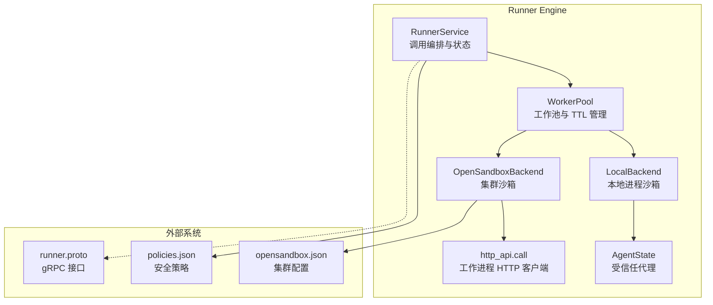

**图表来源**
- [runner_engine/service.py:80-115](file://runner_engine/service.py#L80-L115)
- [runner_engine/pool.py:11-46](file://runner_engine/pool.py#L11-L46)
- [runner_engine/sandbox/local.py:14-62](file://runner_engine/sandbox/local.py#L14-L62)
- [runner_engine/sandbox/opensandbox.py:31-50](file://runner_engine/sandbox/opensandbox.py#L31-L50)
- [runner_engine/worker/agent.py:309-349](file://runner_engine/worker/agent.py#L309-L349)
- [runner_engine/worker/http_api.py:8-39](file://runner_engine/worker/http_api.py#L8-L39)
- [config/policies.json:1-19](file://config/policies.json#L1-L19)
- [config/opensandbox.json:1-11](file://config/opensandbox.json#L1-L11)
- [proto/runner.proto:8-15](file://proto/runner.proto#L8-L15)

**章节来源**
- [runner_engine/service.py:80-115](file://runner_engine/service.py#L80-L115)
- [runner_engine/pool.py:11-46](file://runner_engine/pool.py#L11-L46)
- [runner_engine/sandbox/backend.py:14-49](file://runner_engine/sandbox/backend.py#L14-L49)
- [runner_engine/sandbox/local.py:14-62](file://runner_engine/sandbox/local.py#L14-L62)
- [runner_engine/sandbox/opensandbox.py:31-50](file://runner_engine/sandbox/opensandbox.py#L31-L50)
- [runner_engine/worker/agent.py:309-349](file://runner_engine/worker/agent.py#L309-L349)
- [runner_engine/worker/http_api.py:8-39](file://runner_engine/worker/http_api.py#L8-L39)
- [config/policies.json:1-19](file://config/policies.json#L1-L19)
- [config/opensandbox.json:1-11](file://config/opensandbox.json#L1-L11)
- [proto/runner.proto:8-15](file://proto/runner.proto#L8-L15)

## 核心组件
- SandboxBackend 协议：定义 create/renew/install/run/cancel/destroy/cleanup_managed 方法，屏蔽不同隔离环境差异。
- LocalBackend：基于本地进程与 AgentState 的轻量沙箱，适合开发与测试。
- OpenSandboxBackend：通过 HTTP 调用 OpenSandbox 集群 API 创建容器化沙箱，并在其中启动受信任代理。
- WorkerPool：按租户+运行时+安全策略维度缓存空闲沙箱，负责 TTL 续期、释放、失效与清理。
- RunnerService：编排调用生命周期、租约、幂等键、请求校验、结果持久化与后台维护。
- AgentState：受信任代理，负责安装发布包、启动用户子进程、限制输出与属性大小、超时与取消。
- http_api.call：对沙箱内工作进程暴露的 HTTP 接口进行封装调用。

**章节来源**
- [runner_engine/sandbox/backend.py:14-49](file://runner_engine/sandbox/backend.py#L14-L49)
- [runner_engine/sandbox/local.py:14-132](file://runner_engine/sandbox/local.py#L14-L132)
- [runner_engine/sandbox/opensandbox.py:31-440](file://runner_engine/sandbox/opensandbox.py#L31-L440)
- [runner_engine/pool.py:11-188](file://runner_engine/pool.py#L11-L188)
- [runner_engine/service.py:80-456](file://runner_engine/service.py#L80-L456)
- [runner_engine/worker/agent.py:309-798](file://runner_engine/worker/agent.py#L309-L798)
- [runner_engine/worker/http_api.py:8-39](file://runner_engine/worker/http_api.py#L8-L39)

## 架构总览
Runner Engine 的控制面通过 RunnerService 接收调用请求，根据租约与策略选择工作池，从池中获取或创建沙箱工作进程，再通过具体后端执行 run 操作。数据面由 AgentState 或远程工作进程承载，负责实际执行用户算子并返回结构化结果。

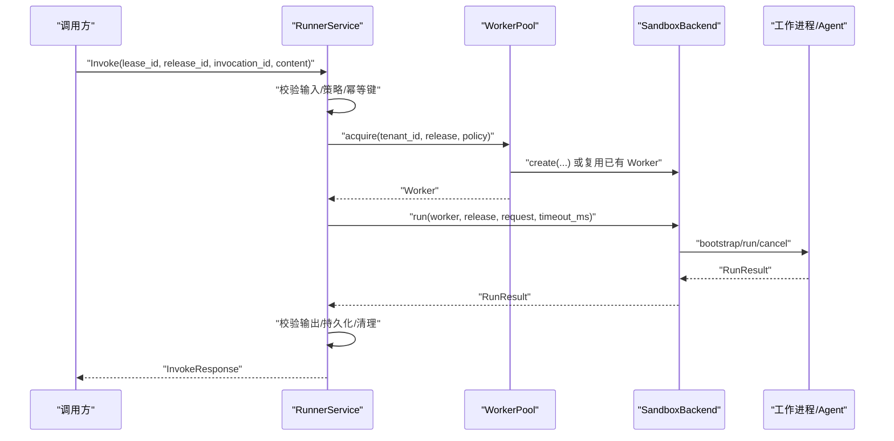

**图表来源**
- [runner_engine/service.py:188-362](file://runner_engine/service.py#L188-L362)
- [runner_engine/pool.py:73-130](file://runner_engine/pool.py#L73-L130)
- [runner_engine/sandbox/backend.py:14-49](file://runner_engine/sandbox/backend.py#L14-L49)
- [runner_engine/worker/agent.py:467-798](file://runner_engine/worker/agent.py#L467-L798)

## 详细组件分析

### SandboxBackend 协议接口
SandboxBackend 定义了统一的工作进程生命周期接口：
- create：根据租户、发布版本、安全策略与孤儿 TTL 创建工作进程。
- renew：续期工作进程过期时间。
- install：将发布包安装到工作进程中。
- run：在工作进程中执行一次调用，返回 RunResult。
- cancel：尝试取消正在运行的调用。
- destroy：销毁工作进程。
- cleanup_managed：清理托管遗留资源。

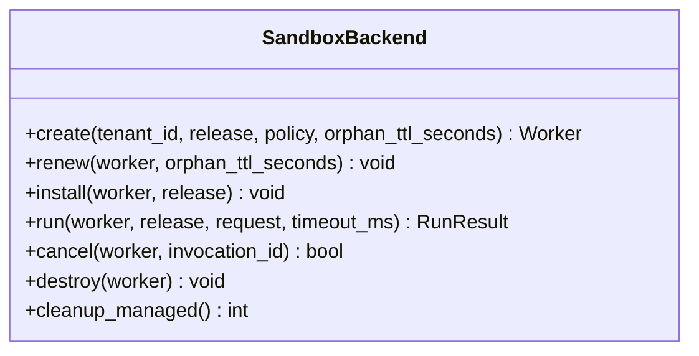

**图表来源**
- [runner_engine/sandbox/backend.py:14-49](file://runner_engine/sandbox/backend.py#L14-L49)

**章节来源**
- [runner_engine/sandbox/backend.py:14-49](file://runner_engine/sandbox/backend.py#L14-L49)

### 本地进程沙箱 LocalBackend
LocalBackend 使用本地临时目录与 AgentState 模拟沙箱：
- create：生成 token、临时目录，构造 AgentState，返回 Worker。
- install：将发布包 base64 编码后通过 AgentState.bootstrap 安装。
- run：通过 AgentState.run 执行用户算子，并将响应转换为 RunResult。
- cancel：通过 AgentState.cancel 触发取消。
- destroy/cleanup_managed：清理内存与工作目录。

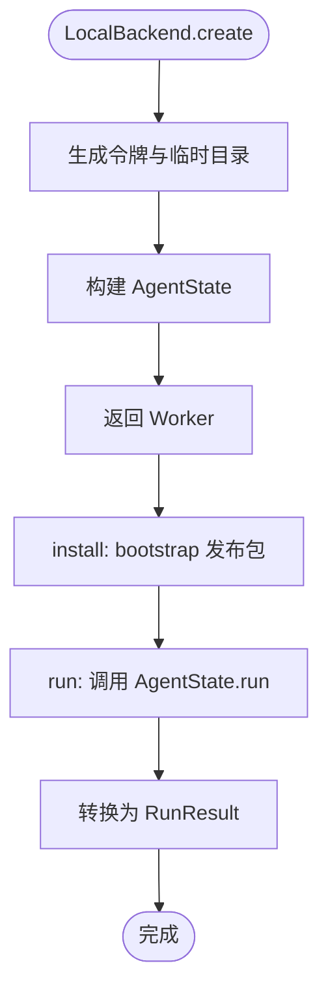

**图表来源**
- [runner_engine/sandbox/local.py:24-62](file://runner_engine/sandbox/local.py#L24-L62)
- [runner_engine/sandbox/local.py:67-111](file://runner_engine/sandbox/local.py#L67-L111)
- [runner_engine/worker/agent.py:353-368](file://runner_engine/worker/agent.py#L353-L368)
- [runner_engine/worker/agent.py:467-798](file://runner_engine/worker/agent.py#L467-L798)

**章节来源**
- [runner_engine/sandbox/local.py:14-132](file://runner_engine/sandbox/local.py#L14-L132)
- [runner_engine/worker/agent.py:309-798](file://runner_engine/worker/agent.py#L309-L798)

### OpenSandbox 集群沙箱 OpenSandboxBackend
OpenSandboxBackend 通过 HTTP 与 OpenSandbox 集群交互：
- create：向集群 POST /v1/sandboxes 创建沙箱，轮询状态直到 RUNNING/READY/STARTED，再获取 agent 端口端点，轮询健康检查。
- renew：POST /v1/sandboxes/{id}/renew-expiration 续期。
- install：通过工作进程 HTTP 接口 /bootstrap 安装发布包。
- run：通过 /run 执行调用，设置传输超时包含缓冲时间。
- cancel：通过 /cancel 取消调用。
- destroy：DELETE /v1/sandboxes/{id}，忽略 404。
- cleanup_managed：分页查询所有沙箱，按 managed-by 与 runner-owner 标签筛选并删除。

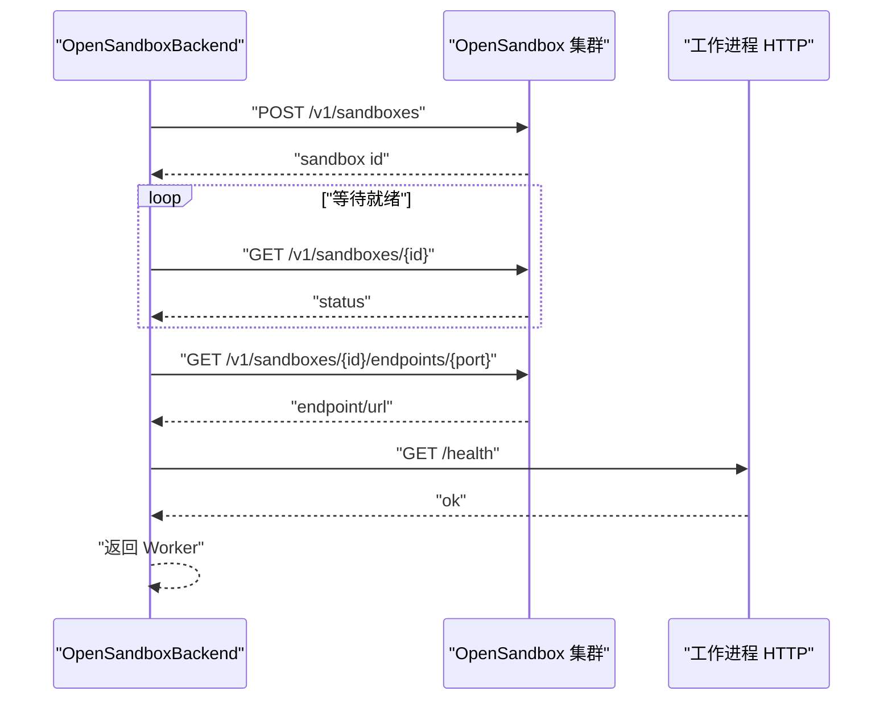

**图表来源**
- [runner_engine/sandbox/opensandbox.py:141-290](file://runner_engine/sandbox/opensandbox.py#L141-L290)
- [runner_engine/worker/http_api.py:8-39](file://runner_engine/worker/http_api.py#L8-L39)

**章节来源**
- [runner_engine/sandbox/opensandbox.py:31-440](file://runner_engine/sandbox/opensandbox.py#L31-L440)
- [runner_engine/worker/http_api.py:8-39](file://runner_engine/worker/http_api.py#L8-L39)

### 工作池 WorkerPool
WorkerPool 负责：
- 按 tenant_id + runtime.id + profile 作为键缓存空闲 Worker。
- 自动续期即将过期的沙箱 TTL。
- 按需安装发布包，避免重复安装。
- acquire/release/invalidate/reap/reset_after_restart 等方法保证资源唯一销毁与配额释放。

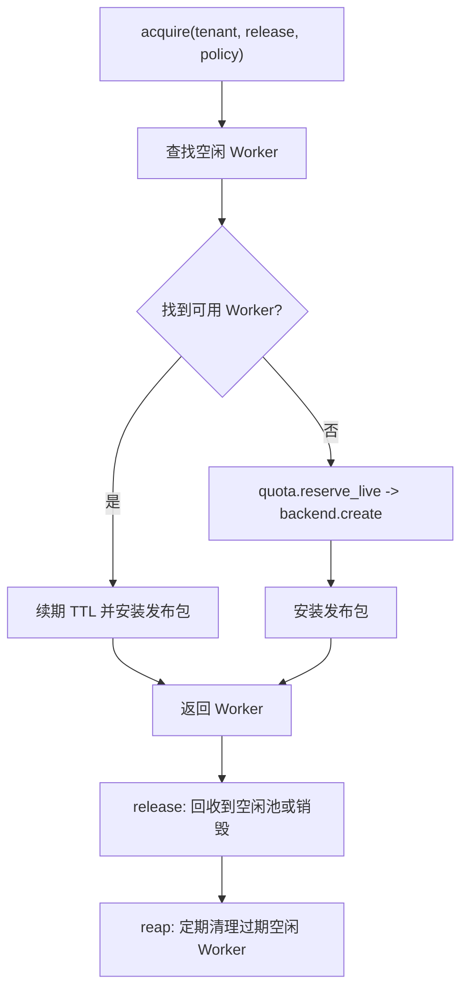

**图表来源**
- [runner_engine/pool.py:47-130](file://runner_engine/pool.py#L47-L130)
- [runner_engine/pool.py:132-188](file://runner_engine/pool.py#L132-L188)

**章节来源**
- [runner_engine/pool.py:11-188](file://runner_engine/pool.py#L11-L188)

### 服务编排 RunnerService
RunnerService 负责：
- 启动时清理托管遗留与数据库中的陈旧运行记录。
- 后台线程周期性回收空闲沙箱、清理租约与幂等记录。
- invoke 中校验内容大小、必填字段、属性白名单与字节上限。
- 基于 idempotency_key 去重与缓存结果。
- 将结果写回数据库，并根据错误码决定是否复用或失效 Worker。
- cancel 中校验租户与租约归属，转发到后端取消。

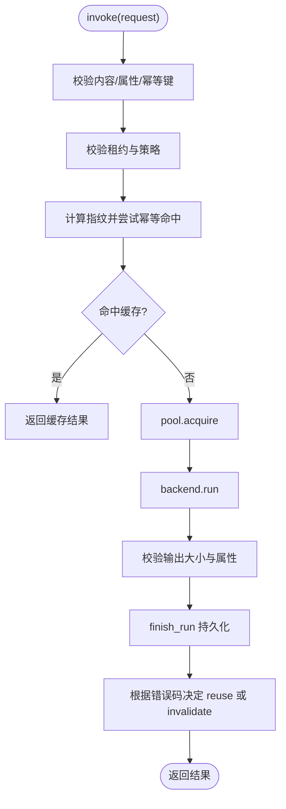

**图表来源**
- [runner_engine/service.py:188-362](file://runner_engine/service.py#L188-L362)

**章节来源**
- [runner_engine/service.py:80-456](file://runner_engine/service.py#L80-L456)

### 受信任代理 AgentState
AgentState 是沙箱内的可信执行环境：
- bootstrap：验证发布包 ID 并安装到 releases_root。
- health：返回健康状态与路径兼容性。
- run：串行执行用户子进程，限制 stdout/stderr 与协议帧大小，支持超时与取消。
- cancel：标记取消并终止进程组。
- 工作空间准备：为每次调用创建隔离 scratch_dir，复制 runtime 工作区并设置权限。

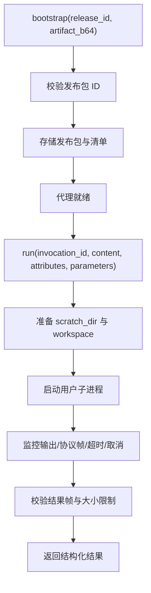

**图表来源**
- [runner_engine/worker/agent.py:353-368](file://runner_engine/worker/agent.py#L353-L368)
- [runner_engine/worker/agent.py:399-424](file://runner_engine/worker/agent.py#L399-L424)
- [runner_engine/worker/agent.py:467-798](file://runner_engine/worker/agent.py#L467-L798)

**章节来源**
- [runner_engine/worker/agent.py:309-798](file://runner_engine/worker/agent.py#L309-L798)

## 依赖关系分析
- RunnerService 依赖 Catalog、RunnerDB、WorkerPool、SecurityPolicy 字典。
- WorkerPool 依赖 SandboxBackend 与 Quota。
- LocalBackend 依赖 AgentState 与临时目录。
- OpenSandboxBackend 依赖 http_api.call 与 opensandbox.json 集群配置。
- AgentState 依赖 materializer 与操作系统能力（POSIX）。
- 策略加载器 policy.load_policies 读取 policies.json 映射 profile 到 SecurityPolicy。

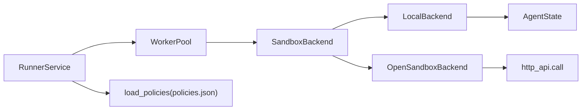

**图表来源**
- [runner_engine/service.py:80-115](file://runner_engine/service.py#L80-L115)
- [runner_engine/pool.py:11-46](file://runner_engine/pool.py#L11-L46)
- [runner_engine/sandbox/local.py:14-62](file://runner_engine/sandbox/local.py#L14-L62)
- [runner_engine/sandbox/opensandbox.py:31-50](file://runner_engine/sandbox/opensandbox.py#L31-L50)
- [runner_engine/worker/http_api.py:8-39](file://runner_engine/worker/http_api.py#L8-L39)
- [runner_engine/policy.py:9-25](file://runner_engine/policy.py#L9-L25)

**章节来源**
- [runner_engine/service.py:80-115](file://runner_engine/service.py#L80-L115)
- [runner_engine/pool.py:11-46](file://runner_engine/pool.py#L11-L46)
- [runner_engine/sandbox/local.py:14-62](file://runner_engine/sandbox/local.py#L14-L62)
- [runner_engine/sandbox/opensandbox.py:31-50](file://runner_engine/sandbox/opensandbox.py#L31-L50)
- [runner_engine/worker/http_api.py:8-39](file://runner_engine/worker/http_api.py#L8-L39)
- [runner_engine/policy.py:9-25](file://runner_engine/policy.py#L9-L25)

## 性能与资源限制
- 内容大小限制：RunnerService 限制 inline content 最大 8 MiB；AgentState 限制用户 stdout/stderr 各 1 MiB，协议帧额外开销。
- 属性限制：RunnerService 限制属性数量与总字节数；AgentState 校验结果属性数量与字节数。
- 超时控制：RunnerService 将请求超时与策略 max_timeout_ms 取最小值；AgentState 使用子进程 wait 超时并终止进程组。
- 资源限制：OpenSandboxBackend 在创建沙箱时注入 CPU/memory 限制；LocalBackend 通过 child_uid/gid/nproc/nofile 与地址空间参数约束子进程。
- 输出限制：AgentState 限制最大输出字节数，超出则返回 LOG_LIMIT 或 CHILD_PROTOCOL_ERROR。

**章节来源**
- [runner_engine/service.py:15-17](file://runner_engine/service.py#L15-L17)
- [runner_engine/service.py:39-59](file://runner_engine/service.py#L39-L59)
- [runner_engine/service.py:231-235](file://runner_engine/service.py#L231-L235)
- [runner_engine/worker/agent.py:26-33](file://runner_engine/worker/agent.py#L26-L33)
- [runner_engine/worker/agent.py:494-506](file://runner_engine/worker/agent.py#L494-L506)
- [runner_engine/worker/agent.py:674-722](file://runner_engine/worker/agent.py#L674-L722)
- [runner_engine/sandbox/opensandbox.py:152-158](file://runner_engine/sandbox/opensandbox.py#L152-L158)
- [runner_engine/sandbox/local.py:38-47](file://runner_engine/sandbox/local.py#L38-L47)

## 故障恢复与状态同步
- 启动恢复：RunnerService.startup 清理托管遗留沙箱，并将数据库中 RUNNING 的执行标记为 ABANDONED，同时清理过期租约与幂等记录。
- 后台维护：RunnerService.start_background 周期执行 pool.reap、清理过期租约与幂等记录、清理旧运行记录。
- 幂等与缓存：RunnerService.invoke 基于 idempotency_key 计算指纹，若命中缓存直接返回结果。
- 失败重试：部分错误码（如 TIMEOUT/CANCELLED/CPU_LIMIT 等）允许 Worker 复用；其他错误导致 invalidate。
- 取消失败：RunnerService.cancel 捕获异常并转为 CANCEL_FAILED，同时尝试 invalidate Worker。

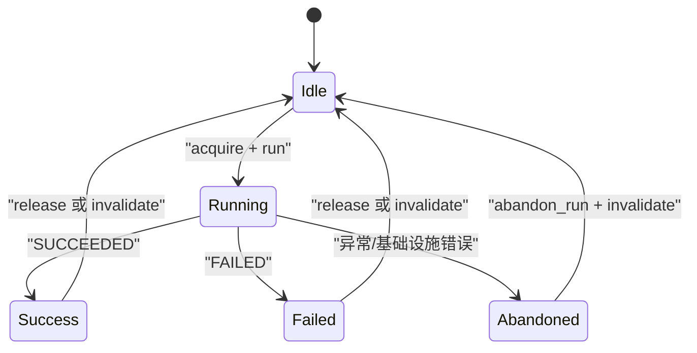

**图表来源**
- [runner_engine/service.py:105-115](file://runner_engine/service.py#L105-L115)
- [runner_engine/service.py:117-138](file://runner_engine/service.py#L117-L138)
- [runner_engine/service.py:245-257](file://runner_engine/service.py#L245-L257)
- [runner_engine/service.py:334-362](file://runner_engine/service.py#L334-L362)
- [runner_engine/service.py:364-405](file://runner_engine/service.py#L364-L405)
- [runner_engine/service.py:411-456](file://runner_engine/service.py#L411-L456)

**章节来源**
- [runner_engine/service.py:105-138](file://runner_engine/service.py#L105-L138)
- [runner_engine/service.py:245-405](file://runner_engine/service.py#L245-L405)
- [runner_engine/service.py:411-456](file://runner_engine/service.py#L411-L456)

## 配置与环境变量
- OpenSandbox 集群配置（opensandbox.json）：
  - 每个集群条目包含 url 与 api_key。
  - OpenSandboxBackend 通过 _cluster(name) 获取配置，并在请求头中添加 OPEN-SANDBOX-API-KEY。
- 安全策略（policies.json）：
  - 每个 profile 指定 sandbox_cluster、cpu、memory、max_timeout_ms、network_allow、reuse_sandbox。
  - policy.load_policies 将其映射为 SecurityPolicy。
- 环境变量：
  - RUNNER_DEPENDENCY_ROOT：本地后端用于依赖根目录。
  - 工作进程代理内部使用 RUNNER_* 系列环境变量传递运行时与限制参数给子进程。

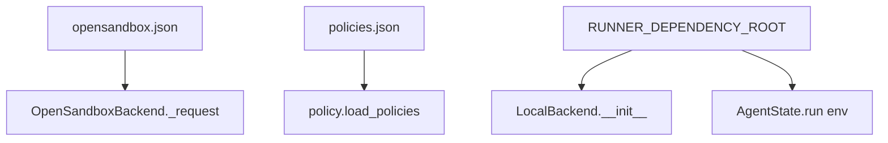

**图表来源**
- [config/opensandbox.json:1-11](file://config/opensandbox.json#L1-L11)
- [runner_engine/sandbox/opensandbox.py:61-110](file://runner_engine/sandbox/opensandbox.py#L61-L110)
- [config/policies.json:1-19](file://config/policies.json#L1-L19)
- [runner_engine/policy.py:9-25](file://runner_engine/policy.py#L9-L25)
- [runner_engine/sandbox/local.py:42-47](file://runner_engine/sandbox/local.py#L42-L47)
- [runner_engine/worker/agent.py:546-568](file://runner_engine/worker/agent.py#L546-L568)

**章节来源**
- [config/opensandbox.json:1-11](file://config/opensandbox.json#L1-L11)
- [runner_engine/sandbox/opensandbox.py:61-110](file://runner_engine/sandbox/opensandbox.py#L61-L110)
- [config/policies.json:1-19](file://config/policies.json#L1-L19)
- [runner_engine/policy.py:9-25](file://runner_engine/policy.py#L9-L25)
- [runner_engine/sandbox/local.py:42-47](file://runner_engine/sandbox/local.py#L42-L47)
- [runner_engine/worker/agent.py:546-568](file://runner_engine/worker/agent.py#L546-L568)

## 监控、日志与可观测性
- 日志：RunnerService 使用标准 logging 模块记录后台维护失败、Worker 清理失败等信息。
- 指标与观察：web/observe 提供运行时与沙箱观测能力，但具体实现不在本仓库源码范围内，建议结合外部监控系统采集 RunnerEngine 日志与 OpenSandbox 集群指标。
- 健康检查：AgentState.health 返回 ok/busy/path_compatibility；OpenSandboxBackend 在创建后轮询 /health 确保代理就绪。
- 错误分类：RunnerService 将错误分为 RunnerError 与基础设施错误，并通过 error_code/error_message 传递给调用方。

**章节来源**
- [runner_engine/service.py:123-138](file://runner_engine/service.py#L123-L138)
- [runner_engine/service.py:351-359](file://runner_engine/service.py#L351-L359)
- [runner_engine/worker/agent.py:370-377](file://runner_engine/worker/agent.py#L370-L377)
- [runner_engine/sandbox/opensandbox.py:259-290](file://runner_engine/sandbox/opensandbox.py#L259-L290)

## 自定义沙箱后端实现指南
要实现自定义沙箱后端以支持新的隔离环境，请遵循以下步骤：

1. 实现 SandboxBackend 协议
   - 必须实现 create/renew/install/run/cancel/destroy/cleanup_managed 方法。
   - create 应返回 Worker，包含 id、endpoint、token、tenant_id、runtime_id、profile、backend_group、时间戳与可选 metadata。
   - run 应返回 RunResult，包含 status、relationship、content、attributes、retryable、error_code、error_message、worker_id、duration_ms。

2. 创建工作进程
   - 如果新环境通过 HTTP 暴露控制接口，参考 OpenSandboxBackend 使用 http_api.call 封装请求，并处理超时与错误。
   - 如果新环境通过本地进程执行，参考 LocalBackend 使用 AgentState 或直接 subprocess 管理子进程。

3. 安装发布包
   - install 应将 OperatorRelease 的 artifact_path 内容安装到工作进程，可通过 base64 编码传输或通过文件系统挂载。
   - 对于 HTTP 后端，通常调用 /bootstrap；对于本地后端，调用 AgentState.bootstrap。

4. 执行调用
   - run 应接受 RunRequest 与 timeout_ms，并返回 RunResult。
   - 注意限制输出大小与属性大小，避免溢出与拒绝服务。

5. 取消与销毁
   - cancel 应支持按 invocation_id 取消，返回布尔表示是否成功取消。
   - destroy 应清理底层资源；cleanup_managed 应扫描并清理托管遗留资源。

6. 安全策略集成
   - 使用 SecurityPolicy.sandbox_cluster 选择目标集群或后端分组。
   - 使用 SecurityPolicy.cpu/memory 设置资源限制。
   - 使用 SecurityPolicy.max_timeout_ms 限制最长执行时间。
   - 使用 SecurityPolicy.reuse_sandbox 决定是否复用沙箱。

7. 错误处理与重试
   - 对外部网络错误与不可达错误应标记 retryable=True。
   - 对协议不匹配或缺少必要字段应抛出明确错误。

8. 监控与健康检查
   - 在 create 完成后进行健康检查，确保工作进程就绪。
   - 提供 /health 接口以便上层调度判断可用性。

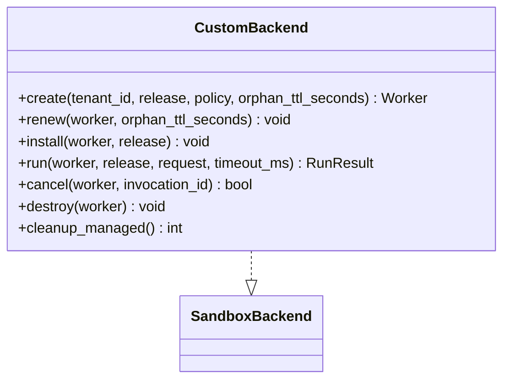

**图表来源**
- [runner_engine/sandbox/backend.py:14-49](file://runner_engine/sandbox/backend.py#L14-L49)

**章节来源**
- [runner_engine/sandbox/backend.py:14-49](file://runner_engine/sandbox/backend.py#L14-L49)
- [runner_engine/sandbox/local.py:14-132](file://runner_engine/sandbox/local.py#L14-L132)
- [runner_engine/sandbox/opensandbox.py:31-440](file://runner_engine/sandbox/opensandbox.py#L31-L440)
- [runner_engine/worker/http_api.py:8-39](file://runner_engine/worker/http_api.py#L8-L39)

## 常见问题排查
- 沙箱启动失败：
  - 检查 OpenSandbox 集群 URL 与 API Key 是否正确。
  - 查看 SANDBOX_START_FAILED/SANDBOX_START_TIMEOUT 错误信息。
- 代理未就绪：
  - 检查 AGENT_START_TIMEOUT 与 /health 响应。
  - 确认 endpoint_headers 是否正确透传。
- 调用超时：
  - 检查策略 max_timeout_ms 与请求 timeout_ms。
  - 查看 USER_PROCESS_SIGNALED/CPU_LIMIT 错误。
- 输出过大：
  - 检查 OUTPUT_TOO_LARGE 与 LOG_LIMIT 错误。
  - 调整 AgentState 的输出与属性限制。
- 幂等冲突：
  - 检查 INVOCATION_ID_IN_USE 错误，确保 invocation_id 唯一。
- 取消失败：
  - 检查 CANCEL_FAILED 错误，确认租户与租约归属。

**章节来源**
- [runner_engine/sandbox/opensandbox.py:206-219](file://runner_engine/sandbox/opensandbox.py#L206-L219)
- [runner_engine/sandbox/opensandbox.py:282-290](file://runner_engine/sandbox/opensandbox.py#L282-L290)
- [runner_engine/worker/agent.py:696-722](file://runner_engine/worker/agent.py#L696-L722)
- [runner_engine/service.py:238-244](file://runner_engine/service.py#L238-L244)
- [runner_engine/service.py:436-456](file://runner_engine/service.py#L436-L456)

## 结论
Runner Engine 的沙箱系统通过 SandboxBackend 协议实现了统一的隔离抽象，LocalBackend 与 OpenSandboxBackend 分别覆盖了本地进程与集群容器化场景。WorkerPool 与 RunnerService 共同保障了沙箱的高效复用、安全策略执行、资源限制与状态一致性。开发者可依据本指南扩展新的沙箱后端，接入不同的隔离环境，并通过策略与配置灵活控制资源与行为。