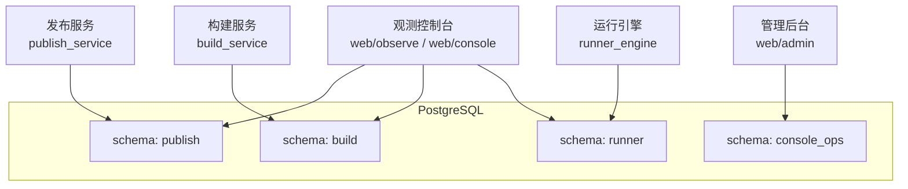
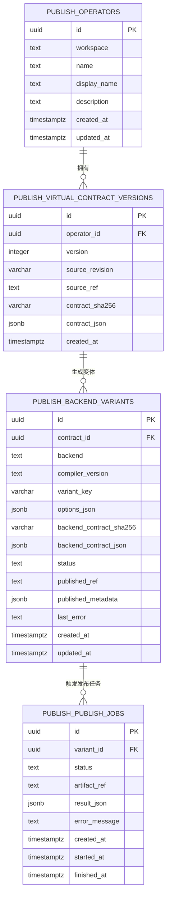
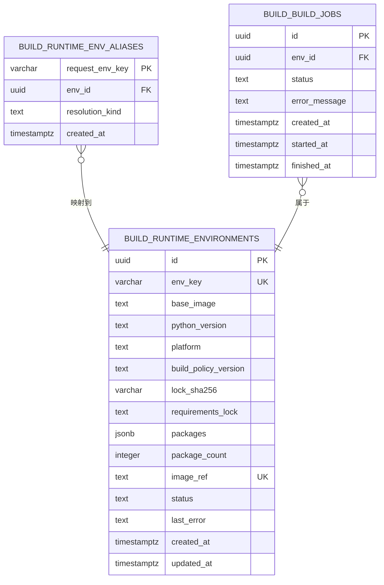
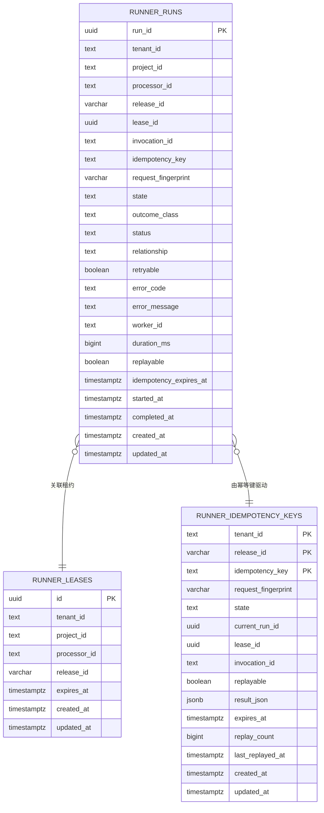
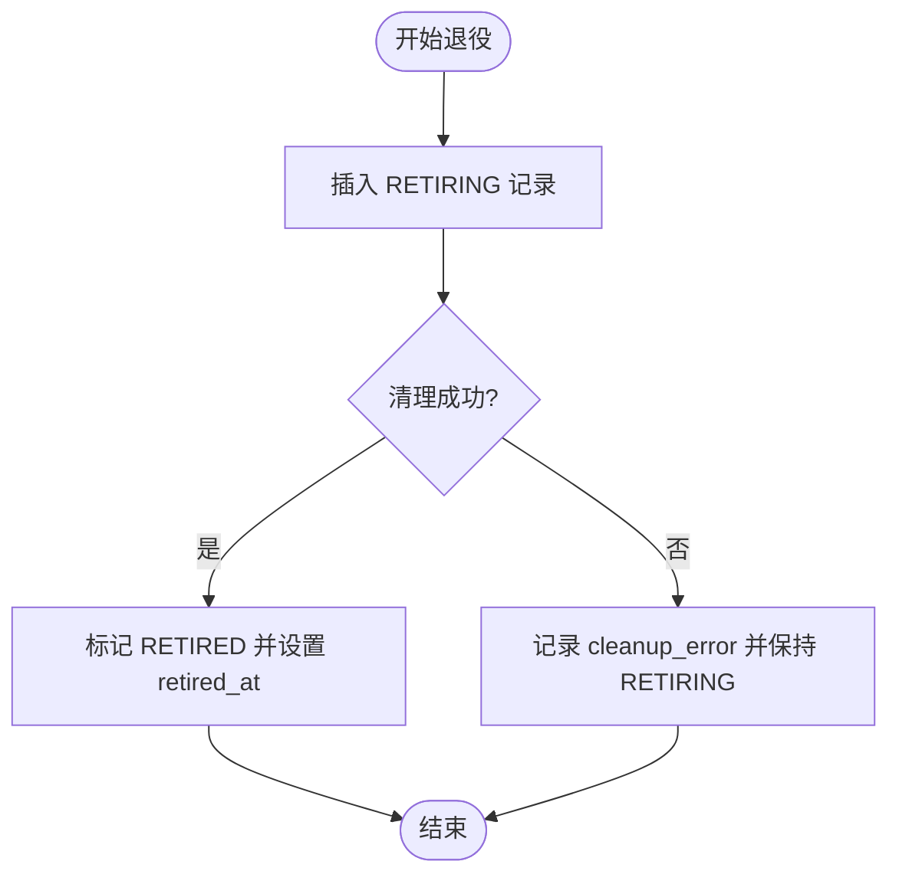
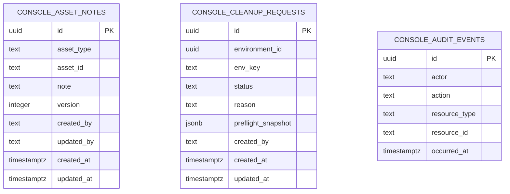
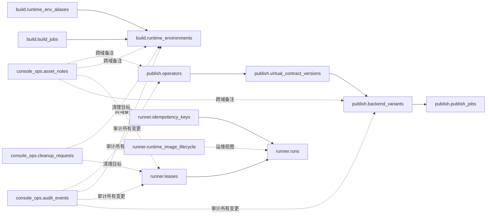
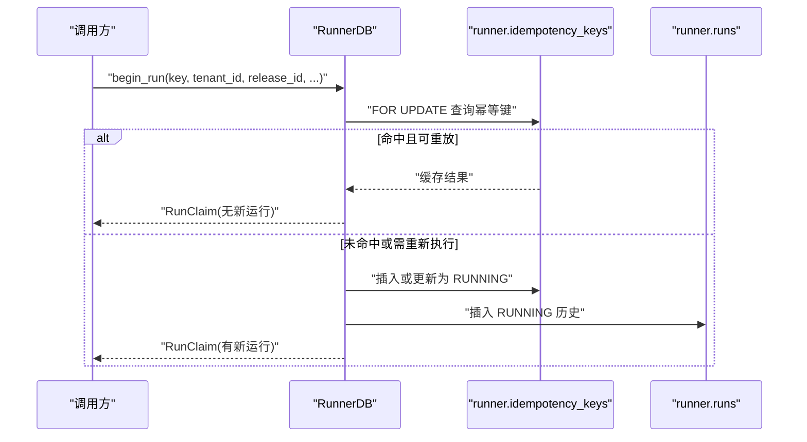
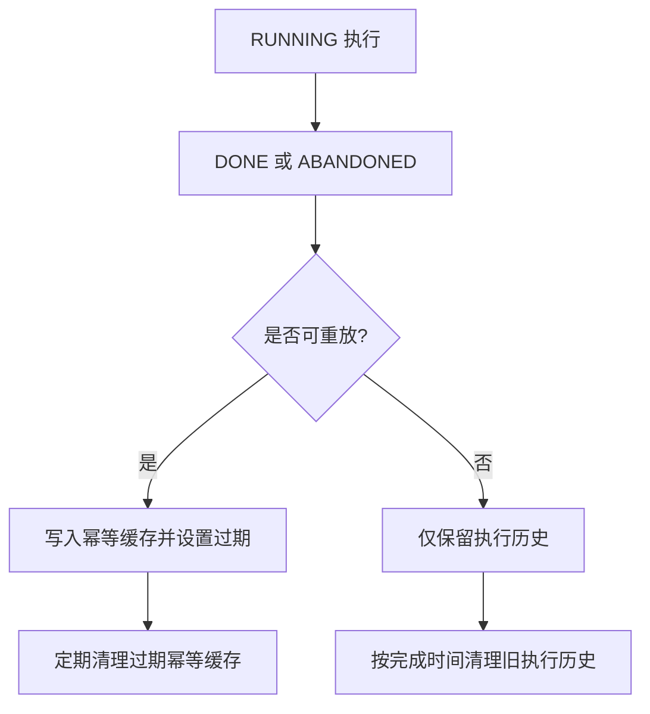
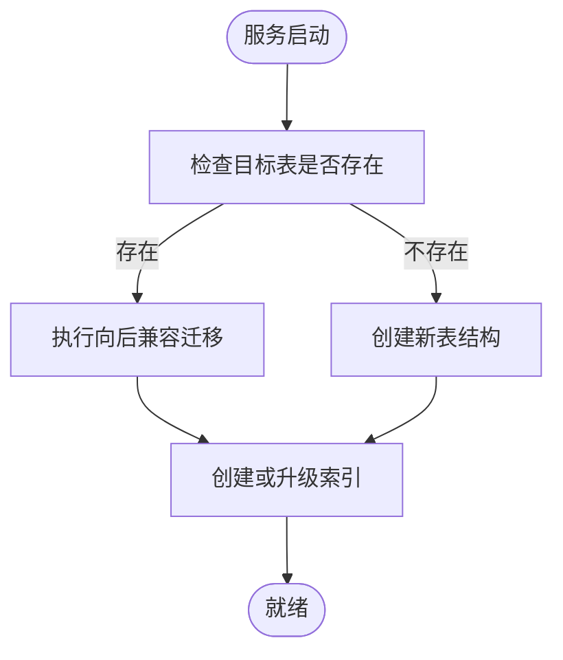

# 数据库设计

<cite>
**本文引用的文件**   
- [sql/publish_schema.sql](file://sql/publish_schema.sql)
- [build_service/store.py](file://build_service/store.py)
- [runner_engine/state.py](file://runner_engine/state.py)
- [runner_engine/lifecycle_store.py](file://runner_engine/lifecycle_store.py)
- [web/admin/sql/001_admin_schema.sql](file://web/admin/sql/001_admin_schema.sql)
- [web/console/sql_schemas.py](file://web/console/sql_schemas.py)
- [web/admin/inventory.py](file://web/admin/inventory.py)
- [web/admin/store.py](file://web/admin/store.py)
- [web/observe/database.py](file://web/observe/database.py)
</cite>

## 目录
1. [引言](#引言)
2. [项目结构与数据库边界](#项目结构与数据库边界)
3. [核心数据模型总览](#核心数据模型总览)
4. [发布服务数据模型](#发布服务数据模型)
5. [构建服务数据模型](#构建服务数据模型)
6. [运行引擎数据模型](#运行引擎数据模型)
7. [管理后台与运维元数据模型](#管理后台与运维元数据模型)
8. [实体关系与模式图](#实体关系与模式图)
9. [数据访问模式、缓存策略与幂等](#数据访问模式缓存策略与幂等)
10. [数据生命周期、保留策略与归档](#数据生命周期保留策略与归档)
11. [迁移路径与版本管理](#迁移路径与版本管理)
12. [数据安全、隐私与访问控制](#数据安全隐私与访问控制)
13. [性能特征与优化建议](#性能特征与优化建议)
14. [故障排查指南](#故障排查指南)
15. [结论](#结论)

## 引言
本文件面向 Runner Engine 的数据库设计，覆盖发布服务、构建服务、运行引擎和管理后台四个关键域。文档重点说明：
- 实体关系、字段定义和数据类型。
- 主键、外键、唯一约束和检查约束。
- 索引设计与查询优化点。
- 数据验证规则、业务状态机与幂等语义。
- 数据访问模式、连接池、缓存策略与性能考虑。
- 数据生命周期、清理策略和归档思路。
- 迁移路径、向后兼容和版本管理。
- 安全、隐私和最小权限访问控制。

该设计以 PostgreSQL 为核心持久化层，使用 JSONB 存储契约、选项和结果等半结构化数据，并通过 schema 隔离不同服务的领域数据。

## 项目结构与数据库边界
Runner Engine 将数据库按“服务 + schema”的方式划分：
- `publish` schema：发布服务使用的算子、虚拟契约、后端变体和发布任务。
- `build` schema：构建服务使用的运行时环境、别名映射和构建任务。
- `runner` schema：运行引擎使用的租约、执行历史、幂等缓存和运行时镜像生命周期。
- `console_ops` schema：管理后台和运维工具使用的资产备注、清理请求和审计事件。

**图表来源**
- [sql/publish_schema.sql:1-68](file://sql/publish_schema.sql#L1-L68)
- [build_service/store.py:12-62](file://build_service/store.py#L12-L62)
- [runner_engine/state.py:16-82](file://runner_engine/state.py#L16-L82)
- [runner_engine/lifecycle_store.py:10-28](file://runner_engine/lifecycle_store.py#L10-L28)
- [web/admin/sql/001_admin_schema.sql:1-52](file://web/admin/sql/001_admin_schema.sql#L1-L52)

**章节来源**
- [web/console/sql_schemas.py:1-48](file://web/console/sql_schemas.py#L1-L48)
- [web/admin/inventory.py:1-43](file://web/admin/inventory.py#L1-L43)

## 核心数据模型总览
| 领域 | 主要表 | 用途 | 关键字段 | 主要约束 |
|---|---|---|---|---|
| 发布服务 | `publish.operators` | 算子元信息 | `id`, `workspace`, `name`, `display_name`, `description` | 主键；`(workspace, name)` 唯一 |
| 发布服务 | `publish.virtual_contract_versions` | 虚拟契约版本 | `id`, `operator_id`, `version`, `source_revision`, `contract_sha256`, `contract_json` | 主键；`(operator_id, version)` 唯一；`(operator_id, contract_sha256)` 唯一；JSONB 为对象 |
| 发布服务 | `publish.backend_variants` | 后端变体编译产物 | `id`, `contract_id`, `backend`, `compiler_version`, `variant_key`, `options_json`, `status` | 主键；`(contract_id, backend, variant_key)` 唯一；`status` 枚举 |
| 发布服务 | `publish.publish_jobs` | 发布任务 | `id`, `variant_id`, `status`, `artifact_ref`, `result_json` | 主键；`status` 枚举 |
| 构建服务 | `build.runtime_environments` | 运行时环境 | `id`, `env_key`, `base_image`, `python_version`, `platform`, `packages`, `package_count`, `status` | 主键；`env_key` 唯一；`image_ref` 唯一；JSONB 为对象；`package_count >= 0`；`status` 枚举 |
| 构建服务 | `build.runtime_env_aliases` | 请求级环境别名 | `request_env_key`, `env_id`, `resolution_kind` | 主键；外键到 `runtime_environments`；`resolution_kind` 枚举 |
| 构建服务 | `build.build_jobs` | 构建任务 | `id`, `env_id`, `status`, `error_message` | 主键；外键到 `runtime_environments`；`status` 枚举 |
| 运行引擎 | `runner.leases` | 执行租约 | `id`, `tenant_id`, `project_id`, `processor_id`, `release_id`, `expires_at` | 主键；过期时间索引；租户+处理器索引 |
| 运行引擎 | `runner.runs` | 执行历史 | `run_id`, `tenant_id`, `release_id`, `lease_id`, `invocation_id`, `state`, `outcome_class`, `started_at`, `completed_at` | 主键；`state` 枚举；多类查询索引 |
| 运行引擎 | `runner.idempotency_keys` | 幂等缓存 | `(tenant_id, release_id, idempotency_key)` 复合主键；`current_run_id`；`result_json` | 复合主键；`state` 枚举；过期时间索引 |
| 运行引擎 | `runner.runtime_image_lifecycle` | 运行时镜像退役 | `runtime_id`, `image_ref`, `state`, `reason`, `retired_at` | 主键；`image_ref` 唯一；`state` 枚举 |
| 管理后台 | `console_ops.asset_notes` | 资产备注 | `id`, `asset_type`, `asset_id`, `note`, `version`, `created_by`, `updated_by` | 主键；`(asset_type, asset_id)` 唯一；长度和枚举约束 |
| 管理后台 | `console_ops.cleanup_requests` | 清理请求 | `id`, `environment_id`, `env_key`, `status`, `reason`, `preflight_snapshot` | 主键；`status` 枚举；JSONB 为对象；长度约束 |
| 管理后台 | `console_ops.audit_events` | 审计事件 | `id`, `actor`, `action`, `resource_type`, `resource_id`, `occurred_at` | 主键；按发生时间倒序索引 |

**章节来源**
- [sql/publish_schema.sql:3-67](file://sql/publish_schema.sql#L3-L67)
- [build_service/store.py:15-62](file://build_service/store.py#L15-L62)
- [runner_engine/state.py:19-82](file://runner_engine/state.py#L19-L82)
- [runner_engine/lifecycle_store.py:13-28](file://runner_engine/lifecycle_store.py#L13-L28)
- [web/admin/sql/001_admin_schema.sql:5-43](file://web/admin/sql/001_admin_schema.sql#L5-L43)

## 发布服务数据模型
### 算子与契约
- `publish.operators` 记录算子的工作区、名称、显示名和描述，并通过 `(workspace, name)` 保证同一工作区内算子名唯一。
- `publish.virtual_contract_versions` 记录算子的虚拟契约版本，包含源码修订、引用、契约摘要和 JSONB 契约内容。通过 `(operator_id, version)` 和 `(operator_id, contract_sha256)` 双重唯一约束，防止重复版本和重复契约内容。
- 索引 `ix_publish_contract_operator_created` 支持按算子和版本号倒序查询最新契约。
- 索引 `ix_publish_contract_source_revision` 支持按源码修订快速定位契约。

### 后端变体与发布任务
- `publish.backend_variants` 记录某个契约在不同后端、编译器版本和变体键下的编译产物。`status` 限制为 `COMPILED`、`PUBLISHED`、`FAILED`。
- `published_ref` 和 `published_metadata` 用于记录已发布产物引用和元数据。
- `publish.publish_jobs` 记录发布任务的状态、产物引用、结果和错误信息。

**图表来源**
- [sql/publish_schema.sql:3-67](file://sql/publish_schema.sql#L3-L67)

**章节来源**
- [sql/publish_schema.sql:3-67](file://sql/publish_schema.sql#L3-L67)

## 构建服务数据模型
### 运行时环境与别名
- `build.runtime_environments` 记录运行时环境的基镜像、Python 版本、平台、构建策略版本、锁摘要、依赖锁定文件和包集合。`packages` 是 JSONB 对象，`package_count` 是顶层包数量，便于选择最小超集环境。
- `build.runtime_env_aliases` 将请求级 `request_env_key` 映射到具体环境，并记录解析方式（精确或超集）。
- `build.build_jobs` 记录每个环境的构建任务状态、错误信息和起止时间。

**图表来源**
- [build_service/store.py:15-62](file://build_service/store.py#L15-L62)

**章节来源**
- [build_service/store.py:15-62](file://build_service/store.py#L15-L62)

## 运行引擎数据模型
### 租约与执行历史
- `runner.leases` 表示运行引擎对某个处理器在特定 release 上的短期使用权，包含租户、项目和处理器标识以及过期时间。
- `runner.runs` 是执行历史表，记录每次调用的运行 ID、租户、项目、处理器、release、租约、调用 ID、幂等键、请求指纹、状态、结果分类、错误信息、工作器 ID、耗时、是否可重放和幂等过期时间。
- `runner.idempotency_keys` 是短生命周期的幂等缓存，主键为 `(tenant_id, release_id, idempotency_key)`，记录当前运行 ID、租约、调用 ID、状态、结果 JSONB、过期时间和重放计数。

**图表来源**
- [runner_engine/state.py:19-82](file://runner_engine/state.py#L19-L82)

### 运行时镜像生命周期
- `runner.runtime_image_lifecycle` 记录镜像退役流程，包括运行时 ID、镜像引用、状态、原因、清理错误、退役时间和更新时间。

**图表来源**
- [runner_engine/lifecycle_store.py:82-136](file://runner_engine/lifecycle_store.py#L82-L136)

**章节来源**
- [runner_engine/state.py:19-82](file://runner_engine/state.py#L19-L82)
- [runner_engine/lifecycle_store.py:13-28](file://runner_engine/lifecycle_store.py#L13-L28)

## 管理后台与运维元数据模型
### 资产备注
- `console_ops.asset_notes` 允许为构建环境、运行租约、运行任务和发布变体添加备注。每条备注有版本、创建者和更新者，并通过 `(asset_type, asset_id)` 唯一约束保证每类资产只有一条活跃备注。

### 清理请求
- `console_ops.cleanup_requests` 记录环境清理请求，包括环境 ID、环境键、状态、原因和预检快照。状态限制为草稿或取消，原因有长度约束。

### 审计事件
- `console_ops.audit_events` 记录操作者、动作、资源类型、资源 ID 和发生时间，并按发生时间倒序索引，便于审计查询。

**图表来源**
- [web/admin/sql/001_admin_schema.sql:5-43](file://web/admin/sql/001_admin_schema.sql#L5-L43)

**章节来源**
- [web/admin/sql/001_admin_schema.sql:5-43](file://web/admin/sql/001_admin_schema.sql#L5-L43)

## 实体关系与模式图
整体数据库模式由四个 schema 组成，彼此通过逻辑职责分离，而非强外键耦合：
- 发布服务内部通过 `operator_id`、`contract_id`、`variant_id` 形成链式关系。
- 构建服务通过 `env_id` 将别名和构建任务关联到运行时环境。
- 运行引擎通过 `lease_id` 将执行历史与租约关联，并通过幂等键协调并发和重试。
- 管理后台独立维护运维元数据，不直接写入业务 schema。

**图表来源**
- [sql/publish_schema.sql:3-67](file://sql/publish_schema.sql#L3-L67)
- [build_service/store.py:15-62](file://build_service/store.py#L15-L62)
- [runner_engine/state.py:19-82](file://runner_engine/state.py#L19-L82)
- [runner_engine/lifecycle_store.py:13-28](file://runner_engine/lifecycle_store.py#L13-L28)
- [web/admin/sql/001_admin_schema.sql:5-43](file://web/admin/sql/001_admin_schema.sql#L5-L43)

## 数据访问模式、缓存策略与幂等
### 连接池与初始化
- 各服务均使用 `psycopg_pool.ConnectionPool` 管理连接，并在启动时自动初始化对应 schema 和索引。
- 运行引擎默认最大连接数较高，适合高并发执行场景；构建服务和生命周期存储使用较小连接池。

### 幂等与重试
- `runner.idempotency_keys` 提供基于 `(tenant_id, release_id, idempotency_key)` 的幂等保护。
- 当相同幂等键再次出现且请求指纹一致时，若缓存有效则返回缓存结果；否则进入 RUNNING 状态并创建新的执行历史。
- 完成执行后，非可重试结果会写入 `result_json` 并设置过期时间，供后续重放使用。
- 运行引擎重启时会把仍为 RUNNING 的历史标记为 ABANDONED，并清空对应的幂等 RUNNING 状态。

**图表来源**
- [runner_engine/state.py:411-521](file://runner_engine/state.py#L411-L521)

**章节来源**
- [runner_engine/state.py:131-177](file://runner_engine/state.py#L131-L177)
- [runner_engine/state.py:411-685](file://runner_engine/state.py#L411-L685)

## 数据生命周期、保留策略与归档
### 租约
- 租约具有明确过期时间，系统提供清理过期租约的方法，避免长期占用。

### 执行历史
- `runner.runs` 保留已完成和放弃的执行历史，并提供按时间清理旧记录的方法。
- 清理时会跳过仍被有效幂等缓存引用的记录，确保重放能力不受影响。

### 幂等缓存
- 幂等缓存仅在非可重试结果上设置过期时间，并支持清理过期条目。
- 重放计数和最后重放时间可用于监控幂等命中率。

### 运行时镜像退役
- 镜像退役从 RETIRING 过渡到 RETIRED，失败时可保留清理错误以便人工介入。
- 列表接口支持最近变更记录，便于运维观察。

### 构建环境
- 构建环境状态从 PENDING 到 BUILDING、VERIFYING、READY 或 FAILED，失败后可显式重置并重试。
- 构建任务作为历史记录保留，便于回溯构建过程。

**图表来源**
- [runner_engine/state.py:523-685](file://runner_engine/state.py#L523-L685)

**章节来源**
- [runner_engine/state.py:383-409](file://runner_engine/state.py#L383-L409)
- [runner_engine/state.py:650-685](file://runner_engine/state.py#L650-L685)
- [runner_engine/lifecycle_store.py:82-151](file://runner_engine/lifecycle_store.py#L82-L151)
- [build_service/store.py:226-331](file://build_service/store.py#L226-L331)

## 迁移路径与版本管理
### 运行引擎迁移
- 运行引擎在启动时检测 `runner.runs` 是否存在，若不存在则创建新表结构；若存在则执行向后兼容迁移。
- 迁移逻辑处理 v3.3 之前共用 `runs` 表作为审计历史和幂等缓存的情况，新增必要列并转换主键和约束。
- 迁移过程中会为旧行分配新的 `run_id`，并填充时间戳、状态分类和错误信息。

### 构建服务迁移
- 构建服务在启动时添加 `package_count` 列，并从现有 JSONB 包集合计算初始值，随后强制非空。
- 同时创建用于超集选择的复合索引，提升按基础镜像、Python 版本、平台和包集合的查询性能。

### 管理后台迁移
- 管理后台 schema 通过一次性 SQL 脚本创建，并由 Admin Store 在启动时确保存在。
- 权限示例注释表明 console_admin 角色不应拥有业务 schema 的写权限。

**图表来源**
- [runner_engine/state.py:151-177](file://runner_engine/state.py#L151-L177)
- [runner_engine/state.py:179-279](file://runner_engine/state.py#L179-L279)
- [build_service/store.py:79-122](file://build_service/store.py#L79-L122)
- [web/admin/store.py:77-90](file://web/admin/store.py#L77-L90)

**章节来源**
- [runner_engine/state.py:151-279](file://runner_engine/state.py#L151-L279)
- [build_service/store.py:79-122](file://build_service/store.py#L79-L122)
- [web/admin/store.py:77-90](file://web/admin/store.py#L77-L90)

## 数据安全、隐私与访问控制
### 最小权限原则
- 管理后台应仅拥有 `console_ops` schema 的读写权限，不应拥有 `publish.*`、`build.*`、`runner.*` 的更新或删除权限。
- 观测控制台通常使用只读账号访问业务 schema，避免误写。

### 敏感字段与隐私
- `runner.runs` 和 `runner.idempotency_keys` 可能包含请求指纹、错误消息和工作器标识，应避免在日志中明文输出。
- `publish.backend_variants.options_json` 和 `publish.publish_jobs.result_json` 可能包含配置或结果数据，需要评估是否包含敏感信息。
- `console_ops.cleanup_requests.preflight_snapshot` 可能包含环境快照，需谨慎处理。

### 访问控制建议
- 为不同服务创建独立数据库角色，分别授予对应 schema 的最小权限。
- 对外暴露的 API 应进行租户校验，例如运行引擎要求租约属于当前租户。
- 审计事件应记录关键操作者、动作和资源，但不记录敏感内容。

**章节来源**
- [web/admin/sql/001_admin_schema.sql:45-52](file://web/admin/sql/001_admin_schema.sql#L45-L52)
- [runner_engine/state.py:313-346](file://runner_engine/state.py#L313-L346)

## 性能特征与优化建议
### 索引设计
- 发布服务：
  - 按算子和版本号倒序索引，支持最新契约查询。
  - 按源码修订索引，支持溯源查询。
  - 按契约 ID、后端和创建时间倒序索引，支持变体查询。
  - 按变体 ID 和创建时间倒序索引，支持发布任务查询。
- 构建服务：
  - JSONB GIN 索引加速包集合包含查询。
  - 复合索引支持按基础镜像、Python 版本、平台、构建策略版本和状态查询。
  - 别名和环境 ID 索引加速别名解析。
  - 构建任务按环境和创建时间倒序索引。
- 运行引擎：
  - 租约按过期时间和租户+处理器索引。
  - 执行历史按开始时间、完成时间、租户+release+开始时间、错误码+开始时间、调用 ID、租户+release+幂等键索引。
  - 幂等缓存按过期时间索引。
- 管理后台：
  - 清理请求按环境 ID 和创建时间倒序索引。
  - 审计事件按发生时间倒序索引。

### 查询优化
- 优先使用复合索引匹配前缀，避免全表扫描。
- 对 JSONB 字段使用 `@>` 包含操作符配合 GIN 索引。
- 对时间范围查询使用 `TIMESTAMPTZ` 字段并结合索引。
- 分页查询应结合排序字段和索引，避免随机排序开销。

### 连接池与并发
- 运行引擎在高并发下需要足够连接池大小，但应避免过度连接导致数据库压力。
- 构建服务和生命周期存储的连接池较小，适合批处理和低频操作。

**章节来源**
- [sql/publish_schema.sql:27-67](file://sql/publish_schema.sql#L27-L67)
- [build_service/store.py:34-62](file://build_service/store.py#L34-L62)
- [runner_engine/state.py:167-177](file://runner_engine/state.py#L167-L177)
- [runner_engine/lifecycle_store.py:24-28](file://runner_engine/lifecycle_store.py#L24-L28)
- [web/admin/sql/001_admin_schema.sql:31-43](file://web/admin/sql/001_admin_schema.sql#L31-L43)

## 故障排查指南
### 常见错误与定位
- 租约未知或过期：检查 `runner.leases` 中是否存在对应 ID，确认租户和 release 匹配，检查过期时间。
- 幂等冲突：检查 `runner.idempotency_keys` 中相同幂等键的请求指纹是否一致，避免重用不同内容的幂等键。
- 执行状态丢失：检查 `runner.runs` 中对应 `run_id` 的行是否仍存在，确认 RUNNING 状态是否被其他进程修改。
- 构建失败：检查 `build.build_jobs.error_message` 和 `build.runtime_environments.last_error`，必要时重置环境状态重试。
- 镜像退役失败：检查 `runner.runtime_image_lifecycle.cleanup_error`，确认清理流程是否完成。

### 诊断步骤
1. 确认服务连接的数据库 URL 和 schema 是否正确。
2. 查看对应表的索引是否创建成功。
3. 检查约束是否被违反，例如枚举值、唯一键、JSONB 类型。
4. 使用审计事件和备注辅助定位问题来源。
5. 对于运行引擎问题，优先检查幂等缓存和执行历史的一致性。

**章节来源**
- [runner_engine/state.py:313-409](file://runner_engine/state.py#L313-L409)
- [runner_engine/state.py:523-685](file://runner_engine/state.py#L523-L685)
- [build_service/store.py:226-331](file://build_service/store.py#L226-L331)
- [runner_engine/lifecycle_store.py:79-151](file://runner_engine/lifecycle_store.py#L79-L151)

## 结论
Runner Engine 的数据库设计以 PostgreSQL 为核心，通过 schema 隔离发布、构建、运行和管理四大领域。发布服务聚焦算子契约和变体发布，构建服务负责运行时环境准备，运行引擎保障执行幂等和历史追溯，管理后台提供运维元数据和审计能力。设计中使用 JSONB 灵活存储契约、选项和结果，并通过丰富的索引和约束保证性能和一致性。建议在部署时严格遵循最小权限原则，合理配置连接池，并建立数据清理和归档策略，以支撑长期稳定运行。