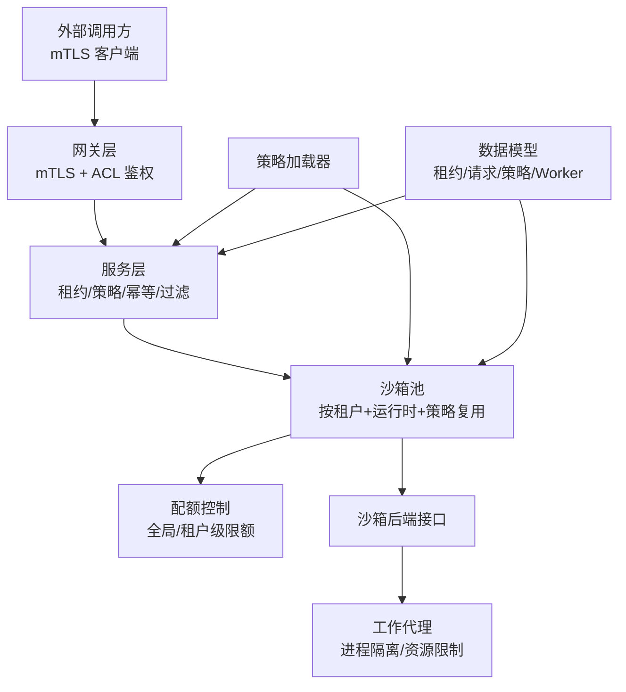
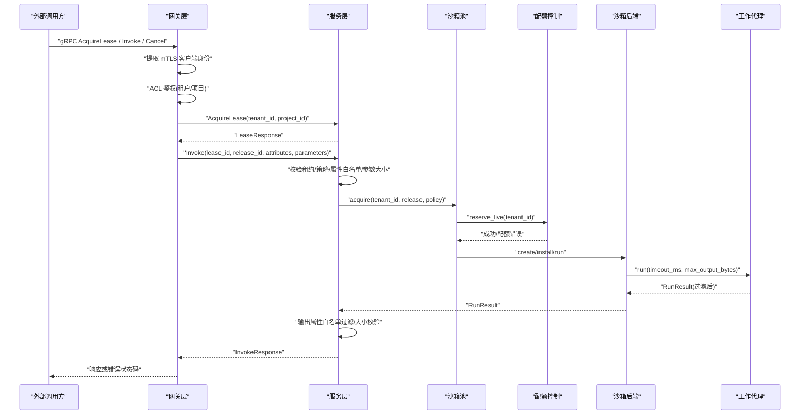
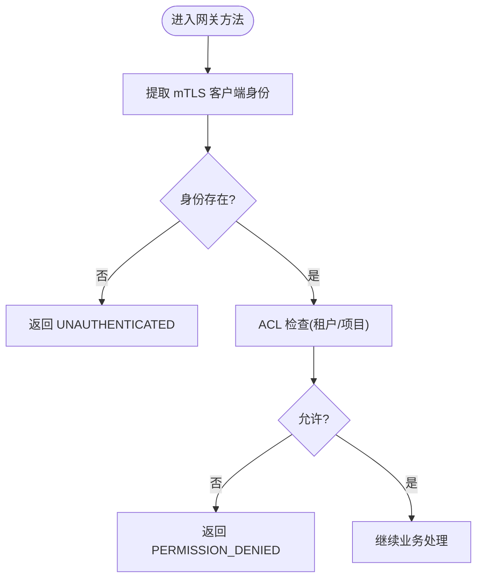
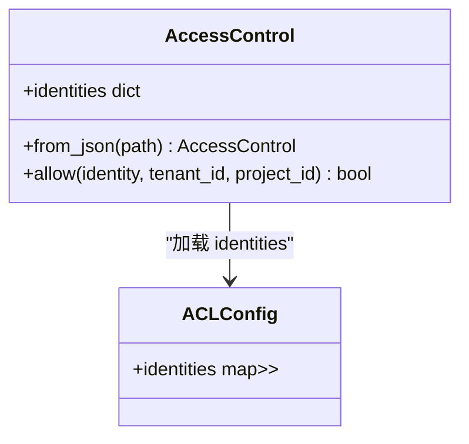
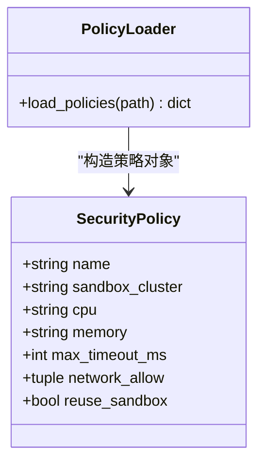
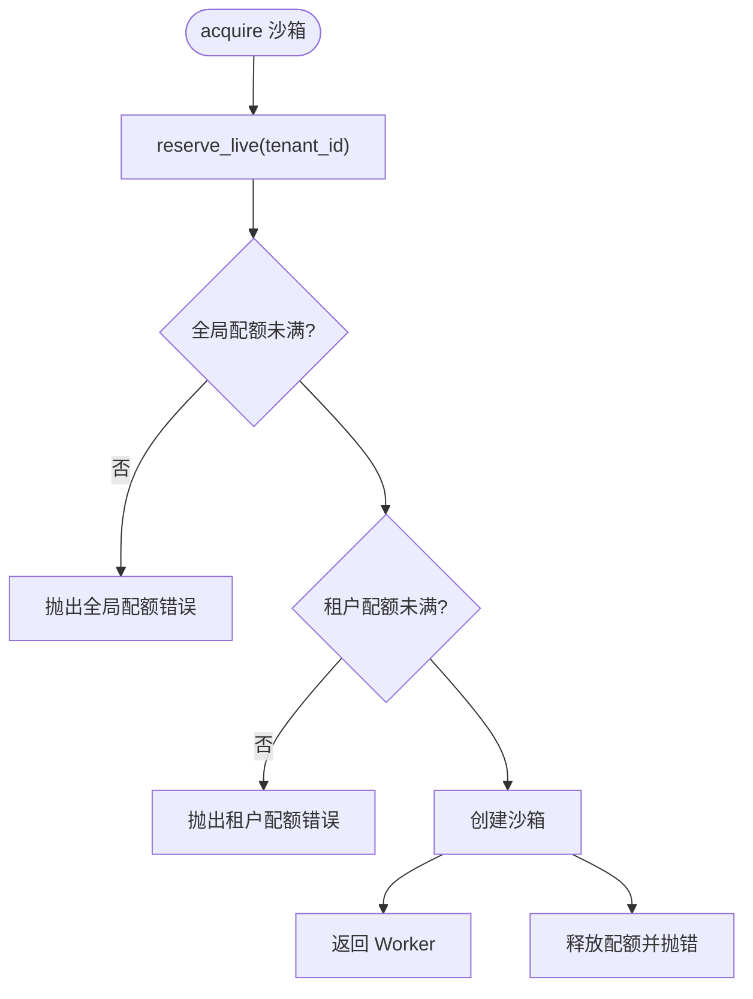
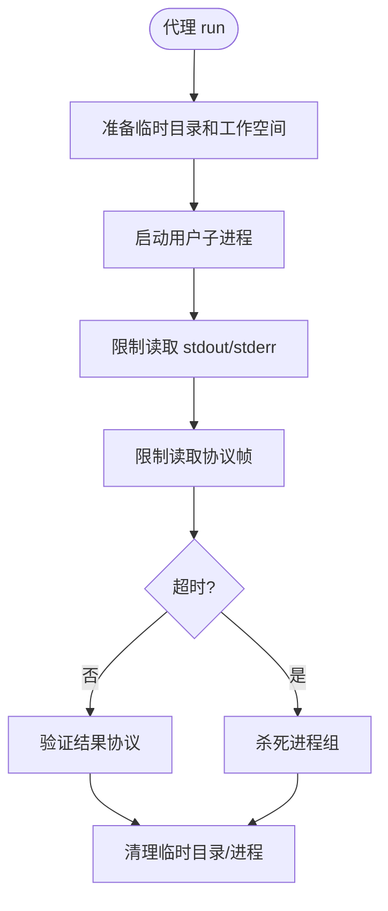
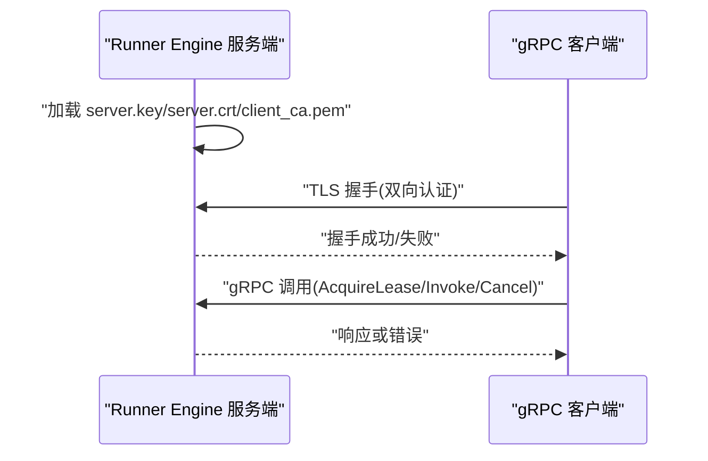
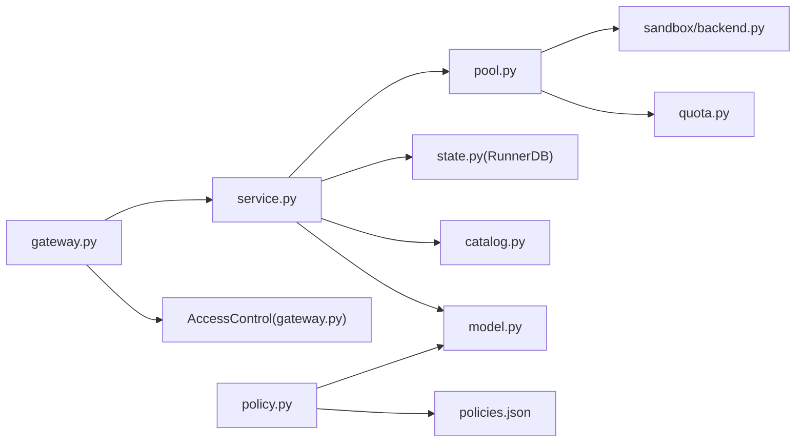

# 安全架构

<cite>
**本文引用的文件**   
- [gateway.py](file://runner_engine/gateway.py)
- [service.py](file://runner_engine/service.py)
- [pool.py](file://runner_engine/pool.py)
- [quota.py](file://runner_engine/quota.py)
- [policy.py](file://runner_engine/policy.py)
- [model.py](file://runner_engine/model.py)
- [backend.py](file://runner_engine/sandbox/backend.py)
- [agent.py](file://runner_engine/worker/agent.py)
- [acl.json](file://config/acl.json)
- [policies.json](file://config/policies.json)
- [test_service_security.py](file://tests/test_service_security.py)
</cite>

## 目录
1. [引言](#引言)
2. [项目结构与安全边界](#项目结构与安全边界)
3. [核心安全组件](#核心安全组件)
4. [系统安全架构总览](#系统安全架构总览)
5. [详细组件分析](#详细组件分析)
6. [依赖关系与耦合分析](#依赖关系与耦合分析)
7. [性能与资源特性](#性能与资源特性)
8. [故障排查指南](#故障排查指南)
9. [威胁分析与防护建议](#威胁分析与防护建议)
10. [结论](#结论)

## 引言
本安全架构文档面向 Runner Engine 系统，聚焦以下安全目标：
- 认证授权与访问控制：基于 mTLS 客户端身份与 ACL 配置，实现租户、项目和租约维度的细粒度访问控制。
- 资源隔离：通过沙箱后端、工作进程隔离、配额限制和策略约束，防止跨租户、跨项目资源泄漏与滥用。
- 安全策略引擎：以策略配置文件驱动运行时隔离强度、超时和资源上限，并在执行路径中强制校验。
- 配额控制：对全局并发创建、全局活跃沙箱数和租户级活跃沙箱数进行限制，并提供可重试的配额错误语义。
- 安全最佳实践：给出证书管理、双向 TLS、ACL 设计、策略治理和运维监控建议。

## 项目结构与安全边界
Runner Engine 的安全相关代码主要分布在网关层、服务层、沙箱池、配额模块、策略加载模块以及工作代理层。整体安全边界如下：
- 网关层负责 mTLS 握手、客户端身份提取、ACL 鉴权和 gRPC 状态码映射。
- 服务层负责租约校验、请求指纹、属性白名单过滤、策略匹配、幂等执行和结果输出过滤。
- 沙箱池负责按租户、运行时镜像和安全策略维度复用或创建沙箱，并协调配额。
- 配额模块提供线程安全的配额计数、预留与释放。
- 策略模块从配置文件加载安全策略模型，供服务层和池层使用。
- 工作代理在受控环境中运行用户算子，限制输出、日志、协议帧大小，并清理进程组。

**图表来源**
- [gateway.py:44-194](file://runner_engine/gateway.py#L44-L194)
- [service.py:80-456](file://runner_engine/service.py#L80-L456)
- [pool.py:11-188](file://runner_engine/pool.py#L11-L188)
- [quota.py:9-61](file://runner_engine/quota.py#L9-L61)
- [policy.py:9-24](file://runner_engine/policy.py#L9-L24)
- [model.py:26-98](file://runner_engine/model.py#L26-L98)
- [backend.py:14-49](file://runner_engine/sandbox/backend.py#L14-L49)
- [agent.py:309-798](file://runner_engine/worker/agent.py#L309-L798)

**章节来源**
- [gateway.py:12-194](file://runner_engine/gateway.py#L12-L194)
- [service.py:80-456](file://runner_engine/service.py#L80-L456)
- [pool.py:11-188](file://runner_engine/pool.py#L11-L188)
- [quota.py:9-61](file://runner_engine/quota.py#L9-L61)
- [policy.py:9-24](file://runner_engine/policy.py#L9-L24)
- [model.py:26-98](file://runner_engine/model.py#L26-L98)
- [backend.py:14-49](file://runner_engine/sandbox/backend.py#L14-L49)
- [agent.py:309-798](file://runner_engine/worker/agent.py#L309-L798)

## 核心安全组件
- 访问控制（ACL）：将 mTLS 客户端身份映射到允许的租户和项目集合，支持通配符项目权限。
- 租约机制：对外暴露获取、续租、释放租约接口，服务层校验租户与项目一致性。
- 安全策略引擎：从 JSON 配置加载策略，定义沙箱集群、CPU、内存、最大超时、网络允许列表和沙箱复用策略。
- 配额控制系统：限制并发创建数量、全局活跃沙箱数量和租户级活跃沙箱数量。
- 输入输出过滤：按发布版本声明的输入/输出属性白名单过滤，限制属性数量和字节大小。
- 工作代理隔离：限制用户进程输出、日志、协议帧大小，清理进程组和用户进程，避免资源泄漏。

**章节来源**
- [gateway.py:12-41](file://runner_engine/gateway.py#L12-L41)
- [service.py:25-78](file://runner_engine/service.py#L25-L78)
- [policy.py:9-24](file://runner_engine/policy.py#L9-L24)
- [quota.py:9-61](file://runner_engine/quota.py#L9-L61)
- [agent.py:112-298](file://runner_engine/worker/agent.py#L112-L298)

## 系统安全架构总览
下图展示一次典型调用的端到端安全流程，包括 mTLS 身份提取、ACL 鉴权、租约校验、策略匹配、属性过滤、配额控制和结果过滤。

**图表来源**
- [gateway.py:81-177](file://runner_engine/gateway.py#L81-L177)
- [service.py:146-331](file://runner_engine/service.py#L146-L331)
- [pool.py:73-130](file://runner_engine/pool.py#L73-L130)
- [quota.py:36-55](file://runner_engine/quota.py#L36-L55)
- [agent.py:467-778](file://runner_engine/worker/agent.py#L467-L778)

## 详细组件分析

### 认证授权与访问控制
- mTLS 客户端身份提取：网关从 gRPC 上下文读取 x509_subject_alternative_name 或 x509_common_name，若缺失则返回未认证错误。
- ACL 规则：配置文件 identities 将客户端身份映射到租户及其允许的项目列表；支持通配符项目表示允许该租户下所有项目。
- 鉴权点：
  - AcquireLease：校验 identity 是否允许 tenant_id 和 project_id。
  - Invoke/Cancel/ReleaseLease/RenewLease：先根据 lease_id 查询租约，再校验 identity 是否允许该租约所属项目。
- 错误映射：UNAUTHENTICATED 映射为 gRPC UNAUTHENTICATED；FORBIDDEN/CANCEL_FORBIDDEN 映射为 PERMISSION_DENIED。

**图表来源**
- [gateway.py:33-41](file://runner_engine/gateway.py#L33-L41)
- [gateway.py:81-96](file://runner_engine/gateway.py#L81-L96)

**章节来源**
- [gateway.py:12-41](file://runner_engine/gateway.py#L12-L41)
- [gateway.py:81-177](file://runner_engine/gateway.py#L81-L177)
- [acl.json:1-9](file://config/acl.json#L1-L9)

### 基于 ACL 的访问控制机制
- 身份模型：identities 键为客户端身份，值为租户到项目列表的映射。
- 权限继承：
  - 租户级：若某租户在项目列表中配置了通配符，则该租户下所有项目均被允许。
  - 项目级：若项目明确列出，则仅允许该项目。
- 作用范围：
  - 租约申请：tenant_id/project_id 直接参与 ACL 判断。
  - 租约操作：通过租约对象中的 project_id 参与 ACL 判断，确保即使传入不同 tenant_id，也无法越权访问其他租户的租约。

**图表来源**
- [gateway.py:12-31](file://runner_engine/gateway.py#L12-L31)
- [acl.json:1-9](file://config/acl.json#L1-L9)

**章节来源**
- [gateway.py:12-31](file://runner_engine/gateway.py#L12-L31)
- [acl.json:1-9](file://config/acl.json#L1-L9)

### 安全策略引擎
- 策略定义：标准策略 hardened 策略分别指定沙箱集群、CPU、内存、最大超时、网络允许列表和沙箱复用开关。
- 策略加载：从 policies.json 加载为 SecurityPolicy 对象字典，键为策略名称。
- 策略校验：
  - 租约申请时校验 release.profile 是否在已加载策略中。
  - 执行时根据策略限制 timeout_ms，并对输出属性进行白名单过滤。
- 策略影响：
  - sandbox_cluster：决定底层沙箱集群类型。
  - cpu/memory：作为策略元信息传递给后端，用于资源分配。
  - max_timeout_ms：限制请求最大超时时间。
  - network_allow：当前为空列表，可作为未来网络访问控制的扩展点。
  - reuse_sandbox：决定是否复用空闲沙箱。

**图表来源**
- [model.py:26-35](file://runner_engine/model.py#L26-L35)
- [policy.py:9-24](file://runner_engine/policy.py#L9-L24)
- [policies.json:1-19](file://config/policies.json#L1-L19)

**章节来源**
- [model.py:26-35](file://runner_engine/model.py#L26-L35)
- [policy.py:9-24](file://runner_engine/policy.py#L9-L24)
- [policies.json:1-19](file://config/policies.json#L1-L19)
- [service.py:146-235](file://runner_engine/service.py#L146-L235)

### 配额控制系统
- 配额维度：
  - 全局并发创建限制：通过有界信号量控制同时创建沙箱的数量。
  - 全局活跃沙箱数：限制系统中实际存活的沙箱总数。
  - 租户级活跃沙箱数：限制每个租户的活跃沙箱数量。
- 生命周期：
  - acquire 前 reserve_live：若达到全局或租户配额，抛出可重试配额错误。
  - create 失败时 release_live：保证配额释放。
  - destroy 时 release_live：确保销毁后配额回收。
- 错误语义：QuotaError 包含错误码和 retryable 标志，便于上层重试。

**图表来源**
- [pool.py:73-130](file://runner_engine/pool.py#L73-L130)
- [quota.py:36-55](file://runner_engine/quota.py#L36-L55)

**章节来源**
- [pool.py:73-130](file://runner_engine/pool.py#L73-L130)
- [quota.py:9-61](file://runner_engine/quota.py#L9-L61)

### 资源隔离与工作代理
- 进程隔离：工作代理启动用户子进程，设置新会话、管道 FD 传递、关闭无关 FD，限制 stdout/stderr 大小。
- 资源限制：
  - 输出大小：默认 8 MiB，可通过环境变量调整。
  - 日志大小：stdout/stderr 各 1 MiB，超限终止进程组。
  - 协议帧大小：根据输出大小和属性大小计算上限，超限报错。
  - 超时：按策略和请求超时限制，超时后终止进程组。
- 清理机制：
  - 取消请求：标记取消事件并杀死进程组。
  - 用户进程清理：扫描 /proc 并按 child_uid 杀死残留进程。
  - 临时目录清理：每次执行结束后删除 scratch_dir。

**图表来源**
- [agent.py:467-798](file://runner_engine/worker/agent.py#L467-L798)

**章节来源**
- [agent.py:112-298](file://runner_engine/worker/agent.py#L112-L298)
- [agent.py:467-798](file://runner_engine/worker/agent.py#L467-L798)

### TLS 加密通信与双向 SSL
- 服务端证书：从 key_file 和 cert_file 读取私钥和证书。
- 客户端 CA：从 client_ca_file 读取根证书，启用 require_client_auth。
- 消息长度限制：设置最大接收/发送消息长度为 10 MiB。
- 生产入口：不提供明文模式，强制使用双向 TLS。

**图表来源**
- [gateway.py:179-193](file://runner_engine/gateway.py#L179-L193)

**章节来源**
- [gateway.py:179-193](file://runner_engine/gateway.py#L179-L193)

## 依赖关系与耦合分析
- 网关层依赖：
  - runner_pb2/runner_pb2_grpc：gRPC 生成代码。
  - service.RunnerService：业务逻辑。
  - gateway.AccessControl：ACL 鉴权。
- 服务层依赖：
  - catalog.Catalog：发布版本元数据。
  - state.RunnerDB：租约、幂等和执行记录持久化。
  - pool.WorkerPool：沙箱池。
  - model.SecurityPolicy：策略模型。
- 池层依赖：
  - sandbox.backend.SandboxBackend：沙箱后端接口。
  - quota.Quota：配额控制。
- 策略加载依赖：
  - model.SecurityPolicy：策略数据结构。
  - config/policies.json：策略配置。

**图表来源**
- [gateway.py:44-194](file://runner_engine/gateway.py#L44-L194)
- [service.py:80-456](file://runner_engine/service.py#L80-L456)
- [pool.py:11-188](file://runner_engine/pool.py#L11-L188)
- [policy.py:9-24](file://runner_engine/policy.py#L9-L24)

**章节来源**
- [gateway.py:44-194](file://runner_engine/gateway.py#L44-L194)
- [service.py:80-456](file://runner_engine/service.py#L80-L456)
- [pool.py:11-188](file://runner_engine/pool.py#L11-L188)
- [policy.py:9-24](file://runner_engine/policy.py#L9-L24)

## 性能与资源特性
- 并发控制：
  - 网关层使用线程池 executor，max_workers 可配置。
  - 配额层使用有界信号量限制并发创建。
- 资源限制：
  - 输入内容最大 8 MiB。
  - 属性数量最大 128，属性字节总量最大 64 KiB。
  - 输出内容最大 8 MiB。
  - 工作代理 stdout/stderr 各 1 MiB。
  - gRPC 消息最大 10 MiB。
- 缓存与复用：
  - 沙箱池按租户、运行时、策略维度复用空闲 Worker。
  - 策略 reuse_sandbox 控制是否复用。
- 清理与回收：
  - 后台任务定期清理过期租约、幂等记录和旧执行记录。
  - 池层定期回收空闲 Worker。

[本节为通用性能讨论，不直接分析具体文件]

## 故障排查指南
- 未认证错误：
  - 现象：gRPC 返回 UNAUTHENTICATED。
  - 原因：mTLS 客户端身份缺失。
  - 排查：检查客户端证书链和服务端 client_ca_file 配置。
- 权限拒绝：
  - 现象：gRPC 返回 PERMISSION_DENIED。
  - 原因：ACL 不允许该 identity 访问指定租户/项目或租约项目。
  - 排查：检查 acl.json 中 identities 配置和租约归属。
- 未知安全策略：
  - 现象：服务抛出 UNKNOWN_SECURITY_POLICY。
  - 原因：release.profile 未在 policies.json 中定义。
  - 排查：确认发布版本 profile 与策略配置一致。
- 配额耗尽：
  - 现象：QuotaError，retryable=True。
  - 原因：全局或租户级活跃沙箱数达到上限。
  - 排查：调整 Quota 参数或优化沙箱复用策略。
- 属性过滤异常：
  - 现象：输出属性被过滤或属性大小超限。
  - 原因：发布版本 input_attributes/output_attributes 白名单限制。
  - 排查：检查发布版本元数据和策略配置。

**章节来源**
- [gateway.py:67-79](file://runner_engine/gateway.py#L67-L79)
- [service.py:188-235](file://runner_engine/service.py#L188-L235)
- [quota.py:36-55](file://runner_engine/quota.py#L36-L55)
- [test_service_security.py:65-112](file://tests/test_service_security.py#L65-L112)

## 威胁分析与防护建议
- 威胁模型：
  - 未授权访问：攻击者伪造客户端身份或越权访问其他租户/项目。
  - 资源滥用：恶意租户耗尽全局或租户级沙箱配额。
  - 数据泄露：用户算子输出敏感属性或超大内容。
  - 逃逸风险：用户进程突破资源限制或横向移动。
- 防护措施：
  - 强制双向 TLS：生产环境禁用明文传输。
  - ACL 最小权限：仅授予必要租户/项目访问权限。
  - 策略治理：严格定义策略，限制超时、网络和沙箱复用。
  - 配额限制：合理设置全局和租户级配额，防止资源耗尽。
  - 属性白名单：仅允许发布版本声明的输入/输出属性。
  - 资源限制：限制输出、日志、协议帧大小，及时清理进程组。
- 最佳实践：
  - 证书轮换：定期更新 server.key/server.crt/client_ca.pem。
  - 审计日志：记录 mTLS 身份、ACL 决策和配额事件。
  - 监控告警：监控活跃沙箱数、配额拒绝率和超时率。
  - 策略评审：变更策略需经过安全评审和灰度发布。

[本节为通用安全建议，不直接分析具体文件]

## 结论
Runner Engine 的安全架构围绕 mTLS 认证、ACL 访问控制、策略驱动的资源隔离和配额控制展开。网关层确保通信安全和身份可信，服务层确保租约和属性安全，池层和配额层确保资源可控，工作代理确保执行环境隔离。通过严格的策略配置和配额限制，系统能够有效抵御未授权访问、资源滥用和数据泄露等威胁。建议在部署中强化证书管理、策略治理和监控告警，以提升整体安全性。

[本节为总结性内容，不直接分析具体文件]