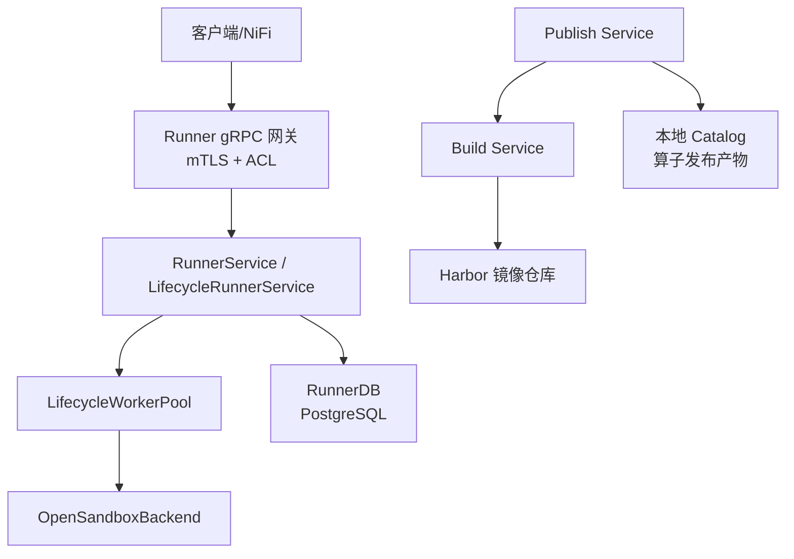
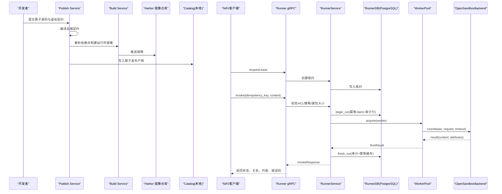
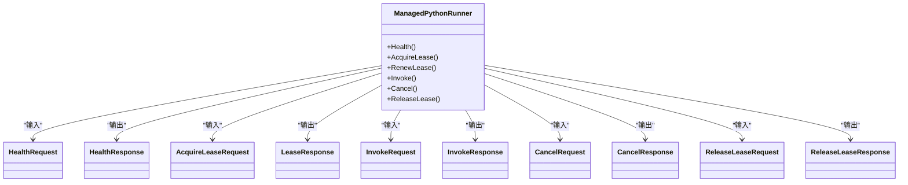
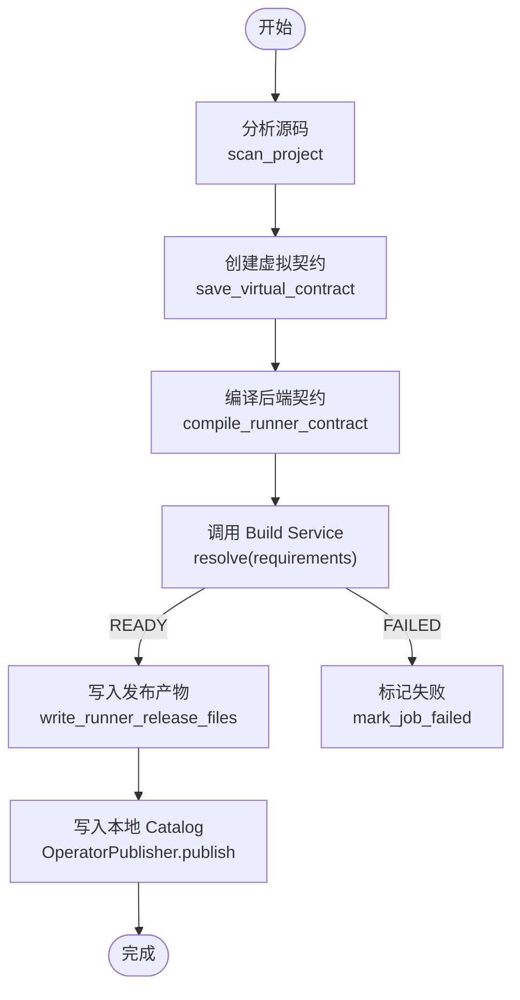
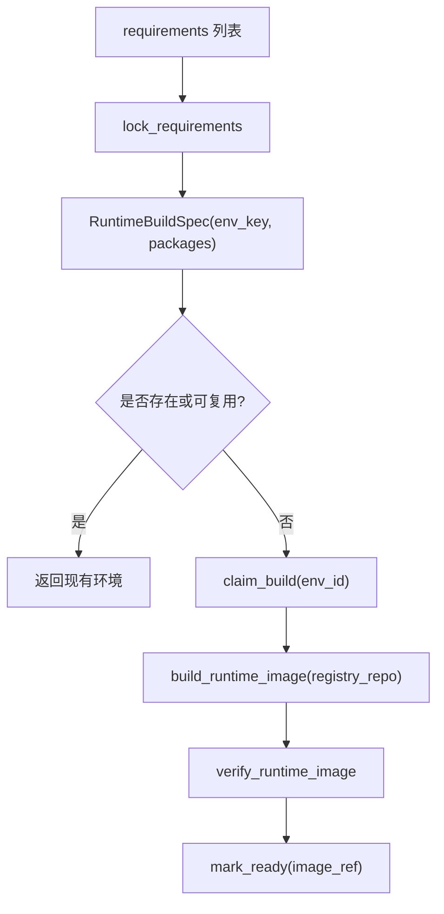
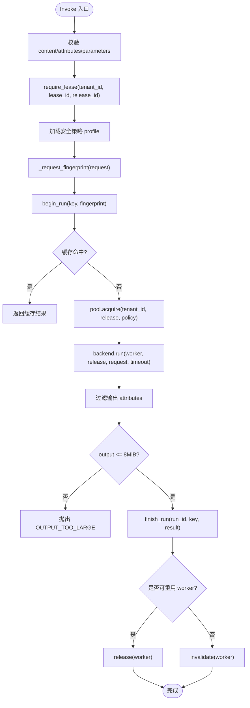
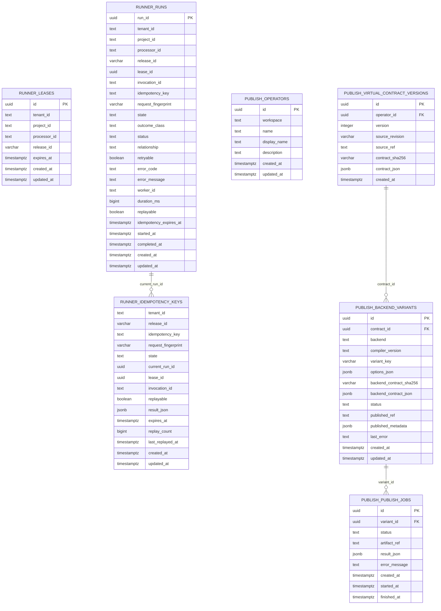
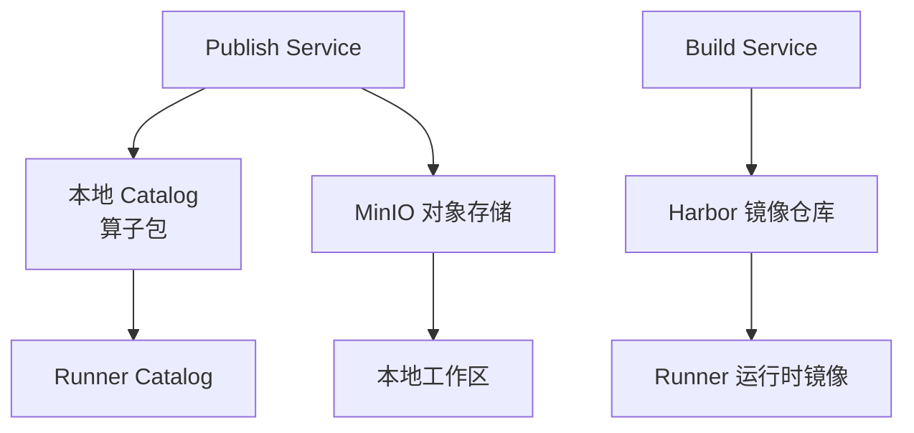
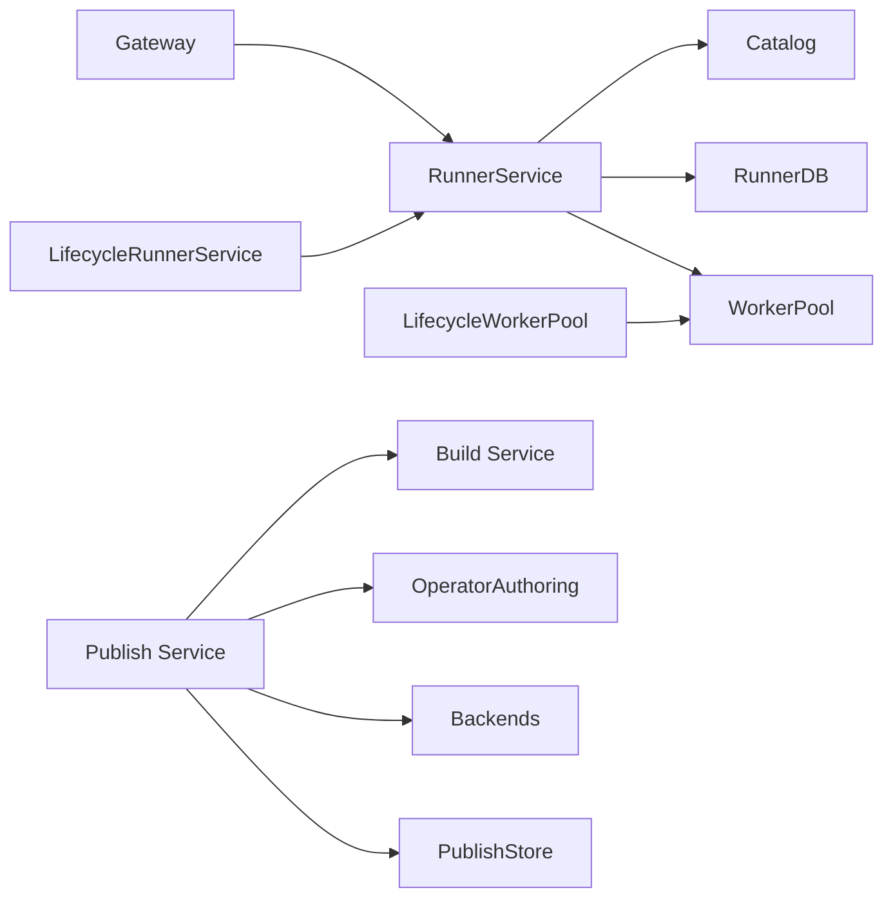

# 数据流设计

<cite>
**本文引用的文件**   
- [proto/runner.proto](file://proto/runner.proto)
- [runner_engine/app.py](file://runner_engine/app.py)
- [runner_engine/gateway.py](file://runner_engine/gateway.py)
- [runner_engine/service.py](file://runner_engine/service.py)
- [runner_engine/lifecycle_service.py](file://runner_engine/lifecycle_service.py)
- [runner_engine/lifecycle_runtime.py](file://runner_engine/lifecycle_runtime.py)
- [runner_engine/state.py](file://runner_engine/state.py)
- [build_service/app.py](file://build_service/app.py)
- [build_service/service.py](file://build_service/service.py)
- [publish_service/app.py](file://publish_service/app.py)
- [publish_service/service.py](file://publish_service/service.py)
- [sql/publish_schema.sql](file://sql/publish_schema.sql)
</cite>

## 目录
1. [引言](#引言)
2. [项目结构](#项目结构)
3. [核心组件](#核心组件)
4. [架构总览](#架构总览)
5. [详细组件分析](#详细组件分析)
6. [依赖关系分析](#依赖关系分析)
7. [性能与一致性](#性能与一致性)
8. [故障排查指南](#故障排查指南)
9. [结论](#结论)

## 引言
本文面向 Runner Engine 系统的数据流设计，覆盖从算子开发、编译发布、构建运行时镜像到生产执行的全生命周期。重点说明：
- 数据在 gRPC 协议中的序列化、传输和错误映射；
- 对象存储中算子包、构建产物和运行时数据的组织策略；
- 数据库中算子元数据、执行状态、幂等缓存和审计日志的持久化模型；
- 数据一致性、幂等性、缓存与清理机制；
- 关键业务场景下的数据流图和序列图。

## 项目结构
Runner Engine 由多个服务组成：
- 运行期服务 runner_engine：提供 mTLS gRPC 接口，管理租约、执行、工作池、沙箱生命周期和数据库状态。
- 构建服务 build_service：解析 Python 依赖、构建并验证运行时镜像，返回镜像引用。
- 发布服务 publish_service：分析算子源码、生成虚拟契约、编译后端契约、调用构建服务、发布算子包到本地 catalog。
- 外部 NiFi 侧通过 proto 定义与 Runner 交互。

**图表来源**
- [runner_engine/app.py:26-231](file://runner_engine/app.py#L26-L231)
- [runner_engine/gateway.py:44-194](file://runner_engine/gateway.py#L44-L194)
- [runner_engine/service.py:80-456](file://runner_engine/service.py#L80-L456)
- [runner_engine/lifecycle_runtime.py:14-121](file://runner_engine/lifecycle_runtime.py#L14-L121)
- [build_service/app.py:106-184](file://build_service/app.py#L106-L184)
- [publish_service/app.py:135-347](file://publish_service/app.py#L135-L347)

**章节来源**
- [runner_engine/app.py:26-231](file://runner_engine/app.py#L26-L231)
- [build_service/app.py:106-184](file://build_service/app.py#L106-L184)
- [publish_service/app.py:135-347](file://publish_service/app.py#L135-L347)

## 核心组件
- gRPC 协议层：定义 ManagedPythonRunner 服务及消息类型，承载健康检查、租约申请/续租/释放、算子调用、取消等控制面和数据面操作。
- Runner 服务层：RunnerService 实现核心执行逻辑，LifecycleRunnerService 增加运行时生命周期门控。
- 工作池与沙箱：LifecycleWorkerPool 管理 Worker 生命周期，OpenSandboxBackend 负责实际算子进程执行。
- 持久化层：RunnerDB 使用 PostgreSQL 维护租约、执行历史、幂等缓存；PublishStore 维护算子元数据和发布任务；BuildStore 维护运行时环境构建任务。
- 构建与发布：BuildService 解析依赖并构建镜像；PublishService 编译契约、调用构建服务并发布算子包。

**章节来源**
- [proto/runner.proto:8-75](file://proto/runner.proto#L8-L75)
- [runner_engine/service.py:80-456](file://runner_engine/service.py#L80-L456)
- [runner_engine/lifecycle_service.py:7-70](file://runner_engine/lifecycle_service.py#L7-L70)
- [runner_engine/lifecycle_runtime.py:14-121](file://runner_engine/lifecycle_runtime.py#L14-L121)
- [runner_engine/state.py:131-685](file://runner_engine/state.py#L131-L685)
- [build_service/service.py:26-216](file://build_service/service.py#L26-L216)
- [publish_service/service.py:71-800](file://publish_service/service.py#L71-L800)

## 架构总览
Runner Engine 的数据流贯穿“开发—发布—构建—运行”四个阶段：
- 开发阶段：Publish Service 扫描源码、生成虚拟契约，支持多后端（Runner、NiFi Native）。
- 发布阶段：编译后端契约，调用 Build Service 解析依赖并构建运行时镜像，最终将算子包写入本地 Catalog。
- 运行阶段：NiFi 或客户端通过 gRPC 获取租约，携带幂等键和内容调用算子；Runner 校验权限、安全策略、属性大小限制，调度 Worker 执行，落库记录执行历史和幂等结果。
- 清理阶段：后台定时清理过期租约、过期幂等缓存和旧执行记录。

**图表来源**
- [publish_service/service.py:418-774](file://publish_service/service.py#L418-L774)
- [build_service/service.py:31-216](file://build_service/service.py#L31-L216)
- [runner_engine/gateway.py:102-157](file://runner_engine/gateway.py#L102-L157)
- [runner_engine/service.py:188-405](file://runner_engine/service.py#L188-L405)
- [runner_engine/state.py:411-607](file://runner_engine/state.py#L411-L607)

## 详细组件分析

### gRPC 数据传输协议设计
ManagedPythonRunner 服务暴露以下 RPC：
- Health：健康检查，返回 ok 与版本。
- AcquireLease：申请租约，返回 lease_id 与过期时间。
- RenewLease：续租，延长过期时间。
- Invoke：执行算子，包含租户、项目、发布版本、调用 ID、幂等键、二进制内容、属性和参数、超时。
- Cancel：取消正在执行的调用。
- ReleaseLease：释放租约。

消息体采用 protobuf3 二进制序列化，content 字段为 bytes，attributes/parameters 为字符串映射。Runner 网关对 RunnerError 进行 gRPC 状态码映射：
- UNAUTHENTICATED → UNAUTHENTICATED
- FORBIDDEN/CANCEL_FORBIDDEN → PERMISSION_DENIED
- RELEASE_NOT_FOUND/LEASE_UNKNOWN → NOT_FOUND
- retryable 错误 → UNAVAILABLE
- 其他 → FAILED_PRECONDITION

同时设置最大收发消息长度为 10 MiB，防止过大负载。

**图表来源**
- [proto/runner.proto:8-75](file://proto/runner.proto#L8-L75)

**章节来源**
- [proto/runner.proto:8-75](file://proto/runner.proto#L8-L75)
- [runner_engine/gateway.py:67-194](file://runner_engine/gateway.py#L67-L194)

### 算子开发与发布数据流
Publish Service 负责：
- 分析源码，列出可调用的函数与参数；
- 创建虚拟契约，保存不可变源码快照；
- 编译后端契约（Runner 或 NiFi Native），生成 variant；
- 对于 Runner 后端，调用 Build Service 解析依赖并构建镜像；
- 将算子包写入本地 Catalog，供 Runner 加载。

**图表来源**
- [publish_service/service.py:385-477](file://publish_service/service.py#L385-L477)
- [publish_service/service.py:569-774](file://publish_service/service.py#L569-L774)
- [build_service/service.py:31-216](file://build_service/service.py#L31-L216)

**章节来源**
- [publish_service/service.py:385-774](file://publish_service/service.py#L385-L774)
- [build_service/service.py:31-216](file://build_service/service.py#L31-L216)

### 构建服务与镜像构建
Build Service 根据 requirements 列表：
- 锁定依赖，生成 lock 文本；
- 构造 RuntimeBuildSpec；
- 查找已有环境或复用超集；
- 若不存在则 claim 构建任务，调用 build_runtime_image 推送镜像到 Harbor；
- 验证镜像后标记 READY。

**图表来源**
- [build_service/service.py:31-216](file://build_service/service.py#L31-L216)

**章节来源**
- [build_service/service.py:31-216](file://build_service/service.py#L31-L216)

### 运行期数据流与幂等性
Runner Service 在执行 Invoke 时：
- 校验 inline content 不超过 8 MiB；
- 要求 idempotency_key；
- 校验租约归属与 release 的安全策略；
- 过滤并校验 attributes/parameters；
- 计算请求指纹用于幂等冲突检测；
- 通过 RunnerDB.begin_run 获取幂等 claim 或缓存结果；
- 分配 Worker 并调用 backend.run；
- 过滤输出 attributes，校验输出大小；
- 通过 RunnerDB.finish_run 更新审计行与幂等缓存；
- 根据结果决定 worker 重用或失效。

**图表来源**
- [runner_engine/service.py:188-405](file://runner_engine/service.py#L188-L405)
- [runner_engine/state.py:411-607](file://runner_engine/state.py#L411-L607)

**章节来源**
- [runner_engine/service.py:188-405](file://runner_engine/service.py#L188-L405)
- [runner_engine/state.py:411-607](file://runner_engine/state.py#L411-L607)

### 数据库数据模型
RunnerDB 维护以下表：
- runner.leases：租约信息，含租户、项目、处理器、发布版本、过期时间。
- runner.runs：执行审计历史，含状态、结果类、错误码、worker_id、耗时、重放标志、幂等过期时间等。
- runner.idempotency_keys：幂等缓存，按 (tenant_id, release_id, idempotency_key) 主键，记录当前运行 ID、结果 JSON、过期时间和重放次数。

Publish Store 维护：
- publish.operators：算子基本信息。
- publish.virtual_contract_versions：虚拟契约版本与不可变源码快照。
- publish.backend_variants：后端变体、编译器版本、选项、状态、已发布引用与元数据。
- publish.publish_jobs：发布任务状态、产物引用、结果与错误信息。

**图表来源**
- [runner_engine/state.py:16-82](file://runner_engine/state.py#L16-L82)
- [sql/publish_schema.sql:1-68](file://sql/publish_schema.sql#L1-L68)

**章节来源**
- [runner_engine/state.py:16-82](file://runner_engine/state.py#L16-L82)
- [sql/publish_schema.sql:1-68](file://sql/publish_schema.sql#L1-L68)

### 对象存储与本地 Catalog 策略
- 算子发布产物：Publish Service 将 Runner 后端产物写入本地 Catalog，供 Runner 的 Catalog 读取。
- 运行时镜像：Build Service 将镜像推送到 Harbor 镜像仓库，Runner 通过 release.runtime.image 引用。
- Edge Bundle 下载：Publish Service 提供 MinIO 文件夹下载接口，将远程数据下载到本地工作区。

**图表来源**
- [publish_service/service.py:711-774](file://publish_service/service.py#L711-L774)
- [build_service/service.py:157-216](file://build_service/service.py#L157-L216)
- [publish_service/app.py:279-335](file://publish_service/app.py#L279-L335)

**章节来源**
- [publish_service/service.py:711-774](file://publish_service/service.py#L711-L774)
- [build_service/service.py:157-216](file://build_service/service.py#L157-L216)
- [publish_service/app.py:279-335](file://publish_service/app.py#L279-L335)

## 依赖关系分析
- Runner gRPC 网关依赖 RunnerService 与 AccessControl，后者基于 mTLS 客户端身份与 ACL 配置进行授权。
- RunnerService 依赖 Catalog（算子发布产物）、RunnerDB（持久化）、WorkerPool（沙箱调度）与安全策略。
- LifecycleRunnerService 扩展 RunnerService，增加运行时生命周期门控，阻止 RETIRING/RETIRED 的新执行。
- LifecycleWorkerPool 在 WorkerPool 基础上增加运行时阻塞检查和空闲 Worker 回收。
- Build Service 依赖 BuildStore、HarborClient 与 uv 工具链。
- Publish Service 依赖 OperatorAuthoring、Backends、BuildServiceClient、LocalSourceStore 与 PublishStore。

**图表来源**
- [runner_engine/gateway.py:44-194](file://runner_engine/gateway.py#L44-L194)
- [runner_engine/service.py:80-456](file://runner_engine/service.py#L80-L456)
- [runner_engine/lifecycle_service.py:7-70](file://runner_engine/lifecycle_service.py#L7-L70)
- [runner_engine/lifecycle_runtime.py:14-121](file://runner_engine/lifecycle_runtime.py#L14-L121)
- [publish_service/service.py:71-800](file://publish_service/service.py#L71-L800)
- [build_service/service.py:26-216](file://build_service/service.py#L26-L216)

**章节来源**
- [runner_engine/gateway.py:44-194](file://runner_engine/gateway.py#L44-L194)
- [runner_engine/service.py:80-456](file://runner_engine/service.py#L80-L456)
- [runner_engine/lifecycle_service.py:7-70](file://runner_engine/lifecycle_service.py#L7-L70)
- [runner_engine/lifecycle_runtime.py:14-121](file://runner_engine/lifecycle_runtime.py#L14-L121)
- [publish_service/service.py:71-800](file://publish_service/service.py#L71-L800)
- [build_service/service.py:26-216](file://build_service/service.py#L26-L216)

## 性能与一致性
- 幂等性与缓存：
  - 通过 idempotency_key 与 request_fingerprint 保证相同语义请求只执行一次；
  - 非重试型成功结果会缓存于 runner.idempotency_keys.result_json，并在过期前直接返回；
  - 后台定期清理过期幂等缓存与旧执行记录。
- 一致性保证：
  - begin_run 使用 FOR UPDATE 锁确保并发幂等保护；
  - finish_run 原子更新 runs 与 idempotency_keys，失败时抛出 RUN_STATE_LOST/IDEMPOTENCY_STATE_LOST；
  - 重启时将 RUNNING 状态转为 ABANDONED，避免悬挂执行。
- 资源限制：
  - inline content 与 output 上限为 8 MiB；
  - attributes 数量与字节数有限制；
  - gRPC 最大消息长度 10 MiB。
- 清理策略：
  - 后台线程周期性 purge_expired_leases、purge_expired_idempotency、purge_old_runs；
  - WorkerPool.reap 回收空闲 Worker；
  - LifecycleWorkerPool.retire_runtime 销毁与目标 runtime 相关的空闲 Worker。

**章节来源**
- [runner_engine/service.py:15-21](file://runner_engine/service.py#L15-L21)
- [runner_engine/service.py:117-144](file://runner_engine/service.py#L117-L144)
- [runner_engine/service.py:188-405](file://runner_engine/service.py#L188-L405)
- [runner_engine/state.py:650-685](file://runner_engine/state.py#L650-L685)
- [runner_engine/lifecycle_runtime.py:83-121](file://runner_engine/lifecycle_runtime.py#L83-L121)

## 故障排查指南
- gRPC 错误码映射：
  - UNAUTHENTICATED：mTLS 客户端身份缺失；
  - PERMISSION_DENIED：ACL 不允许访问租户/项目或取消权限不足；
  - NOT_FOUND：租约或发布版本不存在；
  - UNAVAILABLE：可重试错误（如租约过期、运行时退订中）；
  - FAILED_PRECONDITION：非法请求或策略不满足。
- 常见错误：
  - IDEMPOTENCY_CONFLICT：幂等键被重复用于不同内容；
  - RUN_IN_PROGRESS：相同逻辑请求已在运行；
  - INVOCATION_ID_IN_USE：调用 ID 冲突；
  - OUTPUT_TOO_LARGE：算子输出超过 8 MiB；
  - RUN_STATE_LOST/IDEMPOTENCY_STATE_LOST：数据库状态不一致；
  - CANCEL_FAILED：取消失败，可能伴随 worker 失效。
- 排查建议：
  - 检查 ACL 配置与 mTLS 证书；
  - 确认 idempotency_key 唯一且稳定；
  - 查看 runner.runs 与 runner.idempotency_keys 的状态与过期时间；
  - 检查 WorkerPool 与 OpenSandboxBackend 的健康状态；
  - 关注后台清理任务是否正常运行。

**章节来源**
- [runner_engine/gateway.py:67-96](file://runner_engine/gateway.py#L67-L96)
- [runner_engine/service.py:188-405](file://runner_engine/service.py#L188-L405)
- [runner_engine/state.py:411-607](file://runner_engine/state.py#L411-L607)

## 结论
Runner Engine 的数据流设计以 gRPC 为控制面与数据面通道，结合 PostgreSQL 的强一致性与幂等缓存，保障算子执行的可观测性与可靠性。Publish Service 与 Build Service 协同完成算子编译与运行时镜像构建，Runner 通过生命周期门控与工作池管理实现安全的沙箱执行。整体方案在安全性、可扩展性和可运维性方面具备良好平衡，适合大规模 NiFi 集成与边缘部署场景。