# 架构设计

<cite>
**本文引用的文件**   
- [pyproject.toml](file://pyproject.toml)
- [runner.proto](file://proto/runner.proto)
- [app.py](file://runner_engine/app.py)
- [gateway.py](file://runner_engine/gateway.py)
- [service.py](file://runner_engine/service.py)
- [lifecycle_service.py](file://runner_engine/lifecycle_service.py)
- [pool.py](file://runner_engine/pool.py)
- [opensandbox.py](file://runner_engine/sandbox/opensandbox.py)
- [agent.py](file://runner_engine/worker/agent.py)
- [lifecycle_runtime.py](file://runner_engine/lifecycle_runtime.py)
- [lifecycle_store.py](file://runner_engine/lifecycle_store.py)
- [app.py](file://build_service/app.py)
- [service.py](file://build_service/service.py)
- [app.py](file://publish_service/app.py)
- [service.py](file://publish_service/service.py)
- [main.py](file://web/admin/main.py)
- [main.py](file://web/console/main.py)
</cite>

## 目录
1. [引言](#引言)
2. [项目结构](#项目结构)
3. [核心组件](#核心组件)
4. [架构总览](#架构总览)
5. [详细组件分析](#详细组件分析)
6. [依赖关系分析](#依赖关系分析)
7. [性能与可扩展性](#性能与可扩展性)
8. [横切关注点：安全、监控与灾难恢复](#横切关注点安全监控与灾难恢复)
9. [部署拓扑与基础设施](#部署拓扑与基础设施)
10. [故障排查指南](#故障排查指南)
11. [结论](#结论)

## 引言
本架构文档面向 Runner Engine 系统，围绕微服务架构、插件式后端、事件驱动与分层架构展开，说明高层设计、系统边界、组件交互、数据流、技术决策与约束。Runner Engine 提供 NiFi Python Operator 的构建、发布与运行时执行能力，包含以下关键子系统：
- 运行器服务（Runner）：gRPC 接入、租约管理、工作池与沙箱生命周期、策略与配额控制、幂等与保留策略。
- 构建服务（Build Service）：Python 环境锁定、镜像构建与校验、可复用 superset 绑定。
- 发布服务（Publish Service）：虚拟契约编译、多后端产物生成、边缘包与原生包发布、MinIO 集成。
- Web 控制台：统一入口，聚合发布、观测与管理界面。
- OpenSandbox 沙箱：隔离执行环境，托管 Agent 进程，承载用户算子。

## 项目结构
仓库采用多服务、多模块组织方式：
- runner_engine：Runner 运行时核心，含 gRPC 网关、服务编排、工作池、沙箱适配、Agent 子进程协议。
- build_service：构建服务，负责依赖解析、镜像构建与验证。
- publish_service：发布服务，负责虚拟契约、编译与发布流程。
- web：统一控制台，聚合 admin、observe 与原始 app。
- proto：gRPC 接口定义。
- nifi：NiFi Java 侧 ManagedPythonTransform 相关代码（不在本文重点）。

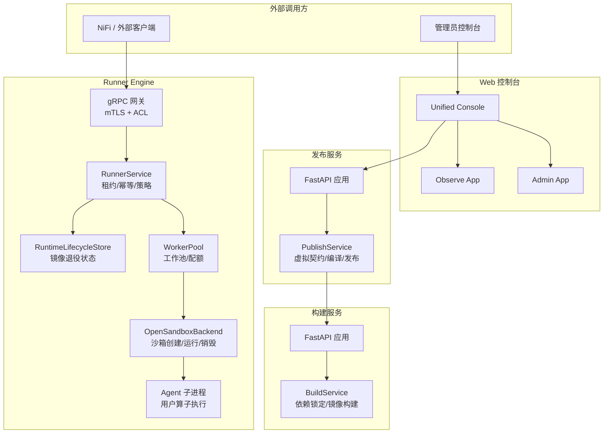

**图表来源**
- [app.py:26-227](file://runner_engine/app.py#L26-L227)
- [gateway.py:44-194](file://runner_engine/gateway.py#L44-L194)
- [service.py:80-456](file://runner_engine/service.py#L80-L456)
- [pool.py:11-188](file://runner_engine/pool.py#L11-L188)
- [opensandbox.py:31-440](file://runner_engine/sandbox/opensandbox.py#L31-L440)
- [agent.py:309-798](file://runner_engine/worker/agent.py#L309-L798)
- [lifecycle_store.py:35-151](file://runner_engine/lifecycle_store.py#L35-L151)
- [app.py:106-217](file://build_service/app.py#L106-L217)
- [service.py:26-216](file://build_service/service.py#L26-L216)
- [app.py:135-383](file://publish_service/app.py#L135-L383)
- [service.py:71-800](file://publish_service/service.py#L71-L800)
- [main.py:47-338](file://web/admin/main.py#L47-L338)
- [main.py:34-147](file://web/console/main.py#L34-L147)

**章节来源**
- [pyproject.toml:1-37](file://pyproject.toml#L1-L37)

## 核心组件
- Runner 服务：提供 gRPC 接口，实现租约获取/续期/释放、算子调用、取消、幂等与结果持久化；通过 WorkerPool 管理沙箱；通过 RuntimeLifecycleStore 控制镜像退役。
- 工作池：按租户+运行时+安全策略键维护空闲沙箱，支持 TTL 续期、安装 release、配额限制与回收。
- OpenSandbox 后端：封装对 OpenSandbox 集群的 HTTP 控制面操作，创建/健康检查/端点发现/运行/取消/销毁。
- Agent：在沙箱内以独立进程运行，使用自定义帧协议与 Runner 通信，严格限制输出大小、属性数量与字节数，并强制单实例并发。
- 构建服务：基于 uv 锁定依赖，构建并推送镜像，支持 superset 复用与失败重试。
- 发布服务：扫描源码、生成虚拟契约、编译 runner/native 后端产物，调用构建服务与环境元数据，最终产出 runner-release 或 edge bundle。
- Web 控制台：统一路由分发到 Publish、Observe、Admin 三个子应用，提供审计与安全头保护。

**章节来源**
- [gateway.py:44-194](file://runner_engine/gateway.py#L44-L194)
- [service.py:80-456](file://runner_engine/service.py#L80-L456)
- [pool.py:11-188](file://runner_engine/pool.py#L11-L188)
- [opensandbox.py:31-440](file://runner_engine/sandbox/opensandbox.py#L31-L440)
- [agent.py:309-798](file://runner_engine/worker/agent.py#L309-L798)
- [build_service/service.py:26-216](file://build_service/service.py#L26-L216)
- [publish_service/service.py:71-800](file://publish_service/service.py#L71-L800)
- [web/console/main.py:34-147](file://web/console/main.py#L34-L147)

## 架构总览
Runner Engine 采用分层与微服务结合的设计：
- 接入层：gRPC mTLS 网关，ACL 鉴权，错误码映射。
- 业务层：RunnerService 编排租约、策略校验、幂等与保留、工作池调度。
- 资源层：WorkerPool 抽象沙箱生命周期，OpenSandboxBackend 对接集群。
- 执行层：Agent 子进程执行用户算子，严格资源与协议约束。
- 支撑服务：构建服务与发布服务作为独立 FastAPI 微服务，通过 HTTP 与数据库协作。
- 控制台：统一 Web 入口，聚合发布、观测与管理功能。

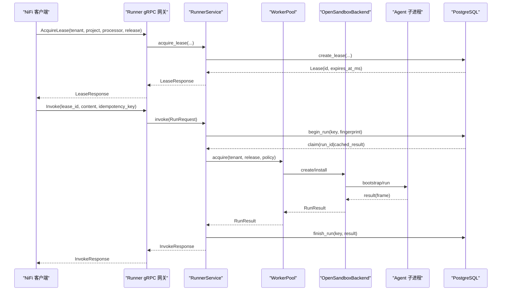

**图表来源**
- [gateway.py:102-177](file://runner_engine/gateway.py#L102-L177)
- [service.py:146-456](file://runner_engine/service.py#L146-L456)
- [pool.py:73-188](file://runner_engine/pool.py#L73-L188)
- [opensandbox.py:141-440](file://runner_engine/sandbox/opensandbox.py#L141-L440)
- [agent.py:467-798](file://runner_engine/worker/agent.py#L467-L798)

## 详细组件分析

### Runner 服务与生命周期
RunnerService 负责：
- 租约生命周期：创建、续期、释放，带租户与项目校验。
- 调用编排：参数与属性白名单过滤、大小限制、超时上限、幂等指纹、结果缓存与保留。
- 工作池协调：根据策略决定重用/失效/销毁沙箱。
- 后台清理：reaper 定时任务清理过期租约、幂等记录与旧运行。

LifecycleRunnerService 在 RunnerService 之上增加“运行时退役”门控：当镜像处于 RETIRING/RETIRED 时拒绝新租约与调用，并在 pool.acquire 处再次校验，关闭竞态窗口。

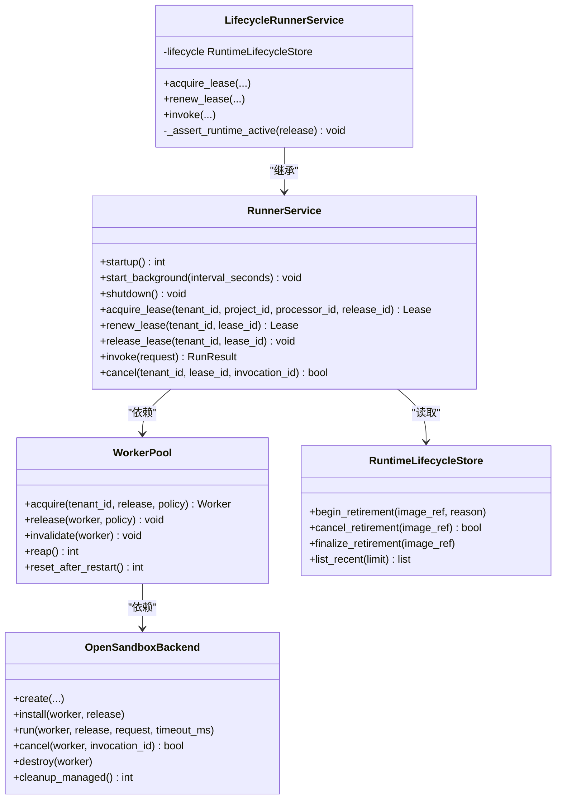

**图表来源**
- [service.py:80-456](file://runner_engine/service.py#L80-L456)
- [lifecycle_service.py:7-71](file://runner_engine/lifecycle_service.py#L7-L71)
- [pool.py:11-188](file://runner_engine/pool.py#L11-L188)
- [opensandbox.py:31-440](file://runner_engine/sandbox/opensandbox.py#L31-L440)
- [lifecycle_store.py:35-151](file://runner_engine/lifecycle_store.py#L35-L151)

**章节来源**
- [service.py:80-456](file://runner_engine/service.py#L80-L456)
- [lifecycle_service.py:7-71](file://runner_engine/lifecycle_service.py#L7-L71)
- [lifecycle_runtime.py:14-121](file://runner_engine/lifecycle_runtime.py#L14-L121)

### gRPC 网关与安全
Gateway 提供：
- mTLS 服务端证书与客户端 CA 配置。
- 从 gRPC 上下文提取 x509 SAN/CN 作为身份。
- AccessControl 将身份映射到允许的 tenant/project 集合。
- RunnerError 到 gRPC StatusCode 的映射（UNAUTHENTICATED、PERMISSION_DENIED、NOT_FOUND、UNAVAILABLE、FAILED_PRECONDITION）。

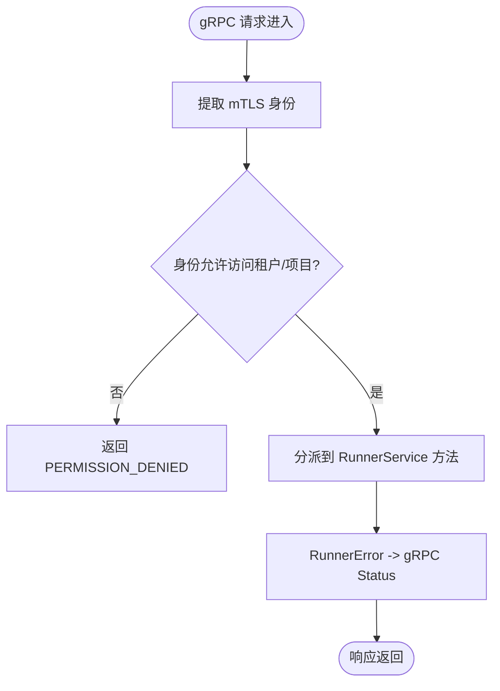

**图表来源**
- [gateway.py:33-96](file://runner_engine/gateway.py#L33-L96)
- [gateway.py:179-194](file://runner_engine/gateway.py#L179-L194)

**章节来源**
- [gateway.py:12-96](file://runner_engine/gateway.py#L12-L96)
- [gateway.py:179-194](file://runner_engine/gateway.py#L179-L194)

### 工作池与沙箱生命周期
WorkerPool 维护空闲工作项，按 key=(tenant_id, runtime.id, profile) 分组：
- 选择候选：跳过过期、已安装 release 超限的工作项。
- 确保 TTL：接近到期则 renew。
- 确保 Release：未安装则 install。
- 配额控制：creation_slot 与 reserve_live/release_live。
- 回收：reap 清理空闲超时；reset_after_restart 销毁遗留。

OpenSandboxBackend 负责：
- 创建沙箱：设置 image、timeout、resourceLimits、环境变量、entrypoint、metadata。
- 健康等待：轮询状态至 RUNNING/READY/STARTED。
- 端点发现：获取 agent 端口 endpoint。
- 运行：POST /run，封装 RunResult。
- 取消：POST /cancel。
- 销毁：DELETE /sandboxes/{id}。

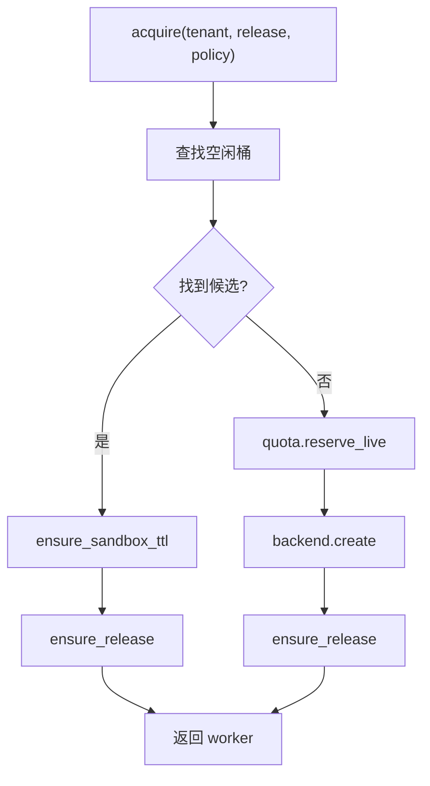

**图表来源**
- [pool.py:73-131](file://runner_engine/pool.py#L73-L131)
- [opensandbox.py:141-303](file://runner_engine/sandbox/opensandbox.py#L141-L303)

**章节来源**
- [pool.py:11-188](file://runner_engine/pool.py#L11-L188)
- [opensandbox.py:31-440](file://runner_engine/sandbox/opensandbox.py#L31-L440)

### Agent 子进程与用户算子执行
AgentState 保证：
- 单实例并发：_run_gate 互斥，禁止同时运行两个用户子进程。
- 资源限制：通过环境变量传递 CPU、内存、地址空间、nproc、nofile。
- 输出限制：stdout/stderr 最大长度，协议帧最大长度，属性数量与字节数限制。
- 安全路径：为每个 invocation 准备 scratch_dir，chown 给 child_uid/gid，仅暴露必要目录。
- 协议校验：解码帧、校验 envelope、result 字段、base64 content、attributes 类型与大小。

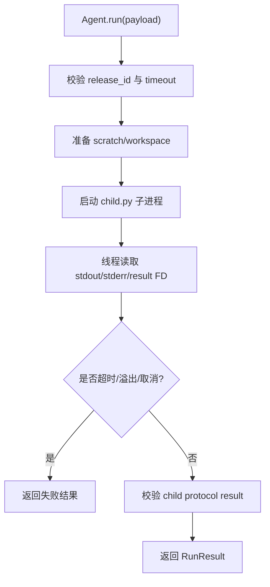

**图表来源**
- [agent.py:467-798](file://runner_engine/worker/agent.py#L467-L798)
- [agent.py:179-297](file://runner_engine/worker/agent.py#L179-L297)

**章节来源**
- [agent.py:309-798](file://runner_engine/worker/agent.py#L309-L798)

### 构建服务
BuildService.resolve：
- 使用 uv 锁定 requirements，生成 env_key。
- 查询 store：若存在 PENDING 则触发构建；若 FAILED 提示重试；若 exact 或 superset 命中则复用。
- 构建流程：claim_build -> build_runtime_image -> verify_runtime_image -> mark_ready。

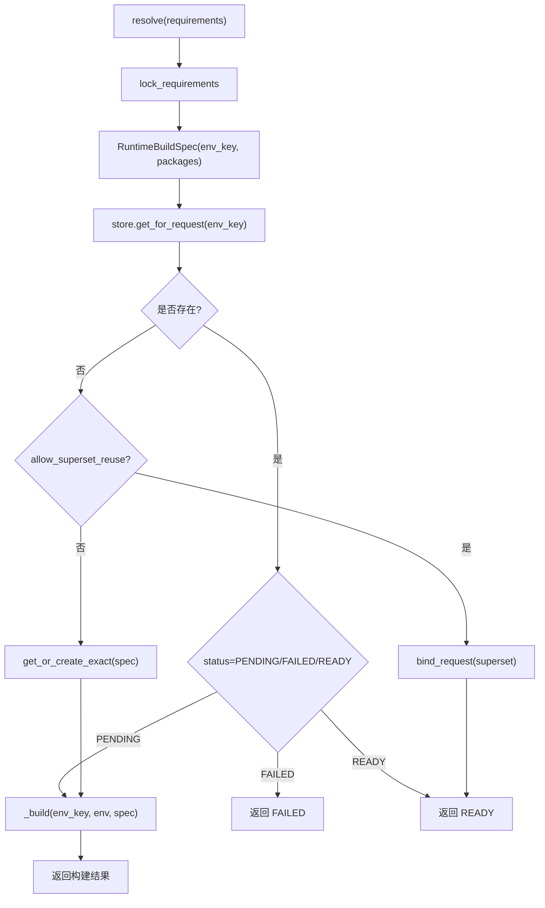

**图表来源**
- [service.py:31-119](file://build_service/service.py#L31-L119)
- [service.py:157-216](file://build_service/service.py#L157-L216)

**章节来源**
- [build_service/service.py:26-216](file://build_service/service.py#L26-L216)

### 发布服务
PublishService 主要职责：
- 源码扫描与虚拟契约编译：analyze、create_virtual_contract。
- 后端编译：compile_backend（runner/nifi_native），保存 variant 与 contract sha。
- 发布流程：publish_backend，runner 分支调用 BuildService 获取镜像，写 release 文件并调用 OperatorPublisher。
- 边缘包：edge_bundle_root 存储打包产物，支持 MinIO 下载。

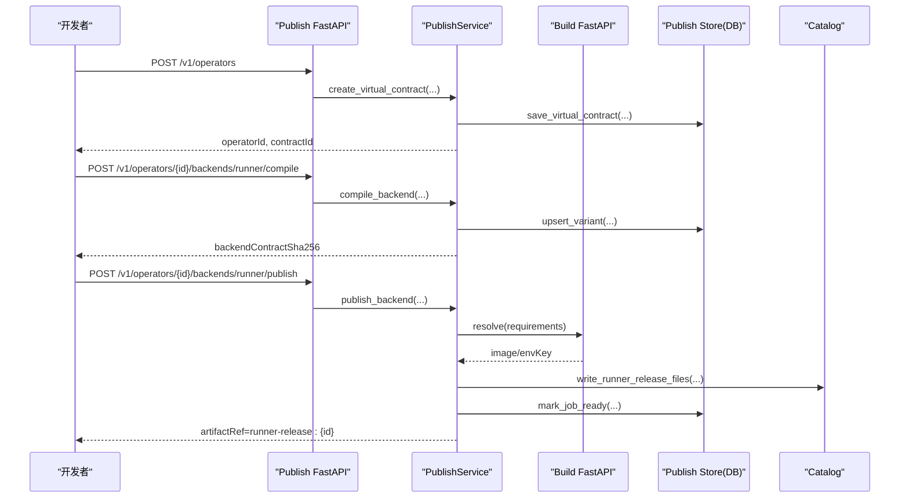

**图表来源**
- [publish_service/service.py:418-477](file://publish_service/service.py#L418-L477)
- [publish_service/service.py:569-643](file://publish_service/service.py#L569-L643)
- [publish_service/service.py:644-774](file://publish_service/service.py#L644-L774)
- [publish_service/app.py:211-277](file://publish_service/app.py#L211-L277)

**章节来源**
- [publish_service/service.py:71-800](file://publish_service/service.py#L71-L800)
- [publish_service/app.py:135-383](file://publish_service/app.py#L135-L383)

### 运行时图像退役与观察
RunnerLifecycleController 提供：
- runtime_image_status：汇总活跃调用、空闲 worker、managed sandbox、leases 计数。
- begin_runtime_retirement：写入 RETIRING，驱逐 idle workers。
- cancel_runtime_retirement：撤销退役。
- finalize_runtime_retirement：确认无活跃后标记 RETIRED。

RuntimeLifecycleStore 使用 PostgreSQL runner.runtime_image_lifecycle 表维护 state、reason、retired_at。

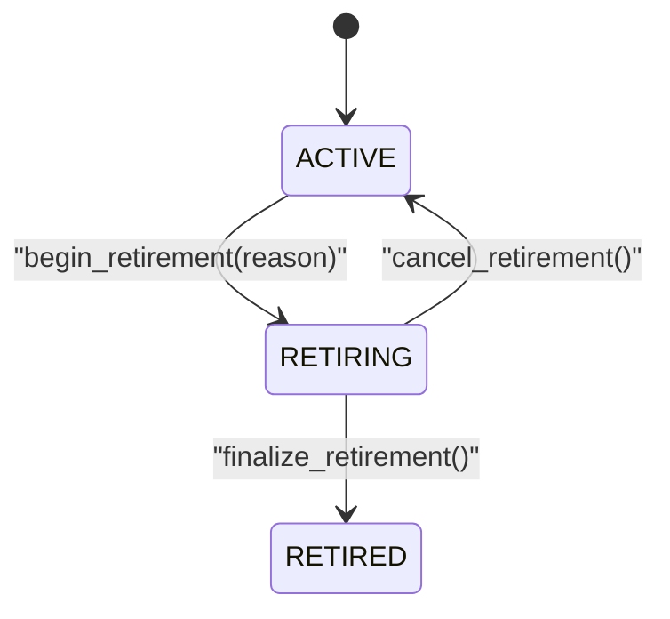

**图表来源**
- [lifecycle_runtime.py:187-397](file://runner_engine/lifecycle_runtime.py#L187-L397)
- [lifecycle_store.py:10-151](file://runner_engine/lifecycle_store.py#L10-L151)

**章节来源**
- [lifecycle_runtime.py:187-397](file://runner_engine/lifecycle_runtime.py#L187-L397)
- [lifecycle_store.py:35-151](file://runner_engine/lifecycle_store.py#L35-L151)

## 依赖关系分析
- Runner 服务依赖：
  - Catalog：读取 release 元数据。
  - RunnerDB：租约、幂等、运行记录。
  - WorkerPool：沙箱生命周期。
  - RuntimeLifecycleStore：镜像退役状态。
- OpenSandboxBackend 依赖：
  - urllib.request：HTTP 控制面。
  - worker.http_api.call：Agent 通信。
- 构建服务依赖：
  - BuildStore：环境与构建任务状态。
  - HarborClient：镜像仓库。
- 发布服务依赖：
  - operator_authoring.*：AST 扫描、编译、推断。
  - backends.runner/nifi_native：后端契约编译。
  - BuildServiceClient：调用构建服务。
  - EdgeDependencyResolver：边缘依赖解析。
  - OperatorPublisher：发布到 catalog。

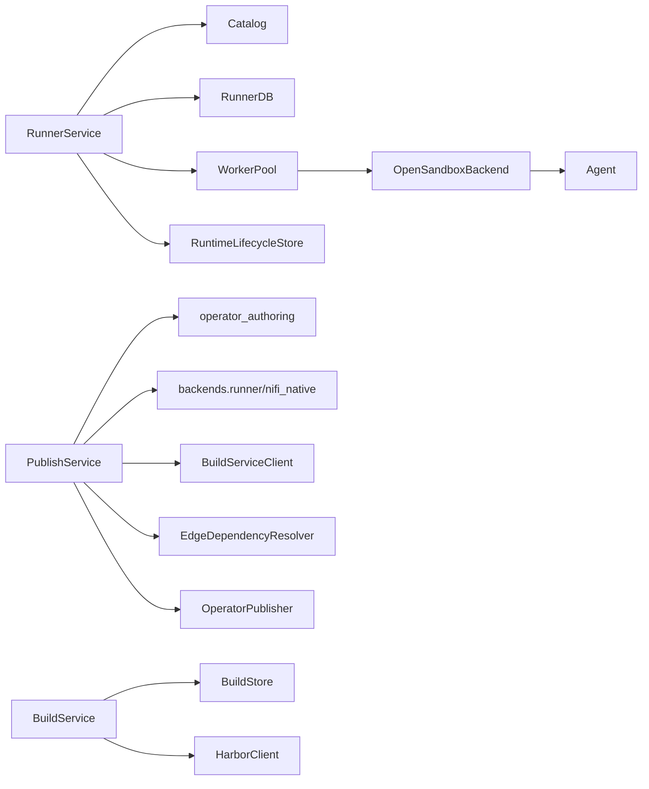

**图表来源**
- [service.py:80-456](file://runner_engine/service.py#L80-L456)
- [pool.py:11-188](file://runner_engine/pool.py#L11-L188)
- [opensandbox.py:31-440](file://runner_engine/sandbox/opensandbox.py#L31-L440)
- [publish_service/service.py:71-800](file://publish_service/service.py#L71-L800)
- [build_service/service.py:26-216](file://build_service/service.py#L26-L216)

**章节来源**
- [runner_engine/service.py:80-456](file://runner_engine/service.py#L80-L456)
- [runner_engine/pool.py:11-188](file://runner_engine/pool.py#L11-L188)
- [runner_engine/sandbox/opensandbox.py:31-440](file://runner_engine/sandbox/opensandbox.py#L31-L440)
- [publish_service/service.py:71-800](file://publish_service/service.py#L71-L800)
- [build_service/service.py:26-216](file://build_service/service.py#L26-L216)

## 性能与可扩展性
- 并发模型：
  - gRPC 服务端使用 ThreadPoolExecutor(max_workers=32)。
  - RunnerService 后台 reaper 线程周期性清理。
  - Agent 子进程单实例并发，避免竞争与资源争用。
- 资源与配额：
  - Quota 限制 max_creating/max_live/max_live_per_tenant。
  - WorkerPool 限制 max_installed_releases 与 idle/orphan TTL。
  - Agent 限制 stdout/stderr、属性数量与字节数、协议帧大小。
- 缓存与幂等：
  - RunnerService 基于 idempotency_key 缓存结果，保留 DEFAULT_IDEMPOTENCY_RETENTION_MS。
  - BuildService 支持 superset 复用减少重复构建。
- 扩展点：
  - OpenSandboxBackend 抽象后端，可替换其他沙箱实现。
  - PublishService 支持 runner/nifi_native 多后端编译。
  - Web 控制台可挂载更多子应用。

[本节为通用指导，不直接分析具体文件]

## 横切关注点：安全、监控与灾难恢复
- 安全：
  - gRPC mTLS 强制客户端认证，ACL 基于身份与租户/项目授权。
  - RunnerService 对 attributes/parameters/content 进行白名单与大小校验。
  - Agent 子进程以非 root 用户运行，限制进程数、文件描述符、CPU 与地址空间。
  - Admin 页面启用严格的安全头与同源校验。
- 监控：
  - Runner 暴露健康与生命周期快照（active invocations、idle workers、managed sandboxes）。
  - Admin 控制台提供 inventory 与审计记录。
  - Observe 控制台提供只读观测能力。
- 灾难恢复：
  - RunnerService.startup 重置 abandoned runs 并清理过期租约与幂等记录。
  - WorkerPool.reset_after_restart 销毁遗留 managed 沙箱。
  - RuntimeLifecycleStore 支持退役流程与最终确认，防止误删。

**章节来源**
- [gateway.py:33-96](file://runner_engine/gateway.py#L33-L96)
- [service.py:105-144](file://runner_engine/service.py#L105-L144)
- [agent.py:309-798](file://runner_engine/worker/agent.py#L309-L798)
- [web/admin/main.py:72-104](file://web/admin/main.py#L72-L104)
- [lifecycle_runtime.py:187-397](file://runner_engine/lifecycle_runtime.py#L187-L397)

## 部署拓扑与基础设施
- Runner 服务：
  - 监听地址与 TLS 证书/密钥/CA 必填。
  - 需要 PostgreSQL（RUNNER_DB_URL）、ACL 配置、策略配置、OpenSandbox 集群配置。
  - 可选 Admin HTTP（RUNNER_ADMIN_TOKEN）。
- 构建服务：
  - 需要 BUILD_DATABASE_URL、BUILD_RUNNER_BASE_IMAGE、BUILD_REGISTRY_REPO。
  - 可选 BUILD_ALLOW_SUPERSET_REUSE、UV_DEFAULT_INDEX。
- 发布服务：
  - 需要 PUBLISH_WORKSPACE_ROOT、PUBLISH_CATALOG_ROOT、PUBLISH_DATABASE_URL。
  - 可选 PUBLISH_SOURCE_ROOT、PUBLISH_NATIVE_ARTIFACT_ROOT、PUBLISH_EDGE_BUNDLE_ROOT。
  - 可选 MinIO 下载接口。
- Web 控制台：
  - 统一入口，聚合 Publish、Observe、Admin。
  - 非回环地址需显式允许远程无认证与设置 public_origin。

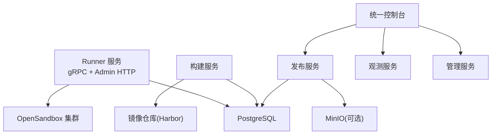

**图表来源**
- [app.py:26-227](file://runner_engine/app.py#L26-L227)
- [app.py:106-217](file://build_service/app.py#L106-L217)
- [app.py:135-383](file://publish_service/app.py#L135-L383)
- [main.py:34-147](file://web/console/main.py#L34-L147)

**章节来源**
- [runner_engine/app.py:26-227](file://runner_engine/app.py#L26-L227)
- [build_service/app.py:106-217](file://build_service/app.py#L106-L217)
- [publish_service/app.py:135-383](file://publish_service/app.py#L135-L383)
- [web/console/main.py:34-147](file://web/console/main.py#L34-L147)

## 故障排查指南
- gRPC 权限问题：
  - 检查 mTLS 身份是否在 ACL 中允许对应租户/项目。
  - 参考 Gateway._authorize/_authorize_lease 的错误映射。
- 租约与幂等：
  - 确认 lease_id 有效且属于当前租户。
  - 检查 idempotency_key 是否重复，查看 RUNNER_IDEMPOTENCY_RETENTION_MS。
- 调用失败：
  - 查看 RunnerService.invoke 的错误码（TIMEOUT、CANCELLED、USER_EXCEPTION 等）。
  - 检查 Agent 子进程日志与输出限制。
- 沙箱创建失败：
  - 检查 OpenSandbox 集群可达性与 API Key。
  - 查看 SANDBOX_START_FAILED/SANDBOX_ENDPOINT_MISSING/AGENT_START_TIMEOUT。
- 构建失败：
  - 检查 BUILD_* 环境变量与 Harbor 配置。
  - 使用 /v1/runtime-environments/{env_key}/retry 重试。
- 发布失败：
  - 检查虚拟契约与后端编译结果。
  - 查看 Edge Dependency Conflict 详情。

**章节来源**
- [gateway.py:67-96](file://runner_engine/gateway.py#L67-L96)
- [service.py:188-456](file://runner_engine/service.py#L188-L456)
- [opensandbox.py:141-303](file://runner_engine/sandbox/opensandbox.py#L141-L303)
- [build_service/app.py:140-179](file://build_service/app.py#L140-L179)
- [publish_service/service.py:644-774](file://publish_service/service.py#L644-L774)

## 结论
Runner Engine 通过清晰的微服务分层与严格的资源/协议约束，实现了高可靠、可扩展的 Python Operator 构建与执行平台。gRPC mTLS 与 ACL 保障接入安全，WorkerPool 与 OpenSandboxBackend 提供弹性沙箱生命周期，Agent 子进程确保用户算子隔离执行。构建与发布服务解耦了依赖解析、镜像构建与产物发布，Web 控制台提供统一的开发与运维体验。系统在幂等、保留、退役与清理方面具备完善的容错与可观测性，适合在生产环境中规模化部署。