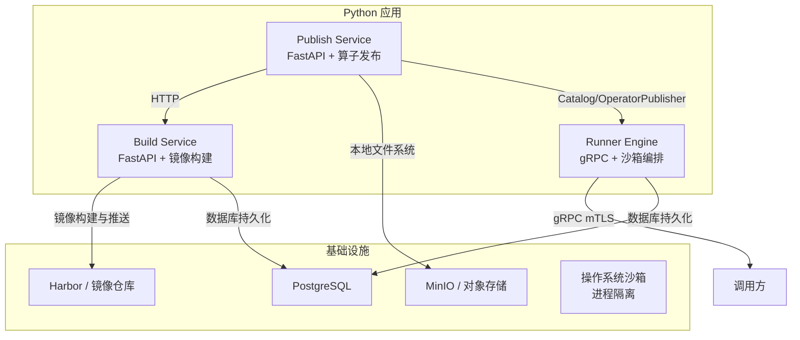
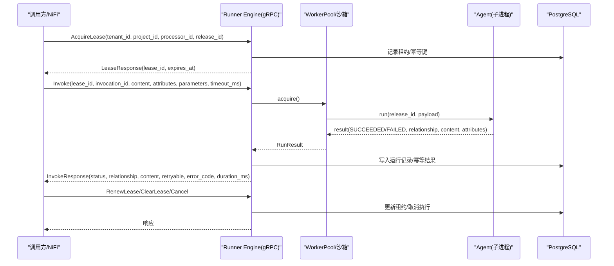
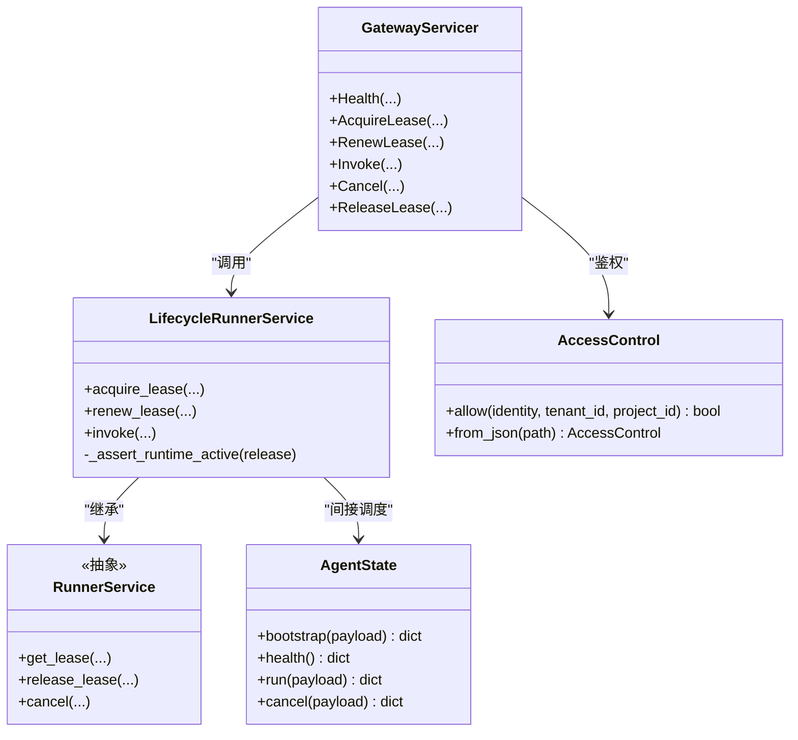
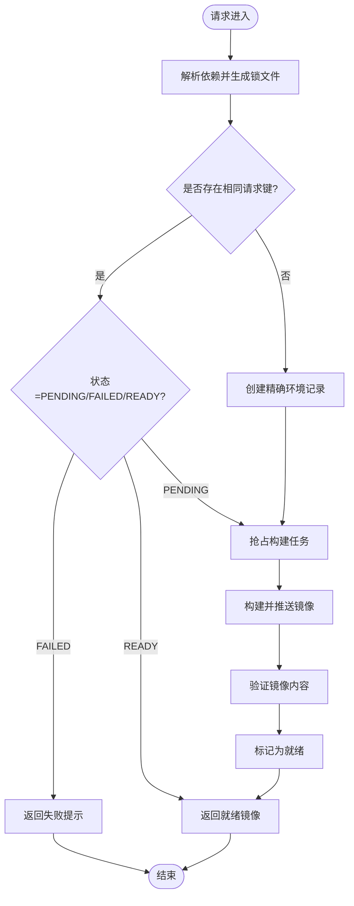
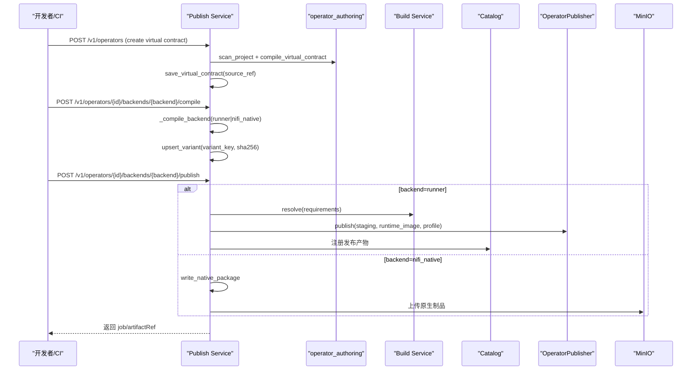
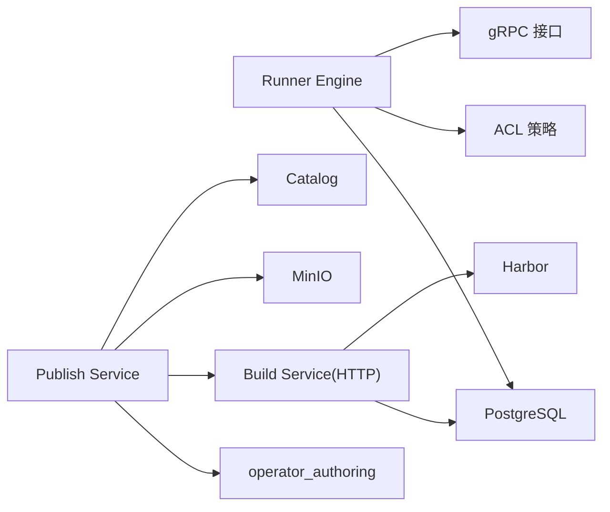
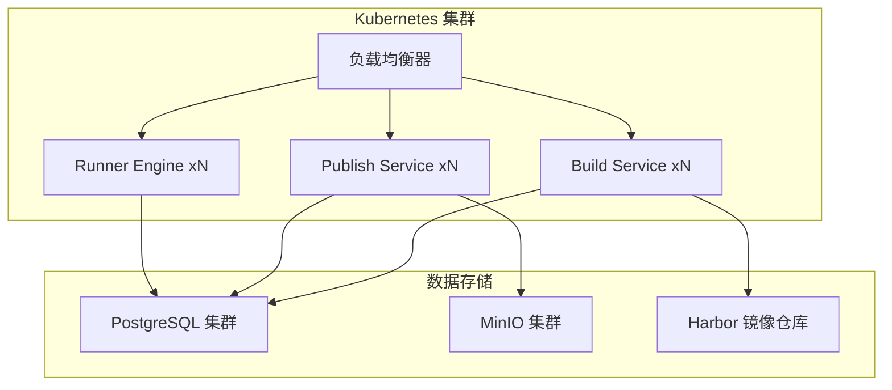

# 系统架构概览

<cite>
**本文引用的文件**   
- [runner_engine/app.py](file://runner_engine/app.py)
- [runner_engine/gateway.py](file://runner_engine/gateway.py)
- [runner_engine/lifecycle_service.py](file://runner_engine/lifecycle_service.py)
- [runner_engine/worker/agent.py](file://runner_engine/worker/agent.py)
- [proto/runner.proto](file://proto/runner.proto)
- [build_service/app.py](file://build_service/app.py)
- [build_service/service.py](file://build_service/service.py)
- [publish_service/app.py](file://publish_service/app.py)
- [publish_service/service.py](file://publish_service/service.py)
- [publish_service/backends/base.py](file://publish_service/backends/base.py)
- [pyproject.toml](file://pyproject.toml)
</cite>

## 目录
1. [引言](#引言)
2. [项目结构](#项目结构)
3. [核心组件](#核心组件)
4. [架构总览](#架构总览)
5. [详细组件分析](#详细组件分析)
6. [依赖关系分析](#依赖关系分析)
7. [性能与可扩展性](#性能与可扩展性)
8. [故障排查指南](#故障排查指南)
9. [结论](#结论)
10. [附录：技术选型与部署拓扑](#附录技术选型与部署拓扑)

## 引言
本文件为 Runner Engine 系统的系统架构概览文档，面向平台工程师、运维人员以及需要理解整体微服务边界的开发者。文档重点说明以下方面：
- 三个核心服务的职责边界：Runner Engine、Build Service、Publish Service。
- 系统边界、组件间通信协议（gRPC、HTTP）、数据流向和依赖关系。
- 技术选型决策：FastAPI、gRPC、PostgreSQL、MinIO 等。
- 系统上下文图与部署拓扑图，说明各服务在集群中的角色和位置。
- 基础设施需求、高可用设计与可扩展性考虑。
- 插件架构模式如何实现后端扩展。
- 事件驱动模式如何处理异步任务。
- 分层架构如何组织代码结构。

## 项目结构
仓库采用多服务、多模块的 Python 工程结构，核心入口通过可执行脚本暴露：
- runner_engine：运行时引擎，提供 gRPC 接口，负责沙箱生命周期、租约管理、调用编排与隔离执行。
- build_service：构建服务，基于 FastAPI 暴露 HTTP API，负责 Python 运行环境镜像解析、构建与验证。
- publish_service：发布服务，基于 FastAPI 暴露 HTTP API，负责算子虚拟契约编译、后端产物发布、边缘包生成与 MinIO 集成。
- proto：gRPC 接口定义。
- operator_authoring：算子分析与编译器工具库，被 publish_service 复用。
- web：控制台与观察界面，非本次架构文档重点。
- infra/nifi：NiFi 原生后端相关 Java 组件，作为外部生态集成点。

**图表来源**
- [runner_engine/app.py:26-227](file://runner_engine/app.py#L26-L227)
- [build_service/app.py:106-181](file://build_service/app.py#L106-L181)
- [publish_service/app.py:135-347](file://publish_service/app.py#L135-L347)
- [pyproject.toml:11-28](file://pyproject.toml#L11-L28)

**章节来源**
- [pyproject.toml:1-37](file://pyproject.toml#L1-L37)

## 核心组件
- Runner Engine：对外暴露 gRPC ManagedPythonRunner 服务，实现健康检查、租约获取/续期/释放、算子调用与取消；内部维护 WorkerPool、沙箱后端、配额策略、幂等性与运行记录；通过 mTLS 进行身份认证与访问控制。
- Build Service：对外暴露 FastAPI HTTP API，提供运行环境解析、查询与重试；内部使用 uv 锁定依赖、构建并验证镜像，状态持久化到 PostgreSQL。
- Publish Service：对外暴露 FastAPI HTTP API，提供算子分析、虚拟契约创建、后端编译与发布、边缘包下载、MinIO 文件夹下载；内部组合 operator_authoring、Build Service、Catalog、MinIO 工具与本地文件系统。

关键职责划分：
- Runner Engine 专注“运行时调度与执行”，不关心算子如何构建或发布。
- Build Service 专注“Python 运行环境镜像”的确定性构建与缓存复用。
- Publish Service 专注“算子制品与发行物”的编译、打包与分发，并协调 Build Service 完成运行时镜像准备。

**章节来源**
- [runner_engine/app.py:26-227](file://runner_engine/app.py#L26-L227)
- [runner_engine/gateway.py:44-194](file://runner_engine/gateway.py#L44-L194)
- [build_service/app.py:106-181](file://build_service/app.py#L106-L181)
- [publish_service/app.py:135-347](file://publish_service/app.py#L135-L347)

## 架构总览
Runner Engine 系统采用三层微服务架构：
- 接入层：Publish Service 与 Build Service 提供 RESTful HTTP API，便于前端、CI/CD 与外部系统集成。
- 编排层：Runner Engine 提供 gRPC 接口，承载高吞吐、低延迟的运行时调用。
- 基础设施层：PostgreSQL 用于状态持久化，Harbor 用于镜像分发，MinIO 用于对象存储与边缘包分发。

**图表来源**
- [proto/runner.proto:8-75](file://proto/runner.proto#L8-L75)
- [runner_engine/gateway.py:98-177](file://runner_engine/gateway.py#L98-L177)
- [runner_engine/worker/agent.py:467-797](file://runner_engine/worker/agent.py#L467-L797)

**章节来源**
- [proto/runner.proto:1-76](file://proto/runner.proto#L1-L76)
- [runner_engine/gateway.py:44-194](file://runner_engine/gateway.py#L44-L194)
- [runner_engine/worker/agent.py:309-797](file://runner_engine/worker/agent.py#L309-L797)

## 详细组件分析

### Runner Engine 组件分析
Runner Engine 是运行时核心，承担以下职责：
- 启动参数与环境校验：监听地址、目录、数据库 URL、策略、ACL、集群配置、TLS 证书等。
- 生命周期控制器：将 Catalog、数据库、WorkerPool、Quota、LifecycleStore 装配成可运行的服务。
- gRPC 网关：mTLS 认证、AccessControl 鉴权、错误码映射、消息大小限制。
- 沙箱与 WorkerPool：按租户/项目维度分配资源，支持空闲回收、孤儿清理、最大实例数限制。
- 幂等与保留策略：基于 idempotency_key 去重，保留运行历史一段时间。

**图表来源**
- [runner_engine/lifecycle_service.py:7-70](file://runner_engine/lifecycle_service.py#L7-L70)
- [runner_engine/gateway.py:12-31](file://runner_engine/gateway.py#L12-L31)
- [runner_engine/gateway.py:67-177](file://runner_engine/gateway.py#L67-L177)
- [runner_engine/worker/agent.py:309-465](file://runner_engine/worker/agent.py#L309-L465)

**章节来源**
- [runner_engine/app.py:26-227](file://runner_engine/app.py#L26-L227)
- [runner_engine/lifecycle_service.py:7-70](file://runner_engine/lifecycle_service.py#L7-L70)
- [runner_engine/gateway.py:44-194](file://runner_engine/gateway.py#L44-L194)
- [runner_engine/worker/agent.py:309-797](file://runner_engine/worker/agent.py#L309-L797)

### Build Service 组件分析
Build Service 负责 Python 运行环境的确定性构建：
- 解析依赖：使用 uv 锁定 requirements，生成 lock 文本与 spec。
- 构建与验证：构建镜像并推送到 Harbor，随后验证镜像内容。
- 状态机：PENDING -> VERIFYING -> READY/FAILED，支持重试。
- 复用策略：允许 superset 复用兼容环境，减少重复构建。

**图表来源**
- [build_service/service.py:31-119](file://build_service/service.py#L31-L119)
- [build_service/service.py:157-215](file://build_service/service.py#L157-L215)

**章节来源**
- [build_service/app.py:106-181](file://build_service/app.py#L106-L181)
- [build_service/service.py:14-216](file://build_service/service.py#L14-L216)

### Publish Service 组件分析
Publish Service 负责算子从源码到制品的全流程：
- 分析阶段：扫描 Python 项目，生成可调用的函数视图与建议参数。
- 虚拟契约：保存不可变源快照，编译虚拟契约与派生元数据。
- 后端编译：支持 runner 与 nifi_native 两种后端，计算 variant key 与合约摘要。
- 发布流程：runner 后端调用 Build Service 获取运行时镜像，生成发布工件；nifi_native 后端生成原生包。
- 边缘包与 MinIO：提供边缘包下载与 MinIO 文件夹下载能力。

**图表来源**
- [publish_service/service.py:418-477](file://publish_service/service.py#L418-L477)
- [publish_service/service.py:569-622](file://publish_service/service.py#L569-L622)
- [publish_service/service.py:644-774](file://publish_service/service.py#L644-L774)
- [publish_service/app.py:201-277](file://publish_service/app.py#L201-L277)

**章节来源**
- [publish_service/app.py:135-347](file://publish_service/app.py#L135-L347)
- [publish_service/service.py:71-110](file://publish_service/service.py#L71-L110)
- [publish_service/service.py:418-774](file://publish_service/service.py#L418-L774)
- [publish_service/backends/base.py:10-27](file://publish_service/backends/base.py#L10-L27)

## 依赖关系分析
- Runner Engine 依赖：
  - gRPC 接口定义（proto/runner.proto）。
  - 数据库（PostgreSQL）用于租约、幂等键与运行记录。
  - 沙箱后端（OpenSandbox/Local）用于容器或本地进程隔离。
  - ACL 策略文件用于 mTLS 身份到租户/项目的授权映射。
- Build Service 依赖：
  - PostgreSQL 用于构建任务状态与镜像引用。
  - Harbor 客户端用于镜像推送与拉取。
  - uv 与 packaging 工具链用于依赖解析与镜像构建。
- Publish Service 依赖：
  - operator_authoring 用于 AST 扫描、契约编译与参数建议。
  - Build Service HTTP API 用于运行时镜像解析。
  - MinIO 工具用于对象存储操作。
  - Catalog 与 OperatorPublisher 用于发布产物注册与分发。

**图表来源**
- [runner_engine/app.py:92-154](file://runner_engine/app.py#L92-L154)
- [build_service/app.py:65-99](file://build_service/app.py#L65-L99)
- [publish_service/app.py:50-128](file://publish_service/app.py#L50-L128)

**章节来源**
- [runner_engine/app.py:92-154](file://runner_engine/app.py#L92-L154)
- [build_service/app.py:65-99](file://build_service/app.py#L65-L99)
- [publish_service/app.py:50-128](file://publish_service/app.py#L50-L128)

## 性能与可扩展性
- Runner Engine：
  - gRPC 线程池并发处理调用，支持大消息长度限制。
  - WorkerPool 与 Quota 控制沙箱数量与租户上限，避免资源争用。
  - 幂等键与运行记录保留策略平衡查询性能与审计需求。
- Build Service：
  - 依赖锁与 superset 复用减少重复构建。
  - 构建任务抢占机制避免重复工作。
- Publish Service：
  - 后端编译与发布分离，variant key 与合约摘要保证可重复性。
  - 边缘包与原生包并行处理，MinIO 提供高吞吐对象存取。

可扩展性考虑：
- 新增后端：Publish Service 的 backends 目录支持插件式扩展（runner、nifi_native），通过统一接口与合约摘要算法实现新后端接入。
- 水平扩展：Runner Engine 无状态 gRPC 服务可通过负载均衡横向扩展；Build/Publish 服务同样可多副本部署，共享数据库与对象存储。
- 高可用设计：数据库主从或集群化；对象存储多副本；镜像仓库高可用；gRPC mTLS 保障安全传输。

[本节为通用指导，不直接分析具体文件]

## 故障排查指南
- Runner Engine：
  - mTLS 未配置或证书无效：检查 TLS 证书、密钥与 client CA 配置。
  - 权限拒绝：检查 ACL 策略中 identity 与 tenant/project 映射。
  - 租约未知或释放失败：确认 lease_id 是否过期或被其他实例释放。
  - 调用超时或日志超限：调整 timeout_ms、输出与属性大小限制。
- Build Service：
  - 构建失败：查看构建日志与镜像验证错误，必要时重试。
  - 镜像未就绪：确认 Harbor 推送成功且镜像存在。
- Publish Service：
  - 依赖冲突：EdgeDependencyConflictError 表示目标平台依赖冲突，需拆分部署或调整依赖版本。
  - MinIO 错误：区分 Bucket 不存在、路径不存在、权限不足与配置错误。

**章节来源**
- [runner_engine/gateway.py:67-79](file://runner_engine/gateway.py#L67-L79)
- [runner_engine/worker/agent.py:696-778](file://runner_engine/worker/agent.py#L696-L778)
- [build_service/service.py:157-215](file://build_service/service.py#L157-L215)
- [publish_service/service.py:691-709](file://publish_service/service.py#L691-L709)
- [publish_service/app.py:279-335](file://publish_service/app.py#L279-L335)

## 结论
Runner Engine 系统通过 Runner Engine、Build Service、Publish Service 三个核心服务形成清晰的职责边界：运行时调度、镜像构建与算子发布。系统以 gRPC 与 HTTP 作为主要通信协议，结合 PostgreSQL、Harbor、MinIO 等基础设施，实现了高吞吐、可观测、可扩展的算子运行平台。插件化的后端架构与事件驱动的异步任务处理，使系统具备良好的演进能力与生产可用性。

[本节为总结性内容，不直接分析具体文件]

## 附录：技术选型与部署拓扑

### 技术选型理由
- FastAPI：高性能异步 Web 框架，适合构建 Publish/Build 服务的 REST API，配合 Pydantic 提供强类型校验。
- gRPC：高效二进制序列化与流式 RPC，适合 Runner Engine 的高频调用场景；mTLS 提供强身份认证与安全传输。
- PostgreSQL：成熟的关系型数据库，用于租约、幂等键、构建任务、发布作业等结构化状态。
- MinIO：兼容 S3 的对象存储，适合边缘包与原生制品的分发与下载。
- uv/packaging：现代 Python 依赖解析与构建工具链，提升构建速度与可重复性。

**章节来源**
- [pyproject.toml:11-28](file://pyproject.toml#L11-L28)

### 部署拓扑图

**图表来源**
- [runner_engine/app.py:26-227](file://runner_engine/app.py#L26-L227)
- [build_service/app.py:187-212](file://build_service/app.py#L187-L212)
- [publish_service/app.py:353-378](file://publish_service/app.py#L353-L378)