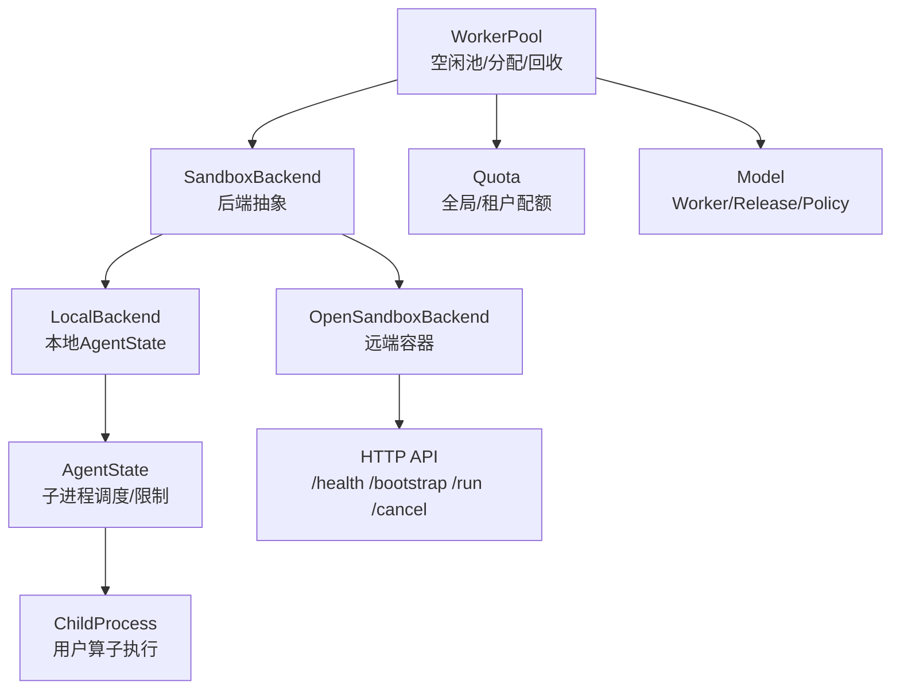
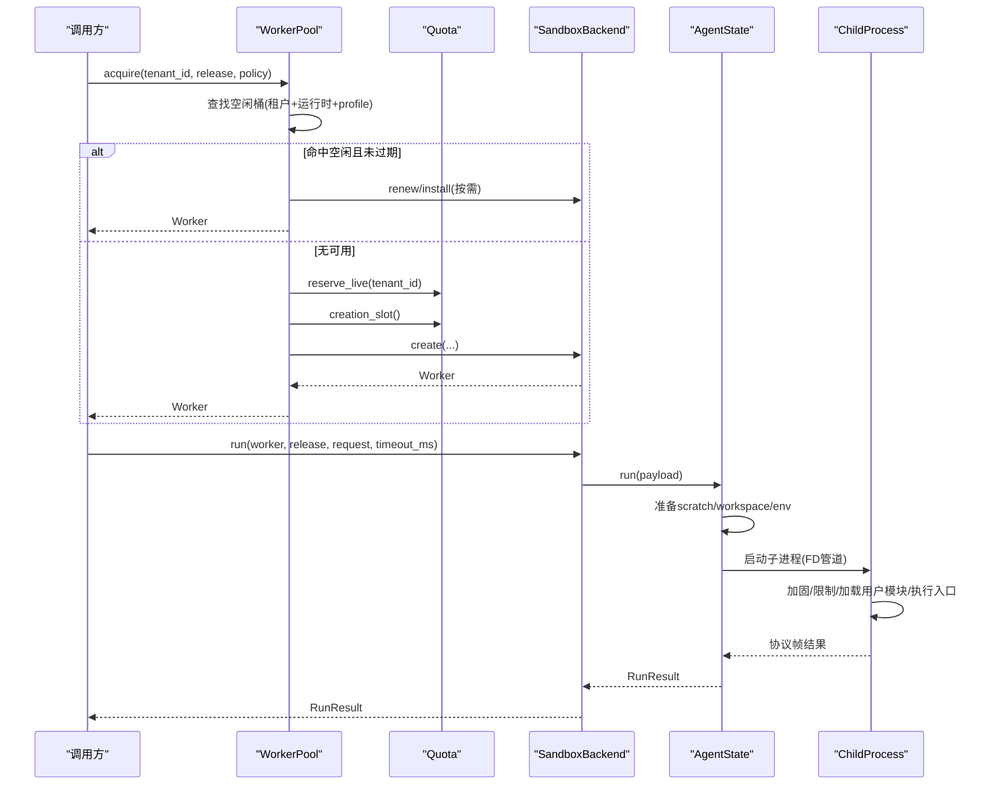
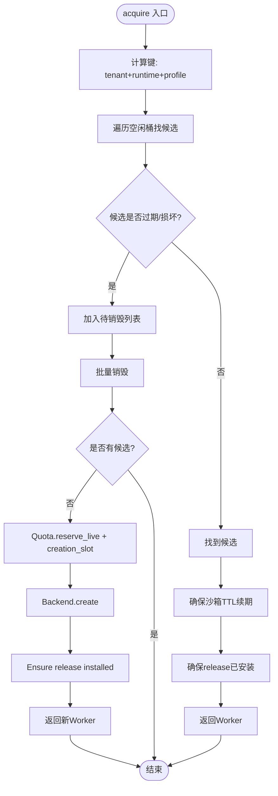
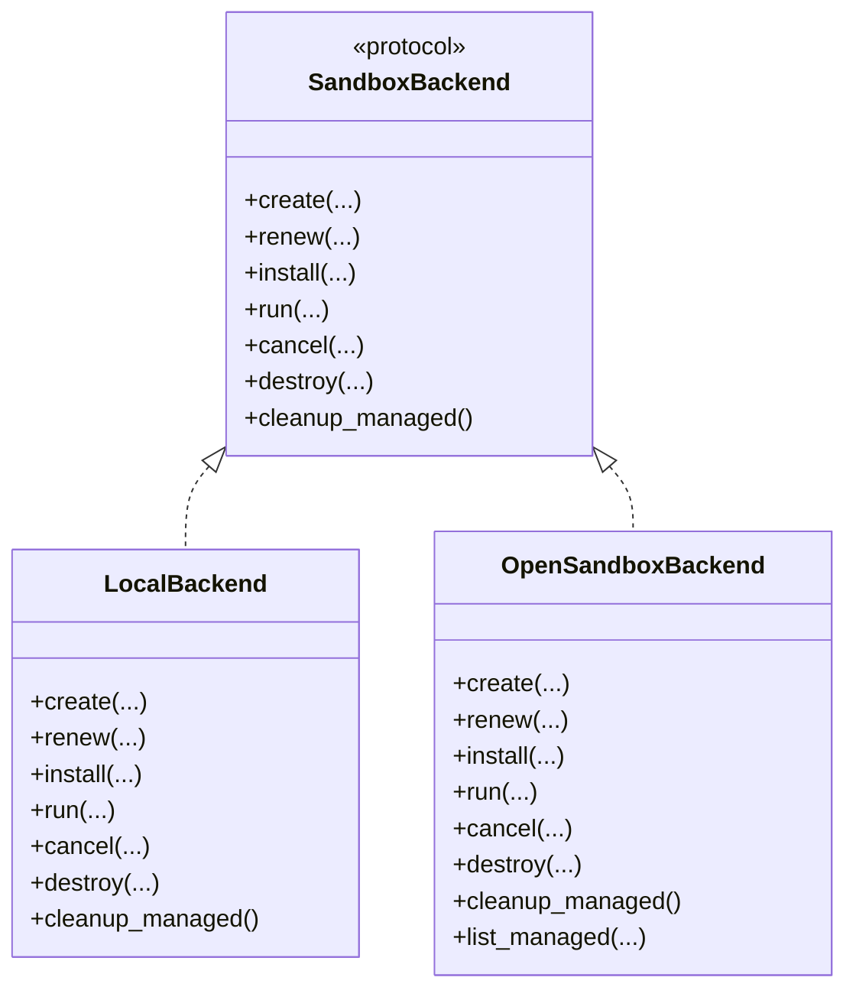
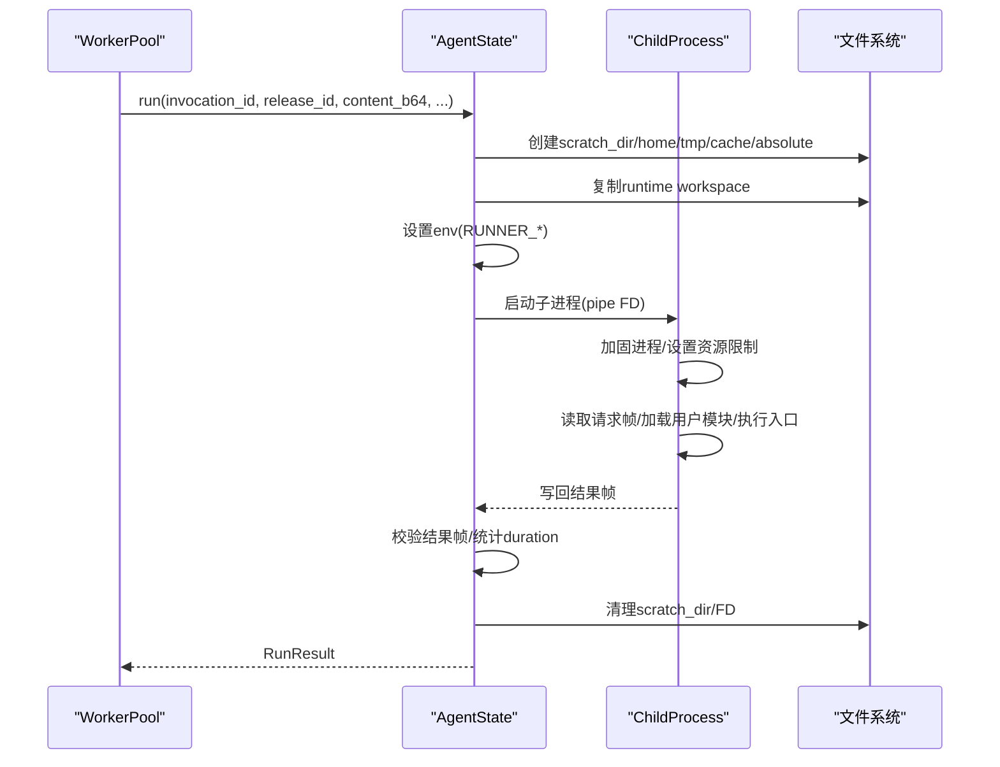
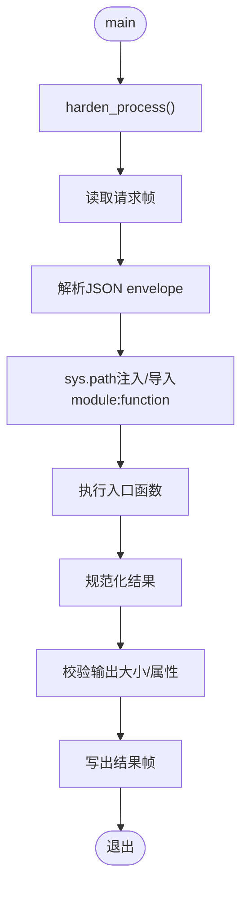
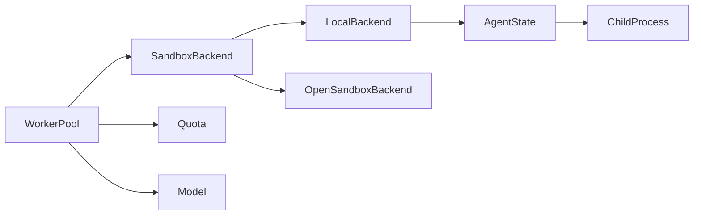

# 工作进程池管理

<cite>
**本文引用的文件**   
- [pool.py](file://runner_engine/pool.py)
- [agent.py](file://runner_engine/worker/agent.py)
- [child.py](file://runner_engine/worker/child.py)
- [model.py](file://runner_engine/model.py)
- [state.py](file://runner_engine/state.py)
- [quota.py](file://runner_engine/quota.py)
- [backend.py](file://runner_engine/sandbox/backend.py)
- [local.py](file://runner_engine/sandbox/local.py)
- [opensandbox.py](file://runner_engine/sandbox/opensandbox.py)
- [lifecycle_runtime.py](file://runner_engine/lifecycle_runtime.py)
- [policy.py](file://runner_engine/policy.py)
</cite>

## 目录
1. [引言](#引言)
2. [项目结构](#项目结构)
3. [核心组件](#核心组件)
4. [架构总览](#架构总览)
5. [详细组件分析](#详细组件分析)
6. [依赖关系分析](#依赖关系分析)
7. [性能与资源特性](#性能与资源特性)
8. [故障排查指南](#故障排查指南)
9. [结论](#结论)

## 引言
本文面向 Runner Engine 的工作进程池管理系统，重点解释 WorkerPool 的架构与实现，包括工作进程的创建、分配、回收、监控、租户隔离、配置管理、健康检查、状态机、内存使用模式与性能优化策略。同时给出调试与故障排查建议，帮助读者在本地开发与生产环境中定位问题。

## 项目结构
Runner Engine 中与工作进程池相关的代码主要分布在以下模块：
- runner_engine/pool.py：工作进程池的核心逻辑，负责空闲池、生命周期、配额与后端协调。
- runner_engine/worker/agent.py：可信 Agent 运行时，负责子进程调度、资源限制、输出限制、取消与清理。
- runner_engine/worker/child.py：用户算子执行环境，负责加载用户模块、执行入口函数、结果校验与输出限制。
- runner_engine/sandbox/backend.py：沙箱后端抽象协议。
- runner_engine/sandbox/local.py：本地开发/测试后端，直接复用 AgentState。
- runner_engine/sandbox/opensandbox.py：OpenSandbox 远程沙箱后端，负责远端容器生命周期、健康检查与调用。
- runner_engine/model.py：Worker、RunRequest、RunResult、SecurityPolicy 等数据模型。
- runner_engine/quota.py：全局与租户维度的并发与在线沙箱配额控制。
- runner_engine/state.py：持久化运行状态、租约与幂等缓存。
- runner_engine/lifecycle_runtime.py：基于 WorkerPool 的生命周期扩展，支持运行时退役与快照。
- runner_engine/policy.py：安全策略配置文件加载。

**图表来源**
- [pool.py:11-187](file://runner_engine/pool.py#L11-L187)
- [backend.py:14-48](file://runner_engine/sandbox/backend.py#L14-L48)
- [local.py:14-131](file://runner_engine/sandbox/local.py#L14-L131)
- [opensandbox.py:31-439](file://runner_engine/sandbox/opensandbox.py#L31-L439)
- [agent.py:309-798](file://runner_engine/worker/agent.py#L309-L798)
- [child.py:272-344](file://runner_engine/worker/child.py#L272-L344)
- [quota.py:9-60](file://runner_engine/quota.py#L9-L60)
- [model.py:74-98](file://runner_engine/model.py#L74-L98)

**章节来源**
- [pool.py:11-187](file://runner_engine/pool.py#L11-L187)
- [backend.py:14-48](file://runner_engine/sandbox/backend.py#L14-L48)
- [local.py:14-131](file://runner_engine/sandbox/local.py#L14-L131)
- [opensandbox.py:31-439](file://runner_engine/sandbox/opensandbox.py#L31-L439)
- [agent.py:309-798](file://runner_engine/worker/agent.py#L309-L798)
- [child.py:272-344](file://runner_engine/worker/child.py#L272-L344)
- [quota.py:9-60](file://runner_engine/quota.py#L9-L60)
- [model.py:74-98](file://runner_engine/model.py#L74-L98)

## 核心组件
- WorkerPool：按 tenant_id + runtime.id + profile 维度维护空闲 Worker 桶；负责 acquire/release/invalidate/reap/reset_after_restart；结合 Quota 控制全局与租户级并发与在线数；通过 SandboxBackend 创建、安装、续期、销毁 Worker。
- SandboxBackend（Protocol）：定义 create/renew/install/run/cancel/destroy/cleanup_managed 接口，解耦本地与远端实现。
- LocalBackend：开发/测试后端，直接持有 AgentState，并在临时目录中安装 release 并执行 run。
- OpenSandboxBackend：远端沙箱后端，通过 HTTP API 创建容器、等待就绪、健康探测、安装 release、执行 run、取消、销毁，以及清理托管沙箱。
- AgentState：可信 Agent，单实例内串行执行用户算子；负责子进程启动、环境变量注入、资源限制、日志与协议输出限制、超时与取消、工作空间与 scratch 清理。
- ChildProcess：用户算子执行环境，加固进程、设置资源限制、加载用户模块、执行入口函数、规范化结果、校验输出大小与属性。
- Quota：BoundedSemaphore 控制创建并发；记录全局与租户在线沙箱数量，防止过载。
- Model：Worker、OperatorRelease、SecurityPolicy、RunRequest、RunResult 等数据结构，承载租户、运行时、安全策略、执行上下文与结果。
- LifecycleWorkerPool：扩展 WorkerPool，支持运行时退役、空闲 Worker 回收、快照导出。
- Policy：从 JSON 加载 SecurityPolicy，映射到 CPU、内存、超时、网络白名单、是否复用沙箱等策略。

**章节来源**
- [pool.py:11-187](file://runner_engine/pool.py#L11-L187)
- [backend.py:14-48](file://runner_engine/sandbox/backend.py#L14-L48)
- [local.py:14-131](file://runner_engine/sandbox/local.py#L14-L131)
- [opensandbox.py:31-439](file://runner_engine/sandbox/opensandbox.py#L31-L439)
- [agent.py:309-798](file://runner_engine/worker/agent.py#L309-L798)
- [child.py:272-344](file://runner_engine/worker/child.py#L272-L344)
- [quota.py:9-60](file://runner_engine/quota.py#L9-L60)
- [model.py:7-98](file://runner_engine/model.py#L7-L98)
- [lifecycle_runtime.py:14-120](file://runner_engine/lifecycle_runtime.py#L14-L120)
- [policy.py:9-24](file://runner_engine/policy.py#L9-L24)

## 架构总览
WorkerPool 作为调度中枢，根据租户、运行时与安全策略选择或创建 Worker，并通过后端抽象与具体实现交互。本地后端直接复用 AgentState，远端后端通过 OpenSandbox HTTP API 管理容器生命周期。AgentState 负责子进程隔离与资源限制，ChildProcess 负责用户算子的安全执行与结果校验。

**图表来源**
- [pool.py:73-130](file://runner_engine/pool.py#L73-L130)
- [opensandbox.py:141-376](file://runner_engine/sandbox/opensandbox.py#L141-L376)
- [local.py:78-111](file://runner_engine/sandbox/local.py#L78-L111)
- [agent.py:467-778](file://runner_engine/worker/agent.py#L467-L778)
- [child.py:347-413](file://runner_engine/worker/child.py#L347-L413)

## 详细组件分析

### WorkerPool：工作进程池核心
- 空闲池键：tenant_id + runtime.id + profile。
- 空闲判定：destroyed、healthy、last_used_monotonic 超过 idle_seconds。
- 沙箱续期：当剩余 TTL 小于 renew_before_seconds 或执行头预留时间时，触发后端 renew。
- Release 安装：若 Worker 已安装 release 数量达到上限，则丢弃该候选并尝试其他 Worker。
- 分配流程：优先复用空闲 Worker；否则通过 Quota.reserve_live 与 creation_slot 限流后创建新 Worker。
- 释放流程：更新 runs 与 last_used_monotonic；若不可复用则销毁；否则放回空闲桶。
- 失效与回收：invalidate 标记不健康并销毁；reap 定期清理过期空闲 Worker；reset_after_restart 清空内存池并清理后端托管资源。

**图表来源**
- [pool.py:47-130](file://runner_engine/pool.py#L47-L130)

**章节来源**
- [pool.py:11-187](file://runner_engine/pool.py#L11-L187)

### SandboxBackend 与实现：本地与远端
- 抽象协议：create/renew/install/run/cancel/destroy/cleanup_managed。
- LocalBackend：
  - create：生成临时目录，构造 AgentState，返回 Worker。
  - install：将 release artifact 写入 AgentState 的 releases_root。
  - run：调用 AgentState.run，封装为 RunResult。
  - destroy/cleanup_managed：清理临时目录与内部映射。
- OpenSandboxBackend：
  - create：调用远端 /v1/sandboxes 创建容器，轮询状态至 RUNNING/READY/STARTED，获取 endpoint，轮询 /health 直至健康。
  - renew：调用 /renew-expiration 延长沙箱 TTL。
  - install：调用 /bootstrap 安装 release。
  - run：调用 /run 执行算子，封装为 RunResult。
  - cancel：调用 /cancel 取消指定 invocation。
  - destroy/cleanup_managed：删除远端沙箱，按 managed-by 与 owner 标签清理。

**图表来源**
- [backend.py:14-48](file://runner_engine/sandbox/backend.py#L14-L48)
- [local.py:14-131](file://runner_engine/sandbox/local.py#L14-L131)
- [opensandbox.py:31-439](file://runner_engine/sandbox/opensandbox.py#L31-L439)

**章节来源**
- [backend.py:14-48](file://runner_engine/sandbox/backend.py#L14-L48)
- [local.py:14-131](file://runner_engine/sandbox/local.py#L14-L131)
- [opensandbox.py:31-439](file://runner_engine/sandbox/opensandbox.py#L31-L439)

### AgentState：可信 Agent 与子进程管理
- 单活跃子进程：_run_gate 保证同一 Agent 内串行执行用户算子。
- 工作区隔离：每个 invocation 创建独立 scratch_dir，包含 home/tmp/cache/absolute；runtime workspace 由 release.runtime 拷贝而来。
- 环境变量注入：PATH/LANG/HOME/TMPDIR/XDG_CACHE_HOME/RUNNER_* 等，传递 UID/GID/NPROC/NOFILE/CPU_SECONDS/ADDRESS_SPACE_BYTES 等限制参数。
- 子进程通信：通过 pipe FD 传输请求与结果，使用自定义协议帧（MPR1），限制最大帧大小与输出大小。
- 资源限制：
  - 子进程侧：RLIMIT_NOFILE、RLIMIT_NPROC、RLIMIT_CPU、RLIMIT_AS（可选）。
  - 父进程侧：日志输出限制（stdout/stderr）、协议输出限制、超时 kill 进程组、清理用户进程。
- 健康检查：health 返回 ok/busy/path_compatibility。
- 取消机制：cancel 设置 cancel_requested 事件并 kill 进程组。
- 清理：finally 中关闭 FD、删除 scratch_dir、释放 _run_gate。

**图表来源**
- [agent.py:399-424](file://runner_engine/worker/agent.py#L399-L424)
- [agent.py:467-778](file://runner_engine/worker/agent.py#L467-L778)
- [child.py:347-413](file://runner_engine/worker/child.py#L347-L413)

**章节来源**
- [agent.py:309-798](file://runner_engine/worker/agent.py#L309-L798)
- [child.py:272-344](file://runner_engine/worker/child.py#L272-L344)

### ChildProcess：用户算子执行环境
- 进程加固：PR_SET_NO_NEW_PRIVS、禁用 core dump、限制 NOFILE/NPROC/CPU/AS、切换 UID/GID。
- 输入解析：读取请求帧，校验 protocol_version/type/invocation_id/request。
- 模块加载：sys.path 注入 release_root 与 dependency_root，动态导入 module:function。
- 结果规范化：支持 bytes/str/dict/None，校验 status/relationship/retryable/error_code/message。
- 输出限制：RUNNER_MAX_OUTPUT_BYTES/MAX_ATTRIBUTES/MAX_ATTRIBUTE_BYTES。
- 错误处理：捕获异常并返回标准化失败结果。

**图表来源**
- [child.py:347-413](file://runner_engine/worker/child.py#L347-L413)
- [child.py:272-344](file://runner_engine/worker/child.py#L272-L344)

**章节来源**
- [child.py:272-344](file://runner_engine/worker/child.py#L272-L344)
- [child.py:347-413](file://runner_engine/worker/child.py#L347-L413)

### Quota：并发与在线沙箱配额
- 创建并发：BoundedSemaphore(max_creating) 控制同时创建沙箱的数量。
- 在线沙箱：全局 max_live 与租户级 max_live_per_tenant 限制。
- 预留与释放：reserve_live 在创建前预留，release_live 在销毁后释放。
- 错误语义：超出配额抛出 QuotaError，标记 retryable=True。

**章节来源**
- [quota.py:9-60](file://runner_engine/quota.py#L9-L60)

### Model：Worker、Release、Policy 等数据模型
- RuntimeEnv：运行时标识、镜像、Python 版本。
- OperatorRelease：算子发布包信息、运行时、入口、profile、输入输出属性约束。
- SecurityPolicy：CPU/内存/超时/网络白名单/是否复用沙箱。
- Lease/RunRequest/RunResult：租约、执行请求、执行结果。
- Worker：Worker 元数据、租户、运行时、profile、后端分组、时间戳、已安装 release、TTL、运行计数、健康与销毁标志、元数据。
- ActiveRun：当前活跃执行关联。

**章节来源**
- [model.py:7-98](file://runner_engine/model.py#L7-L98)

### LifecycleWorkerPool：运行时退役与快照
- 阻断退役运行时：is_blocked_runtime 阻止新 acquire。
- 退役空闲 Worker：retire_runtime 移除对应 runtime 的空闲 Worker 并销毁。
- 单个 Worker 退役：retire_idle_worker 精确销毁指定空闲 Worker。
- 快照：snapshot 返回空闲 Worker 列表、按 runtime 的 acquiring 计数。
- 远端管理：LifecycleOpenSandboxBackend.list_managed 列出托管沙箱并按标签过滤。

**章节来源**
- [lifecycle_runtime.py:14-120](file://runner_engine/lifecycle_runtime.py#L14-L120)
- [lifecycle_runtime.py:123-184](file://runner_engine/lifecycle_runtime.py#L123-L184)

### Policy：安全策略配置
- 从 JSON 加载 SecurityPolicy，字段映射 sandbox_cluster/cpu/memory/max_timeout_ms/network_allow/reuse_sandbox。

**章节来源**
- [policy.py:9-24](file://runner_engine/policy.py#L9-L24)

## 依赖关系分析
- WorkerPool 依赖 SandboxBackend 抽象，解耦本地与远端实现。
- LocalBackend 依赖 AgentState，直接复用其 run/bootstrap/health/cancel。
- OpenSandboxBackend 依赖 HTTP API 与 worker.http_api.call，封装远端沙箱生命周期。
- AgentState 依赖 child.py 子进程，通过 FD 管道进行协议通信。
- Quota 被 WorkerPool 用于创建并发与在线沙箱限制。
- Model 贯穿各层，承载 Worker、Release、Policy、RunRequest、RunResult。

**图表来源**
- [pool.py:11-187](file://runner_engine/pool.py#L11-L187)
- [backend.py:14-48](file://runner_engine/sandbox/backend.py#L14-L48)
- [local.py:14-131](file://runner_engine/sandbox/local.py#L14-L131)
- [opensandbox.py:31-439](file://runner_engine/sandbox/opensandbox.py#L31-L439)
- [agent.py:309-798](file://runner_engine/worker/agent.py#L309-L798)
- [child.py:272-344](file://runner_engine/worker/child.py#L272-L344)
- [quota.py:9-60](file://runner_engine/quota.py#L9-L60)
- [model.py:7-98](file://runner_engine/model.py#L7-L98)

**章节来源**
- [pool.py:11-187](file://runner_engine/pool.py#L11-L187)
- [backend.py:14-48](file://runner_engine/sandbox/backend.py#L14-L48)
- [local.py:14-131](file://runner_engine/sandbox/local.py#L14-L131)
- [opensandbox.py:31-439](file://runner_engine/sandbox/opensandbox.py#L31-L439)
- [agent.py:309-798](file://runner_engine/worker/agent.py#L309-L798)
- [child.py:272-344](file://runner_engine/worker/child.py#L272-L344)
- [quota.py:9-60](file://runner_engine/quota.py#L9-L60)
- [model.py:7-98](file://runner_engine/model.py#L7-L98)

## 性能与资源特性
- 空闲池复用：按租户+运行时+profile 复用 Worker，减少容器/进程启动开销。
- 并发控制：Quota.max_creating 限制创建并发，避免雪崩。
- 在线沙箱限制：全局与租户级在线数限制，保障系统稳定性。
- 输出限制：stdout/stderr 与协议帧大小限制，防止内存膨胀。
- 资源限制：子进程 RLIMIT_NOFILE/NPROC/CPU/AS，防止资源滥用。
- 超时与取消：父进程 wait(timeout) 与 killpg，确保长时间任务可控。
- 沙箱 TTL 续期：renew_before_seconds 与执行头预留时间共同决定续期阈值，降低中断风险。
- 路径虚拟化：child.py 安装 path_virtualization 层，隔离用户模块导入路径。

[本节为通用性能讨论，不直接分析具体文件]

## 故障排查指南
- 分配失败：
  - 检查 Quota 是否达到全局或租户上限，确认 max_creating/max_live/max_live_per_tenant 配置。
  - 查看 WorkerPool.acquire 是否因空闲 Worker 过期或不健康而跳过。
- 创建失败：
  - 本地后端：检查 AgentState 初始化与临时目录权限。
  - 远端后端：检查 OpenSandbox HTTP API 可达性、API Key、集群配置、容器镜像拉取与启动状态。
- 健康检查失败：
  - 远端后端在 create 后会轮询 /health，失败会抛出 AGENT_START_TIMEOUT。
  - 检查 AgentState.health 返回值与 endpoint_headers。
- 执行失败：
  - 子进程超时：TIMEOUT 错误，检查 RUNNER_CHILD_CPU_SECONDS 与 timeout_ms。
  - 日志超限：LOG_LIMIT 错误，调整 MAX_USER_STDOUT/MAX_USER_STDERR。
  - 协议错误：CHILD_PROTOCOL_ERROR，检查 child.py 协议帧与 agent.py 解码逻辑。
  - 用户异常：USER_EXCEPTION 或 USER_IMPORT_ERROR，检查 entrypoint 与模块路径。
- 资源泄漏：
  - 检查 finally 分支是否关闭 FD、删除 scratch_dir、释放 _run_gate。
  - 检查 _kill_user_processes 是否清理了用户创建的子进程。
- 状态不一致：
  - 使用 LifecycleWorkerPool.snapshot 与 list_managed 观察空闲 Worker 与远端沙箱状态。
  - 使用 state.py 中的幂等与运行状态表查询 RUNNING/DONE/ABANDONED 状态。

**章节来源**
- [opensandbox.py:192-302](file://runner_engine/sandbox/opensandbox.py#L192-L302)
- [agent.py:662-778](file://runner_engine/worker/agent.py#L662-L778)
- [child.py:347-413](file://runner_engine/worker/child.py#L347-L413)
- [lifecycle_runtime.py:48-120](file://runner_engine/lifecycle_runtime.py#L48-L120)
- [state.py:411-608](file://runner_engine/state.py#L411-L608)

## 结论
WorkerPool 通过空闲池、配额控制与后端抽象，实现了高效、可伸缩且可观测的工作进程管理。AgentState 与 ChildProcess 提供严格的进程级隔离与资源限制，确保用户算子在受控环境中执行。OpenSandboxBackend 将这一能力扩展到远端容器，配合生命周期管理与策略配置，形成完整的多租户、多运行时、多策略的执行平台。通过健康检查、TTL 续期、输出限制与超时取消机制，系统在稳定性与安全性方面具备良好保障。

[本节为总结性内容，不直接分析具体文件]