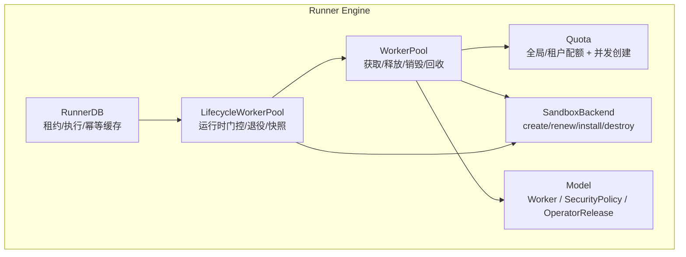
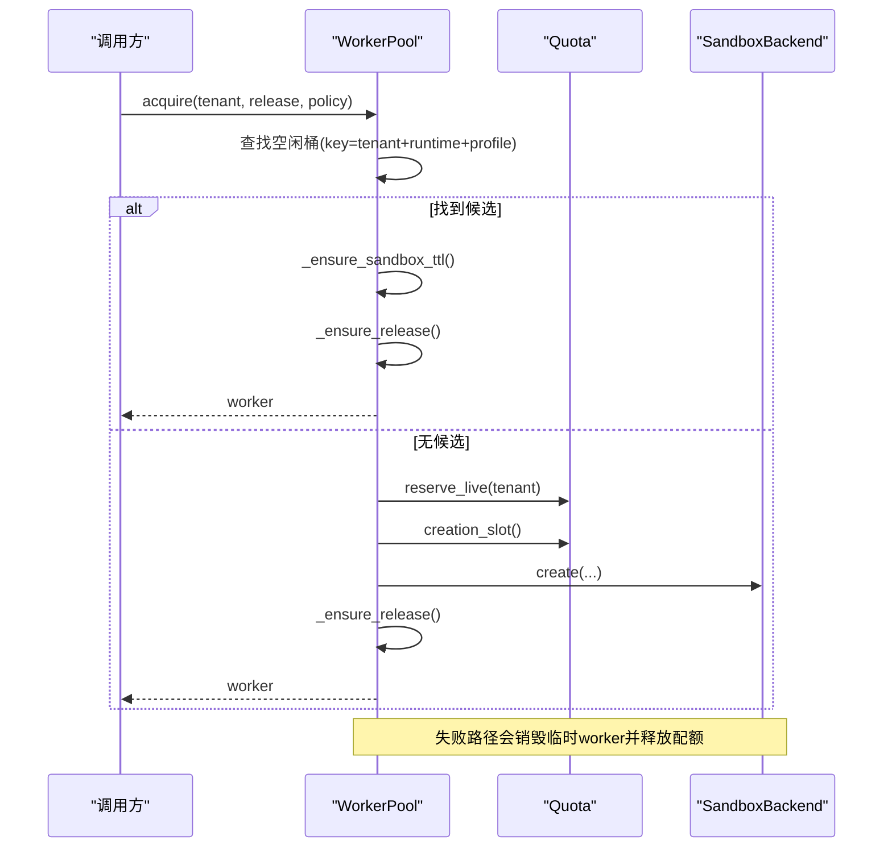
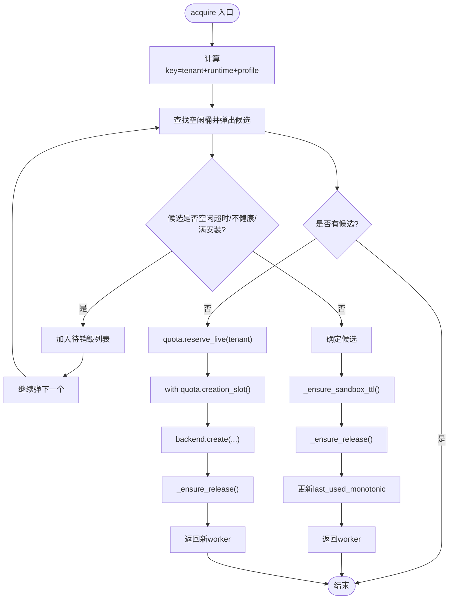
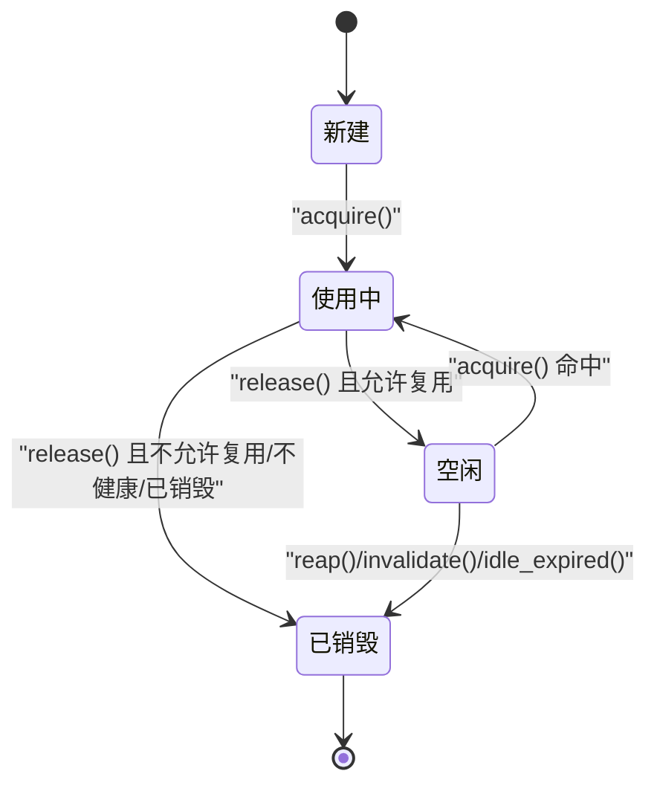
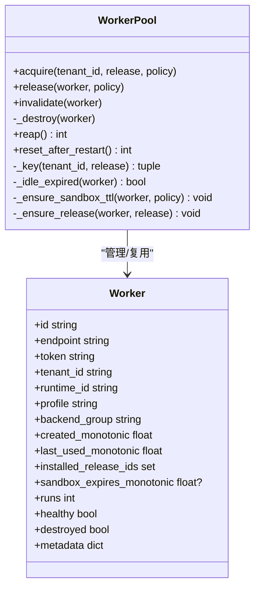
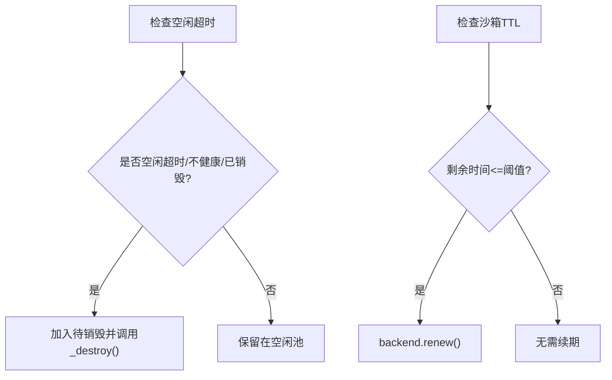
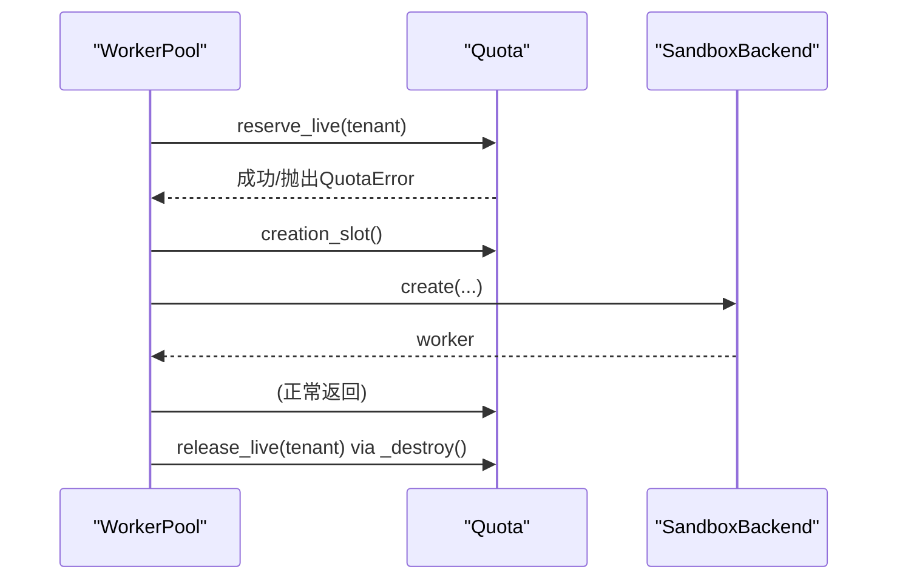
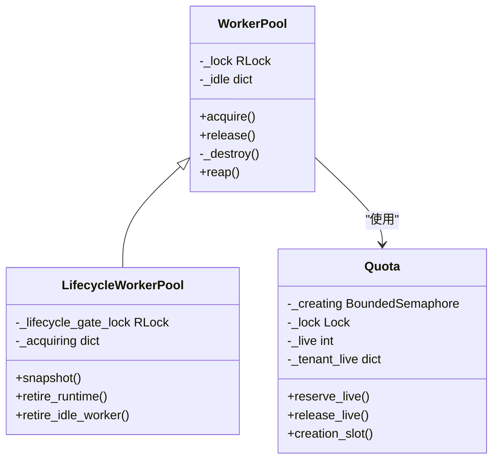
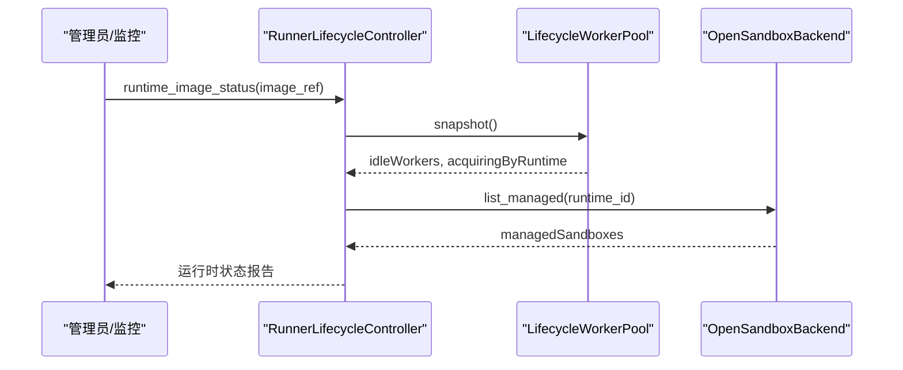
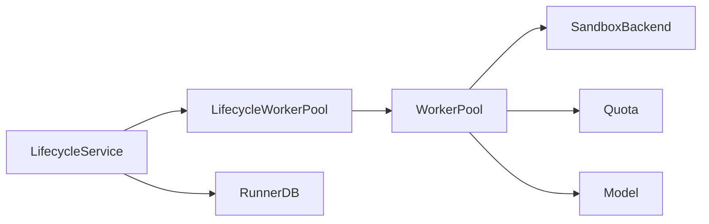

# 工作进程生命周期管理

<cite>
**本文引用的文件**   
- [pool.py](file://runner_engine/pool.py)
- [quota.py](file://runner_engine/quota.py)
- [model.py](file://runner_engine/model.py)
- [lifecycle_runtime.py](file://runner_engine/lifecycle_runtime.py)
- [sandbox/backend.py](file://runner_engine/sandbox/backend.py)
- [state.py](file://runner_engine/state.py)
- [test_pool_destroy_idempotent.py](file://tests/test_pool_destroy_idempotent.py)
</cite>

## 目录
1. [引言](#引言)
2. [项目结构](#项目结构)
3. [核心组件](#核心组件)
4. [架构总览](#架构总览)
5. [详细组件分析](#详细组件分析)
6. [依赖关系分析](#依赖关系分析)
7. [性能与并发特性](#性能与并发特性)
8. [故障排查指南](#故障排查指南)
9. [结论](#结论)

## 引言
本文面向工作进程生命周期管理系统，重点解释 WorkerPool 的核心工作机制：工作进程的获取、释放和销毁流程；工作进程的状态转换；基于租户、运行环境和安全策略的复用键值设计；空闲超时、孤儿检测与强制回收等清理策略；与配额系统的资源预留与释放集成；线程安全设计与并发访问控制；以及监控与调试方法。

## 项目结构
与工作进程生命周期直接相关的代码集中在 runner_engine 子包中：
- pool.py：工作进程池实现，负责空闲池、获取、释放、销毁、回收和重启恢复。
- quota.py：配额系统，限制全局与租户维度的活跃沙箱数量，并限制并发创建数。
- model.py：数据模型，包括 Worker、SecurityPolicy、OperatorRelease 等。
- lifecycle_runtime.py：扩展 WorkerPool，提供运行时生命周期门控、快照、退役和运维接口。
- sandbox/backend.py：沙箱后端协议，定义 create/renew/install/run/cancel/destroy/cleanup_managed。
- state.py：持久化执行状态、租约与幂等缓存，为上层服务提供一致性保障。
- tests/test_pool_destroy_idempotent.py：验证 destroy 幂等性与配额释放正确性。

**图表来源**
- [pool.py:11-187](file://runner_engine/pool.py#L11-L187)
- [quota.py:9-60](file://runner_engine/quota.py#L9-L60)
- [model.py:73-98](file://runner_engine/model.py#L73-L98)
- [lifecycle_runtime.py:14-120](file://runner_engine/lifecycle_runtime.py#L14-L120)
- [sandbox/backend.py:14-49](file://runner_engine/sandbox/backend.py#L14-L49)
- [state.py:131-178](file://runner_engine/state.py#L131-L178)

**章节来源**
- [pool.py:11-187](file://runner_engine/pool.py#L11-L187)
- [quota.py:9-60](file://runner_engine/quota.py#L9-L60)
- [model.py:73-98](file://runner_engine/model.py#L73-L98)
- [lifecycle_runtime.py:14-120](file://runner_engine/lifecycle_runtime.py#L14-L120)
- [sandbox/backend.py:14-49](file://runner_engine/sandbox/backend.py#L14-L49)
- [state.py:131-178](file://runner_engine/state.py#L131-L178)

## 核心组件
- WorkerPool：维护按“租户 + 运行环境 + 安全配置”分桶的空闲工作进程池，提供 acquire/release/invalidate/_destroy/reap/reset_after_restart 等方法。
- Quota：维护全局与租户维度的活跃沙箱计数，并提供并发创建信号量。
- Worker：表示一个工作进程对象，包含标识、端点、租户、运行环境、安全配置、安装发布集、过期时间、健康与销毁标记等。
- LifecycleWorkerPool：在 WorkerPool 之上增加运行时退役门控、按运行时维度统计正在获取的工作进程、退役空闲工作进程与运行时快照能力。
- SandboxBackend：抽象后端，封装真实沙箱的创建、续期、安装、运行、取消、销毁与托管清理。
- RunnerDB：持久化执行历史、租约与幂等缓存，保证跨进程一致性与可重放能力。

**章节来源**
- [pool.py:11-187](file://runner_engine/pool.py#L11-L187)
- [quota.py:9-60](file://runner_engine/quota.py#L9-L60)
- [model.py:73-98](file://runner_engine/model.py#L73-L98)
- [lifecycle_runtime.py:14-120](file://runner_engine/lifecycle_runtime.py#L14-L120)
- [sandbox/backend.py:14-49](file://runner_engine/sandbox/backend.py#L14-L49)
- [state.py:131-178](file://runner_engine/state.py#L131-L178)

## 架构总览
WorkerPool 是工作进程生命周期的核心协调者：
- 获取时优先从空闲池中按 key 匹配复用；若命中则更新最后使用时间、必要时续期沙箱 TTL 并确保所需发布已安装。
- 若无可用空闲工作进程，则先通过 Quota.reserve_live 预留配额，再使用 Quota.creation_slot 限制并发创建，调用后端 create 并安装发布。
- 释放时将工作进程放回空闲池或销毁，取决于健康状态与安全策略是否允许复用。
- 回收器定期扫描空闲池，销毁空闲超时、不健康或已销毁的工作进程。
- 重启后清空内存空闲池，并委托后端清理托管资源。

**图表来源**
- [pool.py:73-130](file://runner_engine/pool.py#L73-L130)
- [quota.py:36-44](file://runner_engine/quota.py#L36-L44)
- [sandbox/backend.py:15-23](file://runner_engine/sandbox/backend.py#L15-L23)

**章节来源**
- [pool.py:73-130](file://runner_engine/pool.py#L73-L130)
- [quota.py:36-44](file://runner_engine/quota.py#L36-L44)
- [sandbox/backend.py:15-23](file://runner_engine/sandbox/backend.py#L15-L23)

## 详细组件分析

### WorkerPool 工作机制
- 空闲池键值：由 tenant_id、release.runtime.id、release.profile 组成，确保不同租户、运行环境与隔离级别互不干扰。
- 获取流程：
  - 从对应桶弹出候选，跳过已销毁或不健康、或空闲超时的 worker。
  - 若候选未安装所需发布且已达最大安装上限，则丢弃该候选。
  - 命中候选后，检查并可能续期沙箱 TTL，确保所需发布已安装，更新 last_used_monotonic。
  - 若无候选，则预留配额并创建新 worker，完成后安装发布。
- 释放流程：
  - 更新 runs 与 last_used_monotonic。
  - 若 destroyed、不健康或策略不允许复用，则销毁；否则放回空闲池。
- 销毁流程：
  - 使用内部锁保证每个 worker 仅销毁一次，避免 cancel 与 invoke 竞态导致重复销毁。
  - 调用后端 destroy，并在 finally 中释放配额。
- 回收与重启恢复：
  - reap 遍历空闲桶，收集空闲超时 worker 并销毁。
  - reset_after_restart 清空内存空闲池，并调用后端 cleanup_managed 清理托管资源。

**图表来源**
- [pool.py:73-130](file://runner_engine/pool.py#L73-L130)
- [pool.py:51-71](file://runner_engine/pool.py#L51-L71)

**章节来源**
- [pool.py:73-130](file://runner_engine/pool.py#L73-L130)
- [pool.py:51-71](file://runner_engine/pool.py#L51-L71)

### 工作进程状态转换
Worker 对象上的关键状态字段：
- healthy：默认 True，被 invalidate 置 False。
- destroyed：默认 False，_destroy 中置 True，保证幂等。
- sandbox_expires_monotonic：可选，用于 TTL 续期判断。
- installed_release_ids：记录已安装的发布 ID 集合。
- last_used_monotonic：最近使用时间，用于空闲超时判定。
- runs：累计运行次数。

典型状态转换：
- 新建：healthy=True，destroyed=False，installed_release_ids 为空。
- 使用中：last_used_monotonic 更新，runs 递增。
- 空闲：放入空闲池，等待下次 acquire。
- 过期：空闲超过 idle_seconds 或 not healthy 或 destroyed，进入待销毁。
- 已销毁：destroyed=True，后端 destroy 完成，配额释放。

**图表来源**
- [model.py:73-89](file://runner_engine/model.py#L73-L89)
- [pool.py:132-159](file://runner_engine/pool.py#L132-L159)
- [pool.py:161-187](file://runner_engine/pool.py#L161-L187)

**章节来源**
- [model.py:73-89](file://runner_engine/model.py#L73-L89)
- [pool.py:132-159](file://runner_engine/pool.py#L132-L159)
- [pool.py:161-187](file://runner_engine/pool.py#L161-L187)

### 复用机制与键值管理
- 键值构成：tenant_id、release.runtime.id、release.profile。
- 目的：同一租户下相同运行环境与隔离级别的沙箱可被多个发布复用；不同租户之间隔离；不同 profile 之间隔离。
- 发布安装：按需 install，避免不必要的安装开销；当达到 max_installed_releases 上限时，不再复用已满的安装集合的 worker。

**图表来源**
- [pool.py:47-71](file://runner_engine/pool.py#L47-L71)
- [model.py:73-89](file://runner_engine/model.py#L73-L89)

**章节来源**
- [pool.py:47-71](file://runner_engine/pool.py#L47-L71)
- [model.py:73-89](file://runner_engine/model.py#L73-L89)

### 清理策略：空闲超时、孤儿检测与强制回收
- 空闲超时：_idle_expired 根据 last_used_monotonic 与 idle_seconds 判定；reap 周期性清理。
- 孤儿检测：_ensure_sandbox_ttl 根据 sandbox_expires_monotonic 与 renew_before_seconds 及策略最大超时决定续期；若接近过期则调用 backend.renew。
- 强制回收：invalidate 将 worker 标记不健康并销毁；retire_runtime 与 retire_idle_worker 主动移除空闲 worker 并销毁。

**图表来源**
- [pool.py:51-65](file://runner_engine/pool.py#L51-L65)
- [pool.py:161-187](file://runner_engine/pool.py#L161-L187)
- [lifecycle_runtime.py:83-120](file://runner_engine/lifecycle_runtime.py#L83-L120)

**章节来源**
- [pool.py:51-65](file://runner_engine/pool.py#L51-L65)
- [pool.py:161-187](file://runner_engine/pool.py#L161-L187)
- [lifecycle_runtime.py:83-120](file://runner_engine/lifecycle_runtime.py#L83-L120)

### 与配额系统的集成：资源预留与释放
- 预留：acquire 在无候选时调用 quota.reserve_live(tenant_id)，校验全局与租户上限，成功则增加 live 计数。
- 并发创建：使用 quota.creation_slot() 限制同时创建的数量，避免后端过载。
- 释放：_destroy 在 finally 中调用 quota.release_live(tenant_id)，确保即使后端销毁异常也能释放配额。
- 幂等保护：_destroy 内部以 destroyed 标记保证每个 worker 仅释放一次配额。

**图表来源**
- [pool.py:110-130](file://runner_engine/pool.py#L110-L130)
- [pool.py:148-159](file://runner_engine/pool.py#L148-L159)
- [quota.py:36-55](file://runner_engine/quota.py#L36-L55)

**章节来源**
- [pool.py:110-130](file://runner_engine/pool.py#L110-L130)
- [pool.py:148-159](file://runner_engine/pool.py#L148-L159)
- [quota.py:36-55](file://runner_engine/quota.py#L36-L55)

### 线程安全设计与并发访问控制
- WorkerPool 使用 RLock 保护空闲池读写与销毁逻辑，确保多线程并发下的数据结构一致性。
- Quota 使用 BoundedSemaphore 限制并发创建，并使用 Lock 保护全局与租户计数。
- LifecycleWorkerPool 额外使用 _lifecycle_gate_lock 保护运行时退役门控与 acquiring 计数，防止退役期间新增获取。

**图表来源**
- [pool.py:44-45](file://runner_engine/pool.py#L44-L45)
- [quota.py:21-26](file://runner_engine/quota.py#L21-L26)
- [lifecycle_runtime.py:22-24](file://runner_engine/lifecycle_runtime.py#L22-L24)

**章节来源**
- [pool.py:44-45](file://runner_engine/pool.py#L44-L45)
- [quota.py:21-26](file://runner_engine/quota.py#L21-L26)
- [lifecycle_runtime.py:22-24](file://runner_engine/lifecycle_runtime.py#L22-L24)

### 监控与调试方法
- 快照接口：LifecycleWorkerPool.snapshot 返回空闲工作进程列表、每运行时正在获取计数等，便于观察池状态。
- 运行时状态：RunnerLifecycleController.runtime_image_status 聚合运行时生命周期、活跃调用、空闲工作进程、托管沙箱等信息。
- 退役操作：begin_runtime_retirement 触发运行时退役，retire_runtime 销毁空闲工作进程；finalize_runtime_retirement 确认可安全删除制品。
- 单工作进程退役：retire_idle_worker 可按 worker_id 退役空闲工作进程。

**图表来源**
- [lifecycle_runtime.py:48-81](file://runner_engine/lifecycle_runtime.py#L48-L81)
- [lifecycle_runtime.py:239-300](file://runner_engine/lifecycle_runtime.py#L239-L300)
- [lifecycle_runtime.py:123-184](file://runner_engine/lifecycle_runtime.py#L123-L184)

**章节来源**
- [lifecycle_runtime.py:48-81](file://runner_engine/lifecycle_runtime.py#L48-L81)
- [lifecycle_runtime.py:239-300](file://runner_engine/lifecycle_runtime.py#L239-L300)
- [lifecycle_runtime.py:123-184](file://runner_engine/lifecycle_runtime.py#L123-L184)

## 依赖关系分析
- WorkerPool 依赖：
  - SandboxBackend：创建、续期、安装、销毁、托管清理。
  - Quota：预留与释放配额、并发创建限制。
  - Model：Worker、SecurityPolicy、OperatorRelease。
- LifecycleWorkerPool 继承 WorkerPool，增强运行时门控与运维能力。
- RunnerDB 与生命周期服务协作，确保租约与执行状态的一致性，间接影响工作进程的生命周期（例如退役期间的活跃调用统计）。

**图表来源**
- [pool.py:11-187](file://runner_engine/pool.py#L11-L187)
- [lifecycle_runtime.py:14-120](file://runner_engine/lifecycle_runtime.py#L14-L120)
- [state.py:131-178](file://runner_engine/state.py#L131-L178)

**章节来源**
- [pool.py:11-187](file://runner_engine/pool.py#L11-L187)
- [lifecycle_runtime.py:14-120](file://runner_engine/lifecycle_runtime.py#L14-L120)
- [state.py:131-178](file://runner_engine/state.py#L131-L178)

## 性能与并发特性
- 空闲池查找为 O(1) 哈希表访问，按桶弹出候选，整体获取复杂度低。
- 并发创建受 Quota.creation_slot 限制，避免后端过载。
- 全局与租户配额限制防止资源耗尽，提升系统稳定性。
- 回收器批量处理空闲超时 worker，减少频繁销毁开销。
- 重启后清理托管资源，避免僵尸沙箱占用资源。

[本节为通用性能讨论，不涉及具体文件分析]

## 故障排查指南
- 配额错误：
  - 全局配额达到上限或租户配额达到上限时，Quota.reserve_live 抛出 QuotaError，需检查 max_live 与 max_live_per_tenant 配置。
- 销毁幂等性：
  - 多次 invalidate 或并发销毁不会重复释放配额，测试用例验证了 destroy 幂等性与配额释放正确性。
- 运行时退役：
  - 退役期间禁止新的 acquire，若检测到运行时处于退役状态，会抛出 RUNTIME_RETIRING。
- 空闲超时与孤儿：
  - 若发现大量空闲超时或孤儿沙箱，检查 idle_seconds、orphan_ttl_seconds、renew_before_seconds 配置，以及后端 renew 实现。

**章节来源**
- [quota.py:36-44](file://runner_engine/quota.py#L36-L44)
- [test_pool_destroy_idempotent.py:19-39](file://tests/test_pool_destroy_idempotent.py#L19-L39)
- [lifecycle_runtime.py:26-36](file://runner_engine/lifecycle_runtime.py#L26-L36)
- [pool.py:51-65](file://runner_engine/pool.py#L51-L65)

## 结论
WorkerPool 通过健壮的键值复用、严格的配额管理与线程安全设计，实现了高效、稳定且可观测的工作进程生命周期管理。结合 LifecycleWorkerPool 的运行时门控与监控接口，系统能够在多租户、多运行环境、多安全策略场景下，提供可靠的沙箱复用、清理与退役能力。配合 RunnerDB 的持久化状态，系统在崩溃恢复与幂等执行方面具备更强的鲁棒性。