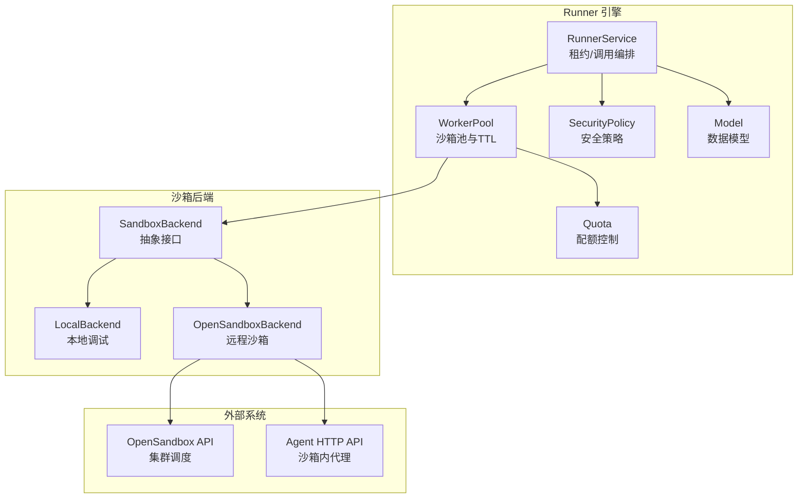
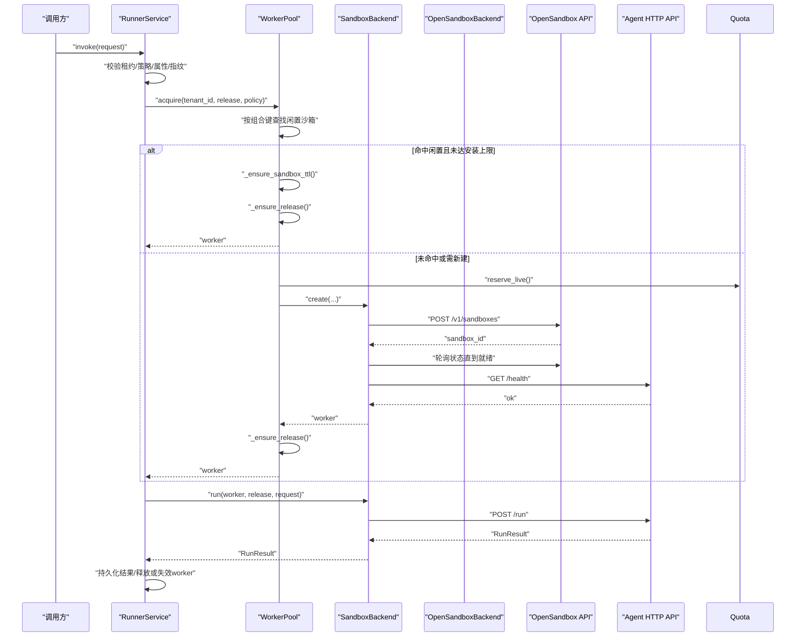
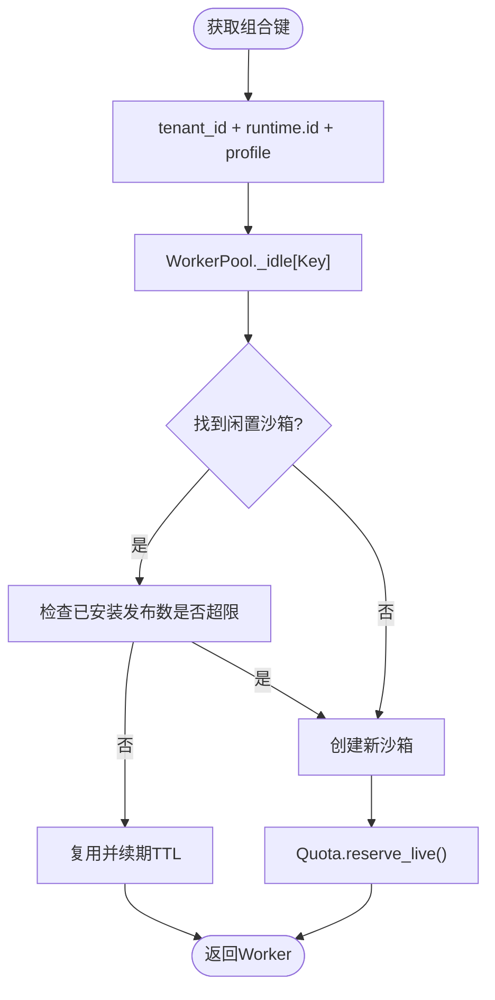
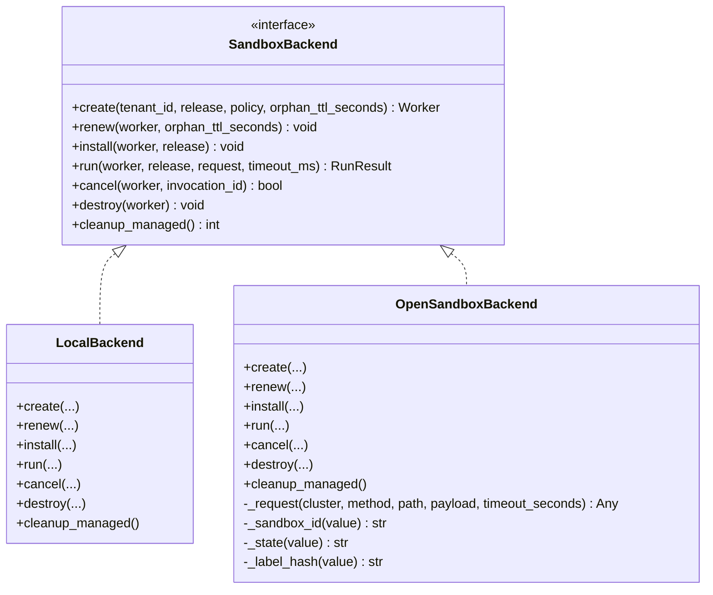
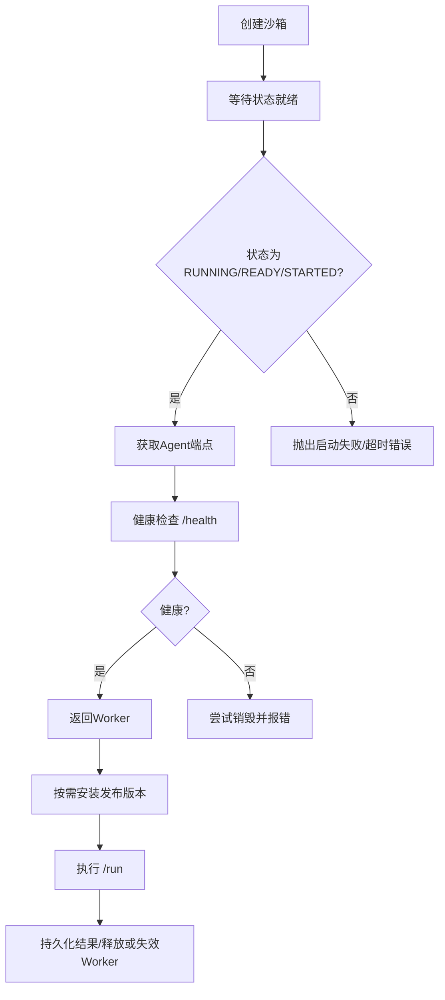
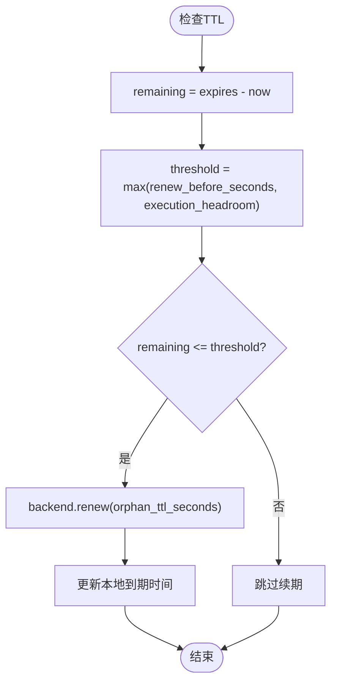
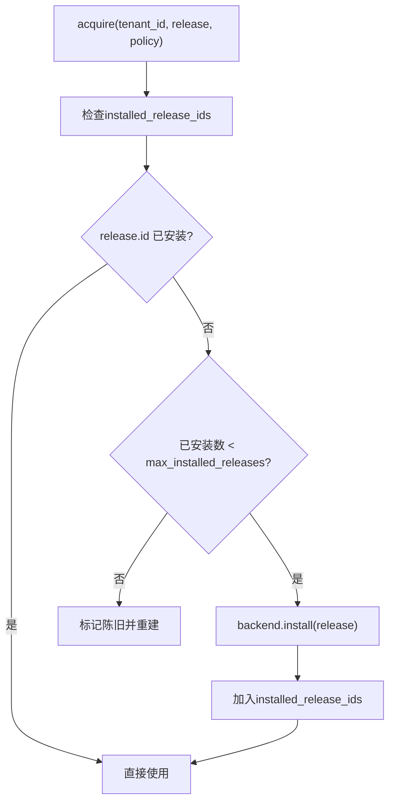
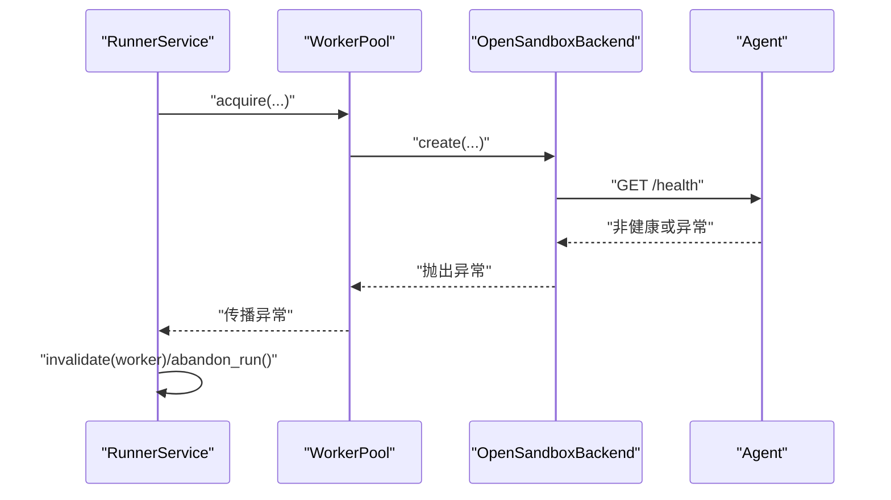
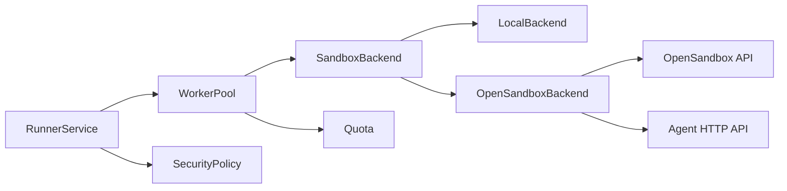

# 沙箱租户隔离

<cite>
**本文引用的文件**   
- [backend.py](file://runner_engine/sandbox/backend.py)
- [local.py](file://runner_engine/sandbox/local.py)
- [opensandbox.py](file://runner_engine/sandbox/opensandbox.py)
- [pool.py](file://runner_engine/pool.py)
- [lifecycle_runtime.py](file://runner_engine/lifecycle_runtime.py)
- [model.py](file://runner_engine/model.py)
- [service.py](file://runner_engine/service.py)
- [policy.py](file://runner_engine/policy.py)
- [quota.py](file://runner_engine/quota.py)
- [opensandbox.json](file://config/opensandbox.json)
- [acl.json](file://config/acl.json)
</cite>

## 目录
1. [引言](#引言)
2. [项目结构](#项目结构)
3. [核心组件](#核心组件)
4. [架构总览](#架构总览)
5. [详细组件分析](#详细组件分析)
6. [依赖关系分析](#依赖关系分析)
7. [性能与容量规划](#性能与容量规划)
8. [故障排查指南](#故障排查指南)
9. [结论](#结论)
10. [附录：配置与优化建议](#附录配置与优化建议)

## 引言
本文面向多租户环境下的沙箱租户隔离机制，系统性说明以下主题：
- 租户隔离原理：以“租户ID + 运行时版本 + 安全策略”的组合键进行沙箱池化与资源隔离。
- 沙箱生命周期：创建、安装算子发布版本、执行、续期、销毁及孤儿清理。
- TTL 管理：过期时间计算、自动续期、空闲回收与孤儿检测。
- 算子发布版本管理：版本安装、缓存与每沙箱最大安装数限制。
- 租户级资源隔离：内存、CPU、网络访问控制与配额。
- 健康检查与恢复：心跳探测、失败回滚、异常清理。
- 配置参数与优化建议：结合现有代码给出可操作的调优方向。

## 项目结构
与沙箱租户隔离直接相关的代码主要位于 runner_engine 模块中，按职责划分为：
- 沙箱后端抽象与实现：定义统一接口，提供本地调试后端与 OpenSandbox 生产后端。
- 工作进程池：基于组合键的闲置沙箱复用、TTL 续期、版本安装与回收。
- 服务编排：租约校验、请求指纹、调用路由、结果持久化与后台清理。
- 模型与策略：运行时、算子发布、安全策略、工作进程等数据模型。
- 配额控制：全局与租户维度的并发与数量上限。
- 生命周期扩展：运行时退役、受管沙箱清理与状态快照。

图表来源
- [service.py:80-115](file://runner_engine/service.py#L80-L115)
- [pool.py:11-46](file://runner_engine/pool.py#L11-L46)
- [backend.py:14-49](file://runner_engine/sandbox/backend.py#L14-L49)
- [local.py:14-62](file://runner_engine/sandbox/local.py#L14-L62)
- [opensandbox.py:31-50](file://runner_engine/sandbox/opensandbox.py#L31-L50)

章节来源
- [service.py:80-115](file://runner_engine/service.py#L80-L115)
- [pool.py:11-46](file://runner_engine/pool.py#L11-L46)
- [backend.py:14-49](file://runner_engine/sandbox/backend.py#L14-L49)

## 核心组件
本节聚焦租户隔离的关键数据结构与流程入口：
- Worker：代表一个沙箱实例，包含租户ID、运行时ID、profile、后端分组、健康状态、已安装发布集合、TTL 到期时间戳等。
- SecurityPolicy：定义 CPU、内存、最大超时、网络白名单、是否允许复用沙箱等安全与资源约束。
- OperatorRelease/RuntimeEnv：描述算子发布与运行时镜像，用于组合键生成与镜像选择。
- WorkerPool：按“租户ID + 运行时ID + profile”作为键维护闲置沙箱，负责 TTL 续期、版本安装、空闲回收与销毁。
- RunnerService：对外暴露调用入口，完成租约校验、属性过滤、请求指纹、调用派发与结果持久化。
- Quota：控制全局与租户维度的同时在线沙箱数量，以及创建并发度。

章节来源
- [model.py:14-98](file://runner_engine/model.py#L14-L98)
- [pool.py:11-46](file://runner_engine/pool.py#L11-L46)
- [service.py:80-115](file://runner_engine/service.py#L80-L115)
- [quota.py:9-27](file://runner_engine/quota.py#L9-L27)

## 架构总览
下图展示一次典型调用从服务层到沙箱后端的完整序列，体现租户隔离、策略校验、TTL 续期与版本安装的协作。

图表来源
- [service.py:188-331](file://runner_engine/service.py#L188-L331)
- [pool.py:73-130](file://runner_engine/pool.py#L73-L130)
- [opensandbox.py:141-290](file://runner_engine/sandbox/opensandbox.py#L141-L290)

## 详细组件分析

### 租户隔离与组合键
- 组合键构成：由租户ID、运行时ID、算子发布 profile 三者组成，确保同一租户下相同运行时与策略的沙箱可被复用。
- 隔离维度：
  - 逻辑隔离：通过组合键将不同租户、不同运行时或不同策略的沙箱隔离在独立桶中。
  - 资源隔离：通过 SecurityPolicy 指定 CPU、内存、网络白名单；OpenSandbox 后端将这些限制传递给底层沙箱。
  - 配额隔离：Quota 限制全局与租户维度的同时在线沙箱数量，防止单租户独占资源。

图表来源
- [pool.py:47-50](file://runner_engine/pool.py#L47-L50)
- [pool.py:67-71](file://runner_engine/pool.py#L67-L71)
- [pool.py:73-130](file://runner_engine/pool.py#L73-L130)
- [quota.py:36-44](file://runner_engine/quota.py#L36-L44)

章节来源
- [pool.py:47-50](file://runner_engine/pool.py#L47-L50)
- [model.py:14-35](file://runner_engine/model.py#L14-L35)
- [quota.py:36-44](file://runner_engine/quota.py#L36-L44)

### 沙箱后端抽象与实现
- SandboxBackend：定义 create、renew、install、run、cancel、destroy、cleanup_managed 的统一接口。
- LocalBackend：开发/测试用，不具安全隔离能力，直接在当前进程内启动 Agent，适合快速验证。
- OpenSandboxBackend：生产用，通过 OpenSandbox API 创建远程沙箱，注入环境变量、资源限制、元数据标签，等待就绪与健康检查。

图表来源
- [backend.py:14-49](file://runner_engine/sandbox/backend.py#L14-L49)
- [local.py:14-132](file://runner_engine/sandbox/local.py#L14-L132)
- [opensandbox.py:31-440](file://runner_engine/sandbox/opensandbox.py#L31-L440)

章节来源
- [backend.py:14-49](file://runner_engine/sandbox/backend.py#L14-L49)
- [local.py:14-132](file://runner_engine/sandbox/local.py#L14-L132)
- [opensandbox.py:31-440](file://runner_engine/sandbox/opensandbox.py#L31-L440)

### 沙箱生命周期管理
- 创建：
  - OpenSandboxBackend 调用 OpenSandbox API 创建沙箱，设置镜像、超时、资源限制、环境变量、入口命令与元数据标签（包括租户、运行时、profile）。
  - 轮询沙箱状态直至 RUNNING/READY/STARTED，随后获取 Agent 端点并进行健康检查。
  - 若健康检查失败，尝试销毁刚创建的沙箱并抛出错误。
- 安装算子发布版本：
  - WorkerPool 在 acquire 时检查 worker.installed_release_ids，若未安装则调用 backend.install 将发布包注入沙箱。
  - 每沙箱最多安装 max_installed_releases 个版本，超出则视为陈旧并触发重建。
- 执行：
  - RunnerService 校验租约、策略、属性与指纹后，通过 pool.backend.run 调用 Agent 的 /run 接口。
  - 输出内容大小与属性字段均有限制，超限时抛出错误。
- 销毁与清理：
  - WorkerPool.release 根据策略决定是否复用；否则调用 destroy。
  - cleanup_managed 遍历各集群，按 managed-by 与 runner-owner 标签筛选并删除受管沙箱。

图表来源
- [opensandbox.py:141-290](file://runner_engine/sandbox/opensandbox.py#L141-L290)
- [pool.py:67-71](file://runner_engine/pool.py#L67-L71)
- [service.py:293-331](file://runner_engine/service.py#L293-L331)

章节来源
- [opensandbox.py:141-290](file://runner_engine/sandbox/opensandbox.py#L141-L290)
- [pool.py:67-71](file://runner_engine/pool.py#L67-L71)
- [service.py:293-331](file://runner_engine/service.py#L293-L331)

### TTL 管理机制
- 过期时间计算：
  - Worker.sandbox_expires_monotonic 记录单调时钟下的到期时间。
  - OpenSandboxBackend.renew 通过 OpenSandbox API 更新 expiresAt，并刷新本地到期时间。
  - LocalBackend.renew 直接更新本地到期时间。
- 自动续期：
  - WorkerPool._ensure_sandbox_ttl 计算剩余时间与续期阈值，当 remaining <= renew_before_seconds 或小于执行头预留时间时触发续期。
  - renew_before_seconds 必须介于 0 与 orphan_ttl_seconds 之间，且大于 idle_seconds。
- 空闲回收与孤儿检测：
  - WorkerPool.reap 定期扫描闲置列表，超过 idle_seconds 的 Worker 标记为陈旧并销毁。
  - OpenSandboxBackend.cleanup_managed 与 LocalBackend.cleanup_managed 分别清理远端与本地的受管沙箱。
  - LifecycleOpenSandboxBackend.list_managed 支持按运行时过滤，便于运维观察。

图表来源
- [pool.py:56-65](file://runner_engine/pool.py#L56-L65)
- [opensandbox.py:304-322](file://runner_engine/sandbox/opensandbox.py#L304-L322)
- [local.py:64-66](file://runner_engine/sandbox/local.py#L64-L66)
- [pool.py:161-180](file://runner_engine/pool.py#L161-L180)
- [opensandbox.py:401-439](file://runner_engine/sandbox/opensandbox.py#L401-L439)

章节来源
- [pool.py:56-65](file://runner_engine/pool.py#L56-L65)
- [opensandbox.py:304-322](file://runner_engine/sandbox/opensandbox.py#L304-L322)
- [local.py:64-66](file://runner_engine/sandbox/local.py#L64-L66)
- [pool.py:161-180](file://runner_engine/pool.py#L161-L180)
- [opensandbox.py:401-439](file://runner_engine/sandbox/opensandbox.py#L401-L439)

### 算子发布版本管理
- 版本安装：
  - WorkerPool._ensure_release 检查 worker.installed_release_ids，若不存在则调用 backend.install 注入发布包。
  - OpenSandboxBackend.install 通过 Agent 的 /bootstrap 接口上传 artifact_b64 与 sha256。
  - LocalBackend.install 同样通过 AgentState.bootstrap 注入发布包。
- 缓存与限制：
  - installed_release_ids 作为缓存集合，避免重复安装。
  - max_installed_releases 限制每个沙箱的最大安装数，达到上限后该 Worker 被视为陈旧并重建。
- 生命周期关联：
  - LifecycleWorkerPool.retire_runtime 会移除对应运行时的闲置 Worker，确保退役期间不再复用旧镜像。

图表来源
- [pool.py:67-71](file://runner_engine/pool.py#L67-L71)
- [pool.py:85-90](file://runner_engine/pool.py#L85-L90)
- [opensandbox.py:324-337](file://runner_engine/sandbox/opensandbox.py#L324-L337)
- [local.py:67-76](file://runner_engine/sandbox/local.py#L67-L76)

章节来源
- [pool.py:67-71](file://runner_engine/pool.py#L67-L71)
- [pool.py:85-90](file://runner_engine/pool.py#L85-L90)
- [opensandbox.py:324-337](file://runner_engine/sandbox/opensandbox.py#L324-L337)
- [local.py:67-76](file://runner_engine/sandbox/local.py#L67-L76)

### 租户级资源隔离
- CPU 与内存：
  - SecurityPolicy.cpu 与 SecurityPolicy.memory 传入 OpenSandboxBackend.create 的 resourceLimits，由 OpenSandbox 平台实施容器级限制。
- 网络访问：
  - SecurityPolicy.network_allow 定义允许的网络目标，供上层策略或平台侧使用（当前代码中作为策略字段存在）。
- 配额限制：
  - Quota.max_creating 控制创建并发，max_live 控制全局在线沙箱上限，max_live_per_tenant 控制租户上限。
  - reserve_live 在创建前预占名额，release_live 在销毁或失败时释放。
- 超时与输出限制：
  - policy.max_timeout_ms 限制单次执行最大超时；RunnerService 对输入/输出内容与属性大小进行校验。

章节来源
- [model.py:26-35](file://runner_engine/model.py#L26-L35)
- [opensandbox.py:152-158](file://runner_engine/sandbox/opensandbox.py#L152-L158)
- [quota.py:9-27](file://runner_engine/quota.py#L9-L27)
- [quota.py:36-44](file://runner_engine/quota.py#L36-L44)
- [service.py:15-21](file://runner_engine/service.py#L15-L21)
- [service.py:188-235](file://runner_engine/service.py#L188-L235)

### 健康检查与故障恢复
- 健康检查：
  - OpenSandboxBackend 在创建后轮询 /health，成功才返回 Worker。
  - 健康检查失败时尝试销毁刚创建的沙箱并抛出错误。
- 故障恢复：
  - RunnerService.invoke 捕获异常后 invalidate worker，并在必要时 abandon_run 标记执行放弃。
  - WorkerPool.invalidate 将 worker 标记不健康并销毁，释放配额。
  - LifecycleWorkerPool.retire_runtime 主动退役指定运行时的闲置 Worker，避免继续使用即将退役的镜像。

图表来源
- [opensandbox.py:259-302](file://runner_engine/sandbox/opensandbox.py#L259-L302)
- [service.py:364-405](file://runner_engine/service.py#L364-L405)
- [pool.py:144-160](file://runner_engine/pool.py#L144-L160)

章节来源
- [opensandbox.py:259-302](file://runner_engine/sandbox/opensandbox.py#L259-L302)
- [service.py:364-405](file://runner_engine/service.py#L364-L405)
- [pool.py:144-160](file://runner_engine/pool.py#L144-L160)

## 依赖关系分析
- 组件耦合：
  - RunnerService 依赖 WorkerPool 与 SecurityPolicy，但不直接感知后端实现。
  - WorkerPool 依赖 SandboxBackend 抽象与 Quota，解耦具体后端。
  - OpenSandboxBackend 依赖 OpenSandbox API 与 Agent HTTP API。
- 潜在循环依赖：
  - 无直接循环导入；所有依赖均为单向。
- 外部集成点：
  - OpenSandbox API：集群调度、沙箱生命周期、端点发现。
  - Agent HTTP API：健康检查、引导安装、执行与取消。

图表来源
- [service.py:80-115](file://runner_engine/service.py#L80-L115)
- [pool.py:11-46](file://runner_engine/pool.py#L11-L46)
- [opensandbox.py:31-50](file://runner_engine/sandbox/opensandbox.py#L31-L50)

章节来源
- [service.py:80-115](file://runner_engine/service.py#L80-L115)
- [pool.py:11-46](file://runner_engine/pool.py#L11-L46)
- [opensandbox.py:31-50](file://runner_engine/sandbox/opensandbox.py#L31-L50)

## 性能与容量规划
- 池化与复用：
  - 合理设置 idle_seconds 与 orphan_ttl_seconds，使闲置沙箱在活跃期内尽量复用，减少创建开销。
  - renew_before_seconds 应覆盖最大执行超时与额外缓冲，避免执行中途过期。
- 版本缓存：
  - 提高 max_installed_releases 可减少重复安装，但会增加沙箱内存占用；需权衡。
- 配额与并发：
  - 根据业务峰值调整 max_creating、max_live、max_live_per_tenant，避免资源争抢与雪崩。
- 网络与IO：
  - OpenSandbox API 与 Agent 通信存在超时与重试，建议在高峰期增加重试预算与监控告警。

[本节为通用指导，不直接分析具体文件]

## 故障排查指南
- 沙箱启动失败：
  - 检查 OpenSandbox API 返回的状态码与错误详情，确认镜像可用与资源配额充足。
  - 关注 SANDBOX_START_FAILED/SANDBOX_START_TIMEOUT 错误。
- 健康检查失败：
  - 检查 Agent 端口可达性与 endpoint_headers 是否正确传递。
  - 关注 AGENT_START_TIMEOUT 错误。
- 版本安装失败：
  - 确认 artifact_path 可读且 sha256 匹配，/bootstrap 接口正常。
- 配额耗尽：
  - 检查 QuotaError 类型 GLOBAL_SANDBOX_QUOTA/TENANT_SANDBOX_QUOTA，调整配额或降低并发。
- 孤儿沙箱：
  - 使用 lifecycle_runtime 的 list_managed 与 cleanup_managed 清理受管沙箱。

章节来源
- [opensandbox.py:98-110](file://runner_engine/sandbox/opensandbox.py#L98-L110)
- [opensandbox.py:206-219](file://runner_engine/sandbox/opensandbox.py#L206-L219)
- [opensandbox.py:282-290](file://runner_engine/sandbox/opensandbox.py#L282-L290)
- [quota.py:36-44](file://runner_engine/quota.py#L36-L44)
- [lifecycle_runtime.py:123-184](file://runner_engine/lifecycle_runtime.py#L123-L184)

## 结论
本方案通过“租户ID + 运行时版本 + 安全策略”的组合键实现沙箱池化与租户隔离，结合 Quota 与 SecurityPolicy 实现资源与配额的双重保护。OpenSandboxBackend 提供生产级沙箱管理能力，配合 WorkerPool 的 TTL 续期与版本缓存，兼顾性能与安全。RunnerService 在调用链路中完成租约校验、属性过滤与结果持久化，保障一致性与可观测性。运维层面可通过生命周期管理与受管沙箱清理工具进行退役与清理操作。

[本节为总结性内容，不直接分析具体文件]

## 附录：配置与优化建议
- 安全策略配置：
  - 在 policies.json 中为每个 profile 配置 sandbox_cluster、cpu、memory、max_timeout_ms、network_allow、reuse_sandbox。
  - 示例路径参考：[policy.py:9-24](file://runner_engine/policy.py#L9-L24)。
- OpenSandbox 集群配置：
  - 在 opensandbox.json 中配置集群 url 与 api_key，例如 gvisor/kata。
  - 示例路径参考：[opensandbox.json:1-11](file://config/opensandbox.json#L1-L11)。
- ACL 身份映射：
  - 在 acl.json 中配置 identity -> tenant -> projects 的映射，用于上游鉴权。
  - 示例路径参考：[acl.json:1-9](file://config/acl.json#L1-L9)。
- 推荐调优参数：
  - idle_seconds：根据业务负载设置，避免频繁创建与销毁。
  - orphan_ttl_seconds：应显著大于 idle_seconds，留出续期与执行缓冲。
  - renew_before_seconds：至少覆盖 max_timeout_ms + 缓冲时间。
  - max_installed_releases：根据内存与版本复用需求平衡。
  - Quota.max_creating/max_live/max_live_per_tenant：依据峰值与租户公平性设定。

章节来源
- [policy.py:9-24](file://runner_engine/policy.py#L9-L24)
- [opensandbox.json:1-11](file://config/opensandbox.json#L1-L11)
- [acl.json:1-9](file://config/acl.json#L1-L9)