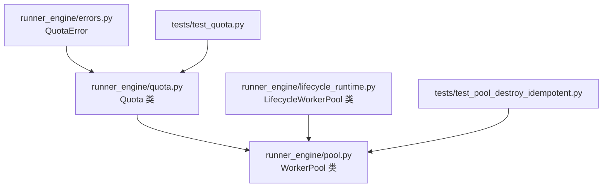
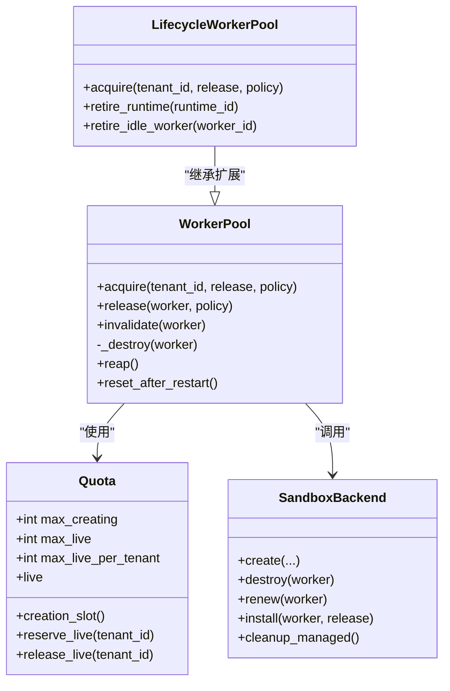
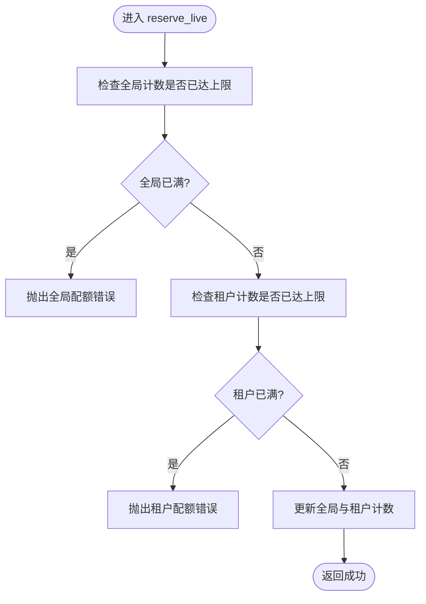
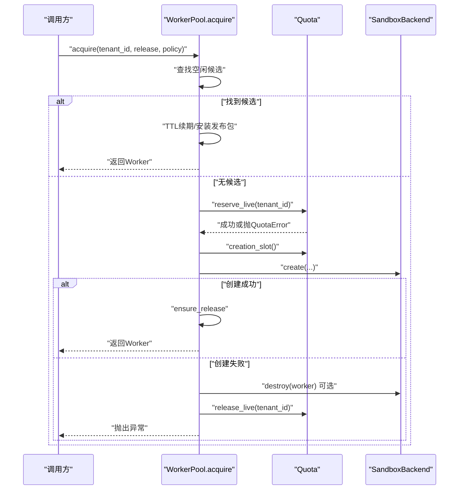
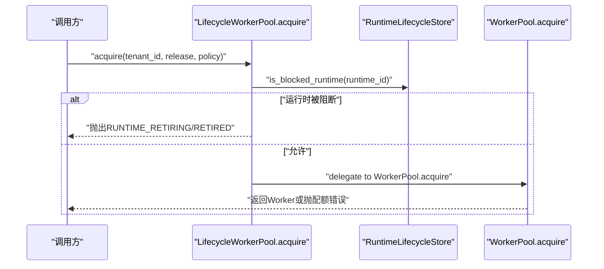
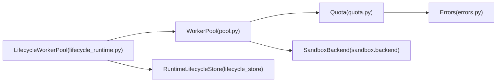

# 资源配额集成

<cite>
**本文引用的文件**   
- [quota.py](file://runner_engine/quota.py)
- [pool.py](file://runner_engine/pool.py)
- [lifecycle_runtime.py](file://runner_engine/lifecycle_runtime.py)
- [errors.py](file://runner_engine/errors.py)
- [test_quota.py](file://tests/test_quota.py)
- [test_pool_destroy_idempotent.py](file://tests/test_pool_destroy_idempotent.py)
</cite>

## 目录
1. [引言](#引言)
2. [项目结构](#项目结构)
3. [核心组件](#核心组件)
4. [架构总览](#架构总览)
5. [详细组件分析](#详细组件分析)
6. [依赖关系分析](#依赖关系分析)
7. [性能与并发特性](#性能与并发特性)
8. [监控、告警与可观测性](#监控告警与可观测性)
9. [故障排查指南](#故障排查指南)
10. [结论](#结论)
11. [附录：调优建议](#附录调优建议)

## 引言
本文面向工作进程池与资源配额系统的集成机制，重点解释以下问题：
- 配额系统在进程池中的作用：全局并发创建限制、实际存活沙箱上限、租户级隔离。
- 实时配额检查与槽位管理：acquire 时预留、creation_slot 控制并发创建、release/destroy 释放。
- 并发一致性保证：锁与原子操作如何避免超卖和重复释放。
- 超限处理策略：拒绝新进程创建、错误码与重试语义、优雅降级路径。
- 租户隔离：独立计数器与限制策略。
- 监控指标与告警：基于现有状态的可观测点。
- 调优建议：参数选择与容量规划。

## 项目结构
本主题涉及的核心代码位于 runner_engine 子模块中，关键文件如下：
- quota.py：配额抽象与实现，包含全局与租户级计数、创建并发控制。
- pool.py：工作进程池 WorkerPool，负责空闲复用、创建、销毁、回收以及与 Quota 的协作。
- lifecycle_runtime.py：生命周期扩展 LifecycleWorkerPool，在 acquire 前增加运行时退役门控。
- errors.py：统一错误类型，包括 QuotaError。
- tests/test_quota.py、tests/test_pool_destroy_idempotent.py：配额与销毁幂等性的单元测试。

**图表来源**
- [quota.py:9-61](file://runner_engine/quota.py#L9-L61)
- [pool.py:11-188](file://runner_engine/pool.py#L11-L188)
- [lifecycle_runtime.py:14-120](file://runner_engine/lifecycle_runtime.py#L14-L120)
- [errors.py:16-17](file://runner_engine/errors.py#L16-L17)
- [test_quota.py:6-15](file://tests/test_quota.py#L6-L15)
- [test_pool_destroy_idempotent.py:19-39](file://tests/test_pool_destroy_idempotent.py#L19-L39)

**章节来源**
- [quota.py:9-61](file://runner_engine/quota.py#L9-L61)
- [pool.py:11-188](file://runner_engine/pool.py#L11-L188)
- [lifecycle_runtime.py:14-120](file://runner_engine/lifecycle_runtime.py#L14-L120)
- [errors.py:16-17](file://runner_engine/errors.py#L16-L17)
- [test_quota.py:6-15](file://tests/test_quota.py#L6-L15)
- [test_pool_destroy_idempotent.py:19-39](file://tests/test_pool_destroy_idempotent.py#L19-L39)

## 核心组件
- Quota：维护三类约束
  - max_creating：同时处于“创建中”的最大并发数（通过有界信号量实现）。
  - max_live：全局最大存活沙箱数。
  - max_live_per_tenant：单租户最大存活沙箱数。
  - 内部使用线程锁保护 _live 与 _tenant_live 的一致性。
- WorkerPool：工作进程池
  - 按 tenant + runtime + profile 维度组织空闲 Worker。
  - acquire 流程：优先复用空闲 Worker；若无可用，则先 reserve_live，再进入 creation_slot 调用后端 create；失败时回滚 release_live。
  - release 流程：根据策略决定是否放回空闲池或销毁。
  - _destroy 流程：确保 destroy 与 quota.release_live 恰好一次执行，防止重复释放。
- LifecycleWorkerPool：在 WorkerPool.acquire 基础上增加运行时退役门控，阻止对即将退役或已退役运行时的新分配。

**章节来源**
- [quota.py:9-61](file://runner_engine/quota.py#L9-L61)
- [pool.py:11-188](file://runner_engine/pool.py#L11-L188)
- [lifecycle_runtime.py:14-120](file://runner_engine/lifecycle_runtime.py#L14-L120)

## 架构总览
下图展示 Quota 与 WorkerPool 的交互关系，以及 LifecycleWorkerPool 的扩展点。

**图表来源**
- [quota.py:9-61](file://runner_engine/quota.py#L9-L61)
- [pool.py:11-188](file://runner_engine/pool.py#L11-L188)
- [lifecycle_runtime.py:14-120](file://runner_engine/lifecycle_runtime.py#L14-L120)

## 详细组件分析

### 配额系统 Quota
- 设计要点
  - 使用 threading.BoundedSemaphore(max_creating) 控制并发创建数量，避免后端过载。
  - 使用 threading.Lock 保护 _live 与 _tenant_live 的读写，保证全局与租户级计数一致。
  - reserve_live 进行双重检查：全局上限与租户上限，任一不满足即抛出 QuotaError。
  - release_live 安全递减租户计数，并在归零时清理字典条目。
  - live 属性提供当前全局活跃计数，便于监控。

- 复杂度
  - reserve_live/release_live：O(1)。
  - creation_slot：O(1) 信号量获取/释放。
  - live：O(1)。

- 错误处理
  - 当达到全局或租户配额上限时，抛出带 retryable=True 的 QuotaError，上层可进行退避重试。

**图表来源**
- [quota.py:36-55](file://runner_engine/quota.py#L36-L55)

**章节来源**
- [quota.py:9-61](file://runner_engine/quota.py#L9-L61)
- [errors.py:16-17](file://runner_engine/errors.py#L16-L17)

### 工作进程池 WorkerPool 与配额集成
- acquire 流程
  - 优先从空闲桶中查找候选 Worker，并校验健康度、过期时间、已安装发布包数量。
  - 若找到候选：
    - 必要时续期沙箱 TTL。
    - 确保所需发布包已安装。
    - 更新 last_used_monotonic 并直接返回。
  - 若无候选：
    - 先调用 quota.reserve_live(tenant_id)，若失败则直接抛错，不会占用创建槽位。
    - 进入 quota.creation_slot() 以限制并发创建。
    - 调用 backend.create(...) 创建新 Worker。
    - 成功后确保发布包安装完成并返回。
    - 若创建异常：
      - 若 worker 已部分创建，尝试 backend.destroy(worker) 清理。
      - 必须调用 quota.release_live(tenant_id) 回滚预留。
      - 向上抛出异常。

- release 流程
  - 更新 runs 与 last_used_monotonic。
  - 若 Worker 已销毁、不健康或策略不允许复用，则走 _destroy 路径。
  - 否则放入空闲桶，键为 (tenant_id, runtime_id, profile)。

- _destroy 流程（幂等）
  - 使用 RLock 标记 destroyed 标志，确保同一 Worker 对象只销毁一次。
  - 调用 backend.destroy(worker)。
  - finally 中调用 quota.release_live(worker.tenant_id)，确保配额释放与销毁严格对应。

**图表来源**
- [pool.py:73-130](file://runner_engine/pool.py#L73-L130)
- [quota.py:28-44](file://runner_engine/quota.py#L28-L44)

**章节来源**
- [pool.py:73-160](file://runner_engine/pool.py#L73-L160)
- [quota.py:28-55](file://runner_engine/quota.py#L28-L55)

### 生命周期扩展 LifecycleWorkerPool
- 在 acquire 前检查运行时是否处于 RETIRING/RETIRED 状态，若是则抛出 RunnerError（RETIRING 为可重试）。
- 维护每个运行时的 acquiring 计数，用于观察正在创建的实例数。
- retire_runtime/retire_idle_worker：主动驱逐空闲 Worker，触发 _destroy 以释放配额。

**图表来源**
- [lifecycle_runtime.py:26-40](file://runner_engine/lifecycle_runtime.py#L26-L40)
- [pool.py:73-130](file://runner_engine/pool.py#L73-L130)

**章节来源**
- [lifecycle_runtime.py:14-120](file://runner_engine/lifecycle_runtime.py#L14-L120)
- [pool.py:73-130](file://runner_engine/pool.py#L73-L130)

### 错误模型与超限处理
- QuotaError：表示配额超限，支持 retryable 字段，供上层做退避重试。
- 超限场景
  - 全局配额满：reserve_live 抛出全局配额错误。
  - 租户配额满：reserve_live 抛出租户配额错误。
  - 创建并发满：creation_slot 阻塞直到有空闲槽位。
- 优雅降级
  - 对于 RUNTIME_RETIRING，上层可重试；RUNTIME_RETIRED 不可重试。
  - 配额错误可结合指数退避与限流策略，避免雪崩。

**章节来源**
- [errors.py:16-17](file://runner_engine/errors.py#L16-L17)
- [lifecycle_runtime.py:26-40](file://runner_engine/lifecycle_runtime.py#L26-L40)

## 依赖关系分析
- WorkerPool 依赖 Quota 与 SandboxBackend。
- LifecycleWorkerPool 继承 WorkerPool，并依赖 RuntimeLifecycleStore。
- Quota 依赖 threading 原语与自定义 QuotaError。

**图表来源**
- [quota.py:9-61](file://runner_engine/quota.py#L9-L61)
- [pool.py:11-188](file://runner_engine/pool.py#L11-L188)
- [lifecycle_runtime.py:14-120](file://runner_engine/lifecycle_runtime.py#L14-L120)
- [errors.py:16-17](file://runner_engine/errors.py#L16-L17)

**章节来源**
- [quota.py:9-61](file://runner_engine/quota.py#L9-L61)
- [pool.py:11-188](file://runner_engine/pool.py#L11-L188)
- [lifecycle_runtime.py:14-120](file://runner_engine/lifecycle_runtime.py#L14-L120)
- [errors.py:16-17](file://runner_engine/errors.py#L16-L17)

## 性能与并发特性
- 并发创建限制
  - 通过 BoundedSemaphore(max_creating) 限制并发创建，避免后端资源耗尽。
- 全局与租户级计数
  - 使用 Lock 保护 _live 与 _tenant_live，保证原子性与一致性。
- 空闲复用
  - 优先复用空闲 Worker，减少创建开销；按 tenant/runtime/profile 分桶。
- 回收与清理
  - reap 定期清理过期空闲 Worker，触发 _destroy 释放配额。
- 幂等销毁
  - _destroy 使用 destroyed 标志与 RLock，确保 destroy 与 quota.release_live 仅执行一次，避免重复释放导致配额不一致。

**章节来源**
- [pool.py:51-71](file://runner_engine/pool.py#L51-L71)
- [pool.py:148-160](file://runner_engine/pool.py#L148-L160)
- [pool.py:161-188](file://runner_engine/pool.py#L161-L188)
- [quota.py:21-26](file://runner_engine/quota.py#L21-L26)

## 监控、告警与可观测性
- 可直接暴露的指标
  - 全局活跃沙箱数：Quota.live。
  - 各租户活跃沙箱数：Quota._tenant_live（内部字典，可通过扩展接口暴露）。
  - 创建并发占用：BoundedSemaphore.max_value - BoundedSemaphore._value（需通过扩展或包装暴露）。
  - 空闲池大小：WorkerPool._idle 各桶长度之和。
  - 运行时创建中计数：LifecycleWorkerPool._acquiring[runtime_id]。
- 告警建议
  - 全局配额接近上限：当 live 接近 max_live 时告警。
  - 租户配额接近上限：当某租户计数接近 max_live_per_tenant 时告警。
  - 创建并发饱和：当创建槽位全部占用且队列积压时告警。
  - 运行时退役：当 RUNTIME_RETIRING 出现频繁重试时告警。

[本节为概念性说明，未直接分析具体文件，故不附“章节来源”]

## 故障排查指南
- 现象：创建请求被拒绝，抛出 QuotaError
  - 可能原因：全局配额满或租户配额满。
  - 排查步骤：
    - 检查 Quota.live 与各租户计数。
    - 确认是否存在长时间未释放的 Worker。
    - 查看是否有异常路径未调用 release_live。
  - 参考测试用例：
    - [test_quota.py:6-15](file://tests/test_quota.py#L6-L15)

- 现象：多次 invalidate 后配额未重复释放
  - 预期行为：_destroy 幂等，quota.release_live 仅执行一次。
  - 验证方法：
    - 调用 pool.invalidate(worker) 多次，确认 backend.destroy_count 为 1，且 quota.live 正确归零。
  - 参考测试用例：
    - [test_pool_destroy_idempotent.py:19-39](file://tests/test_pool_destroy_idempotent.py#L19-L39)

- 现象：运行时退役期间仍有新请求
  - 可能原因：服务层未检查生命周期状态。
  - 解决方式：
    - 使用 LifecycleRunnerService 或 LifecycleWorkerPool，确保 acquire 前检查运行时状态。
  - 参考实现：
    - [lifecycle_runtime.py:26-40](file://runner_engine/lifecycle_runtime.py#L26-L40)

**章节来源**
- [test_quota.py:6-15](file://tests/test_quota.py#L6-L15)
- [test_pool_destroy_idempotent.py:19-39](file://tests/test_pool_destroy_idempotent.py#L19-L39)
- [lifecycle_runtime.py:26-40](file://runner_engine/lifecycle_runtime.py#L26-L40)

## 结论
该集成方案通过 Quota 与 WorkerPool 的紧密协作，实现了：
- 全局与租户级的配额控制，避免资源超卖。
- 创建并发限制，保护后端稳定性。
- 精确的预留与释放时机，确保一致性。
- 幂等销毁，防止重复释放导致的配额漂移。
- 生命周期门控，配合运行时退役策略进行优雅降级。

在生产环境中，建议结合监控指标与告警规则，持续优化参数配置，保障高吞吐与低延迟的同时维持系统稳定。

[本节为总结性内容，未直接分析具体文件，故不附“章节来源”]

## 附录：调优建议
- 参数选择
  - max_creating：根据后端创建能力与资源上限设置，避免压垮后端。
  - max_live：根据节点内存/CPU/网络带宽估算最大并发沙箱数。
  - max_live_per_tenant：根据租户 SLA 与公平性策略设定，防止单租户独占。
  - idle_seconds：合理设置空闲超时，平衡复用收益与资源占用。
  - orphan_ttl_seconds：大于 idle_seconds，确保孤儿沙箱最终清理。
  - renew_before_seconds：结合执行超时与安全头预留，提前续期以降低中断风险。
  - max_installed_releases：控制单个 Worker 上缓存的发布包数量，避免内存膨胀。
- 容量规划
  - 预估峰值 QPS 与平均执行时长，计算所需 max_live。
  - 针对热点租户设置更严格的 per-tenant 限额，避免“邻居干扰”。
- 监控与告警
  - 暴露 live、_tenant_live、空闲池大小、创建并发占用、acquiringByRuntime。
  - 对接近上限的阈值设置预警，提前扩容或限流。
- 降级策略
  - 对 RUNTIME_RETIRING 启用指数退避重试。
  - 对配额错误进行快速失败与队列背压，避免级联失败。

[本节为通用指导，未直接分析具体文件，故不附“章节来源”]