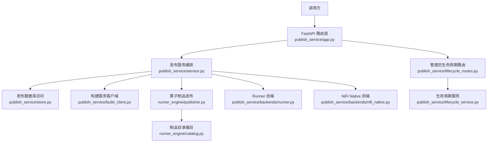
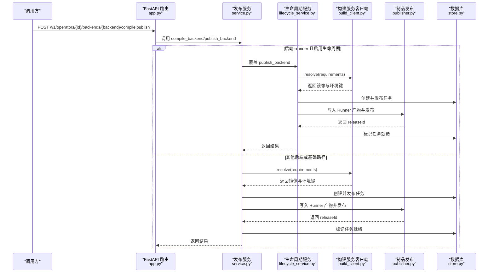
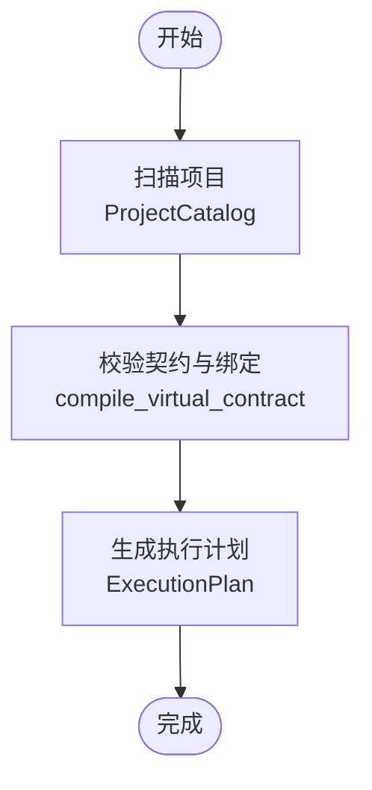
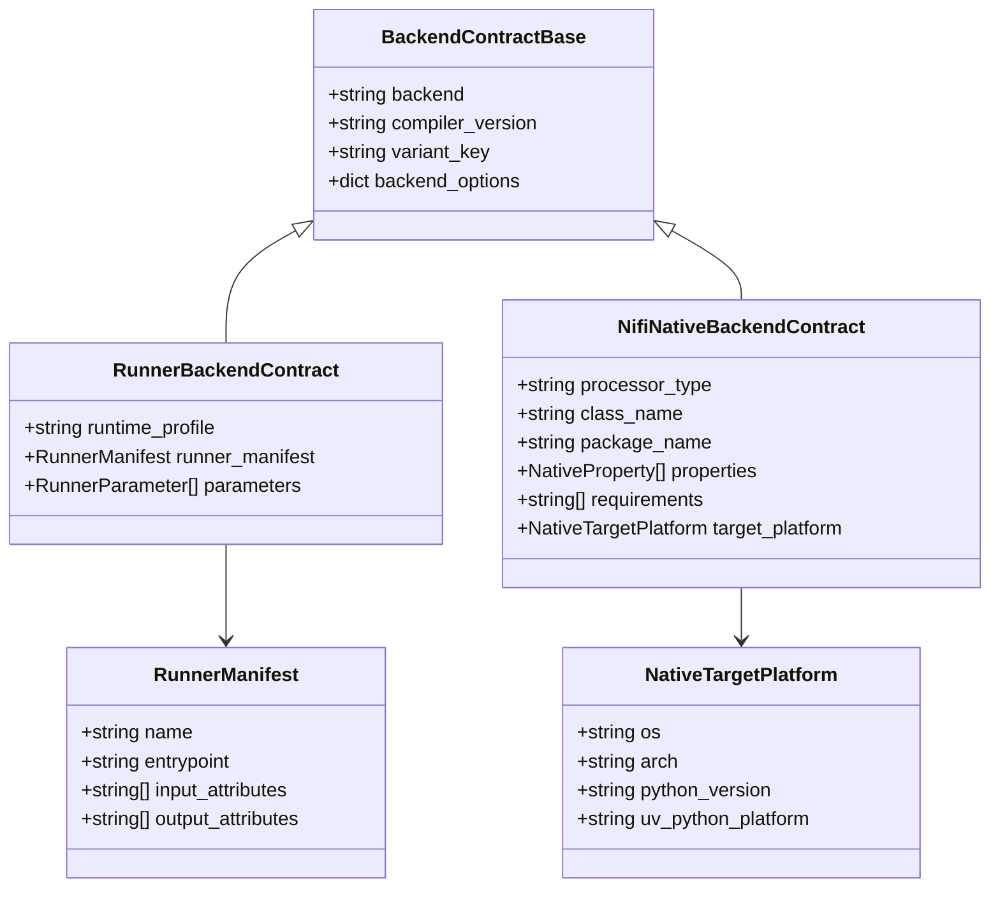
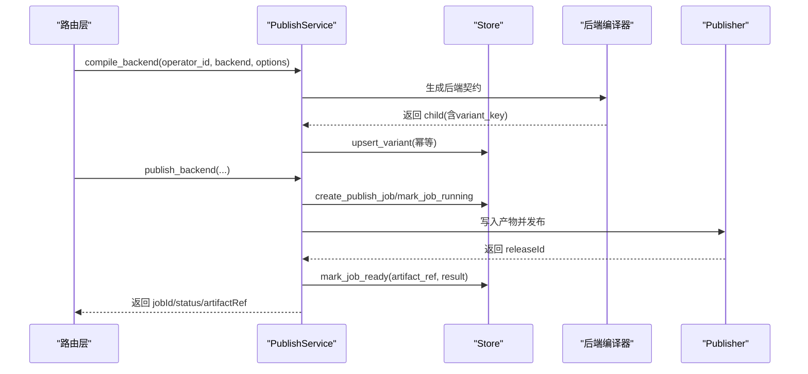
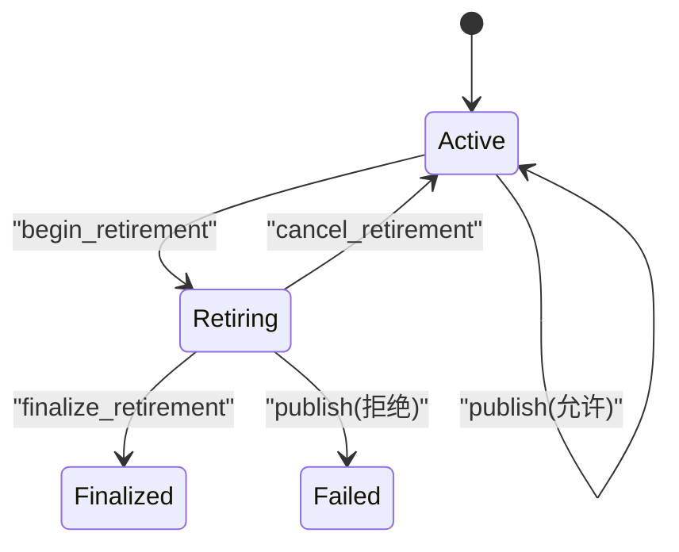
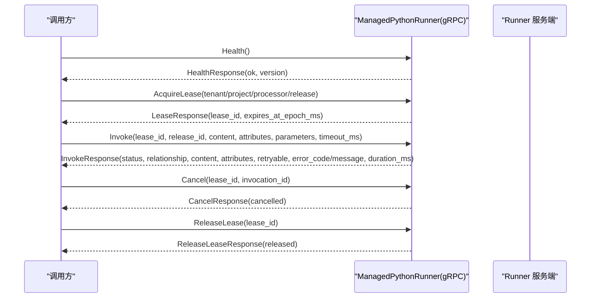
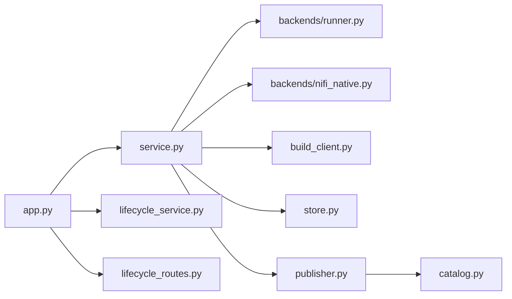

# 服务协调器

<cite>
**本文引用的文件**   
- [publish_service/app.py](file://publish_service/app.py)
- [publish_service/service.py](file://publish_service/service.py)
- [publish_service/lifecycle_service.py](file://publish_service/lifecycle_service.py)
- [publish_service/lifecycle_routes.py](file://publish_service/lifecycle_routes.py)
- [publish_service/backends/base.py](file://publish_service/backends/base.py)
- [publish_service/backends/runner.py](file://publish_service/backends/runner.py)
- [publish_service/backends/nifi_native.py](file://publish_service/backends/nifi_native.py)
- [publish_service/backends/models.py](file://publish_service/backends/models.py)
- [publish_service/build_client.py](file://publish_service/build_client.py)
- [publish_service/store.py](file://publish_service/store.py)
- [proto/runner.proto](file://proto/runner.proto)
- [operator_authoring/compiler.py](file://operator_authoring/compiler.py)
- [operator_authoring/model.py](file://operator_authoring/model.py)
- [runner_engine/publisher.py](file://runner_engine/publisher.py)
- [runner_engine/catalog.py](file://runner_engine/catalog.py)
</cite>

## 目录
1. [简介](#简介)
2. [项目结构](#项目结构)
3. [核心组件](#核心组件)
4. [架构总览](#架构总览)
5. [详细组件分析](#详细组件分析)
6. [依赖关系分析](#依赖关系分析)
7. [性能与可扩展性](#性能与可扩展性)
8. [故障排查指南](#故障排查指南)
9. [结论](#结论)
10. [附录：扩展点与插件开发指南](#附录扩展点与插件开发指南)

## 简介
本文档面向 Runner Engine 的“发布服务”（Publish Service）及其服务协调器，系统性说明以下能力：
- 算子编译、契约校验与版本管理
- 多后端支持（Runner 与 NiFi Native）的统一接口设计
- 服务间通信协议（HTTP REST、gRPC）、错误处理与超时管理
- 配置管理服务（环境变量驱动、动态生命周期控制）
- 监控与日志（健康检查、操作审计、构建与发布状态）
- 服务发现与健康检查（内置 /health 与 gRPC Health）
- 负载均衡与服务降级策略建议
- 扩展点与插件开发指南

本服务以 FastAPI 为 Web 框架，通过 PublishService 编排算子从源码到可发布制品的全流程；同时提供 LifecyclePublishService 对 Runner 运行时退役的生命周期进行管控。

## 项目结构
- publish_service：发布服务的 HTTP API、业务编排、后端适配、存储与构建客户端
- operator_authoring：算子源码扫描、虚拟契约模型与编译器
- runner_engine：算子制品打包、目录编目与发布元数据持久化
- proto：Runner gRPC 接口定义
- nifi：NiFi Java 侧处理器（不在本文重点）

**图示来源**
- [publish_service/app.py:135-347](file://publish_service/app.py#L135-L347)
- [publish_service/service.py:71-110](file://publish_service/service.py#L71-L110)
- [publish_service/store.py:17-37](file://publish_service/store.py#L17-L37)
- [publish_service/build_client.py:13-31](file://publish_service/build_client.py#L13-L31)
- [runner_engine/publisher.py:82-160](file://runner_engine/publisher.py#L82-L160)
- [runner_engine/catalog.py:11-40](file://runner_engine/catalog.py#L11-L40)
- [publish_service/backends/runner.py:23-67](file://publish_service/backends/runner.py#L23-L67)
- [publish_service/backends/nifi_native.py:103-168](file://publish_service/backends/nifi_native.py#L103-L168)
- [publish_service/lifecycle_routes.py:36-86](file://publish_service/lifecycle_routes.py#L36-L86)
- [publish_service/lifecycle_service.py:16-19](file://publish_service/lifecycle_service.py#L16-L19)

**章节来源**
- [publish_service/app.py:135-347](file://publish_service/app.py#L135-L347)
- [publish_service/service.py:71-110](file://publish_service/service.py#L71-L110)

## 核心组件
- FastAPI 应用与路由：暴露健康检查、算子分析、虚拟契约创建、后端编译与发布、MinIO 下载等接口
- PublishService：统一编排算子分析、虚拟契约编译、后端变体生成、发布任务与结果落库
- LifecyclePublishService：在 Runner 发布路径中增加运行时退役守卫与事务一致性保障
- 后端适配器：Runner 与 NiFi Native 两种后端的契约编译与产物生成
- 构建服务客户端：与外部构建服务交互，解析运行环境镜像
- 发布存储：PostgreSQL 上的算子、契约、变体、发布任务与 Edge Bundle 元数据
- 制品编目：将算子源码与运行镜像绑定为不可变制品并落盘

**章节来源**
- [publish_service/app.py:135-347](file://publish_service/app.py#L135-L347)
- [publish_service/service.py:71-110](file://publish_service/service.py#L71-L110)
- [publish_service/lifecycle_service.py:16-19](file://publish_service/lifecycle_service.py#L16-L19)
- [publish_service/backends/runner.py:23-67](file://publish_service/backends/runner.py#L23-L67)
- [publish_service/backends/nifi_native.py:103-168](file://publish_service/backends/nifi_native.py#L103-L168)
- [publish_service/build_client.py:13-31](file://publish_service/build_client.py#L13-L31)
- [publish_service/store.py:17-37](file://publish_service/store.py#L17-L37)
- [runner_engine/publisher.py:82-160](file://runner_engine/publisher.py#L82-L160)
- [runner_engine/catalog.py:11-40](file://runner_engine/catalog.py#L11-L40)

## 架构总览
发布服务采用分层架构：
- 接入层：FastAPI 路由负责参数校验、异常映射与鉴权（管理员接口）
- 编排层：PublishService/LifecyclePublishService 串联源码快照、虚拟契约编译、后端适配、构建服务、制品发布与存储
- 适配层：Runner/NiFi Native 后端根据执行计划生成各自契约与产物
- 基础设施层：PostgreSQL 存储、本地文件系统目录编目、外部构建服务

**图示来源**
- [publish_service/app.py:233-277](file://publish_service/app.py#L233-L277)
- [publish_service/service.py:624-710](file://publish_service/service.py#L624-L710)
- [publish_service/lifecycle_service.py:52-168](file://publish_service/lifecycle_service.py#L52-L168)
- [publish_service/build_client.py:18-31](file://publish_service/build_client.py#L18-L31)
- [runner_engine/publisher.py:88-160](file://runner_engine/publisher.py#L88-L160)
- [publish_service/store.py:292-370](file://publish_service/store.py#L292-L370)

## 详细组件分析

### 算子分析与虚拟契约编译
- 源码扫描：ProjectCatalog 收集函数、类与方法签名，产出 CallableInfo 列表
- 契约校验：compiler.compile_virtual_contract 校验 source_revision/python_path、参数绑定、构造参数、输出规范
- 执行计划：ExecutionPlan 固化目标函数、输入输出元数据、参数清单与契约摘要

**图示来源**
- [operator_authoring/model.py:85-108](file://operator_authoring/model.py#L85-L108)
- [operator_authoring/compiler.py:167-236](file://operator_authoring/compiler.py#L167-L236)

**章节来源**
- [operator_authoring/model.py:85-108](file://operator_authoring/model.py#L85-L108)
- [operator_authoring/compiler.py:167-236](file://operator_authoring/compiler.py#L167-L236)
- [publish_service/service.py:385-416](file://publish_service/service.py#L385-L416)
- [publish_service/service.py:418-477](file://publish_service/service.py#L418-L477)

### 多后端统一接口与差异
- 统一入口：/v1/operators/{id}/backends/{backend}/compile 与 publish
- Runner 后端：生成 RunnerBackendContract，包含 runtime_profile、runner_manifest、参数映射
- NiFi Native 后端：生成 NifiNativeBackendContract，包含 class/package 名、属性描述、目标平台与 requirements

**图示来源**
- [publish_service/backends/models.py:10-73](file://publish_service/backends/models.py#L10-L73)
- [publish_service/backends/runner.py:23-67](file://publish_service/backends/runner.py#L23-L67)
- [publish_service/backends/nifi_native.py:103-168](file://publish_service/backends/nifi_native.py#L103-L168)

**章节来源**
- [publish_service/backends/base.py:10-27](file://publish_service/backends/base.py#L10-L27)
- [publish_service/backends/runner.py:23-67](file://publish_service/backends/runner.py#L23-L67)
- [publish_service/backends/nifi_native.py:103-168](file://publish_service/backends/nifi_native.py#L103-L168)
- [publish_service/backends/models.py:10-73](file://publish_service/backends/models.py#L10-L73)

### 发布流程与版本管理
- 变体键与契约摘要：基于 ExecutionPlan 与后端选项计算 variant_key 与 backend_contract_sha256
- 变体上卷：upsert_variant 保证幂等，保留已发布的变体状态
- 发布任务：create_publish_job -> mark_job_running -> mark_job_ready/failed
- 版本链：VirtualOperatorContract -> ExecutionPlan -> BackendContract -> 制品 Manifest

**图示来源**
- [publish_service/service.py:569-642](file://publish_service/service.py#L569-L642)
- [publish_service/store.py:246-370](file://publish_service/store.py#L246-L370)
- [runner_engine/publisher.py:88-160](file://runner_engine/publisher.py#L88-L160)

**章节来源**
- [publish_service/service.py:569-710](file://publish_service/service.py#L569-L710)
- [publish_service/store.py:246-370](file://publish_service/store.py#L246-L370)
- [runner_engine/publisher.py:88-160](file://runner_engine/publisher.py#L88-L160)

### Runner 运行时退役生命周期
LifecyclePublishService 在 Runner 发布路径中引入运行时退役守卫：
- begin/cancel/finalize-retirement：受管理员令牌保护
- _publish_runner_transactional：在守护范围内执行构建、校验与发布，避免向退役中的运行环境发布

**图示来源**
- [publish_service/lifecycle_routes.py:36-86](file://publish_service/lifecycle_routes.py#L36-L86)
- [publish_service/lifecycle_service.py:21-50](file://publish_service/lifecycle_service.py#L21-L50)
- [publish_service/lifecycle_service.py:92-168](file://publish_service/lifecycle_service.py#L92-L168)

**章节来源**
- [publish_service/lifecycle_routes.py:36-86](file://publish_service/lifecycle_routes.py#L36-L86)
- [publish_service/lifecycle_service.py:21-168](file://publish_service/lifecycle_service.py#L21-L168)

### 服务间通信协议与错误处理
- HTTP REST：FastAPI 路由统一捕获 ValueError/PublishError/EdgeDependencyConflictError 并映射为 4xx/5xx
- 构建服务：BuildServiceClient 使用 urllib 发起 HTTP JSON 请求，设置超时，封装网络与 HTTP 错误
- gRPC：proto/runner.proto 定义了 ManagedPythonRunner 服务，包括 Health/AcquireLease/RenewLease/Invoke/Cancel/ReleaseLease

**图示来源**
- [proto/runner.proto:8-76](file://proto/runner.proto#L8-L76)

**章节来源**
- [publish_service/app.py:201-277](file://publish_service/app.py#L201-L277)
- [publish_service/build_client.py:18-31](file://publish_service/build_client.py#L18-L31)
- [proto/runner.proto:8-76](file://proto/runner.proto#L8-L76)

### 配置管理与动态更新
- 启动配置：通过环境变量注入工作区、目录根、数据库连接、构建服务地址、默认用户与 Profile、Edge Python 版本、构建超时等
- 管理员令牌：PUBLISH_ADMIN_TOKEN 用于保护退役相关接口
- 动态生命周期：退役流程通过独立的管理员接口触发，发布路径在运行时检查是否处于退役期

**章节来源**
- [publish_service/app.py:50-128](file://publish_service/app.py#L50-L128)
- [publish_service/app.py:157-170](file://publish_service/app.py#L157-L170)
- [publish_service/lifecycle_routes.py:20-34](file://publish_service/lifecycle_routes.py#L20-L34)
- [publish_service/lifecycle_service.py:21-50](file://publish_service/lifecycle_service.py#L21-L50)

### 监控、日志与告警
- 健康检查：/health 返回服务版本、API 版本、后端能力与管理员令牌配置状态
- 日志：统一配置日志级别与格式，关键步骤记录 MinIO 下载、构建与发布结果
- 指标与告警：当前代码未内建指标上报；建议在网关/容器编排层采集 HTTP 状态码、延迟与错误率，结合退役状态做告警

**章节来源**
- [publish_service/app.py:34-47](file://publish_service/app.py#L34-L47)
- [publish_service/app.py:157-170](file://publish_service/app.py#L157-L170)
- [publish_service/app.py:279-335](file://publish_service/app.py#L279-L335)

### 服务发现与健康检查
- HTTP 健康端点：/health 提供快速存活探测
- gRPC 健康：ManagedPythonRunner.Health 供下游服务探测 Runner 可用性
- 建议：在反向代理或编排层聚合两类健康检查，作为服务发现的准入条件

**章节来源**
- [publish_service/app.py:157-170](file://publish_service/app.py#L157-L170)
- [proto/runner.proto:8-21](file://proto/runner.proto#L8-L21)

### 负载均衡与服务降级策略
- 负载均衡：可将多个 Publish Service 实例置于负载均衡器后；Runner gRPC 同样可多副本部署
- 服务降级：当构建服务不可用时，可在上层网关返回 503 并提示重试；对于 NiFi Native 依赖冲突，返回结构化 EDGE_DEPENDENCY_CONFLICT 以便前端展示修复建议

**章节来源**
- [publish_service/build_client.py:18-31](file://publish_service/build_client.py#L18-L31)
- [publish_service/service.py:786-821](file://publish_service/service.py#L786-L821)

## 依赖关系分析
- 模块耦合
  - app.py 仅依赖 lifecycle_routes、lifecycle_service、service 与 minio_tools
  - service.py 依赖 operator_authoring、backends、build_client、edge_bundle、store、publisher
  - backends/* 仅依赖 model 与 base 工具
  - store.py 依赖 psycopg/psycopg_pool 与 schema 语句
- 外部依赖
  - PostgreSQL（发布元数据）
  - 构建服务（HTTP JSON）
  - MinIO（可选，用于批量下载）
  - gRPC（Runner 运行时）

**图示来源**
- [publish_service/app.py:14-31](file://publish_service/app.py#L14-L31)
- [publish_service/service.py:12-39](file://publish_service/service.py#L12-L39)
- [publish_service/lifecycle_service.py:10-13](file://publish_service/lifecycle_service.py#L10-L13)
- [publish_service/lifecycle_routes.py:6-8](file://publish_service/lifecycle_routes.py#L6-L8)
- [runner_engine/publisher.py:15-16](file://runner_engine/publisher.py#L15-L16)
- [runner_engine/catalog.py:7-8](file://runner_engine/catalog.py#L7-L8)

**章节来源**
- [publish_service/app.py:14-31](file://publish_service/app.py#L14-L31)
- [publish_service/service.py:12-39](file://publish_service/service.py#L12-L39)
- [runner_engine/publisher.py:15-16](file://runner_engine/publisher.py#L15-L16)
- [runner_engine/catalog.py:7-8](file://runner_engine/catalog.py#L7-L8)

## 性能与可扩展性
- 并发与锁
  - 数据库连接池：PublishStore 使用 ConnectionPool，默认最小 1、最大 8
  - Edge 发布原子性：通过 advisory lock 保证同一用户+目标平台的 Edge Bundle 构建串行化
- I/O 与体积
  - 算子制品压缩上限：10 MiB
  - 源码快照大小限制：max_source_bytes（默认 500 MiB）
- 优化建议
  - 合理调大连接池上限以匹配并发发布量
  - 对频繁查询的 Edge 部署/Bundle 列表增加缓存层
  - 将构建服务与制品仓库部署在同一可用区以降低网络延迟

**章节来源**
- [publish_service/store.py:17-37](file://publish_service/store.py#L17-L37)
- [publish_service/store.py:372-399](file://publish_service/store.py#L372-L399)
- [runner_engine/publisher.py:21](file://runner_engine/publisher.py#L21)
- [publish_service/service.py:98-110](file://publish_service/service.py#L98-L110)

## 故障排查指南
- 常见错误与定位
  - 构建服务不可用：BuildServiceClient 抛出 BuildServiceClientError，检查 PUBLISH_BUILD_SERVICE_URL 与网络连通性
  - 运行环境未就绪：RUNTIME_NOT_READY/RUNTIME_BUILD_FAILED，检查 requirements 与构建服务日志
  - 源变更导致契约失效：SOURCE_CHANGED，需重新 Analyze 后再保存契约
  - Edge 依赖冲突：EDGE_DEPENDENCY_CONFLICT，查看 candidate 与 environmentMembers 的差异
  - 路径越界：workspace 或 edge bundle 路径逃逸配置的根目录，检查相对路径与权限
- 诊断步骤
  - 查看 /health 确认服务状态与管理员令牌配置
  - 检查 publish_jobs 与 backend_variants 的状态与 last_error
  - 核对 source_store 中 source_ref 与 contract.source.source_revision 是否一致
  - 对 NiFi Native 发布，检查 targetPlatform 与 uvPythonPlatform 是否匹配

**章节来源**
- [publish_service/build_client.py:18-31](file://publish_service/build_client.py#L18-L31)
- [publish_service/service.py:418-477](file://publish_service/service.py#L418-L477)
- [publish_service/service.py:786-821](file://publish_service/service.py#L786-L821)
- [publish_service/service.py:247-262](file://publish_service/service.py#L247-L262)
- [publish_service/service.py:209-245](file://publish_service/service.py#L209-L245)

## 结论
发布服务通过统一的 HTTP 接口与后端抽象，将算子从源码到制品的编译、验证、打包与发布过程标准化。Runner 与 NiFi Native 两条路径共享契约与版本管理机制，并通过数据库与文件系统实现可追溯的不可变制品。配合 gRPC 的 Runner 运行时接口，形成完整的“编排—发布—运行”闭环。未来可在指标上报、服务发现与弹性伸缩方面进一步增强。

## 附录：扩展点与插件开发指南
- 新增后端
  - 在 backends/ 下新增模块，实现编译函数与产物写入逻辑
  - 在 service._compile_backend 中添加分支，注册新的后端名称与编译器版本
  - 在 backends/base.backend_variant_key 中确保新后端选项参与变体键计算
- 扩展生命周期
  - 在 LifecyclePublishService 中覆写 publish_backend 或新增守卫方法
  - 通过 lifecycle_routes 暴露管理员接口，并在路由中复用 _require_admin 鉴权
- 扩展配置
  - 在 _service_from_env 中读取新环境变量，注入 PublishSettings
  - 在 app.create_app 中挂载新的路由与中间件
- 扩展监控
  - 在关键路径添加结构化日志，便于外部日志系统聚合
  - 在健康检查中暴露自定义能力位，便于上游编排层感知

**章节来源**
- [publish_service/backends/base.py:10-27](file://publish_service/backends/base.py#L10-L27)
- [publish_service/service.py:569-642](file://publish_service/service.py#L569-L642)
- [publish_service/lifecycle_service.py:52-168](file://publish_service/lifecycle_service.py#L52-L168)
- [publish_service/lifecycle_routes.py:20-34](file://publish_service/lifecycle_routes.py#L20-L34)
- [publish_service/app.py:50-128](file://publish_service/app.py#L50-L128)