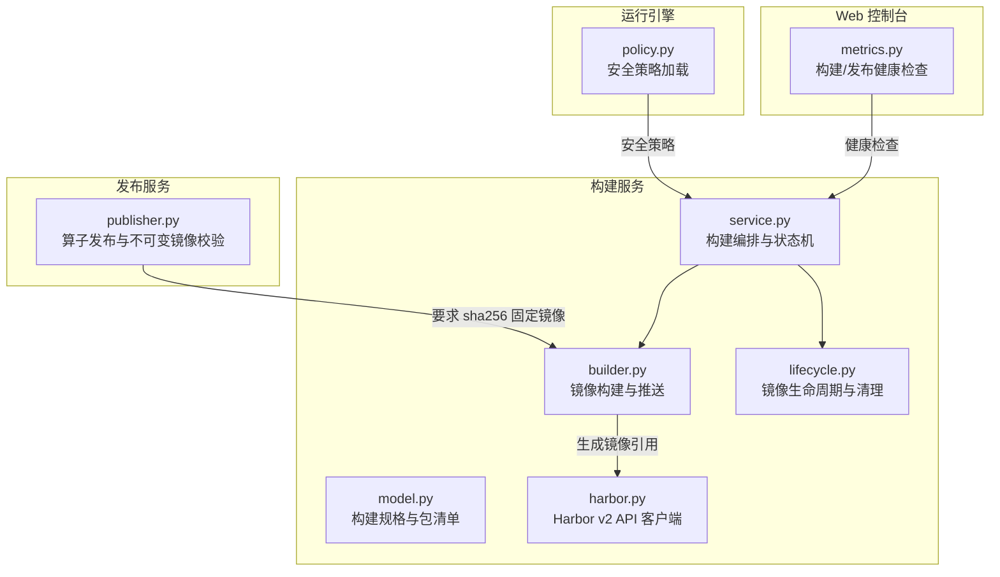
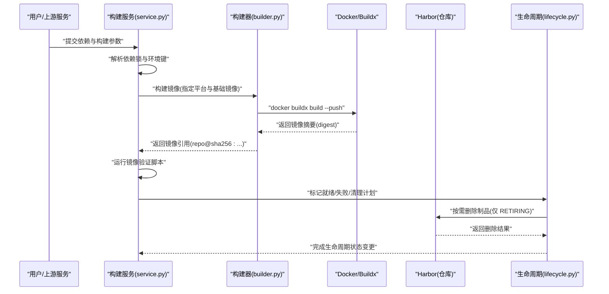
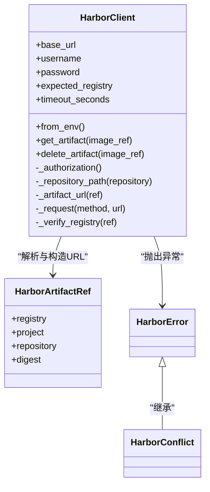
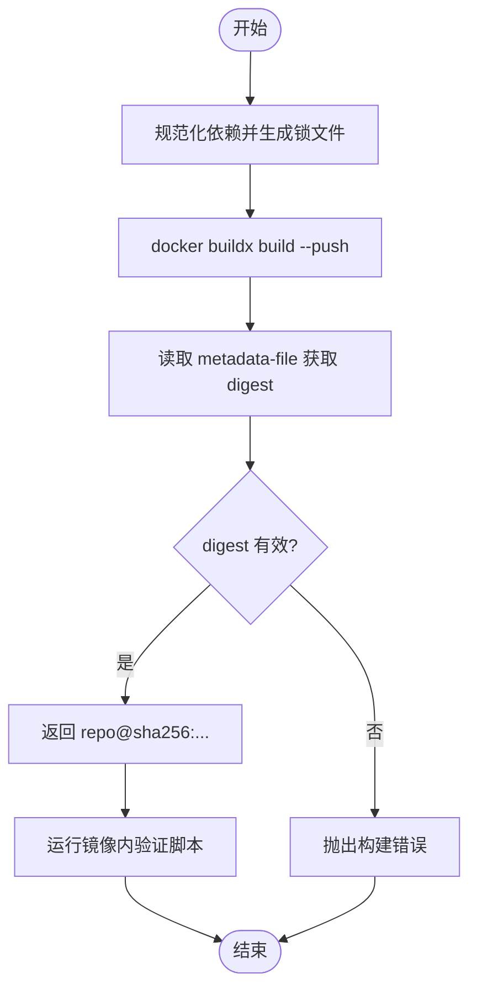
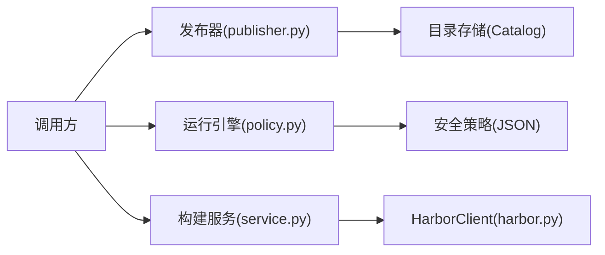
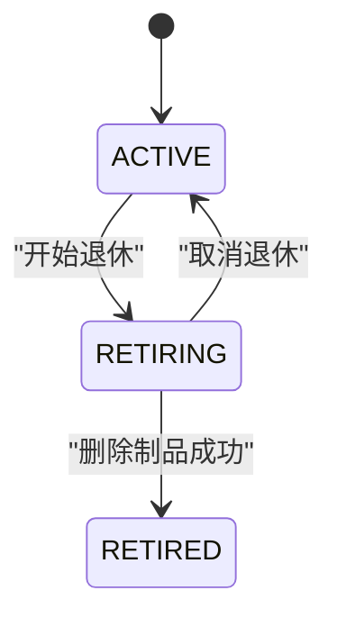
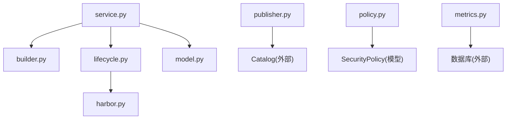
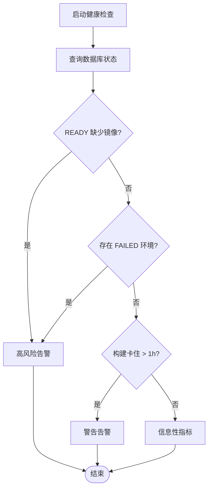

# 仓库集成

<cite>
**本文引用的文件**   
- [build_service/harbor.py](file://build_service/harbor.py)
- [build_service/builder.py](file://build_service/builder.py)
- [build_service/service.py](file://build_service/service.py)
- [build_service/model.py](file://build_service/model.py)
- [build_service/lifecycle.py](file://build_service/lifecycle.py)
- [runner_engine/publisher.py](file://runner_engine/publisher.py)
- [runner_engine/policy.py](file://runner_engine/policy.py)
- [config/acl.json](file://config/acl.json)
- [web/console/metrics.py](file://web/console/metrics.py)
</cite>

## 目录
1. [简介](#简介)
2. [项目结构](#项目结构)
3. [核心组件](#核心组件)
4. [架构总览](#架构总览)
5. [详细组件分析](#详细组件分析)
6. [依赖关系分析](#依赖关系分析)
7. [性能与可靠性](#性能与可靠性)
8. [监控与告警](#监控与告警)
9. [配置示例与最佳实践](#配置示例与最佳实践)
10. [故障排查指南](#故障排查指南)
11. [结论](#结论)

## 简介
本文件面向 Runner Engine 的镜像仓库集成系统，重点说明 Harbor 镜像仓库的集成机制、认证与访问控制、镜像推送流程、标签与版本控制、元数据同步、拉取优化策略、以及监控与告警。文档基于代码库中的构建服务与发布服务实现进行梳理，帮助读者理解从依赖锁定、镜像构建、推送到生命周期清理的完整链路，并给出可操作的配置建议与排错方法。

## 项目结构
与仓库集成直接相关的代码主要分布在以下模块：
- 构建服务：负责依赖锁定、镜像构建与推送、Harbor API 调用、镜像生命周期管理。
- 发布服务：负责算子发布、运行时镜像不可变约束校验、产物归档与目录存储。
- 运行引擎：负责安全策略加载、租户隔离、租约管理与执行上下文。
- Web 控制台指标：提供构建与发布健康检查与异常统计。

**图表来源**
- [build_service/builder.py:122-158](file://build_service/builder.py#L122-L158)
- [build_service/harbor.py:57-195](file://build_service/harbor.py#L57-L195)
- [build_service/service.py:26-216](file://build_service/service.py#L26-L216)
- [build_service/lifecycle.py:45-134](file://build_service/lifecycle.py#L45-L134)
- [runner_engine/publisher.py:82-160](file://runner_engine/publisher.py#L82-L160)
- [runner_engine/policy.py:9-24](file://runner_engine/policy.py#L9-L24)
- [web/console/metrics.py:103-127](file://web/console/metrics.py#L103-L127)

**章节来源**
- [build_service/builder.py:122-158](file://build_service/builder.py#L122-L158)
- [build_service/harbor.py:57-195](file://build_service/harbor.py#L57-L195)
- [build_service/service.py:26-216](file://build_service/service.py#L26-L216)
- [build_service/lifecycle.py:45-134](file://build_service/lifecycle.py#L45-L134)
- [runner_engine/publisher.py:82-160](file://runner_engine/publisher.py#L82-L160)
- [runner_engine/policy.py:9-24](file://runner_engine/policy.py#L9-L24)
- [web/console/metrics.py:103-127](file://web/console/metrics.py#L103-L127)

## 核心组件
- Harbor 客户端：封装 Harbor v2 API 的认证、URL 构造、请求与错误处理，支持 Basic 认证、SSL 上下文、超时限制与期望仓库域名校验。
- 构建器：通过 docker buildx 构建多平台镜像，使用 metadata-file 获取容器镜像摘要（digest），并以 digest 形式返回镜像引用。
- 构建服务：编排依赖锁定、镜像构建、镜像验证、状态持久化与重试；支持超集复用与精确匹配。
- 生命周期：定义 ACTIVE/RETIRING/RETIRED 状态，协调本地构建任务与 Harbor 删除操作，记录清理错误。
- 发布器：强制运行时镜像为不可变 OCI 摘要格式，确保发布产物确定性。
- 策略加载：从 JSON 文件加载安全策略，用于运行时的资源配额、网络允许列表等。

**章节来源**
- [build_service/harbor.py:57-195](file://build_service/harbor.py#L57-L195)
- [build_service/builder.py:122-158](file://build_service/builder.py#L122-L158)
- [build_service/service.py:26-216](file://build_service/service.py#L26-L216)
- [build_service/lifecycle.py:45-134](file://build_service/lifecycle.py#L45-L134)
- [runner_engine/publisher.py:82-160](file://runner_engine/publisher.py#L82-L160)
- [runner_engine/policy.py:9-24](file://runner_engine/policy.py#L9-L24)

## 架构总览
下图展示镜像构建与仓库集成的端到端流程：用户提交依赖 → 构建服务锁定依赖 → 构建镜像并推送 → 验证镜像内容 → 更新状态 → 可选的生命周期清理。

**图表来源**
- [build_service/service.py:157-216](file://build_service/service.py#L157-L216)
- [build_service/builder.py:122-158](file://build_service/builder.py#L122-L158)
- [build_service/lifecycle.py:91-134](file://build_service/lifecycle.py#L91-L134)
- [build_service/harbor.py:178-195](file://build_service/harbor.py#L178-L195)

## 详细组件分析

### Harbor 镜像仓库集成
- 认证方式：Basic 认证，用户名与密码通过环境变量注入，Authorization 头自动构造。
- SSL/TLS：默认使用系统证书上下文，可通过 CA 文件或禁用校验开关调整。
- 超时与限流：HTTP 请求设置超时秒数，响应体读取上限为 4 MiB。
- URL 构造：按 Harbor v2 API 规范拼接项目、仓库与制品路径，并对路径与摘要进行双重编码。
- 错误处理：区分 404（不存在）、409（冲突，如仍被引用或受保护）与其他 HTTP 错误；网络异常与超时统一包装为 HarborError。
- 仓库校验：支持期望仓库域名校验，防止误向非预期仓库发送请求。

**图表来源**
- [build_service/harbor.py:21-54](file://build_service/harbor.py#L21-L54)
- [build_service/harbor.py:57-195](file://build_service/harbor.py#L57-L195)

**章节来源**
- [build_service/harbor.py:57-195](file://build_service/harbor.py#L57-L195)

### 镜像推送流程与标签管理
- 依赖锁定：将用户依赖规范化并生成 requirements.lock，包含哈希与包清单。
- 镜像构建：使用 docker buildx 构建多平台镜像，传入 RUNNER_BASE 作为基础镜像，输出 metadata-file 以提取 containerimage.digest。
- 标签策略：构建时使用临时标签 env-{env_id}，最终对外暴露的是 repo@sha256:... 的不可变引用。
- 版本控制：所有对外镜像引用必须包含 sha256 摘要，禁止可变标签进入发布层。
- 元数据同步：metadata-file 中的 digest 被解析并写入构建结果，供后续验证与发布使用。

**图表来源**
- [build_service/builder.py:122-158](file://build_service/builder.py#L122-L158)
- [build_service/builder.py:161-205](file://build_service/builder.py#L161-L205)

**章节来源**
- [build_service/builder.py:122-158](file://build_service/builder.py#L122-L158)
- [build_service/builder.py:161-205](file://build_service/builder.py#L161-L205)

### 仓库访问控制与安全策略
- 构建侧仓库访问：HarborClient 通过 Basic 认证与期望仓库域名校验，避免误写目标仓库。
- 发布侧镜像约束：OperatorPublisher 强制 runtime_image 为 OCI 摘要格式，拒绝可变标签。
- 运行侧策略：SecurityPolicy 从 JSON 加载，包含沙箱集群、CPU/内存配额、最大超时、网络允许列表与沙箱复用策略。
- 租户隔离：服务在租约管理中携带 tenant_id 与 project_id，结合 ACL 配置进行访问控制。

**图表来源**
- [runner_engine/publisher.py:82-160](file://runner_engine/publisher.py#L82-L160)
- [runner_engine/policy.py:9-24](file://runner_engine/policy.py#L9-L24)
- [build_service/harbor.py:57-195](file://build_service/harbor.py#L57-L195)
- [config/acl.json:1-8](file://config/acl.json#L1-L8)

**章节来源**
- [runner_engine/publisher.py:82-160](file://runner_engine/publisher.py#L82-L160)
- [runner_engine/policy.py:9-24](file://runner_engine/policy.py#L9-L24)
- [build_service/harbor.py:57-195](file://build_service/harbor.py#L57-L195)
- [config/acl.json:1-8](file://config/acl.json#L1-L8)

### 镜像拉取优化
- 缓存策略：构建阶段使用 pip 安装依赖到 /opt/python-deps，并通过 RUNNER_DEPENDENCY_ROOT 环境变量注入运行时，减少重复下载。
- 重试机制：Harbor 客户端未内置指数退避重试，但上层生命周期与构建服务可通过状态机与重试接口触发重做。
- 超时处理：Harbor 客户端设置统一的 HTTP 超时秒数；构建与验证过程由外部命令与进程退出码控制。
- 镜像不可变性：对外只暴露 digest 引用，避免标签漂移导致的缓存不一致问题。

**章节来源**
- [build_service/builder.py:14-59](file://build_service/builder.py#L14-L59)
- [build_service/harbor.py:129-160](file://build_service/harbor.py#L129-L160)
- [build_service/service.py:121-152](file://build_service/service.py#L121-L152)

### 生命周期与清理
- 状态机：ACTIVE → RETIRING → RETIRED，支持取消退休。
- 清理前置条件：仅在 RETIRING 且无活跃构建任务时允许删除制品。
- Harbor 删除：若 Harbor 客户端未配置则报错；删除成功后标记需要垃圾回收。
- 错误记录：Harbor 删除异常会被记录到清理错误字段，便于审计与恢复。

**图表来源**
- [build_service/lifecycle.py:9-13](file://build_service/lifecycle.py#L9-L13)
- [build_service/lifecycle.py:65-134](file://build_service/lifecycle.py#L65-L134)

**章节来源**
- [build_service/lifecycle.py:45-134](file://build_service/lifecycle.py#L45-L134)

## 依赖关系分析
- 构建服务依赖：
  - builder.py：镜像构建与推送、镜像验证。
  - harbor.py：Harbor v2 API 客户端。
  - lifecycle.py：生命周期状态与清理协调。
  - model.py：构建规格与包清单解析。
- 发布服务依赖：
  - publisher.py：算子发布与镜像不可变约束。
- 运行引擎依赖：
  - policy.py：安全策略加载与校验。
- Web 控制台依赖：
  - metrics.py：构建与发布健康检查规则。

**图表来源**
- [build_service/service.py:1-216](file://build_service/service.py#L1-L216)
- [build_service/builder.py:1-205](file://build_service/builder.py#L1-L205)
- [build_service/lifecycle.py:1-134](file://build_service/lifecycle.py#L1-L134)
- [build_service/model.py:1-71](file://build_service/model.py#L1-L71)
- [build_service/harbor.py:1-196](file://build_service/harbor.py#L1-L196)
- [runner_engine/publisher.py:1-183](file://runner_engine/publisher.py#L1-L183)
- [runner_engine/policy.py:1-25](file://runner_engine/policy.py#L1-L25)
- [web/console/metrics.py:103-127](file://web/console/metrics.py#L103-L127)

**章节来源**
- [build_service/service.py:1-216](file://build_service/service.py#L1-L216)
- [build_service/builder.py:1-205](file://build_service/builder.py#L1-L205)
- [build_service/lifecycle.py:1-134](file://build_service/lifecycle.py#L1-L134)
- [build_service/model.py:1-71](file://build_service/model.py#L1-L71)
- [build_service/harbor.py:1-196](file://build_service/harbor.py#L1-L196)
- [runner_engine/publisher.py:1-183](file://runner_engine/publisher.py#L1-L183)
- [runner_engine/policy.py:1-25](file://runner_engine/policy.py#L1-L25)
- [web/console/metrics.py:103-127](file://web/console/metrics.py#L103-L127)

## 性能与可靠性
- 构建并行与去重：
  - 通过 env_key 对相同依赖与环境进行去重，避免重复构建。
  - 支持超集复用，当已有环境包含所需包集合时可复用。
- 镜像验证：
  - 构建后立即在镜像内运行验证脚本，确保依赖版本一致。
- 错误恢复：
  - 构建失败后支持显式重试，避免自动重试带来的抖动。
- Harbor 调用：
  - 单次请求超时与响应体大小限制，避免长尾请求占用资源。
  - 409 冲突错误提示制品仍被引用或受保护，需先解除保护或删除引用。

**章节来源**
- [build_service/service.py:31-119](file://build_service/service.py#L31-L119)
- [build_service/builder.py:161-205](file://build_service/builder.py#L161-L205)
- [build_service/harbor.py:129-160](file://build_service/harbor.py#L129-L160)

## 监控与告警
- 构建健康检查：
  - READY 环境缺少 image_ref 视为高风险。
  - FAILED 环境与构建卡住（BUILDING/VERIFYING > 1h）分别标记高/警告级别。
  - 构建失败作业数量与超集别名数量提供信息性指标。
- 发布健康检查：
  - 发布失败作业与长时间运行的发布作业。
  - 后端变体编译失败与尚未发布的变体。

**图表来源**
- [web/console/metrics.py:103-127](file://web/console/metrics.py#L103-L127)

**章节来源**
- [web/console/metrics.py:103-127](file://web/console/metrics.py#L103-L127)

## 配置示例与最佳实践
- Harbor 集成环境变量：
  - BUILD_HARBOR_URL：Harbor 服务地址。
  - BUILD_HARBOR_USERNAME / BUILD_HARBOR_PASSWORD：Basic 认证凭据。
  - BUILD_HARBOR_REGISTRY：期望仓库域名，用于请求前校验。
  - BUILD_HARBOR_CA_FILE：自定义 CA 证书路径。
  - BUILD_HARBOR_INSECURE：是否禁用 TLS 校验（不建议生产使用）。
- 构建服务配置：
  - base_image：基础镜像，建议使用 sha256 固定版本。
  - registry_repo：目标仓库路径。
  - python_version / platform：Python 版本与构建平台。
  - uv_default_index：pip 源地址（内部私有源）。
  - allow_superset_reuse：是否启用超集复用。
- 发布服务约束：
  - runtime_image 必须为 repo/image@sha256:<64 hex>，禁止可变标签。
- 安全策略：
  - sandbox_cluster、cpu、memory、max_timeout_ms、network_allow、reuse_sandbox。
- ACL 配置：
  - identities 中映射集群到租户与项目权限，支持通配符。

**章节来源**
- [build_service/harbor.py:87-109](file://build_service/harbor.py#L87-L109)
- [build_service/service.py:14-24](file://build_service/service.py#L14-L24)
- [runner_engine/publisher.py:115-116](file://runner_engine/publisher.py#L115-L116)
- [runner_engine/policy.py:9-24](file://runner_engine/policy.py#L9-L24)
- [config/acl.json:1-8](file://config/acl.json#L1-L8)

## 故障排查指南
- Harbor 连接失败：
  - 检查 BUILD_HARBOR_* 环境变量是否齐全且正确。
  - 确认 CA 证书与 TLS 设置，必要时启用 insecure（仅限测试）。
  - 查看 HarborError 日志，区分 404/409/其他 HTTP 错误。
- 镜像构建失败：
  - 检查依赖锁是否有效，包名与版本是否存在冲突。
  - 确认 docker buildx 可用，平台与基础镜像可达。
  - 查看构建服务日志中的 job_id 与 env_key，定位具体失败步骤。
- 镜像验证失败：
  - 检查镜像内依赖路径 /opt/python-deps 是否正确挂载。
  - 对比 expected_packages 与实际安装的包清单。
- 生命周期清理失败：
  - 确认环境处于 RETIRING 且无活跃构建任务。
  - 若 Harbor 删除报 409，需先解除保护或删除引用。
  - 查看清理错误记录，必要时手动干预仓库。

**章节来源**
- [build_service/harbor.py:129-195](file://build_service/harbor.py#L129-L195)
- [build_service/builder.py:122-205](file://build_service/builder.py#L122-L205)
- [build_service/lifecycle.py:91-134](file://build_service/lifecycle.py#L91-L134)

## 结论
Runner Engine 的仓库集成以 Harbor 为核心，通过严格的依赖锁定与镜像不可变约束，确保构建产物可追溯、可验证与可复用。Harbor 客户端提供最小化的 API 封装与健壮的错误处理，生命周期管理保障制品的安全清理。配合发布服务的不可变镜像校验与运行引擎的安全策略，系统在安全性、可观测性与可靠性方面形成闭环。建议在生产环境中启用 TLS 与期望仓库校验，结合健康检查与告警机制，持续监控构建与发布质量。