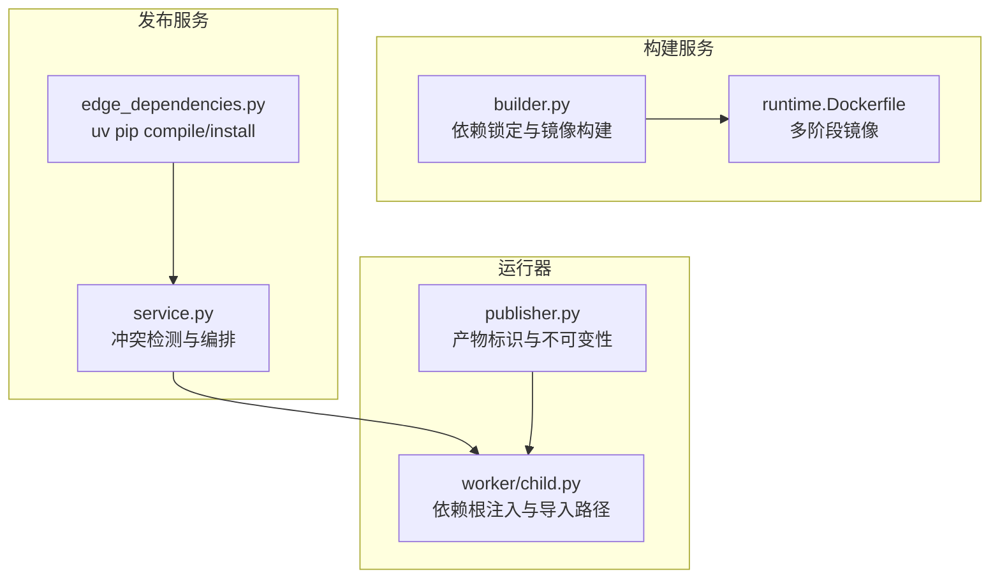
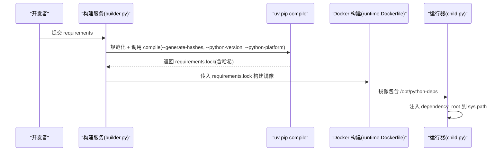
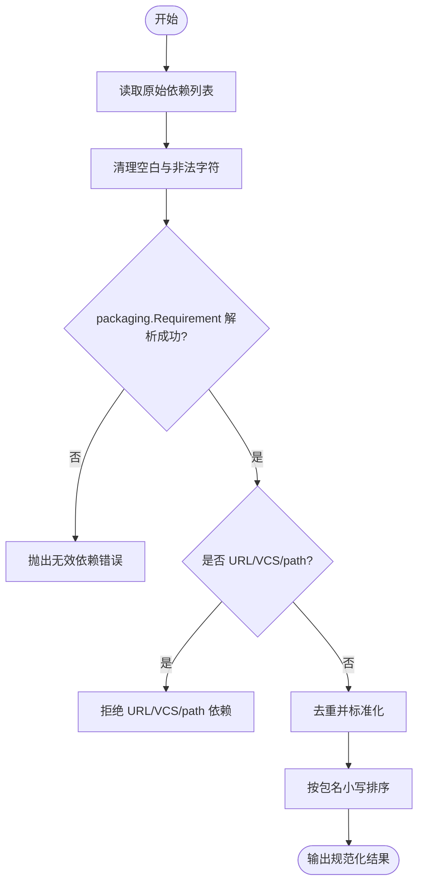
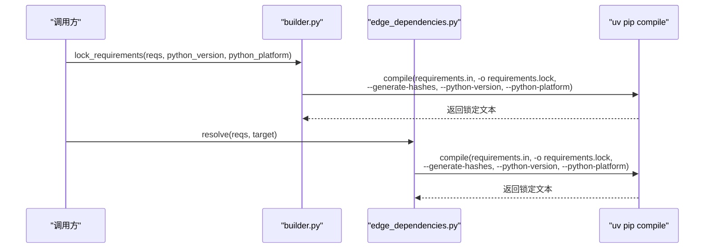
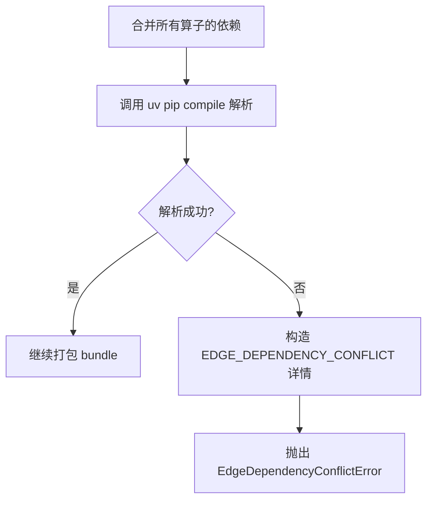
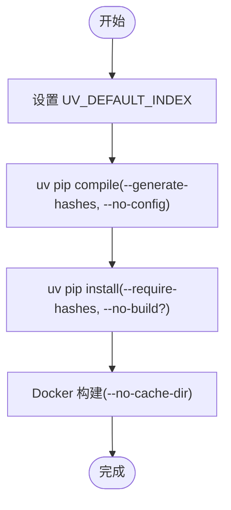
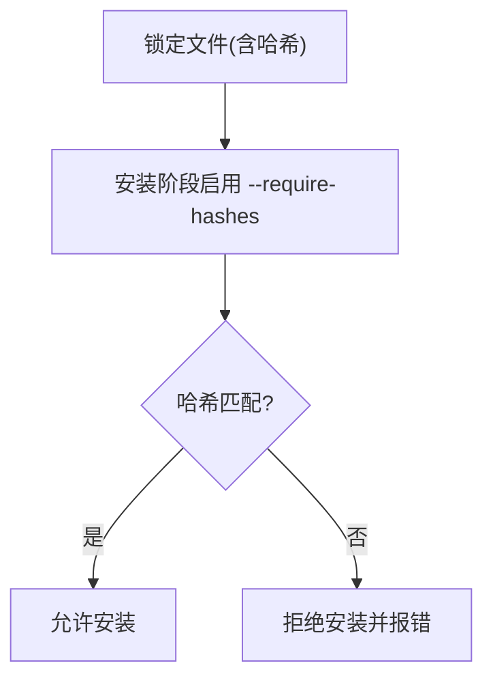
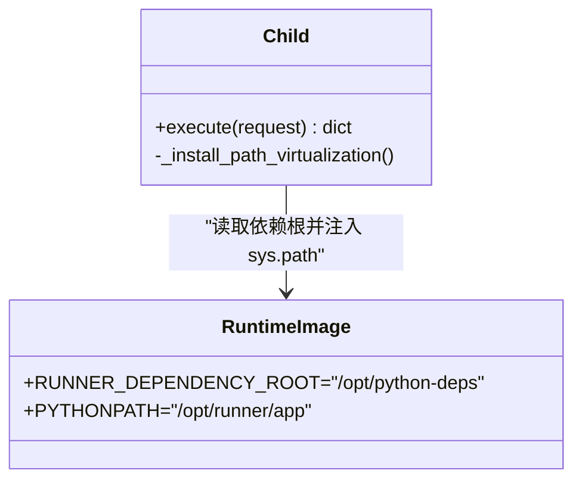
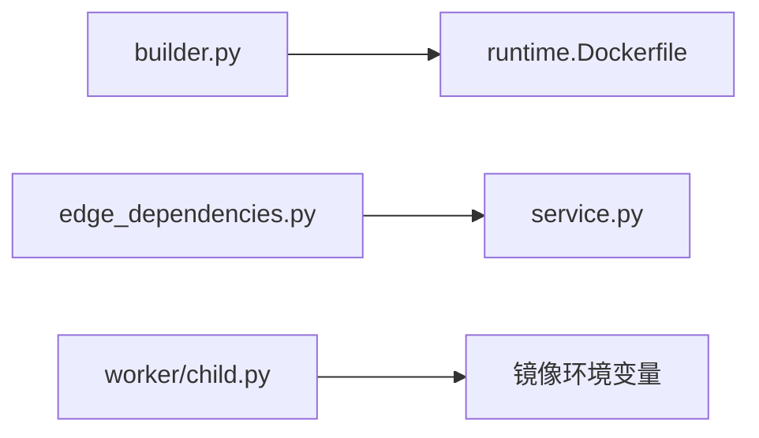

# 依赖管理

<cite>
**本文引用的文件**   
- [pyproject.toml](file://pyproject.toml)
- [requirements.lock](file://requirements.lock)
- [images/requirements.lock](file://images/requirements.lock)
- [build_service/builder.py](file://build_service/builder.py)
- [publish_service/edge_dependencies.py](file://publish_service/edge_dependencies.py)
- [publish_service/service.py](file://publish_service/service.py)
- [runner_engine/worker/child.py](file://runner_engine/worker/child.py)
- [runner_engine/publisher.py](file://runner_engine/publisher.py)
- [images/runtime.Dockerfile](file://images/runtime.Dockerfile)
</cite>

## 目录
1. [简介](#简介)
2. [项目结构](#项目结构)
3. [核心组件](#核心组件)
4. [架构总览](#架构总览)
5. [详细组件分析](#详细组件分析)
6. [依赖关系分析](#依赖关系分析)
7. [性能考虑](#性能考虑)
8. [故障排查指南](#故障排查指南)
9. [结论](#结论)
10. [附录](#附录)

## 简介
本文件面向 Runner Engine 的 Python 依赖管理系统，系统性说明以下主题：
- requirements.txt 分析与依赖规范化处理
- uv pip compile 的使用、依赖解析过程、哈希生成与平台兼容性
- 依赖冲突解决（版本约束验证与循环依赖检测）
- 依赖缓存机制与网络请求优化
- 依赖安全验证（来源可信度检查与恶意包检测）
- 配置示例、性能优化技巧与常见问题解决方案

该体系通过构建期锁定与运行期隔离，确保可重复、可审计且安全的 Python 依赖环境。

## 项目结构
Runner Engine 在多个子系统中参与依赖管理：
- 构建服务：负责将用户依赖编译为带哈希的锁定文件，并构建运行时镜像
- 发布服务：负责边缘侧（Native）依赖解析、打包与冲突检测
- 运行器：在沙箱中按依赖根路径加载依赖，实现执行隔离

**图示来源**
- [build_service/builder.py:14-59](file://build_service/builder.py#L14-L59)
- [images/runtime.Dockerfile:21-64](file://images/runtime.Dockerfile#L21-L64)
- [publish_service/edge_dependencies.py:70-181](file://publish_service/edge_dependencies.py#L70-L181)
- [publish_service/service.py:786-949](file://publish_service/service.py#L786-L949)
- [runner_engine/worker/child.py:258-294](file://runner_engine/worker/child.py#L258-L294)
- [runner_engine/publisher.py:118-145](file://runner_engine/publisher.py#L118-L145)

**章节来源**
- [pyproject.toml:5-20](file://pyproject.toml#L5-L20)
- [build_service/builder.py:14-59](file://build_service/builder.py#L14-L59)
- [images/runtime.Dockerfile:21-64](file://images/runtime.Dockerfile#L21-L64)
- [publish_service/edge_dependencies.py:70-181](file://publish_service/edge_dependencies.py#L70-L181)
- [publish_service/service.py:786-949](file://publish_service/service.py#L786-L949)
- [runner_engine/worker/child.py:258-294](file://runner_engine/worker/child.py#L258-L294)
- [runner_engine/publisher.py:118-145](file://runner_engine/publisher.py#L118-L145)

## 核心组件
- 依赖规范化模块
  - 构建服务中的 normalize_requirements：过滤空行、拒绝换行与引用语法、校验 Requirement、禁止 URL/VCS/path 依赖、去重并按名称小写排序
  - 发布服务中的 normalize_requirements：同上，但用于边缘 Native 场景
- 依赖解析与锁定
  - build_service.builder.lock_requirements：调用 uv pip compile，生成带哈希的 requirements.lock
  - publish_service.edge_dependencies.EdgeDependencyResolver.resolve：对目标平台进行 uv pip compile，输出带哈希锁定文本
- 依赖安装与物化
  - EdgeDependencyResolver.materialize：基于锁定文件使用 uv pip install --require-hashes 安装到目标目录
  - Docker 多阶段镜像：在构建阶段用 pip 安装锁定依赖到 /opt/python-deps，最终镜像仅拷贝已安装的依赖
- 运行期依赖注入
  - runner_engine.worker.child._install_path_virtualization 与 execute：将 release_root 与 dependency_root 加入 sys.path，实现依赖隔离
- 产物与不可变性
  - runner_engine.publisher：以运行时镜像摘要作为运行时身份，避免重复暴露环境摘要字段

**章节来源**
- [build_service/builder.py:62-119](file://build_service/builder.py#L62-L119)
- [publish_service/edge_dependencies.py:47-67](file://publish_service/edge_dependencies.py#L47-L67)
- [publish_service/edge_dependencies.py:86-136](file://publish_service/edge_dependencies.py#L86-L136)
- [publish_service/edge_dependencies.py:138-181](file://publish_service/edge_dependencies.py#L138-L181)
- [build_service/builder.py:14-59](file://build_service/builder.py#L14-L59)
- [runner_engine/worker/child.py:258-294](file://runner_engine/worker/child.py#L258-L294)
- [runner_engine/publisher.py:118-145](file://runner_engine/publisher.py#L118-L145)

## 架构总览
下图展示从“需求输入”到“锁定文件生成”，再到“镜像构建与运行期隔离”的完整流程。

**图示来源**
- [build_service/builder.py:84-119](file://build_service/builder.py#L84-L119)
- [images/runtime.Dockerfile:28-40](file://images/runtime.Dockerfile#L28-L40)
- [runner_engine/worker/child.py:285-294](file://runner_engine/worker/child.py#L285-L294)

## 详细组件分析

### 依赖规范化与 requirements 分析
- 行为要点
  - 去除空白行，拒绝包含换行或以“-”开头的条目
  - 使用 packaging.requirements.Requirement 解析并标准化
  - 禁止 URL/VCS/path 依赖
  - 去重并按包名小写排序，保证确定性
- 适用位置
  - 构建服务：normalize_requirements
  - 发布服务：normalize_requirements（边缘 Native）

**图示来源**
- [build_service/builder.py:62-81](file://build_service/builder.py#L62-L81)
- [publish_service/edge_dependencies.py:47-67](file://publish_service/edge_dependencies.py#L47-L67)

**章节来源**
- [build_service/builder.py:62-81](file://build_service/builder.py#L62-L81)
- [publish_service/edge_dependencies.py:47-67](file://publish_service/edge_dependencies.py#L47-L67)

### uv pip compile 使用与依赖解析
- 关键参数
  - --generate-hashes：生成每个包的 SHA256 等哈希
  - --no-header/--no-annotate：精简锁定文件
  - --python-version/--python-platform：指定目标 Python 版本与平台
  - --no-build：仅使用预编译二进制，加速解析与安装
  - --no-config：忽略全局 uv 配置，保证可重复性
- 调用位置
  - 构建服务：lock_requirements
  - 发布服务：EdgeDependencyResolver.resolve

**图示来源**
- [build_service/builder.py:84-119](file://build_service/builder.py#L84-L119)
- [publish_service/edge_dependencies.py:86-136](file://publish_service/edge_dependencies.py#L86-L136)

**章节来源**
- [build_service/builder.py:84-119](file://build_service/builder.py#L84-L119)
- [publish_service/edge_dependencies.py:86-136](file://publish_service/edge_dependencies.py#L86-L136)

### 依赖冲突解决算法
- 冲突检测点
  - 发布服务在尝试将新算子与已有算子共享同一依赖环境时，若 uv 无法解析出单一环境，则视为冲突
- 冲突信息
  - 包含目标平台、候选算子、现有成员列表以及解析器错误输出
- 异常封装
  - EdgeDependencyResolutionError 携带 stderr/stdout 片段，便于诊断

**图示来源**
- [publish_service/service.py:786-821](file://publish_service/service.py#L786-L821)
- [publish_service/service.py:874-915](file://publish_service/service.py#L874-L915)
- [publish_service/edge_dependencies.py:20-24](file://publish_service/edge_dependencies.py#L20-L24)

**章节来源**
- [publish_service/service.py:786-821](file://publish_service/service.py#L786-L821)
- [publish_service/service.py:874-915](file://publish_service/service.py#L874-L915)
- [publish_service/edge_dependencies.py:20-24](file://publish_service/edge_dependencies.py#L20-L24)

### 依赖缓存机制与网络请求优化
- 构建期
  - Docker 构建阶段使用 --no-cache-dir 安装依赖，避免容器内缓存污染
  - 通过私有 PyPI 源与 trusted-host 提高拉取效率与安全性
- 解析期
  - 通过环境变量 UV_DEFAULT_INDEX 指定默认索引源，减少网络不确定性
  - 使用 --no-config 避免本地配置影响解析一致性
- 安装期
  - 边缘侧 materialize 使用 --require-hashes 强制校验哈希，提升安全性
  - 可选 --no-build 跳过源码编译，提升速度

**图示来源**
- [publish_service/edge_dependencies.py:80-84](file://publish_service/edge_dependencies.py#L80-L84)
- [publish_service/edge_dependencies.py:103-114](file://publish_service/edge_dependencies.py#L103-L114)
- [publish_service/edge_dependencies.py:154-164](file://publish_service/edge_dependencies.py#L154-L164)
- [build_service/builder.py:114-118](file://build_service/builder.py#L114-L118)
- [images/runtime.Dockerfile:31-40](file://images/runtime.Dockerfile#L31-L40)

**章节来源**
- [publish_service/edge_dependencies.py:80-84](file://publish_service/edge_dependencies.py#L80-L84)
- [publish_service/edge_dependencies.py:103-114](file://publish_service/edge_dependencies.py#L103-L114)
- [publish_service/edge_dependencies.py:154-164](file://publish_service/edge_dependencies.py#L154-L164)
- [build_service/builder.py:114-118](file://build_service/builder.py#L114-L118)
- [images/runtime.Dockerfile:31-40](file://images/runtime.Dockerfile#L31-L40)

### 依赖安全验证
- 来源可信度
  - 通过私有 PyPI 源与 trusted-host 限定来源
  - 使用 --no-config 避免外部配置引入不可信索引
- 完整性校验
  - 锁定文件包含哈希；安装阶段启用 --require-hashes 强制校验
- 恶意包检测
  - 当前仓库未内置恶意包扫描逻辑；建议在生产环境中集成上游安全扫描工具（如 pip-audit、Safety），并在 CI 中阻断不合规依赖

**图示来源**
- [publish_service/edge_dependencies.py:154-164](file://publish_service/edge_dependencies.py#L154-L164)
- [images/runtime.Dockerfile:31-40](file://images/runtime.Dockerfile#L31-L40)

**章节来源**
- [publish_service/edge_dependencies.py:154-164](file://publish_service/edge_dependencies.py#L154-L164)
- [images/runtime.Dockerfile:31-40](file://images/runtime.Dockerfile#L31-L40)

### 运行期依赖注入与隔离
- 依赖根注入
  - worker/child.execute 将 release_root 与 dependency_root 加入 sys.path，优先加载受控依赖
- 镜像依赖根
  - RUNNER_DEPENDENCY_ROOT 指向 /opt/python-deps，确保运行期只使用构建期锁定的依赖
- 隔离策略
  - 信任代理自身不应依赖用户依赖 PYTHONPATH，避免污染

**图示来源**
- [runner_engine/worker/child.py:258-294](file://runner_engine/worker/child.py#L258-L294)
- [images/runtime.Dockerfile:57-64](file://images/runtime.Dockerfile#L57-L64)

**章节来源**
- [runner_engine/worker/child.py:258-294](file://runner_engine/worker/child.py#L258-L294)
- [images/runtime.Dockerfile:57-64](file://images/runtime.Dockerfile#L57-L64)

## 依赖关系分析
- 组件耦合
  - builder.py 与 runtime.Dockerfile 强耦合：前者生成 requirements.lock，后者消费它构建镜像
  - edge_dependencies.py 与 service.py 协作：前者负责解析与物化，后者负责冲突检测与编排
  - child.py 与镜像环境变量：运行期依赖注入依赖镜像提供的依赖根路径
- 外部依赖
  - packaging.requirements：依赖规范化与校验
  - uv：依赖解析与锁定
  - docker/buildx：镜像构建与推送

**图示来源**
- [build_service/builder.py:84-119](file://build_service/builder.py#L84-L119)
- [images/runtime.Dockerfile:28-40](file://images/runtime.Dockerfile#L28-L40)
- [publish_service/edge_dependencies.py:86-181](file://publish_service/edge_dependencies.py#L86-L181)
- [publish_service/service.py:786-949](file://publish_service/service.py#L786-L949)
- [runner_engine/worker/child.py:258-294](file://runner_engine/worker/child.py#L258-L294)

**章节来源**
- [build_service/builder.py:84-119](file://build_service/builder.py#L84-L119)
- [images/runtime.Dockerfile:28-40](file://images/runtime.Dockerfile#L28-L40)
- [publish_service/edge_dependencies.py:86-181](file://publish_service/edge_dependencies.py#L86-L181)
- [publish_service/service.py:786-949](file://publish_service/service.py#L786-L949)
- [runner_engine/worker/child.py:258-294](file://runner_engine/worker/child.py#L258-L294)

## 性能考虑
- 使用 --no-build 跳过源码编译，减少解析与安装时间
- 使用 --no-config 避免本地配置带来的不一致性与额外开销
- 通过 UV_DEFAULT_INDEX 指向高性能私有索引，降低网络延迟
- Docker 构建阶段禁用缓存 (--no-cache-dir)，避免缓存膨胀与污染
- 锁定文件精简 (--no-header, --no-annotate)，减小传输与存储开销

[本节为通用指导，无需具体文件引用]

## 故障排查指南
- 依赖解析失败
  - 现象：uv pip compile 返回非零状态码
  - 处理：捕获 EdgeDependencyResolutionError，查看 stderr/stdout 片段定位问题
  - 参考：[publish_service/edge_dependencies.py:116-131](file://publish_service/edge_dependencies.py#L116-L131)
- 依赖冲突
  - 现象：无法为多个算子共享依赖环境
  - 处理：查看 EDGE_DEPENDENCY_CONFLICT 详情，调整依赖版本或拆分环境
  - 参考：[publish_service/service.py:786-821](file://publish_service/service.py#L786-L821), [publish_service/service.py:874-915](file://publish_service/service.py#L874-L915)
- 哈希校验失败
  - 现象：安装阶段因哈希不匹配而失败
  - 处理：重新生成锁定文件，确保来源一致
  - 参考：[publish_service/edge_dependencies.py:154-164](file://publish_service/edge_dependencies.py#L154-L164)
- 运行期导入路径问题
  - 现象：找不到依赖包
  - 处理：确认 dependency_root 存在且被正确注入 sys.path
  - 参考：[runner_engine/worker/child.py:285-294](file://runner_engine/worker/child.py#L285-L294)

**章节来源**
- [publish_service/edge_dependencies.py:116-131](file://publish_service/edge_dependencies.py#L116-L131)
- [publish_service/service.py:786-821](file://publish_service/service.py#L786-L821)
- [publish_service/service.py:874-915](file://publish_service/service.py#L874-L915)
- [publish_service/edge_dependencies.py:154-164](file://publish_service/edge_dependencies.py#L154-L164)
- [runner_engine/worker/child.py:285-294](file://runner_engine/worker/child.py#L285-L294)

## 结论
Runner Engine 的依赖管理以“规范化 + 锁定 + 哈希校验 + 运行期隔离”为核心，结合 uv 的高效解析能力与 Docker 的多阶段构建，实现了可重复、安全、可审计的 Python 依赖环境。通过明确的冲突检测与详尽的错误信息，系统能够在复杂的多算子场景中提供清晰的排障指引。

[本节为总结性内容，无需具体文件引用]

## 附录

### 配置与示例
- 项目元数据与可选依赖
  - 参见：[pyproject.toml:5-20](file://pyproject.toml#L5-L20)
- 锁定文件示例
  - 根级锁定文件：[requirements.lock:1-11](file://requirements.lock#L1-L11)
  - 镜像锁定文件：[images/requirements.lock:1-11](file://images/requirements.lock#L1-L11)
- 构建服务依赖锁定函数
  - 参见：[build_service/builder.py:84-119](file://build_service/builder.py#L84-L119)
- 发布服务边缘依赖解析与物化
  - 参见：[publish_service/edge_dependencies.py:86-181](file://publish_service/edge_dependencies.py#L86-L181)
- 运行期依赖注入
  - 参见：[runner_engine/worker/child.py:258-294](file://runner_engine/worker/child.py#L258-L294)
- 镜像依赖根与环境变量
  - 参见：[images/runtime.Dockerfile:28-64](file://images/runtime.Dockerfile#L28-L64)

**章节来源**
- [pyproject.toml:5-20](file://pyproject.toml#L5-L20)
- [requirements.lock:1-11](file://requirements.lock#L1-L11)
- [images/requirements.lock:1-11](file://images/requirements.lock#L1-L11)
- [build_service/builder.py:84-119](file://build_service/builder.py#L84-L119)
- [publish_service/edge_dependencies.py:86-181](file://publish_service/edge_dependencies.py#L86-L181)
- [runner_engine/worker/child.py:258-294](file://runner_engine/worker/child.py#L258-L294)
- [images/runtime.Dockerfile:28-64](file://images/runtime.Dockerfile#L28-L64)