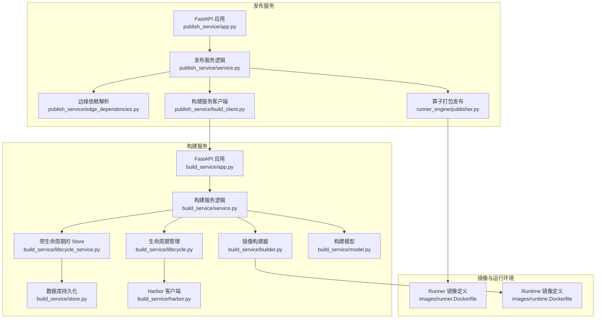
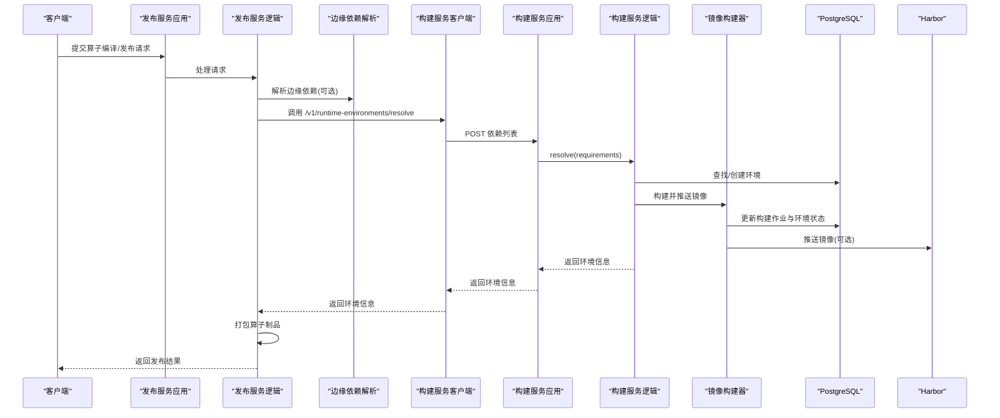
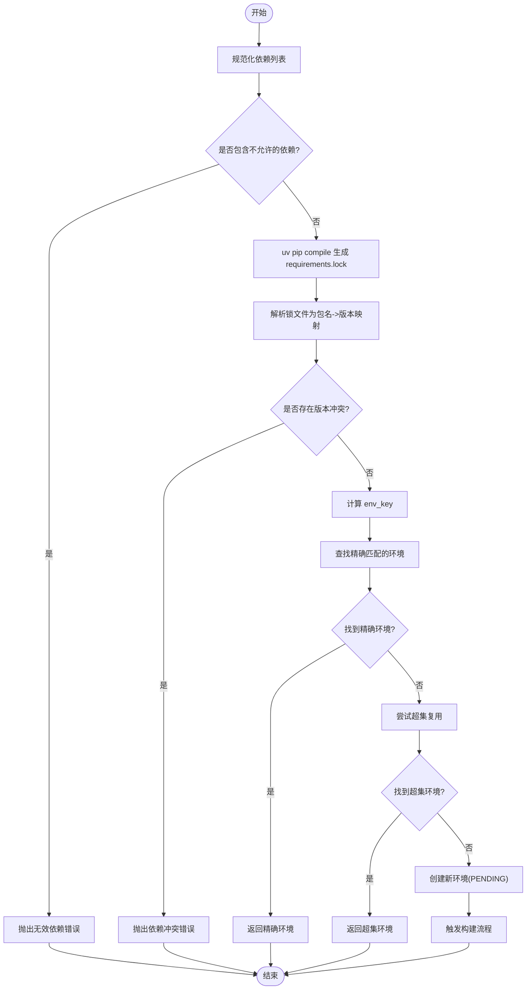
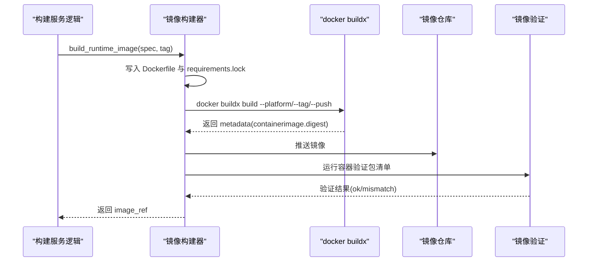
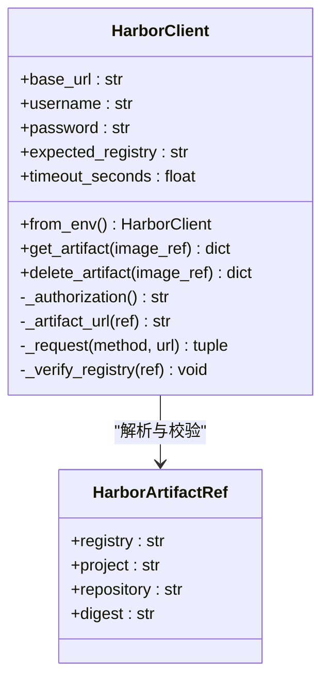
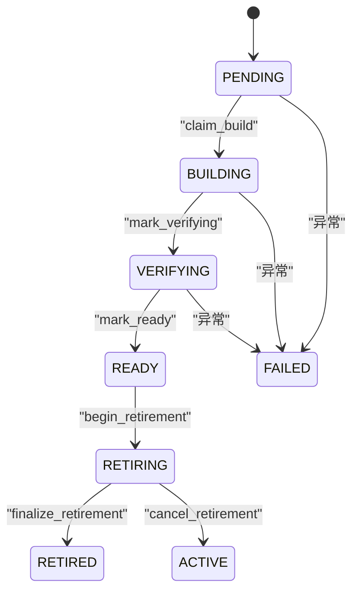
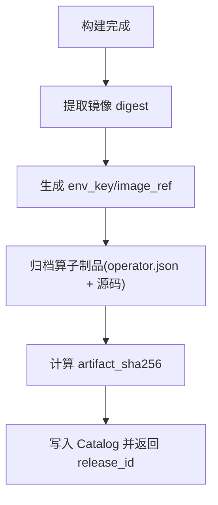
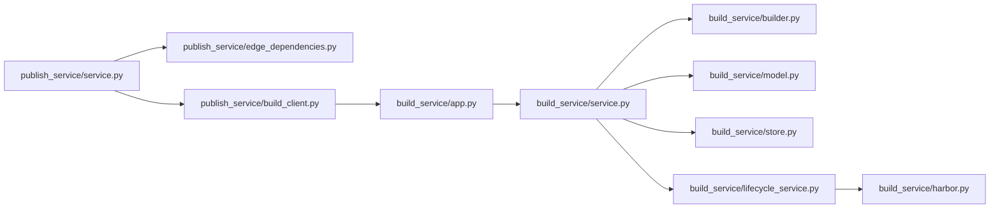

# 构建系统

<cite>
**本文引用的文件**   
- [build_service/app.py](file://build_service/app.py)
- [build_service/builder.py](file://build_service/builder.py)
- [build_service/harbor.py](file://build_service/harbor.py)
- [build_service/lifecycle.py](file://build_service/lifecycle.py)
- [build_service/lifecycle_service.py](file://build_service/lifecycle_service.py)
- [build_service/model.py](file://build_service/model.py)
- [build_service/service.py](file://build_service/service.py)
- [build_service/store.py](file://build_service/store.py)
- [images/runner.Dockerfile](file://images/runner.Dockerfile)
- [images/runtime.Dockerfile](file://images/runtime.Dockerfile)
- [publish_service/app.py](file://publish_service/app.py)
- [publish_service/build_client.py](file://publish_service/build_client.py)
- [publish_service/edge_dependencies.py](file://publish_service/edge_dependencies.py)
- [publish_service/service.py](file://publish_service/service.py)
- [runner_engine/publisher.py](file://runner_engine/publisher.py)
- [pyproject.toml](file://pyproject.toml)
</cite>

## 目录
1. [简介](#简介)
2. [项目结构](#项目结构)
3. [核心组件](#核心组件)
4. [架构总览](#架构总览)
5. [详细组件分析](#详细组件分析)
6. [依赖关系分析](#依赖关系分析)
7. [性能与缓存优化](#性能与缓存优化)
8. [故障排查指南](#故障排查指南)
9. [结论](#结论)
10. [附录：配置示例](#附录配置示例)

## 简介
本文件面向 Runner Engine 的构建系统，系统性说明 Python 依赖解析、Docker 镜像构建、Harbor 仓库集成、构建任务队列、产物管理与版本策略，并给出并行构建与缓存优化建议及常见问题解决方案。文档以代码为依据，提供可追溯的文件来源与图示，帮助读者从高层到代码层全面理解构建流水线。

## 项目结构
构建系统由以下子系统组成：
- 构建服务 build_service：负责依赖锁定、镜像构建、生命周期管理与 Harbor 集成
- 发布服务 publish_service：负责算子编译、边缘依赖解析、调用构建服务、归档制品
- 运行时镜像 images：包含 runner 与 runtime 两类 Dockerfile
- 运行器 runner_engine：提供算子打包与发布能力

**图表来源**
- [build_service/app.py:106-181](file://build_service/app.py#L106-L181)
- [build_service/service.py:26-215](file://build_service/service.py#L26-L215)
- [build_service/builder.py:122-158](file://build_service/builder.py#L122-L158)
- [build_service/lifecycle.py:45-133](file://build_service/lifecycle.py#L45-L133)
- [build_service/lifecycle_service.py:11-323](file://build_service/lifecycle_service.py#L11-L323)
- [build_service/store.py:65-331](file://build_service/store.py#L65-L331)
- [build_service/harbor.py:57-196](file://build_service/harbor.py#L57-L196)
- [build_service/model.py:40-71](file://build_service/model.py#L40-L71)
- [publish_service/app.py:135-347](file://publish_service/app.py#L135-L347)
- [publish_service/service.py:71-774](file://publish_service/service.py#L71-L774)
- [publish_service/edge_dependencies.py:70-182](file://publish_service/edge_dependencies.py#L70-L182)
- [publish_service/build_client.py:13-31](file://publish_service/build_client.py#L13-L31)
- [runner_engine/publisher.py:82-160](file://runner_engine/publisher.py#L82-L160)
- [images/runner.Dockerfile:1-19](file://images/runner.Dockerfile#L1-L19)
- [images/runtime.Dockerfile:21-65](file://images/runtime.Dockerfile#L21-L65)

**章节来源**
- [build_service/app.py:106-181](file://build_service/app.py#L106-L181)
- [publish_service/app.py:135-347](file://publish_service/app.py#L135-L347)
- [pyproject.toml:23-28](file://pyproject.toml#L23-L28)

## 核心组件
- 构建服务 FastAPI 应用：暴露运行时环境解析、查询与重试接口，启动时装配 BuildService/LifecycleBuildService/HarborClient
- 构建服务逻辑：基于 uv 生成 requirements.lock，构造 RuntimeBuildSpec，查找或创建精确/超集环境，触发镜像构建与验证
- 镜像构建器：动态生成 Dockerfile，使用 docker buildx 构建并推送镜像，提取 digest 作为不可变引用
- Harbor 客户端：封装 Harbor v2 API，支持认证、校验期望仓库、删除制品
- 生命周期管理：维护 ACTIVE/RETIRING/RETIRED 状态，协调清理与删除
- 存储层：PostgreSQL 表结构与索引，记录环境、别名、构建作业与状态迁移
- 发布服务：扫描源码、编译后端契约、调用构建服务获取运行时镜像、打包算子制品
- 边缘依赖解析：为 NiFi Native 目标平台解析并物化依赖，支持二进制优先
- 算子发布：生成确定性 tar.gz 制品，计算哈希，写入 Catalog

**章节来源**
- [build_service/app.py:106-181](file://build_service/app.py#L106-L181)
- [build_service/service.py:26-215](file://build_service/service.py#L26-L215)
- [build_service/builder.py:62-158](file://build_service/builder.py#L62-L158)
- [build_service/harbor.py:57-196](file://build_service/harbor.py#L57-L196)
- [build_service/lifecycle.py:45-133](file://build_service/lifecycle.py#L45-L133)
- [build_service/lifecycle_service.py:11-323](file://build_service/lifecycle_service.py#L11-L323)
- [build_service/store.py:65-331](file://build_service/store.py#L65-L331)
- [publish_service/service.py:71-774](file://publish_service/service.py#L71-L774)
- [publish_service/edge_dependencies.py:70-182](file://publish_service/edge_dependencies.py#L70-L182)
- [runner_engine/publisher.py:82-160](file://runner_engine/publisher.py#L82-L160)

## 架构总览
构建系统采用“发布服务 + 构建服务”的双服务架构：
- 发布服务负责算子分析与后端编译，并通过 HTTP 调用构建服务进行 Python 依赖解析与镜像构建
- 构建服务通过 uv 锁定依赖、docker buildx 构建镜像、Harbor 管理制品，并使用 PostgreSQL 持久化环境与作业状态
- 运行时镜像分为 runner（执行算子）与 runtime（包含用户依赖），二者通过环境变量与路径隔离

**图表来源**
- [publish_service/app.py:201-277](file://publish_service/app.py#L201-L277)
- [publish_service/service.py:624-774](file://publish_service/service.py#L624-L774)
- [publish_service/build_client.py:13-31](file://publish_service/build_client.py#L13-L31)
- [build_service/app.py:140-179](file://build_service/app.py#L140-L179)
- [build_service/service.py:31-215](file://build_service/service.py#L31-L215)
- [build_service/builder.py:122-158](file://build_service/builder.py#L122-L158)
- [build_service/store.py:246-331](file://build_service/store.py#L246-L331)
- [build_service/harbor.py:162-196](file://build_service/harbor.py#L162-L196)

## 详细组件分析

### Python 依赖解析机制
- 输入规范化：对原始依赖进行去重、格式校验，禁止 URL/VCS/path 依赖
- 锁定生成：使用 uv pip compile 生成 requirements.lock，附带哈希值，指定 Python 版本与平台
- 冲突检测：解析锁文件中的包名与版本，若出现重复包名且版本不一致则抛出冲突错误
- 环境键生成：将基础镜像、Python 版本、平台、锁文件摘要与构建策略版本组合后计算 SHA-256，得到 env_key
- 复用策略：先尝试精确匹配 env_key；若允许超集复用，则在已就绪环境中寻找包含当前包的更小超集

**图表来源**
- [build_service/builder.py:62-119](file://build_service/builder.py#L62-L119)
- [build_service/model.py:17-71](file://build_service/model.py#L17-L71)
- [build_service/service.py:31-119](file://build_service/service.py#L31-L119)

**章节来源**
- [build_service/builder.py:62-119](file://build_service/builder.py#L62-L119)
- [build_service/model.py:17-71](file://build_service/model.py#L17-L71)
- [build_service/service.py:31-119](file://build_service/service.py#L31-L119)

### Docker 镜像构建流程
- Dockerfile 生成：构建器在临时目录中写入 RUNTIME_DOCKERFILE 与 requirements.lock
- 多阶段构建：第一阶段安装用户依赖到 /opt/python-deps，第二阶段复制依赖并设置环境变量，确保可信 Agent 不依赖用户 PYTHONPATH
- 构建命令：使用 docker buildx build，指定平台、构建参数、标签、元数据输出与推送
- 镜像引用：从 metadata 中提取 containerimage.digest，形成 registry@sha256:... 的不可变引用
- 镜像验证：在容器中运行脚本检查 /opt/python-deps 下包名与版本是否与预期一致

**图表来源**
- [build_service/builder.py:122-205](file://build_service/builder.py#L122-L205)
- [images/runtime.Dockerfile:21-65](file://images/runtime.Dockerfile#L21-L65)

**章节来源**
- [build_service/builder.py:122-205](file://build_service/builder.py#L122-L205)
- [images/runtime.Dockerfile:21-65](file://images/runtime.Dockerfile#L21-L65)

### Harbor 镜像仓库集成
- 认证机制：Basic Auth，支持 CA 证书与不安全模式，超时控制
- 期望仓库校验：可通过 BUILD_HARBOR_REGISTRY 限制镜像仓库域名
- 获取/删除制品：GET/DELETE /api/v2.0/projects/{project}/repositories/{repository}/artifacts/{digest}
- 冲突与错误：409 表示制品仍被引用或受保护，抛出 HarborConflict；其他错误包装为 HarborError

**图表来源**
- [build_service/harbor.py:21-196](file://build_service/harbor.py#L21-L196)

**章节来源**
- [build_service/harbor.py:57-196](file://build_service/harbor.py#L57-L196)

### 构建任务队列管理
- 状态机：runtime_environments.status 包括 PENDING/BUILDING/VERIFYING/READY/FAILED；build_jobs 跟踪每次构建尝试
- 并发控制：claim_build 原子性地将 PENDING 转为 BUILDING 并插入 job 行，防止重复构建
- 失败重试：仅 FAILED 环境可重试，reset_failed 重置状态并保留历史 job 记录
- 生命周期：ACTIVE/RETIRING/RETIRED 控制环境可用性与清理流程，避免活跃构建期间清理

**图表来源**
- [build_service/store.py:127-331](file://build_service/store.py#L127-L331)
- [build_service/lifecycle_service.py:109-291](file://build_service/lifecycle_service.py#L109-L291)
- [build_service/lifecycle.py:45-133](file://build_service/lifecycle.py#L45-L133)

**章节来源**
- [build_service/store.py:127-331](file://build_service/store.py#L127-L331)
- [build_service/lifecycle_service.py:109-291](file://build_service/lifecycle_service.py#L109-L291)
- [build_service/lifecycle.py:45-133](file://build_service/lifecycle.py#L45-L133)

### 构建产物管理
- 镜像标签策略：构建时使用 env-{env_id} 标签，最终产物以 registry@sha256:... 引用
- 元数据收集：buildx 输出 metadata.json，提取 containerimage.digest；算子制品包含 operator.json 与源文件快照
- 制品归档：OperatorPublisher 生成确定性 tar.gz，计算 artifact_sha256，写入 Catalog
- 版本管理：env_key 与 release_id 均为不可变标识，便于追踪与回滚

**图表来源**
- [build_service/builder.py:122-158](file://build_service/builder.py#L122-L158)
- [runner_engine/publisher.py:82-160](file://runner_engine/publisher.py#L82-L160)

**章节来源**
- [build_service/builder.py:122-158](file://build_service/builder.py#L122-L158)
- [runner_engine/publisher.py:82-160](file://runner_engine/publisher.py#L82-L160)

### 边缘依赖解析与物化
- 解析：针对 NiFi Native 目标平台，使用 uv pip compile 生成 lock，支持二进制优先(--no-build)
- 物化：uv pip install -r requirements.lock --target <dest>，按目标平台与 Python 版本安装
- 错误处理：捕获 uv 返回码，抛出 EdgeDependencyResolutionError，附带 stdout/stderr

**章节来源**
- [publish_service/edge_dependencies.py:70-182](file://publish_service/edge_dependencies.py#L70-L182)

## 依赖关系分析
- 模块耦合：
  - publish_service.service 依赖 build_client 与 edge_dependencies，间接依赖 build_service
  - build_service.service 依赖 builder、model、store、lifecycle_service
  - lifecycle_service 扩展 store 并引入 harbor
- 外部依赖：
  - uv：依赖锁定与安装
  - docker buildx：跨平台镜像构建与推送
  - Harbor v2 API：制品管理
  - PostgreSQL：持久化环境与作业状态

**图表来源**
- [publish_service/service.py:71-774](file://publish_service/service.py#L71-L774)
- [publish_service/edge_dependencies.py:70-182](file://publish_service/edge_dependencies.py#L70-L182)
- [publish_service/build_client.py:13-31](file://publish_service/build_client.py#L13-L31)
- [build_service/app.py:106-181](file://build_service/app.py#L106-L181)
- [build_service/service.py:26-215](file://build_service/service.py#L26-L215)
- [build_service/builder.py:122-158](file://build_service/builder.py#L122-L158)
- [build_service/model.py:40-71](file://build_service/model.py#L40-L71)
- [build_service/store.py:65-331](file://build_service/store.py#L65-L331)
- [build_service/lifecycle_service.py:11-323](file://build_service/lifecycle_service.py#L11-L323)
- [build_service/harbor.py:57-196](file://build_service/harbor.py#L57-L196)

**章节来源**
- [publish_service/service.py:71-774](file://publish_service/service.py#L71-L774)
- [build_service/service.py:26-215](file://build_service/service.py#L26-L215)

## 性能与缓存优化
- 依赖解析缓存：
  - 使用 uv 默认索引与本地缓存，减少网络开销
  - 通过 env_key 与超集复用避免重复构建
- 镜像构建缓存：
  - 多阶段构建分离依赖安装与最终镜像，提升缓存命中率
  - 固定基础镜像 digest，避免基线变更导致全量重建
- 并行构建：
  - claim_build 保证同一环境不会并发构建
  - 多个不同 env_key 的环境可并行构建
- 构建超时与重试：
  - 发布服务可配置构建超时时间
  - 仅 FAILED 环境允许重试，避免无限重试

[本节为通用指导，无需具体文件来源]

## 故障排查指南
- 依赖解析失败：
  - 检查依赖格式与是否包含 URL/VCS/path
  - 查看 uv 输出 stderr/stdout，定位冲突或不可用包
- 镜像构建失败：
  - 确认基础镜像 digest 有效且可达
  - 检查 docker buildx 平台参数与权限
- Harbor 操作失败：
  - 检查认证与期望仓库配置
  - 409 冲突需等待制品不再被引用或解除保护
- 构建状态卡住：
  - 检查是否有活跃构建作业
  - 确认生命周期状态是否为 ACTIVE

**章节来源**
- [build_service/builder.py:62-119](file://build_service/builder.py#L62-L119)
- [build_service/harbor.py:129-196](file://build_service/harbor.py#L129-L196)
- [build_service/store.py:246-331](file://build_service/store.py#L246-L331)
- [build_service/lifecycle.py:65-133](file://build_service/lifecycle.py#L65-L133)

## 结论
该构建系统通过 uv 实现稳定可复现的依赖锁定，结合 docker buildx 与 Harbor 提供不可变镜像与制品管理。PostgreSQL 持久化环境与作业状态，配合生命周期管理确保资源安全回收。发布服务与构建服务解耦，支持并行构建与缓存复用，满足大规模算子构建与发布需求。

[本节为总结，无需具体文件来源]

## 附录：配置示例
- 构建服务环境变量：
  - BUILD_DATABASE_URL：PostgreSQL 连接串
  - BUILD_RUNNER_BASE_IMAGE：基础镜像引用(必须为 digest)
  - BUILD_REGISTRY_REPO：镜像仓库地址
  - BUILD_PYTHON_VERSION：Python 版本
  - BUILD_PLATFORM：目标平台
  - BUILD_UV_PYTHON_PLATFORM：uv 平台标识
  - BUILD_POLICY_VERSION：构建策略版本
  - UV_DEFAULT_INDEX：uv 默认索引
  - BUILD_ALLOW_SUPERSET_REUSE：是否允许超集复用
  - BUILD_HARBOR_URL/HARBOR_USERNAME/HARBOR_PASSWORD：Harbor 认证
  - BUILD_HARBOR_REGISTRY：期望仓库域名
  - BUILD_HARBOR_CA_FILE/HARBOR_INSECURE：CA 证书与安全模式
- 发布服务环境变量：
  - PUBLISH_WORKSPACE_ROOT/PUBLISH_CATALOG_ROOT/PUBLISH_SOURCE_ROOT：工作区与目录
  - PUBLISH_DATABASE_URL：PostgreSQL 连接串
  - PUBLISH_BUILD_SERVICE_URL：构建服务地址
  - PUBLISH_EDGE_PYTHON_VERSION/PUBLISH_EDGE_UV_DEFAULT_INDEX：边缘 Python 与 uv 索引
  - PUBLISH_EDGE_REQUIRE_BINARY：是否要求二进制依赖
  - PUBLISH_BUILD_TIMEOUT_SECONDS：构建超时
  - PUBLISH_MAX_SOURCE_BYTES：源码大小上限

**章节来源**
- [build_service/app.py:65-99](file://build_service/app.py#L65-L99)
- [publish_service/app.py:50-128](file://publish_service/app.py#L50-L128)