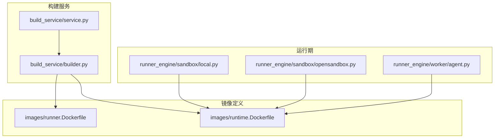
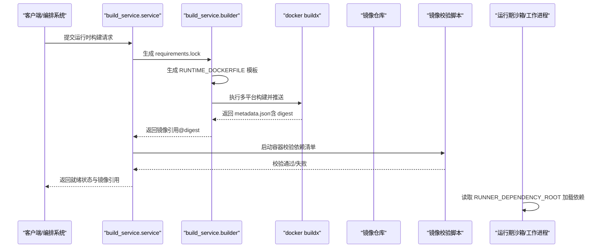
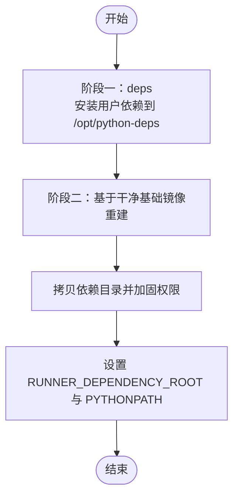
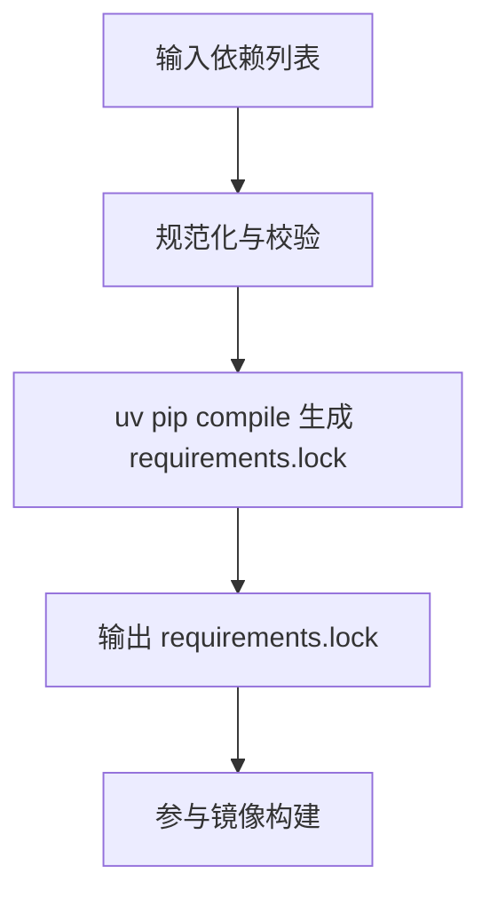
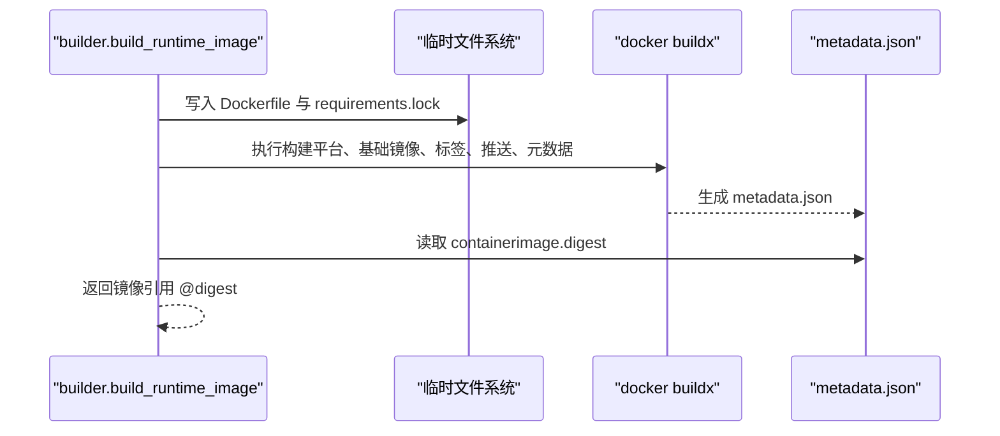
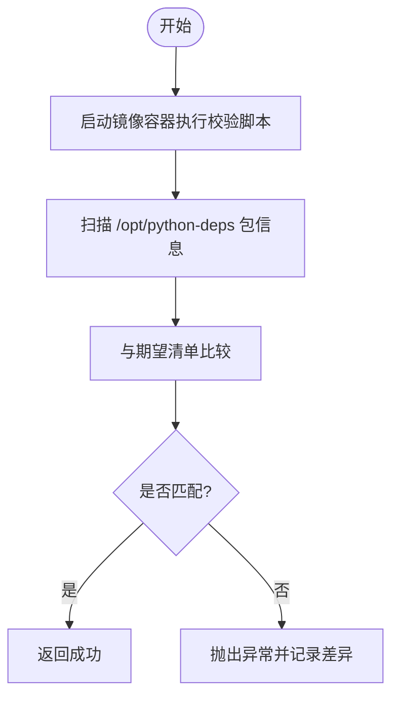
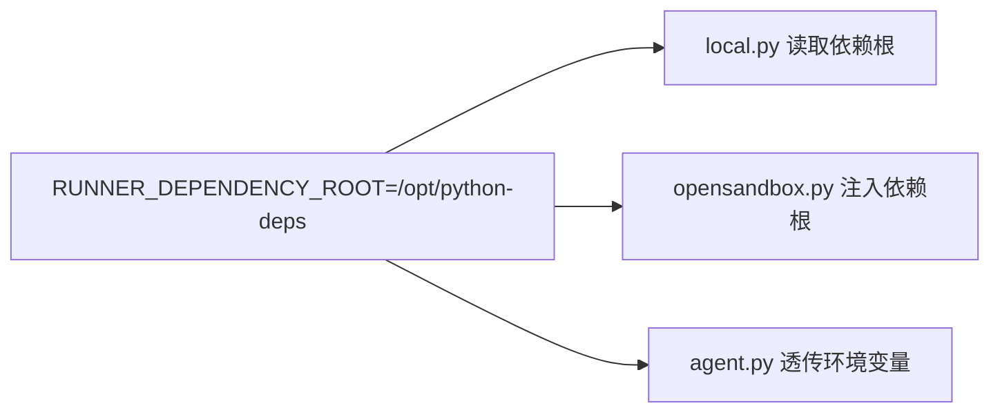
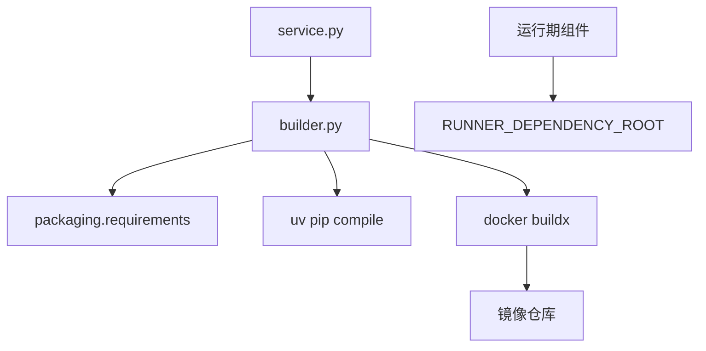

# 镜像构建

<cite>
**本文引用的文件**   
- [build_service/builder.py](file://build_service/builder.py)
- [build_service/service.py](file://build_service/service.py)
- [images/runner.Dockerfile](file://images/runner.Dockerfile)
- [images/runtime.Dockerfile](file://images/runtime.Dockerfile)
- [runner_engine/sandbox/local.py](file://runner_engine/sandbox/local.py)
- [runner_engine/sandbox/opensandbox.py](file://runner_engine/sandbox/opensandbox.py)
- [runner_engine/worker/agent.py](file://runner_engine/worker/agent.py)
</cite>

## 目录
1. [引言](#引言)
2. [项目结构](#项目结构)
3. [核心组件](#核心组件)
4. [架构总览](#架构总览)
5. [详细组件分析](#详细组件分析)
6. [依赖关系分析](#依赖关系分析)
7. [性能与优化](#性能与优化)
8. [故障排除指南](#故障排除指南)
9. [结论](#结论)

## 引言
本文面向 Runner Engine 的镜像构建系统，系统性说明运行时镜像的构建流程、多阶段构建策略、Dockerfile 模板生成、构建参数配置、buildx 构建器使用、镜像层优化、镜像验证机制以及运行期环境注入。文档同时提供可操作的构建配置示例、性能调优建议与常见问题排查方法，帮助读者快速理解并安全高效地构建和发布 Python 运行时镜像。

## 项目结构
Runner Engine 的镜像构建相关代码主要分布在以下位置：
- build_service：负责锁依赖生成、镜像构建、镜像校验等核心逻辑
- images：包含 runner 与 runtime 的基础 Dockerfile 参考实现
- runner_engine：在运行期读取 RUNNER_DEPENDENCY_ROOT 环境变量以加载用户依赖

图表来源
- [build_service/builder.py:122-158](file://build_service/builder.py#L122-L158)
- [build_service/service.py:180-215](file://build_service/service.py#L180-L215)
- [images/runner.Dockerfile:1-19](file://images/runner.Dockerfile#L1-L19)
- [images/runtime.Dockerfile:21-65](file://images/runtime.Dockerfile#L21-L65)
- [runner_engine/sandbox/local.py:42-42](file://runner_engine/sandbox/local.py#L42-L42)
- [runner_engine/sandbox/opensandbox.py:164-164](file://runner_engine/sandbox/opensandbox.py#L164-L164)
- [runner_engine/worker/agent.py:910-910](file://runner_engine/worker/agent.py#L910-L910)

章节来源
- [build_service/builder.py:122-158](file://build_service/builder.py#L122-L158)
- [build_service/service.py:180-215](file://build_service/service.py#L180-L215)
- [images/runner.Dockerfile:1-19](file://images/runner.Dockerfile#L1-L19)
- [images/runtime.Dockerfile:21-65](file://images/runtime.Dockerfile#L21-L65)

## 核心组件
- 运行时镜像构建器：负责将用户依赖锁定为 requirements.lock，动态生成 Dockerfile，调用 docker buildx 进行多平台构建与推送，并从元数据中解析镜像摘要。
- 镜像校验器：在镜像构建完成后启动容器，扫描 /opt/python-deps 下的包名与版本，与期望清单比对，确保依赖完整性。
- 运行期依赖注入：通过 RUNNER_DEPENDENCY_ROOT 环境变量将构建时安装的依赖路径注入到沙箱或工作进程环境中。

章节来源
- [build_service/builder.py:122-204](file://build_service/builder.py#L122-L204)
- [build_service/service.py:180-215](file://build_service/service.py#L180-L215)
- [runner_engine/sandbox/local.py:42-42](file://runner_engine/sandbox/local.py#L42-L42)
- [runner_engine/sandbox/opensandbox.py:164-164](file://runner_engine/sandbox/opensandbox.py#L164-L164)
- [runner_engine/worker/agent.py:910-910](file://runner_engine/worker/agent.py#L910-L910)

## 架构总览
下图展示了从“需求声明”到“镜像构建与验证”的端到端流程，以及运行期如何消费构建产物。

图表来源
- [build_service/service.py:180-215](file://build_service/service.py#L180-L215)
- [build_service/builder.py:84-119](file://build_service/builder.py#L84-L119)
- [build_service/builder.py:122-158](file://build_service/builder.py#L122-L158)
- [build_service/builder.py:161-204](file://build_service/builder.py#L161-L204)

## 详细组件分析

### RUNTIME_DOCKERFILE 模板与多阶段构建
RUNTIME_DOCKERFILE 模板采用两阶段构建：
- 第一阶段 deps：在基础镜像上安装用户依赖至 /opt/python-deps，禁用 pip 缓存以减少镜像体积。
- 第二阶段最终镜像：从干净的基础镜像重新构建，仅拷贝已安装的依赖，设置权限与关键环境变量。

关键点：
- 依赖安装阶段允许不可信依赖在此阶段执行，避免污染最终可信镜像。
- 最终镜像仅包含最小化依赖集合，并通过 chmod 加固只读与去写权限。
- 设置 RUNNER_DEPENDENCY_ROOT 指向依赖根目录，PYTHONPATH 仅指向受信任的应用路径，避免 Agent 误用用户依赖。

图表来源
- [build_service/builder.py:14-59](file://build_service/builder.py#L14-L59)
- [images/runtime.Dockerfile:21-65](file://images/runtime.Dockerfile#L21-L65)

章节来源
- [build_service/builder.py:14-59](file://build_service/builder.py#L14-L59)
- [images/runtime.Dockerfile:21-65](file://images/runtime.Dockerfile#L21-L65)

### 依赖锁定与 uv 编译
依赖锁定流程：
- 规范化用户依赖列表，拒绝 URL/VCS/path 依赖，保证可重复性。
- 使用 uv pip compile 生成带哈希的 requirements.lock，指定 Python 版本与平台，支持私有索引。
- 生成的 lock 文件随 Dockerfile 一起参与构建，确保构建与运行一致。

图表来源
- [build_service/builder.py:62-81](file://build_service/builder.py#L62-L81)
- [build_service/builder.py:84-119](file://build_service/builder.py#L84-L119)

章节来源
- [build_service/builder.py:62-119](file://build_service/builder.py#L62-L119)

### buildx 构建器与多平台构建
构建流程：
- 在临时目录写入 RUNTIME_DOCKERFILE 与 requirements.lock。
- 调用 docker buildx build，传入 --platform、--build-arg RUNNER_BASE、--tag、--push、--metadata-file。
- 解析 metadata.json 中的 containerimage.digest，返回镜像引用 registry_repo@sha256:...。

图表来源
- [build_service/builder.py:122-158](file://build_service/builder.py#L122-L158)

章节来源
- [build_service/builder.py:122-158](file://build_service/builder.py#L122-L158)

### 镜像层优化与安全加固
- 依赖安装阶段使用 --no-cache-dir 避免 pip 缓存进入镜像层，减小体积。
- 最终镜像对依赖目录执行 chmod -R a+rX 与 go-w，提升只读性与安全性。
- 通过多阶段构建隔离不可信依赖安装过程，减少攻击面。
- 环境变量 PYTHONPATH 仅指向受信任应用路径，防止 Agent 被用户依赖影响。

章节来源
- [build_service/builder.py:31-34](file://build_service/builder.py#L31-L34)
- [build_service/builder.py:51-58](file://build_service/builder.py#L51-L58)
- [images/runtime.Dockerfile:37-40](file://images/runtime.Dockerfile#L37-L40)
- [images/runtime.Dockerfile:57-64](file://images/runtime.Dockerfile#L57-L64)

### 镜像验证机制
镜像验证在构建完成后立即执行：
- 启动镜像容器，以 python -I 模式运行内嵌校验脚本。
- 扫描 /opt/python-deps 下所有包的 Name 与 Version，归一化后与期望清单对比。
- 若存在缺失或版本不一致，抛出异常并记录详细信息；否则返回成功统计。

图表来源
- [build_service/builder.py:161-204](file://build_service/builder.py#L161-L204)

章节来源
- [build_service/builder.py:161-204](file://build_service/builder.py#L161-L204)

### 运行期依赖注入与环境变量
运行期通过 RUNNER_DEPENDENCY_ROOT 环境变量定位用户依赖目录：
- 本地沙箱后端读取该环境变量，并将依赖加入导入路径。
- OpenSandbox 后端显式注入 RUNNER_DEPENDENCY_ROOT=/opt/python-deps。
- Worker Agent 在进程环境中透传该变量，确保子进程也能访问用户依赖。

图表来源
- [runner_engine/sandbox/local.py:42-42](file://runner_engine/sandbox/local.py#L42-L42)
- [runner_engine/sandbox/opensandbox.py:164-164](file://runner_engine/sandbox/opensandbox.py#L164-L164)
- [runner_engine/worker/agent.py:910-910](file://runner_engine/worker/agent.py#L910-L910)

章节来源
- [runner_engine/sandbox/local.py:42-42](file://runner_engine/sandbox/local.py#L42-L42)
- [runner_engine/sandbox/opensandbox.py:164-164](file://runner_engine/sandbox/opensandbox.py#L164-L164)
- [runner_engine/worker/agent.py:910-910](file://runner_engine/worker/agent.py#L910-L910)

### Runner 镜像与 Entrypoint
runner.Dockerfile 定义了 Runner 应用的运行镜像：
- 基于 slim Python 基础镜像，创建非 root 用户与目录结构。
- 复制 runner_engine 源码与 pyproject.toml，设置 PYTHONPATH。
- 入口点为 python -m runner_engine.worker.agent，作为运行期代理。

章节来源
- [images/runner.Dockerfile:1-19](file://images/runner.Dockerfile#L1-L19)

## 依赖关系分析
- build_service.service 协调构建与验证流程，调用 builder 完成依赖锁定、镜像构建与校验。
- builder 依赖 packaging.requirements 进行依赖规范化，依赖 uv 工具链生成 lock 文件。
- 构建产物通过 docker buildx 推送到镜像仓库，并以 digest 引用确保不可变性。
- 运行期组件通过环境变量读取依赖目录，无需修改 PYTHONPATH 全局路径。

图表来源
- [build_service/service.py:180-215](file://build_service/service.py#L180-L215)
- [build_service/builder.py:62-119](file://build_service/builder.py#L62-L119)
- [build_service/builder.py:122-158](file://build_service/builder.py#L122-L158)

章节来源
- [build_service/service.py:180-215](file://build_service/service.py#L180-L215)
- [build_service/builder.py:62-158](file://build_service/builder.py#L62-L158)

## 性能与优化
- 层缓存策略
  - 将 requirements.lock 单独 COPY，利用 Docker 层缓存加速依赖安装阶段。
  - 使用 --no-cache-dir 避免 pip 缓存污染层，提高后续构建的可预测性。
- 大小优化
  - 多阶段构建仅拷贝必要依赖，去除构建工具与中间文件。
  - 使用 slim 基础镜像与最小化依赖集合。
- 并行构建优化
  - 可通过 buildx 构建器特性启用并行构建（例如并发构建多个平台），结合 CI 流水线提升吞吐。
- 元数据收集
  - 使用 --metadata-file 收集镜像 digest 与构建信息，便于审计与回滚。
- 安全加固
  - 依赖目录权限收紧，PYTHONPATH 仅指向受信任路径，降低运行期风险。

[本节为通用指导，不直接分析具体文件]

## 故障排除指南
- 构建失败：检查 uv pip compile 是否可用、Python 版本与平台参数是否正确、私有索引是否可达。
- 镜像校验失败：确认期望包清单与实际 /opt/python-deps 内容一致，注意包名归一化规则。
- 运行期无法导入用户依赖：检查 RUNNER_DEPENDENCY_ROOT 是否设置且路径正确，确认依赖目录权限可读。
- 多平台构建问题：确认目标平台字符串格式正确，buildx 构建器已正确初始化。

章节来源
- [build_service/builder.py:84-119](file://build_service/builder.py#L84-L119)
- [build_service/builder.py:161-204](file://build_service/builder.py#L161-L204)
- [runner_engine/sandbox/local.py:42-42](file://runner_engine/sandbox/local.py#L42-L42)
- [runner_engine/sandbox/opensandbox.py:164-164](file://runner_engine/sandbox/opensandbox.py#L164-L164)

## 结论
Runner Engine 的镜像构建系统通过严格的依赖锁定、多阶段构建与 buildx 多平台构建能力，实现了安全、可重复、可审计的运行时镜像生产流程。配合镜像校验与运行期环境变量注入，确保了依赖完整性与运行一致性。遵循本文提供的优化与排错建议，可以进一步提升构建效率与稳定性。