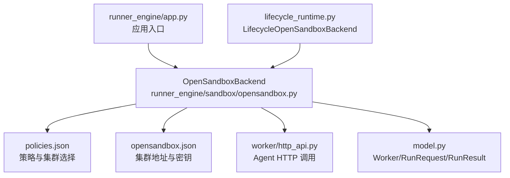
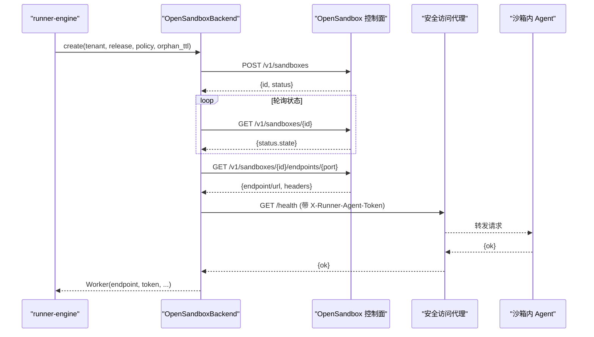
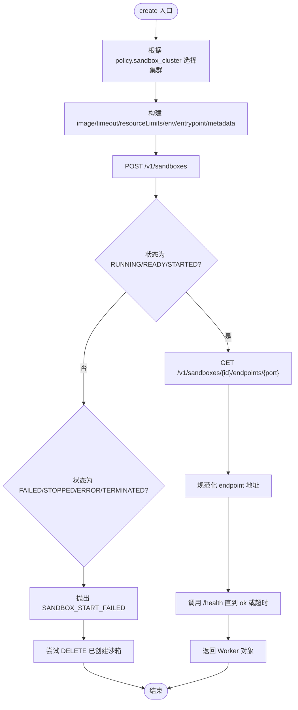
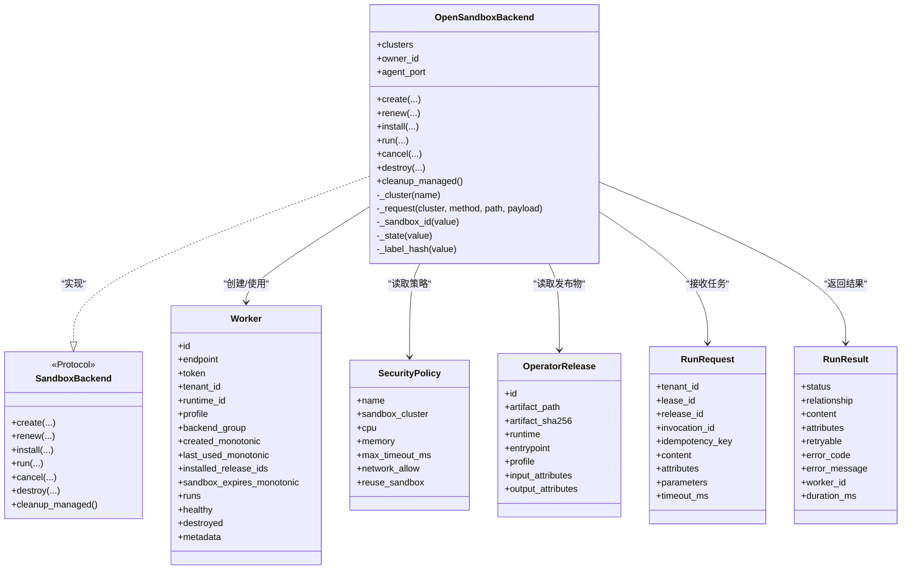

# OpenSandbox 集群后端

<cite>
**本文引用的文件**   
- [runner_engine/sandbox/opensandbox.py](file://runner_engine/sandbox/opensandbox.py)
- [runner_engine/sandbox/backend.py](file://runner_engine/sandbox/backend.py)
- [runner_engine/model.py](file://runner_engine/model.py)
- [runner_engine/worker/http_api.py](file://runner_engine/worker/http_api.py)
- [runner_engine/app.py](file://runner_engine/app.py)
- [runner_engine/lifecycle_runtime.py](file://runner_engine/lifecycle_runtime.py)
- [config/opensandbox.json](file://config/opensandbox.json)
- [config/policies.json](file://config/policies.json)
- [proto/runner.proto](file://proto/runner.proto)
- [infra/opensandbox/README.md](file://infra/opensandbox/README.md)
</cite>

## 目录
1. [简介](#简介)
2. [项目结构](#项目结构)
3. [核心组件](#核心组件)
4. [架构总览](#架构总览)
5. [详细组件分析](#详细组件分析)
6. [依赖关系分析](#依赖关系分析)
7. [性能与可扩展性](#性能与可扩展性)
8. [故障排查指南](#故障排查指南)
9. [结论](#结论)
10. [附录：部署与运维最佳实践](#附录部署与运维最佳实践)

## 简介
本文件面向 OpenSandbox 集群后端的实现与使用，重点解释 runner-engine 如何通过 OpenSandboxBackend 与 OpenSandbox 控制面进行 HTTP 通信，完成容器化沙箱的创建、启动、健康检查、资源续期、任务执行与销毁。文档同时说明集群配置、策略选择、负载均衡与健康检查机制，并给出监控、日志、扩缩容与运维建议。需要特别说明的是：当前代码中 runner-engine 与 OpenSandbox 控制面的通信为 HTTP JSON API；gRPC 协议定义存在于 proto/runner.proto，用于 NiFi 侧 ManagedPythonRunner 服务，并非 runner-engine 与 OpenSandbox 之间的直接通信协议。

## 项目结构
与 OpenSandbox 集群后端相关的核心路径如下：
- runner_engine/sandbox/opensandbox.py：OpenSandbox 后端实现，负责与 OpenSandbox 控制面交互、沙箱生命周期管理、代理健康检查与任务调用。
- runner_engine/sandbox/backend.py：后端抽象接口，统一 create/renew/install/run/cancel/destroy/cleanup_managed 能力。
- runner_engine/model.py：运行时模型（OperatorRelease、SecurityPolicy、Worker、RunRequest、RunResult 等）。
- runner_engine/worker/http_api.py：对沙箱内 agent 的 HTTP 调用封装。
- runner_engine/app.py：应用入口，加载集群配置、策略、初始化后端与生命周期池。
- runner_engine/lifecycle_runtime.py：扩展 OpenSandboxBackend，提供 list_managed 等管理能力。
- config/opensandbox.json：OpenSandbox 集群地址与密钥配置。
- config/policies.json：安全策略与集群选择映射。
- proto/runner.proto：NiFi 侧 gRPC 接口定义（非 runner-engine 到 OpenSandbox 的协议）。
- infra/opensandbox/README.md：OpenSandbox 部署与隔离组说明。

图表来源
- [runner_engine/app.py:87-96](file://runner_engine/app.py#L87-L96)
- [runner_engine/sandbox/opensandbox.py:31-50](file://runner_engine/sandbox/opensandbox.py#L31-L50)
- [runner_engine/worker/http_api.py:8-39](file://runner_engine/worker/http_api.py#L8-L39)
- [runner_engine/model.py:14-98](file://runner_engine/model.py#L14-L98)
- [runner_engine/lifecycle_runtime.py:123-153](file://runner_engine/lifecycle_runtime.py#L123-L153)

章节来源
- [runner_engine/app.py:26-96](file://runner_engine/app.py#L26-L96)
- [runner_engine/sandbox/opensandbox.py:31-50](file://runner_engine/sandbox/opensandbox.py#L31-L50)
- [runner_engine/sandbox/backend.py:14-49](file://runner_engine/sandbox/backend.py#L14-L49)
- [runner_engine/model.py:14-98](file://runner_engine/model.py#L14-L98)
- [runner_engine/worker/http_api.py:8-39](file://runner_engine/worker/http_api.py#L8-L39)
- [runner_engine/lifecycle_runtime.py:123-153](file://runner_engine/lifecycle_runtime.py#L123-L153)
- [config/opensandbox.json:1-11](file://config/opensandbox.json#L1-L11)
- [config/policies.json:1-19](file://config/policies.json#L1-L19)
- [proto/runner.proto:1-76](file://proto/runner.proto#L1-L76)
- [infra/opensandbox/README.md:1-27](file://infra/opensandbox/README.md#L1-L27)

## 核心组件
- OpenSandboxBackend：实现 SandboxBackend 协议，封装与 OpenSandbox 控制面的 HTTP 请求、沙箱创建、状态轮询、端点获取、agent 健康检查、安装工件、运行任务、取消任务、销毁沙箱以及清理托管资源。
- Worker：表示一个已创建的沙箱实例，包含 endpoint、token、租户信息、运行时标识、策略 profile、后端集群名、时间戳、元数据等。
- SecurityPolicy：决定 sandbox_cluster、CPU、内存、超时、网络允许列表、是否复用沙箱等。
- OperatorRelease：描述可执行发布物、镜像、入口、profile、输入输出属性等。
- RunRequest/RunResult：任务输入输出模型，包含内容、属性、参数、超时、重试标志、错误码、耗时等。
- LifecycleOpenSandboxBackend：在 OpenSandboxBackend 基础上增加 list_managed 能力，支持按 runtime_id 过滤列出受管沙箱。

章节来源
- [runner_engine/sandbox/backend.py:14-49](file://runner_engine/sandbox/backend.py#L14-L49)
- [runner_engine/sandbox/opensandbox.py:31-440](file://runner_engine/sandbox/opensandbox.py#L31-L440)
- [runner_engine/model.py:14-98](file://runner_engine/model.py#L14-L98)
- [runner_engine/lifecycle_runtime.py:123-153](file://runner_engine/lifecycle_runtime.py#L123-L153)

## 架构总览
OpenSandbox 后端通过 HTTP JSON API 与 OpenSandbox 控制面通信，创建 OCI 运行时沙箱，并通过安全访问代理暴露 agent 端口。runner-engine 在创建成功后轮询沙箱状态，直到 RUNNING/READY/STARTED，再获取 agent 端点并进行健康检查。随后通过 worker/http_api.py 向 agent 发送 /bootstrap、/run、/cancel 等请求。

图表来源
- [runner_engine/sandbox/opensandbox.py:141-290](file://runner_engine/sandbox/opensandbox.py#L141-L290)
- [runner_engine/worker/http_api.py:8-39](file://runner_engine/worker/http_api.py#L8-L39)

## 详细组件分析

### OpenSandboxBackend 类
职责与行为：
- 集群解析与请求封装：根据集群名称查找配置，构造 HTTP 请求，附加 OPEN-SANDBOX-API-KEY 头，处理 HTTP 错误与不可达异常，抛出 SandboxError。
- 沙箱 ID 与状态解析：兼容多种字段名与嵌套结构，提取 id 或 sandboxId 或 sandbox_id，标准化状态字符串。
- 创建流程：
  - 从 SecurityPolicy.sandbox_cluster 选择集群。
  - 生成随机 token，设置环境变量 RUNNER_AGENT_TOKEN/RUNNER_AGENT_PORT 等。
  - 设置 entrypoint 为 runner_engine.worker.agent，监听指定端口。
  - 添加 managed-by、runner-owner、tenant、runtime、profile 等标签。
  - 调用 POST /v1/sandboxes，等待 RUNNING/READY/STARTED，失败则抛错。
  - 获取 /endpoints/{port}，规范化 endpoint 地址，构造 Worker。
  - 通过 worker/http_api.py 调用 /health，直到 ok 或超时。
- 续期：POST /renew-expiration，更新 Worker 过期时间。
- 安装工件：调用 /bootstrap，上传 release artifact。
- 运行任务：调用 /run，返回 RunResult。
- 取消任务：调用 /cancel，返回 cancelled。
- 销毁：DELETE /v1/sandboxes/{id}，忽略 404。
- 清理托管资源：遍历所有集群，分页查询沙箱，按 managed-by 与 runner-owner 标签筛选并删除。

图表来源
- [runner_engine/sandbox/opensandbox.py:141-290](file://runner_engine/sandbox/opensandbox.py#L141-L290)

章节来源
- [runner_engine/sandbox/opensandbox.py:31-440](file://runner_engine/sandbox/opensandbox.py#L31-L440)

### SandboxBackend 协议
定义了统一的沙箱后端接口，包括 create/renew/install/run/cancel/destroy/cleanup_managed。OpenSandboxBackend 实现了该协议，便于替换其他后端实现。

章节来源
- [runner_engine/sandbox/backend.py:14-49](file://runner_engine/sandbox/backend.py#L14-L49)

### Worker 与相关模型
- Worker：承载沙箱实例的运行上下文，包括 endpoint、token、租户、运行时、profile、后端集群、时间戳、元数据、健康状态、销毁标记等。
- SecurityPolicy：决定集群、CPU、内存、超时、网络策略、是否复用沙箱。
- OperatorRelease：描述发布物、镜像、入口、profile、输入输出属性。
- RunRequest/RunResult：任务输入输出，包含内容、属性、参数、超时、重试标志、错误信息、耗时等。

章节来源
- [runner_engine/model.py:14-98](file://runner_engine/model.py#L14-L98)

### Agent HTTP 调用封装
- 封装了向沙箱内 agent 发起 HTTP 请求的能力，自动设置 X-Runner-Agent-Token 头，支持 extra_headers 透传（例如 OpenSandbox 安全访问代理返回的额外头部）。
- 对 HTTP 错误进行包装，抛出 RuntimeError。

章节来源
- [runner_engine/worker/http_api.py:8-39](file://runner_engine/worker/http_api.py#L8-L39)

### LifecycleOpenSandboxBackend
在 OpenSandboxBackend 基础上扩展 list_managed，支持按 runtime_id 过滤列出受管沙箱，分页遍历多个集群，兼容 items 或 sandboxes 两种响应格式。

章节来源
- [runner_engine/lifecycle_runtime.py:123-153](file://runner_engine/lifecycle_runtime.py#L123-L153)

### 应用入口与后端初始化
- app.py 加载 opensandbox.json 集群配置与 policies.json 策略。
- 初始化 LifecycleOpenSandboxBackend，注入 owner_id。
- 初始化 Quota 与 LifecycleWorkerPool，设置空闲回收、孤儿 TTL、续期阈值、每沙箱最大安装发布数等。
- 启动 LifecycleRunnerService 与后台清理任务。
- 可选启动 Admin HTTP 与 gRPC 服务。

章节来源
- [runner_engine/app.py:26-232](file://runner_engine/app.py#L26-L232)

## 依赖关系分析
OpenSandboxBackend 依赖：
- 配置层：opensandbox.json（集群 URL 与 API Key）、policies.json（策略与集群选择）。
- 模型层：Worker、OperatorRelease、SecurityPolicy、RunRequest、RunResult。
- 通信层：urllib.request 与 OpenSandbox 控制面 HTTP JSON API；worker/http_api.py 与沙箱内 agent HTTP API。
- 生命周期层：LifecycleOpenSandboxBackend 扩展管理能力。

图表来源
- [runner_engine/sandbox/opensandbox.py:31-440](file://runner_engine/sandbox/opensandbox.py#L31-L440)
- [runner_engine/sandbox/backend.py:14-49](file://runner_engine/sandbox/backend.py#L14-L49)
- [runner_engine/model.py:14-98](file://runner_engine/model.py#L14-L98)

章节来源
- [runner_engine/sandbox/opensandbox.py:31-440](file://runner_engine/sandbox/opensandbox.py#L31-L440)
- [runner_engine/sandbox/backend.py:14-49](file://runner_engine/sandbox/backend.py#L14-L49)
- [runner_engine/model.py:14-98](file://runner_engine/model.py#L14-L98)

## 性能与可扩展性
- 并发与配额：app.py 中通过 Quota 限制最大创建中实例数、在线实例总数与租户级在线实例上限，避免资源过载。
- 沙箱复用：SecurityPolicy.reuse_sandbox 控制是否复用已有沙箱，减少冷启动开销。
- 健康检查与超时：创建时轮询沙箱状态与 agent 健康，设置合理超时，避免长时间阻塞。
- 续期机制：renew 延长沙箱过期时间，配合 idle_seconds 与 orphan_ttl_seconds 控制生命周期。
- 批量清理：cleanup_managed 与 list_managed 支持分页遍历，按标签筛选受管资源，降低误删风险。

[本节为通用性能讨论，不直接分析具体文件]

## 故障排查指南
常见错误与定位要点：
- UNKNOWN_SANDBOX_CLUSTER：集群名称不存在于 opensandbox.json。
- OPENSANDBOX_HTTP：OpenSandbox 控制面返回 HTTP 错误，检查 api_key、URL、网络连通性与鉴权。
- OPENSANDBOX_UNREACHABLE：无法连接 OpenSandbox 控制面，检查 DNS、防火墙、TLS 与代理配置。
- SANDBOX_START_FAILED：沙箱进入失败状态，查看 OpenSandbox 控制面日志与镜像拉取情况。
- SANDBOX_START_TIMEOUT：沙箱未在预期时间内就绪，检查镜像大小、资源不足、调度延迟。
- SANDBOX_ENDPOINT_MISSING：未返回有效 endpoint，检查 OpenSandbox 端点暴露与安全访问代理配置。
- AGENT_START_TIMEOUT：agent 健康检查失败，检查 runner_engine.worker.agent 启动参数、端口占用、网络可达性。
- 404 忽略：destroy 时对 404 静默处理，避免重复销毁报错。

章节来源
- [runner_engine/sandbox/opensandbox.py:52-110](file://runner_engine/sandbox/opensandbox.py#L52-L110)
- [runner_engine/sandbox/opensandbox.py:192-290](file://runner_engine/sandbox/opensandbox.py#L192-L290)
- [runner_engine/sandbox/opensandbox.py:389-400](file://runner_engine/sandbox/opensandbox.py#L389-L400)

## 结论
OpenSandboxBackend 以 HTTP JSON API 与 OpenSandbox 控制面交互，结合策略与配额管理，实现多集群、多隔离级别的沙箱编排。其设计强调可控的生命周期、严格的鉴权与标签管理、健壮的错误处理与可观测性。gRPC 协议定义位于 proto/runner.proto，服务于 NiFi 侧 ManagedPythonRunner 服务，而非 runner-engine 与 OpenSandbox 的直接通信协议。实际部署应遵循私有网络与安全访问代理的最佳实践，确保控制面与 worker 端点的安全隔离。

[本节为总结性内容，不直接分析具体文件]

## 附录：部署与运维最佳实践
- 集群与隔离级别：
  - 为不同隔离级别部署独立的 OpenSandbox 控制平面，例如 gVisor 与 Kata 分别对应 opensandbox-gvisor 与 opensandbox-kata。
  - 在 policies.json 中将标准与加固策略映射到对应集群。
- 安全与鉴权：
  - 为每个集群配置 OPEN-SANDBOX-API-KEY，并在 runner-engine 的 opensandbox.json 中正确填写。
  - 将 OpenSandbox 控制面与 worker 端点置于私有网络，启用 secureAccess，并透传代理返回的额外头部。
- 扩缩容策略：
  - 调整 Quota 参数（RUNNER_MAX_CREATING、RUNNER_MAX_LIVE、RUNNER_MAX_LIVE_PER_TENANT）控制并发与在线实例。
  - 调整 RUNNER_WORKER_IDLE_SECONDS、RUNNER_SANDBOX_ORPHAN_TTL_SECONDS、RUNNER_SANDBOX_RENEW_BEFORE_SECONDS 控制沙箱生命周期与续期。
  - 调整 RUNNER_MAX_RELEASES_PER_SANDBOX 控制每沙箱最大安装发布数。
- 监控与日志：
  - 使用 LifecycleOpenSandboxBackend.list_managed 定期巡检受管沙箱，结合 OpenSandbox 控制面日志与 runner-engine 日志进行问题定位。
  - 关注健康检查与超时错误，及时优化镜像体积与资源配额。
- 备份与一致性：
  - 沙箱状态由 OpenSandbox 控制面管理，runner-engine 仅维护 Worker 元数据与本地状态；持久化与一致性由 OpenSandbox 控制面保障。
  - 如需跨集群迁移，需确保各集群镜像仓库一致，策略与密钥同步。

章节来源
- [infra/opensandbox/README.md:1-27](file://infra/opensandbox/README.md#L1-L27)
- [config/opensandbox.json:1-11](file://config/opensandbox.json#L1-L11)
- [config/policies.json:1-19](file://config/policies.json#L1-L19)
- [runner_engine/app.py:87-154](file://runner_engine/app.py#L87-L154)
- [runner_engine/lifecycle_runtime.py:123-153](file://runner_engine/lifecycle_runtime.py#L123-L153)