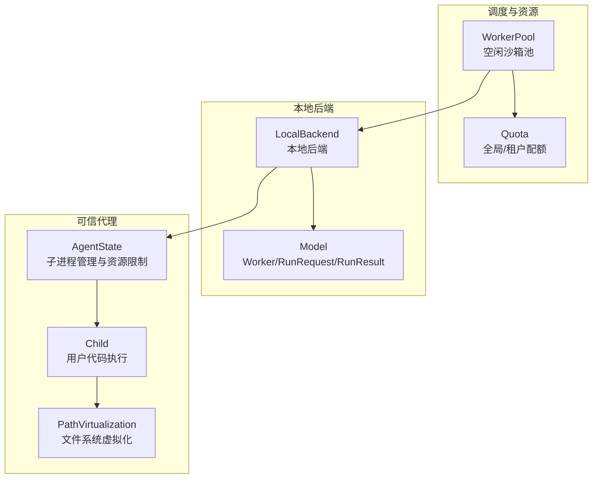
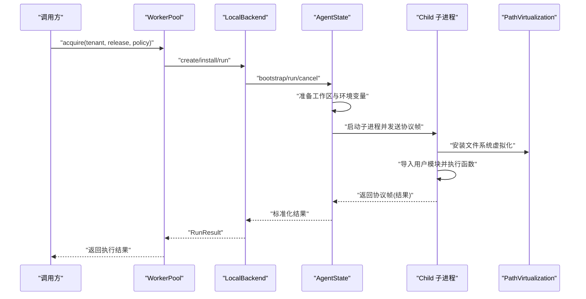
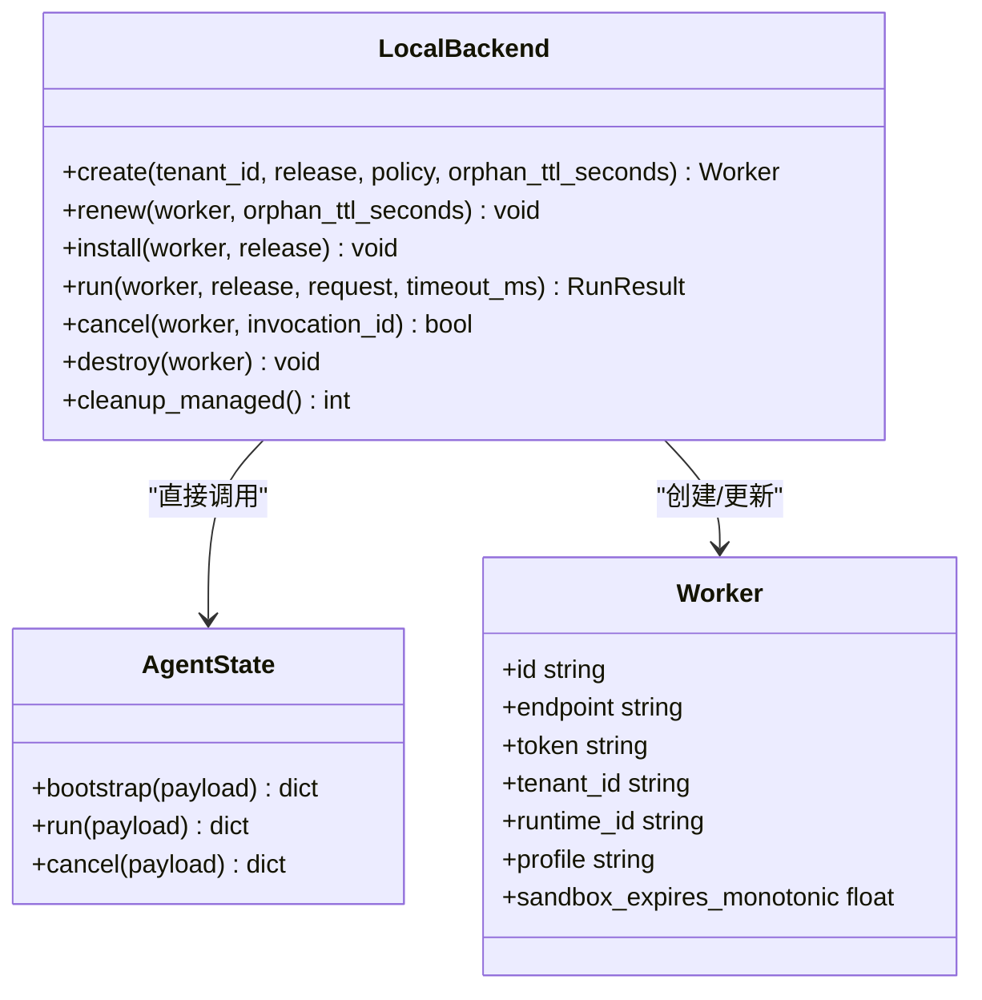
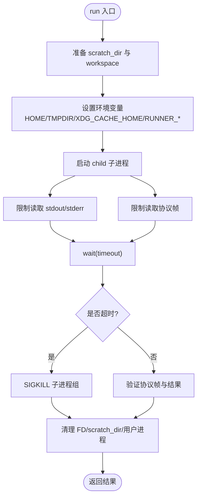
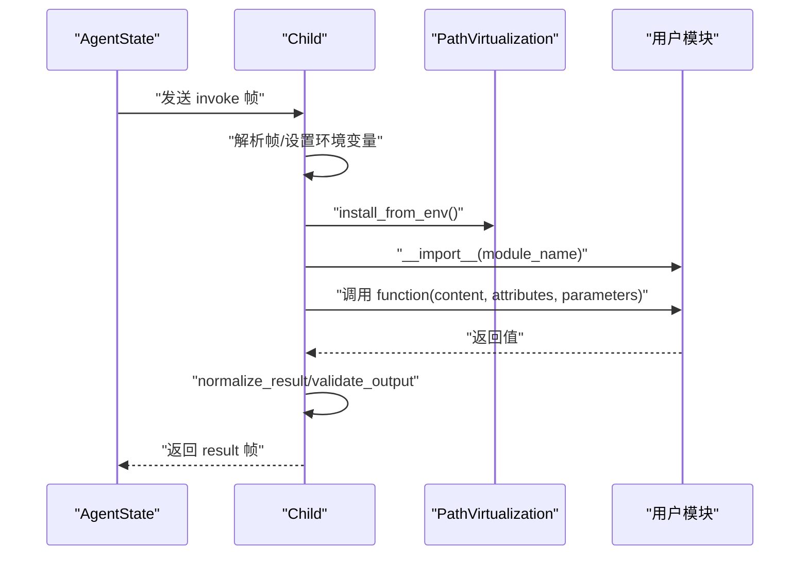
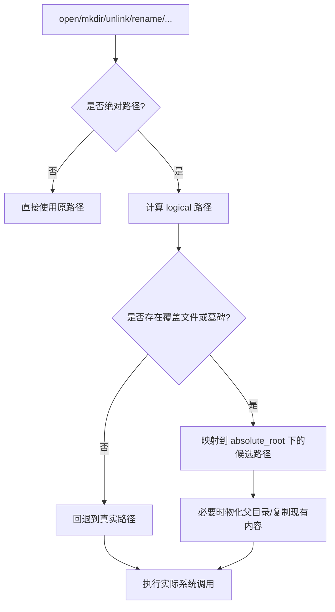
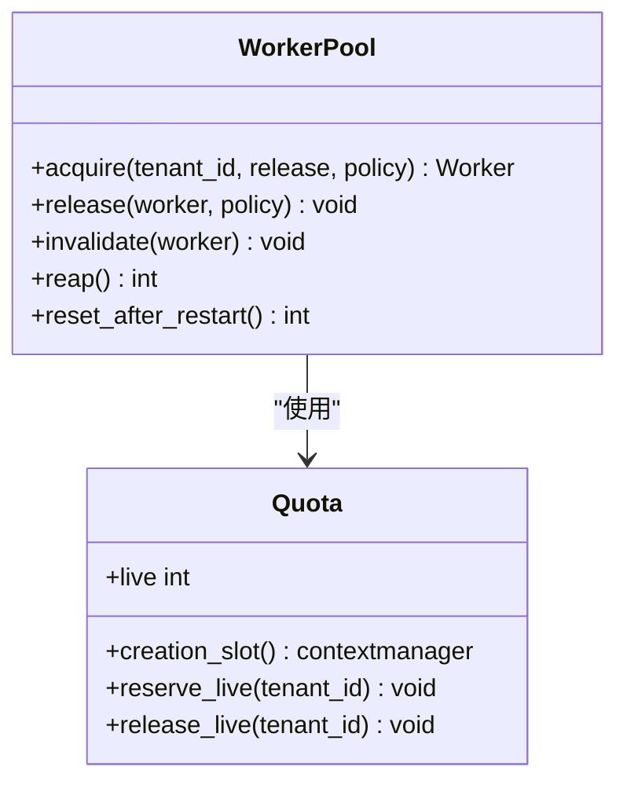
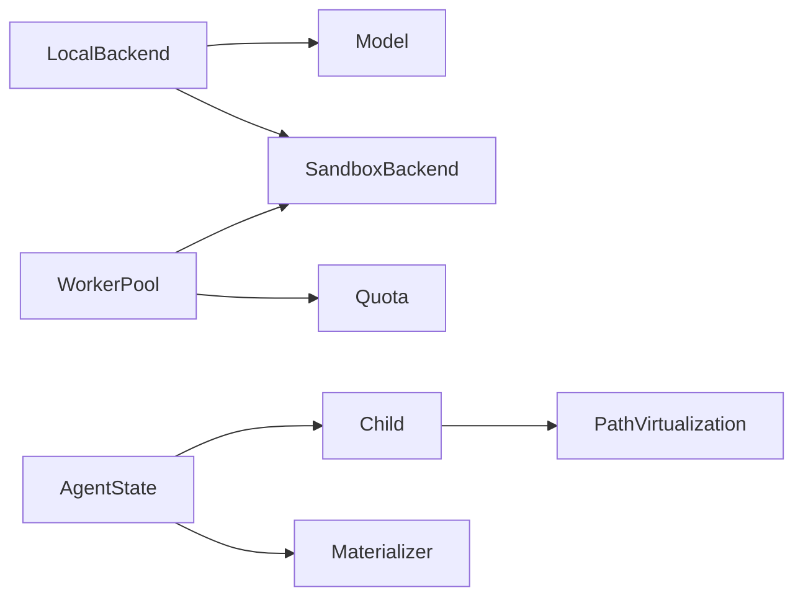
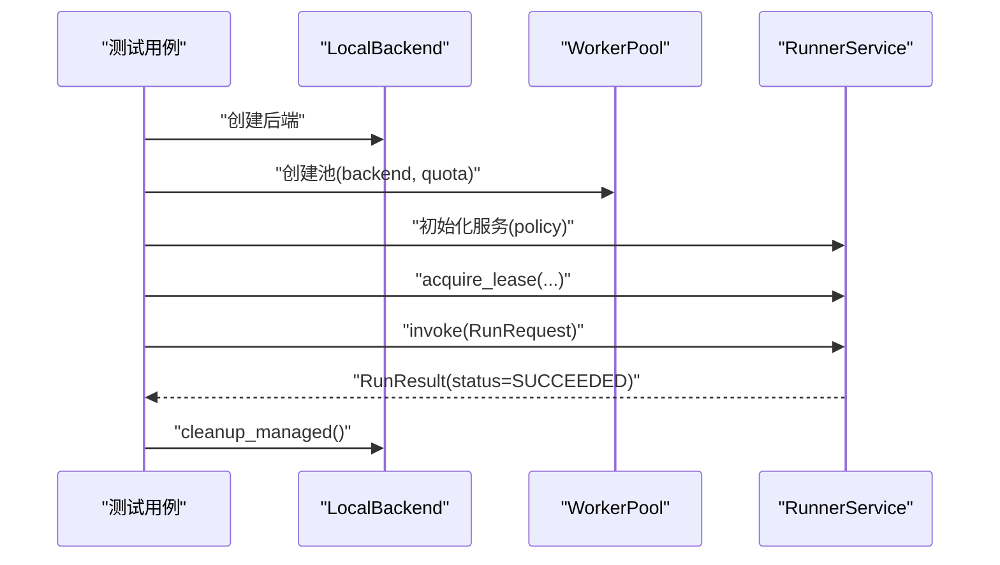

# 本地沙箱实现

<cite>
**本文引用的文件 **
- [local.py](file://runner_engine/sandbox/local.py)
- [backend.py](file://runner_engine/sandbox/backend.py)
- [agent.py](file://runner_engine/worker/agent.py)
- [child.py](file://runner_engine/worker/child.py)
- [path_virtualization.py](file://runner_engine/worker/path_virtualization.py)
- [pool.py](file://runner_engine/pool.py)
- [quota.py](file://runner_engine/quota.py)
- [model.py](file://runner_engine/model.py)
- [test_end_to_end_local.py](file://tests/test_end_to_end_local.py)
</cite>

## 目录
1. [简介](#简介)
2. [项目结构](#项目结构)
3. [核心组件](#核心组件)
4. [架构总览](#架构总览)
5. [详细组件分析](#详细组件分析)
6. [依赖关系分析](#依赖关系分析)
7. [性能与适用场景](#性能与适用场景)
8. [配置调优指南](#配置调优指南)
9. [使用示例](#使用示例)
10. [故障排查](#故障排查)
11. [结论](#结论)

## 简介
本文面向“本地沙箱”实现，重点解释 LocalBackend（在仓库中作为本地后端）如何创建、管理并执行用户算子。需要特别强调：LocalBackend 明确声明为开发/测试后端，并非安全沙箱；真正的进程隔离、资源限制和文件系统虚拟化由 AgentState 与 child 子进程协作完成。

- 进程隔离：通过独立子进程运行用户代码，AgentState 负责子进程生命周期、信号处理与清理。
- 文件系统虚拟化：通过 path_virtualization 模块对 Python 层文件系统 API 进行拦截，将绝对路径写入重定向到调用工作区，避免污染宿主或容器根文件系统。
- 本地资源管理：WorkerPool 按租户、运行时镜像与安全策略维护空闲沙箱池；Quota 控制全局与租户级并发与存活上限。
- 内存与 CPU：child 侧通过环境变量设置 RLIMIT_CPU、RLIMIT_AS 等系统限制；Agent 侧还限制日志输出、协议帧大小与超时。
- 监控与回收：WorkerPool 基于 idle/orphan TTL 回收；Agent 侧在退出时清理临时目录与残留用户进程。

## 项目结构
与本地沙箱直接相关的代码集中在以下位置：
- runner_engine/sandbox/local.py：本地后端实现，负责 Worker 元数据、临时目录与 AgentState 的本地内联调用。
- runner_engine/worker/agent.py：可信代理，负责安装发布包、准备工作区、启动 child 子进程、读写协议、资源限制与清理。
- runner_engine/worker/child.py：受限子进程入口，加载用户模块、执行函数、规范化结果并返回。
- runner_engine/worker/path_virtualization.py：Python 层文件系统兼容层，实现绝对路径重写、虚拟目录与墓碑机制。
- runner_engine/pool.py：Warm 沙箱池，按租户+运行时+策略复用 Worker。
- runner_engine/quota.py：全局与租户级配额控制。
- runner_engine/model.py：Worker、RunRequest、RunResult、SecurityPolicy 等核心数据结构。
- tests/test_end_to_end_local.py：端到端测试，演示 LocalBackend + WorkerPool + RunnerService 的使用。

**图表来源**
- [pool.py:11-188](file://runner_engine/pool.py#L11-L188)
- [quota.py:9-61](file://runner_engine/quota.py#L9-L61)
- [local.py:14-132](file://runner_engine/sandbox/local.py#L14-L132)
- [agent.py:309-798](file://runner_engine/worker/agent.py#L309-L798)
- [child.py:272-344](file://runner_engine/worker/child.py#L272-L344)
- [path_virtualization.py:62-171](file://runner_engine/worker/path_virtualization.py#L62-L171)

**章节来源**
- [local.py:14-132](file://runner_engine/sandbox/local.py#L14-L132)
- [agent.py:309-798](file://runner_engine/worker/agent.py#L309-L798)
- [child.py:272-344](file://runner_engine/worker/child.py#L272-L344)
- [path_virtualization.py:62-171](file://runner_engine/worker/path_virtualization.py#L62-L171)
- [pool.py:11-188](file://runner_engine/pool.py#L11-L188)
- [quota.py:9-61](file://runner_engine/quota.py#L9-L61)
- [model.py:14-98](file://runner_engine/model.py#L14-L98)

## 核心组件
- LocalBackend：本地后端，不启动真实子进程，而是直接操作 AgentState 以模拟远程 Agent 的行为；同时创建临时目录作为 Worker 的工作空间。
- AgentState：可信代理，负责发布包安装、工作区准备、子进程启动、协议通信、资源限制、日志与输出限制、取消与清理。
- Child：受限子进程，加载用户模块并执行指定函数，规范化返回值，应用文件系统虚拟化。
- PathVirtualization：Python 层文件系统兼容层，将绝对路径写操作重定向到 invocation_root/absolute，读优先使用覆盖文件，否则回退到真实路径。
- WorkerPool：按 tenant_id + runtime.id + profile 键维护空闲 Worker，支持 TTL 续期、释放与回收。
- Quota：限制全局与租户级最大存活沙箱数，以及创建并发度。
- Model：定义 Worker、RunRequest、RunResult、SecurityPolicy 等数据结构。

**章节来源**
- [local.py:14-132](file://runner_engine/sandbox/local.py#L14-L132)
- [agent.py:309-798](file://runner_engine/worker/agent.py#L309-L798)
- [child.py:272-344](file://runner_engine/worker/child.py#L272-L344)
- [path_virtualization.py:62-171](file://runner_engine/worker/path_virtualization.py#L62-L171)
- [pool.py:11-188](file://runner_engine/pool.py#L11-L188)
- [quota.py:9-61](file://runner_engine/quota.py#L9-L61)
- [model.py:14-98](file://runner_engine/model.py#L14-L98)

## 架构总览
下图展示从请求到执行的完整流程：WorkerPool 选择或创建 Worker，LocalBackend 将请求转交给 AgentState，AgentState 启动 child 子进程执行用户代码，并通过管道与 child 交换协议帧。

**图表来源**
- [pool.py:73-130](file://runner_engine/pool.py#L73-L130)
- [local.py:24-111](file://runner_engine/sandbox/local.py#L24-L111)
- [agent.py:467-798](file://runner_engine/worker/agent.py#L467-L798)
- [child.py:272-344](file://runner_engine/worker/child.py#L272-L344)
- [path_virtualization.py:258-270](file://runner_engine/worker/path_virtualization.py#L258-L270)

## 详细组件分析

### LocalBackend：本地后端
- 职责
  - 生成 Worker ID、token 与临时目录。
  - 构造 AgentState，注入 releases_root、invocations_root、dependency_root、UID/GID 等。
  - 提供 create/renew/install/run/cancel/destroy/cleanup_managed 接口，适配 SandboxBackend 协议。
- 关键行为
  - create：分配临时目录，设置权限，构造 Worker 对象，设置过期时间。
  - install：读取发布包 artifact，调用 AgentState.bootstrap 安装并发布 manifest。
  - run：封装 RunRequest 为 AgentState.run 的参数，解码 RunResult。
  - destroy/cleanup_managed：清理临时目录。
- 安全说明
  - 类注释明确指出这是开发/测试后端，不是安全沙箱。

**图表来源**
- [local.py:14-132](file://runner_engine/sandbox/local.py#L14-L132)
- [agent.py:309-368](file://runner_engine/worker/agent.py#L309-L368)
- [model.py:73-98](file://runner_engine/model.py#L73-L98)

**章节来源**
- [local.py:14-132](file://runner_engine/sandbox/local.py#L14-L132)

### AgentState：可信代理与进程管理
- 职责
  - 安装 OperatorRelease 到 releases_root。
  - 为每次调用准备 scratch_dir（home/tmp/cache/absolute/workspace）。
  - 启动 child 子进程，通过管道传递请求与结果。
  - 限制日志输出、协议帧大小、超时与信号处理。
  - 清理子进程组、用户进程与临时目录。
- 关键行为
  - bootstrap：校验 manifest id，缓存发布包路径与清单。
  - run：创建工作区，设置环境变量，启动 child，等待结果，处理超时、取消、日志溢出、协议错误。
  - cancel：标记取消事件，向子进程组发送 SIGKILL。
  - _prepare_scratch/_prepare_runtime_workspace：准备只写工作区，复制 runtime 目录并赋权。
- 资源限制
  - 通过环境变量向 child 传递 UID/GID、NPROC、NOFILE、CPU_SECONDS、ADDRESS_SPACE_BYTES。
  - 限制 stdout/stderr 最大字节数，超过则终止子进程组。
  - 限制协议帧大小，防止内存膨胀。

**图表来源**
- [agent.py:467-798](file://runner_engine/worker/agent.py#L467-L798)

**章节来源**
- [agent.py:309-798](file://runner_engine/worker/agent.py#L309-L798)

### Child：受限子进程与用户代码执行
- 职责
  - 解析协议帧，加载用户模块，调用 entrypoint 函数。
  - 规范化返回值，校验 attributes、status、relationship、error_code/message。
  - 应用文件系统虚拟化，限制输出大小。
- 关键行为
  - execute：设置 sys.path，安装 path_virtualization，导入用户模块，调用目标函数，规范化结果。
  - main：解析命令行参数，建立请求/结果 FD，设置 NO_NEW_PRIVS 与资源限制，循环读取请求并返回结果。
- 安全加固
  - PR_SET_NO_NEW_PRIVS。
  - 限制 core dump、NOFILE、NPROC、CPU、地址空间。
  - 若以 root 运行，降权到 child_uid/child_gid。

**图表来源**
- [child.py:272-344](file://runner_engine/worker/child.py#L272-L344)
- [child.py:347-413](file://runner_engine/worker/child.py#L347-L413)
- [path_virtualization.py:723-739](file://runner_engine/worker/path_virtualization.py#L723-L739)

**章节来源**
- [child.py:272-413](file://runner_engine/worker/child.py#L272-L413)

### PathVirtualization：文件系统虚拟化
- 设计目标
  - 相对路径保持正常 cwd 语义。
  - 绝对写操作重定向到 invocation_root/absolute/<original absolute path>。
  - 绝对读优先使用 invocation-local 版本，不存在则回退到真实容器路径。
  - 明确声明这不是 OS 沙箱；原生代码或绕过 Python 文件系统 API 的子进程仍能看到真实容器文件系统。
- 关键机制
  - 安装/卸载：替换 builtins.open、io.open、os.* 等方法。
  - 逻辑路径计算：将绝对路径映射到 virtual namespace，排除 invocation_root 自身。
  - 墓碑机制：删除操作记录 tombstones，listdir/stat 时隐藏已删除项。
  - 父目录物化：写入前自动创建必要父目录。
  - 符号链接保护：禁止在虚拟绝对路径中使用绝对符号链接目标，防止逃逸。
  - chdir/getcwd：将 cwd 映射到虚拟命名空间，保证相对路径一致性。

**图表来源**
- [path_virtualization.py:62-171](file://runner_engine/worker/path_virtualization.py#L62-L171)
- [path_virtualization.py:181-241](file://runner_engine/worker/path_virtualization.py#L181-L241)
- [path_virtualization.py:288-320](file://runner_engine/worker/path_virtualization.py#L288-L320)
- [path_virtualization.py:322-359](file://runner_engine/worker/path_virtualization.py#L322-L359)
- [path_virtualization.py:481-515](file://runner_engine/worker/path_virtualization.py#L481-L515)
- [path_virtualization.py:553-597](file://runner_engine/worker/path_virtualization.py#L553-L597)
- [path_virtualization.py:685-717](file://runner_engine/worker/path_virtualization.py#L685-L717)

**章节来源**
- [path_virtualization.py:62-739](file://runner_engine/worker/path_virtualization.py#L62-L739)

### WorkerPool 与 Quota：沙箱池与配额
- WorkerPool
  - 按 tenant_id + runtime.id + profile 键组织空闲 Worker。
  - 支持 idle_seconds、orphan_ttl_seconds、renew_before_seconds、max_installed_releases。
  - acquire：查找可用 Worker，必要时创建新 Worker；确保 release 已安装。
  - release：根据 policy.reuse_sandbox 决定是否放回空闲池。
  - reap：定期清理过期空闲 Worker。
  - reset_after_restart：重启后销毁遗留 Worker，并调用 backend.cleanup_managed。
- Quota
  - max_creating：限制同时创建的沙箱数量。
  - max_live：限制全局最大存活沙箱数。
  - max_live_per_tenant：限制每个租户的最大存活沙箱数。
  - reserve_live/release_live：申请与释放配额。

**图表来源**
- [pool.py:11-188](file://runner_engine/pool.py#L11-L188)
- [quota.py:9-61](file://runner_engine/quota.py#L9-L61)

**章节来源**
- [pool.py:11-188](file://runner_engine/pool.py#L11-L188)
- [quota.py:9-61](file://runner_engine/quota.py#L9-L61)

## 依赖关系分析
- LocalBackend 依赖 SandboxBackend 协议与 model 中的 Worker/RunRequest/RunResult。
- AgentState 依赖 materialize.ReleaseMaterializer 安装发布包，依赖 child.py 执行用户代码。
- Child 依赖 path_virtualization 进行文件系统兼容。
- WorkerPool 依赖 Quota 与 SandboxBackend。
- 所有组件共享 model.py 中的数据结构。

**图表来源**
- [backend.py:14-49](file://runner_engine/sandbox/backend.py#L14-L49)
- [local.py:14-132](file://runner_engine/sandbox/local.py#L14-L132)
- [agent.py:23-24](file://runner_engine/worker/agent.py#L23-L24)
- [child.py:258-270](file://runner_engine/worker/child.py#L258-L270)
- [pool.py:11-188](file://runner_engine/pool.py#L11-L188)
- [quota.py:9-61](file://runner_engine/quota.py#L9-L61)
- [model.py:14-98](file://runner_engine/model.py#L14-L98)

**章节来源**
- [backend.py:14-49](file://runner_engine/sandbox/backend.py#L14-L49)
- [local.py:14-132](file://runner_engine/sandbox/local.py#L14-L132)
- [agent.py:23-24](file://runner_engine/worker/agent.py#L23-L24)
- [child.py:258-270](file://runner_engine/worker/child.py#L258-L270)
- [pool.py:11-188](file://runner_engine/pool.py#L11-L188)
- [quota.py:9-61](file://runner_engine/quota.py#L9-L61)
- [model.py:14-98](file://runner_engine/model.py#L14-L98)

## 性能与适用场景
- 性能特点
  - 本地后端无网络开销，适合开发与测试。
  - WorkerPool 复用空闲 Worker，减少重复创建成本。
  - AgentState 单实例仅允许一个活跃调用，避免竞争，简化状态管理。
  - 文件系统虚拟化在 Python 层实现，避免频繁系统调用带来的额外开销，但会引入路径映射与复制逻辑。
- 适用场景
  - 本地调试、CI 环境、小规模批处理。
  - 不需要强隔离的生产环境建议使用 OpenSandbox 后端。
- 不适用场景
  - 多租户强隔离、跨主机调度、严格资源隔离的生产负载。

[本节为通用指导，不直接分析具体文件]

## 配置调优指南
- WorkerPool 参数
  - idle_seconds：空闲超时，建议大于典型调用间隔。
  - orphan_ttl_seconds：孤儿 TTL，应明显大于 idle_seconds。
  - renew_before_seconds：提前续期阈值，建议小于 orphna_ttl_seconds。
  - max_installed_releases：单个 Worker 可安装的最大发布包数量。
- Quota 参数
  - max_creating：限制并发创建数，避免瞬时压力。
  - max_live：全局最大存活沙箱数。
  - max_live_per_tenant：租户级上限，防止单租户独占。
- Agent/Child 环境变量
  - RUNNER_CHILD_UID/GID：子进程用户/组，默认非 root。
  - RUNNER_CHILD_NPROC/NOFILE：限制进程数与文件描述符。
  - RUNNER_CHILD_CPU_SECONDS：CPU 时间限制，通常基于超时计算。
  - RUNNER_CHILD_ADDRESS_SPACE_BYTES：可选地址空间限制。
  - RUNNER_MAX_OUTPUT_BYTES/MAX_ATTRIBUTES/MAX_ATTRIBUTE_BYTES：输出与属性大小限制。
- 文件系统虚拟化
  - 避免在用户代码中使用绝对符号链接指向宿主机敏感路径。
  - 尽量使用相对路径或 invocation_root 下的路径。

**章节来源**
- [pool.py:19-43](file://runner_engine/pool.py#L19-L43)
- [quota.py:12-27](file://runner_engine/quota.py#L12-L27)
- [agent.py:546-568](file://runner_engine/worker/agent.py#L546-L568)
- [child.py:55-84](file://runner_engine/worker/child.py#L55-L84)
- [path_virtualization.py:606-635](file://runner_engine/worker/path_virtualization.py#L606-L635)

## 使用示例
以下示例来自端到端测试，展示如何使用 LocalBackend、WorkerPool、RunnerService 执行一次调用。

- 步骤
  - 创建 LocalBackend 与 Quota。
  - 初始化 WorkerPool。
  - 初始化 RunnerService，绑定 SecurityPolicy。
  - 获取租约并调用 invoke。
  - 断言结果为 SUCCEEDED，内容与属性符合预期。
  - 调用 backend.cleanup_managed 清理临时目录。

**图表来源**
- [test_end_to_end_local.py:9-32](file://tests/test_end_to_end_local.py#L9-L32)

**章节来源**
- [test_end_to_end_local.py:9-32](file://tests/test_end_to_end_local.py#L9-L32)

## 故障排查
- 常见错误码与含义
  - AGENT_BUSY：沙箱已有活跃调用，重试。
  - TIMEOUT：用户代码执行超时，检查业务逻辑与超时配置。
  - LOG_LIMIT：stdout/stderr 超出限制，优化日志输出。
  - CHILD_PROTOCOL_ERROR：协议帧无效或超限，检查返回结构与大小。
  - USER_PROCESS_SIGNALED/CPU_LIMIT：子进程被信号终止，检查 CPU 限制与异常。
  - USER_IMPORT_ERROR/ENTRYPOINT_NOT_FOUND：用户模块导入失败或入口未找到，检查模块路径与 manifest.entrypoint。
  - INVALID_USER_RESULT：返回值不符合规范，检查 status/attributes/retryable/relationship。
  - OUTPUT_LIMIT：输出或属性大小超限，调整 RUNNER_MAX_* 环境变量。
- 排查建议
  - 查看 stderr_tail 与 duration_ms，定位超时或崩溃点。
  - 检查环境变量是否正确传递，尤其是 RUNNER_RUNTIME_ROOT 与 RUNNER_INVOCATION_ROOT。
  - 确认文件系统虚拟化是否阻止了期望的绝对路径访问。
  - 检查 WorkerPool 与 Quota 配置，避免资源耗尽。
  - 使用 cleanup_managed 清理残留临时目录。

**章节来源**
- [agent.py:467-798](file://runner_engine/worker/agent.py#L467-L798)
- [child.py:272-344](file://runner_engine/worker/child.py#L272-L344)
- [local.py:78-111](file://runner_engine/sandbox/local.py#L78-L111)

## 结论
本地沙箱实现以 LocalBackend 为入口，结合 AgentState 与 child 子进程，提供了轻量级的进程隔离与文件系统虚拟化能力。WorkerPool 与 Quota 共同保障资源复用与配额控制。该实现适用于开发与测试场景；生产环境建议使用具备更强隔离能力的 OpenSandbox 后端。通过合理配置 WorkerPool、Quota 与 child 环境变量，可在性能、稳定性与安全性之间取得平衡。

[本节为总结性内容，不直接分析具体文件]