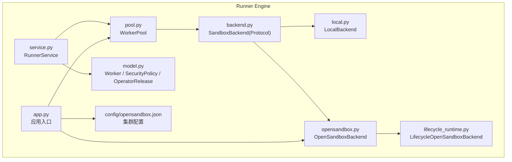
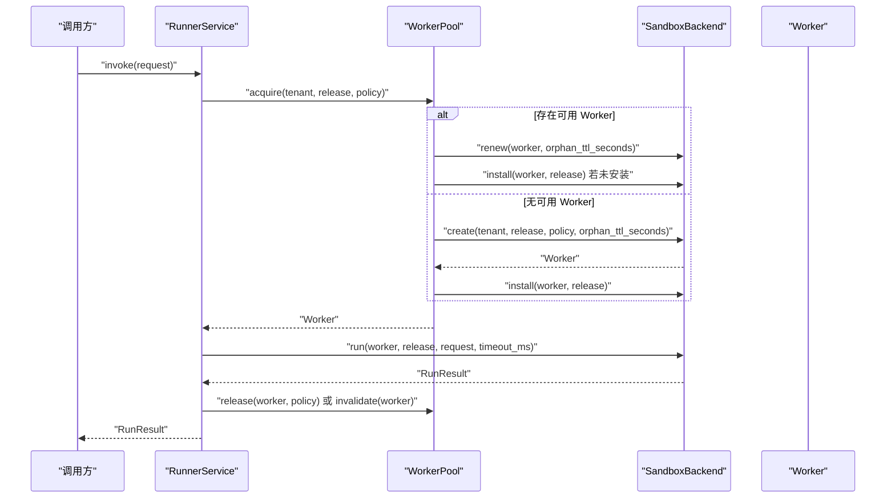
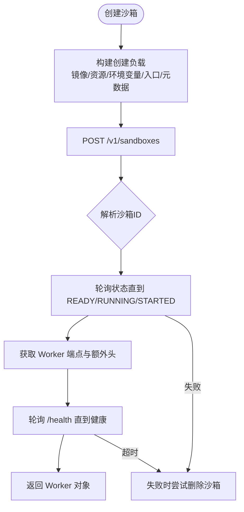
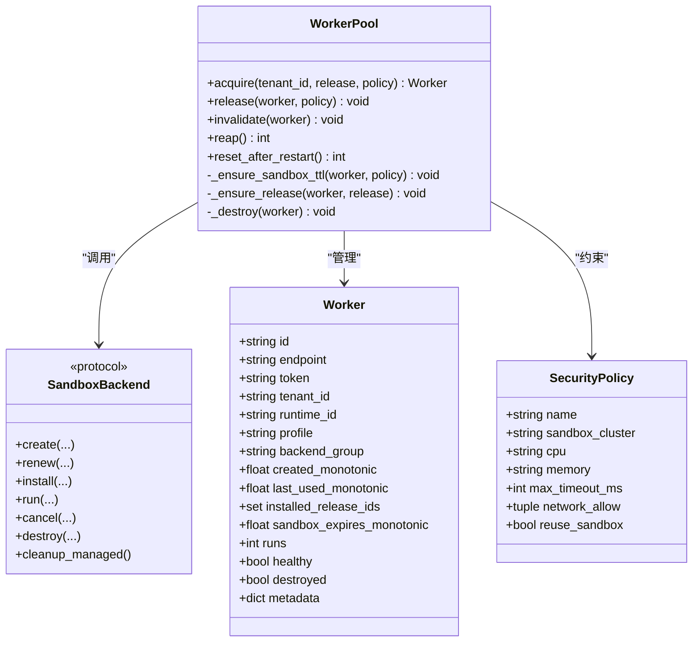
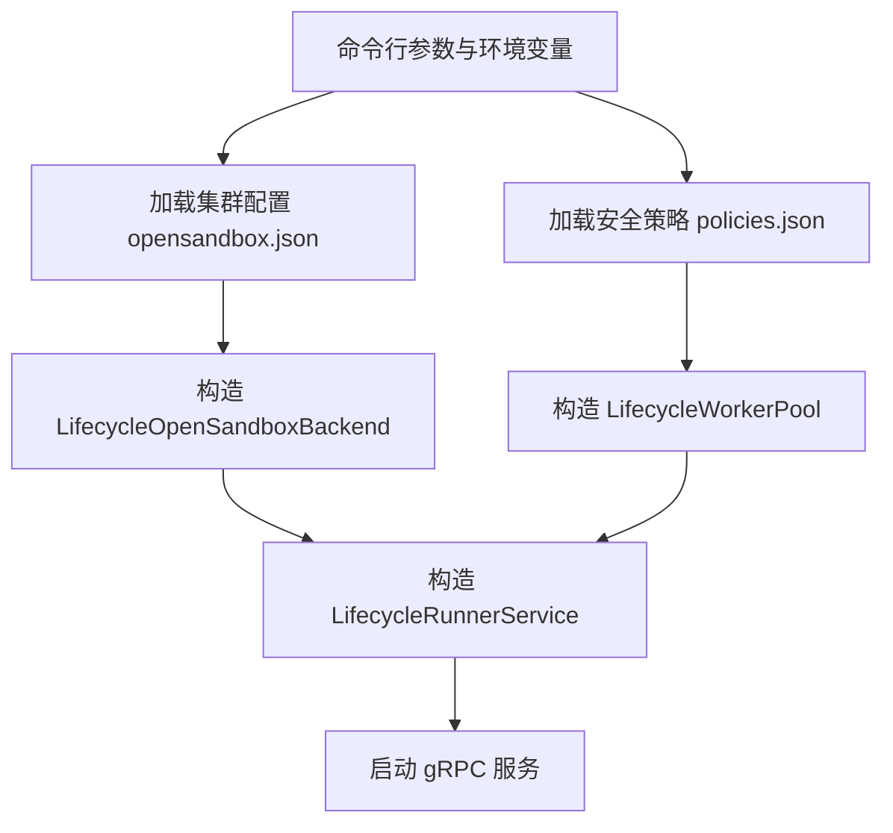
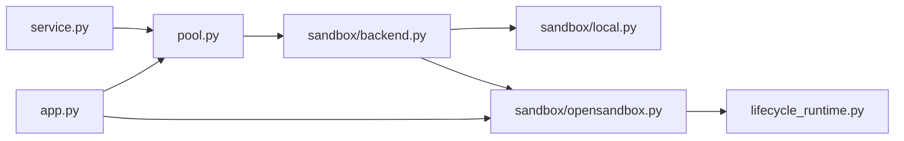

# 沙箱后端抽象设计

<cite>
**本文引用的文件**   
- [runner_engine/sandbox/backend.py](file://runner_engine/sandbox/backend.py)
- [runner_engine/sandbox/local.py](file://runner_engine/sandbox/local.py)
- [runner_engine/sandbox/opensandbox.py](file://runner_engine/sandbox/opensandbox.py)
- [runner_engine/model.py](file://runner_engine/model.py)
- [runner_engine/pool.py](file://runner_engine/pool.py)
- [runner_engine/service.py](file://runner_engine/service.py)
- [runner_engine/app.py](file://runner_engine/app.py)
- [runner_engine/lifecycle_runtime.py](file://runner_engine/lifecycle_runtime.py)
- [config/opensandbox.json](file://config/opensandbox.json)
</cite>

## 目录
1. [引言](#引言)
2. [项目结构](#项目结构)
3. [核心组件](#核心组件)
4. [架构总览](#架构总览)
5. [详细组件分析](#详细组件分析)
6. [依赖关系分析](#依赖关系分析)
7. [性能与容量特性](#性能与容量特性)
8. [故障排查指南](#故障排查指南)
9. [结论](#结论)
10. [附录：自定义沙箱后端实现指南](#附录自定义沙箱后端实现指南)

## 引言
本文面向“沙箱后端抽象设计”，目标是帮助读者理解 runner_engine 中沙箱后端的接口契约、Worker 生命周期管理、租户隔离与安全策略应用，以及工厂式动态加载机制。文档将重点解释 SandboxBackend Protocol 的设计意图和关键方法，说明 LocalBackend 与 OpenSandboxBackend 两种实现的区别，并给出扩展新后端的实践建议。

## 项目结构
runner_engine 中与沙箱后端相关的代码主要分布在以下位置：
- 接口定义：sandbox/backend.py
- 本地开发实现：sandbox/local.py
- OpenSandbox 远程实现：sandbox/opensandbox.py
- Worker 模型与运行时数据：model.py
- 工作池与资源配额：pool.py
- 执行服务编排：service.py
- 应用启动与配置注入：app.py
- 生命周期增强实现：lifecycle_runtime.py
- OpenSandbox 集群配置：config/opensandbox.json

图表来源
- [runner_engine/service.py:80-115](file://runner_engine/service.py#L80-L115)
- [runner_engine/pool.py:11-46](file://runner_engine/pool.py#L11-L46)
- [runner_engine/sandbox/backend.py:14-49](file://runner_engine/sandbox/backend.py#L14-L49)
- [runner_engine/sandbox/local.py:14-62](file://runner_engine/sandbox/local.py#L14-L62)
- [runner_engine/sandbox/opensandbox.py:31-50](file://runner_engine/sandbox/opensandbox.py#L31-L50)
- [runner_engine/lifecycle_runtime.py:123-184](file://runner_engine/lifecycle_runtime.py#L123-L184)
- [runner_engine/app.py:87-134](file://runner_engine/app.py#L87-L134)
- [config/opensandbox.json:1-11](file://config/opensandbox.json#L1-L11)

章节来源
- [runner_engine/app.py:26-134](file://runner_engine/app.py#L26-L134)
- [runner_engine/sandbox/backend.py:14-49](file://runner_engine/sandbox/backend.py#L14-L49)

## 核心组件
本节聚焦 SandboxBackend 协议、Worker 模型、SecurityPolicy 与 WorkerPool 的职责边界。

- SandboxBackend（Protocol）
  - 定义统一的沙箱后端能力契约，屏蔽不同实现细节。
  - 关键方法包括 create、renew、install、run、cancel、destroy、cleanup_managed。
  - 所有方法以关键字参数形式暴露，便于扩展字段而不破坏兼容性。

- Worker
  - 表示一个可复用或一次性使用的沙箱工作单元。
  - 包含标识、端点、鉴权令牌、租户、运行时版本、安全策略画像、后端分组、时间戳、已安装算子版本集合、健康状态、销毁状态等。
  - 由后端在创建时填充，并由 WorkerPool 进行复用、续期与回收。

- SecurityPolicy
  - 描述安全策略，包括 CPU、内存上限、最大超时、网络白名单、是否允许复用沙箱、以及目标沙箱集群名称。
  - 用于控制后端创建时的资源限制与行为。

- WorkerPool
  - 按 tenant_id + runtime_id + profile 维度维护空闲 Worker 池。
  - 负责 Worker 的获取、释放、失效、回收、TTL 续期、算子版本安装与去重。
  - 通过 Quota 控制并发创建与在线数量，避免资源耗尽。

章节来源
- [runner_engine/sandbox/backend.py:14-49](file://runner_engine/sandbox/backend.py#L14-L49)
- [runner_engine/model.py:14-35](file://runner_engine/model.py#L14-L35)
- [runner_engine/model.py:73-89](file://runner_engine/model.py#L73-L89)
- [runner_engine/pool.py:11-46](file://runner_engine/pool.py#L11-L46)

## 架构总览
RunnerService 作为执行编排层，不直接操作沙箱后端，而是通过 WorkerPool 间接调用后端。WorkerPool 根据租户、运行时镜像与策略画像选择或创建 Worker，并在需要时调用后端完成安装、运行、取消与销毁。OpenSandboxBackend 通过 HTTP 与外部 OpenSandbox 系统交互；LocalBackend 则使用本地进程模拟，适合开发与测试。

图表来源
- [runner_engine/service.py:188-362](file://runner_engine/service.py#L188-L362)
- [runner_engine/pool.py:73-130](file://runner_engine/pool.py#L73-L130)
- [runner_engine/sandbox/backend.py:14-49](file://runner_engine/sandbox/backend.py#L14-L49)

## 详细组件分析

### SandboxBackend 协议设计
SandboxBackend 是一个 Python Protocol，定义了沙箱后端必须实现的统一接口。其设计理念是：
- 以租户为隔离单位，结合运行时镜像与策略画像，确保不同租户与不同安全策略的沙箱互不干扰。
- 将 Worker 的生命周期分为创建、续期、安装、运行、取消、销毁与清理托管资源七个阶段。
- 所有方法采用关键字参数，便于未来扩展字段而不破坏现有调用方。

关键方法职责与参数说明：
- create
  - 作用：创建一个新的 Worker，返回 Worker 对象。
  - 参数：tenant_id、release、policy、orphan_ttl_seconds。
  - 语义：根据策略设置资源限制与环境变量，生成唯一标识与鉴权令牌，并记录创建时间与过期时间。
- renew
  - 作用：延长 Worker 的存活时间，防止被当作孤儿回收。
  - 参数：worker、orphan_ttl_seconds。
  - 语义：更新 Worker 的过期时间戳，必要时通知远端系统延长 TTL。
- install
  - 作用：向 Worker 安装指定版本的算子制品。
  - 参数：worker、release。
  - 语义：将算子制品注入 Worker 环境，供后续 run 调用使用。
- run
  - 作用：在 Worker 上执行一次算子调用。
  - 参数：worker、release、request、timeout_ms。
  - 语义：封装请求内容、属性、参数与超时，返回标准化 RunResult。
- cancel
  - 作用：尝试取消正在运行的调用。
  - 参数：worker、invocation_id。
  - 语义：返回布尔值表示是否成功取消。
- destroy
  - 作用：销毁 Worker 及其底层资源。
  - 参数：worker。
  - 语义：释放进程、容器或远端沙箱资源。
- cleanup_managed
  - 作用：清理当前 Runner 进程托管的遗留沙箱。
  - 参数：无。
  - 语义：返回清理数量，常用于重启后的兜底清理。

章节来源
- [runner_engine/sandbox/backend.py:14-49](file://runner_engine/sandbox/backend.py#L14-L49)

### LocalBackend 实现
LocalBackend 是面向开发与测试的后端实现，不具备真正的安全隔离能力。它通过本地临时目录与内部 AgentState 模拟 Worker 行为。

特点：
- 使用临时目录保存 releases 与 invocations。
- 为每个 Worker 生成随机 token，并通过 endpoint 标记为 local://agent-state。
- 支持 install、run、cancel、destroy、cleanup_managed 等方法。
- 不强制实施安全策略，仅用于验证流程与集成测试。

章节来源
- [runner_engine/sandbox/local.py:14-132](file://runner_engine/sandbox/local.py#L14-L132)

### OpenSandboxBackend 实现
OpenSandboxBackend 是与外部 OpenSandbox 系统交互的生产级实现，负责创建、管理、运行与销毁远端沙箱。

关键点：
- 通过 clusters 配置访问多个 OpenSandbox 集群，并根据 SecurityPolicy.sandbox_cluster 选择目标集群。
- 创建沙箱时注入环境变量、资源限制、入口命令与元数据标签，用于追踪 owner、租户、运行时与策略画像。
- 等待沙箱进入 RUNNING/READY/STARTED 状态，并轮询健康检查端点，确保 Worker Agent 就绪。
- 对 HTTP 错误与不可达异常进行包装，抛出带重试标志的 SandboxError。
- 提供 destroy 与 cleanup_managed，按 managed-by 与 runner-owner 标签筛选并删除受管沙箱。

图表来源
- [runner_engine/sandbox/opensandbox.py:141-302](file://runner_engine/sandbox/opensandbox.py#L141-L302)

章节来源
- [runner_engine/sandbox/opensandbox.py:31-110](file://runner_engine/sandbox/opensandbox.py#L31-L110)
- [runner_engine/sandbox/opensandbox.py:141-302](file://runner_engine/sandbox/opensandbox.py#L141-L302)
- [runner_engine/sandbox/opensandbox.py:324-439](file://runner_engine/sandbox/opensandbox.py#L324-L439)

### Worker 生命周期管理与租户隔离
WorkerPool 是 Worker 生命周期的核心协调者，负责：
- 按 tenant_id + runtime_id + profile 维度组织空闲 Worker。
- 在获取 Worker 时判断是否已安装所需算子版本，若未安装则调用后端 install。
- 根据策略与阈值决定是否调用后端 renew 延长 TTL。
- 在释放 Worker 时根据策略决定是否放回空闲池或销毁。
- 定期回收空闲超时的 Worker，并在重启后调用 cleanup_managed 清理遗留资源。

租户隔离体现在：
- Worker 对象携带 tenant_id，且 WorkerPool 的 key 包含 tenant_id。
- OpenSandboxBackend 在创建沙箱时将租户哈希写入元数据，便于远端系统识别归属。

算子版本管理体现在：
- Worker.installed_release_ids 记录已安装的算子版本。
- WorkerPool._ensure_release 保证同一 Worker 内只安装一次，避免重复注入。

安全策略应用体现在：
- SecurityPolicy 决定 CPU、内存、最大超时、是否允许复用沙箱与目标集群。
- RunnerService 在 invoke 前校验策略并裁剪输入输出属性，限制超时不超过策略上限。

图表来源
- [runner_engine/model.py:73-89](file://runner_engine/model.py#L73-L89)
- [runner_engine/model.py:26-35](file://runner_engine/model.py#L26-L35)
- [runner_engine/pool.py:11-188](file://runner_engine/pool.py#L11-L188)
- [runner_engine/sandbox/backend.py:14-49](file://runner_engine/sandbox/backend.py#L14-L49)

章节来源
- [runner_engine/pool.py:47-188](file://runner_engine/pool.py#L47-L188)
- [runner_engine/service.py:188-362](file://runner_engine/service.py#L188-L362)

### 工厂模式与动态加载机制
RunnerEngine 的应用入口 app.py 负责读取集群配置与安全策略，构造后端实例与工作池，再交给 LifecycleRunnerService 与 gRPC 网关。

动态加载机制体现为：
- 通过命令行参数 --clusters 与配置文件 opensandbox.json 加载多个 OpenSandbox 集群。
- 通过 --policies 加载策略映射，将 release.profile 映射到 SecurityPolicy。
- 默认使用 LifecycleOpenSandboxBackend，它是 OpenSandboxBackend 的增强版，增加 list_managed 能力。
- 测试与集成场景可使用 LocalBackend，无需真实远端系统。

图表来源
- [runner_engine/app.py:26-134](file://runner_engine/app.py#L26-L134)
- [config/opensandbox.json:1-11](file://config/opensandbox.json#L1-L11)

章节来源
- [runner_engine/app.py:26-134](file://runner_engine/app.py#L26-L134)
- [runner_engine/lifecycle_runtime.py:123-184](file://runner_engine/lifecycle_runtime.py#L123-L184)

## 依赖关系分析
- service.py 依赖 pool.py 与 model.py，但不直接依赖具体后端实现。
- pool.py 依赖 sandbox.backend.SandboxBackend 协议，从而解耦具体后端。
- opensandbox.py 依赖 worker.http_api 与 errors，处理远端通信与异常。
- lifecycle_runtime.py 扩展 OpenSandboxBackend 与 WorkerPool，增加生命周期管理能力。
- app.py 作为装配层，将配置、后端、池与服务组合起来。

图表来源
- [runner_engine/service.py:80-115](file://runner_engine/service.py#L80-L115)
- [runner_engine/pool.py:11-46](file://runner_engine/pool.py#L11-L46)
- [runner_engine/sandbox/backend.py:14-49](file://runner_engine/sandbox/backend.py#L14-L49)
- [runner_engine/sandbox/local.py:14-62](file://runner_engine/sandbox/local.py#L14-L62)
- [runner_engine/sandbox/opensandbox.py:31-50](file://runner_engine/sandbox/opensandbox.py#L31-L50)
- [runner_engine/lifecycle_runtime.py:123-184](file://runner_engine/lifecycle_runtime.py#L123-L184)
- [runner_engine/app.py:87-134](file://runner_engine/app.py#L87-L134)

章节来源
- [runner_engine/service.py:80-115](file://runner_engine/service.py#L80-L115)
- [runner_engine/pool.py:11-46](file://runner_engine/pool.py#L11-L46)
- [runner_engine/sandbox/backend.py:14-49](file://runner_engine/sandbox/backend.py#L14-L49)
- [runner_engine/sandbox/local.py:14-62](file://runner_engine/sandbox/local.py#L14-L62)
- [runner_engine/sandbox/opensandbox.py:31-50](file://runner_engine/sandbox/opensandbox.py#L31-L50)
- [runner_engine/lifecycle_runtime.py:123-184](file://runner_engine/lifecycle_runtime.py#L123-L184)
- [runner_engine/app.py:87-134](file://runner_engine/app.py#L87-L134)

## 性能与容量特性
- Worker 复用
  - WorkerPool 按租户、运行时与策略画像复用 Worker，减少频繁创建开销。
  - 通过 installed_release_ids 避免重复安装算子，提升冷启动效率。
- TTL 与续期
  - 当 Worker 接近过期阈值时，WorkerPool 会调用后端 renew，延长存活时间。
  - OpenSandboxBackend 会调用远端 API 更新过期时间，LocalBackend 仅更新本地时间戳。
- 超时与资源限制
  - SecurityPolicy.max_timeout_ms 限制单次调用的最大超时。
  - OpenSandboxBackend 在创建沙箱时注入 CPU 与内存限制。
- 并发与配额
  - Quota 控制最大创建数与在线 Worker 数，避免资源耗尽。
  - WorkerPool.acquire 在创建失败时回滚配额与资源。

[本节为通用性能讨论，不直接分析具体文件]

## 故障排查指南
常见错误与定位要点：
- 沙箱启动失败
  - OpenSandboxBackend 在状态非预期时会抛出 SANDBOX_START_FAILED 或 SANDBOX_START_TIMEOUT。
  - 检查集群 URL、API Key、镜像 URI 与网络连通性。
- Worker 健康检查超时
  - AGENT_START_TIMEOUT 表示 Worker Agent 未在限定时间内健康。
  - 检查 Worker 端点、额外头与 /health 响应。
- 远端不可达
  - OPENSANDBOX_UNREACHABLE 表示 HTTP 请求失败或超时。
  - 检查防火墙、DNS、代理与负载均衡配置。
- 属性超限
  - RunnerService 对输入输出属性进行校验，超过 MAX_ATTRIBUTES 或 MAX_ATTRIBUTE_BYTES 会报错。
  - 检查 operator 的 input_attributes 与 output_attributes 配置。
- 内容过大
  - INLINE_CONTENT_TOO_LARGE 与 OUTPUT_TOO_LARGE 限制内联内容大小。
  - 大体积数据应通过外部存储而非 inline content 传输。

章节来源
- [runner_engine/sandbox/opensandbox.py:91-110](file://runner_engine/sandbox/opensandbox.py#L91-L110)
- [runner_engine/sandbox/opensandbox.py:192-302](file://runner_engine/sandbox/opensandbox.py#L192-L302)
- [runner_engine/service.py:39-60](file://runner_engine/service.py#L39-L60)
- [runner_engine/service.py:188-220](file://runner_engine/service.py#L188-L220)
- [runner_engine/service.py:300-322](file://runner_engine/service.py#L300-L322)

## 结论
SandboxBackend 协议为 runner_engine 提供了统一的后端抽象，使 LocalBackend 与 OpenSandboxBackend 可以无缝替换。WorkerPool 负责 Worker 的生命周期、租户隔离、算子版本管理与安全策略应用。RunnerService 通过 WorkerPool 间接调用后端，保持高层逻辑与底层实现解耦。通过 app.py 的配置注入与 LifecycleOpenSandboxBackend 的增强能力，系统具备多集群、可观测与生命周期管理能力。

[本节为总结性内容，不直接分析具体文件]

## 附录：自定义沙箱后端实现指南
若要实现自定义沙箱后端，建议遵循以下步骤：

- 实现 SandboxBackend 协议
  - 至少实现 create、renew、install、run、cancel、destroy、cleanup_managed。
  - 使用关键字参数，避免破坏现有调用方。
  - 在 create 中生成唯一 Worker.id、endpoint、token，并设置 tenant_id、runtime_id、profile、backend_group 与过期时间。

- 处理租户隔离与安全策略
  - 在 create 中使用 SecurityPolicy 的资源限制与网络白名单。
  - 将 tenant_id 与策略画像写入元数据，便于远端系统识别与审计。

- 处理算子版本管理
  - 在 install 中将算子制品注入 Worker。
  - 返回后由 WorkerPool 记录 installed_release_ids，避免重复安装。

- 处理运行与取消
  - 在 run 中封装请求内容、属性、参数与超时，返回 RunResult。
  - 在 cancel 中根据 invocation_id 取消运行，返回布尔值。

- 处理销毁与清理
  - 在 destroy 中释放底层资源。
  - 在 cleanup_managed 中扫描并删除受管沙箱，返回清理数量。

- 注册与装配
  - 在应用入口或配置中构造自定义后端实例。
  - 将后端注入 WorkerPool，再由 RunnerService 使用。

示例路径参考：
- 接口定义：[runner_engine/sandbox/backend.py:14-49](file://runner_engine/sandbox/backend.py#L14-L49)
- 本地实现参考：[runner_engine/sandbox/local.py:14-132](file://runner_engine/sandbox/local.py#L14-L132)
- 远端实现参考：[runner_engine/sandbox/opensandbox.py:31-439](file://runner_engine/sandbox/opensandbox.py#L31-L439)
- 应用装配参考：[runner_engine/app.py:87-134](file://runner_engine/app.py#L87-L134)

章节来源
- [runner_engine/sandbox/backend.py:14-49](file://runner_engine/sandbox/backend.py#L14-L49)
- [runner_engine/sandbox/local.py:14-132](file://runner_engine/sandbox/local.py#L14-L132)
- [runner_engine/sandbox/opensandbox.py:31-439](file://runner_engine/sandbox/opensandbox.py#L31-L439)
- [runner_engine/app.py:87-134](file://runner_engine/app.py#L87-L134)