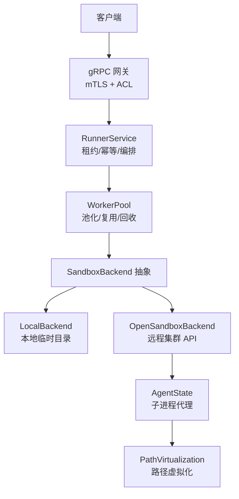
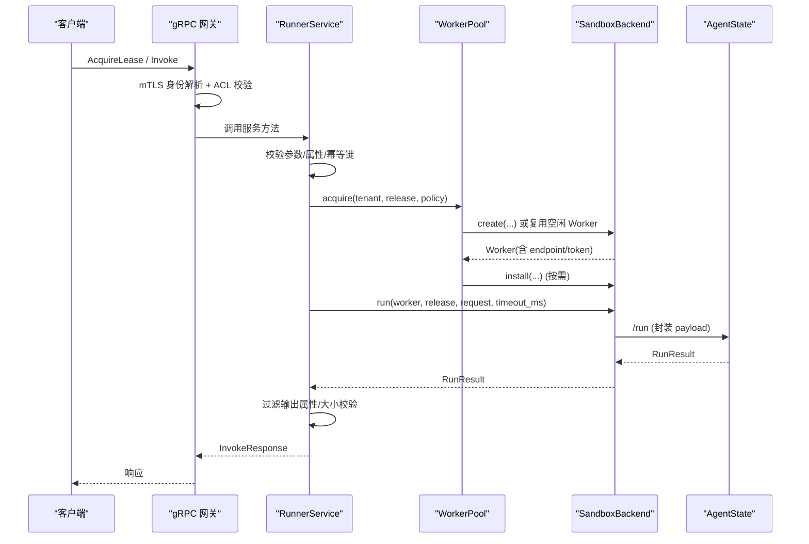
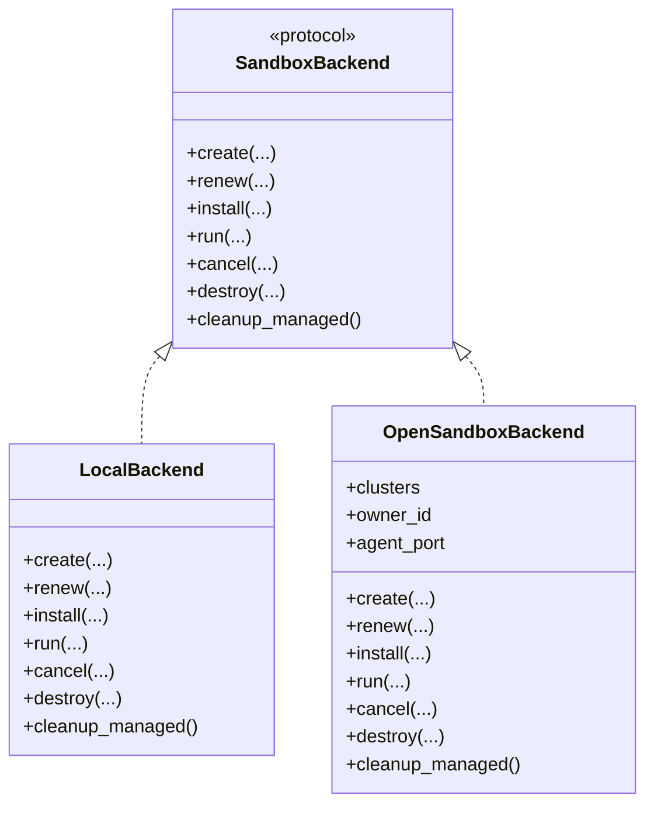
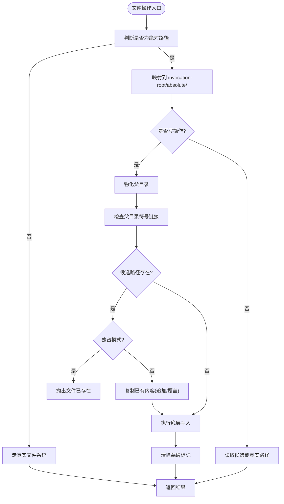
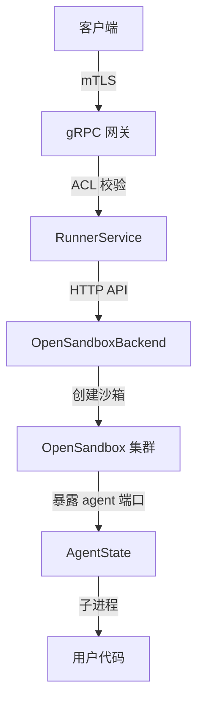
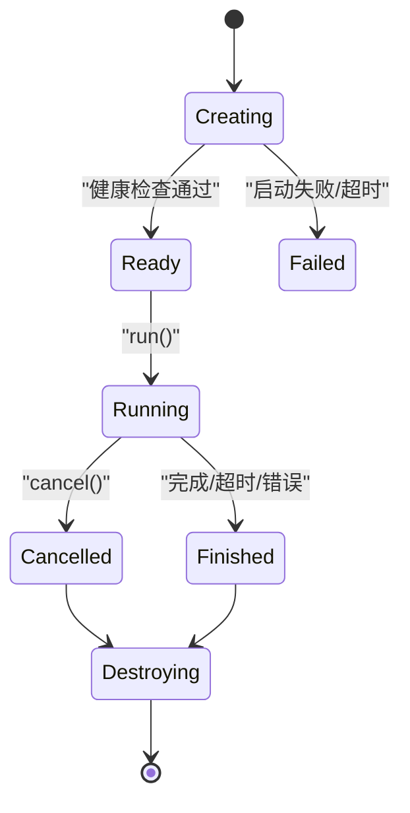
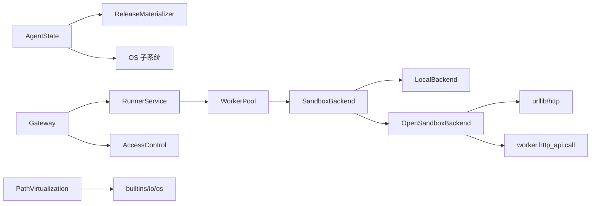

# 沙箱隔离机制

<cite>
**本文引用的文件**   
- [runner_engine/sandbox/backend.py](file://runner_engine/sandbox/backend.py)
- [runner_engine/sandbox/local.py](file://runner_engine/sandbox/local.py)
- [runner_engine/sandbox/opensandbox.py](file://runner_engine/sandbox/opensandbox.py)
- [runner_engine/worker/path_virtualization.py](file://runner_engine/worker/path_virtualization.py)
- [runner_engine/worker/agent.py](file://runner_engine/worker/agent.py)
- [runner_engine/model.py](file://runner_engine/model.py)
- [runner_engine/pool.py](file://runner_engine/pool.py)
- [runner_engine/service.py](file://runner_engine/service.py)
- [runner_engine/gateway.py](file://runner_engine/gateway.py)
- [runner_engine/lifecycle_service.py](file://runner_engine/lifecycle_service.py)
- [config/opensandbox.json](file://config/opensandbox.json)
- [config/acl.json](file://config/acl.json)
</cite>

## 目录
1. [引言](#引言)
2. [项目结构](#项目结构)
3. [核心组件](#核心组件)
4. [架构总览](#架构总览)
5. [详细组件分析](#详细组件分析)
6. [依赖关系分析](#依赖关系分析)
7. [性能与资源限制](#性能与资源限制)
8. [故障排查指南](#故障排查指南)
9. [结论](#结论)
10. [附录：配置与调优示例](#附录配置与调优示例)

## 引言
本文面向 Runner Engine 的沙箱隔离机制，系统性解释后端抽象、多后端支持（本地与 OpenSandbox）、文件系统虚拟化、网络与安全边界、资源限制、生命周期管理、后端选择与故障转移策略，以及配置与性能调优建议。目标是帮助读者从整体到细节理解“请求如何进入安全执行环境”“数据如何被隔离和持久化”“失败时如何恢复”。

## 项目结构
Runner Engine 将“调度与服务层”“沙箱后端抽象”“工作进程代理”“路径虚拟化”“访问控制与网关”分层组织：
- 服务层：RunnerService 负责租约、幂等、调用编排、结果校验与清理。
- 沙箱后端：SandboxBackend 协议定义统一接口；LocalBackend 用于开发测试；OpenSandboxBackend 对接外部集群。
- 工作进程代理：AgentState 在受控环境中启动用户子进程，实现输出限制、超时、取消、日志限流。
- 路径虚拟化：PathVirtualization 提供 Python 级文件系统重定向，避免绝对路径逃逸。
- 网关与访问控制：mTLS gRPC 入口，基于身份映射租户/项目权限。
- 生命周期扩展：LifecycleRunnerService 在运行时退役阶段阻止新执行。

**图示来源**
- [runner_engine/gateway.py:44-194](file://runner_engine/gateway.py#L44-L194)
- [runner_engine/service.py:80-456](file://runner_engine/service.py#L80-L456)
- [runner_engine/pool.py:11-188](file://runner_engine/pool.py#L11-L188)
- [runner_engine/sandbox/backend.py:14-49](file://runner_engine/sandbox/backend.py#L14-L49)
- [runner_engine/sandbox/local.py:14-132](file://runner_engine/sandbox/local.py#L14-L132)
- [runner_engine/sandbox/opensandbox.py:31-440](file://runner_engine/sandbox/opensandbox.py#L31-L440)
- [runner_engine/worker/agent.py:309-799](file://runner_engine/worker/agent.py#L309-L799)
- [runner_engine/worker/path_virtualization.py:62-739](file://runner_engine/worker/path_virtualization.py#L62-L739)

**章节来源**
- [runner_engine/gateway.py:44-194](file://runner_engine/gateway.py#L44-L194)
- [runner_engine/service.py:80-456](file://runner_engine/service.py#L80-L456)
- [runner_engine/pool.py:11-188](file://runner_engine/pool.py#L11-L188)
- [runner_engine/sandbox/backend.py:14-49](file://runner_engine/sandbox/backend.py#L14-L49)
- [runner_engine/sandbox/local.py:14-132](file://runner_engine/sandbox/local.py#L14-L132)
- [runner_engine/sandbox/opensandbox.py:31-440](file://runner_engine/sandbox/opensandbox.py#L31-L440)
- [runner_engine/worker/agent.py:309-799](file://runner_engine/worker/agent.py#L309-L799)
- [runner_engine/worker/path_virtualization.py:62-739](file://runner_engine/worker/path_virtualization.py#L62-L739)

## 核心组件
- SandboxBackend 协议：定义 create/renew/install/run/cancel/destroy/cleanup_managed 的统一接口，屏蔽本地与远程差异。
- WorkerPool：按 tenant/runtime/profile 维度缓存空闲 Worker，负责 TTL 续期、发布安装、创建/销毁、健康检查与回收。
- RunnerService：对外暴露租约、调用、取消能力；负责输入校验、属性白名单、幂等去重、结果过滤与持久化。
- OpenSandboxBackend：通过 HTTP API 创建远端沙箱，轮询状态，获取 agent endpoint，并调用 /health 确认就绪。
- LocalBackend：使用临时目录与内存态 AgentState，适合开发与测试，非生产安全沙箱。
- AgentState：受信任代理，单并发运行用户子进程，限制 stdout/stderr、协议帧大小、输出大小，支持超时与取消。
- PathVirtualization：Python 级文件系统兼容层，将绝对路径写入 invocation-local 树，合并真实与虚拟视图。
- AccessControl：基于 mTLS 对端身份映射租户/项目访问权限。

**章节来源**
- [runner_engine/sandbox/backend.py:14-49](file://runner_engine/sandbox/backend.py#L14-L49)
- [runner_engine/pool.py:11-188](file://runner_engine/pool.py#L11-L188)
- [runner_engine/service.py:80-456](file://runner_engine/service.py#L80-L456)
- [runner_engine/sandbox/opensandbox.py:31-440](file://runner_engine/sandbox/opensandbox.py#L31-L440)
- [runner_engine/sandbox/local.py:14-132](file://runner_engine/sandbox/local.py#L14-L132)
- [runner_engine/worker/agent.py:309-799](file://runner_engine/worker/agent.py#L309-L799)
- [runner_engine/worker/path_virtualization.py:62-739](file://runner_engine/worker/path_virtualization.py#L62-L739)
- [runner_engine/gateway.py:12-31](file://runner_engine/gateway.py#L12-L31)

## 架构总览
下图展示一次完整调用的端到端流程，包括认证、授权、租约、沙箱选择、执行与结果回传。

**图示来源**
- [runner_engine/gateway.py:102-157](file://runner_engine/gateway.py#L102-L157)
- [runner_engine/service.py:188-362](file://runner_engine/service.py#L188-L362)
- [runner_engine/pool.py:73-130](file://runner_engine/pool.py#L73-L130)
- [runner_engine/sandbox/opensandbox.py:339-376](file://runner_engine/sandbox/opensandbox.py#L339-L376)
- [runner_engine/worker/agent.py:467-778](file://runner_engine/worker/agent.py#L467-L778)

## 详细组件分析

### 沙箱后端抽象与多后端支持
- 抽象设计：SandboxBackend 以 Protocol 形式定义统一接口，所有后端必须实现 create/renew/install/run/cancel/destroy/cleanup_managed。
- 本地后端 LocalBackend：
  - 为每个 Worker 分配临时目录，设置 releases_root 与 invocations_root。
  - 使用内存态 AgentState，直接调用 bootstrap/run/cancel。
  - destroy/cleanup_managed 清理临时目录。
- 远程后端 OpenSandboxBackend：
  - 通过 clusters 配置连接多个 OpenSandbox 集群，按 SecurityPolicy.sandbox_cluster 选择目标。
  - create 调用 /v1/sandboxes，注入镜像、资源限制、环境变量、entrypoint 与元数据标签。
  - 轮询状态直至 RUNNING/READY/STARTED，否则抛出启动失败或超时错误。
  - 获取 agent endpoint 后调用 /health 确认代理就绪。
  - renew 调用 /renew-expiration 延长过期时间。
  - install 通过 worker_call 向 agent 的 /bootstrap 上传 operator artifact。
  - run 调用 agent 的 /run，封装 content_b64、attributes、parameters、timeout_ms 等。
  - cancel 调用 /cancel，destroy 调用 DELETE /sandboxes/{id}。
  - cleanup_managed 遍历各集群，删除带有 managed-by 与 runner-owner 标签的托管沙箱。

**图示来源**
- [runner_engine/sandbox/backend.py:14-49](file://runner_engine/sandbox/backend.py#L14-L49)
- [runner_engine/sandbox/local.py:14-132](file://runner_engine/sandbox/local.py#L14-L132)
- [runner_engine/sandbox/opensandbox.py:31-440](file://runner_engine/sandbox/opensandbox.py#L31-L440)

**章节来源**
- [runner_engine/sandbox/backend.py:14-49](file://runner_engine/sandbox/backend.py#L14-L49)
- [runner_engine/sandbox/local.py:14-132](file://runner_engine/sandbox/local.py#L14-L132)
- [runner_engine/sandbox/opensandbox.py:31-440](file://runner_engine/sandbox/opensandbox.py#L31-L440)

### 文件系统虚拟化机制
PathVirtualization 是 Python 级文件系统兼容层，关键行为如下：
- 绝对路径重写：
  - 写操作：将绝对路径映射到 invocation-root/absolute/<原路径>。
  - 读操作：优先返回 invocation-local 版本，不存在则回退到真实容器路径。
- 目录可见性合并：listdir/scandir 合并真实目录与虚拟目录条目，并考虑墓碑标记（tombstones）表示已删除。
- 符号链接保护：禁止在虚拟绝对路径中使用绝对符号链接目标，防止逃逸。
- 父目录物化：写入前自动物化必要父目录，保持层级一致。
- 权限与时间戳：chmod/utime/truncate 等操作作用于物化后的候选路径。
- 工作目录语义：chdir/getcwd 在虚拟命名空间下保持一致逻辑路径。
- 安装/卸载：可全局替换 builtins.open/io.open/os.* 函数，并在退出时恢复。

**图示来源**
- [runner_engine/worker/path_virtualization.py:173-320](file://runner_engine/worker/path_virtualization.py#L173-L320)
- [runner_engine/worker/path_virtualization.py:361-427](file://runner_engine/worker/path_virtualization.py#L361-L427)
- [runner_engine/worker/path_virtualization.py:481-515](file://runner_engine/worker/path_virtualization.py#L481-L515)
- [runner_engine/worker/path_virtualization.py:517-586](file://runner_engine/worker/path_virtualization.py#L517-L586)
- [runner_engine/worker/path_virtualization.py:599-683](file://runner_engine/worker/path_virtualization.py#L599-L683)
- [runner_engine/worker/path_virtualization.py:685-717](file://runner_engine/worker/path_virtualization.py#L685-L717)

**章节来源**
- [runner_engine/worker/path_virtualization.py:62-739](file://runner_engine/worker/path_virtualization.py#L62-L739)

### 网络隔离与安全边界
- 网关层：
  - 强制 mTLS，拒绝明文模式。
  - 从证书对端提取 x509_common_name 或 x509_subject_alternative_name 作为身份。
  - AccessControl 根据 identity 映射允许的 tenant/project 列表，支持通配符。
- 沙箱层：
  - OpenSandboxBackend 通过集群 API 创建沙箱，由集群侧承担网络隔离（如 gVisor/Kata）。
  - 通过环境变量 RUNNER_AGENT_TOKEN/RUNNER_AGENT_PORT 控制 agent 通信端口。
  - 通过 SecurityPolicy.network_allow 声明允许的网络策略（具体实现由集群侧决定）。
- 代理层：
  - AgentState 仅接受来自可信上游的 /run、/bootstrap、/cancel、/health 请求。
  - 子进程通过管道与代理通信，限制 stdout/stderr 与协议帧大小，避免资源耗尽。

**图示来源**
- [runner_engine/gateway.py:44-194](file://runner_engine/gateway.py#L44-L194)
- [runner_engine/sandbox/opensandbox.py:31-440](file://runner_engine/sandbox/opensandbox.py#L31-L440)
- [runner_engine/worker/agent.py:309-799](file://runner_engine/worker/agent.py#L309-L799)

**章节来源**
- [runner_engine/gateway.py:12-31](file://runner_engine/gateway.py#L12-L31)
- [runner_engine/gateway.py:44-194](file://runner_engine/gateway.py#L44-L194)
- [runner_engine/sandbox/opensandbox.py:31-440](file://runner_engine/sandbox/opensandbox.py#L31-L440)
- [runner_engine/worker/agent.py:309-799](file://runner_engine/worker/agent.py#L309-L799)

### 资源限制机制
- CPU：
  - OpenSandboxBackend 在 create 中通过 resourceLimits.cpu 传递 CPU 配额。
  - AgentState 计算 RUNNER_CHILD_CPU_SECONDS 基于超时估算，结合系统信号 SIGXCPU 检测 CPU 超限。
- 内存：
  - OpenSandboxBackend 通过 resourceLimits.memory 传递内存限制。
  - AgentState 设置 RUNNER_CHILD_ADDRESS_SPACE_BYTES 供子进程参考。
- 磁盘 I/O：
  - PathVirtualization 将绝对路径写入 invocation-local 树，限制写入范围。
  - AgentState 为每次 invocation 创建独立 scratch_dir，包含 home/tmp/cache/absolute，并在结束后清理。
- 输出与协议：
  - MAX_USER_STDOUT/MAX_USER_STDERR 限制日志大小。
  - PROTOCOL_OVERHEAD_BYTES 与 max_protocol 限制协议帧大小。
  - DEFAULT_MAX_OUTPUT 限制结果内容大小。
- 进程与文件描述符：
  - child_nproc/child_nofile 限制子进程数与文件描述符数量。
  - _kill_process_group 确保终止整个进程组。

**章节来源**
- [runner_engine/sandbox/opensandbox.py:141-189](file://runner_engine/sandbox/opensandbox.py#L141-L189)
- [runner_engine/worker/agent.py:26-33](file://runner_engine/worker/agent.py#L26-L33)
- [runner_engine/worker/agent.py:309-342](file://runner_engine/worker/agent.py#L309-L342)
- [runner_engine/worker/agent.py:399-424](file://runner_engine/worker/agent.py#L399-L424)
- [runner_engine/worker/agent.py:467-778](file://runner_engine/worker/agent.py#L467-L778)
- [runner_engine/worker/path_virtualization.py:62-739](file://runner_engine/worker/path_virtualization.py#L62-L739)

### 沙箱生命周期管理
- 创建：
  - LocalBackend：生成临时目录与 token，构造 Worker。
  - OpenSandboxBackend：调用集群 API 创建沙箱，轮询状态，获取 endpoint，验证 health。
- 启动：
  - install：将 operator artifact 安装到 releases_root。
  - health：确认 agent 就绪。
- 运行：
  - run：封装请求，调用 agent /run，返回 RunResult。
- 停止：
  - cancel：调用 agent /cancel，尝试终止正在运行的 invocation。
- 销毁：
  - destroy：删除本地临时目录或远端沙箱。
  - cleanup_managed：批量清理托管沙箱。

**图示来源**
- [runner_engine/sandbox/local.py:24-132](file://runner_engine/sandbox/local.py#L24-L132)
- [runner_engine/sandbox/opensandbox.py:141-440](file://runner_engine/sandbox/opensandbox.py#L141-L440)
- [runner_engine/worker/agent.py:467-778](file://runner_engine/worker/agent.py#L467-L778)

**章节来源**
- [runner_engine/sandbox/local.py:24-132](file://runner_engine/sandbox/local.py#L24-L132)
- [runner_engine/sandbox/opensandbox.py:141-440](file://runner_engine/sandbox/opensandbox.py#L141-L440)
- [runner_engine/worker/agent.py:467-778](file://runner_engine/worker/agent.py#L467-L778)

### 后端选择策略、负载均衡与故障转移
- 选择策略：
  - SecurityPolicy.sandbox_cluster 指定目标集群名称。
  - OpenSandboxBackend._cluster 根据名称查找集群配置，未知集群抛出 UNKNOWN_SANDBOX_CLUSTER。
- 负载均衡：
  - 当前实现未内置轮询或加权算法；可通过配置多个集群并按策略路由。
  - WorkerPool 按 tenant/runtime/profile 复用 Worker，减少跨集群抖动。
- 故障转移：
  - OpenSandboxBackend._request 对 HTTP 错误与不可达进行重试标记（retryable=True）。
  - RunnerService 对部分错误码标记 retryable，上层可据此重试。
  - cleanup_managed 在重启后清理遗留托管沙箱，提升可用性。

**章节来源**
- [runner_engine/sandbox/opensandbox.py:52-110](file://runner_engine/sandbox/opensandbox.py#L52-L110)
- [runner_engine/service.py:334-359](file://runner_engine/service.py#L334-L359)
- [runner_engine/pool.py:183-187](file://runner_engine/pool.py#L183-L187)

## 依赖关系分析
- RunnerService 依赖 Catalog、RunnerDB、WorkerPool、SecurityPolicy。
- WorkerPool 依赖 Quota 与 SandboxBackend。
- OpenSandboxBackend 依赖 urllib 与 worker.http_api.call。
- AgentState 依赖 ReleaseMaterializer 与 OS 子系统。
- PathVirtualization 依赖 os/io/builtins 并重写其文件系统接口。
- Gateway 依赖 grpc 与 generated stubs，并通过 AccessControl 做 ACL。

**图示来源**
- [runner_engine/service.py:80-456](file://runner_engine/service.py#L80-L456)
- [runner_engine/pool.py:11-188](file://runner_engine/pool.py#L11-L188)
- [runner_engine/sandbox/opensandbox.py:31-440](file://runner_engine/sandbox/opensandbox.py#L31-L440)
- [runner_engine/worker/agent.py:309-799](file://runner_engine/worker/agent.py#L309-L799)
- [runner_engine/worker/path_virtualization.py:62-739](file://runner_engine/worker/path_virtualization.py#L62-L739)
- [runner_engine/gateway.py:44-194](file://runner_engine/gateway.py#L44-L194)

**章节来源**
- [runner_engine/service.py:80-456](file://runner_engine/service.py#L80-L456)
- [runner_engine/pool.py:11-188](file://runner_engine/pool.py#L11-L188)
- [runner_engine/sandbox/opensandbox.py:31-440](file://runner_engine/sandbox/opensandbox.py#L31-L440)
- [runner_engine/worker/agent.py:309-799](file://runner_engine/worker/agent.py#L309-L799)
- [runner_engine/worker/path_virtualization.py:62-739](file://runner_engine/worker/path_virtualization.py#L62-L739)
- [runner_engine/gateway.py:44-194](file://runner_engine/gateway.py#L44-L194)

## 性能与资源限制
- 输入/输出限制：
  - 最大内联内容 8 MiB，属性数量与字节上限，结果内容上限。
- 子进程限制：
  - 日志输出上限、协议帧上限、地址空间上限、CPU 秒估算。
- 池化与复用：
  - WorkerPool 按 tenant/runtime/profile 复用 Worker，减少创建开销。
  - idle_seconds 控制空闲回收，orphan_ttl_seconds 控制孤儿清理，renew_before_seconds 控制续期阈值。
- 网络与传输：
  - OpenSandboxBackend 对控制面请求设置超时，run 请求附加 RUN_TRANSPORT_GRACE_SECONDS。
- 监控与观测：
  - AgentState.health 返回 busy 状态与 path_compatibility。
  - RunnerService 记录后台维护任务异常。

**章节来源**
- [runner_engine/service.py:15-20](file://runner_engine/service.py#L15-L20)
- [runner_engine/service.py:188-362](file://runner_engine/service.py#L188-L362)
- [runner_engine/worker/agent.py:26-33](file://runner_engine/worker/agent.py#L26-L33)
- [runner_engine/worker/agent.py:467-778](file://runner_engine/worker/agent.py#L467-L778)
- [runner_engine/pool.py:19-43](file://runner_engine/pool.py#L19-L43)
- [runner_engine/sandbox/opensandbox.py:21-28](file://runner_engine/sandbox/opensandbox.py#L21-L28)
- [runner_engine/worker/agent.py:370-377](file://runner_engine/worker/agent.py#L370-L377)

## 故障排查指南
- 常见错误码与处理：
  - TIME_OUT/CANCELLED/CPU_LIMIT：可重试或提示用户调整超时/资源。
  - USER_EXCEPTION/USER_IMPORT_ERROR/ENTRYPOINT_NOT_FOUND：用户代码问题，检查 operator 包与入口。
  - OUTPUT_TOO_LARGE/LOG_LIMIT/CHILD_PROTOCOL_ERROR：输出或协议超限，检查业务输出与协议实现。
  - OPENSANDBOX_HTTP/OPENSANDBOX_UNREACHABLE：集群 API 不可用，检查网络与 API Key。
  - SANDBOX_START_FAILED/SANDBOX_START_TIMEOUT/AGENT_START_TIMEOUT：沙箱或 agent 未就绪，检查镜像与集群状态。
- 诊断步骤：
  - 检查 RunnerService 后台维护日志，确认租约与幂等清理是否正常。
  - 查看 OpenSandboxBackend 的集群配置与 API 连通性。
  - 检查 AgentState 的 health 与 busy 状态。
  - 审查 PathVirtualization 的路径映射与符号链接限制。
  - 确认 WorkerPool 的 TTL 与续期策略是否合理。

**章节来源**
- [runner_engine/service.py:334-359](file://runner_engine/service.py#L334-L359)
- [runner_engine/sandbox/opensandbox.py:98-110](file://runner_engine/sandbox/opensandbox.py#L98-L110)
- [runner_engine/sandbox/opensandbox.py:206-219](file://runner_engine/sandbox/opensandbox.py#L206-L219)
- [runner_engine/sandbox/opensandbox.py:286-290](file://runner_engine/sandbox/opensandbox.py#L286-L290)
- [runner_engine/worker/agent.py:696-778](file://runner_engine/worker/agent.py#L696-L778)

## 结论
Runner Engine 通过 SandboxBackend 抽象统一了本地与远程沙箱的实现差异，配合 WorkerPool 的池化与 TTL 管理，实现了高效且可控的执行环境。PathVirtualization 提供了轻量级的文件系统虚拟化，AgentState 则在受控环境中运行用户子进程，严格限制输出、协议与资源。网关层的 mTLS 与 ACL 确保了访问安全，OpenSandboxBackend 借助集群能力实现更强的隔离与资源管控。整体架构兼顾安全性、可扩展性与运维可观测性。

## 附录：配置与调优示例
- OpenSandbox 集群配置：
  - opensandbox.json 定义多个集群的 url 与 api_key，例如 gvisor 与 kata。
  - 建议为不同租户/项目配置独立的集群或命名空间，便于隔离与审计。
- ACL 配置：
  - acl.json 定义 identities 到 tenant/project 的映射，支持通配符 "*"。
  - 建议最小权限原则，仅授予必要的租户/项目访问。
- 安全策略：
  - SecurityPolicy 中 sandbox_cluster、cpu、memory、max_timeout_ms、network_allow、reuse_sandbox 需按业务需求设定。
  - 对于高吞吐场景，适当增大 reuse_sandbox 以减少创建开销；对于强隔离场景，关闭复用。
- 性能调优：
  - WorkerPool.idle_seconds/orphan_ttl_seconds/renew_before_seconds 需平衡资源占用与冷启动延迟。
  - AgentState.MAX_USER_STDOUT/MAX_USER_STDERR 与 DEFAULT_MAX_OUTPUT 需根据业务输出规模调整。
  - OpenSandboxBackend 的控制面超时与 RUN_TRANSPORT_GRACE_SECONDS 需匹配集群响应特性。

**章节来源**
- [config/opensandbox.json:1-11](file://config/opensandbox.json#L1-L11)
- [config/acl.json:1-9](file://config/acl.json#L1-L9)
- [runner_engine/model.py:26-35](file://runner_engine/model.py#L26-L35)
- [runner_engine/pool.py:19-43](file://runner_engine/pool.py#L19-L43)
- [runner_engine/worker/agent.py:26-33](file://runner_engine/worker/agent.py#L26-L33)
- [runner_engine/sandbox/opensandbox.py:21-28](file://runner_engine/sandbox/opensandbox.py#L21-L28)