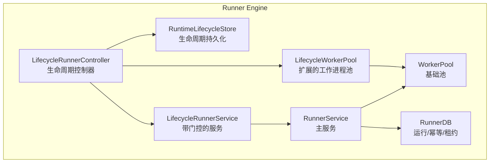
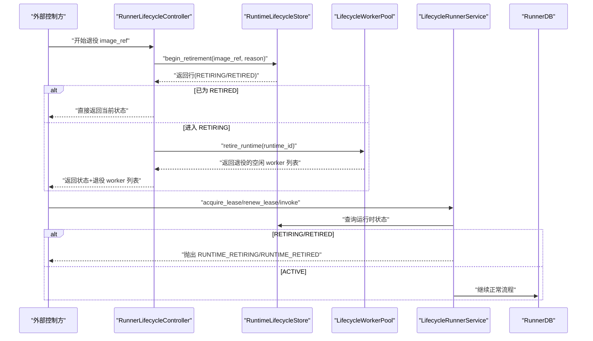
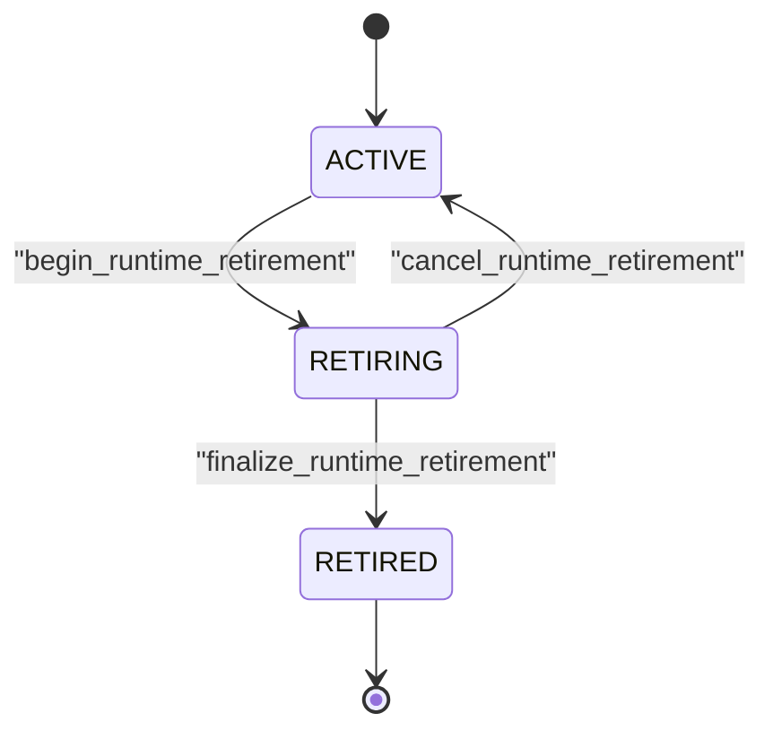
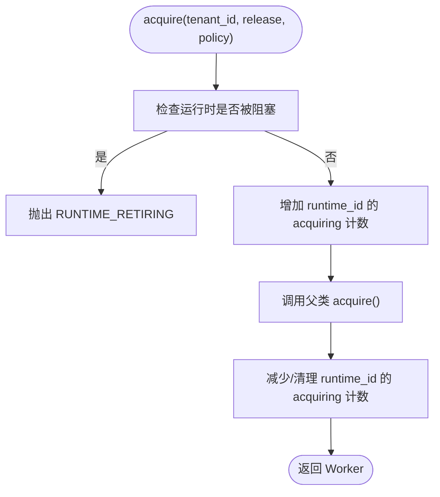
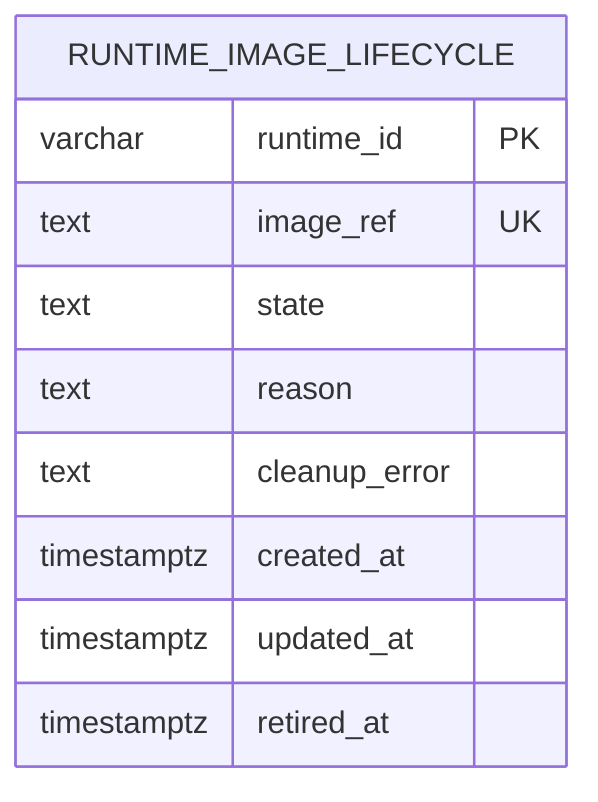
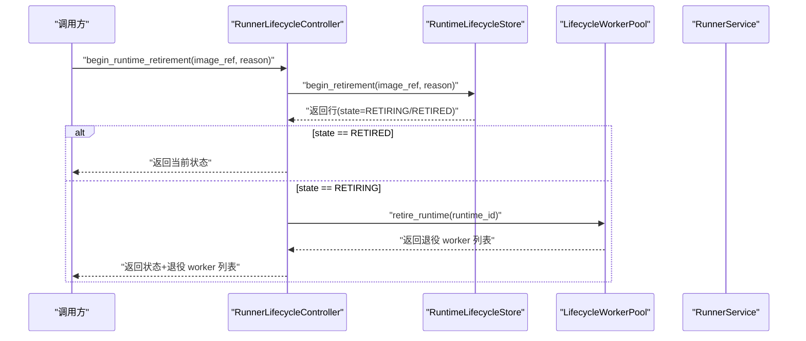
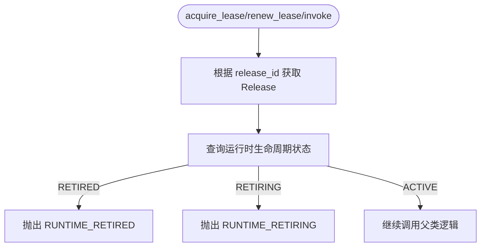
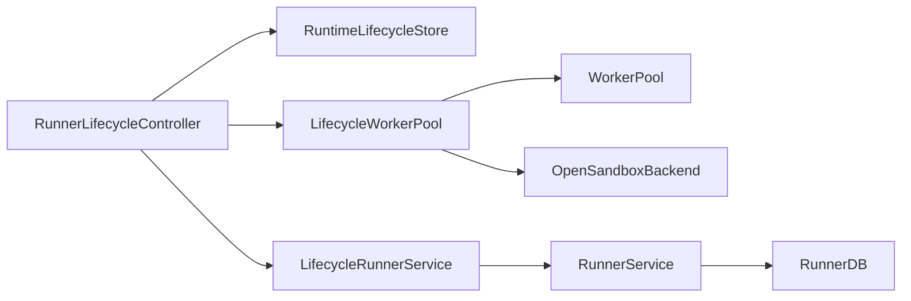

# 生命周期管理

<cite>
**本文引用的文件**   
- [lifecycle_runtime.py](file://runner_engine/lifecycle_runtime.py)
- [lifecycle_service.py](file://runner_engine/lifecycle_service.py)
- [lifecycle_store.py](file://runner_engine/lifecycle_store.py)
- [pool.py](file://runner_engine/pool.py)
- [service.py](file://runner_engine/service.py)
- [state.py](file://runner_engine/state.py)
- [model.py](file://runner_engine/model.py)
</cite>

## 目录
1. [引言](#引言)
2. [项目结构](#项目结构)
3. [核心组件](#核心组件)
4. [架构总览](#架构总览)
5. [详细组件分析](#详细组件分析)
6. [依赖关系分析](#依赖关系分析)
7. [性能与并发特性](#性能与并发特性)
8. [故障排查指南](#故障排查指南)
9. [结论](#结论)
10. [附录：最佳实践示例](#附录最佳实践示例)

## 引言
本文面向 Runner Engine 的生命周期管理系统，系统性说明算子从创建到销毁的完整生命周期流程，重点解释以下主题：
- 运行时镜像状态机：ACTIVE、RETIRING、RETIRED 的状态转换与约束。
- LifecycleWorkerPool 的设计模式：工作进程获取、释放、退役与竞态防护。
- RuntimeLifecycleStore 的状态持久化机制：数据库表结构、索引与事务语义。
- 生命周期控制器核心方法：begin_runtime_retirement、cancel_runtime_retirement、finalize_runtime_retirement 的行为与边界条件。
- 并发安全与锁机制：如何避免竞态条件与死锁。
- 状态转换图、时序图与错误处理策略。
- 实际代码路径与最佳实践建议。

## 项目结构
Runner Engine 中生命周期相关代码主要分布在 runner_engine 包内：
- lifecycle_runtime.py：生命周期控制器、扩展 WorkerPool 与后端能力。
- lifecycle_service.py：在 RunnerService 之上增加“运行时是否允许新执行”的门控。
- lifecycle_store.py：运行时镜像生命周期的持久化存储。
- pool.py：沙箱工作进程池的基础实现。
- service.py：Runner 服务主流程（租约、调用、活跃调用跟踪）。
- state.py：运行历史、幂等缓存与租约持久化。
- model.py：领域模型（Release、Worker、Lease、RunRequest 等）。

图表来源
- [lifecycle_runtime.py:187-397](file://runner_engine/lifecycle_runtime.py#L187-L397)
- [lifecycle_service.py:7-71](file://runner_engine/lifecycle_service.py#L7-L71)
- [lifecycle_store.py:35-151](file://runner_engine/lifecycle_store.py#L35-L151)
- [pool.py:11-188](file://runner_engine/pool.py#L11-L188)
- [service.py:80-456](file://runner_engine/service.py#L80-L456)
- [state.py:131-685](file://runner_engine/state.py#L131-L685)

章节来源
- [lifecycle_runtime.py:14-121](file://runner_engine/lifecycle_runtime.py#L14-L121)
- [lifecycle_service.py:7-71](file://runner_engine/lifecycle_service.py#L7-L71)
- [lifecycle_store.py:10-151](file://runner_engine/lifecycle_store.py#L10-L151)
- [pool.py:11-188](file://runner_engine/pool.py#L11-L188)
- [service.py:80-456](file://runner_engine/service.py#L80-L456)
- [state.py:131-685](file://runner_engine/state.py#L131-L685)

## 核心组件
- LifecycleWorkerPool：继承 WorkerPool，增加生命周期门控锁、按 runtime_id 统计正在 acquire 的数量、支持按 runtime 或 worker id 退役空闲工作进程。
- LifecycleOpenSandboxBackend：扩展后端能力，提供 list_managed 以枚举受管沙箱，供“可删除工件”判定使用。
- RunnerLifecycleController：编排生命周期操作，结合运行时状态、活跃调用、空闲工作进程、正在 acquire 数量与受管沙箱，判断是否可进入 RETIRED。
- LifecycleRunnerService：在 RunnerService 之上拦截 acquire_lease、renew_lease、invoke，拒绝 RETIRING/RETIRED 的新执行。
- RuntimeLifecycleStore：基于 PostgreSQL 的运行时镜像生命周期表，提供 begin/cancel/finalize/list 等操作。
- WorkerPool：工作进程池，负责沙箱复用、TTL 续期、闲置回收、销毁去重。
- RunnerService：租约、调用、活跃调用跟踪、后台清理。
- RunnerDB：租约、运行记录、幂等键表的持久化与迁移。

章节来源
- [lifecycle_runtime.py:14-185](file://runner_engine/lifecycle_runtime.py#L14-L185)
- [lifecycle_runtime.py:187-397](file://runner_engine/lifecycle_runtime.py#L187-L397)
- [lifecycle_service.py:7-71](file://runner_engine/lifecycle_service.py#L7-L71)
- [lifecycle_store.py:35-151](file://runner_engine/lifecycle_store.py#L35-L151)
- [pool.py:11-188](file://runner_engine/pool.py#L11-L188)
- [service.py:80-456](file://runner_engine/service.py#L80-L456)
- [state.py:131-685](file://runner_engine/state.py#L131-L685)

## 架构总览
生命周期管理的核心思想是“持久化的运行时镜像状态 + 进程内沙箱池门控 + 服务层入口门控”。

图表来源
- [lifecycle_runtime.py:302-359](file://runner_engine/lifecycle_runtime.py#L302-L359)
- [lifecycle_service.py:19-71](file://runner_engine/lifecycle_service.py#L19-L71)
- [lifecycle_store.py:82-136](file://runner_engine/lifecycle_store.py#L82-L136)
- [pool.py:83-120](file://runner_engine/pool.py#L83-L120)
- [service.py:146-180](file://runner_engine/service.py#L146-L180)

## 详细组件分析

### 运行时镜像状态机
运行时镜像存在三种状态：
- ACTIVE：未进入退役流程，允许新租约、续租与调用。
- RETIRING：已进入退役流程，禁止新执行；允许取消退役；当无活跃调用、无空闲工作进程、无正在 acquire、无受管沙箱时，标记为“可删除工件”。
- RETIRED：最终状态，不可回退至 ACTIVE。

图表来源
- [lifecycle_runtime.py:302-359](file://runner_engine/lifecycle_runtime.py#L302-L359)
- [lifecycle_store.py:82-136](file://runner_engine/lifecycle_store.py#L82-L136)

#### 状态约束与安全检查
- cancel_runtime_retirement：若当前状态为 RETIRED，则拒绝激活。
- finalize_runtime_retirement：仅当 safeForArtifactDeletion 为真时才允许进入 RETIRED。safeForArtifactDeletion 要求：
  - 状态为 RETIRING
  - 无活跃调用
  - 无空闲工作进程
  - 无正在 acquire 的工作进程
  - 无受管沙箱

章节来源
- [lifecycle_runtime.py:239-359](file://runner_engine/lifecycle_runtime.py#L239-L359)
- [lifecycle_store.py:82-136](file://runner_engine/lifecycle_store.py#L82-L136)

### LifecycleWorkerPool：工作进程获取、释放与退役
LifecycleWorkerPool 在 WorkerPool 基础上增加了生命周期门控：
- acquire：在进入底层 acquire 前检查运行时是否被阻塞（即是否存在生命周期记录），若阻塞则抛出 RUNTIME_RETIRING；同时维护 _acquiring 计数，用于快照与退役判定。
- retire_runtime：按 runtime_id 移除所有空闲工作进程并销毁。
- retire_idle_worker：按 worker_id 退役单个空闲工作进程。
- snapshot：返回空闲工作进程、按 runtime 分组的 acquiring 计数。

图表来源
- [lifecycle_runtime.py:26-47](file://runner_engine/lifecycle_runtime.py#L26-L47)
- [pool.py:73-130](file://runner_engine/pool.py#L73-L130)

#### 退役空闲工作进程
- retire_runtime：遍历空闲桶，匹配 runtime_id 的 worker 全部退役。
- retire_idle_worker：精确匹配 worker_id，找到后销毁。

章节来源
- [lifecycle_runtime.py:83-120](file://runner_engine/lifecycle_runtime.py#L83-L120)
- [pool.py:148-180](file://runner_engine/pool.py#L148-L180)

### RuntimeLifecycleStore：状态持久化与事务语义
数据库表 runner.runtime_image_lifecycle：
- 字段：runtime_id、image_ref、state、reason、cleanup_error、created_at、updated_at、retired_at。
- 约束：state 仅允许 RETIRING 或 RETIRED；runtime_id 为主键；image_ref 唯一。
- 索引：按 state 和 updated_at 降序排序，便于最近状态查询。

关键事务语义：
- begin_retirement：INSERT ... ON CONFLICT DO UPDATE，确保同一 runtime_id 不会重复插入；若已为 RETIRED，则保持 RETIRED。
- cancel_retirement：DELETE WHERE image_ref AND state = 'RETIRING'，原子性取消。
- finalize_retirement：UPDATE SET state = 'RETIRED'，设置 retired_at 与更新时间。

图表来源
- [lifecycle_store.py:10-28](file://runner_engine/lifecycle_store.py#L10-L28)

章节来源
- [lifecycle_store.py:35-151](file://runner_engine/lifecycle_store.py#L35-L151)

### LifecycleRunnerController：生命周期控制核心
核心方法职责：
- runtime_image_status：聚合运行时状态、发布版本、活跃调用、空闲工作进程、正在 acquire 数量、受管沙箱，计算 safeForArtifactDeletion。
- begin_runtime_retirement：写入 RETIRING，退役空闲工作进程，返回状态。
- cancel_runtime_retirement：校验非 RETIRED，原子删除 RETIRING 记录。
- finalize_runtime_retirement：校验 safeForArtifactDeletion，更新为 RETIRED。
- retire_idle_worker：退役指定空闲 worker。
- runtime_snapshot：返回活跃调用、空闲工作进程、acquiringByRuntime、近期生命周期记录。

图表来源
- [lifecycle_runtime.py:302-323](file://runner_engine/lifecycle_runtime.py#L302-L323)
- [lifecycle_store.py:82-108](file://runner_engine/lifecycle_store.py#L82-L108)
- [pool.py:83-96](file://runner_engine/pool.py#L83-L96)

章节来源
- [lifecycle_runtime.py:187-397](file://runner_engine/lifecycle_runtime.py#L187-L397)

### LifecycleRunnerService：服务层门控
在 RunnerService 之上增加运行时门控：
- acquire_lease：先查运行时状态，若 RETIRING/RETIRED 则抛出对应错误。
- renew_lease：同样检查运行时状态。
- invoke：同样检查运行时状态；注释明确说明真正的竞态关闭点在 LifecycleWorkerPool.acquire()。

图表来源
- [lifecycle_service.py:19-71](file://runner_engine/lifecycle_service.py#L19-L71)

章节来源
- [lifecycle_service.py:7-71](file://runner_engine/lifecycle_service.py#L7-L71)

### WorkerPool：工作进程池基础行为
- acquire：优先复用空闲 worker，否则创建新 worker；失败时清理资源并释放配额。
- release：根据健康状态与策略决定是否放回空闲池或销毁。
- _destroy：保证每个 worker 对象只销毁一次，并在 finally 中释放配额。
- reap：定期回收过期空闲 worker。
- reset_after_restart：重启后销毁遗留 worker，并清理受管沙箱。

章节来源
- [pool.py:11-188](file://runner_engine/pool.py#L11-L188)

### RunnerService：调用主流程与活跃调用跟踪
- startup：重启后清理池与运行记录，清理过期租约与幂等缓存。
- start_background：后台定时任务回收空闲 worker、清理过期数据。
- invoke：校验请求、获取租约、幂等与运行记录、分配 worker、执行、完成记录、释放或失效 worker。
- cancel：取消活跃调用。

章节来源
- [service.py:80-456](file://runner_engine/service.py#L80-L456)

### RunnerDB：运行历史、幂等与租约
- leases：租约表，支持创建、校验、续租、删除、清理过期。
- runs：运行历史表，支持 begin_run、finish_run、abandon_run、清理过期。
- idempotency_keys：幂等键表，支持 RUNNING/DONE 状态与结果缓存。

章节来源
- [state.py:16-82](file://runner_engine/state.py#L16-L82)
- [state.py:131-685](file://runner_engine/state.py#L131-L685)

## 依赖关系分析
- LifecycleRunnerController 依赖 RuntimeLifecycleStore 与 LifecycleRunnerService，并通过 RunnerService.pool 访问 LifecycleWorkerPool。
- LifecycleWorkerPool 依赖 WorkerPool 与 OpenSandboxBackend。
- LifecycleRunnerService 继承 RunnerService，增强运行时门控。
- RuntimeLifecycleStore 通过 psycopg_pool 连接 PostgreSQL。
- WorkerPool 依赖 SandboxBackend、Quota 与 Worker 模型。
- RunnerService 依赖 Catalog、RunnerDB、WorkerPool。
- RunnerDB 依赖 psycopg_pool 与模型 Lease、RunResult。

图表来源
- [lifecycle_runtime.py:187-397](file://runner_engine/lifecycle_runtime.py#L187-L397)
- [lifecycle_service.py:7-71](file://runner_engine/lifecycle_service.py#L7-L71)
- [lifecycle_store.py:35-151](file://runner_engine/lifecycle_store.py#L35-L151)
- [pool.py:11-188](file://runner_engine/pool.py#L11-L188)
- [service.py:80-456](file://runner_engine/service.py#L80-L456)
- [state.py:131-685](file://runner_engine/state.py#L131-L685)

## 性能与并发特性
- 生命周期门控锁：LifecycleWorkerPool._lifecycle_gate_lock 使用 RLock，保护 acquire 前的运行时阻塞检查与 _acquiring 计数更新，避免多协程/线程下竞态。
- 池内部锁：WorkerPool._lock 保护空闲桶与销毁逻辑，确保 _destroy 幂等与配额释放正确。
- 数据库事务：RuntimeLifecycleStore 的所有写操作均在单连接事务中执行，利用 PostgreSQL 的行级锁与唯一约束保证一致性。
- 后台清理：RunnerService.start_background 周期性回收空闲 worker、清理过期租约与幂等缓存，降低内存与磁盘压力。
- 受管沙箱枚举：LifecycleOpenSandboxBackend.list_managed 分页拉取受管沙箱，用于 finalize 前的安全判定。

章节来源
- [lifecycle_runtime.py:23-47](file://runner_engine/lifecycle_runtime.py#L23-L47)
- [pool.py:44-180](file://runner_engine/pool.py#L44-L180)
- [lifecycle_store.py:35-151](file://runner_engine/lifecycle_store.py#L35-L151)
- [service.py:105-138](file://runner_engine/service.py#L105-L138)
- [lifecycle_runtime.py:123-184](file://runner_engine/lifecycle_runtime.py#L123-L184)

## 故障排查指南
常见错误与定位要点：
- RUNTIME_RETIRING：运行时处于 RETIRING，无法获取沙箱。检查 begin_runtime_retirement 是否已执行，以及是否有空闲 worker 尚未退役。
- RUNTIME_RETIRED：运行时已 RETIRED，拒绝新执行。确认 finalize_runtime_retirement 是否已完成。
- 无法 finalize：safeForArtifactDeletion 为假。检查：
  - 是否有活跃调用（activeInvocations）
  - 是否有空闲 worker（idleWorkers）
  - 是否有正在 acquire 的 worker（acquiringByRuntime）
  - 是否有受管沙箱（managedSandboxes）
- 退役 worker 失败：retire_idle_worker 报错表示 worker 不空闲或非本进程拥有。
- 生命周期行消失：finalize_runtime_retirement 返回 None，可能因并发或其他进程提前清理。

章节来源
- [lifecycle_runtime.py:302-371](file://runner_engine/lifecycle_runtime.py#L302-L371)
- [lifecycle_service.py:19-71](file://runner_engine/lifecycle_service.py#L19-L71)

## 结论
Runner Engine 的生命周期管理通过“持久化状态 + 进程内门控 + 服务层拦截”三层机制，确保运行时镜像退役过程安全可控。LifecycleWorkerPool 在 acquire 边界关闭竞态，RuntimeLifecycleStore 提供强一致的状态变更，LifecycleRunnerController 协调退役流程与工件删除条件。配合 RunnerService 的活跃调用跟踪与后台清理，系统在高并发场景下仍能保持稳定与可观测性。

## 附录：最佳实践示例
以下为推荐的生命周期管理操作流程（以代码路径引用代替具体代码内容）：
- 开始退役：
  - 调用 begin_runtime_retirement(image_ref, reason)，等待返回状态。
  - 参考路径：[lifecycle_runtime.py:302-323](file://runner_engine/lifecycle_runtime.py#L302-L323)
- 取消退役：
  - 调用 cancel_runtime_retirement(image_ref)，仅在非 RETIRED 状态下成功。
  - 参考路径：[lifecycle_runtime.py:325-338](file://runner_engine/lifecycle_runtime.py#L325-L338)
- 完成退役：
  - 先查询 runtime_image_status，确认 safeForArtifactDeletion 为真。
  - 再调用 finalize_runtime_retirement(image_ref)。
  - 参考路径：[lifecycle_runtime.py:340-359](file://runner_engine/lifecycle_runtime.py#L340-L359)
- 退役空闲 worker：
  - 调用 retire_idle_worker(worker_id)，确保 worker 确为本进程空闲。
  - 参考路径：[lifecycle_runtime.py:361-371](file://runner_engine/lifecycle_runtime.py#L361-L371)
- 监控与诊断：
  - 使用 runtime_snapshot 获取活跃调用、空闲 worker、acquiringByRuntime 与近期生命周期记录。
  - 参考路径：[lifecycle_runtime.py:373-397](file://runner_engine/lifecycle_runtime.py#L373-L397)