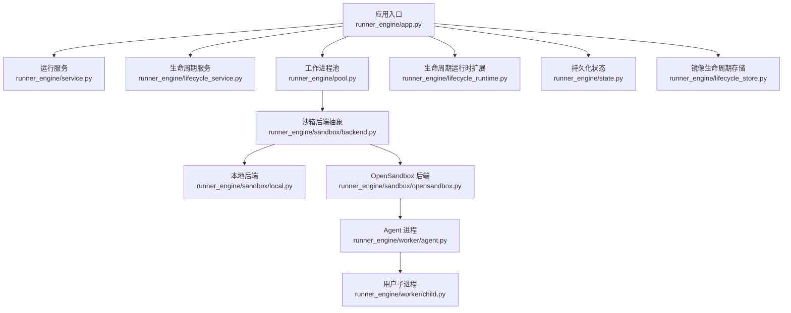
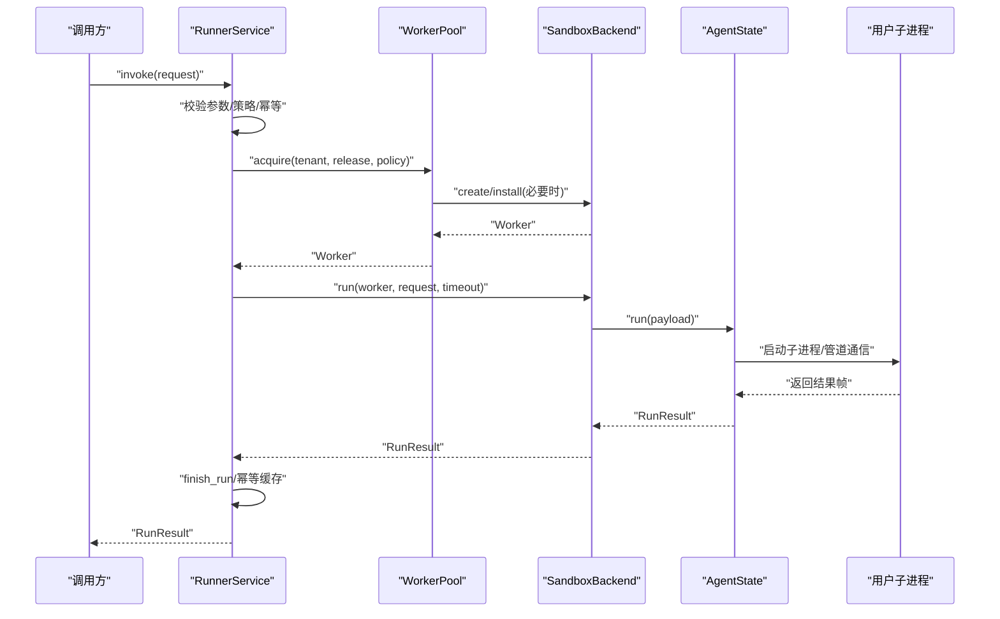
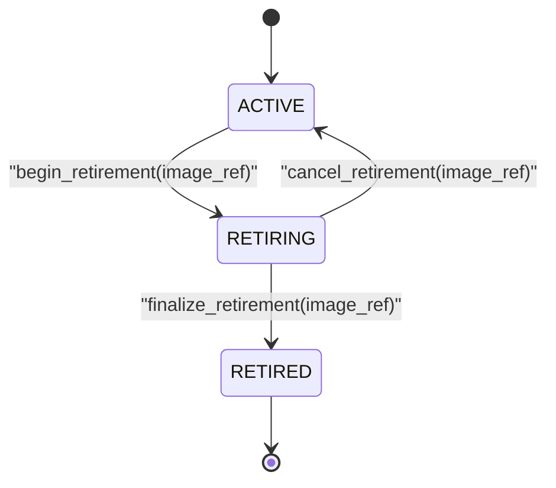
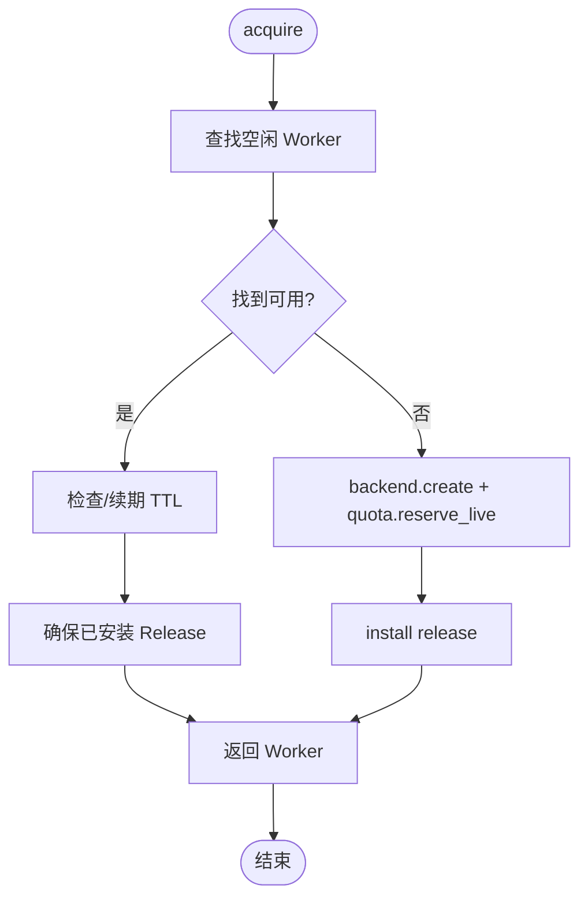
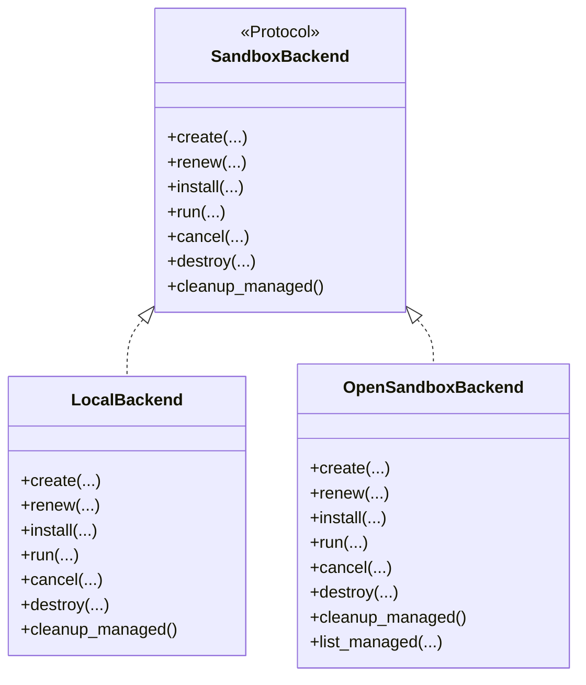
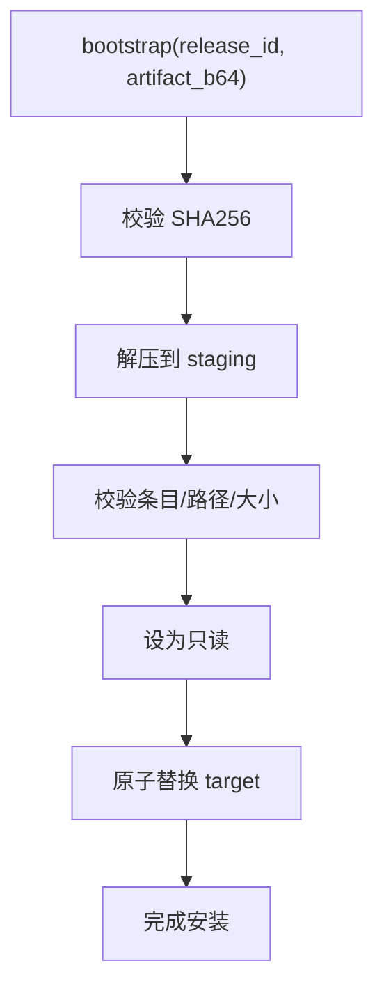
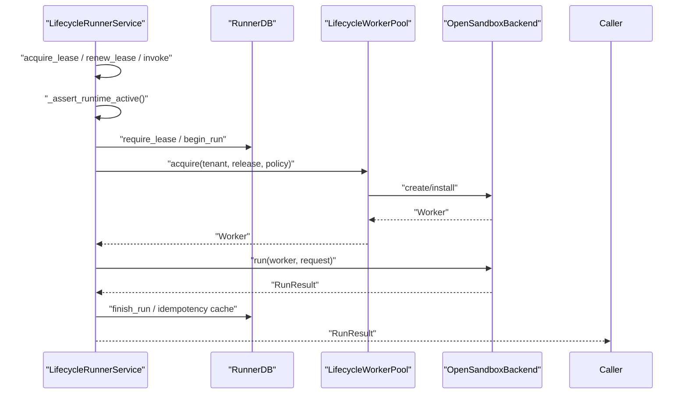
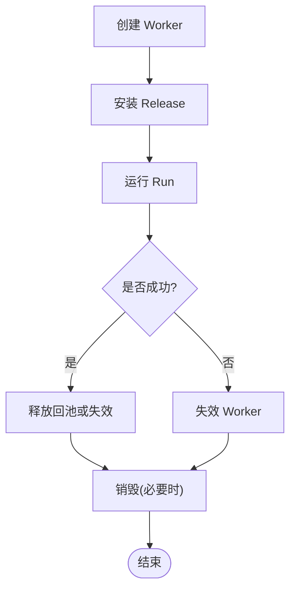
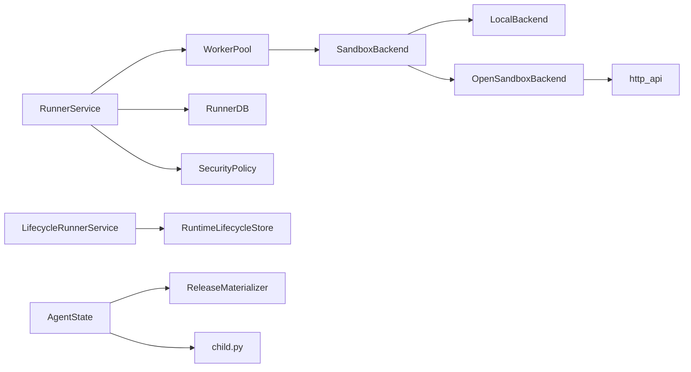

# 组件设计

<cite>
**本文引用的文件**   
- [runner_engine/app.py](file://runner_engine/app.py)
- [runner_engine/service.py](file://runner_engine/service.py)
- [runner_engine/lifecycle_service.py](file://runner_engine/lifecycle_service.py)
- [runner_engine/pool.py](file://runner_engine/pool.py)
- [runner_engine/lifecycle_runtime.py](file://runner_engine/lifecycle_runtime.py)
- [runner_engine/lifecycle_store.py](file://runner_engine/lifecycle_store.py)
- [runner_engine/state.py](file://runner_engine/state.py)
- [runner_engine/model.py](file://runner_engine/model.py)
- [runner_engine/errors.py](file://runner_engine/errors.py)
- [runner_engine/sandbox/backend.py](file://runner_engine/sandbox/backend.py)
- [runner_engine/sandbox/local.py](file://runner_engine/sandbox/local.py)
- [runner_engine/sandbox/opensandbox.py](file://runner_engine/sandbox/opensandbox.py)
- [runner_engine/worker/agent.py](file://runner_engine/worker/agent.py)
- [runner_engine/worker/child.py](file://runner_engine/worker/child.py)
- [runner_engine/worker/http_api.py](file://runner_engine/worker/http_api.py)
- [runner_engine/worker/materialize.py](file://runner_engine/worker/materialize.py)
</cite>

## 目录
1. [引言](#引言)
2. [项目结构](#项目结构)
3. [核心组件](#核心组件)
4. [架构总览](#架构总览)
5. [详细组件分析](#详细组件分析)
6. [依赖关系分析](#依赖关系分析)
7. [性能与容量特性](#性能与容量特性)
8. [故障排查指南](#故障排查指南)
9. [结论](#结论)

## 引言
本设计文档面向 Runner Engine 系统，聚焦于算子运行时的生命周期管理、工作进程池、沙箱后端抽象、构建器与协调器等关键组件。文档从系统架构、组件职责、数据流、错误处理与恢复机制等维度展开，重点说明：
- 生命周期管理模式：算子的创建、启动、运行、停止与销毁全过程；
- 工作进程隔离机制：进程级隔离、文件系统虚拟化与资源限制；
- 沙箱后端抽象与多后端支持：本地后端与 OpenSandbox 后端；
- 组件状态管理、错误分类与可重试策略；
- 组件交互时序图与状态转换图。

## 项目结构
Runner Engine 的核心代码位于 runner_engine 包内，按职责划分为服务层、生命周期层、存储层、沙箱层与工作进程层。入口程序负责装配各组件并启动 gRPC 服务与管理接口。

**图表来源**
- [runner_engine/app.py:26-227](file://runner_engine/app.py#L26-L227)
- [runner_engine/service.py:80-115](file://runner_engine/service.py#L80-L115)
- [runner_engine/lifecycle_service.py:7-71](file://runner_engine/lifecycle_service.py#L7-L71)
- [runner_engine/pool.py:11-46](file://runner_engine/pool.py#L11-L46)
- [runner_engine/lifecycle_runtime.py:14-23](file://runner_engine/lifecycle_runtime.py#L14-L23)
- [runner_engine/state.py:131-149](file://runner_engine/state.py#L131-L149)
- [runner_engine/lifecycle_store.py:35-47](file://runner_engine/lifecycle_store.py#L35-L47)
- [runner_engine/sandbox/backend.py:14-49](file://runner_engine/sandbox/backend.py#L14-L49)
- [runner_engine/sandbox/local.py:14-62](file://runner_engine/sandbox/local.py#L14-L62)
- [runner_engine/sandbox/opensandbox.py:31-50](file://runner_engine/sandbox/opensandbox.py#L31-L50)
- [runner_engine/worker/agent.py:309-349](file://runner_engine/worker/agent.py#L309-L349)
- [runner_engine/worker/child.py:347-414](file://runner_engine/worker/child.py#L347-L414)

**章节来源**
- [runner_engine/app.py:26-227](file://runner_engine/app.py#L26-L227)

## 核心组件
- 运行服务 RunnerService：编排租约、幂等执行、结果落库与后台清理。
- 生命周期服务 LifecycleRunnerService：在 RunnerService 之上增加运行时镜像的活跃性检查。
- 工作进程池 WorkerPool/LifecycleWorkerPool：按租户+运行时+安全策略复用沙箱，控制空闲回收、TTL 续期与安装释放。
- 沙箱后端 SandboxBackend：抽象后端能力，提供 create/renew/install/run/cancel/destroy/cleanup_managed。
- 本地后端 LocalBackend：开发测试用，直接调用 AgentState。
- OpenSandbox 后端 OpenSandboxBackend：通过 HTTP API 与远端沙箱集群交互，封装健康检查与端点发现。
- Agent 进程 AgentState：受信任代理，单并发执行用户子进程，负责文件系统隔离、资源限制与协议校验。
- 用户子进程 child.py：加载用户模块、执行入口函数、规范化输出并遵守输出大小与属性限制。
- 持久化状态 RunnerDB：租约表、执行历史表与幂等键缓存表。
- 镜像生命周期 RuntimeLifecycleStore：记录镜像 RETIRING/RETIRED 状态，驱动池退役与拒绝新请求。
- 模型 model.py：RuntimeEnv、OperatorRelease、SecurityPolicy、Lease、RunRequest、RunResult、Worker、ActiveRun。
- 错误体系 errors.py：统一错误类型与可重试标记。

**章节来源**
- [runner_engine/service.py:80-456](file://runner_engine/service.py#L80-L456)
- [runner_engine/lifecycle_service.py:7-71](file://runner_engine/lifecycle_service.py#L7-L71)
- [runner_engine/pool.py:11-188](file://runner_engine/pool.py#L11-L188)
- [runner_engine/lifecycle_runtime.py:14-185](file://runner_engine/lifecycle_runtime.py#L14-L185)
- [runner_engine/sandbox/backend.py:14-49](file://runner_engine/sandbox/backend.py#L14-L49)
- [runner_engine/sandbox/local.py:14-132](file://runner_engine/sandbox/local.py#L14-L132)
- [runner_engine/sandbox/opensandbox.py:31-440](file://runner_engine/sandbox/opensandbox.py#L31-L440)
- [runner_engine/worker/agent.py:309-798](file://runner_engine/worker/agent.py#L309-L798)
- [runner_engine/worker/child.py:272-345](file://runner_engine/worker/child.py#L272-L345)
- [runner_engine/state.py:131-685](file://runner_engine/state.py#L131-L685)
- [runner_engine/lifecycle_store.py:35-151](file://runner_engine/lifecycle_store.py#L35-L151)
- [runner_engine/model.py:7-98](file://runner_engine/model.py#L7-L98)
- [runner_engine/errors.py:1-22](file://runner_engine/errors.py#L1-L22)

## 架构总览
Runner Engine 采用“服务编排 + 池化沙箱 + 后端抽象”的分层架构。上层服务负责权限、配额、幂等与结果持久化；中间层池化沙箱负责资源复用与生命周期；底层后端对接具体实现（本地或 OpenSandbox）。Agent 作为可信代理，在沙箱内拉起用户子进程，严格限制 I/O、进程数、CPU 与内存地址空间，并通过自定义二进制帧协议进行通信。

**图表来源**
- [runner_engine/service.py:188-405](file://runner_engine/service.py#L188-L405)
- [runner_engine/pool.py:73-130](file://runner_engine/pool.py#L73-L130)
- [runner_engine/sandbox/backend.py:31-45](file://runner_engine/sandbox/backend.py#L31-L45)
- [runner_engine/worker/agent.py:467-798](file://runner_engine/worker/agent.py#L467-L798)
- [runner_engine/worker/child.py:347-414](file://runner_engine/worker/child.py#L347-L414)

## 详细组件分析

### 生命周期管理器
生命周期管理器由三部分构成：
- 镜像生命周期存储 RuntimeLifecycleStore：以 PostgreSQL 持久化镜像的 RETIRING/RETIRED 状态，提供开始退役、取消退役、最终退役与查询接口。
- 生命周期运行时扩展 LifecycleWorkerPool：在 WorkerPool.acquire 前检查镜像是否处于阻塞态，阻止新建沙箱；退役时主动销毁空闲沙箱。
- 生命周期服务 LifecycleRunnerService：在 acquire_lease、renew_lease、invoke 前检查运行时镜像状态，阻断对 RETIRED/RETIRING 的新请求。

**图表来源**
- [runner_engine/lifecycle_store.py:82-136](file://runner_engine/lifecycle_store.py#L82-L136)
- [runner_engine/lifecycle_runtime.py:83-120](file://runner_engine/lifecycle_runtime.py#L83-L120)
- [runner_engine/lifecycle_service.py:19-32](file://runner_engine/lifecycle_service.py#L19-L32)

**章节来源**
- [runner_engine/lifecycle_store.py:35-151](file://runner_engine/lifecycle_store.py#L35-L151)
- [runner_engine/lifecycle_runtime.py:14-120](file://runner_engine/lifecycle_runtime.py#L14-L120)
- [runner_engine/lifecycle_service.py:7-71](file://runner_engine/lifecycle_service.py#L7-L71)

### 工作进程池与隔离机制
WorkerPool 按 (tenant_id, runtime.id, profile) 为键维护空闲 Worker 桶，支持：
- 空闲回收：超过 idle_seconds 的 Worker 被销毁；
- TTL 续期：接近过期时调用 backend.renew；
- 发布物安装：按需 install release；
- 配额保护：creation_slot 与 reserve_live/release_live 控制并发创建与在线数量；
- 幂等销毁：_destroy 保证每个 Worker 仅销毁一次并释放配额。

隔离机制体现在：
- 进程级隔离：Agent 使用 start_new_session 拉起子进程，通过进程组信号终止；
- 文件系统虚拟化：child.py 设置 sys.path 与 path_virtualization，限定导入路径；
- 资源限制：RLIMIT_CPU/NOFILE/NPROC/AS 与 UID/GID 切换；
- 输出与属性限制：最大输出字节、属性数量与属性字节上限。

**图表来源**
- [runner_engine/pool.py:73-130](file://runner_engine/pool.py#L73-L130)

**章节来源**
- [runner_engine/pool.py:11-188](file://runner_engine/pool.py#L11-L188)
- [runner_engine/worker/child.py:55-84](file://runner_engine/worker/child.py#L55-L84)
- [runner_engine/worker/child.py:258-270](file://runner_engine/worker/child.py#L258-L270)
- [runner_engine/worker/child.py:272-345](file://runner_engine/worker/child.py#L272-L345)

### 沙箱后端抽象与多后端支持
SandboxBackend 定义统一的后端接口，包含 create/renew/install/run/cancel/destroy/cleanup_managed。当前实现包括：
- LocalBackend：用于开发与测试，直接操作 AgentState 与临时目录；
- OpenSandboxBackend：通过 HTTP API 与远端集群交互，封装端点发现、健康检查、TTL 续期与托管资源清理。

**图表来源**
- [runner_engine/sandbox/backend.py:14-49](file://runner_engine/sandbox/backend.py#L14-L49)
- [runner_engine/sandbox/local.py:14-132](file://runner_engine/sandbox/local.py#L14-L132)
- [runner_engine/sandbox/opensandbox.py:31-440](file://runner_engine/sandbox/opensandbox.py#L31-L440)

**章节来源**
- [runner_engine/sandbox/backend.py:14-49](file://runner_engine/sandbox/backend.py#L14-L49)
- [runner_engine/sandbox/local.py:14-132](file://runner_engine/sandbox/local.py#L14-L132)
- [runner_engine/sandbox/opensandbox.py:31-440](file://runner_engine/sandbox/opensandbox.py#L31-L440)

### 构建器与发布物材料化
发布物通过 ReleaseMaterializer 解压到 releases_root，校验 SHA256、限制文件数量与展开大小、禁止特殊文件与路径穿越，并在完成后设为只读。Agent 在 bootstrap 阶段将发布物安装到沙箱，供后续 run 使用。

**图表来源**
- [runner_engine/worker/materialize.py:31-122](file://runner_engine/worker/materialize.py#L31-L122)
- [runner_engine/worker/agent.py:353-368](file://runner_engine/worker/agent.py#L353-L368)

**章节来源**
- [runner_engine/worker/materialize.py:11-122](file://runner_engine/worker/materialize.py#L11-L122)
- [runner_engine/worker/agent.py:353-368](file://runner_engine/worker/agent.py#L353-L368)

### 服务协调器与编排
RunnerService 负责：
- 启动清理：重置池残留、标记废弃执行、清理过期租约与幂等键；
- 租约管理：创建、续租、释放；
- 执行编排：参数校验、策略裁剪、幂等 claim、Worker 获取、后端 run、结果落库与缓存；
- 后台任务：定时回收空闲 Worker、清理过期数据与旧执行记录。

LifecycleRunnerService 在其基础上增加运行时镜像活跃性检查，防止对 RETIRING/RETIRED 的新请求。

**图表来源**
- [runner_engine/lifecycle_service.py:34-71](file://runner_engine/lifecycle_service.py#L34-L71)
- [runner_engine/service.py:146-405](file://runner_engine/service.py#L146-L405)
- [runner_engine/lifecycle_runtime.py:26-47](file://runner_engine/lifecycle_runtime.py#L26-L47)

**章节来源**
- [runner_engine/service.py:105-145](file://runner_engine/service.py#L105-L145)
- [runner_engine/service.py:146-456](file://runner_engine/service.py#L146-L456)
- [runner_engine/lifecycle_service.py:7-71](file://runner_engine/lifecycle_service.py#L7-L71)

### 算子生命周期全流程
算子生命周期贯穿以下阶段：
- 创建：pool.acquire -> backend.create -> agent 健康检查 -> worker 就绪；
- 启动：release.install -> agent.bootstrap；
- 运行：service.invoke -> backend.run -> agent.run -> child.execute；
- 停止：超时/取消/异常 -> agent 清理子进程与资源 -> service.finish_run；
- 销毁：pool.release/invalidate -> backend.destroy -> quota.release_live。

**图表来源**
- [runner_engine/pool.py:73-188](file://runner_engine/pool.py#L73-L188)
- [runner_engine/service.py:270-405](file://runner_engine/service.py#L270-L405)
- [runner_engine/worker/agent.py:467-798](file://runner_engine/worker/agent.py#L467-L798)

**章节来源**
- [runner_engine/pool.py:73-188](file://runner_engine/pool.py#L73-L188)
- [runner_engine/service.py:270-405](file://runner_engine/service.py#L270-L405)
- [runner_engine/worker/agent.py:467-798](file://runner_engine/worker/agent.py#L467-L798)

## 依赖关系分析
- RunnerService 依赖 Catalog、RunnerDB、WorkerPool 与安全策略；
- LifecycleRunnerService 依赖 RuntimeLifecycleStore；
- WorkerPool 依赖 SandboxBackend 与 Quota；
- OpenSandboxBackend 依赖 http_api 与外部集群 API；
- AgentState 依赖 ReleaseMaterializer 与 child.py；
- child.py 依赖 path_virtualization 与操作系统资源限制。

**图表来源**
- [runner_engine/service.py:80-115](file://runner_engine/service.py#L80-L115)
- [runner_engine/lifecycle_service.py:7-17](file://runner_engine/lifecycle_service.py#L7-L17)
- [runner_engine/pool.py:11-46](file://runner_engine/pool.py#L11-L46)
- [runner_engine/sandbox/opensandbox.py:31-50](file://runner_engine/sandbox/opensandbox.py#L31-L50)
- [runner_engine/worker/agent.py:309-349](file://runner_engine/worker/agent.py#L309-L349)
- [runner_engine/worker/child.py:272-345](file://runner_engine/worker/child.py#L272-L345)

**章节来源**
- [runner_engine/service.py:80-115](file://runner_engine/service.py#L80-L115)
- [runner_engine/lifecycle_service.py:7-17](file://runner_engine/lifecycle_service.py#L7-L17)
- [runner_engine/pool.py:11-46](file://runner_engine/pool.py#L11-L46)
- [runner_engine/sandbox/opensandbox.py:31-50](file://runner_engine/sandbox/opensandbox.py#L31-L50)
- [runner_engine/worker/agent.py:309-349](file://runner_engine/worker/agent.py#L309-L349)
- [runner_engine/worker/child.py:272-345](file://runner_engine/worker/child.py#L272-L345)

## 性能与容量特性
- 工作进程池复用：按租户+运行时+策略复用沙箱，减少冷启动开销；
- 空闲回收与 TTL 续期：避免僵尸沙箱，保障资源利用率；
- 幂等执行与结果缓存：降低重复请求成本；
- 后台清理：定期清理过期租约、幂等键与旧执行记录；
- 输出与属性限制：防止大对象与属性膨胀影响吞吐；
- 资源限制：CPU、文件描述符、进程数与地址空间限制，提升稳定性。

[本节为通用指导，不直接分析具体文件]

## 故障排查指南
常见错误与定位要点：
- RUNTIME_RETIRING/RUNTIME_RETIRED：运行时镜像进入退役流程，需等待活跃执行与空闲沙箱归零；
- LEASE_EXPIRED/LEASE_FORBIDDEN：租约过期或归属租户不匹配；
- IDEMPOTENCY_CONFLICT/RUN_IN_PROGRESS：幂等键冲突或逻辑请求仍在运行；
- OUTPUT_LIMIT/LOG_LIMIT/CHILD_PROTOCOL_ERROR：用户输出超限、日志超限或子进程协议异常；
- SANDBOX_START_FAILED/SANDBOX_ENDPOINT_MISSING：OpenSandbox 沙箱未就绪或缺少端点；
- AGENT_START_TIMEOUT：Agent 健康检查超时；
- USER_PROCESS_EXITED/USER_PROCESS_SIGNALED：用户子进程异常退出或被信号终止。

建议排查步骤：
- 检查 RunnerService 后台清理日志与数据库 runs/idempotency_keys 状态；
- 查看 LifecycleController 的 runtime_image_status 快照，确认活跃调用与空闲 Worker；
- 检查 OpenSandbox 后端 list_managed 与集群 API 响应；
- 审查 Agent 健康检查与 child 协议帧长度、内容大小与属性限制；
- 核对 SecurityPolicy 中的 CPU/Memory/Timeout 配置是否与后端一致。

**章节来源**
- [runner_engine/service.py:334-405](file://runner_engine/service.py#L334-L405)
- [runner_engine/lifecycle_runtime.py:239-300](file://runner_engine/lifecycle_runtime.py#L239-L300)
- [runner_engine/sandbox/opensandbox.py:192-302](file://runner_engine/sandbox/opensandbox.py#L192-L302)
- [runner_engine/worker/agent.py:696-778](file://runner_engine/worker/agent.py#L696-L778)
- [runner_engine/worker/child.py:230-246](file://runner_engine/worker/child.py#L230-L246)

## 结论
Runner Engine 通过清晰的分层与抽象，实现了高内聚、低耦合的算子运行环境：服务层负责编排与一致性，池化层负责资源复用与生命周期，后端层屏蔽异构实现差异，Agent 与 child 进程提供强隔离与资源约束。结合幂等执行、结果缓存与后台清理，系统在可用性、可扩展性与安全性方面具备良好平衡。未来可在后端抽象上继续扩展更多沙箱实现，并在策略引擎中引入更细粒度的网络与文件系统访问控制。