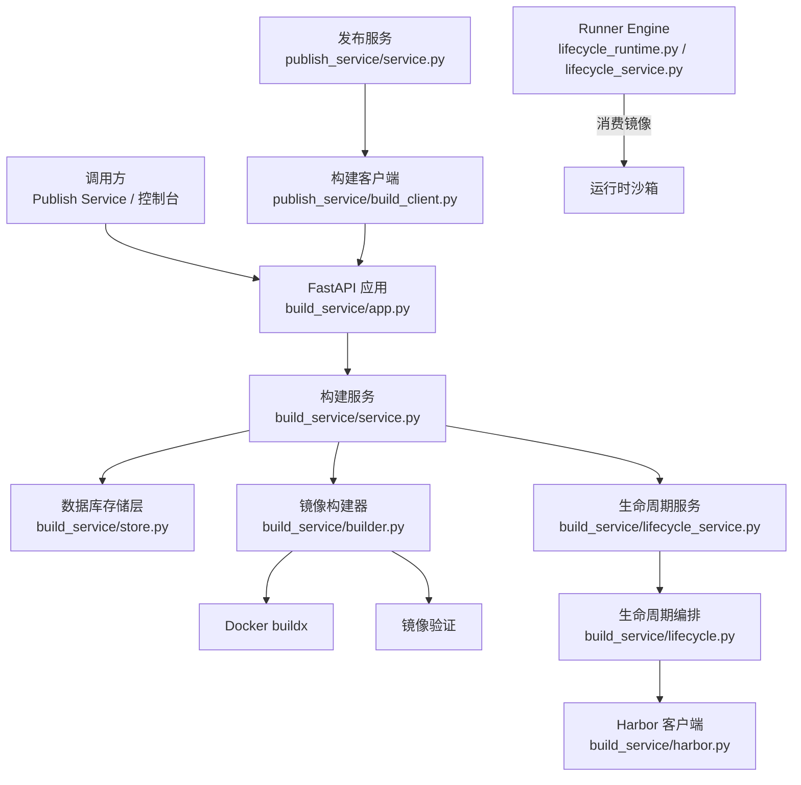
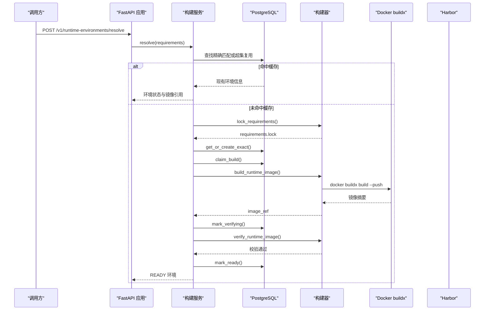
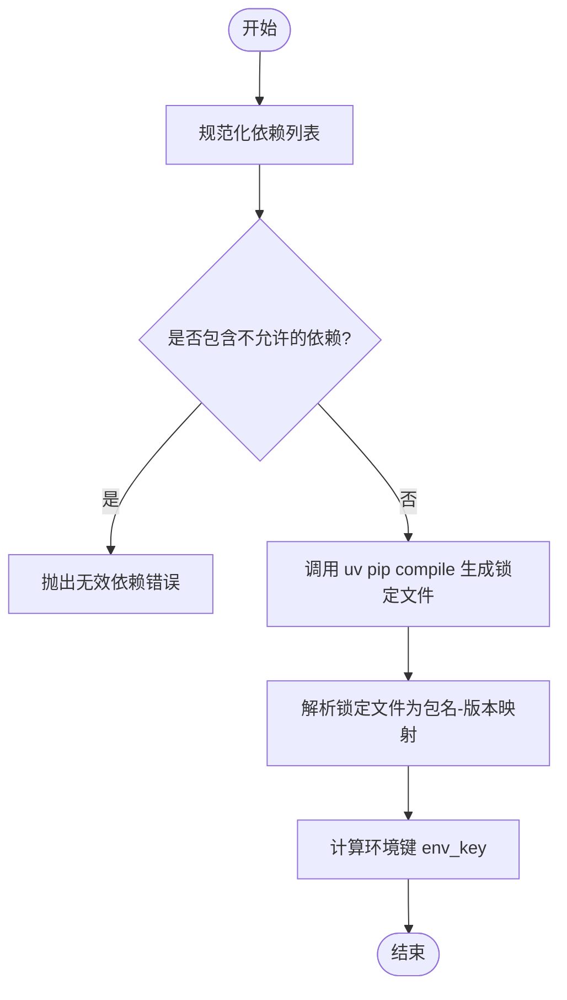
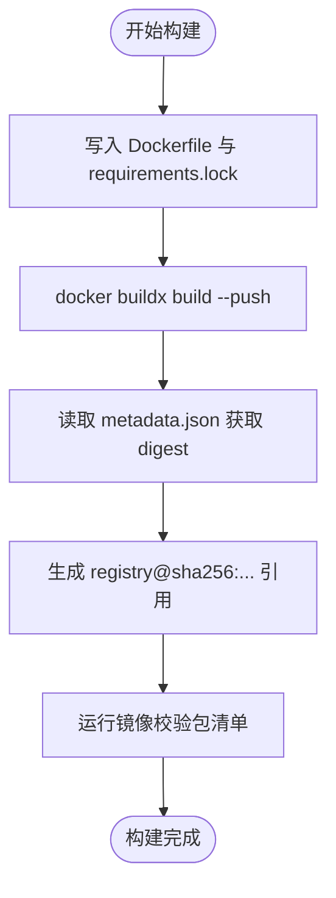
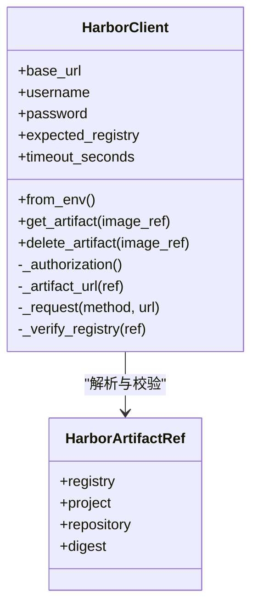
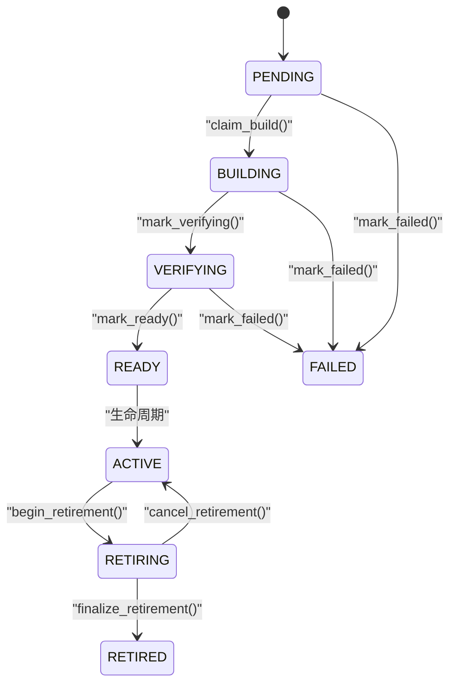
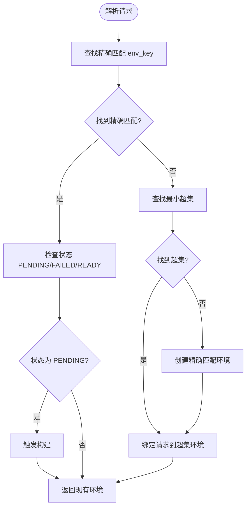
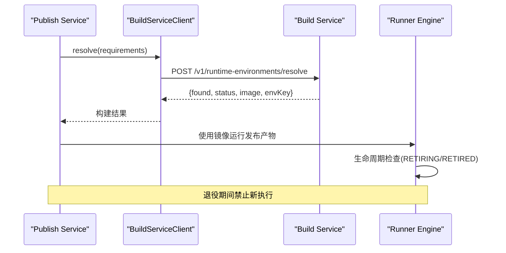
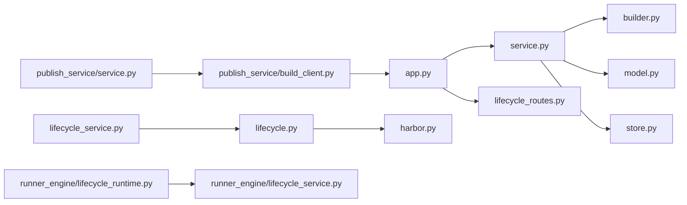

# Build Service

<cite>
**本文引用的文件**   
- [build_service/app.py](file://build_service/app.py)
- [build_service/service.py](file://build_service/service.py)
- [build_service/builder.py](file://build_service/builder.py)
- [build_service/model.py](file://build_service/model.py)
- [build_service/store.py](file://build_service/store.py)
- [build_service/lifecycle.py](file://build_service/lifecycle.py)
- [build_service/lifecycle_routes.py](file://build_service/lifecycle_routes.py)
- [build_service/lifecycle_service.py](file://build_service/lifecycle_service.py)
- [publish_service/build_client.py](file://publish_service/build_client.py)
- [publish_service/service.py](file://publish_service/service.py)
- [runner_engine/lifecycle_runtime.py](file://runner_engine/lifecycle_runtime.py)
- [runner_engine/lifecycle_service.py](file://runner_engine/lifecycle_service.py)
</cite>

## 目录
1. [简介](#简介)
2. [项目结构](#项目结构)
3. [核心组件](#核心组件)
4. [架构总览](#架构总览)
5. [详细组件分析](#详细组件分析)
6. [依赖关系分析](#依赖关系分析)
7. [性能与并行构建优化](#性能与并行构建优化)
8. [故障诊断指南](#故障诊断指南)
9. [结论](#结论)
10. [附录：API、配置与最佳实践](#附录api配置与最佳实践)

## 简介
Build Service 是 Python 运行时镜像的构建与生命周期管理中心。它负责：
- 解析 Python 依赖并生成可复现的锁定文件；
- 基于 Docker buildx 构建多阶段镜像，并推送到 Harbor 镜像仓库；
- 对已构建镜像进行包级校验；
- 管理运行时的“精确匹配”和“超集复用”缓存策略；
- 提供构建任务状态查询、重试、以及环境退役清理等生命周期能力；
- 与 Publish Service 集成以驱动发布流程，并与 Runner Engine 协同实现运行时退役与沙箱回收。

该服务通过 FastAPI 暴露 REST API，使用 PostgreSQL 持久化构建元数据，并通过环境变量完成 Harbor、基础镜像、平台等关键配置。

## 项目结构
Build Service 代码位于 `build_service/` 目录，核心模块职责如下：
- `app.py`：FastAPI 应用入口、健康检查、主要 HTTP 路由、日志与启动参数。
- `service.py`：构建服务主逻辑，包括依赖解析、缓存复用、构建调度与结果落库。
- `builder.py`：依赖锁定、Docker 镜像构建与镜像内包校验。
- `model.py`：构建规格模型、锁定包解析与环境键计算。
- `store.py`：PostgreSQL 建表、索引、构建任务与状态迁移。
- `lifecycle.py`：环境退役计划与 Harbor 清理编排。
- `lifecycle_routes.py`：管理员生命周期接口（退役、取消退役、删除制品）。
- `lifecycle_service.py`：将生命周期能力注入到构建服务中。

**图表来源**
- [build_service/app.py:106-181](file://build_service/app.py#L106-L181)
- [build_service/service.py:26-215](file://build_service/service.py#L26-L215)
- [build_service/builder.py:122-158](file://build_service/builder.py#L122-L158)
- [build_service/lifecycle_service.py:293-322](file://build_service/lifecycle_service.py#L293-L322)
- [publish_service/build_client.py:13-30](file://publish_service/build_client.py#L13-L30)
- [runner_engine/lifecycle_runtime.py:187-359](file://runner_engine/lifecycle_runtime.py#L187-L359)

**章节来源**
- [build_service/app.py:1-217](file://build_service/app.py#L1-L217)
- [build_service/service.py:1-216](file://build_service/service.py#L1-L216)
- [build_service/builder.py:1-205](file://build_service/builder.py#L1-L205)
- [build_service/model.py:1-71](file://build_service/model.py#L1-L71)
- [build_service/store.py:1-331](file://build_service/store.py#L1-L331)
- [build_service/lifecycle.py:1-134](file://build_service/lifecycle.py#L1-L134)
- [build_service/lifecycle_routes.py:1-108](file://build_service/lifecycle_routes.py#L1-L108)
- [build_service/lifecycle_service.py:1-323](file://build_service/lifecycle_service.py#L1-L323)

## 核心组件
- **FastAPI 应用与路由**：提供健康检查、环境解析、环境查询、重试以及管理员生命周期接口。
- **构建服务**：封装依赖解析、缓存查找、构建任务抢占、镜像构建与验证、状态更新。
- **构建器**：调用 `uv pip compile` 生成锁定文件，调用 `docker buildx build` 构建并推送镜像，随后在容器内执行包清单校验。
- **模型**：定义构建规格、锁定包解析、环境键计算。
- **存储层**：维护运行时环境、别名映射、构建作业、状态机字段与索引。
- **生命周期**：支持 ACTIVE/RETIRING/RETIRED 三态，协调 Harbor 制品删除与清理错误记录。
- **Harbor 客户端**：最小化的 Harbor v2 API 客户端，支持制品查询与删除，包含证书与安全选项。

**章节来源**
- [build_service/app.py:106-181](file://build_service/app.py#L106-L181)
- [build_service/service.py:26-215](file://build_service/service.py#L26-L215)
- [build_service/builder.py:62-205](file://build_service/builder.py#L62-L205)
- [build_service/model.py:17-71](file://build_service/model.py#L17-L71)
- [build_service/store.py:65-331](file://build_service/store.py#L65-L331)
- [build_service/lifecycle.py:45-133](file://build_service/lifecycle.py#L45-L133)
- [build_service/harbor.py:57-196](file://build_service/harbor.py#L57-L196)

## 架构总览
Build Service 的整体交互如下：
- 外部调用者（如 Publish Service）通过 `/v1/runtime-environments/resolve` 提交 Python 依赖列表；
- 服务内部先尝试复用已有环境（精确匹配或超集复用），否则进入构建流程；
- 构建流程包括依赖锁定、镜像构建、镜像推送、镜像验证；
- 成功后返回稳定的镜像引用；失败时记录错误并可重试；
- 管理员可通过生命周期接口退役旧环境，并在 Runner Engine 确认安全后删除 Harbor 制品。

**图表来源**
- [build_service/app.py:140-149](file://build_service/app.py#L140-L149)
- [build_service/service.py:31-119](file://build_service/service.py#L31-L119)
- [build_service/builder.py:84-158](file://build_service/builder.py#L84-L158)
- [build_service/store.py:170-271](file://build_service/store.py#L170-L271)

## 详细组件分析

### 依赖解析与锁定算法
- 输入为 Python 依赖字符串列表；
- 规范化依赖：去除空行、拒绝换行符、VCS/URL/path 依赖；
- 使用 `uv pip compile` 生成带哈希的锁定文件，支持指定 Python 版本与平台；
- 解析锁定文件为包名到版本的字典，用于后续镜像内校验与超集复用比较；
- 计算环境键：由基础镜像、Python 版本、平台、锁定文件摘要、构建策略版本共同决定。

**图表来源**
- [build_service/builder.py:62-119](file://build_service/builder.py#L62-L119)
- [build_service/model.py:17-71](file://build_service/model.py#L17-L71)

**章节来源**
- [build_service/builder.py:62-119](file://build_service/builder.py#L62-L119)
- [build_service/model.py:17-71](file://build_service/model.py#L17-L71)

### Docker 镜像构建与优化策略
- 使用多阶段 Dockerfile：第一阶段安装用户依赖到独立目录，第二阶段仅复制依赖目录并设置运行时环境变量；
- 通过 `RUNNER_BASE` 构建参数注入基础镜像，确保可信 Agent 不依赖用户依赖路径；
- 使用 `docker buildx build --platform` 构建目标平台镜像，并直接推送至仓库；
- 从 metadata 文件中提取镜像摘要，形成稳定引用；
- 构建完成后在镜像内运行脚本校验包清单，确保依赖与锁定一致。

**图表来源**
- [build_service/builder.py:14-59](file://build_service/builder.py#L14-L59)
- [build_service/builder.py:122-158](file://build_service/builder.py#L122-L158)
- [build_service/builder.py:161-205](file://build_service/builder.py#L161-L205)

**章节来源**
- [build_service/builder.py:14-59](file://build_service/builder.py#L14-L59)
- [build_service/builder.py:122-205](file://build_service/builder.py#L122-L205)

### Harbor 镜像仓库管理
- Harbor 客户端支持 Basic 认证、可选 CA 文件与不安全模式；
- 支持按 `registry/project/repository@sha256:...` 格式解析镜像引用；
- 支持查询与删除制品，删除冲突时抛出特定异常；
- 支持强制期望注册表，防止误删其他仓库制品。

**图表来源**
- [build_service/harbor.py:21-54](file://build_service/harbor.py#L21-L54)
- [build_service/harbor.py:57-196](file://build_service/harbor.py#L57-L196)

**章节来源**
- [build_service/harbor.py:1-196](file://build_service/harbor.py#L1-L196)

### 构建任务调度与状态机
- 环境状态：PENDING、BUILDING、VERIFYING、READY、FAILED；
- 构建作业：每个构建尝试对应一个 job，记录 BUILDING/VERIFYING/READY/FAILED 状态；
- 并发控制：通过 `claim_build()` 原子抢占 PENDING 环境，避免重复构建；
- 生命周期状态：ACTIVE、RETIRING、RETIRED，与构建状态正交；
- 退役流程：无活跃构建且无活动工作负载时可进入 RETIRING，最终 RE TIRED 并清理别名。

**图表来源**
- [build_service/store.py:12-62](file://build_service/store.py#L12-L62)
- [build_service/store.py:226-331](file://build_service/store.py#L226-L331)
- [build_service/lifecycle.py:9-133](file://build_service/lifecycle.py#L9-L133)

**章节来源**
- [build_service/store.py:12-62](file://build_service/store.py#L12-L62)
- [build_service/store.py:226-331](file://build_service/store.py#L226-L331)
- [build_service/lifecycle.py:9-133](file://build_service/lifecycle.py#L9-L133)

### 构建缓存与超集复用
- 精确匹配：根据 env_key 查找完全相同的构建规格；
- 超集复用：若允许，则查找 packages 包含当前需求的更小超集镜像，减少重复构建；
- 绑定请求：将请求 env_key 绑定到具体环境 id，便于后续查询与监控；
- 复用优先级：优先返回已存在的环境，若状态为 PENDING 则触发构建，若为 FAILED 则提示重试。

**图表来源**
- [build_service/service.py:31-119](file://build_service/service.py#L31-L119)
- [build_service/store.py:146-168](file://build_service/store.py#L146-L168)

**章节来源**
- [build_service/service.py:31-119](file://build_service/service.py#L31-L119)
- [build_service/store.py:146-168](file://build_service/store.py#L146-L168)

### 与 Publish Service 和 Runner Engine 的集成
- Publish Service 通过 `BuildServiceClient` 调用 Build Service 的 `/v1/runtime-environments/resolve`；
- 如果返回状态不是 READY 或未包含镜像引用，发布流程会抛出明确错误；
- Runner Engine 的生命周期控制器与 WorkerPool 会在运行时退役期间阻止新租约与沙箱获取；
- 当 Runner Engine 确认镜像安全可删除后，Build Service 才允许删除 Harbor 制品。

**图表来源**
- [publish_service/build_client.py:13-30](file://publish_service/build_client.py#L13-L30)
- [publish_service/service.py:711-737](file://publish_service/service.py#L711-L737)
- [runner_engine/lifecycle_runtime.py:187-359](file://runner_engine/lifecycle_runtime.py#L187-L359)
- [runner_engine/lifecycle_service.py:7-71](file://runner_engine/lifecycle_service.py#L7-L71)

**章节来源**
- [publish_service/build_client.py:1-31](file://publish_service/build_client.py#L1-L31)
- [publish_service/service.py:691-737](file://publish_service/service.py#L691-L737)
- [runner_engine/lifecycle_runtime.py:187-359](file://runner_engine/lifecycle_runtime.py#L187-L359)
- [runner_engine/lifecycle_service.py:1-71](file://runner_engine/lifecycle_service.py#L1-L71)

## 依赖关系分析
- FastAPI 应用依赖构建服务、生命周期路由与 Harbor 客户端；
- 构建服务依赖构建器、模型与存储层；
- 生命周期服务扩展构建服务，增加退役与清理能力；
- Publish Service 通过 HTTP 客户端调用 Build Service；
- Runner Engine 通过生命周期状态门控影响运行时行为。

**图表来源**
- [build_service/app.py:106-181](file://build_service/app.py#L106-L181)
- [build_service/service.py:26-215](file://build_service/service.py#L26-L215)
- [build_service/lifecycle_service.py:293-322](file://build_service/lifecycle_service.py#L293-L322)
- [publish_service/build_client.py:13-30](file://publish_service/build_client.py#L13-L30)
- [runner_engine/lifecycle_runtime.py:187-359](file://runner_engine/lifecycle_runtime.py#L187-L359)

**章节来源**
- [build_service/app.py:106-181](file://build_service/app.py#L106-L181)
- [build_service/service.py:26-215](file://build_service/service.py#L26-L215)
- [build_service/lifecycle_service.py:293-322](file://build_service/lifecycle_service.py#L293-L322)
- [publish_service/build_client.py:13-30](file://publish_service/build_client.py#L13-L30)
- [runner_engine/lifecycle_runtime.py:187-359](file://runner_engine/lifecycle_runtime.py#L187-L359)

## 性能与并行构建优化
- 依赖锁定使用 `uv pip compile`，具备较快的解析与锁定性能；
- 构建过程通过 `docker buildx build --push` 直接推送镜像，减少中间层拷贝；
- 镜像验证在容器内执行，确保依赖一致性；
- 超集复用可减少重复构建，降低网络与磁盘 IO；
- 数据库连接池默认最小 1、最大 8，可根据并发需求调整；
- 建议在高并发场景下：
  - 增大 PostgreSQL 连接池上限；
  - 启用 Harbor 镜像缓存与镜像仓库就近部署；
  - 合理设置 `BUILD_ALLOW_SUPERSET_REUSE` 以平衡复用与隔离；
  - 使用专用构建节点以提升 Docker buildx 吞吐。

[本节为通用性能指导，不直接分析具体文件]

## 故障诊断指南
常见错误与处理建议：
- 依赖解析失败：检查依赖字符串是否包含 URL/VCS/path 依赖，或是否存在非法字符；
- 锁定文件解析失败：检查锁定文件格式是否为精确 pin，是否存在冲突版本；
- 镜像构建失败：检查 Docker buildx 可用性与网络连通性，确认基础镜像可达；
- 镜像验证失败：检查镜像内依赖目录与包清单是否一致；
- Harbor 删除失败：检查凭证、CA 配置与制品是否被保护或被其他资源引用；
- 生命周期状态异常：确认环境无活跃构建与工作负载后再退役；
- 构建重试限制：仅 FAILED 状态可重试，需先修复原因再调用重试接口。

**章节来源**
- [build_service/builder.py:62-119](file://build_service/builder.py#L62-L119)
- [build_service/model.py:17-37](file://build_service/model.py#L17-L37)
- [build_service/builder.py:122-205](file://build_service/builder.py#L122-L205)
- [build_service/harbor.py:129-196](file://build_service/harbor.py#L129-L196)
- [build_service/lifecycle.py:65-133](file://build_service/lifecycle.py#L65-L133)
- [build_service/service.py:121-152](file://build_service/service.py#L121-L152)

## 结论
Build Service 提供了完整的 Python 运行时镜像构建与生命周期管理能力。其设计强调可复现性、安全性与可运维性：
- 通过锁定文件与镜像校验保证依赖确定性；
- 通过 Harbor 集成与生命周期状态机保障制品安全；
- 通过超集复用与并行构建提升效率；
- 通过与 Publish Service 和 Runner Engine 的协作实现端到端发布与退役闭环。

在生产环境中，建议结合监控与告警机制，持续观察构建成功率、镜像大小、依赖解析耗时与 Harbor 操作延迟，并根据业务负载动态调优连接池与构建节点资源。

[本节为总结性内容，不直接分析具体文件]

## 附录：API、配置与最佳实践

### API 接口总览
- 健康检查：GET `/health`
- 环境解析：POST `/v1/runtime-environments/resolve`
- 环境查询：GET `/v1/runtime-environments/{env_key}`
- 环境重试：POST `/v1/runtime-environments/{env_key}/retry`
- 清理计划：GET `/v1/admin/runtime-environments/{environment_id}/cleanup-plan`
- 退役环境：POST `/v1/admin/runtime-environments/{environment_id}/retire`
- 取消退役：POST `/v1/admin/runtime-environments/{environment_id}/cancel-retirement`
- 删除制品：DELETE `/v1/admin/runtime-environments/{environment_id}/artifact`

**章节来源**
- [build_service/app.py:128-181](file://build_service/app.py#L128-L181)
- [build_service/lifecycle_routes.py:34-108](file://build_service/lifecycle_routes.py#L34-L108)

### 配置选项
- 数据库连接：`BUILD_DATABASE_URL`
- 基础镜像：`BUILD_RUNNER_BASE_IMAGE`
- 镜像仓库：`BUILD_REGISTRY_REPO`
- Python 版本：`BUILD_PYTHON_VERSION`
- 构建平台：`BUILD_PLATFORM`
- uv Python 平台：`BUILD_UV_PYTHON_PLATFORM`
- 构建策略版本：`BUILD_POLICY_VERSION`
- uv 默认索引：`UV_DEFAULT_INDEX`
- 允许超集复用：`BUILD_ALLOW_SUPERSET_REUSE`
- Harbor 地址：`BUILD_HARBOR_URL`
- Harbor 用户名：`BUILD_HARBOR_USERNAME`
- Harbor 密码：`BUILD_HARBOR_PASSWORD`
- Harbor 期望注册表：`BUILD_HARBOR_REGISTRY`
- Harbor CA 文件：`BUILD_HARBOR_CA_FILE`
- Harbor 不安全模式：`BUILD_HARBOR_INSECURE`
- 监听主机：`BUILD_LISTEN_HOST`
- 监听端口：`BUILD_LISTEN_PORT`
- 日志级别：`BUILD_LOG_LEVEL`
- 管理员令牌：`BUILD_ADMIN_TOKEN`

**章节来源**
- [build_service/app.py:65-99](file://build_service/app.py#L65-L99)
- [build_service/app.py:187-212](file://build_service/app.py#L187-L212)
- [build_service/harbor.py:87-109](file://build_service/harbor.py#L87-L109)

### 最佳实践
- 始终使用固定基础镜像引用（含 sha256 摘要）；
- 避免在依赖中包含 URL/VCS/path 依赖；
- 使用 `uv pip compile` 生成带哈希的锁定文件；
- 开启镜像验证以确保依赖一致性；
- 合理使用超集复用以减少重复构建；
- 在退役前确认 Runner Engine 无活跃调用与空闲工作负载；
- 谨慎配置 Harbor 权限与 CA，避免误删制品；
- 监控构建失败率与重试次数，及时定位依赖或网络问题。

[本节为通用实践指导，不直接分析具体文件]