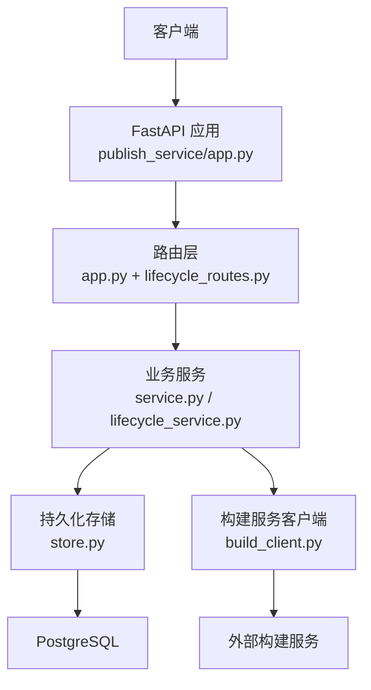
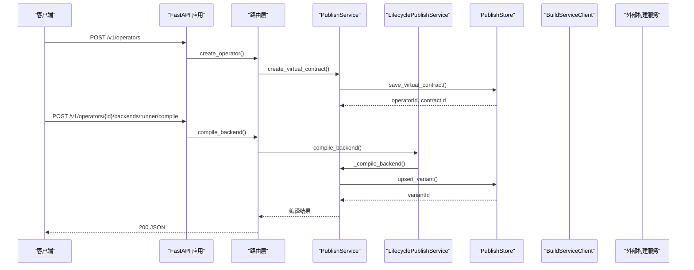
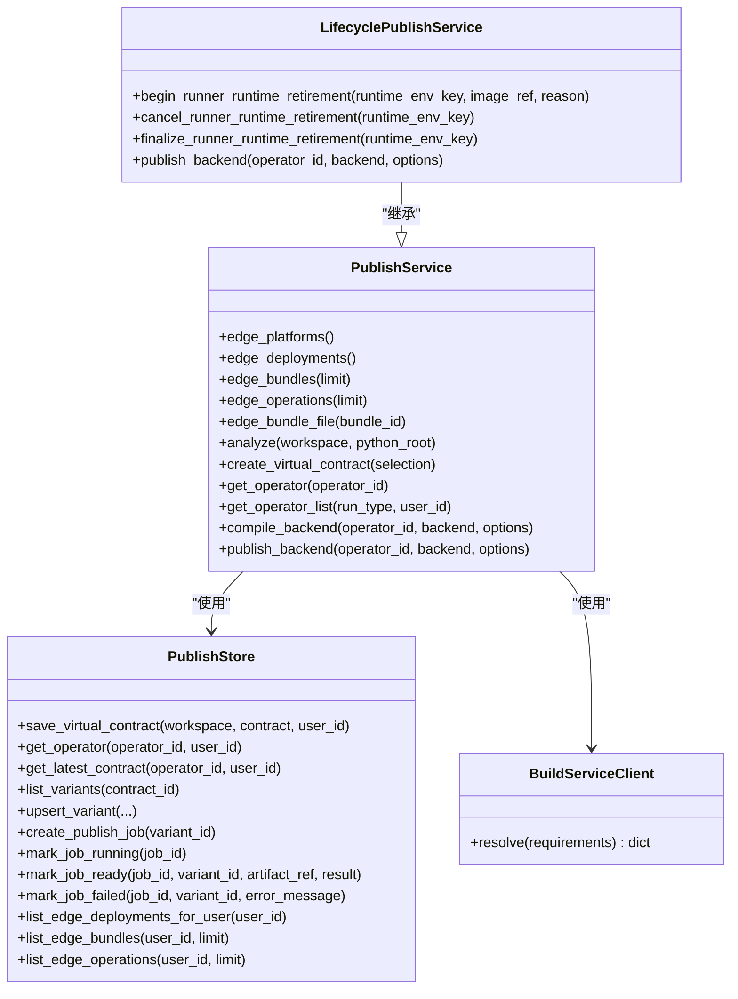
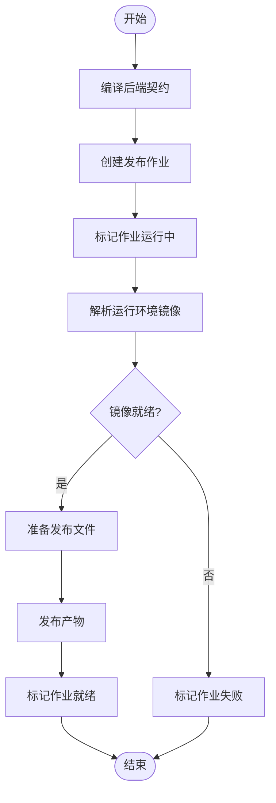

# API 接口参考

<cite>
**本文引用的文件**   
- [publish_service/app.py](file://publish_service/app.py)
- [publish_service/lifecycle_routes.py](file://publish_service/lifecycle_routes.py)
- [publish_service/lifecycle_service.py](file://publish_service/lifecycle_service.py)
- [publish_service/service.py](file://publish_service/service.py)
- [publish_service/model.py](file://publish_service/model.py)
- [publish_service/store.py](file://publish_service/store.py)
- [publish_service/build_client.py](file://publish_service/build_client.py)
</cite>

## 目录
1. [简介](#简介)
2. [项目结构](#项目结构)
3. [核心组件](#核心组件)
4. [架构总览](#架构总览)
5. [接口规范](#接口规范)
6. [依赖与数据流分析](#依赖与数据流分析)
7. [性能与可靠性](#性能与可靠性)
8. [故障排查](#故障排查)
9. [结论](#结论)
10. [附录：客户端示例](#附录客户端示例)

## 简介
本文件为 Publish Service 的完整 API 接口参考，覆盖算子分析、虚拟契约创建、后端编译与发布、边缘包与操作查询、MinIO 文件夹下载以及运行时生命周期管理等 RESTful 端点。文档包含 HTTP 方法、URL、请求体、响应字段、错误码、认证机制、限流策略说明和最佳实践，并提供 curl 与 Python 客户端调用示例路径。

## 项目结构
Publish Service 基于 FastAPI 提供 HTTP 接口，核心逻辑由 `service.py` 中的 `PublishService` 实现，并通过 `lifecycle_service.py` 扩展运行时生命周期能力；路由定义在 `app.py` 与 `lifecycle_routes.py` 中；模型定义在 `model.py`；数据库访问封装在 `store.py`；构建服务客户端在 `build_client.py`。

**图表来源**
- [publish_service/app.py:135-347](file://publish_service/app.py#L135-L347)
- [publish_service/lifecycle_routes.py:36-86](file://publish_service/lifecycle_routes.py#L36-L86)
- [publish_service/service.py:71-110](file://publish_service/service.py#L71-L110)
- [publish_service/store.py:17-35](file://publish_service/store.py#L17-L35)
- [publish_service/build_client.py:13-30](file://publish_service/build_client.py#L13-L30)

**章节来源**
- [publish_service/app.py:135-347](file://publish_service/app.py#L135-L347)
- [publish_service/lifecycle_routes.py:36-86](file://publish_service/lifecycle_routes.py#L36-L86)

## 核心组件
- FastAPI 应用与路由：负责暴露 REST 接口、参数校验、异常映射到 HTTP 状态码。
- 业务服务：封装算子分析、虚拟契约创建、后端编译/发布、边缘资源查询等核心流程。
- 生命周期服务：在基础服务之上增加运行时退役管理（开始/取消/完成退役）。
- 存储层：使用 PostgreSQL 保存算子、契约版本、后端变体、发布作业、边缘部署与依赖包。
- 构建服务客户端：调用外部构建服务解析运行环境镜像。

**章节来源**
- [publish_service/service.py:71-110](file://publish_service/service.py#L71-L110)
- [publish_service/lifecycle_service.py:16-50](file://publish_service/lifecycle_service.py#L16-L50)
- [publish_service/store.py:17-35](file://publish_service/store.py#L17-L35)
- [publish_service/build_client.py:13-30](file://publish_service/build_client.py#L13-L30)

## 架构总览
下图展示一次“创建虚拟契约并编译 runner 后端”的典型调用链：

**图表来源**
- [publish_service/app.py:211-254](file://publish_service/app.py#L211-L254)
- [publish_service/service.py:418-477](file://publish_service/service.py#L418-L477)
- [publish_service/service.py:569-642](file://publish_service/service.py#L569-L642)
- [publish_service/store.py:39-127](file://publish_service/store.py#L39-L127)
- [publish_service/store.py:246-290](file://publish_service/store.py#L246-L290)

## 接口规范

### 健康检查
- 方法：GET
- URL：`/health`
- 认证：无
- 响应字段：
  - `ok`: boolean
  - `version`: string
  - `api`: string
  - `backends`: array of string
  - `compiledPlanArtifact`: boolean
  - `edgeNativePublishing`: boolean
  - `runtimeLifecycle`: boolean
  - `adminLifecycleConfigured`: boolean

**章节来源**
- [publish_service/app.py:157-170](file://publish_service/app.py#L157-L170)

### 平台与边缘资源查询

#### 获取支持的边缘平台
- 方法：GET
- URL：`/v1/edge/platforms`
- 认证：无
- 响应字段：
  - `pythonVersion`: string
  - `platforms`: array of string

**章节来源**
- [publish_service/app.py:172-174](file://publish_service/app.py#L172-L174)
- [publish_service/service.py:115-119](file://publish_service/service.py#L115-L119)

#### 获取用户边缘部署列表
- 方法：GET
- URL：`/v1/edge/deployments`
- 认证：无
- 响应字段：
  - `userId`: string
  - `deployments`: array of object
    - `operatorId`, `variantId`, `workspace`, `name`, `displayName`, `packageName`, `requirements`, `targetPlatform`, `createdAt`, `updatedAt`

**章节来源**
- [publish_service/app.py:176-178](file://publish_service/app.py#L176-L178)
- [publish_service/service.py:121-148](file://publish_service/service.py#L121-L148)

#### 获取边缘依赖包列表
- 方法：GET
- URL：`/v1/edge/bundles?limit=整数`
- 认证：无
- 响应字段：
  - `userId`: string
  - `bundles`: array of object
    - `bundleId`, `revision`, `targetPlatform`, `requirements`, `lockSha256`, `artifactRef`, `artifactSha256`, `manifest`, `createdAt`

**章节来源**
- [publish_service/app.py:180-182](file://publish_service/app.py#L180-L182)
- [publish_service/service.py:150-177](file://publish_service/service.py#L150-L177)

#### 获取边缘操作记录
- 方法：GET
- URL：`/v1/edge/operations?limit=整数`
- 认证：无
- 响应字段：
  - `userId`: string
  - `operations`: array of object
    - `jobId`, `jobStatus`, `variantId`, `variantStatus`, `operatorId`, `workspace`, `name`, `displayName`, `options`, `artifactRef`, `publishedMetadata`, `errorMessage`, `createdAt`, `startedAt`, `finishedAt`

**章节来源**
- [publish_service/app.py:184-186](file://publish_service/app.py#L184-L186)
- [publish_service/service.py:179-207](file://publish_service/service.py#L179-L207)

#### 下载边缘包文件
- 方法：GET
- URL：`/v1/edge/bundles/{bundle_id}/download`
- 认证：无
- 响应：ZIP 文件流
- 错误码：
  - 404：包不存在或引用无效

**章节来源**
- [publish_service/app.py:188-199](file://publish_service/app.py#L188-L199)
- [publish_service/service.py:209-245](file://publish_service/service.py#L209-L245)

### 算子分析与虚拟契约

#### 分析工作区
- 方法：POST
- URL：`/v1/authoring/analyze`
- 请求体：
  - `workspace`: string（相对路径）
  - `python_root`: string | null（可选）
- 响应字段：
  - `workspace`, `sourceRevision`, `pythonRoot`, `pythonRootCandidates`, `recommendedCallableId`, `callables`, `warnings`
- 错误码：
  - 400：工作区无效或缺少 Python 源文件

**章节来源**
- [publish_service/app.py:201-209](file://publish_service/app.py#L201-L209)
- [publish_service/service.py:385-416](file://publish_service/service.py#L385-L416)
- [publish_service/model.py:19-22](file://publish_service/model.py#L19-L22)

#### 创建虚拟契约
- 方法：POST
- URL：`/v1/operators`
- 请求体：
  - `workspace`: string
  - `source_revision`: string
  - `python_root`: string
  - `operator`: object（含 `name`, `display_name`, `description`）
  - `callable_id`: string
  - `constructor_bindings`: map<string, BindingSelection>
  - `argument_bindings`: map<string, BindingSelection>
  - `output`: object（含 `payload`, `metadata`, `none_policy`）
  - `user_id`: string | null（默认值来自服务端配置）
- 响应字段：
  - `created`: boolean
  - `userId`, `operatorId`, `contractId`, `contractVersion`, `contractSha256`, `sourceRevision`, `sourceRef`
  - `virtualContract`: object
  - `derived.parameters`, `derived.inputMetadata`, `derived.outputMetadata`
- 错误码：
  - 400：工作区变更导致 source_revision 不匹配或参数校验失败

**章节来源**
- [publish_service/app.py:211-224](file://publish_service/app.py#L211-L224)
- [publish_service/service.py:418-477](file://publish_service/service.py#L418-L477)
- [publish_service/model.py:72-83](file://publish_service/model.py#L72-L83)

#### 获取算子详情
- 方法：GET
- URL：`/v1/operators/{operator_id}`
- 认证：无
- 响应字段：
  - `userId`, `operatorId`, `workspace`, `name`, `displayName`, `description`
  - `currentContract`: object（含 `contractId`, `version`, `sourceRevision`, `sourceRef`, `contractSha256`, `virtualContract`）
  - `backendVariants`: array of object（含 `variantId`, `backend`, `compilerVersion`, `variantKey`, `status`, `publishedRef`, `publishedMetadata`, `lastError`, `backendContract`）
- 错误码：
  - 404：算子不存在或没有契约版本

**章节来源**
- [publish_service/app.py:226-231](file://publish_service/app.py#L226-L231)
- [publish_service/service.py:479-517](file://publish_service/service.py#L479-L517)

#### 获取算子列表
- 方法：GET
- URL：`/v1/operators?run_type={runner|edge}&user_id={字符串}`
- 认证：无
- 行为：
  - `run_type` 仅支持 `runner` 或 `edge`
  - 未传 `user_id` 时回退到服务端默认用户
- 响应：根据 run_type 返回不同结构的算子集合

**章节来源**
- [publish_service/app.py:337-344](file://publish_service/app.py#L337-L344)
- [publish_service/service.py:519-530](file://publish_service/service.py#L519-L530)

### 后端编译与发布

#### 编译后端
- 方法：POST
- URL：`/v1/operators/{operator_id}/backends/{backend}/compile`
- 请求体：
  - `options`: object（后端相关选项）
- 支持后端：
  - `runner`：需要 `profile`（默认来自服务端配置）
  - `nifi_native`：原生 NiFi 目标平台相关选项
- 响应字段：
  - `variantId`, `backend`, `compilerVersion`, `variantKey`, `status`, `publishedRef`, `publishedMetadata`, `lastError`, `backendContract`
  - `backendContractSha256`, `parentContractId`, `parentContractVersion`, `parentContractSha256`
- 错误码：
  - 400：不支持的后端或参数错误
  - 409：边缘依赖冲突（针对 nifi_native）

**章节来源**
- [publish_service/app.py:233-254](file://publish_service/app.py#L233-L254)
- [publish_service/service.py:569-642](file://publish_service/service.py#L569-L642)

#### 发布后端
- 方法：POST
- URL：`/v1/operators/{operator_id}/backends/{backend}/publish`
- 请求体：
  - `options`: object
- 行为：
  - 先编译，再异步执行发布任务，返回作业信息
- 响应字段：
  - `jobId`, `status`, `backend`, `artifactRef`, `result`
- 错误码：
  - 400：不支持的后端或参数错误
  - 409：边缘依赖冲突或发布阶段错误

**章节来源**
- [publish_service/app.py:256-277](file://publish_service/app.py#L256-L277)
- [publish_service/service.py:644-709](file://publish_service/service.py#L644-L709)

### MinIO 工具接口

#### 下载 MinIO 文件夹
- 方法：POST
- URL：`/v1/minio/download-folder`
- 请求体：
  - `bucket`: string
  - `folder_path`: string
- 响应字段：
  - `ok`: boolean
  - `data`: object（含 bucket, folder_path, local_path, downloaded_files, downloaded_bytes）
- 错误码：
  - 400：参数错误
  - 403：权限不足
  - 404：桶或路径不存在
  - 500：配置错误
  - 502：工具调用失败

**章节来源**
- [publish_service/app.py:279-335](file://publish_service/app.py#L279-L335)
- [publish_service/model.py:89-92](file://publish_service/model.py#L89-L92)

### 管理员运行时生命周期接口

#### 开始 Runner 运行时退役
- 方法：POST
- URL：`/v1/admin/runner-runtimes/retire`
- 认证：Bearer Token（需设置环境变量 `PUBLISH_ADMIN_TOKEN`）
- 请求体：
  - `runtimeEnvKey`: string
  - `imageRef`: string
  - `reason`: string
- 响应：退役流程启动结果
- 错误码：
  - 401：未授权
  - 409：状态冲突
  - 503：未配置管理员令牌

**章节来源**
- [publish_service/lifecycle_routes.py:36-52](file://publish_service/lifecycle_routes.py#L36-L52)
- [publish_service/lifecycle_service.py:21-32](file://publish_service/lifecycle_service.py#L21-L32)

#### 取消 Runner 运行时退役
- 方法：POST
- URL：`/v1/admin/runner-runtimes/cancel-retirement`
- 认证：Bearer Token
- 请求体：
  - `runtimeEnvKey`: string
- 错误码：
  - 401：未授权
  - 409：状态冲突

**章节来源**
- [publish_service/lifecycle_routes.py:54-67](file://publish_service/lifecycle_routes.py#L54-L67)
- [publish_service/lifecycle_service.py:34-41](file://publish_service/lifecycle_service.py#L34-L41)

#### 完成 Runner 运行时退役
- 方法：POST
- URL：`/v1/admin/runner-runtimes/finalize-retirement`
- 认证：Bearer Token
- 请求体：
  - `runtimeEnvKey`: string
- 错误码：
  - 401：未授权
  - 404：生命周期门控不存在
  - 409：状态冲突

**章节来源**
- [publish_service/lifecycle_routes.py:69-85](file://publish_service/lifecycle_routes.py#L69-L85)
- [publish_service/lifecycle_service.py:43-50](file://publish_service/lifecycle_service.py#L43-L50)

## 依赖与数据流分析

### 类关系图

**图表来源**
- [publish_service/service.py:71-110](file://publish_service/service.py#L71-L110)
- [publish_service/lifecycle_service.py:16-50](file://publish_service/lifecycle_service.py#L16-L50)
- [publish_service/store.py:17-35](file://publish_service/store.py#L17-L35)
- [publish_service/build_client.py:13-30](file://publish_service/build_client.py#L13-L30)

### 发布流程图（Runner 后端）

**图表来源**
- [publish_service/service.py:644-709](file://publish_service/service.py#L644-L709)
- [publish_service/service.py:711-774](file://publish_service/service.py#L711-L774)
- [publish_service/store.py:292-370](file://publish_service/store.py#L292-L370)

**章节来源**
- [publish_service/service.py:569-709](file://publish_service/service.py#L569-L709)
- [publish_service/store.py:292-370](file://publish_service/store.py#L292-L370)

## 性能与可靠性
- 数据库连接池：`PublishStore` 使用 psycopg_pool，默认最小池大小 1、最大池大小 8，建议根据并发量调整。
- 边缘包与操作查询限制：
  - `/v1/edge/bundles` 默认 limit 50，上限 200
  - `/v1/edge/operations` 默认 limit 100，上限 300
- 构建服务超时：默认 1800 秒，可通过环境变量 `PUBLISH_BUILD_TIMEOUT_SECONDS` 配置。
- 源码上传大小限制：默认 500 MiB，通过 `PUBLISH_MAX_SOURCE_BYTES` 控制。
- 幂等性与一致性：
  - 虚拟契约保存使用哈希去重，避免重复版本
  - 后端变体使用 `variant_key` 做 upsert，保证相同输入可复用
  - 发布作业状态机：PENDING → RUNNING → READY/FAILED

**章节来源**
- [publish_service/store.py:17-28](file://publish_service/store.py#L17-L28)
- [publish_service/store.py:449-475](file://publish_service/store.py#L449-L475)
- [publish_service/app.py:115-127](file://publish_service/app.py#L115-L127)
- [publish_service/store.py:39-127](file://publish_service/store.py#L39-L127)
- [publish_service/store.py:246-290](file://publish_service/store.py#L246-L290)
- [publish_service/store.py:292-370](file://publish_service/store.py#L292-L370)

## 故障排查
- 400 参数错误：
  - 工作区为空或绝对路径
  - workspace 逃逸配置的根目录
  - workspace 不存在或缺少 Python 源文件
  - `python_root` 不在候选列表中
  - 虚拟契约 source_revision 不匹配
- 404 资源不存在：
  - 算子不存在
  - 算子没有契约版本
  - 边缘包不存在
  - MinIO 桶或路径不存在
- 403 权限不足：
  - MinIO 访问被拒绝
- 409 冲突：
  - 边缘依赖冲突（nifi_native）
  - 运行时退役状态冲突
- 500 内部错误：
  - MinIO 配置错误
  - 构建服务不可用或返回非预期状态
- 502 网关错误：
  - MinIO 工具调用失败

**章节来源**
- [publish_service/service.py:247-309](file://publish_service/service.py#L247-L309)
- [publish_service/service.py:418-477](file://publish_service/service.py#L418-L477)
- [publish_service/service.py:644-709](file://publish_service/service.py#L644-L709)
- [publish_service/app.py:279-335](file://publish_service/app.py#L279-L335)
- [publish_service/lifecycle_routes.py:20-33](file://publish_service/lifecycle_routes.py#L20-L33)

## 结论
Publish Service 提供了完整的算子分析、虚拟契约管理、多后端编译与发布、边缘资源查询与下载、MinIO 工具集成以及运行时生命周期管理能力。其设计强调可观测性（作业状态）、一致性（契约哈希与变体键）与可扩展性（后端抽象）。在生产环境中建议合理配置数据库连接池、构建服务超时与源码大小限制，并结合运维侧限流与监控策略保障稳定性。

## 附录：客户端示例

### curl 示例
- 健康检查
  - `curl http://localhost:9090/health`
- 分析工作区
  - `curl -X POST http://localhost:9090/v1/authoring/analyze -H "Content-Type: application/json" -d '{"workspace":"my_project","python_root":"src"}'`
- 创建虚拟契约
  - `curl -X POST http://localhost:9090/v1/operators -H "Content-Type: application/json" -d '{...}'`
- 编译 runner 后端
  - `curl -X POST http://localhost:9090/v1/operators/{operator_id}/backends/runner/compile -H "Content-Type: application/json" -d '{"options":{"profile":"standard"}}'`
- 发布 runner 后端
  - `curl -X POST http://localhost:9090/v1/operators/{operator_id}/backends/runner/publish -H "Content-Type: application/json" -d '{"options":{"profile":"standard"}}'`
- 管理员退役运行时
  - `curl -X POST http://localhost:9090/v1/admin/runner-runtimes/retire -H "Authorization: Bearer <token>" -H "Content-Type: application/json" -d '{"runtimeEnvKey":"env-key","imageRef":"registry/image:tag","reason":"deprecating old runtime"}'`

### Python 客户端示例
- 使用 requests 调用分析接口
  - 参考路径：[publish_service/app.py:201-209](file://publish_service/app.py#L201-L209)
- 使用 requests 调用创建虚拟契约接口
  - 参考路径：[publish_service/app.py:211-224](file://publish_service/app.py#L211-L224)
- 使用 requests 调用编译与发布接口
  - 参考路径：[publish_service/app.py:233-277](file://publish_service/app.py#L233-L277)
- 使用 requests 调用管理员退役接口
  - 参考路径：[publish_service/lifecycle_routes.py:36-52](file://publish_service/lifecycle_routes.py#L36-L52)

**章节来源**
- [publish_service/app.py:201-277](file://publish_service/app.py#L201-L277)
- [publish_service/lifecycle_routes.py:36-52](file://publish_service/lifecycle_routes.py#L36-L52)