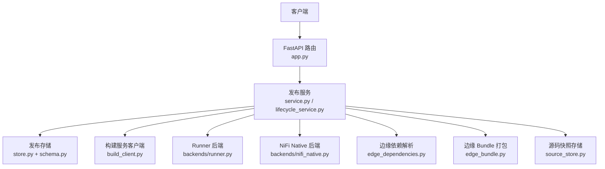
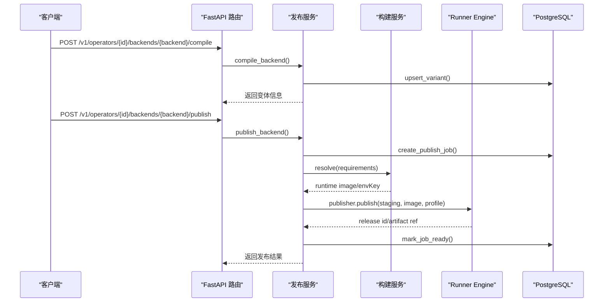
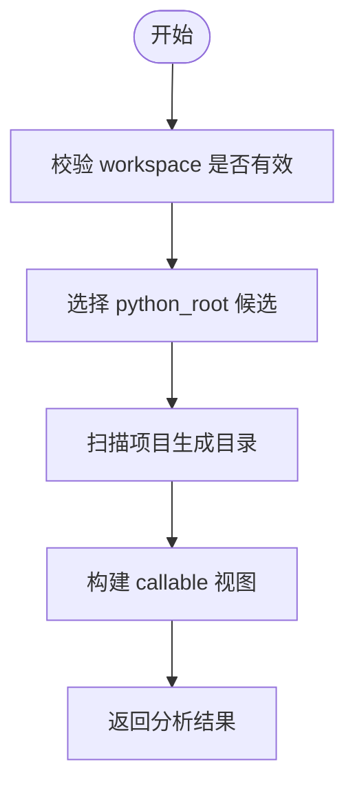
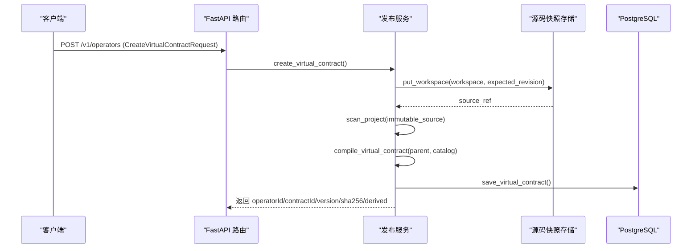
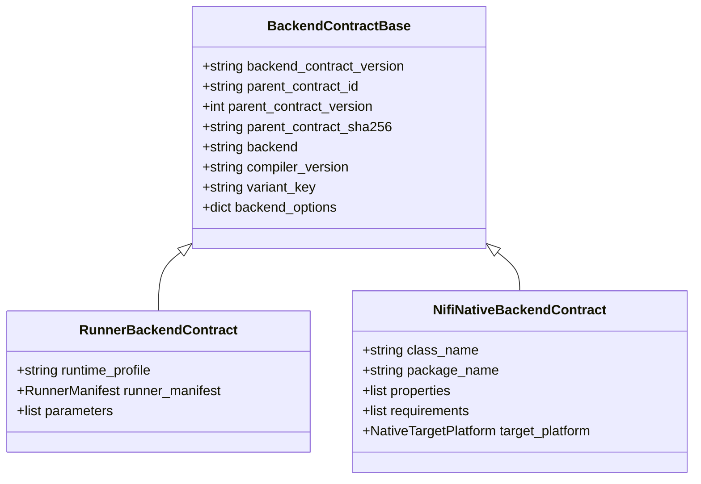
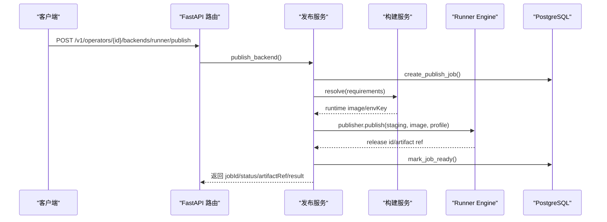
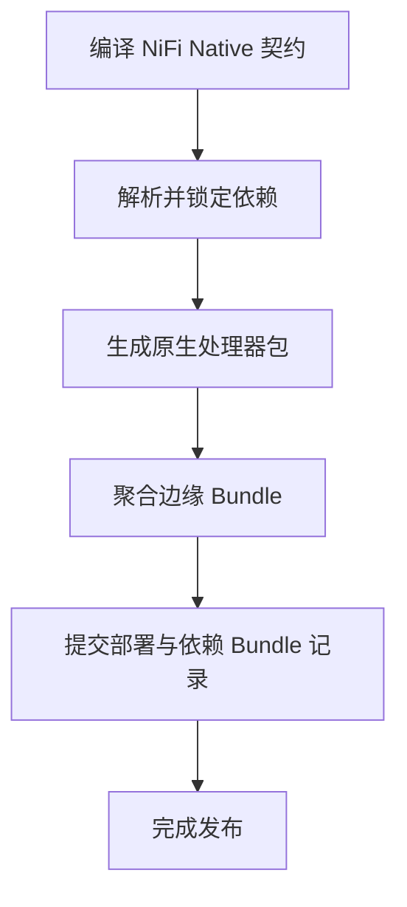
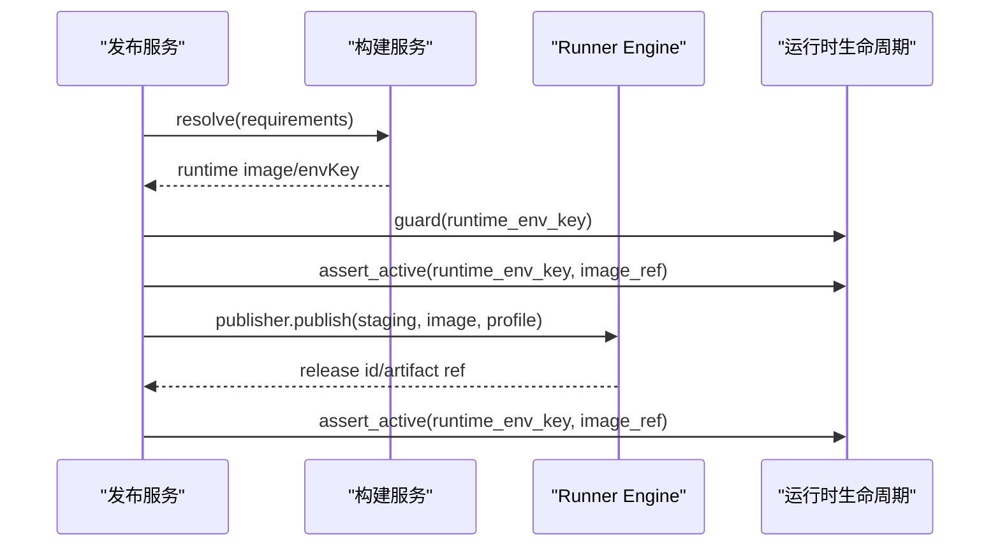
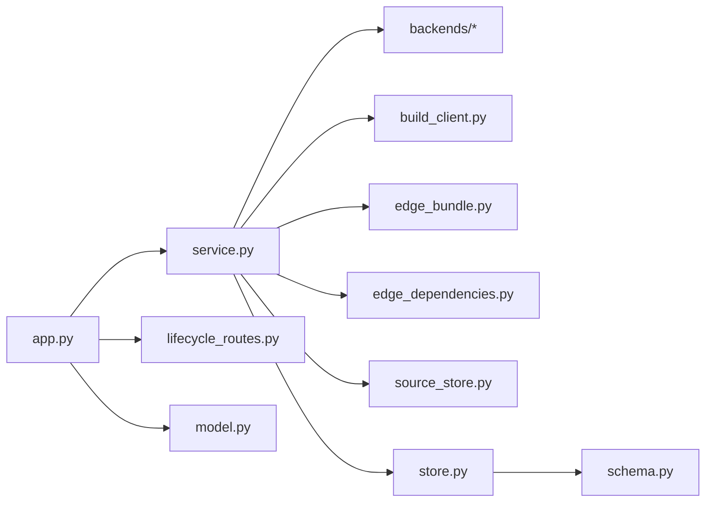

# 发布服务（Publish Service）详细文档

<cite>
**本文引用的文件**   
- [app.py](file://publish_service/app.py)
- [service.py](file://publish_service/service.py)
- [lifecycle_service.py](file://publish_service/lifecycle_service.py)
- [model.py](file://publish_service/model.py)
- [schema.py](file://publish_service/schema.py)
- [store.py](file://publish_service/store.py)
- [backends/base.py](file://publish_service/backends/base.py)
- [backends/models.py](file://publish_service/backends/models.py)
- [backends/runner.py](file://publish_service/backends/runner.py)
- [backends/nifi_native.py](file://publish_service/backends/nifi_native.py)
- [build_client.py](file://publish_service/build_client.py)
- [edge_bundle.py](file://publish_service/edge_bundle.py)
- [edge_dependencies.py](file://publish_service/edge_dependencies.py)
- [lifecycle_routes.py](file://publish_service/lifecycle_routes.py)
- [source_store.py](file://publish_service/source_store.py)
</cite>

## 目录
1. [引言](#引言)
2. [项目结构](#项目结构)
3. [核心组件](#核心组件)
4. [架构总览](#架构总览)
5. [关键流程与代码级分析](#关键流程与代码级分析)
6. [依赖关系分析](#依赖关系分析)
7. [性能与扩展性](#性能与扩展性)
8. [故障排查指南](#故障排查指南)
9. [结论](#结论)
10. [附录：API、数据模型与最佳实践](#附录api数据模型与最佳实践)

## 引言
发布服务负责将 Python 算子从源码到可运行制品的完整生命周期管理，包括算子代码分析、虚拟契约生成、多后端编译与发布、版本与依赖管理，以及与 Runner Engine 和 Build Service 的协作。它支持两类后端：
- Runner 后端：通过构建服务解析运行时环境，生成 Runner 适配包并发布为 Runner 制品。
- NiFi Native 后端：为目标平台生成原生处理器包，并聚合边缘依赖形成可部署的边缘 Bundle。

该服务提供 REST API，暴露算子分析、虚拟契约创建、后端编译与发布、边缘 Bundle 查询与下载、以及运维生命周期管理等能力。

## 项目结构
发布服务采用分层组织方式：
- Web 层：FastAPI 应用入口、路由定义、健康检查、错误映射。
- 服务层：业务编排、状态持久化、外部系统调用。
- 后端实现：Runner 与 NiFi Native 两种后端的契约编译与产物生成。
- 存储层：PostgreSQL 数据库访问、Schema 初始化、事务与并发控制。
- 工具与辅助：构建服务客户端、边缘依赖解析与打包、MinIO 工具等。

**图示来源**
- [app.py:135-347](file://publish_service/app.py#L135-L347)
- [service.py:71-110](file://publish_service/service.py#L71-L110)
- [store.py:17-35](file://publish_service/store.py#L17-L35)
- [backends/runner.py:23-67](file://publish_service/backends/runner.py#L23-L67)
- [backends/nifi_native.py:103-168](file://publish_service/backends/nifi_native.py#L103-L168)
- [edge_dependencies.py:70-136](file://publish_service/edge_dependencies.py#L70-L136)
- [edge_bundle.py:46-131](file://publish_service/edge_bundle.py#L46-L131)
- [source_store.py:16-64](file://publish_service/source_store.py#L16-L64)

**章节来源**
- [app.py:135-347](file://publish_service/app.py#L135-L347)
- [service.py:71-110](file://publish_service/service.py#L71-L110)

## 核心组件
- FastAPI 应用与路由：统一入口、健康检查、算子分析、虚拟契约创建、后端编译与发布、边缘 Bundle 与操作查询、MinIO 文件夹下载、管理员生命周期接口。
- 发布服务（PublishService/LifecyclePublishService）：编排算子分析、虚拟契约编译、后端契约生成、发布任务、边缘依赖解析与打包、与 Runner Engine 和 Build Service 的交互。
- 后端契约模型：Runner 与 NiFi Native 的契约结构与参数映射。
- 存储层（PublishStore）：PostgreSQL 连接池、Schema 初始化、算子与契约版本、变体、发布作业、边缘部署与依赖 Bundle 的管理。
- 构建服务客户端：调用构建服务解析 Python 运行时环境。
- 边缘依赖解析器：基于 uv 进行依赖锁定与目标平台材料化。
- 源码快照存储：对工作区进行不可变快照，保证契约与源码一致性。

**章节来源**
- [app.py:135-347](file://publish_service/app.py#L135-L347)
- [service.py:71-110](file://publish_service/service.py#L71-L110)
- [store.py:17-35](file://publish_service/store.py#L17-L35)
- [build_client.py:13-30](file://publish_service/build_client.py#L13-L30)
- [edge_dependencies.py:70-136](file://publish_service/edge_dependencies.py#L70-L136)
- [source_store.py:16-64](file://publish_service/source_store.py#L16-L64)

## 架构总览
发布服务在请求处理中承担以下职责：
- 接收前端或外部系统的算子分析与契约创建请求。
- 将源码快照化，确保后续编译与发布的可重复性。
- 根据后端类型生成对应的后端契约（Runner/NiFi Native）。
- 对于 Runner 后端，调用构建服务获取运行时镜像，生成 Runner 制品并发布。
- 对于 NiFi Native 后端，解析并锁定依赖，生成原生处理器包，聚合为边缘 Bundle。
- 所有状态变更写入 PostgreSQL，包含算子、契约版本、变体、发布作业、边缘部署与依赖 Bundle。

**图示来源**
- [app.py:233-277](file://publish_service/app.py#L233-L277)
- [service.py:624-710](file://publish_service/service.py#L624-L710)
- [store.py:292-343](file://publish_service/store.py#L292-L343)
- [build_client.py:18-30](file://publish_service/build_client.py#L18-L30)

**章节来源**
- [app.py:233-277](file://publish_service/app.py#L233-L277)
- [service.py:624-710](file://publish_service/service.py#L624-L710)
- [store.py:292-343](file://publish_service/store.py#L292-L343)

## 关键流程与代码级分析

### 算子代码分析
- 入口：POST /v1/authoring/analyze
- 行为：校验 workspace，选择 python_root，扫描项目，生成可调用的算子视图，推荐支持的 callable，返回警告与建议。
- 关键点：workspace 必须为非空相对路径且位于 PUBLISH_WORKSPACE_ROOT 下；python_root 候选优先 src，其次当前目录。

**图示来源**
- [app.py:201-209](file://publish_service/app.py#L201-L209)
- [service.py:385-416](file://publish_service/service.py#L385-L416)
- [service.py:247-309](file://publish_service/service.py#L247-L309)

**章节来源**
- [app.py:201-209](file://publish_service/app.py#L201-L209)
- [service.py:385-416](file://publish_service/service.py#L385-L416)

### 虚拟契约生成
- 入口：POST /v1/operators
- 行为：读取工作区源码快照，校验 source_revision，构造虚拟契约，编译执行计划，保存虚拟契约版本，返回派生参数、输入输出元数据。
- 关键点：若工作区在 Analyze 之后发生变化，会拒绝保存并要求重新分析。

**图示来源**
- [app.py:211-224](file://publish_service/app.py#L211-L224)
- [service.py:418-477](file://publish_service/service.py#L418-L477)
- [source_store.py:22-45](file://publish_service/source_store.py#L22-L45)
- [store.py:39-127](file://publish_service/store.py#L39-L127)

**章节来源**
- [app.py:211-224](file://publish_service/app.py#L211-L224)
- [service.py:418-477](file://publish_service/service.py#L418-L477)
- [source_store.py:22-45](file://publish_service/source_store.py#L22-L45)
- [store.py:39-127](file://publish_service/store.py#L39-L127)

### 多后端编译
- 入口：POST /v1/operators/{operator_id}/backends/{backend}/compile
- 行为：加载最新虚拟契约与执行计划，按后端类型生成后端契约（Runner/NiFi Native），计算 variant_key 与后端契约摘要，upsert 变体记录。
- 关键点：variant_key 由 contract_sha256、backend、compiler_version、options 共同决定，确保相同输入产生相同变体键。

**图示来源**
- [backends/models.py:10-73](file://publish_service/backends/models.py#L10-L73)
- [backends/runner.py:23-67](file://publish_service/backends/runner.py#L23-L67)
- [backends/nifi_native.py:103-168](file://publish_service/backends/nifi_native.py#L103-L168)
- [backends/base.py:10-27](file://publish_service/backends/base.py#L10-L27)

**章节来源**
- [app.py:233-254](file://publish_service/app.py#L233-L254)
- [service.py:569-642](file://publish_service/service.py#L569-L642)
- [backends/base.py:10-27](file://publish_service/backends/base.py#L10-L27)

### Runner 后端发布
- 入口：POST /v1/operators/{operator_id}/backends/runner/publish
- 行为：读取 requirements，调用构建服务解析运行时环境，校验状态，生成 Runner 发布文件，调用 Runner Engine 发布，标记作业就绪。
- 关键点：若构建服务未返回镜像或状态非 READY，将抛出发布错误；生命周期模式下会检查运行时退役状态。

**图示来源**
- [app.py:256-277](file://publish_service/app.py#L256-L277)
- [service.py:644-710](file://publish_service/service.py#L644-L710)
- [service.py:711-774](file://publish_service/service.py#L711-L774)
- [store.py:292-343](file://publish_service/store.py#L292-L343)

**章节来源**
- [app.py:256-277](file://publish_service/app.py#L256-L277)
- [service.py:644-710](file://publish_service/service.py#L644-L710)
- [service.py:711-774](file://publish_service/service.py#L711-L774)
- [store.py:292-343](file://publish_service/store.py#L292-L343)

### NiFi Native 后端发布与边缘 Bundle
- 入口：POST /v1/operators/{operator_id}/backends/nifi_native/publish
- 行为：编译 NiFi Native 契约，解析依赖并锁定，生成原生处理器包，聚合多个算子为边缘 Bundle，提交部署与依赖 Bundle 记录。
- 关键点：依赖冲突时返回 EDGE_DEPENDENCY_CONFLICT，提示新算子不能与已发布算子共享同一依赖环境。

**图示来源**
- [service.py:644-710](file://publish_service/service.py#L644-L710)
- [backends/nifi_native.py:103-168](file://publish_service/backends/nifi_native.py#L103-L168)
- [backends/nifi_native.py:533-581](file://publish_service/backends/nifi_native.py#L533-L581)
- [edge_dependencies.py:70-136](file://publish_service/edge_dependencies.py#L70-L136)
- [edge_bundle.py:46-131](file://publish_service/edge_bundle.py#L46-L131)
- [store.py:538-689](file://publish_service/store.py#L538-L689)

**章节来源**
- [service.py:644-710](file://publish_service/service.py#L644-L710)
- [backends/nifi_native.py:103-168](file://publish_service/backends/nifi_native.py#L103-L168)
- [backends/nifi_native.py:533-581](file://publish_service/backends/nifi_native.py#L533-L581)
- [edge_dependencies.py:70-136](file://publish_service/edge_dependencies.py#L70-L136)
- [edge_bundle.py:46-131](file://publish_service/edge_bundle.py#L46-L131)
- [store.py:538-689](file://publish_service/store.py#L538-L689)

### 版本管理与查询
- 查询算子：GET /v1/operators/{operator_id}
- 列出算子：GET /v1/operators?run_type={runner|edge}&user_id=...
- 边缘部署与 Bundle 查询：GET /v1/edge/deployments、GET /v1/edge/bundles、GET /v1/edge/operations
- 下载 Bundle：GET /v1/edge/bundles/{bundle_id}/download

这些接口通过 store 层读取 operators、virtual_contract_versions、backend_variants、edge_native_deployments、edge_dependency_bundles 等表，返回结构化结果。

**章节来源**
- [app.py:226-231](file://publish_service/app.py#L226-L231)
- [app.py:337-344](file://publish_service/app.py#L337-L344)
- [app.py:172-199](file://publish_service/app.py#L172-L199)
- [service.py:479-530](file://publish_service/service.py#L479-L530)
- [service.py:121-207](file://publish_service/service.py#L121-L207)
- [store.py:129-244](file://publish_service/store.py#L129-L244)
- [store.py:401-505](file://publish_service/store.py#L401-L505)

### 与 Runner Engine 和 Build Service 的协作
- Build Service：用于解析 Python 依赖并返回可用的运行时镜像与环境键。
- Runner Engine：用于发布 Runner 制品，返回 release id 与制品引用。
- 生命周期模式：LifecyclePublishService 在 Runner 发布前检查运行时退役状态，避免向退役中的运行时发布。

**图示来源**
- [lifecycle_service.py:92-168](file://publish_service/lifecycle_service.py#L92-L168)
- [build_client.py:18-30](file://publish_service/build_client.py#L18-L30)

**章节来源**
- [lifecycle_service.py:92-168](file://publish_service/lifecycle_service.py#L92-L168)
- [build_client.py:18-30](file://publish_service/build_client.py#L18-L30)

## 依赖关系分析
- 模块耦合：
  - app.py 依赖 service.py、lifecycle_routes.py、model.py、utils/minio_tools.py。
  - service.py 依赖 backends/*、build_client.py、edge_bundle.py、edge_dependencies.py、source_store.py、store.py。
  - lifecycle_service.py 继承 service.py 并扩展运行时生命周期。
  - store.py 依赖 schema.py 与 psycopg/psycopg_pool。
- 外部依赖：
  - Build Service：HTTP 接口解析运行时环境。
  - Runner Engine：发布 Runner 制品。
  - PostgreSQL：持久化算子、契约、变体、作业、边缘部署与依赖 Bundle。
  - uv：依赖解析与材料化工具。

**图示来源**
- [app.py:14-31](file://publish_service/app.py#L14-L31)
- [service.py:12-39](file://publish_service/service.py#L12-L39)
- [store.py:14-29](file://publish_service/store.py#L14-L29)

**章节来源**
- [app.py:14-31](file://publish_service/app.py#L14-L31)
- [service.py:12-39](file://publish_service/service.py#L12-L39)
- [store.py:14-29](file://publish_service/store.py#L14-L29)

## 性能与扩展性
- 数据库连接池：使用 psycopg_pool 管理连接，提高并发处理能力。
- 索引优化：针对 operators、virtual_contract_versions、backend_variants、edge_native_deployments、edge_dependency_bundles 建立常用查询索引。
- 原子性与幂等：
  - virtual_contract_versions 通过 contract_sha256 唯一约束避免重复保存。
  - backend_variants 通过 (contract_id, backend, variant_key) 唯一约束实现幂等 upsert。
  - edge_native_deployments 通过 (user_id, operator_id, target_os, target_arch, python_version) 唯一约束实现覆盖更新。
- 可扩展点：
  - 新增后端：实现新的后端契约模型与编译逻辑，并在 service._compile_backend 中添加分支。
  - 扩展依赖解析：在 EdgeDependencyResolver 中调整 uv 参数或增加自定义策略。
  - 扩展存储：在 schema.py 中追加表结构，并在 store.py 中提供对应方法。

[本节为通用指导，不直接分析具体文件]

## 故障排查指南
- 常见错误与定位：
  - 工作区无效或不存在：检查 workspace 是否为相对路径且位于 PUBLISH_WORKSPACE_ROOT 下。
  - 源码变化导致契约保存失败：重新执行 analyze 后再保存虚拟契约。
  - 构建服务不可用或返回失败：检查 PUBLISH_BUILD_SERVICE_URL 连通性与构建服务状态。
  - 运行时未就绪或未返回镜像：确认构建服务返回 status=READY 且包含 image。
  - 依赖冲突（NiFi Native）：查看 EDGE_DEPENDENCY_CONFLICT 详情，调整依赖或拆分环境。
  - MinIO 下载失败：检查 bucket、folder_path、权限与配置。
- 日志与状态：
  - 发布作业状态：PENDING/RUNNING/READY/FAILED，可通过 GET /v1/edge/operations 查询。
  - 变体状态：COMPILED/PUBLISHED/FAILED，last_error 字段记录失败原因。
  - 运行时退役：通过管理员接口 retire/cancel/finalize 管理。

**章节来源**
- [service.py:43-50](file://publish_service/service.py#L43-L50)
- [service.py:418-477](file://publish_service/service.py#L418-L477)
- [service.py:644-710](file://publish_service/service.py#L644-L710)
- [app.py:279-335](file://publish_service/app.py#L279-L335)
- [store.py:345-370](file://publish_service/store.py#L345-L370)
- [lifecycle_routes.py:20-33](file://publish_service/lifecycle_routes.py#L20-L33)

## 结论
发布服务提供了完整的算子发布流水线，涵盖源码分析、虚拟契约生成、多后端编译与发布、版本与依赖管理，以及与 Runner Engine 和 Build Service 的深度协作。其设计强调幂等性、可重复性与可观测性，适合在生产环境中稳定运行。通过清晰的 API、数据模型与错误处理策略，用户可高效地发布、查询与管理算子及其制品。

[本节为总结性内容，不直接分析具体文件]

## 附录：API、数据模型与最佳实践

### API 接口总览
- 健康检查：GET /health
- 平台与部署：GET /v1/edge/platforms、GET /v1/edge/deployments
- Bundle 与操作：GET /v1/edge/bundles、GET /v1/edge/operations、GET /v1/edge/bundles/{bundle_id}/download
- 算子分析：POST /v1/authoring/analyze
- 虚拟契约：POST /v1/operators、GET /v1/operators/{operator_id}
- 后端编译与发布：POST /v1/operators/{operator_id}/backends/{backend}/compile、POST /v1/operators/{operator_id}/backends/{backend}/publish
- MinIO 下载：POST /v1/minio/download-folder
- 管理员生命周期：POST /v1/admin/runner-runtimes/retire、cancel-retirement、finalize-retirement

**章节来源**
- [app.py:157-199](file://publish_service/app.py#L157-L199)
- [app.py:201-277](file://publish_service/app.py#L201-L277)
- [app.py:279-344](file://publish_service/app.py#L279-L344)
- [lifecycle_routes.py:36-86](file://publish_service/lifecycle_routes.py#L36-L86)

### 数据模型
- 请求模型：AnalyzeRequest、CreateVirtualContractRequest、BackendRequest、MinioFolderDownloadRequest
- 后端契约模型：RunnerBackendContract、NifiNativeBackendContract、RunnerManifest、RunnerParameter、NativeProperty、NativeTargetPlatform
- 存储 Schema：operators、virtual_contract_versions、backend_variants、publish_jobs、edge_native_deployments、edge_dependency_bundles、edge_bundle_members

**章节来源**
- [model.py:19-92](file://publish_service/model.py#L19-L92)
- [backends/models.py:10-73](file://publish_service/backends/models.py#L10-L73)
- [schema.py:4-150](file://publish_service/schema.py#L4-L150)

### 最佳实践
- 源码管理：始终先 analyze 再保存虚拟契约，避免源码变化导致的版本不一致。
- 依赖管理：NiFi Native 发布时尽量收敛依赖，避免与其他算子共享环境引发冲突。
- 运行时管理：在 Runner 发布前检查运行时退役状态，避免向退役中的运行时发布。
- 监控与回滚：关注发布作业与变体状态，结合边缘 Bundle 与部署记录进行问题定位与回滚。

[本节为通用指导，不直接分析具体文件]