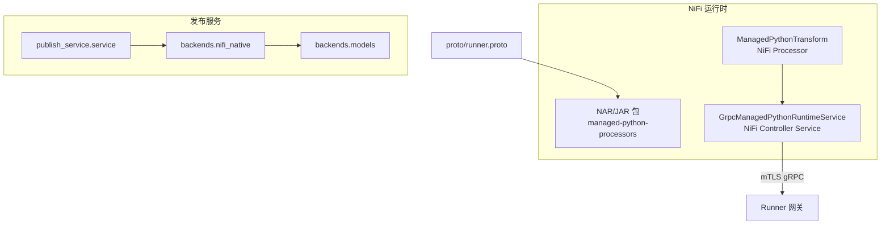
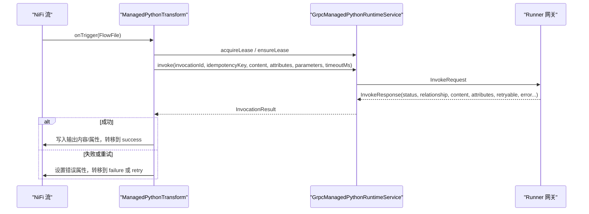
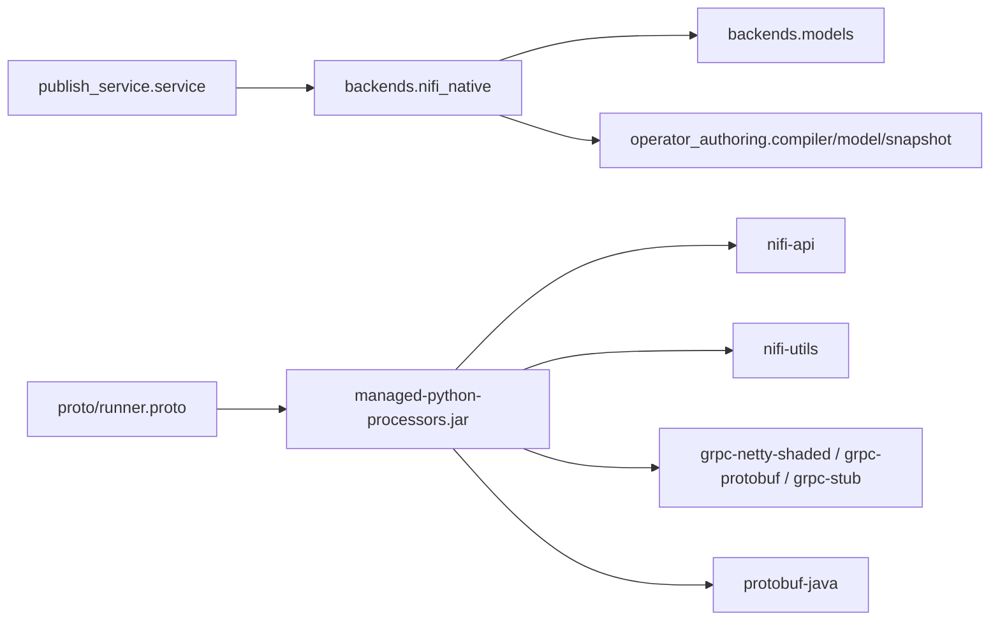

# NiFi Native 后端

<cite>
**本文引用的文件 **
- [nifi/README.md](file://nifi/README.md)
- [nifi/pom.xml](file://nifi/pom.xml)
- [nifi/managed-python-processors/pom.xml](file://nifi/managed-python-processors/pom.xml)
- [nifi/managed-python-processors/src/main/java/com/dsc/nifi/ManagedPythonTransform.java](file://nifi/managed-python-processors/src/main/java/com/dsc/nifi/ManagedPythonTransform.java)
- [nifi/managed-python-processors/src/main/java/com/dsc/nifi/GrpcManagedPythonRuntimeService.java](file://nifi/managed-python-processors/src/main/java/com/dsc/nifi/GrpcManagedPythonRuntimeService.java)
- [proto/runner.proto](file://proto/runner.proto)
- [publish_service/backends/nifi_native.py](file://publish_service/backends/nifi_native.py)
- [publish_service/backends/models.py](file://publish_service/backends/models.py)
- [publish_service/service.py](file://publish_service/service.py)
</cite>

## 目录
1. [简介](#简介)
2. [项目结构](#项目结构)
3. [核心组件](#核心组件)
4. [架构总览](#架构总览)
5. [详细组件分析](#详细组件分析)
6. [依赖关系分析](#依赖关系分析)
7. [性能与限制](#性能与限制)
8. [开发与调试指南](#开发与调试指南)
9. [结论](#结论)

## 简介
本文件面向需要在 Apache NiFi 中运行 Python 算子的工程师，系统性说明 NiFi Native 后端的完整流程：从 Java 环境配置、Maven 构建、JAR/NAR 产物生成，到 NiFi 集成、原生扩展开发规范、接口定义、部署方式，以及与 NiFi 生态的兼容性管理。同时给出原生处理器开发示例和调试技巧，并总结 NiFi Native 后端的特殊要求与限制条件。

NiFi Native 后端由两部分组成：
- NiFi 侧 Java 适配器：包含一个 Processor 和一个 Controller Service，负责在 NiFi 流中调用远程 Runner gRPC 服务。
- 发布服务侧原生打包逻辑：将 Python 算子编译为可在 NiFi 内嵌 Python 环境中执行的包，并通过 NiFi 提供的 FlowFileTransform 接口执行。

## 项目结构
与 NiFi Native 后端直接相关的代码分布在以下位置：
- nifi：NiFi 适配器的 Maven 工程，包含 Java Processor、Controller Service 以及 Maven 构建配置。
- proto：gRPC 协议定义，Java 侧通过 protobuf-maven-plugin 生成客户端桩代码。
- publish_service/backends/nifi_native.py：发布服务中的 NiFi Native 后端实现，负责契约生成、目标平台归一化、原生包编写等。
- publish_service/backends/models.py：Native 后端契约与目标平台的数据模型。
- publish_service/service.py：发布服务主流程，串联后端编译与产物发布。

图表来源
- [nifi/managed-python-processors/pom.xml:16-55](file://nifi/managed-python-processors/pom.xml#L16-L55)
- [nifi/managed-python-processors/src/main/java/com/dsc/nifi/ManagedPythonTransform.java:32-110](file://nifi/managed-python-processors/src/main/java/com/dsc/nifi/ManagedPythonTransform.java#L32-L110)
- [nifi/managed-python-processors/src/main/java/com/dsc/nifi/GrpcManagedPythonRuntimeService.java:32-94](file://nifi/managed-python-processors/src/main/java/com/dsc/nifi/GrpcManagedPythonRuntimeService.java#L32-L94)
- [proto/runner.proto:8-15](file://proto/runner.proto#L8-L15)
- [publish_service/backends/nifi_native.py:103-168](file://publish_service/backends/nifi_native.py#L103-L168)
- [publish_service/backends/models.py:57-72](file://publish_service/backends/models.py#L57-L72)

章节来源
- [nifi/README.md:1-49](file://nifi/README.md#L1-L49)
- [nifi/pom.xml:12-23](file://nifi/pom.xml#L12-L23)
- [nifi/managed-python-processors/pom.xml:16-90](file://nifi/managed-python-processors/pom.xml#L16-L90)
- [publish_service/backends/nifi_native.py:103-168](file://publish_service/backends/nifi_native.py#L103-L168)

## 核心组件
- ManagedPythonTransform：NiFi Processor，负责读取 FlowFile、参数、属性，维护租约，调用 Runner gRPC，并根据返回结果路由到 success/failure/retry。
- GrpcManagedPythonRuntimeService：NiFi Controller Service，封装 mTLS gRPC 通道、租约获取与续租、调用与取消、释放租约。
- runner.proto：定义健康检查、租约、调用、取消、释放等 RPC 消息。
- backends.nifi_native：发布服务中针对 NiFi Native 后端的契约编译、目标平台归一化、原生包生成。
- backends.models：Native 后端契约与目标平台数据模型。
- service.py：发布服务编排，选择后端、编译契约、生成产物并发布。

章节来源
- [nifi/managed-python-processors/src/main/java/com/dsc/nifi/ManagedPythonTransform.java:32-110](file://nifi/managed-python-processors/src/main/java/com/dsc/nifi/ManagedPythonTransform.java#L32-L110)
- [nifi/managed-python-processors/src/main/java/com/dsc/nifi/GrpcManagedPythonRuntimeService.java:32-94](file://nifi/managed-python-processors/src/main/java/com/dsc/nifi/GrpcManagedPythonRuntimeService.java#L32-L94)
- [proto/runner.proto:8-15](file://proto/runner.proto#L8-L15)
- [publish_service/backends/nifi_native.py:103-168](file://publish_service/backends/nifi_native.py#L103-L168)
- [publish_service/backends/models.py:57-72](file://publish_service/backends/models.py#L57-L72)
- [publish_service/service.py:569-607](file://publish_service/service.py#L569-L607)

## 架构总览
NiFi Native 后端整体分为两条主线：
- 离线构建与发布：发布服务根据算子源码与执行计划，生成 NiFi Native 契约与原生包（ZIP），并记录目标平台与依赖。
- 在线执行：NiFi 中的 Processor 通过 Controller Service 建立 mTLS gRPC 连接，向 Runner 发起调用，处理结果与错误。

图表来源
- [nifi/managed-python-processors/src/main/java/com/dsc/nifi/ManagedPythonTransform.java:160-220](file://nifi/managed-python-processors/src/main/java/com/dsc/nifi/ManagedPythonTransform.java#L160-L220)
- [nifi/managed-python-processors/src/main/java/com/dsc/nifi/GrpcManagedPythonRuntimeService.java:173-204](file://nifi/managed-python-processors/src/main/java/com/dsc/nifi/GrpcManagedPythonRuntimeService.java#L173-L204)
- [proto/runner.proto:40-62](file://proto/runner.proto#L40-L62)

## 详细组件分析

### Java 环境与 Maven 构建
- Java 版本：父 POM 指定编译器 release 为 21，需使用 JDK 21 进行构建。
- NiFi 版本：当前参考基线为 NiFi 2.10.0，可通过 nifi.version 调整以匹配实际发行版。
- gRPC 与 Protobuf：使用 io.grpc 与 com.google.protobuf 对应版本，确保与 Runner 端兼容。
- 模块组织：
  - managed-python-processors：Java Processor 与 Controller Service 源码，打包为 jar。
  - managed-python-nar：用于最终生成 NAR 包（供 NiFi 安装）。
- 构建命令：在 nifi 目录下执行 mvn clean package。

注意事项
- 若平台使用的 NiFi 发行版版本不同，需要对齐 nifi.version 与 Java 版本。
- protobuf-maven-plugin 会根据操作系统自动选择 protoc 可执行文件。

章节来源
- [nifi/pom.xml:12-18](file://nifi/pom.xml#L12-L18)
- [nifi/pom.xml:25-38](file://nifi/pom.xml#L25-L38)
- [nifi/managed-python-processors/pom.xml:16-55](file://nifi/managed-python-processors/pom.xml#L16-L55)
- [nifi/managed-python-processors/pom.xml:57-90](file://nifi/managed-python-processors/pom.xml#L57-L90)
- [nifi/README.md:36-49](file://nifi/README.md#L36-L49)

### NiFi 集成与处理器行为
ManagedPythonTransform 关键职责：
- 生命周期：@OnScheduled 获取租约，@OnStopped 释放租约。
- 输入校验：FlowFile 大小超过阈值时直接标记错误并转入 failure。
- 属性白名单：仅允许配置的 FlowFile 属性离开 NiFi JVM；Runner 侧再次应用发布的 allow-list。
- 幂等键：基于 processor-id + release-id + FlowFile uuid 计算 SHA256，保证 NiFi 重试下的幂等性。
- 动态参数：支持 Parameter.* 动态属性，表达式语言支持 FlowFile 属性。
- 结果路由：根据 Runner 返回状态决定 success/failure/retry，并写入输出内容与属性。

GrpcManagedPythonRuntimeService 关键职责：
- mTLS 通道：启用时创建 SSLContext 与 NettyChannel，禁用时关闭通道。
- 租约管理：acquireLease、ensureLease（不足一分钟续租）、releaseLease。
- 调用与取消：invoke 与 cancel，映射到 Runner gRPC 接口。

章节来源
- [nifi/managed-python-processors/src/main/java/com/dsc/nifi/ManagedPythonTransform.java:32-110](file://nifi/managed-python-processors/src/main/java/com/dsc/nifi/ManagedPythonTransform.java#L32-L110)
- [nifi/managed-python-processors/src/main/java/com/dsc/nifi/ManagedPythonTransform.java:134-158](file://nifi/managed-python-processors/src/main/java/com/dsc/nifi/ManagedPythonTransform.java#L134-L158)
- [nifi/managed-python-processors/src/main/java/com/dsc/nifi/ManagedPythonTransform.java:160-220](file://nifi/managed-python-processors/src/main/java/com/dsc/nifi/ManagedPythonTransform.java#L160-L220)
- [nifi/managed-python-processors/src/main/java/com/dsc/nifi/ManagedPythonTransform.java:246-299](file://nifi/managed-python-processors/src/main/java/com/dsc/nifi/ManagedPythonTransform.java#L246-L299)
- [nifi/managed-python-processors/src/main/java/com/dsc/nifi/GrpcManagedPythonRuntimeService.java:32-94](file://nifi/managed-python-processors/src/main/java/com/dsc/nifi/GrpcManagedPythonRuntimeService.java#L32-L94)
- [nifi/managed-python-processors/src/main/java/com/dsc/nifi/GrpcManagedPythonRuntimeService.java:114-171](file://nifi/managed-python-processors/src/main/java/com/dsc/nifi/GrpcManagedPythonRuntimeService.java#L114-L171)
- [nifi/managed-python-processors/src/main/java/com/dsc/nifi/GrpcManagedPythonRuntimeService.java:173-230](file://nifi/managed-python-processors/src/main/java/com/dsc/nifi/GrpcManagedPythonRuntimeService.java#L173-L230)

### gRPC 接口定义
runner.proto 定义了 NiFi 与 Runner 之间的通信契约：
- Health：健康检查。
- AcquireLease/RenewLease/ReleaseLease：租约生命周期。
- Invoke/Cancel：算子调用与取消。
- 消息字段包括租户、项目、处理器、发布、调用标识、幂等键、内容、属性、参数、超时等。

章节来源
- [proto/runner.proto:8-15](file://proto/runner.proto#L8-L15)
- [proto/runner.proto:17-76](file://proto/runner.proto#L17-L76)

### 原生扩展开发规范与接口
发布服务中的 backends.nifi_native 提供：
- supported_native_targets：列出支持的操作系统与架构组合，并映射 uv 平台字符串。
- normalize_target_platform：将 options.targetPlatform 规范化为目标平台对象，包含 os、arch、python_version、uv_python_platform。
- compile_nifi_native_contract：基于 VirtualOperatorContract 与 ExecutionPlan 生成 NifiNativeBackendContract，包含类名、包名、属性、requirements、target_platform 等。
- _native_source/_NATIVE_TEMPLATE：模板生成 Python 包装器，实现 FlowFileTransform，按 plan 构造参数、调用目标函数、编码输出、处理元数据。
- write_native_package：将生成的 Python 包装器、requirements.txt、runtime 目录与 edge-target.json 打包为 ZIP。

开发规范要点
- 目标平台必须为 linux 或 windows，架构必须为 x86_64 或 aarch64。
- 默认 Python 版本来自发布服务的 edge_python_version 设置。
- 生成的 Python 包装器继承 FlowFileTransform，并在 transform 方法中按 plan 执行用户代码。
- 输出 payload 与 metadata 的编解码由包装器统一处理，支持 bytes/text/json/binary_stream。

章节来源
- [publish_service/backends/nifi_native.py:22-67](file://publish_service/backends/nifi_native.py#L22-L67)
- [publish_service/backends/nifi_native.py:70-100](file://publish_service/backends/nifi_native.py#L70-L100)
- [publish_service/backends/nifi_native.py:103-168](file://publish_service/backends/nifi_native.py#L103-L168)
- [publish_service/backends/nifi_native.py:171-501](file://publish_service/backends/nifi_native.py#L171-L501)
- [publish_service/backends/nifi_native.py:504-581](file://publish_service/backends/nifi_native.py#L504-L581)

### 部署方式与产物
- 发布服务会调用 write_native_package 生成 ZIP 包，文件名包含 package_name 与 variant_key 前缀。
- ZIP 包结构包含：
  - __init__.py
  - {class_name}.py（生成的 FlowFileTransform 包装器）
  - requirements.txt
  - runtime/（用户源代码）
  - edge-target.json（目标平台信息）
- 发布服务会将该产物与 operator_id、variant_id、requirements 等信息关联，并参与边缘部署依赖解析。

章节来源
- [publish_service/backends/nifi_native.py:533-581](file://publish_service/backends/nifi_native.py#L533-L581)
- [publish_service/service.py:823-872](file://publish_service/service.py#L823-L872)

### 版本兼容性与契约管理
- 契约版本：COMPILER_VERSION 固定为 nifi-native-contract-v2，用于区分编译器与契约变更。
- 变体键：backend_variant_key 基于 contract_sha256、backend、compiler_version、options 生成，确保同一算子在不同选项下产生独立变体。
- 目标平台：NativeTargetPlatform 限定 os/arch/python_version/uv_python_platform，避免不兼容部署。
- 发布服务在编译后端时，对 runner 与 nifi_native 分别处理，并记录 compiler_version。

章节来源
- [publish_service/backends/nifi_native.py:20-20](file://publish_service/backends/nifi_native.py#L20-L20)
- [publish_service/backends/nifi_native.py:137-142](file://publish_service/backends/nifi_native.py#L137-L142)
- [publish_service/backends/models.py:57-72](file://publish_service/backends/models.py#L57-L72)
- [publish_service/service.py:569-607](file://publish_service/service.py#L569-L607)

## 依赖关系分析
NiFi Native 后端的关键依赖如下：
- Java 侧依赖 NiFi API 与 Utils，以及 gRPC 与 Protobuf。
- 发布服务侧依赖 operator_authoring 的 ExecutionPlan、VirtualOperatorContract、snapshot 工具。
- 协议层依赖 runner.proto，Java 侧通过插件生成客户端桩。

图表来源
- [nifi/managed-python-processors/pom.xml:16-55](file://nifi/managed-python-processors/pom.xml#L16-L55)
- [publish_service/service.py:12-18](file://publish_service/service.py#L12-L18)
- [publish_service/backends/nifi_native.py:12-17](file://publish_service/backends/nifi_native.py#L12-L17)
- [proto/runner.proto:8-15](file://proto/runner.proto#L8-L15)

章节来源
- [nifi/managed-python-processors/pom.xml:16-55](file://nifi/managed-python-processors/pom.xml#L16-L55)
- [publish_service/service.py:12-18](file://publish_service/service.py#L12-L18)
- [publish_service/backends/nifi_native.py:12-17](file://publish_service/backends/nifi_native.py#L12-L17)

## 性能与限制
- 内容大小限制：Processor 对单条 FlowFile 内容设置了最大内联字节数，超过则直接标记错误并转入 failure。
- 属性边界：Input Attribute Allow-list 控制哪些 FlowFile 属性可以离开 NiFi JVM；Runner 侧再次应用发布的 allow-list。
- 幂等性：idempotencyKey 基于 processor-id + release-id + FlowFile uuid 计算，保证 NiFi 重试场景下的幂等。
- 租约机制：Processor 在调度时获取租约，每次调用前 ensureLease；Controller Service 在租约剩余不足一分钟时续租，遇到 LEASE_UNKNOWN/LEASE_EXPIRED 时重新获取。
- 无明文 gRPC：仅支持 mTLS，禁止明文模式。
- 无 Python 环境管理：NiFi 节点上不包含 Python 环境或 pip 逻辑，原生包在 NiFi 内嵌 Python 环境中执行。

章节来源
- [nifi/managed-python-processors/src/main/java/com/dsc/nifi/ManagedPythonTransform.java:37-37](file://nifi/managed-python-processors/src/main/java/com/dsc/nifi/ManagedPythonTransform.java#L37-L37)
- [nifi/managed-python-processors/src/main/java/com/dsc/nifi/ManagedPythonTransform.java:169-173](file://nifi/managed-python-processors/src/main/java/com/dsc/nifi/ManagedPythonTransform.java#L169-L173)
- [nifi/managed-python-processors/src/main/java/com/dsc/nifi/ManagedPythonTransform.java:246-299](file://nifi/managed-python-processors/src/main/java/com/dsc/nifi/ManagedPythonTransform.java#L246-L299)
- [nifi/README.md:15-34](file://nifi/README.md#L15-L34)

## 开发与调试指南

### 原生处理器开发示例
- 在算子源码中定义可被调用的函数或类方法，并在执行计划中指定 target_spec（instance-method 或 module/qualname）。
- 使用发布服务编译原生契约，指定 className、packageName、targetPlatform（os、arch、pythonVersion、uvPythonPlatform）。
- 生成的 Python 包装器会在 transform 中按 plan 构造参数、调用目标、编码输出与元数据。

建议
- 明确输入/输出的 codec（bytes/text/json/binary_stream），避免类型不匹配。
- 合理设置 required/has_default/default，确保参数绑定正确。
- 使用 edge-target.json 确认目标平台与 Python 版本一致。

章节来源
- [publish_service/backends/nifi_native.py:103-168](file://publish_service/backends/nifi_native.py#L103-L168)
- [publish_service/backends/nifi_native.py:171-501](file://publish_service/backends/nifi_native.py#L171-L501)

### 调试技巧
- 查看 Runner gRPC 返回的状态码、relationship、error_code、error_message，定位失败原因。
- 检查 NiFi Processor 的错误属性 managed.python.error.code 与 managed.python.error.message。
- 验证 Input Attribute Allow-list 是否包含所需属性，避免属性被过滤。
- 确认 mTLS 证书与密钥配置正确，确保 Controller Service 能成功建立通道。
- 对于幂等问题，核对 invocationId 与 idempotencyKey 是否符合预期。

章节来源
- [nifi/managed-python-processors/src/main/java/com/dsc/nifi/ManagedPythonTransform.java:191-220](file://nifi/managed-python-processors/src/main/java/com/dsc/nifi/ManagedPythonTransform.java#L191-L220)
- [nifi/managed-python-processors/src/main/java/com/dsc/nifi/GrpcManagedPythonRuntimeService.java:78-94](file://nifi/managed-python-processors/src/main/java/com/dsc/nifi/GrpcManagedPythonRuntimeService.java#L78-L94)

### NiFi 生态集成配置
- 在 NiFi 中安装 managed-python-nar 产出的 NAR 包。
- 配置 GrpcManagedPythonRuntimeService：
  - runner-target：Runner 网关地址。
  - runner-ca-cert：CA 证书。
  - runner-client-cert：客户端证书。
  - runner-client-key：客户端私钥（敏感字段）。
- 配置 ManagedPythonTransform：
  - runtime-service：引用上述 Controller Service。
  - tenant-id/project-id/release-id：标识租户、项目与发布版本。
  - input-attributes：允许离开的 FlowFile 属性列表。
  - timeout-ms：调用超时时间。

章节来源
- [nifi/managed-python-processors/src/main/java/com/dsc/nifi/GrpcManagedPythonRuntimeService.java:37-68](file://nifi/managed-python-processors/src/main/java/com/dsc/nifi/GrpcManagedPythonRuntimeService.java#L37-L68)
- [nifi/managed-python-processors/src/main/java/com/dsc/nifi/ManagedPythonTransform.java:39-82](file://nifi/managed-python-processors/src/main/java/com/dsc/nifi/ManagedPythonTransform.java#L39-L82)

### 版本兼容性管理
- 对齐 NiFi 发行版版本与 nifi.version。
- 保持 Java 版本与 maven.compiler.release 一致。
- 保持 gRPC 与 Protobuf 版本与 Runner 端兼容。
- 使用 COMPILER_VERSION 与 backend_variant_key 管理契约与变体，避免混用不同编译器或选项产生的产物。

章节来源
- [nifi/pom.xml:12-18](file://nifi/pom.xml#L12-L18)
- [nifi/README.md:36-49](file://nifi/README.md#L36-L49)
- [publish_service/backends/nifi_native.py:20-20](file://publish_service/backends/nifi_native.py#L20-L20)
- [publish_service/backends/nifi_native.py:137-142](file://publish_service/backends/nifi_native.py#L137-L142)

## 结论
NiFi Native 后端通过 Java 适配器与发布服务协作，实现了在 NiFi 中安全、幂等、可观测地执行 Python 算子。其核心优势在于：
- 明确的契约与版本管理，确保编译器与运行时一致性。
- 严格的属性边界与 mTLS 安全模型。
- 灵活的参数绑定与输出编解码能力。
- 清晰的租约与幂等机制，提升可靠性。

在实际使用中，应严格遵循目标平台与 Python 版本约束，合理配置 NiFi 属性与证书，并结合 Runner 返回信息进行排错与优化。