# Runner 后端

<cite>
**本文引用的文件**   
- [runner_engine/app.py](file://runner_engine/app.py)
- [runner_engine/service.py](file://runner_engine/service.py)
- [runner_engine/lifecycle_service.py](file://runner_engine/lifecycle_service.py)
- [runner_engine/lifecycle_runtime.py](file://runner_engine/lifecycle_runtime.py)
- [runner_engine/pool.py](file://runner_engine/pool.py)
- [runner_engine/gateway.py](file://runner_engine/gateway.py)
- [runner_engine/model.py](file://runner_engine/model.py)
- [runner_engine/state.py](file://runner_engine/state.py)
- [runner_engine/errors.py](file://runner_engine/errors.py)
- [proto/runner.proto](file://proto/runner.proto)
- [images/runner.Dockerfile](file://images/runner.Dockerfile)
- [pyproject.toml](file://pyproject.toml)
</cite>

## 目录
1. [简介](#简介)
2. [项目结构](#项目结构)
3. [核心组件](#核心组件)
4. [架构总览](#架构总览)
5. [详细组件分析](#详细组件分析)
6. [依赖与构建流程](#依赖与构建流程)
7. [Runner 配置与环境变量](#runner-配置与环境变量)
8. [API 调用流程与示例](#api-调用流程与示例)
9. [与 Build Service 的交互](#与-build-service-的交互)
10. [错误处理策略](#错误处理策略)
11. [性能优化与资源管理](#性能优化与资源管理)
12. [部署架构](#部署架构)
13. [故障排查指南](#故障排查指南)
14. [结论](#结论)

## 简介
Runner 后端是 Managed Python Operator 的执行运行时。它通过 gRPC 暴露安全、可幂等、带租约的生命周期接口，负责：
- 校验并执行 Operator 发布版本；
- 在隔离沙箱中运行用户代码；
- 维护租户、项目、处理器维度的执行状态与幂等缓存；
- 提供生命周期控制（激活、退役）和后台清理；
- 与外部 OpenSandbox 集群协作创建、续租、销毁沙箱。

本文件聚焦 Runner 后端的编译与镜像构建流程、配置项、环境变量、性能参数、与 Build Service 的交互、API 调用方式、错误处理以及部署和资源管理。

## 项目结构
Runner 后端的核心代码位于 `runner_engine` 包，入口为命令行脚本 `mpr-runner`，对应模块 `runner_engine.app:main`。关键子模块职责如下：
- `app.py`：进程启动、参数解析、服务装配、gRPC 与可选 Admin HTTP 启动；
- `gateway.py`：mTLS gRPC 服务端、鉴权、协议转换；
- `service.py`：核心业务逻辑，包括租约、执行、幂等、清理；
- `lifecycle_service.py`：基于持久化生命周期的扩展服务；
- `lifecycle_runtime.py`：工作池生命周期门控、OpenSandbox 后端扩展、生命周期控制器；
- `pool.py`：按租户+运行时+安全策略分桶的沙箱池；
- `model.py`：数据模型，如发布版本、安全策略、租约、请求、结果、Worker；
- `state.py`：PostgreSQL 持久化层，包含租约表、执行历史表、幂等键表及迁移；
- `errors.py`：统一错误类型；
- `proto/runner.proto`：gRPC 接口定义；
- `images/runner.Dockerfile`：Runner 镜像构建；
- `pyproject.toml`：Python 包元数据与脚本入口。

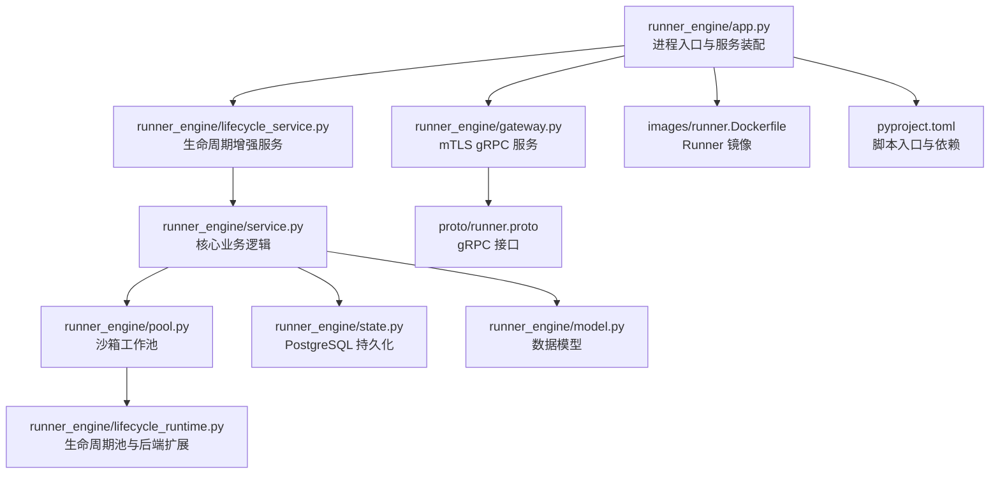

**图表来源**
- [runner_engine/app.py:26-226](file://runner_engine/app.py#L26-L226)
- [runner_engine/gateway.py:44-194](file://runner_engine/gateway.py#L44-L194)
- [runner_engine/lifecycle_service.py:7-70](file://runner_engine/lifecycle_service.py#L7-L70)
- [runner_engine/service.py:80-456](file://runner_engine/service.py#L80-L456)
- [runner_engine/pool.py:11-188](file://runner_engine/pool.py#L11-L188)
- [runner_engine/lifecycle_runtime.py:14-397](file://runner_engine/lifecycle_runtime.py#L14-L397)
- [runner_engine/state.py:131-685](file://runner_engine/state.py#L131-L685)
- [runner_engine/model.py:7-98](file://runner_engine/model.py#L7-L98)
- [proto/runner.proto:8-76](file://proto/runner.proto#L8-L76)
- [images/runner.Dockerfile:1-19](file://images/runner.Dockerfile#L1-L19)
- [pyproject.toml:23-32](file://pyproject.toml#L23-L32)

**章节来源**
- [runner_engine/app.py:26-226](file://runner_engine/app.py#L26-L226)
- [runner_engine/gateway.py:44-194](file://runner_engine/gateway.py#L44-L194)
- [runner_engine/lifecycle_service.py:7-70](file://runner_engine/lifecycle_service.py#L7-L70)
- [runner_engine/service.py:80-456](file://runner_engine/service.py#L80-L456)
- [runner_engine/pool.py:11-188](file://runner_engine/pool.py#L11-L188)
- [runner_engine/lifecycle_runtime.py:14-397](file://runner_engine/lifecycle_runtime.py#L14-L397)
- [runner_engine/state.py:131-685](file://runner_engine/state.py#L131-L685)
- [runner_engine/model.py:7-98](file://runner_engine/model.py#L7-L98)
- [proto/runner.proto:8-76](file://proto/runner.proto#L8-L76)
- [images/runner.Dockerfile:1-19](file://images/runner.Dockerfile#L1-L19)
- [pyproject.toml:23-32](file://pyproject.toml#L23-L32)

## 核心组件
- RunnerService：封装租约、执行、幂等、清理等核心逻辑；
- LifecycleRunnerService：在 RunnerService 之上增加运行时生命周期门控；
- WorkerPool/LifecycleWorkerPool：按租户+运行时+安全策略复用沙箱，支持闲置回收、续租、退役；
- Gateway：mTLS gRPC 服务端，负责身份提取、权限校验、协议映射；
- State（RunnerDB）：PostgreSQL 持久化层，维护租约、执行历史、幂等键；
- Model：统一的领域对象，如 Release、Policy、Lease、RunRequest、RunResult、Worker；
- Errors：统一错误体系，含重试标记；
- Proto：gRPC 接口契约。

**章节来源**
- [runner_engine/service.py:80-456](file://runner_engine/service.py#L80-L456)
- [runner_engine/lifecycle_service.py:7-70](file://runner_engine/lifecycle_service.py#L7-L70)
- [runner_engine/pool.py:11-188](file://runner_engine/pool.py#L11-L188)
- [runner_engine/lifecycle_runtime.py:14-397](file://runner_engine/lifecycle_runtime.py#L14-L397)
- [runner_engine/gateway.py:44-194](file://runner_engine/gateway.py#L44-L194)
- [runner_engine/state.py:131-685](file://runner_engine/state.py#L131-L685)
- [runner_engine/model.py:7-98](file://runner_engine/model.py#L7-L98)
- [runner_engine/errors.py:1-22](file://runner_engine/errors.py#L1-L22)
- [proto/runner.proto:8-76](file://proto/runner.proto#L8-L76)

## 架构总览
Runner 后端以 mTLS gRPC 作为对外边界，内部由服务层、工作池、持久化层组成。生命周期控制器提供运行时退役、快照、空闲 Worker 退役等管理能力。

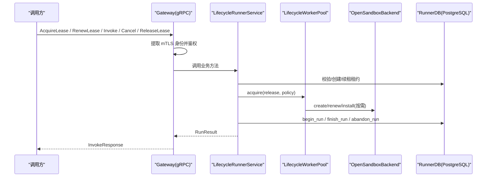

**图表来源**
- [runner_engine/gateway.py:67-177](file://runner_engine/gateway.py#L67-L177)
- [runner_engine/lifecycle_service.py:19-70](file://runner_engine/lifecycle_service.py#L19-L70)
- [runner_engine/service.py:146-456](file://runner_engine/service.py#L146-L456)
- [runner_engine/pool.py:73-188](file://runner_engine/pool.py#L73-L188)
- [runner_engine/lifecycle_runtime.py:26-47](file://runner_engine/lifecycle_runtime.py#L26-L47)
- [runner_engine/state.py:283-685](file://runner_engine/state.py#L283-L685)

## 详细组件分析

### Runner 进程入口与服务装配
- 解析命令行参数与环境变量；
- 加载 ACL、策略、集群配置；
- 初始化 RuntimeLifecycleStore、LifecycleOpenSandboxBackend、Quota、LifecycleWorkerPool、LifecycleRunnerService；
- 启动后台清理线程；
- 可选启动 Admin HTTP；
- 启动 mTLS gRPC 服务并等待终止。

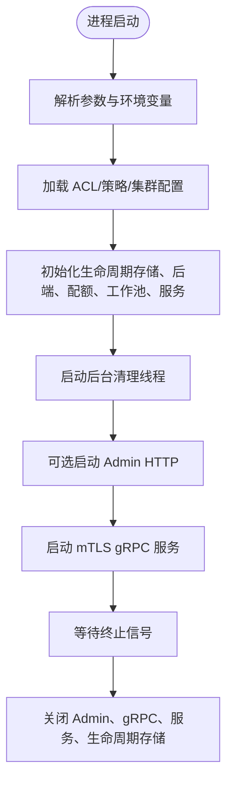

**图表来源**
- [runner_engine/app.py:26-226](file://runner_engine/app.py#L26-L226)

**章节来源**
- [runner_engine/app.py:26-226](file://runner_engine/app.py#L26-L226)

### gRPC 网关与鉴权
- 强制使用 mTLS，从 gRPC 上下文提取客户端证书主题或 SAN；
- 根据 ACL 配置校验 tenant/project 访问权限；
- 将 RunnerError 映射为合适的 gRPC 状态码；
- 将 proto 消息转换为内部 RunRequest/RunResult。

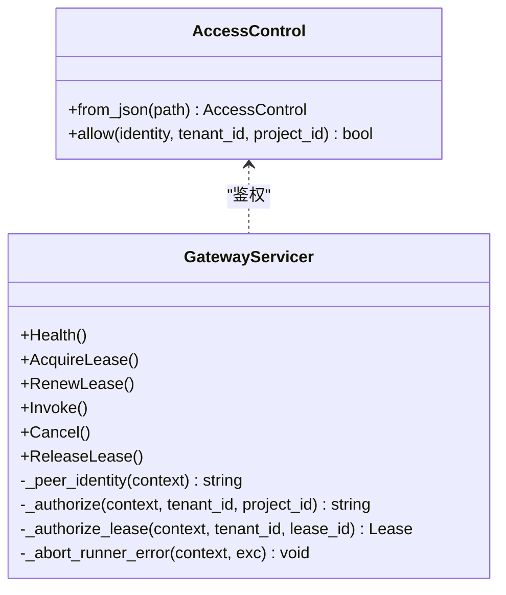

**图表来源**
- [runner_engine/gateway.py:12-31](file://runner_engine/gateway.py#L12-L31)
- [runner_engine/gateway.py:33-96](file://runner_engine/gateway.py#L33-L96)
- [runner_engine/gateway.py:98-177](file://runner_engine/gateway.py#L98-L177)

**章节来源**
- [runner_engine/gateway.py:12-194](file://runner_engine/gateway.py#L12-L194)

### 核心业务逻辑（RunnerService）
- 启动时清理残留运行、过期租约与幂等记录；
- 启动后台清理线程定期回收空闲 Worker、清理过期数据；
- 租约获取、续租、释放；
- 执行入口：
  - 校验内容大小、幂等键；
  - 校验租约与安全策略；
  - 过滤并校验输入属性与参数；
  - 计算请求指纹用于幂等；
  - 开始执行并分配 Worker；
  - 过滤输出属性并校验大小；
  - 完成执行并写入持久化；
  - 根据结果决定复用或失效 Worker；
- 取消执行：校验归属并转发到后端。

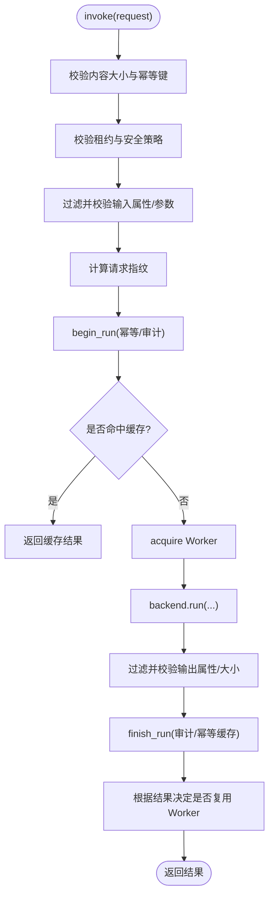

**图表来源**
- [runner_engine/service.py:188-405](file://runner_engine/service.py#L188-L405)

**章节来源**
- [runner_engine/service.py:105-456](file://runner_engine/service.py#L105-L456)

### 生命周期服务与工作池
- LifecycleRunnerService：在执行前检查运行时是否处于 RETIRING/RETIRED，阻止新租约与新执行；
- LifecycleWorkerPool：
  - 在 acquire 前检查运行时是否被阻塞；
  - 统计按 runtime 的 acquiring 数量；
  - 支持退役整个 runtime 的空闲 Worker；
  - 支持退役指定空闲 Worker；
  - 提供 snapshot 用于观测；
- WorkerPool：
  - 按 (tenant, runtime, profile) 分桶；
  - 空闲超时回收；
  - 沙箱 TTL 续租；
  - 安装发布版本；
  - 配额限制创建与并发；
  - 失效与销毁 Worker。

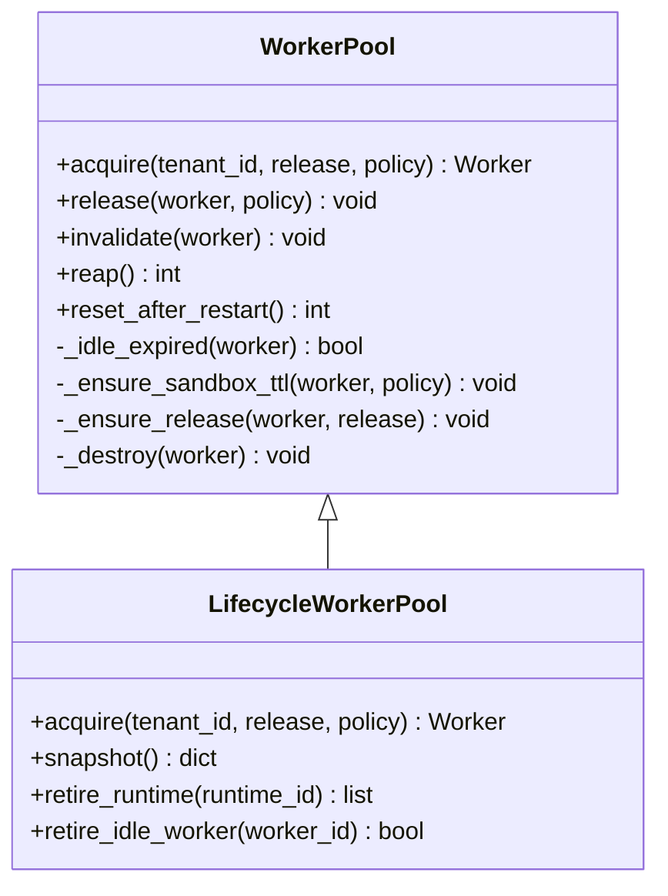

**图表来源**
- [runner_engine/pool.py:11-188](file://runner_engine/pool.py#L11-L188)
- [runner_engine/lifecycle_runtime.py:14-121](file://runner_engine/lifecycle_runtime.py#L14-L121)

**章节来源**
- [runner_engine/lifecycle_service.py:7-70](file://runner_engine/lifecycle_service.py#L7-L70)
- [runner_engine/lifecycle_runtime.py:14-121](file://runner_engine/lifecycle_runtime.py#L14-L121)
- [runner_engine/pool.py:11-188](file://runner_engine/pool.py#L11-L188)

### 持久化层（RunnerDB）
- 初始化 schema，包含 leases、runs、idempotency_keys；
- 支持旧 runs 表迁移；
- 提供租约 CRUD、续租、删除、过期清理；
- 提供 begin_run/finish_run/abandon_run，保证幂等与审计；
- 提供过期幂等键清理与旧执行清理。

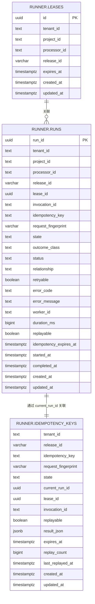

**图表来源**
- [runner_engine/state.py:16-82](file://runner_engine/state.py#L16-L82)
- [runner_engine/state.py:34-61](file://runner_engine/state.py#L34-L61)
- [runner_engine/state.py:63-82](file://runner_engine/state.py#L63-L82)

**章节来源**
- [runner_engine/state.py:131-685](file://runner_engine/state.py#L131-L685)

### 数据模型
- RuntimeEnv：运行时环境标识、镜像、Python 版本；
- OperatorRelease：发布版本信息、入口点、安全策略名、输入输出属性白名单；
- SecurityPolicy：沙箱集群、CPU/内存、最大超时、网络允许列表、是否复用沙箱；
- Lease：租约信息；
- RunRequest/RunResult：执行请求与结果；
- Worker：沙箱实例元数据与状态；
- ActiveRun：当前活跃执行与 Worker 绑定。

**章节来源**
- [runner_engine/model.py:7-98](file://runner_engine/model.py#L7-L98)

## 依赖与构建流程

### Python 环境与依赖
- 最低 Python 版本要求：>=3.11；
- 基础依赖：PyYAML；
- 可选依赖：
  - grpc：生成 gRPC 存根；
  - build：Runner 后端运行所需 FastAPI/Uvicorn/Pydantic/packaging/uv/psycopg 等；
  - publish：发布服务相关依赖；
  - dev：测试依赖 pytest。

**章节来源**
- [pyproject.toml:5-20](file://pyproject.toml#L5-L20)

### 代码打包与脚本入口
- 包名：managed-python-runner-engine；
- 脚本入口：
  - mpr-runner：Runner 后端；
  - mpr-agent：Worker Agent；
  - mpr-build-service：Build Service；
  - mpr-publish-service：Publish Service；
  - mpr-publish：发布工具。

**章节来源**
- [pyproject.toml:23-28](file://pyproject.toml#L23-L28)

### 镜像构建（Runner）
- 基础镜像：python:3.12-slim；
- 创建非 root 用户 runner；
- 创建工作目录 /opt/runner/app；
- 复制 runner_engine 包与 pyproject.toml；
- 设置 PYTHONPATH；
- 默认入口：python -m runner_engine.worker.agent。

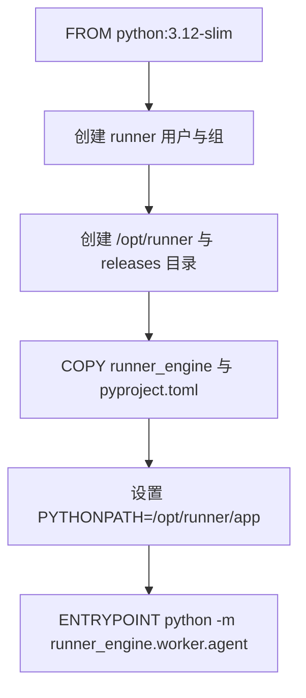

**图表来源**
- [images/runner.Dockerfile:1-19](file://images/runner.Dockerfile#L1-L19)

**章节来源**
- [images/runner.Dockerfile:1-19](file://images/runner.Dockerfile#L1-L19)

## Runner 配置与环境变量

### 进程参数与环境变量
- --listen：gRPC 监听地址，默认取自 RUNNER_LISTEN；
- --catalog：发布目录路径，默认取自 RUNNER_CATALOG；
- --db-url：PostgreSQL DSN，默认取自 RUNNER_DB_URL；
- --policies：安全策略文件路径，默认取自 RUNNER_POLICIES；
- --acl：ACL 配置文件路径，默认取自 RUNNER_ACL；
- --clusters：OpenSandbox 集群配置路径，默认取自 RUNNER_CLUSTERS；
- --owner-id：Owner ID，用于沙箱标签归属；
- --tls-cert/--tls-key/--client-ca：mTLS 证书与 CA。

必需参数：db-url、owner-id、tls-cert、tls-key、client-ca。

**章节来源**
- [runner_engine/app.py:26-85](file://runner_engine/app.py#L26-L85)

### 运行时行为与环境变量
- RUNNER_MAX_CREATING：同时创建沙箱的最大数量；
- RUNNER_MAX_LIVE：最大存活沙箱数；
- RUNNER_MAX_LIVE_PER_TENANT：每租户最大存活沙箱数；
- RUNNER_WORKER_IDLE_SECONDS：Worker 空闲超时；
- RUNNER_SANDBOX_ORPHAN_TTL_SECONDS：孤儿沙箱 TTL；
- RUNNER_SANDBOX_RENEW_BEFORE_SECONDS：续租提前时间；
- RUNNER_MAX_RELEASES_PER_SANDBOX：每个沙箱最多安装的发布数；
- RUNNER_LEASE_TTL_MS：租约 TTL；
- RUNNER_IDEMPOTENCY_RETENTION_MS：幂等缓存保留时长；
- RUNNER_RUN_RETENTION_MS：执行历史保留时长；
- RUNNER_REAPER_INTERVAL_SECONDS：后台清理间隔；
- RUNNER_ADMIN_TOKEN/RUNNER_ADMIN_LISTEN/RUNNER_ADMIN_PORT：Admin HTTP 开关与监听。

**章节来源**
- [runner_engine/app.py:97-153](file://runner_engine/app.py#L97-L153)
- [runner_engine/app.py:174-210](file://runner_engine/app.py#L174-L210)

## API 调用流程与示例

### gRPC 接口定义
ManagedPythonRunner 服务提供以下 RPC：
- Health：健康检查；
- AcquireLease：获取租约；
- RenewLease：续租；
- Invoke：执行 Operator；
- Cancel：取消执行；
- ReleaseLease：释放租约。

**章节来源**
- [proto/runner.proto:8-76](file://proto/runner.proto#L8-L76)

### 典型调用序列
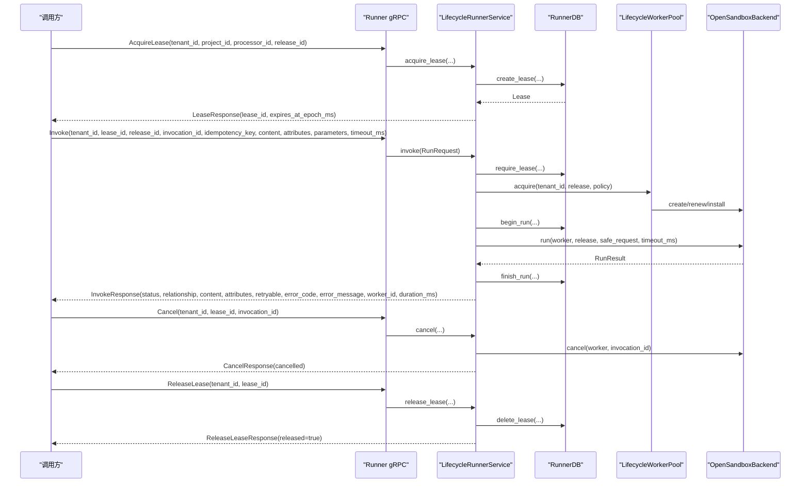

**图表来源**
- [runner_engine/gateway.py:102-177](file://runner_engine/gateway.py#L102-L177)
- [runner_engine/service.py:146-456](file://runner_engine/service.py#L146-L456)
- [runner_engine/state.py:283-685](file://runner_engine/state.py#L283-L685)
- [runner_engine/pool.py:73-188](file://runner_engine/pool.py#L73-L188)

### 调用注意事项
- Invoke 必须携带 idempotency_key；
- 同一 invocation_id 不能重复；
- 输入/输出属性需符合发布版本的白名单；
- 内容大小上限为 8 MiB；
- 超时受安全策略 max_timeout_ms 限制；
- 取消仅对当前租户与租约下的 invocation 有效。

**章节来源**
- [runner_engine/service.py:188-405](file://runner_engine/service.py#L188-L405)
- [runner_engine/gateway.py:129-177](file://runner_engine/gateway.py#L129-L177)

## 与 Build Service 的交互
- Runner 后端不直接调用 Build Service；
- Build Service 的职责是构建 Operator 并发布到 Catalog；
- Runner 通过 Catalog 读取已发布的 Operator 版本信息（release.json），包括 runtime、entrypoint、profile、input/output attributes；
- Runner 根据 release.runtime.image 与 lifecycle store 判断运行时状态；
- 生命周期控制器会扫描 catalog 根目录，收集与特定 image_ref 相关的 release 列表，用于退役决策与观测。

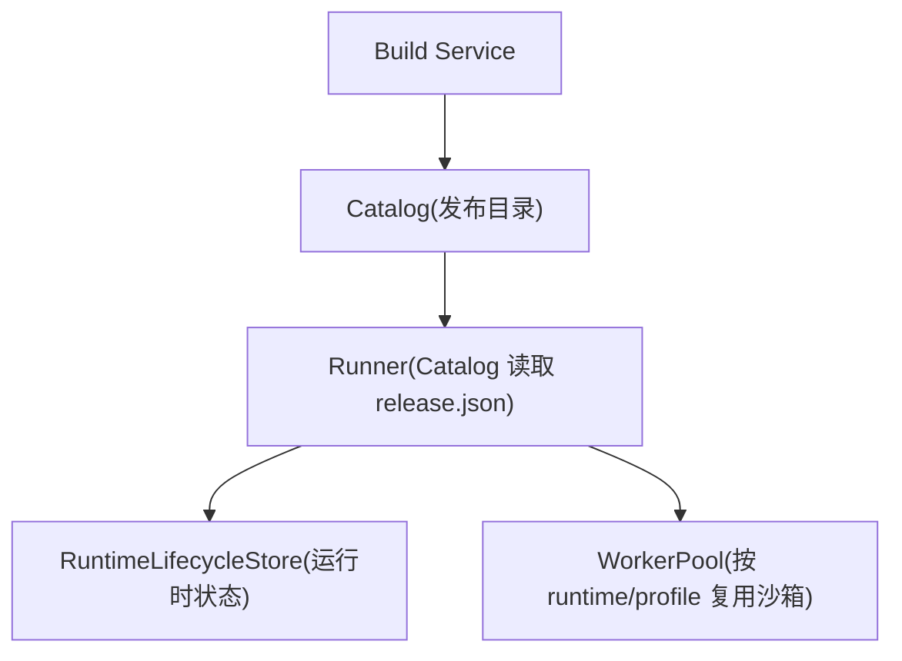

**图表来源**
- [runner_engine/lifecycle_runtime.py:196-220](file://runner_engine/lifecycle_runtime.py#L196-L220)
- [runner_engine/service.py:154-167](file://runner_engine/service.py#L154-L167)

**章节来源**
- [runner_engine/lifecycle_runtime.py:187-220](file://runner_engine/lifecycle_runtime.py#L187-L220)
- [runner_engine/service.py:154-167](file://runner_engine/service.py#L154-L167)

## 错误处理策略
- RunnerError：统一异常，包含 code 与 retryable 标记；
- Gateway 将 RunnerError 映射为 gRPC 状态码：
  - UNAUTHENTICATED -> UNAUTHENTICATED；
  - FORBIDDEN/CANCEL_FORBIDDEN -> PERMISSION_DENIED；
  - RELEASE_NOT_FOUND/LEASE_UNKNOWN -> NOT_FOUND；
  - retryable=True -> UNAVAILABLE；
  - 其他 -> FAILED_PRECONDITION；
- 执行失败时：
  - 若未结束则标记 ABANDONED；
  - 基础设施错误标记 RUNNER_INFRASTRUCTURE_ERROR 并设为 retryable；
  - 某些错误（TIMEOUT、CANCELLED、CPU_LIMIT、USER_EXCEPTION 等）允许复用 Worker；
- 生命周期错误：
  - RUNTIME_RETIRING/RUNTIME_RETIRED 阻止新租约与新执行；
  - RETIRING 标记为 retryable。

**章节来源**
- [runner_engine/errors.py:1-22](file://runner_engine/errors.py#L1-L22)
- [runner_engine/gateway.py:67-79](file://runner_engine/gateway.py#L67-L79)
- [runner_engine/service.py:334-405](file://runner_engine/service.py#L334-L405)
- [runner_engine/lifecycle_service.py:19-32](file://runner_engine/lifecycle_service.py#L19-L32)

## 性能优化与资源管理

### 沙箱池与复用
- 按 (tenant, runtime, profile) 分桶，减少重复创建；
- 空闲超时回收，避免资源泄漏；
- 沙箱 TTL 续租，避免长时间运行的执行中断；
- 每个沙箱最多安装一定数量的发布版本，避免过度膨胀；
- 安全策略可禁用沙箱复用。

**章节来源**
- [runner_engine/pool.py:11-188](file://runner_engine/pool.py#L11-L188)
- [runner_engine/model.py:26-35](file://runner_engine/model.py#L26-L35)

### 配额与并发
- RUNNER_MAX_CREATING：限制同时创建沙箱的数量；
- RUNNER_MAX_LIVE：限制全局最大存活沙箱；
- RUNNER_MAX_LIVE_PER_TENANT：限制每租户最大存活沙箱；
- Quota 在创建与销毁时精确释放 live 计数。

**章节来源**
- [runner_engine/app.py:97-103](file://runner_engine/app.py#L97-L103)
- [runner_engine/pool.py:110-160](file://runner_engine/pool.py#L110-L160)

### 后台清理
- 后台线程周期性：
  - 回收空闲 Worker；
  - 清理过期租约；
  - 清理过期幂等键；
  - 清理旧执行历史；
- 清理间隔可通过 RUNNER_REAPER_INTERVAL_SECONDS 调整。

**章节来源**
- [runner_engine/service.py:117-138](file://runner_engine/service.py#L117-L138)
- [runner_engine/app.py:161-168](file://runner_engine/app.py#L161-L168)

### gRPC 传输限制
- 最大接收/发送消息长度设置为 10 MiB；
- 业务层对内容大小限制为 8 MiB，留有余量。

**章节来源**
- [runner_engine/gateway.py:184-189](file://runner_engine/gateway.py#L184-L189)
- [runner_engine/service.py:15-18](file://runner_engine/service.py#L15-L18)

## 部署架构
- Runner 以容器镜像运行，默认入口为 worker.agent；
- 对外暴露 mTLS gRPC 端口；
- 可选暴露 Admin HTTP 端口用于生命周期管理与观测；
- 依赖 PostgreSQL 存储租约、执行历史与幂等键；
- 依赖 OpenSandbox 集群创建与管理沙箱；
- Catalog 目录提供 Operator 发布元数据；
- ACL 与 policies.json 分别控制访问控制与安全策略。

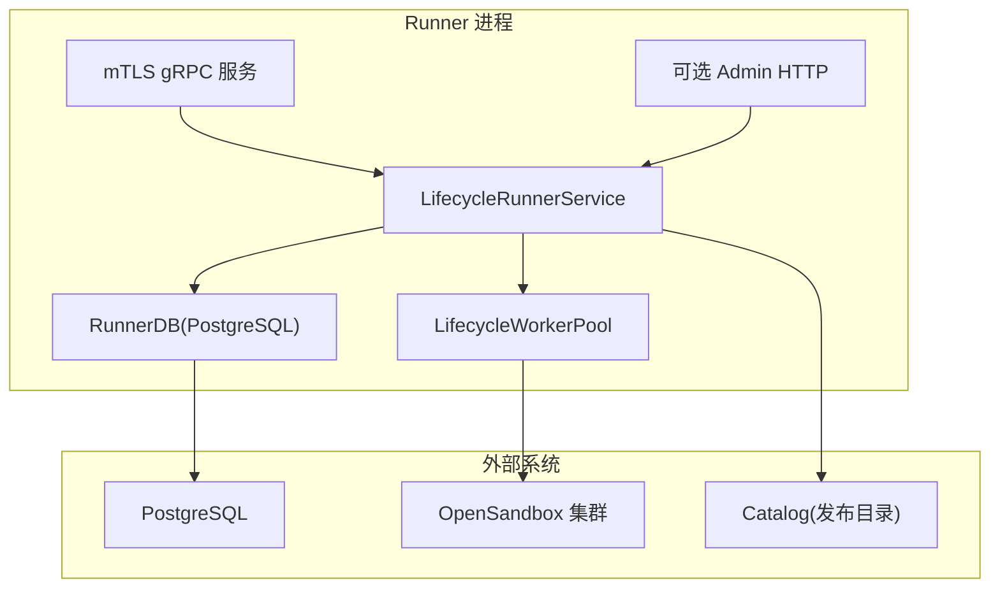

**图表来源**
- [runner_engine/app.py:156-226](file://runner_engine/app.py#L156-L226)
- [runner_engine/gateway.py:179-194](file://runner_engine/gateway.py#L179-L194)
- [runner_engine/lifecycle_runtime.py:187-397](file://runner_engine/lifecycle_runtime.py#L187-L397)
- [runner_engine/state.py:131-149](file://runner_engine/state.py#L131-L149)

## 故障排查指南

### 常见问题定位
- 无法连接数据库：
  - 检查 RUNNER_DB_URL 是否正确；
  - 确认 PostgreSQL 可达且权限正确；
  - 查看 RunnerDB 初始化与连接池日志。
- mTLS 认证失败：
  - 检查 tls-cert/tls-key/client-ca 是否匹配；
  - 确认客户端证书 SAN/CN 是否在 ACL 中；
  - 观察 gateway 的 UNAUTHENTICATED/PERMISSION_DENIED 错误。
- 租约无效或过期：
  - 检查 AcquireLease/RenewLease 调用频率；
  - 查看 leases 表过期时间与更新情况；
  - 关注 LEASE_EXPIRED/LEASE_UNKNOWN/LEASE_FORBIDDEN 错误。
- 执行失败：
  - 检查 content 大小是否超过 8 MiB；
  - 检查 attributes/parameters 是否符合白名单；
  - 检查 timeout_ms 是否超过策略限制；
  - 查看 RUN_IN_PROGRESS/IDEMPOTENCY_CONFLICT/OUTPUT_TOO_LARGE 等错误。
- 运行时退役：
  - 检查 RUNTIME_RETIRING/RUNTIME_RETIRED；
  - 使用生命周期控制器查询 image_ref 状态；
  - 等待 activeInvocationCount/idleWorkerCount/acquiringWorkerCount/managedSandboxCount 归零后再 finalize。

**章节来源**
- [runner_engine/gateway.py:67-96](file://runner_engine/gateway.py#L67-L96)
- [runner_engine/service.py:188-405](file://runner_engine/service.py#L188-L405)
- [runner_engine/lifecycle_runtime.py:239-359](file://runner_engine/lifecycle_runtime.py#L239-L359)
- [runner_engine/state.py:313-386](file://runner_engine/state.py#L313-L386)

## 结论
Runner 后端通过严格的 mTLS 鉴权、租约机制、幂等执行、沙箱池复用与生命周期控制，提供了稳定、安全、可扩展的 Python Operator 执行平台。其设计强调：
- 安全性：mTLS、ACL、安全策略、属性白名单；
- 可靠性：租约、幂等、审计、后台清理；
- 可运维性：生命周期退役、快照、Admin HTTP；
- 高性能：沙箱复用、配额控制、TTL 续租、批量清理。

在生产环境中，建议合理配置配额、TTL、保留策略与清理间隔，并结合 ACL 与 policies.json 进行细粒度访问控制与安全约束。