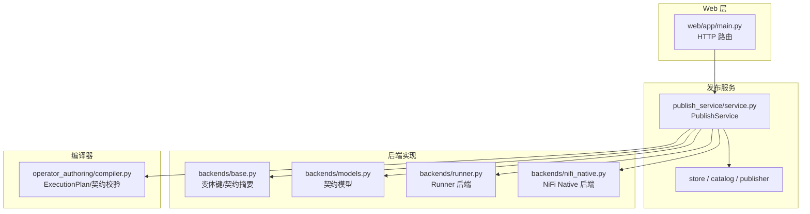
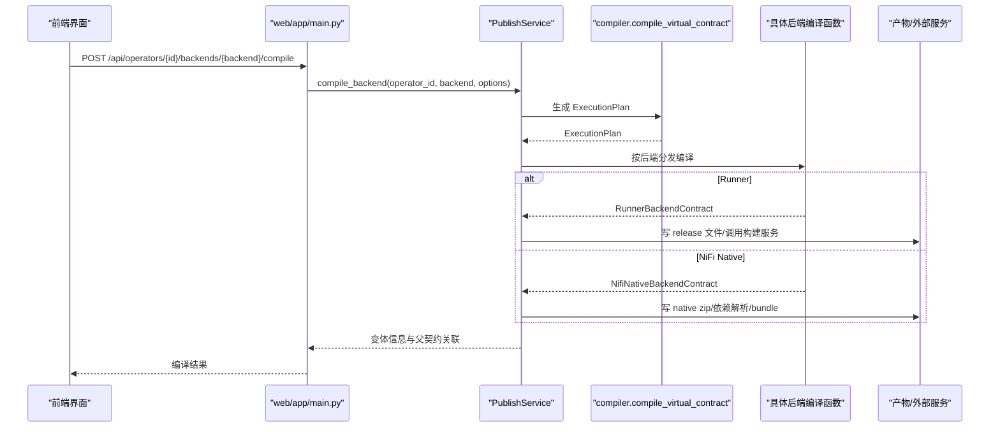
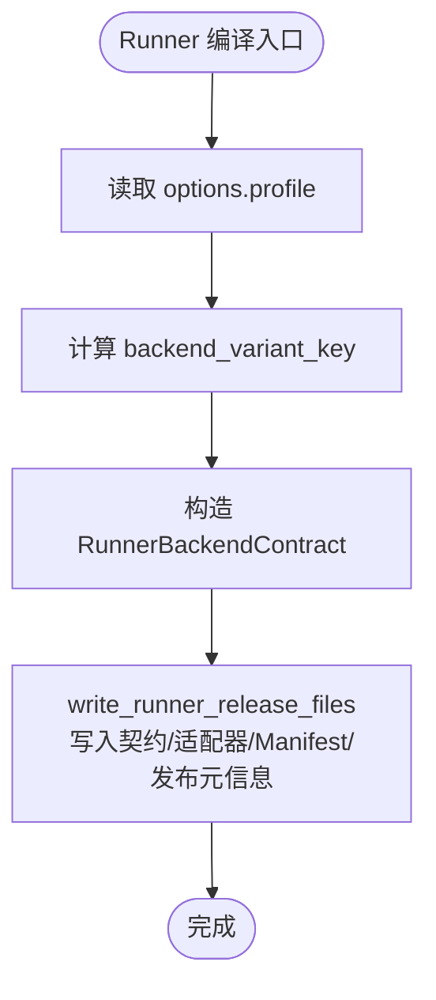
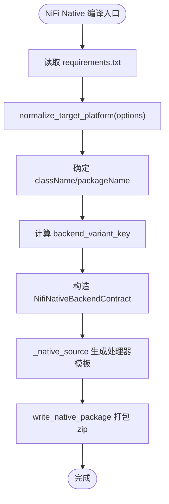
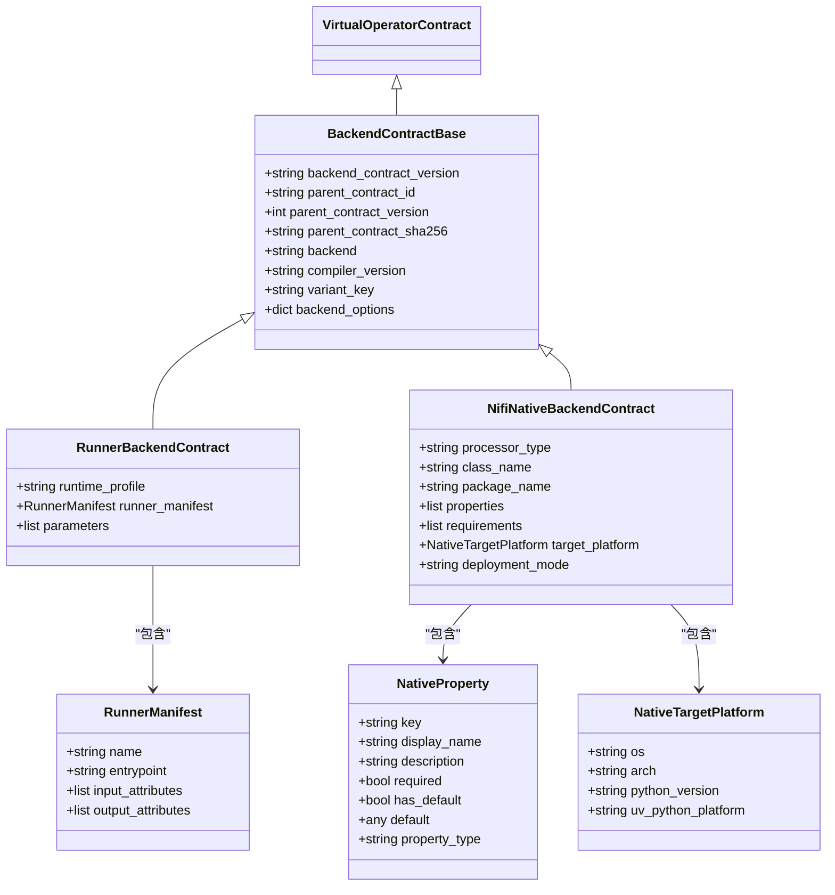
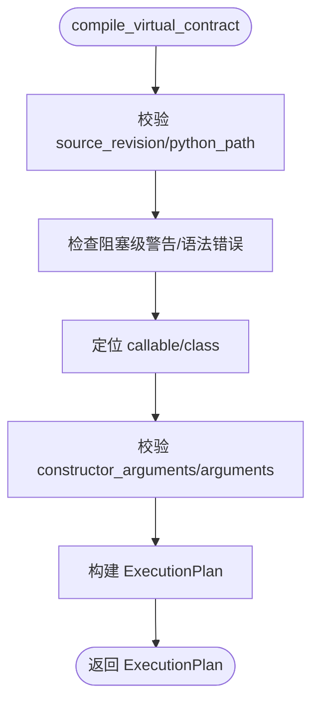
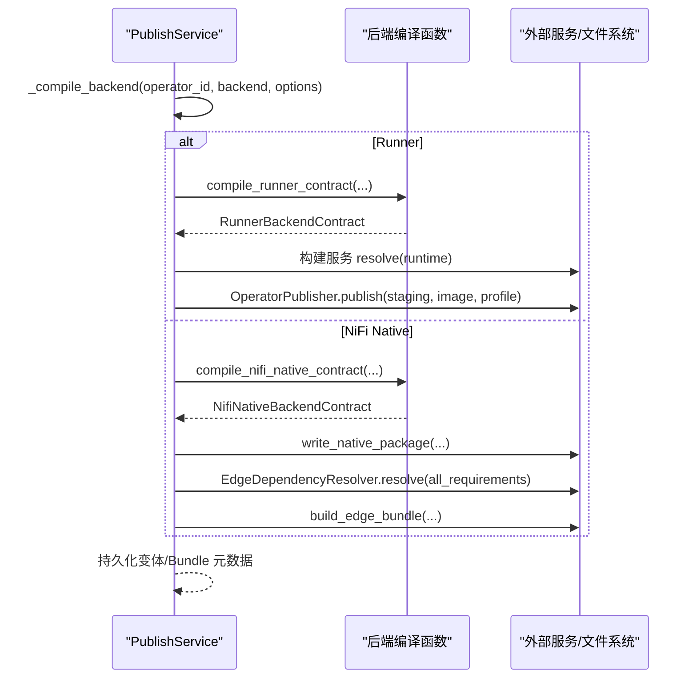
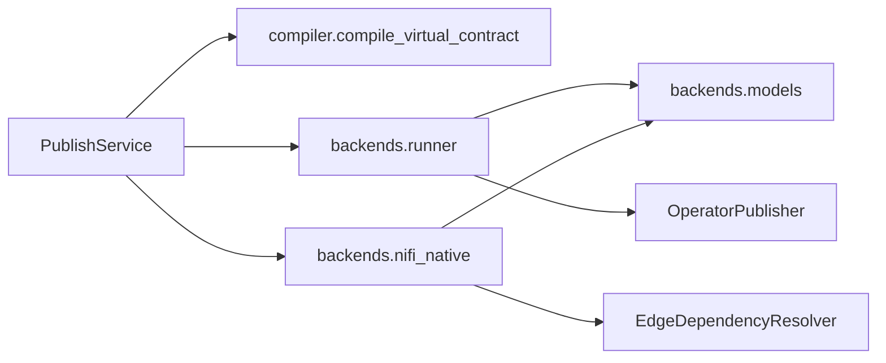

# 后端编译机制

<cite>
**本文引用的文件**   
- [publish_service/backends/base.py](file://publish_service/backends/base.py)
- [publish_service/backends/models.py](file://publish_service/backends/models.py)
- [publish_service/backends/runner.py](file://publish_service/backends/runner.py)
- [publish_service/backends/nifi_native.py](file://publish_service/backends/nifi_native.py)
- [operator_authoring/compiler.py](file://operator_authoring/compiler.py)
- [publish_service/service.py](file://publish_service/service.py)
- [web/app/main.py](file://web/app/main.py)
</cite>

## 目录
1. [引言](#引言)
2. [项目结构](#项目结构)
3. [核心组件](#核心组件)
4. [架构总览](#架构总览)
5. [详细组件分析](#详细组件分析)
6. [依赖关系分析](#依赖关系分析)
7. [性能与可维护性](#性能与可维护性)
8. [故障排查指南](#故障排查指南)
9. [结论](#结论)
10. [附录：扩展新后端的步骤](#附录扩展新后端的步骤)

## 引言
本文面向“后端编译机制”，聚焦两种后端类型 Runner 与 NiFi Native 的实现差异、编译流程、配置选项、依赖解析、产物生成与版本控制，并给出扩展新后端的实践路径。文档同时梳理错误处理与重试策略，帮助读者在理解现有实现的基础上进行二次开发或集成。

## 项目结构
后端编译相关代码主要分布在以下模块：
- 抽象与模型：`publish_service/backends/base.py`、`publish_service/backends/models.py`
- 具体后端实现：`publish_service/backends/runner.py`、`publish_service/backends/nifi_native.py`
- 编译编排与服务入口：`publish_service/service.py`
- 虚拟算子到执行计划的编译器：`operator_authoring/compiler.py`
- Web API 路由转发：`web/app/main.py`

**图表来源** 
- [web/app/main.py:152-175](file://web/app/main.py#L152-L175)
- [publish_service/service.py:569-642](file://publish_service/service.py#L569-L642)
- [publish_service/backends/base.py:10-27](file://publish_service/backends/base.py#L10-L27)
- [publish_service/backends/models.py:10-73](file://publish_service/backends/models.py#L10-L73)
- [publish_service/backends/runner.py:23-114](file://publish_service/backends/runner.py#L23-L114)
- [publish_service/backends/nifi_native.py:103-168](file://publish_service/backends/nifi_native.py#L103-L168)
- [operator_authoring/compiler.py:167-236](file://operator_authoring/compiler.py#L167-L236)

**章节来源**
- [web/app/main.py:152-175](file://web/app/main.py#L152-L175)
- [publish_service/service.py:569-642](file://publish_service/service.py#L569-L642)

## 核心组件
- 抽象与工具
  - `backend_variant_key`：基于契约摘要、后端名、编译器版本和选项计算稳定变体键，用于缓存与去重。
  - `backend_contract_sha256`：对后端契约做规范化 JSON 摘要，用于存储与比对。
- 契约模型
  - `BackendContractBase`：所有后端契约的基类，包含父契约引用、编译器版本、变体键与后端选项。
  - `RunnerBackendContract`：Runner 后端契约，包含运行时 profile、Runner Manifest 与参数列表。
  - `NifiNativeBackendContract`：NiFi Native 后端契约，包含类名、包名、属性、requirements、目标平台等。
- 编译器
  - `compile_virtual_contract`：将虚拟算子契约与源码目录扫描结果转换为 `ExecutionPlan`，负责参数绑定校验、输入输出元数据推导、目标调用点描述等。
- 服务编排
  - `PublishService._compile_backend`：根据后端名称分发到对应编译函数，统一持久化变体信息。
  - `PublishService.compile_backend`：对外暴露的编译接口，返回变体视图与父契约关联信息。
  - `PublishService.publish_backend`：触发发布流程，Runner 走构建服务与镜像发布；NiFi Native 走本地打包与边缘依赖解析。

**章节来源**
- [publish_service/backends/base.py:10-27](file://publish_service/backends/base.py#L10-L27)
- [publish_service/backends/models.py:10-73](file://publish_service/backends/models.py#L10-L73)
- [operator_authoring/compiler.py:167-236](file://operator_authoring/compiler.py#L167-L236)
- [publish_service/service.py:569-642](file://publish_service/service.py#L569-L642)

## 架构总览
后端编译的整体流程如下：
1. Web 层接收 `/api/operators/{operator_id}/backends/{backend}/compile|publish` 请求并转发至 Publish Service。
2. Publish Service 加载当前虚拟契约与源码快照，调用编译器生成 `ExecutionPlan`。
3. 根据后端类型选择具体编译逻辑：
   - Runner：构造 Runner 契约，写入 release 文件（契约 YAML、适配器 Python、Manifest、发布元信息）。
   - NiFi Native：构造 Native 契约，生成 Python 处理器模板、打包为 zip，并参与边缘依赖解析与 bundle 构建。
4. 编译成功后持久化变体记录；发布时进一步调用外部构建服务或打包工具，产出最终制品。

**图表来源**
- [web/app/main.py:152-175](file://web/app/main.py#L152-L175)
- [publish_service/service.py:569-642](file://publish_service/service.py#L569-L642)
- [publish_service/backends/runner.py:23-114](file://publish_service/backends/runner.py#L23-L114)
- [publish_service/backends/nifi_native.py:103-168](file://publish_service/backends/nifi_native.py#L103-L168)
- [operator_authoring/compiler.py:167-236](file://operator_authoring/compiler.py#L167-L236)

## 详细组件分析

### Runner 后端
Runner 后端面向“使用 Publish Service 声明的执行后端”的场景，其特点包括：
- 编译产物
  - `operator-contract.yaml`：序列化后的 Runner 后端契约。
  - `__dsc_entry__.py`：由 `generate_runner_adapter(plan)` 生成的适配器入口。
  - `operator.yaml`：Runner Manifest，描述名称、入口、输入输出属性。
  - `publish-info.json`：发布元信息，包含 schema 版本、后端名、父契约标识、变体键、执行计划摘要及嵌入位置。
- 编译选项
  - `profile`：运行时 profile，默认来自服务配置 `default_profile`，影响运行时环境。
- 变体键与版本
  - 使用 `backend_variant_key` 结合契约摘要、后端名、编译器版本与选项生成稳定变体键。
  - 编译器版本常量 `runner-contract-v4` 表示 Runner 契约语义。

**图表来源**
- [publish_service/backends/runner.py:23-114](file://publish_service/backends/runner.py#L23-L114)
- [publish_service/backends/base.py:10-27](file://publish_service/backends/base.py#L10-L27)

**章节来源**
- [publish_service/backends/runner.py:23-114](file://publish_service/backends/runner.py#L23-L114)
- [publish_service/backends/base.py:10-27](file://publish_service/backends/base.py#L10-L27)

### NiFi Native 后端
NiFi Native 后端面向“生成 NiFi Python 扩展包”的场景，其特点包括：
- 编译选项
  - `targetPlatform`：必须提供 `os` 与 `arch`，支持 Linux x86_64/aarch64 与 Windows x86_64/aarch64，映射到 uv 平台字符串。
  - `className`、`packageName`：可选，未提供则自动生成。
  - `default_python_version`：默认 Python 版本，来自服务配置 `edge_python_version`。
- 产物
  - 动态生成 Python 处理器模板，内嵌执行计划与属性定义。
  - 打包为 zip，文件名包含包名与变体键前缀。
  - 附带 `edge-target.json` 目标平台信息。
- 依赖解析与边缘部署
  - 发布阶段聚合同用户同目标平台的已有成员 requirements，调用 `EdgeDependencyResolver.resolve` 解析依赖冲突。
  - 若冲突，抛出 `EdgeDependencyConflictError`，包含冲突详情与候选成员信息。
  - 成功时构建 edge bundle，记录 bundle 元数据并持久化。

**图表来源**
- [publish_service/backends/nifi_native.py:103-168](file://publish_service/backends/nifi_native.py#L103-L168)
- [publish_service/backends/nifi_native.py:504-581](file://publish_service/backends/nifi_native.py#L504-L581)

**章节来源**
- [publish_service/backends/nifi_native.py:103-168](file://publish_service/backends/nifi_native.py#L103-L168)
- [publish_service/backends/nifi_native.py:504-581](file://publish_service/backends/nifi_native.py#L504-L581)

### 抽象基类与契约模型设计
- `BackendContractBase` 继承自 `VirtualOperatorContract`，统一了父契约引用、编译器版本、变体键与后端选项字段，便于跨后端一致化管理。
- `RunnerBackendContract` 与 `NifiNativeBackendContract` 分别扩展各自领域字段，如 Runner 的 manifest 与参数，Native 的类/包名、属性、requirements、目标平台等。
- 通过 Pydantic 模型保证数据结构校验与序列化一致性，配合 `canonical_json` 确保哈希稳定。

**图表来源**
- [publish_service/backends/models.py:10-73](file://publish_service/backends/models.py#L10-L73)

**章节来源**
- [publish_service/backends/models.py:10-73](file://publish_service/backends/models.py#L10-L73)

### 编译器与执行计划
`compile_virtual_contract` 是连接虚拟契约与后端编译的桥梁，职责包括：
- 校验源码快照版本与 Python 路径匹配。
- 检查语法错误与不支持特性（异步、参数种类等）。
- 校验构造函数参数与调用参数的绑定完整性与一致性。
- 推导输入/输出元数据集合。
- 生成 `ExecutionPlan`，包含目标调用点、参数绑定、输出规范、参数列表、元数据与契约摘要。

**图表来源**
- [operator_authoring/compiler.py:167-236](file://operator_authoring/compiler.py#L167-L236)

**章节来源**
- [operator_authoring/compiler.py:167-236](file://operator_authoring/compiler.py#L167-L236)

### 服务编排与发布流程
- 编译阶段
  - `_compile_backend` 根据后端名称分发到 `compile_runner_contract` 或 `compile_nifi_native_contract`。
  - 统一计算 `backend_contract_sha256` 并持久化变体记录。
  - `compile_backend` 对外返回变体视图与父契约关联信息。
- 发布阶段
  - Runner：调用构建服务获取运行环境，写入 release 文件并通过 `OperatorPublisher.publish` 发布，返回发布 ID、镜像与环境信息。
  - NiFi Native：生成 zip 包，聚合同目标平台成员 requirements，解析依赖冲突，构建 edge bundle，持久化 bundle 元数据并返回部署提示。

**图表来源**
- [publish_service/service.py:569-642](file://publish_service/service.py#L569-L642)
- [publish_service/service.py:644-774](file://publish_service/service.py#L644-L774)
- [publish_service/service.py:823-977](file://publish_service/service.py#L823-L977)

**章节来源**
- [publish_service/service.py:569-642](file://publish_service/service.py#L569-L642)
- [publish_service/service.py:644-774](file://publish_service/service.py#L644-L774)
- [publish_service/service.py:823-977](file://publish_service/service.py#L823-L977)

## 依赖关系分析
- 耦合关系
  - `PublishService` 强依赖后端编译函数与模型，但通过字符串后端名进行分发，保持可扩展性。
  - 后端实现依赖 `operator_authoring.compiler.ExecutionPlan` 与 `VirtualOperatorContract`，体现“编译器产物驱动后端”的设计。
  - NiFi Native 额外依赖 `operator_authoring.snapshot.read_requirements` 与 `EdgeDependencyResolver`，以支持依赖解析与 bundle 构建。
- 外部依赖
  - Runner 依赖构建服务（Build Service）与 `OperatorPublisher`。
  - NiFi Native 依赖本地文件系统与依赖解析器。

**图表来源**
- [publish_service/service.py:12-38](file://publish_service/service.py#L12-L38)
- [publish_service/backends/runner.py:9-14](file://publish_service/backends/runner.py#L9-L14)
- [publish_service/backends/nifi_native.py:12-17](file://publish_service/backends/nifi_native.py#L12-L17)

**章节来源**
- [publish_service/service.py:12-38](file://publish_service/service.py#L12-L38)
- [publish_service/backends/runner.py:9-14](file://publish_service/backends/runner.py#L9-L14)
- [publish_service/backends/nifi_native.py:12-17](file://publish_service/backends/nifi_native.py#L12-L17)

## 性能与可维护性
- 稳定性与幂等
  - 变体键与契约摘要确保相同输入产生相同输出，利于缓存与去重。
  - 产物命名包含变体键片段，避免覆盖与冲突。
- 可扩展性
  - 后端分发基于字符串判断，新增后端只需添加分支与实现函数，并在服务中注册。
  - 契约模型采用 Pydantic，便于校验与序列化，降低前后端不一致风险。
- 资源管理
  - 临时目录用于 staging 与打包，完成后自动清理。
  - 边缘依赖解析与 bundle 构建在锁保护下进行，避免并发冲突。

[本节为通用指导，不直接分析具体文件]

## 故障排查指南
- 编译期错误
  - 源码快照版本不匹配或 Python 路径不一致会抛出 `ContractCompilationError`。
  - 语法错误或异步/参数种类不支持会阻止编译。
  - 参数绑定缺失或冲突会抛出 `ContractCompilationError`。
- 发布期错误
  - Runner 构建服务返回非 READY 状态或无镜像时抛出 `PublishError`。
  - NiFi Native 依赖冲突抛出 `EdgeDependencyConflictError`，包含冲突详情、目标平台、候选成员与解析错误。
- 重试建议
  - 对于网络或构建服务不稳定导致的失败，可在上层调用处捕获异常并重试有限次数。
  - 依赖冲突需人工调整 requirements 或拆分部署目标，避免在同一共享环境中引入冲突依赖。

**章节来源**
- [operator_authoring/compiler.py:167-236](file://operator_authoring/compiler.py#L167-L236)
- [publish_service/service.py:691-709](file://publish_service/service.py#L691-L709)
- [publish_service/service.py:720-737](file://publish_service/service.py#L720-L737)
- [publish_service/service.py:874-915](file://publish_service/service.py#L874-L915)

## 结论
本项目的后端编译机制通过统一的契约模型与编译器产物驱动两种后端实现：Runner 侧重运行时环境与镜像发布，NiFi Native 侧重本地打包与边缘依赖解析。抽象基类与变体键机制保证了版本控制与幂等性，服务编排提供了清晰的扩展点。通过遵循本文的扩展步骤与错误处理建议，可以安全地增加新的后端类型并集成到现有流程中。

[本节为总结性内容，不直接分析具体文件]

## 附录：扩展新后端的步骤
1. 定义后端契约模型
   - 在 `publish_service/backends/models.py` 中新增继承自 `BackendContractBase` 的契约类，补充领域字段。
2. 实现后端编译函数
   - 在 `publish_service/backends/<new_backend>.py` 中实现：
     - `compile_<new_backend>_contract(...)`：构造契约、计算变体键、填充选项。
     - `write_<new_backend>_release_files(...)` 或 `write_<new_backend>_package(...)`：生成产物文件/压缩包。
3. 在服务中注册分发
   - 在 `publish_service/service.py` 的 `_compile_backend` 中添加后端分支，调用新编译函数。
   - 在 `publish_backend` 中添加发布分支，调用新发布逻辑。
4. 配置与选项
   - 为新后端定义 `options` 字段与默认值，必要时从服务配置注入默认值。
5. 测试与验证
   - 编写单元测试覆盖编译与发布流程，验证变体键稳定性与产物正确性。
   - 针对依赖解析与外部服务调用模拟失败场景，验证错误处理与重试策略。

**章节来源**
- [publish_service/backends/models.py:10-73](file://publish_service/backends/models.py#L10-L73)
- [publish_service/backends/runner.py:23-114](file://publish_service/backends/runner.py#L23-L114)
- [publish_service/backends/nifi_native.py:103-168](file://publish_service/backends/nifi_native.py#L103-L168)
- [publish_service/service.py:569-642](file://publish_service/service.py#L569-L642)
- [publish_service/service.py:644-774](file://publish_service/service.py#L644-L774)
- [publish_service/service.py:823-977](file://publish_service/service.py#L823-L977)